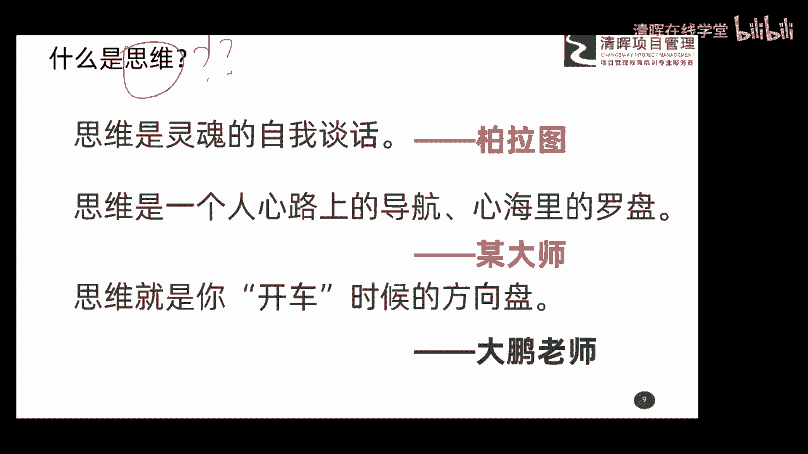
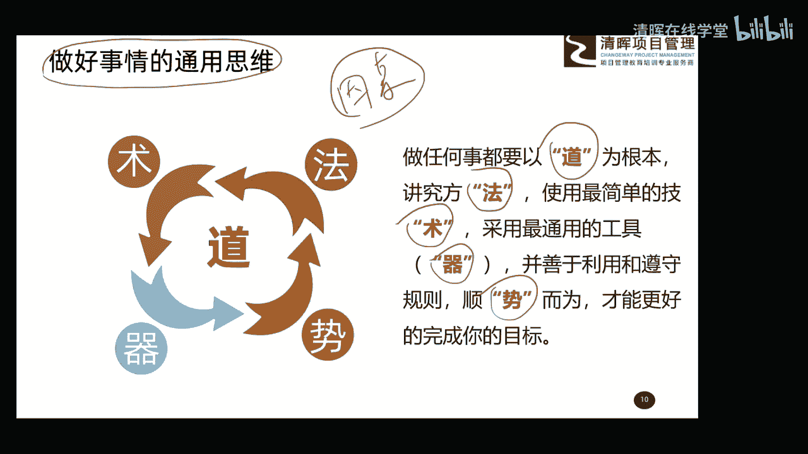
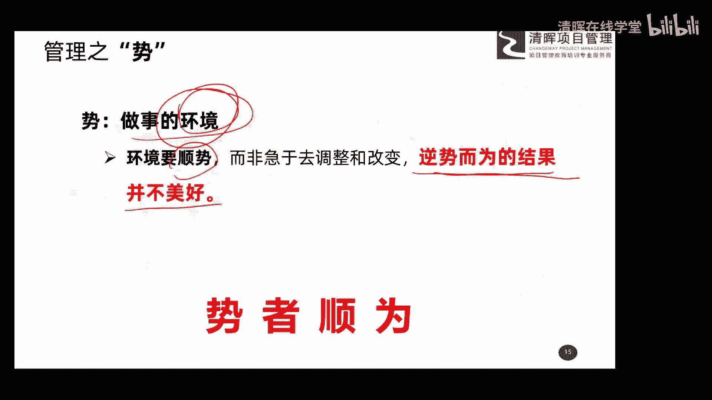
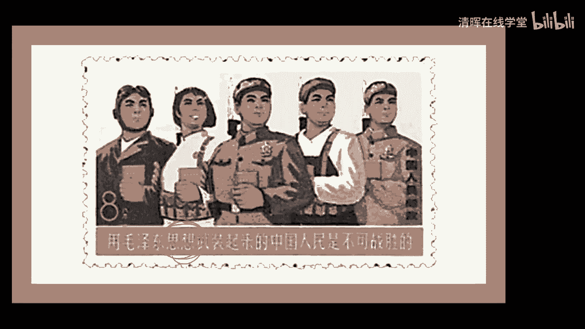

# 项目管理思维和发展趋势 12讲 - P3：3.做好事情的通用思维 - 清晖在线学堂 - BV1Vz421D7kH

好那接下来呢我们就给大家说点干货了啊，说点干货了嗯，说点干货了，好做事的通用思维啊，通事的通用思维呃，有这样一句话叫做自古真情留不住，唯有套路得人心啊，这句话估计大家都熟悉啊，都熟悉，那干什么事呢。

总是要有些套路的，然后这个套路这个词呢估计很多朋友不太清，他觉得哎呀这套路词是不是有点贬义的概念呢，所以呢在我们很多行业啊，特别是在我们这个培训行业呢，我们一般管这个套路叫做思维模型啊。

起了这么一个非常高大上的名字，叫思维模型，那我们项目管理呢其实也一样，有一个啊一套的这个完整的思维模型啊，那这里给大家做了一个我们的总结吧，嗯呃这里我们借用了中国道家的一个思想啊。

就是来源于咱们本土的一个思想啊，啊给大家总结了这么一个通用的一个，做事的一个模型啊，就是做好事情的一个通用思维啊，或者叫一个模型的概念啊，模型的概念，这个模型基本上可以概括呢。

说明了我们要做好事情的几个关键的因素啊，这个其实这个模型呢就是几个因素的一个，汇总的概念，因素的汇总的概念，大家可以看一看，那这个通用的做事模型呢，其实我们可以啊，这个主要的内容呢大家看右边这部分啊。

就这几句话就可以了，他说呢做任何事都要以道为根本，做任何事都要以道为根本，讲究呢方法讲究方法，然后使用最简单的技术，采用最通用的工具啊，并善于利用和遵守规则，叫顺势而为，这才能完成你的这种目标。

也就是说我们做事你要按照这个思维啊，按照这种思维，按照这个所谓的模型呢去做，这样的话效果会比较好，哎这是我们今天要给大家讲的，就是做好事情的一个通用思维的概念，总结起来呢其实就是五个字，道法术器势啊。

这个呢呃可能大家在呃这个呃后期呢，这个可能啊学习过程中呢，你也会发现有些领域呢也会用这样的一个概念，就是道法啊，道法器的概念，但是我是把这个五个东西组合在一起了，道法数据式啊，我用这个东西来解析啊。

我们做项目管理一些思维的东西啊，好，那接下来呢给大家呢详详细细的给大家解析，解析这五个字分别代表着什么意思，你也可以呢跟着我的课程呢这个节奏呢，来来思考一下，是不是你在生活中啊或者工作中啊，做项目啊。

包括其他的一些具体的这个场景下，也是按照这个思维来做的，如果你认为哎，他这个思维就是你做事的这种这种方式啊，或者这种啊这模型，那好，那我们今天就基本上找到了。

我们项目管理思维的东西了啊，好首先我们看第一个字叫道啊，叫道那道呢我可以把它解释为叫做事的理念，做事的理念，也就是说你在遇到一个事情，你在开展一个项目，或者你在从事一个什么，什么具体的一个事项的时候。

你总是有一些唉根本上的一些什么理念，来引导着你或者支配你的，也就是说你这事儿怎么办啊，怎么去开展啊，如何去开展，你总是有一些自己的理念去影响着你啊，正用这种理念的东西呢去影响着你，往前推进这个事。

所以说呢一般不会改变的，我们才叫道，我们一般把这种不会改变的一些理念的东西，叫道表面的情况可以千变万化，这没有问题，但是核心的这个理念我们是很难去改变的，所以大家知道这是道的概念啊，这是道的概念啊。

那关于道德这个概念呢，其实大家呢啊听我刚才的解析呢，应该有一个有一个认识了啊，这里呢便于大家呢这个去记忆和理解呢，也给大家总结了四个字，叫道者不易，也就是说你要做好一件事，你的核心理念首先要找到。

然后把它确定下来以后，要坚持这种理念，按照这种理念的指导去做事，这个过程中呢一般不会去改变，除非你这个理念是错误的，所以你知道者不易，道者不易，道者不易，不去改变它啊，这这大家搞清楚是这么一个概念啊。

好接下来给大家说说这个法，这个字法这个字，但这个法呢我把它解析成做事的流程啊，不是方法啊，是做事的流程，后边有方法啊，后边有方法，这是做事的一个流程好，那做事的流程大家看一下。

那做任何事其实都是有流程的，那这个流程怎么去定，那有些朋友说老师那流程能不能完全一模一样，那有些老师说那流程能不能有差异，我给大家说说流程要根据现实来确定，这说的什么意思啊。

什么叫流程要根据现实来确定啊，也就是说流程不可能一模一样，你是A公司，你是B公司，你是C公司，那好每个公司都做营销，做销售，那你们销售的流程可以有相似的地方，但一定根据美公司的这种差别。

美公司它自己的特点它会有一些区别，所以呢流程要根据现实来确定，根据具体的场景参考最佳实践，也说以前啊我们这个行业其他公司啊，这么做效果挺好的，那我们是这个公司的这个后来者。

我们也可以参考前面的一些人家的流程，对不对，所以呢参考最佳实践，制定符合当前场景下的管理流程，所以大家知道倒是很难变化的，或基本不变的，但是这个法，这个流程要根据我们当前的这个情况来确定。

这个不是不变的啊，这个大家一定要搞清楚，它会变化为大家也举一些例子啊，我给大家举个例子呃，就比如说咱们这次这个新冠肺炎的这个，这个疫情问题啊，我们大家都看新闻了，在我们项目的早期啊。

可能武汉那边那个红十字会呢，对咱们全国啊捐赠的这个物资啊，进行管理和分配的时候呢，有一些问题出现，可能大家呢不是特别满意啊，包括的这个管理的方式啊，然后呢这个分配的方式啊。

然后呢又这个相对来说管理的不够精细，然后呢分配呢又不够及时啊，所以那时候呢这个效率啊效果都比较差，那这个流程呢其实他在管理，咱们说捐赠的物资的时候，这个流程就会就出现了问题，包括我看新闻也说了。

说要去领这个物资呢，还要开单位介绍信啊，你说这个单位介绍信在我们这个80年代呢，可能很多朋友还知道是什么，那九零后今天来的一些九零后朋友，包括可能有些零零后朋友，什么叫介绍信。

估计他他这个脑子里的印象都不是特别清晰的，所以这个管理这个流程呢就出现了一些问题，后来呢全国人民都在反映，后来呢这个湖北呢啊，这边呢也吸取了这样的一些教训啊，也听取了大家一些意见。

所以呢引入了一些这个企业啊，这个库存包括物料管理，一些良好的一些看法和实践进行，比如说让那个叫啊90通吧，应该是这个企业，然后呢做了一些这种啊，后期的这种啊管理流程的规划，包括呢管理软件的这种应用。

那你看这个效率和效果就上去了，对不对，后边就顺畅很多了吧，现在大家不觉得这个物资管理呢，现在哎是个问题了啊，因为这事已经解决掉了，所以大家看一下这个例子啊，所以说你看当前的一个场景下，你采用流程。

那好如果这个流程呢不符合你管理的要求，或不符合你管理的这种场景，它一定会阻碍你的管理，那你就要改，你要根据当前的情况去改，找到更好的方法去配合这种当前情况的开展，所以这个流程呢大家知道这叫什么。

可以变化的概念，要根据当前情况呢去来选择去优化，所以给大家总结了四个字，叫法者实意法，刚开始给大家讲的流程，实意什么，根据当前的情况去改变，去选择去优化，就是这么一个概念，所以做任何的一个事情。

包括项目也好，包括其他事情都要有流程的啊，这个流程的概念，现在这是给大家讲第二个东西啊，叫管理的法，管理的法好，然后呢第三个叫数啊，这个数呢我给他解释成叫做事的一个技术。

那做任何的事我们都要用到一些技术啊，包包括我们说项目也好啊，生活也好啊，各种各样的事都要有一些技术，那个技术呢大家记住这么一个关键点，技术要简易，越简单越好，我不知道有没有朋友呢听过这样一个法则。

叫kiss法则，在这kiss法则呢，就是告诉大家一个非常简单的一个理念，叫做越简洁越高效，越简洁越高效好，那这个树呢其实讲的就是这个概念，我们使用的一些技术呢一定要尽量简洁简易。

这样我们在实际这个操作过程中呢，才具有可操这个可操作性啊，可操作性，比如说呢咱们说这个现在各种战斗机上啊，咱们说那个在遇到紧急情况下，那好啊，都有一种装置叫做那个这个啊逃生座椅啊，也就是说啊遇到故障了。

或者是在战争中的受损了，哎我们的飞行员呢通过这个逃生，救逃生座椅呢来逃生，那好，那我们在设置这个逃生座椅的这个功能的时候，那好那一定要做什么最简洁的设计，也就是说我们的飞行员按一个按钮好。

我们就可以弹射出来逃生了，对不对，那你不能说我按按了A按钮，然后再按B按钮，还得按C按钮，后边的D和E要一起按，还要拉一个什么什么什么才能逃生，那你看飞机到紧急情况下，如果你这么做。

那它一定会影响我们最终的结果，所以大家知道技术呢尽量要什么简单越简单，其实越高效，那我们在整个管理过程中呢，用到一些技术呢，大家也要啊本着这样的一些思维呢去选择应用，越简单越高效，不要搞。

那些特别复杂的事啊，特别复杂的技术，其实那效果不一定很好啊，好这是第三个字叫树啊，大家了解一下，总结了四个字叫术者简易啊，说的就是这样一个概念好接着呢第四个字叫气，这个气呢不太好理解啊，嗯大家看一看。

给大家说的叫做事的工具，刚才给大家讲的是技术啊，技术一类技术是一类啊，我们做事的一个啊工具的汇总吧，或者是工具的一个汇总的一个说法吧，那气就是具体的一个一个工具了。

通过这些工具来达到我们啊想要达到的一种效，果或结果，所以呢这个气叫做事的工具，那这个工具呢要有通用性啊，这个通透性呢对工具来说非常的重要啊，也就是在我们的项目中啊，不管你的项目呢是哪方面的。

是it类的也好，是建筑类也好，是制造类的也好，还是你这个项目的规模非常大也好，赫尔纳规模相对来说呢非常小也好啊，我们都可以什么来使用它，比如说我们有一个工具叫做啊，鱼骨图或者因果图，他那主要做的啊。

这个内容呢就是分析我们的根本原因，那好那你什么类型的项目，我都可以用鱼骨图来分析，项目中遇到一些问题的根本原因吧，那好我不管你规模大也好，你是三峡工程也好，还是我做的晚饭也好，反正我遇到问题了。

我都可以用这个工具来做这个分析，这就是所谓通用性的概念，而且呢不管是你在项目早期也好，还是项目中后期也好，只要发生问题的，都可以用这个工具，所以它是个通用可以反复使用的概念。

所以我们在整个项目管理过程中呢，唉这个用到的工具呢，大家会发现绝大多数都是这种可以反复使用的，这种通用性的工具，而且这些工具都非常的简单，都非常的简单，这就是做事的工具叫气的概念啊。

这边呢也给大家总结了四个字，叫气者要通用，气者要通用啊，好最后一个字叫做事，这个事呢叫做做事的环境，做事的环境嗯，做任何的事情啊，都有环境的约束和限制，我们尽量呢叫顺势而为，而不要急着去调整和改变啊。

这种环境，那很多环境上的内容呢，也是我们在项目层面上无法去改变的啊，有句话大家记住啊，叫做逆势而为的，结果并不美好啊，大家看最近的一些新闻，也看到了，现在全国呢其实很多城市呢。

这个关于新冠病毒的这个防疫的这个场景呢，其实还是蛮蛮紧张的啊，所以呢有些呃这个咱们说反啊，这个复工也好啊，这个返程也好啊，唉我们到了这个当地啊，都可能会被当地的这个政府部门啊，要求呢进行隔离啊。

进行隔离，居家隔离呀或者是机动隔离，那好大家看有些新闻说哎我们在隔离的时候呢，我们不听从这种指挥啊，我们闹事，哎我们服从这种政府的要求，是不是一种逆势的概念呢，那好现在呢整个防疫呢是中国中。

中国现在目前面临着非常重要的一个事情，那好你不听指挥，你去啊，去违反这样要求，你是不是在逆势，那你看逆势的结果是什么，国家指定要强制你呀，对不对，要强制你，你不听啊，我的要求你不去这个隔离。

那我就强制你跟你去吗，隔离我给你拉到一个固定的点，你必须隔离，有人看着你，所以逆势的这个耳垂的结果呢非常的不好，所以呢整个项目管理过程中呢，大家记着啊，我们一定要考虑做事的环境，然后一定要什么。

以顺势的方式去来这个开展工作，千万别做这个意识的概念啊，那关于这个事呢也给大家总结了四个字，叫逝者啊，氛围啊，一定要去顺应这个，这个是后期呢我们在今天的课程中，后边呢也有一些讲关于向管理发展趋势的。

这块的内容啊，那这块的内容跟我们这个市呢是一个概念，一个概念啊，后面有几张专门的PPT，来给大家聊这个趋势的内容啊，大家到那块再重点关注一下。

好这些内容呢给大家讲完以后呢，其实想给大家分享一个概念，就是说我们做项目也好，做事也好，总是要有一个通用的思维的，那这个思维大家如果找到以后，然后你把它在哎应用起来啊，把这个事情啊在在这个具体工作中啊。

在具体事中呢你把这个思维给它应用起来，它就会产生比较好的一个效果，会比较好的一个结果，大家看这张图啊，这张图这张图呢其实我在网上找了好久，也没有找到特别清晰的啊这么一个内容，因为这个可能时间也比较早了。

而且这是一个邮票的这么一个一个一个内容啊，一个邮票，所以呢不太清晰，但是大家看一下这张图呢，其实底下有一句话想给大家分享的回答，念一下啊，中国人民是不可战胜的，大家看这有个概念啊，这说的什么意思啊。

这句话呢其实也是告诉我们，咱们现在国家的这种大好的基业啊，当年呢其实就是按照这样的一句话呢，1。1点去打下来的啊，从我们的这个侵略者手里，1。1点去打下来的，那以什么为指导的呢。

哎那你看如果不按照这种思想，可能的没有我们现在这种场景了，对不对呀，那按照这种思想呢，我们实现了现在的大好的基因接触式思想的，一个一个对我们的一个影响啊，或者思维对我们一个影响啊。

呃所以说呢不管是工作也好啊，生活也好啊，先有一个正确的思维或者是思想，然后按照这个思想去做事啊，结果都是挺好的，大家也有一些体会啊，是应该是这样一个道理啊，那也不容易呢。

我们在这过程中出现了一些偏差和问题啊，也不容易失败啊，这就是我们所谓的给大家说的思维，或者思想的这么一个价值吧，大家可以稍微呢跟着我的思路去思考一下，你看你的工作中或你的生活中。

有没有一个非常清晰的思维，或者非常清晰的思想来指导着你去工作，去生活，去往后的发展，如果有啊，非常这个这个相对来说非常的幸运啊，你可能在后期的工作中啊，生活中呢可能非常的轻松，发展起来也会非常的容易。

目标呢可能会更容易达到，如果呢你每天呢嗯生活的比较混乱，工作起来也没有什么思路，那可能你在这过程中呢，真的会遇到很多的障碍啊，包括很多的困难，所以呢建议大家呢你捋一捋你的啊，生活的思维或者工作的思维啊。

把它搞清楚啊。

