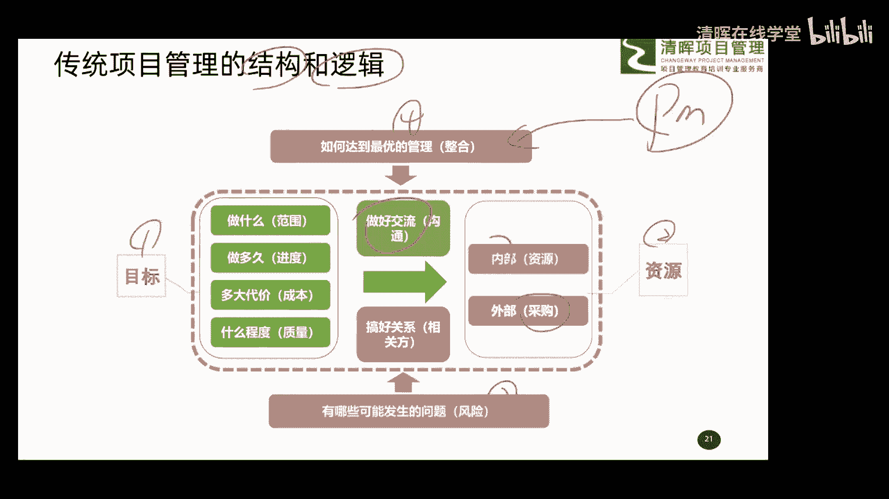
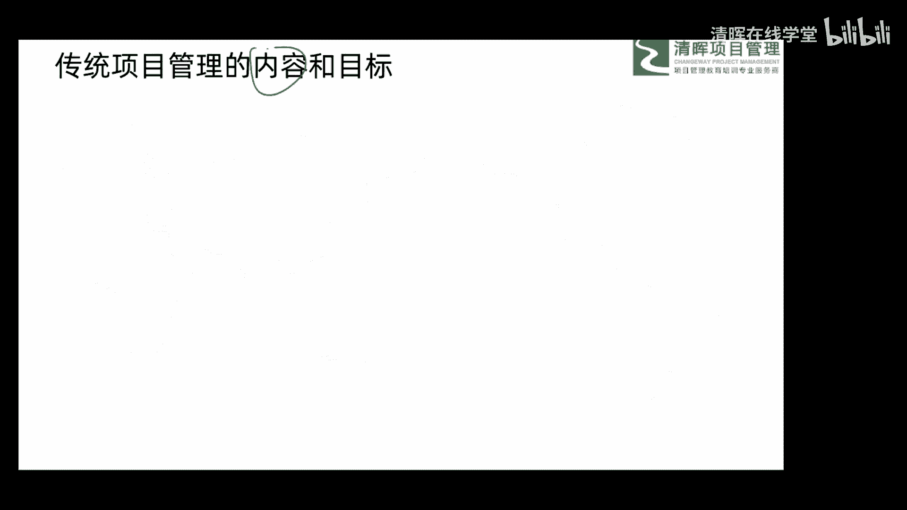
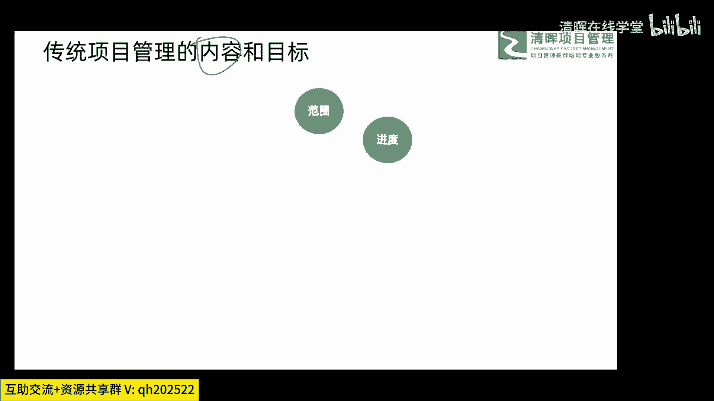
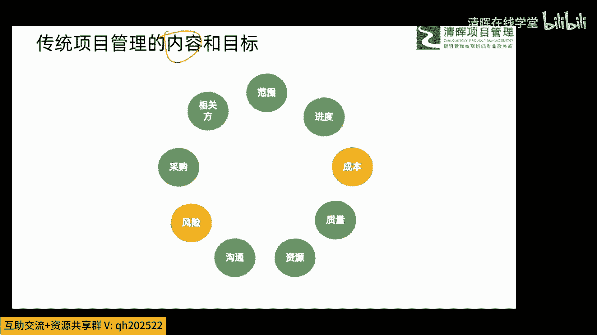
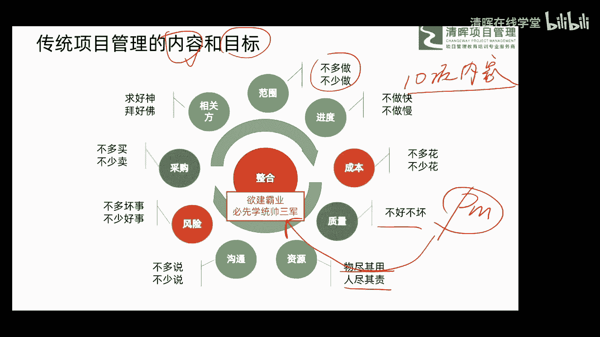

# 项目管理思维和发展趋势 12讲 - P6：6.传统项目管理的内容和目标 - 清晖在线学堂 - BV1Vz421D7kH

好大家搞清楚以后呢，再给大家介绍介绍，我们传统项目管理的内容和目标，这个呢也其实很简单的一个概念，也就是说我们传统项目中你在干项目的时候呢，你的工作内容有哪些啊，每一项工作内容的目标有哪些啊。

这个给大家用一个呃，我总结一小小小小小小模型吧，展示一下就可以了，好首先我们看内容，首先我们看内容。

看内容范围啊，每个项目都要有范围的概念，也就是说你在这项目过程中呢，你不可能不考虑范围的事啊，所以范围呢是我们整个传统项目管理中的，一个重要的内容，然后呢进度啊，进度啊。

成本啊，成本质量也算吧，嗯然后我们所需要的资源唉，然后所需要的沟通，然后可能相关的风险采购，还包括相关方，这都是我们在整个传统项目管理过程中呢，要管理的具体的一些内容，然后这些内容大家发现你看这一圈哈。

哎为什么把它搞成一圈啊，嗯为什么搞成一圈啊，因为中间还有一个啊，这个是属于总咱们说这种。

咱们说呃这个汇总的概念，所以中间还有一个啊，我们管它叫整合，也就是说我们在整个传统项目管理过程中呢，有十像的内容哎，有十项的内容呢，大家要什么去管理关注他啊，有十项内容去管理关注它，还叫为进度成本质量。

资源沟通风险，采购相关，还有一个叫该这个整合的概念，所以内容的事大家搞定了，然后再看一下每一项内容，我们管理的目标，这个大家了解就可以了啊，今天也不展开，所以你稍微了解一下行了，那好我们先从范围开始。

那范围管理好我们目标是什么，大家可以思考一下啊，范围管理好我们目标是什么，给大家给大家这个十秒钟，大家思考一下范围管理目标是什么，监督管理目标是什么，成本管理目标是什么，包括质量资源沟通风险，采购双方。

还有这个整合，你都分别思考一下，大家可以把你的思考结果呢打到我们讨论区啊，我我看看大家是怎么想的啊，那也就是关于这些内容呢，大家看一看你的管理目标是什么，就是范围管理，这个管理员管理好以后。

你最终要达到什么样的一个结果，哎我我喝口水啊，好，大家把你的一些这个思考的结果，来发到我们讨论区，那什么叫范围管理，最终的一个很好的一个结果啊，最终达到一个结果是什么呢，进度管理呢，成本呢。

质量资源沟通啊，分别都是什么呀，这么一个结果啊，等一下啊，等一下大家，嗯讨论区啊，大家可以发到讨论区，这个呢其实我想给大家引导是什么意思呢，就是说哎你要明白你在做项目管理的时候。

特别是在这种传统的这种场景下，你干完这件事或者干完这类类，干完这类事，那好你最终要达到什么一个场景，这样才是OK的，这样才是咱们说达到了我们的要求的啊，我看有些朋友说那个省钱啊，这个不蔓延啊，时间短啊。

时间短范围就正好符合诶，呃其实差不多啊，差不多大家说的都是挺有道理的，都挺有道理的，对不对，哎手机记录啊，成本是成本最优啊，啊非常好啊非常好啊，嗯都快好省啊，嗯范围主要是合同，符合合同的要求啊。

尽可能贴近目标，都不错啊，都不错啊，好那我这个由于时间关系呢，就不给大家过多的去这个这个时间去思考了，我给大家分享分享我们的总结啊，我们的总结范围呢给大家总结叫做不多做，不少做，不多做不少，做。

该做的事我们要做，不该做的事一概不做，所以呢有些朋友说叫边界的概念对，就是边界的概念，边界内的事我们该干我都干，边界内的事一概都不干，哎这是范围管理最终的一个啊这样一个目标啊，这种目标，那进度这块呢。

有些朋友说老师那是越快越好是吧，对于这个项目在这个这个周期越短越好，我告诉大家，进度这块儿不是这个越短越好的概念，进度叫做不快，做也不慢做，你在传统项目中，你不做好了一个计划吗，你不做好了一个计划嘛。

对不对，这个计划诶十个月你就按照十个月去做就行了，太快了也不行，太慢了也不行，这个其实很有道理的，比如说大家现在出门都坐高铁，对不对，那高铁有运行时刻表，到哪块，哪个时间到哪块儿都是定好的。

你说你跑的太快了，那好你到那块了，人家那别的车还没走呢，你就没法进站，对不对呀，你太慢了也不行啊，后边说着追上你了，对不对呀，你这当不道的呀，对不对，所以呢进度要不快也不慢。

你就按照定好的这个进度的节奏去，按按时交付就可以了，这是关于进度管理的最终目的，成本呢就不多花不少花，这个呢其实很多朋友可能会有一些自己的想法，说老师那少花点钱不好吗，我告诉大家啊。

有些钱你是不能省的啊，有些钱是必须花的，这必须花的钱呢你一定要花，你一定要花，你不能去省那些不该花的钱呢，一概不花，这叫不多花不少花的概念，也就是说一个计划做出来以后，哎我们项目要花10万。

这10万呢都是应该花的钱，那都要去花，别去省，你省了以后，那你就叫偷工减料了嘛，对不对，除非你计划算真有问题是吧，你估算不准，那你可能再说这种偏差，如果你计划做的没问题，你在这过程中省钱。

那不是偷工减料嘛，对不对，所以呢成本就不多花不少花，那质量呢叫做不好坏，什么意思啊，你只要达到他的要求就可以了，你别想着哎我做完好以后，他会非常非常的满意，他会跳起来的那个满意其实很难做到的。

即使你做到以后，你会成本会非常高，对不对呀，所以我们做项目的时候呢，没有必要啊，做到那么多程度，哎，他要求什么呀，你就给他做到什么样达到他的要求，这叫什么不好不坏的概念，所以呢质量管理者不好不坏。

大家理解了吧，然后资源管理这块呢，因为资源呢分成两大类啊，有些叫人的叫人力资源，有些是物的，叫这个叫啊食物资源，所以呢叫物尽其用，人尽其责，什么意思啊，那些食物资源你要把它用好，让它的作用体现出来。

那些人力资源呢，你要把它用好，让他的职责呢发挥出来，所以这叫物尽其用，人尽其责啊，然后关于沟通这块呢非常简单，不多说不少说吧，该说的说，不该说的不说，我们一般管它叫做四个正确哈，在正确的时间。

把正确信息以正确形式传递给正确的受众，而产生最好的结果，这叫做沟通的概念啊，不多说不少说的概念，风险这块呢，可能很多朋友呢稍微有一点这个这个啊，理解上的这么一个困难啊，我们在项目管理中呢。

关于风险呢是分成两个不同的这个维度的，一个是呢发生以后呢是个好事儿，也就是我们通常说的机会啊，一个是发生以后呢是个坏事，通常我们管它叫威胁，所以关于风险管理这块呢，其实也是这两个维度啊。

我们对这两个维度的管理叫做坏事不能多了，好事不能好，不能少了，这不多坏事不少好事，只要能达到这样的一个要求，你风险管理就合格了，采购这块是买卖吧，对不对，所以呢叫做不多买不少买。

该买的我们买不该买的坚决不买，大家记住啊，在项目管理过程中，千万记着，那不能随意剁手啊啊不能随意剁手，一定是该买买不该买的绝对不买，就是采购双方或者肝悬啊，消方或肝选，他这个比较特殊。

凡是跟项目有关系的人啊，或组织都叫做干预学院或者相关方，对他们呢其实管理学非常难，我在前两天呢，分享了一个关于肝肾管理的，一个实战的一个小讲座，可能不知道这次有没有朋友听过那个讲座。

所以在那块会给大家讲的，关于肝神管理的一些理念的东西，我们给大家总结了一下，叫求好神拜好佛，也就是说，你把所有干神呢都要当成神佛一样的对待，哎哎把他们呢这个都管理好，那好这神佛呢他有他自己的能力。

他有自己的影响力，就会帮助你这个把项目做得更好，我们推进起来会更容易叫求好人，拜好佛是关于肝神管理的最终的目的吧，目标然后中间剩个整合吧，中间剩个整合，那这个整合呢其实是我们谁呀。

这个pm项目经理的你的职责了吧，哎那他呢也给大家呢，哎这个呃这个总结了一句话叫御剑霸业，必先学会统领三军，所以你pm是干嘛的，你不是干具体活的呀，外边一圈的这一圈的酒类活，你都可以让别人去干，你干嘛。

你就在中间哎坐坐坐在中间唉，指挥大家去干就行了，只要大家都听你的，都能把他的所负责的活干好，你就成功了呀，所以呢哎我们PM是在这呢啊做整合的，叫遇见霸业，必先学会统领三军诶，这是我们整个传统项目中啊。

这么一个主要的内容和目标可以搞清楚啊。

