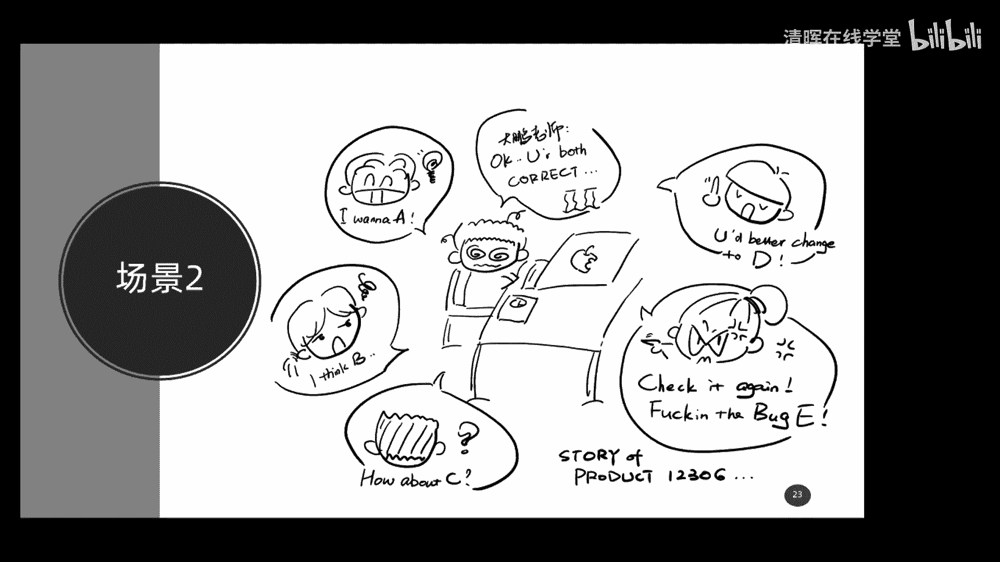
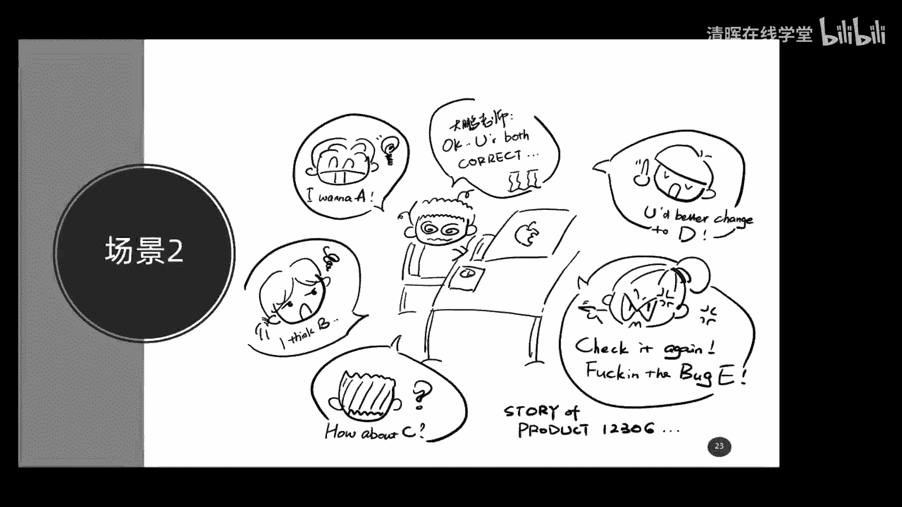
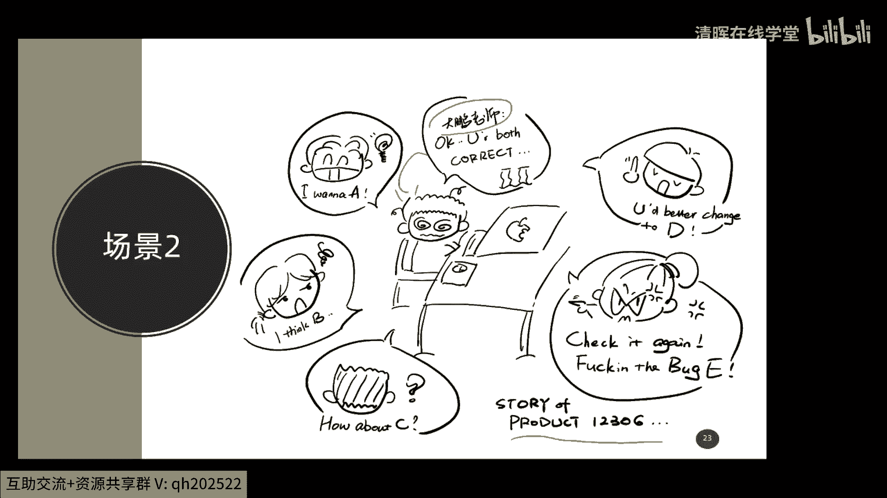
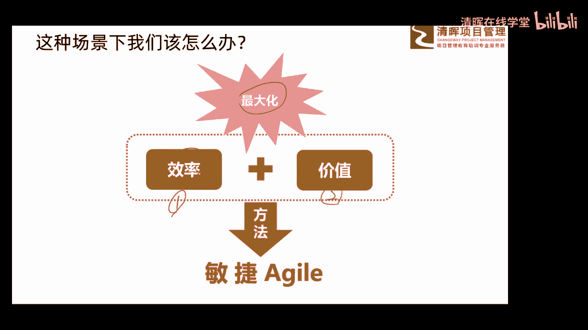
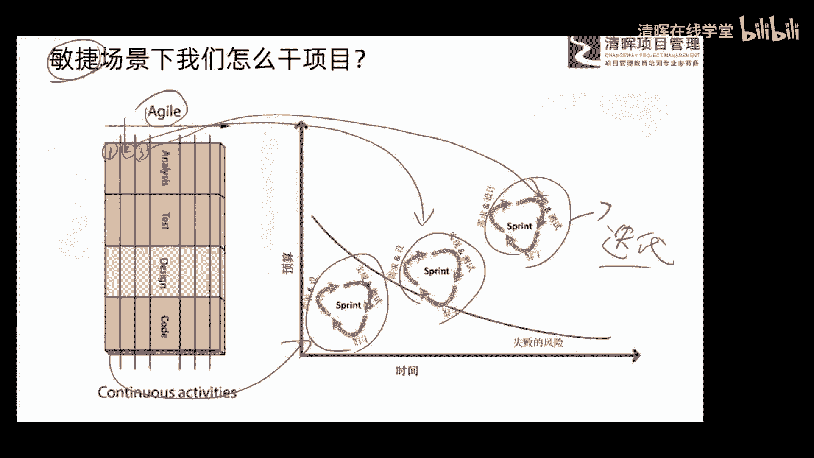
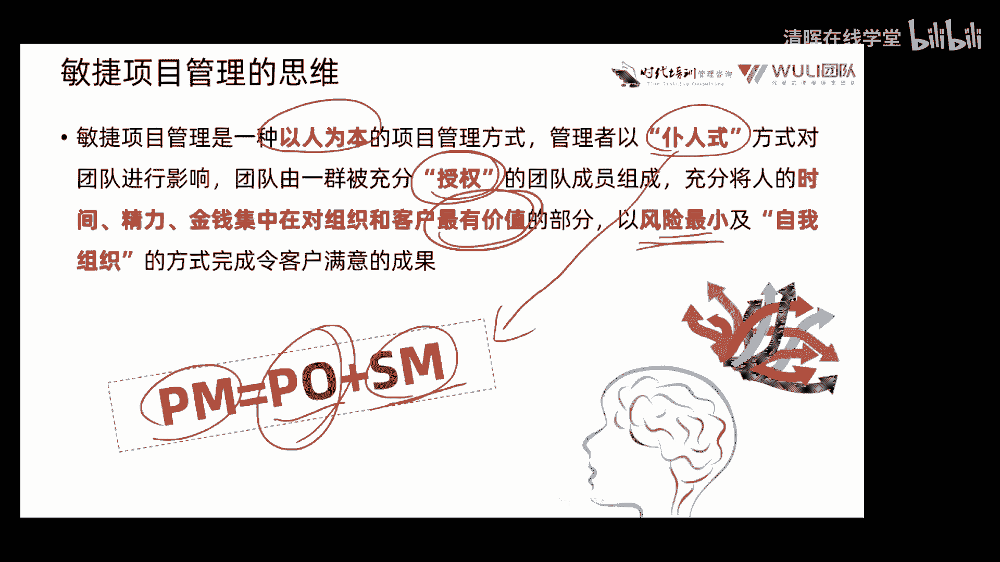

# 项目管理思维和发展趋势 12讲 - P7：7.敏捷项目管理的思维 - 清晖在线学堂 - BV1Vz421D7kH

然后大家看第二场景啊，这是又是我们的尤老师，给我画了一个一个漫画啊。

大鹏老师在哪里，大鹏老师在这啊，导航老师在这了，现在我们干什么呢，不是盖大楼了，我们也不盖大楼了，我们现在呢做个项目，1230612306，这个大家都用过吧，这样一个买票的这个手机app。

那我们说干这个事儿，干这个事的时候，大家看一下我们应该怎么干，你看给大家画了一圈哎，好多好多的这个所谓的这个用户客户啊，每个人的脑子里都有不同的想法，每个人脑子里都有不同的想法吧，对不对，诶。

然后我们在这过程中呢，诶要不断的去什么了解他们的想法，然后这个想法呢还不断的在变化，有些想法呢还有互相之间有冲突，而且我们在过做的过程中呢，唉总是不能做的，唉一下做的那么完美。

那这个时候你看我们这个场景，和我们那个第一个场景盖大楼就不一样了吧，看来可以怎么干，做好计划，按照计划去干，然后检查验收交付，那我们现在做12306，大家都用过，你会发现它可不像大概盖大楼一样。

还有全做完以后再交付的吧，你看我们这个12306，应该有小10年的这么一个时间了吧，你看不断在升级，不断的在优化，在改进，所以它是另外第二种干项目的场景，这种场景下唉，我们和第一种场景干法是不一样的。

思维也是不一样的啊。

好接着呢给大家呢这个分享一下，我们在这种场景下我们应该怎么办呢，这么一个概念啊，那我们说现在呢有好多好多事需要我们去做啊，你像刚才那个例子啊，一圈人都围着我们去提需求啊，提要求。

那好我们有好多好多事去做，那好那我们自己的精力啊，我们的能力也是有限的，不可能啊，这个在一天之内或者一个周期内都给他做完，所以我们在做这个这类项目的时候，一定要考虑两点，第一点就是你要提高你的工作效率。

第二点叫你要提高你的工作价值，所以我们在有限的时间，有限的精力啊，有限的这么一个呃，相对来说这么一个限制内，我们一定要做那些非常有价值的事，非常有价值的需求，并且呢高效的去完成他们。

所以呢你看效率加价值，是我们应对第二种场景的一种办法，把他俩的最大化，就产生了一种新的方法，叫做啊敏捷，叫做敏捷，我不知道有多少朋友听过这个啊，这个敏捷这个这个词啊，现在这个词很火的啊。

因为现在敏捷的这个这个内容呢，已经深入了各行各业了，最开始他是从IT出来的，但现在各行各业都是在哎敏捷化在转敏捷啊，这个东西大家稍微了解就可以了，所以敏捷是什么，哎。

我们把效率和价值呢进行最大化的一种方法啊，这种方法就应对了，我们说刚才给大家展示的那个场景，二的那种那种场景，而快速的这种啊变更大量的需求，肝神呢这种要求呢还不断的在什么在变化啊，在变更啊。

在这个不断的这种影响我们这种场景啊。

好那我们看一下这种场景下，我们是怎么干项目的，大家还记得刚才给大家讲的那个瀑布模型吗，或者是结合方法吗，哎从1~2到二，从2~3，从3~4嘛，现在我们变了，大家看一下这张图，你看现在我们不是那么干了。

我们现在呢了解到一点需求，我们就把这个需求呢排个顺序，然后把那些价值最高的找出来诶，我们就用一个很短的一个周期把天做了，装完以后呢，我们再继续了解需求，然后再排个顺序，然后再把价值最高的那些需求找出来。

再开展一个小周期，再把它做出来，然后呢继续这么循环，你看我们现在不是线性的了吧，我们现在是一个循环，一个循环一个循环的了，这种方式呢这种循环的东西呢我们管它叫什么，叫做迭代，叫做迭代。

迭代有时也管它叫做一个冲刺啊，在我们敏捷中啊叫迭代唉，通过这种迭代的循环，我们把这个东西这个项目一点一点往前推进啊，这是我们现在新的，应对第二种场景下的一种看法啊，叫迭代的这这种循环的概念。

其实这种方法其实有另外一个说法叫做敏捷啊，那大家看一下这个敏捷的具体看法嗯，还记得场景一的时候，我们是把它放平了，然后呢从前往后一个顺序吧，但你看这个差点下，我们把它立起来了，我们把它立起来了。

然后给它切片，你看到没有，哎那第一片它是一个小的循环，你看第一片是不是一个小的循环，还包括需求设计呀，开发测试啊，包括上线是不是一个小的这么一个循环啊，然后第二篇诶他又做了一个什么循环。

第三篇诶他又做了一个循环，所以呢你会把整个项目切成很多很多那种薄片，就跟我们说早上吃面包那个一片一片一样，每一片都是一个迭代循环，每一片都会产出一些有价值的一个结果出来，那这种场景下我们做项目啊。

这个方法就叫做敏捷，就叫做敏捷，OK吗，来给大家理解一下啊，这是敏捷的一个概念，可能对有些朋友来说呢，这个稍微有点新啊。

好这是关于敏捷的东西啊，那敏捷项目管理的思维是什么呢，给大家稍微分享一下吧，啊呃这也是给大家总结好的，这也是呃不是我个人的总结啊，这是很多大师们的总结啊，说敏捷项目管理呢。

是一种叫以人为本的项目管理方式，那我们在刚才给大家讲到的这个啊，传统项目的时候呢，说那时候是以计划为本吧，也说做什么事要先搞个计划嘛，但是呢敏捷项目管理是以人为本，他不强调计划性。

他要强调以人为本的管理方式，管理者呢用不认识的方式对团队进行影响，团队呢有一群被充分授权的，对授权啥概念呢，以前我们在传统项目中，pm是不是有很大的权力啊，管大家呀，但是在敏捷项目中的这个PM呢。

后面会给大家讲啊，这块有变化啊，那他这个权利被授权给团队了，然后呢充分将我们人的这个时间精力，金钱已经在对组织和客户最有价值的部分，也是它以价值为驱动，不是以目标为驱动啊，刚才我们在讲传统项目的时候。

说一定最终要实现目标吗，现在要实现价值啊，然后呢，以风险最小及自我组织的方式，完成令客户满意的结果，哎我们做的事风险啊，这这个风险越小越好，所以我们要快速的迭代嘛，每个迭代呢哎这个这个因为时间比较短。

内容比较少，然后呢相对来说比较可控，所以风险比较小，然后自我组织是什么意思啊，在这过程中哎，我们是互相之间是什么自我管理的，而不是由别人指指派工作的，所以这是一个很大的变化。

那这个变化主要体现在下边说pm呢被拆了，我们在传统项目中的PM呢是一个管理者，但是在敏捷这种思维下呢，PM呢被拆成了PO加SM，也就是说它一分为二的票呢，他是代表客户的一个角色。

来对需求来进行收集和排序，比如说哪些是要哪些事是要干的，然后这些事之间呢有没有优先级啊，谁在前谁在后啊，这都要干的事，哎然后SM呢它是一个仆人士的这种服务者，大家看这不有仆人士吗。

他给大家提供各种各样的服务，唉然后呢，让大家呢一心一意的踏踏实实的来去工作，然后他不对大家进行这种吆五喝六的指挥，然后大家呢自自己管理我们自己，然后自我的选择你擅长的工作去开展。

哎也就是说团队是自我管理的，SM是给你提供服务的，那PO那是搞需求的，搞优先级的，诶是这么一种组合的形式，这是敏捷的概念，也是在第二种场景下，我们开展项目一种思维啊，大家理解一下啊。

这个可能有些朋友啊这个接触过，有些朋友呢没怎么接触过，大家要搞清楚了解一下就行了啊，因为本身呢今天咱们讲座的这个内容呢，呃还是这个这个框架还是蛮大的啊，所以呢嗯有些东西呢没有办法。

咱们就用这个一个半小时或者两个小时之内，给大家聊得非常到位啊，但是你一定要先有一个概念，在后期你觉得诶这东西适合你，对你来说呢工作啊，对你的工作来说呢有帮助，唉相对来说呢唉你有些处罚啊。

有有一些这种处罚啊，有一些这种感，敢想你都可以什么这个去深入了，再去学习嘛，因为本身咱们说学习的这个资源，现在越来越多啊，你觉得这东西好，你就去学就行了啊。

