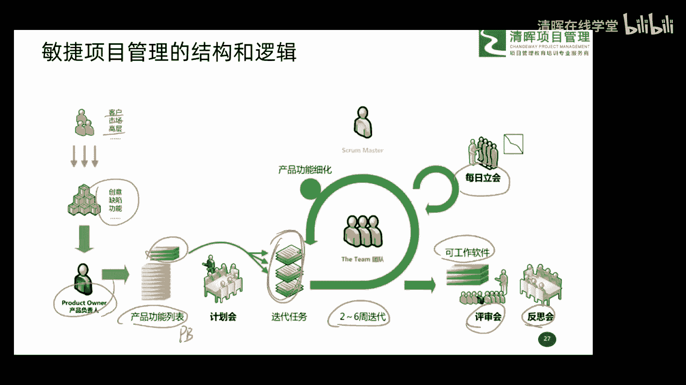
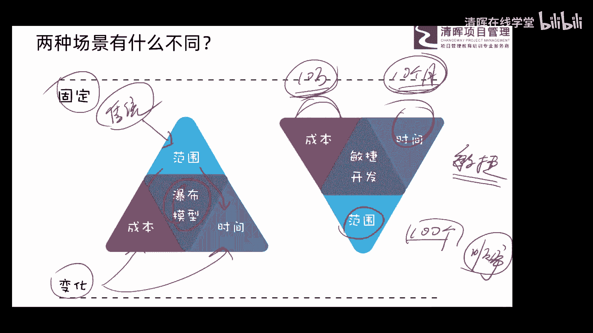

# 项目管理思维和发展趋势 12讲 - P9：9.两种场景有什么不同 - 清晖在线学堂 - BV1Vz421D7kH

好这个给大家聊清楚以后呢，我们再给大家总结一下这两种场景有什么不同，也就是说现在目前来看哈，做项目管理场景一是大量的，也是说占主要的场景，二呢这个份额在一点点提升啊，但是呢还没有什么出现场景三个概念。

所以现在大家如果做项目管理呢，你搞清楚啊，这两个场景到底是怎么干，就基本就可以了啊，那他俩之间到底有什么不同呢，朋友们可以看一看，这里分成叫固定和变化，这个固定指的是什么，这固定指的什么。

固定指的是我们要把什么东西先固定住，然后再再怎么能力，这变化指的是什么东西，会随着我们项目开展来变化啊，所以我们首先看啊，第一种场景，我们说那叫传统的场景啊，传统场景。

传统场景下我们想要什么要固定下来呢，大家看范围，所以说我们在传统场景下，大家在做需求调研的时候，是不是先要把范围讨论特别清楚啊，反反复复反反复复的唉，几轮的需求调研范围先搞清楚，然后范围固定好以后。

根据我们要干的事干嘛呀，我们来排计计划，包括我们的工期多长啊，我们的成本要花多少啊，哎包括其他的一些计划才能出来吧，所以呢这种场景下我们管它叫做瀑布模型，刚才给大家介绍过吧，所以这是我们第一种场景。

传统的产品下的啊这样一个工作的方式，所以呢先固定好范围，然后变化的是什么成本和时间，只要你范围还有变化了，成本时间一定是什么跟着变的，所以说范围先固定好，然后再匹配这个成本和进度的问题啊。

好那第二种场景刚才给大家讲的叫敏捷，那它是什么一个概念呢，大家看一下什么是固定的成本和时间，固定的，我们只有那么多钱，我们只有那么长时间，比如说我们只有10万块，我们只有什么十个月诶，这是固定好的。

现在一个项目来了，那怎么办，我们是不是所有他要求的东西都干啊，我告诉大家，没有必要，也没有办法来满足它，因为我们有成本的元素，有进度元素，我们10万块钱成本约十个月，哎，这个进度约束，那怎么办呢。

好你把你需求什么都告诉我，然后我排什么优先级，我征求你意见，排优先级，比如说你有100个需求，100个需求唉，你有1000个也无所谓啊，那好我把这个优先级什么排出来，它是有什么优先级的，有顺序的啊。

也是顺序的概念，我把你顺序排出来诶，然后怎么办呢，诶我按照优先级的高低，我从前边往后开展具体工作，当什么时候把10万块钱用完了，当什么时候把十个十个月时间也用完了时候，OK这项目就可以结束了。

往后再继续干了，因为没有钱了，没有时间了，那这种干项目的方法就刚刚给大家说的，你觉得概念吧，以价值和效率为驱动吧，最终实现最大价值的概念，所以说你看这种场景下，他首先把成本和时间给它固定好。

然后变化的是范围，不管怎么变，最终的目的是什么，最大化的价值啊，这是一个他们这样一个主要的区别对吧。

这个区别呢嗯理解一下就可以了啊。