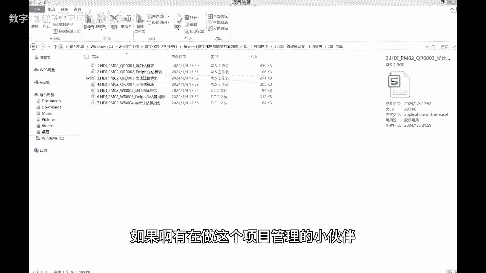

# 项目管理新手PM必备—整套标准项目管理体系化管理模板 - P1 - 数字化顾问张豆豆 - BV1F5411q7rX

哈喽各位小伙伴们，大家晚上好，今天是1月11号星期四，我们在前面啊，分享了好多好多的售前的解决方案，包括一些售前的文档，那么我们说如果说售前的这种方案一旦进入，就是一旦签了合同，进入到项目的管理。

项目的实施阶段的话呢，那么此刻我们就开始启动项目管理的体系化的，整个流程，那其实如果说在一个哦，我们说相对正规的公司啊，那么一般的这个流程都是先是售前，配合销售去打单，那么呃然后呢这个单子进来之后呢。

项目经理就启动了这个项目的相关的立项工作，那么立项的话，比如说项目的成本，项目如果说有相关的采购的话，那么采购的第三三方比价，那么项目地向完成之后，比方像面向过程中，我们会估算项目的啊，人需要几个。

需要投入多少人工贴就是我们要工时的部分，然后计算项目的相关的这个利润率，那么根据这个如果去做项目技能的小伙伴，应该也知道，我们如我们去考这个PMP啊，虽然PMP是一个方法论，但PMP当中项目管理的。

不管是我们说五大过程组，还是啊多少个个过程体系，那这个整个体系的话，如果说对于项目管理的话，呃我们怎么样会有一套就相关这种题画，其实画的非常正规化的流程的文件呢，那在这个基础上。

我们今天来看一下项目管理的，整套的体系化的文档，那么整套体系化的文档呢，总共是包含了从项目的，就是我们前面说从下面的需求的一个需求分析，开始需求的管理表，那么我们在做项目的啊，比如说在立项的过程中。

包括在立项之前，我们要做一些相关这个项目的裁剪工作，那么裁剪是怎样进行的，那么项目的我们总体的计划啊，比如说我们项目的一个啊，这个三峡工程组范围时间进度对吧，那这个项目的开发进度是怎么样子的。

项目的整个生命周期制是怎么样子的，如果说我们要进行项目的相关的估算啊，我们知道就是项目估算的话有很多种方式，比如说有这个德尔菲估算法，有这个类比估算法，就是我们要这个项目的成本吗。

这个成本大概是我们刚开始进行这个项目的，一个立项，之前就立项的时候，我们要估算这个项目的成本啊，我们要算一下这个利润，这个项目到底赚不赚钱嘛，说吧就这样子利润率高还是低嘛对吧，如果利用率比较低的话。

我们要考虑到这个投入的人越少越好嘛，投入一些相关的政策，各种成本，三点估算法对吧，然后下面一个一些估算的一个，我们还有一些相关的规范，包括这个德尔菲法，对于一些德尔菲法的话。

它的估算指南跟一个类比估算法的相关指南，那么这一套文件，我们先来看一下前面的一个需求分析，需求管理表，然后组织级的相关的裁剪跟项目的总体的计划，跟项目的开发计划，跟啊生命周期的指南。

这么一些相关非常体系化的文件，首先第一个需求管理表，这是我们说一套非常体系化的文件，先是从首页开始，就是先从从封面开始，那么既然有需求管理的话，我们肯定会有相关的一些变更的履历对吧，变更的时间。

那谁发起这个变更的，然后我们总总共就是，我们每次如果说有这个需求相关的变更，因为其实啊如果做果项目的交付的小伙伴，肯定知道项目在交付实施过程中，包括我们其实说在下面的这种售前，跟客户对接过程中。

需求其实是一直是不是一个固定的，那这个需求一直在变，包括在这个项目实施过程中的话，客户的需求也许会在变，所以我们才会有项目的，比如一期二期三期嘛，那么他的每一次每一次的变更，我们都要进行相关这种记录。

这是我们说的一个需求管理的体系的文档，然后我们再来看一下，相关一个组织级的裁剪的表，也是先是封面，然后它的变更的部分，然后它的使用指南，项目裁剪是怎样，就是我们裁剪哪些部分，这部分不可以裁剪。

然后对于这些软件项目的话，我们肯定会有项目的一个迭代，然后我们一些相关的一个项目，一个裁剪的一个工作的一个啊，这个非常每个每个部分，然后我们裁剪了一些东西，都要把它在这里列出来。

那第三个方面就是我们这个项目的总体的计划，总体地计划同上，我们还是先第一部分我们啊封面，然后我们变更的部分，然后我们这个项目的大概的一个项目信息啊，这个项目是比如说有的项目它是也许会需要啊。

这个周期是多久，然后这个项目一个是是否需要外包，然后它的这个整个的一个呃，整个他的文就是我们这个项目也需要一些软件，硬件，看看条件，包括项目里的一个需求的来源，包括项目的一个时间对吧，整个实施周期。

然后我们计划了目标的这个质量，那么进行项目的一个就是，我们要在项目的立项过程中，我们需要进行项目的WBS的分解部分，那么WBS的分解部分一般是由pm，也就是由这个项目经理来做。

那么项目经理在进行WPM分析过程中，一定要注意WBS的每一个部分，到最后一定要跟我们前面的，就是我们项目的一个总体计划要一一的吻合，那有的比方项目计划如果说有这个落下的话，在后面的话会比较麻烦。

那所以呢我们在这个WBS在分解过程中，我们其实要跟这个需求管理表的部分，进行一一的对应，然后我们再来看项目人力的部分需要哪些人，对哪些人投多少工时，这个人在这个项目当中他是干什么的。

那然后呢我们这个项目的一个关键节点，那么关键节点的话，每个项目的关键节点其实也属于会不一样，但它总体会包含项目的启动部分，相应的需求部分，下面的计划部分，然后项目的开发部分。

也就也就是我们这个项目的核心部分会有一些，比如说先是我们对于一个软件项目的话，我们要先进行项目的一个设计，然后软件的详细设计，那么设计完之后我们就进入了项目的开发阶段，在项目的开发阶段的话。

也许会有一些不同的迭代部分，那么迭代部分呢，我们要同时进行相关的一些测试，那到最后我们项目完成的第一阶段的话，我们进行相关的交付验收，然后包括项目的结账工作，那这整个部分就是我们要项目的啊。

一个完整的一个啊这个项目的管理部分，那么项目完整的完整，就是我们把它完成之后的话，我们肯定要考虑到项目的交付物的部分，交付物是由PM来准备的，那么交付物的话一般是比如说包括了。

你还是跟我们前面的这个需求部门进行相对应，也就是跟我们合同当中，跟客户约定的交付物进行对应，那然后的话我们在交付过程中，我们进行相关的测试，跟一些啊风险的就是我们跟它相对应起来。

其实风险的管理表的部分其实是在项目的立项，就是我们在立项之前，项目经理应该把所有可能想到一些，风险和问题表都要列出来，然后再往下我们来看一下，然后就是我们说分析啊问题，然后沟通的部分。

这也是我们这个项目的一个整个管理部分，需要考虑每一个节点啊，沟通干系人，然后他的培训部分，然后项目如果有采购的话，包括下面的采购，跟上面一些相关的环境等等等等，这是我们说第三个部分。

就是上面的一个呃总体计划，那么项目的开发计划的话，同上就是我们这个项目开发计划的话，其实是我们在这个立项过程中，它每一个模块也就是其实是跟我们刚才说的，W b m s。

就是它的分解的每一个模块进行对应起来，那么一下来我们还我们还举了这么四个产品的，W b s，就是我们开发过程中的这个相关的啊，分解的WBS子目录，比如说现在我们先引入了这是车联网的项目。

所以我们引入了车端引擎产品，高精度地图，项目管理等整个过程，然后是啊相关一些支架的这个地图的部分啊，WBS的每一个部分的一个拆解部分，这时候然后我们说开发景开发了，计划了一个整个体系文件，那然后呢。

项目的生命周期的这个指南是什么样子的，我们还有一个word的文档来说明，这个整个项目的生命周期的指南是啊，这个二就是我们说总共是两大部分，那第一个部分就是，我们说对于一个瀑布型的项目的话。

我们是怎样进行这个相关的，下面的启动的一个文档，这个文档的话也可以直接拿过来用啊，他是一个就是非常体重，就是我们其实说跟呃，比如说呃在汽车领域的小伙伴，知道汽车领域有啊T16949项目。

那么在这个当中呢，我们有ISO的这个标准体系，那么项目管理其实也是一样，如果你自己去做这些表，或者是这个表不是非常严谨的话，其实你会落下很多的东西，那其实在刚刚我们说在软件过程中的话。

每一个项目或多或少会有迭代，那么迭代的话应该是怎么样子的啊，上面的整个生命周期的指南部分，这是我们说的一个项目管理的相关的几个文档，然后我们还有一个这个相关的一个案例，这个案例的话必须展开呃。

如果有有有需要这个去观察，去去研究这个案例的话，可以啊，这套文件可以在我的工坊进行下载，然后下面的估算部分的话呢，还是这么七个文档，我们呢把啊打开两个文档来看一下，那么第一个文档函数其实跟前面一样。

就是也是一个，这个先先是我们这个下面的一个封面，然后下面的变更，然后项目一个修改的过程，然后下一个相关的产品的规模跟产品规模，我们进行举例，然后我们来看一下，就是比如说我们先就拿一个这个类比估算法。

类比估算的话法的话，我们是怎么样估算的呢，唉我们还是通过一个excel表啊，就是我们这个整个项目的过程，我们说要有可可，就是你可以可追溯，那么怎么样来追溯呢，就是通过这种相关的体系文件进行追溯。

其实在我所在的公司，我们项目管理除了这种相关这种表格之外啊，就除了现在我给大家分享的这个表之外呢，我们还有相关的这种系统，我们有这个BPM系统，我们有AI系统，然后之前我们公司还有用过这个飞书啊。

现在飞书比较贵了，所以我们现在分数不用了，到最后的最后你会发现那些啊系统啊，它是一方面，另一方面你有这么一个excel表的话，其实你走到哪里，你也许有一天你那个系统打不开了，用不了了对吧。

但这个excel表你可以随时的把它拿过来用，就他可以一直可以，伴随着你的这个整个职业生涯，所以我个人觉得这个excel表示必须要有的，而这个表的话如果是非常体系化的话。

真的对你的后期的职业生涯有很大的帮助，这是我们说的一个项目管理的，整个的一个体系的文档，从需求管理开始，项目的预算，项目级的裁剪，然后项目的整个实施过程中的，WBS跟项目的交付。

如果哦有在做这个项目管理的小伙伴。

或者说对这个文档有兴趣的小伙伴呢，可以在工坊。