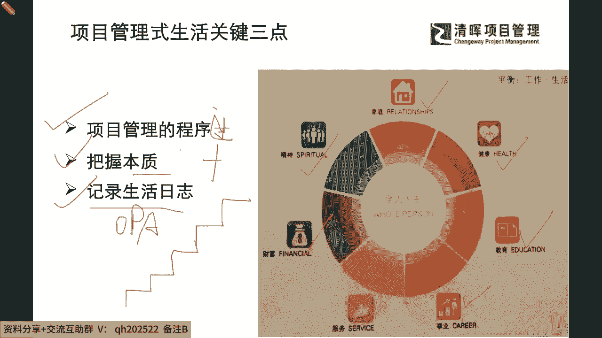
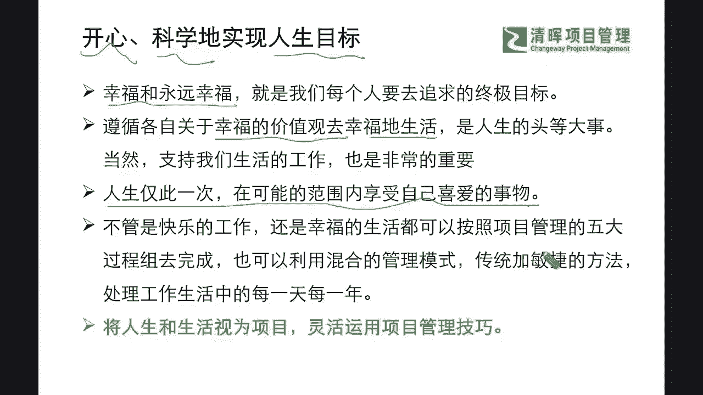

# 项目管理无处不在 - P2：2.项目管理式生活关键三点 - 清晖Amy - BV1YS42197od

来看看那我们的所谓的项目管理是生活，他可能会关注到非常多的层面，但是我们通常来讲，我们希望啊人生终极的一些希望，还是希望我们有拥有一个完美完整和什么，我们非常愉悦的这样的一个，这个植牙的一个发展是吧。

也就是说我们不仅仅要满足一些物质要求是吧，一些健康诉求，还想满足我们的精神需求，财富需求是吗，还有我们的各种的这样的一个希望，我们事业呀啊而且感觉到我对社会有贡献啊，服务意识啊。

以及我们希望去影响到更多人呢，是不是，其实这些点都是非常非常的完善，和大家公知共识的，但是也一样，我们在真正实现它的时候，也是需要一步一步一点一点的去做的，那么我们首先来看怎么样能抓住一些关键点。

就能快速实现我们想要的这种项目管理师的，一些规划的生活呢，那么首当其冲，我们要必须掌握项目管理的一些，必要的流程和程序，那么这是必须去掌握的第一个重点是吧，那么接下来呢我们也会去看到。

在我们的掌握了这样的一个process流程之后呢，我们其实还会去相应的把握很多的一些，本质是吧，那么我们这一点，其实很多的同学就会搞不清楚啊，说这个我们的啊，这个我们的本质到底是啥呀，天天说把握本质呃。

那我们到底应该怎么样做好这一点呢，其实我们等一下也会跟大家来介绍介绍，那么我们能够看到的这样的一些过程呢，我们也会非常非常能够理解到，我们在这样的一个过程，加本质的这个环节当中，我们就会发现。

其实最终啊我们其实人过留名，雁过留声是吧，我们最终是为了干嘛过好我们的一生嘛是吧，所以我们会忽略掉一些几，一些看起来很琐碎的点，但是实际上非常非常重要，那就是如何记录下来。

这个是不是跟我们PMP当时学过的，一个叫做什么组织过程资产这个概念很像啊，因为我们之前讲过的这个opp a是吧，组织过程资产啊，缩写啊，组织过程资产呢，它其实就是用来什么把你企业当中。

把你项目当中的这些过程文件，把它显性地记录下来，并且留存下来，为什么要留存，因为PMP就已经非常明确的去定义，和认识到一点，我们的组织过程资产它是有巨大的什么价值的。

也就是说这个部分我们但凡是能够记录下来，但凡是能够做复盘的，我们一步一步都会变成我们上升的阶梯，那这一点其实会被很多的咱们的一些小伙伴啊，自觉不自觉的忽略了啊，也就是我们通常说我们的孩子的时候。

也会说前学后忘是吧，总是重复一些这种基础的问题，前就前面已经都讲过无数次，后面还是会踩雷，其实我们人生又和我，为啥就是不能去改进这一点，甚至我们又何尝不是此诶这样的一种过程呢。

我们依然可能在重复有很多的一些问题，你可能在30岁的时候犯的错误，依然也是你前面20岁会犯过的一些错误，因为其实实际上你当时也许意识到了，但是你没有想得非常明确。

你应该怎么样彻底把它什么复盘和解决升级掉，所以可能在后续你依然会遇到他是吧，你依然会碰到它，所以在这样的一个过程里面，我们就会发现，那我们的记录这个opp a组织过程，资产有多么的重要。

那我们同样也跟大家来掰扯掰扯啊。

首当其冲，如果我们把我们的人生和，把我们的整个的职涯生活视为项目的话，那我们不妨就把我们的项目管理技巧啊，运用到一个极致，因为我们最终是希望不仅仅达成我们的目标，我们还希望可以什么愉悦的高效率的。

也就是科学的去实现它，也就是说我们其实会需要有一个成就感，会需要有一个这样的一个幸福感，因为我们太容易忽视掉什么，为了成功不择手段是吧，就是我们通常所讲到的，依然我们会说的一句话说哎呦。

即便你已经腰缠万贯，但是你依然可能会不快乐，不开心是吧，但是我们越来越多的我们的一些资深的学员啊，资深的一些小伙伴，我们也会提出一些问题了，我既然想要去成功的来去过好，我的这样的一个职业生活。

并且我也想工作和生活要有一个平衡是吧，我们的生活是不可能全部都是工作是吧，我们也需要给自己留有一丝的留白啊，给自己一丝这样的一个缝隙，让自己可以生出不同的花朵，成长出不同的一些可能。

但是所有的这些都要基于是什么，我们最终是愉悦和开心的，因为人这一生希这个人生苦短是吧，我们还是希望我们能够去获取这样的成就感，能让自己有一个正确的幸福的价值观，去开心的生活，去影响周围更多的人。

也把这个我们周围的这样的一个氛围和环境，变得更加正能量是吧，所以我们希望大家能想明白，也许我们这个人生这个项目啊，你作为项目经理，你也仅仅只有这一次机会啊，人生只有一次是吧。

你只有这一次机会来去进行这样的一个大型，复杂项目的管理啊，甚至项目组合的管理，但是你依然可以掌握一些必要的技能，把你的人生切分成无数的项目集，切分成无数的项目项目，从执行端到协同，资源端到战略端。

你可以尽可能的去做自己喜欢做的事情，做自己目标范围内想去达成的一些事情，让自己的这种什么愉悦感，让自己的成就感达到最高，因为活到最后啊，我们会发现钱永远都不嫌多，你赚钱没够的是吧，我们一般来讲。

我们最终还是希望我们的这个人的一个认可度，我们的一个幸福感，跟我们的财富是能够成正比的，那么不管是快乐的工作还是幸福的生活，我们都希望可以按照项目管理的这样的一个，过程组逻辑去一步一步扎实地走下去。

也可以用这样的一个最新的敏捷式管理的思维，那来去做好我们这个过程当中，应对各种不确定性的一些迭代是吧，来处理好工作生活当中的这种变化，过好我们在人生项目中的一些重要节点。

