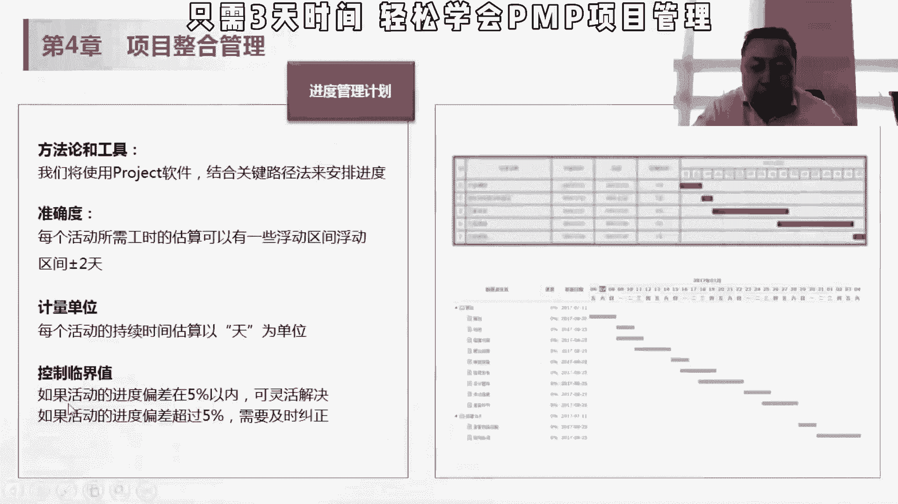
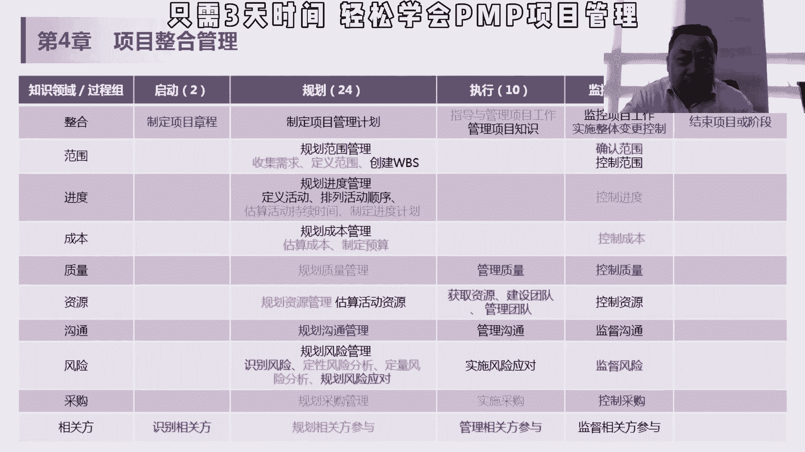
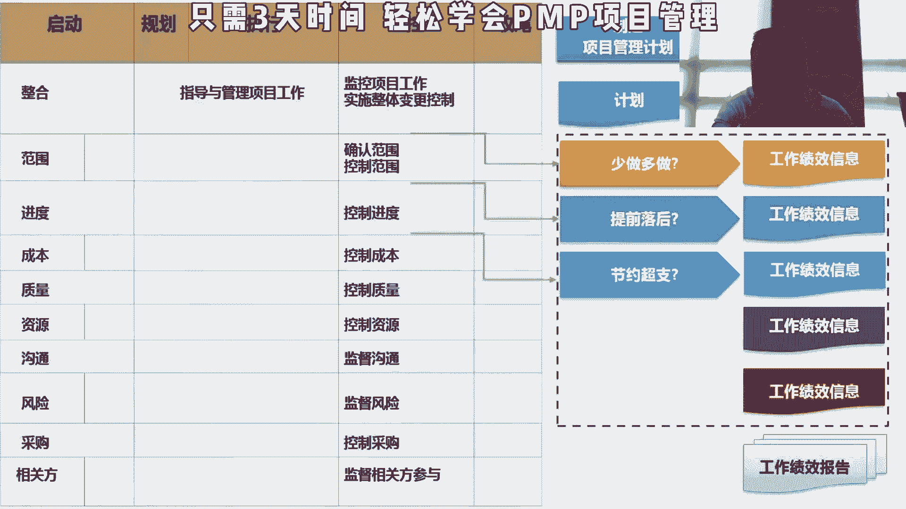

# 项目管理精品课试听 PMP入门教程 小白入行 - P1 - PMP小雪球 - BV1AM4y1E7xb

控制临界值，如果在5%以内可以灵活解决，如果超过5%，需要及时纠正，那在这个监控过程组的时候，我们就要根据我们进度管理计划，当时定的，如果超过5%的时候，就要做具体的这些action了。

如果在5%以范围范围内的话，我认为是ok的，没有必要做做相应的变革，所以这个是我们输入的这个项目计划，然后工作绩效信息，工作绩效信息是什么，是通与工作绩效数据，原始的数据和项目管理计划的这种组件。

项目文件和其他项目比较之后，生成的工作就叫信息，它是跟计划比较之后，我们的偏差是多少，然后我们的这个成本cp i或者s p i是多少，这个cpi和c pi，我们会在第七章讲成本的时候给大家讲。

那会有原始的数据变成通过加工之后，变成这种信息，信息会作为监控过程组的这种输入，最终身份这个报告工作绩效报告。

所以大家可以看一下这个图，我们刚开始是制定项目管理计划，我们得出的是计划，我们指导与管理项目工作，我们得出的是工作绩效数据，那么通过范围去确定，我们少做多多做，跟我们计划数据和计划相比。

我们得到了工作绩效的信息，然后是提前落后，我们得到了我们进度的绩效的信息，节约超只有得到成本的，都是各种的工作绩效信息之后，汇总之后得到一个工作绩效报告，工作绩效报告是监控这个过程组的。

监控项目工作过程中的输出，在这个计划报告我们讲了报告嘛，主要是用来做决策的，是否要采取后续的action pd c a，在这个差点监控的过程中，如果发现问题就要采取action对的基于什么呢。

基于工作绩效报告，所以他的输出是工作绩效报告哈，这个刚才讲过了，那工具和数据分析呢，政治分析，我们会在第七章讲成本的时候给大家讲，偏差分析，这个好理解，就是你实际的这个值跟这个目标值。

你计划的值之间的这个差异，趋势分析，我刚才举了个例子哈，根据过去的这个生产率预测，我将来整个时间或者成本会不会超支，根本原因分析，寻找偏差或者潜在问题的根本原因，这个根本原因的话就是强调的是说。

一定要追到根儿，啊不是说呃有一些这个知道一些表象就可以了，嗯举举一个例子就是呃如果有人发现这个嗯，举个例子吧，就是假设你突然发现你今天坏肚子，然后呢拍肚子也可能有很多原因哈，当然是你可能是吃坏肚子。

或者说喝了不爱喝的东西，这时我们可能就要从这个角度去想，哎我今天吃了什么东西，哪些东西可能会有问题，那我可能会第一部分定义在，我吃东西可能吃坏了，有些东西我吃饭了，我今天吃了几顿饭呢。

我这里放了哪些东西有问题啊，那可能我最终归宿到啊，我可能中午吃了一个昨天热的饭，昨天热的饭里面可能有问题，那具体是哪个菜，都有什么东西，你要找到这个原因，把这个原因剔除掉，才能解决这个根本就这个问题。

当然我我是学坏肚子，我可能是吃药来解决哈，但是我为了防止以后不产生同样的问题，我一定要找到根本原因，所以啊这一类菜的隔夜菜就不能吃了，否否则容易坏肚子，那作为我们将来的一个经验教训去做这个数据。

这个查找根本没有在质量那个这一章节的时候，质量控制里面会有一些关于鱼骨图啊，或者说下面一些根本原因分析的工具，在我们后面再去讲，那备选备选方案的这个分析，就是说我我一旦出现偏差了之后，我该怎么办呢。

对吧，刚才讲了那个呃我我出现了，选择纠正措施和预防措施吗，我现在体重是呃，到这体重是170150的时候，我现在是160，那我大概是选择吃减肥药啊，我还是选择去健身还是捡漏，我少吃主食。

少吃热量高的东西对吧，这个属于纠正原因的备选方案，那预防呢也是一样的，那么我还马上就要超了，我，我怎么办，那通过这些备选方案分析里面去选择一个方案，然后呢进行我们的项目的工作成本效益分析。

这块说是成本最低哈，其实准确来说应该是成本的，这个编译效率最低的这样一个方案，就我们考编辑，如果我们每天复习一个小时，按照我给大家做的计划，把这些东西做了，每天复习一个小时，你可能假设你可以避风飘过哈。

就是基本上能能够记得，然后你说我想要3a，我说我每天要两个小时，我刚开始这个人过程和这个和环境，这个东西我都要百分之拿a我可能两个小时，但是你说我一天花五个小时学p m p，考p mp有没有必要。

没有必要嘛，你后来多花那三个小时，其实并没有带来额外更好的这个效果，所以你不可能去投五个小时，在这个片区的学习下，你可能根据自己的需求哎，我有一个小时也ok，两个小时也ok，我只是举个例子啊。

并不是说一定要学一个小时或两个小时，但我个人认为就是每天超过两个小时，就p n p是不需要的，除了是做模拟考题的策略哈，我要短时间内集中做大量的这个题目，所以这个就是成本效益分析。

我们选这个一定要选一个临界点，我们这个边际成本最低的这个点，然后来作为我们的方案来纠偏决策角色，主要投票一致同意所有人都ok大多数同意，50%以上的人同意相对多数原则，如果有多个方案的话。

a b c结果选a的人40%，他没有超过，大多数也都是一致同意，然后另外两个方案的话都是30%，那我根据相对多数原则可能就会选a啊，这个就是一些简单的这个决策投票的一个方法，或者说这个决策机制。

这个就是我们讲的这个监控项目工具，项目工作里面的工具与技术，啊这一章主要的就是讲我觉得，4。5吧，没有什么太主要的这个点。

4502或4503，这个相对来说考会考，但不也不会会重点考，最重点的就是4。6和4。7，4。641定会考，而且会考大量级的这个大家一定要重视，实施整体变更控制，就是项目里面谁最不愿意变革。

你肯定是项目经理，的，你想你你客户愿不愿意变更，肯定可以的，客户肯定愿意变更吗，我想按照我的要求，按照我的功能，我的进度就走对吧。

