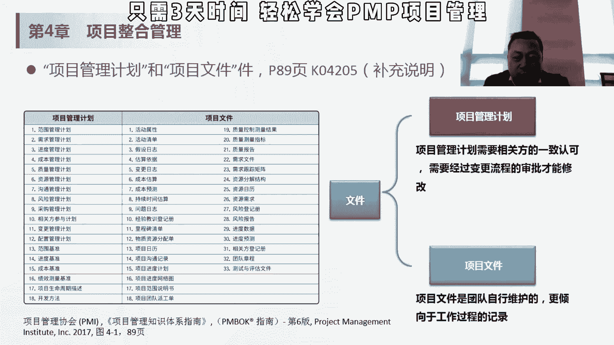
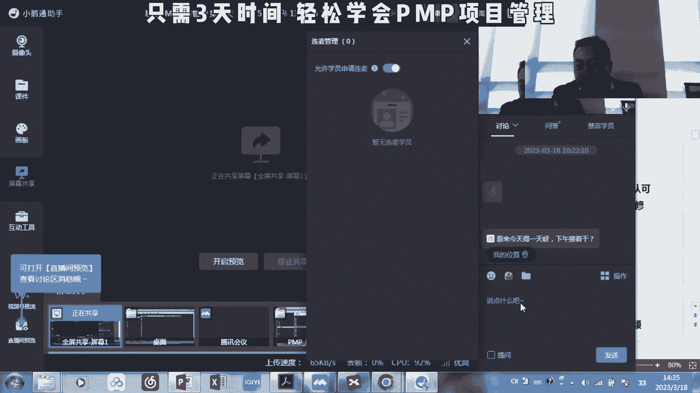
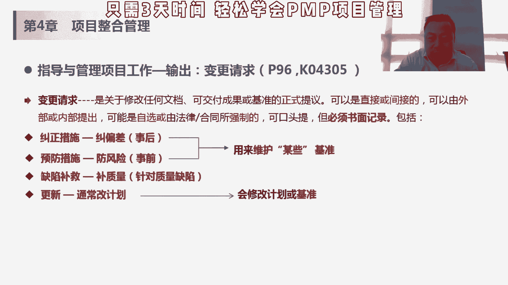

# 项目管理精品课试听 PMP入门教程 学习视频 - P1 - PMP小雪球 - BV1Gu41187r6

然后呢对于计划的这个变更，要走变更流程，那项目我们讲的项目管理计划，还有一些项目文件，它有什么区别，这个我觉得大家嗯这个也是一个考点哈，但是理解就行，项目管理计划，刚才我们讲了那18个对吧。

12个计划加三个基准，再加三个，其他的主线涉及到他们的变更，一定要走变更审批的流程，项目文件是团队自行维护的，更倾向于工作过程的记录，变更项目文件是不需要走变更流程的对吧。

我们前面碰到的一个项目文件叫假设日式，假设日志是一个项目文件，我们更改它里面会有假设和这些制约因素，而是不需要走边路流程，那后面我们会讲这个项目文件，大概33的这个项目文件哈，那我会在不同的过程中去讲。

但是33个项目文件啊，不是每个都是考点吗，有些考点有些是常考的啊，有些不太考的，我们就基本略过，所以这里会有一个这样的一个补充说明，项目文件是什么，管理计划是什么，然后如果辩证的话，需要做什么样的优势。

嗯我们大概讲了一个半小时，呃。

我这样我开麦给大家开麦，然后有什么东西我们讨论一下，讨论之后呢，我们可以休息，诶已经开卖了。

大家有什么问题吗，就是我们今天讲的这个整合管理的两个过程中，还两个过程，制定项目章程和制定项目管理计划，所以这张大家记得他是个整合的概念，它不做具体的这个事情，这个我刚开始我们讲的那个火锅。

我不管这个羊肉是怎么来的，我不管这个青菜是什么样的，但是我要整个说谁去买羊肉，谁去做青菜，要大概要买多少，不要进行整合，我把这些东西最重起来，我把这个事实给你整出发了，项目经理是有这个他要负这个整合的。

这个职责的，他不能迁移基准和机械，基准和基线的话是一个词，就是baseline，所谓baseline的话，比如说我们讲范围成本和进度会有一个贝斯拉，就刚才这个这个图这个例子吧，我做完进度计划之后。

我得到一个进度的基准，现在的这个比如说一点版，就是我的极限，如果我要改，我要走变更流程，变成1。1，那我就从极限一点变成1。11。1，如果是说客户已经ok可以变，那我1。1就变成我现在的进度，记者。

那下次再变的话，是在1。1的基础上去变的，我不知道这个有没有回答这个这里的问题，那他不是一根线啊，它是一个计划，那成本计划的话就是说我在什么时候，我需要多少钱，或者说多少资源这些东西范围计划的话。

范围的极限的话，是说我这个项目的这个产品范围，和项目范围是什么样的，包含哪些内容对吧，我这个产品包含哪些功能，这些东西作为一个我们固定下来的版本，要变的话，要通过变更流程来走，一旦变更流程ok了。

这部分变成纳入到极限了，那我们就会形成新的极限，形成1。11。22或者202点的极限，然后再基于这个极限，我们做我们的执行，按照我们修改后的这个进度管理计划啊，修改后的进度机械，然后再实施。

按这个进度去监控我们是不是按照直线走的，如果对于极限有达到一定的偏差以后，那我们就要采取相应的action，前面我们讲了，制定项目章程和制定项目管理计划，项目计划管理计划。

经过这个主要相关方的这个批准之后，下一步就是开干了，就是说指导和管理项目工作，那就是在执行阶段，这个比较理解起来比较简单啊，就是做项目管理计划中，我们做具体要做的东西，然后呢并实施以批准的变更。

嗯这块我们后面会讲，这是为什么是以批准的变更，该管理过程会实施已经计划好的项目活动，管理各种技术接口，组织接口和不说有编程影响，并实施已批准变更，收集工作绩效数据，我们讲工作绩效数据是在执行过程组里面。

产生的一个原始的数据哈，他后面对应的信息和报告，那原始数据是在这个执行过程中产生的，输入项目管理计划批准的变更请求，大家看一下这个哈，那在项目管理计划，我们刚才讲了，我们做了我们的18个12个子计划。

三个基准再加三个，其他供电用18个，如果要对它产生变化的时候，就要产生变更，要走变更流程，那所以呢是在执行工作过程中，会有这种变更的产生，那不管是变更产生哪儿，产生于哪。

只要是刚才讲的项目进化管理计划的相关辩论，都会产生变更请求a，那变更请求a呢，会在我们刚才讲的4。6里面，实施整体变更控制，也就是在监控过程组里面会被批准，或者是说被否决，如果是被批准的话，它会作为。

指导项目管理工作的输入，那这个变更已经审批过了，那我们还是要做呀，还是要干嘛，对他要作为批准的变更请求a，然后呢，和项目管理计划，作为它的输入到我们现在4。3，指导与项目管理项目工作里面。

在这个过程过程中有可能会产生电能请求对吧，有可能会产生a也有可能产生d，如果a已经被批准的话，a就会被纳入到刚才我们讲的机械极限的，1。1版本里面，或者是二点版本里面，然后在这个基础上又产生了变更。

可能会产生变更b那变更b还要走这个流程啊，准时变更整体变更控制流程如果被批准的话，还会变成这个输入p，准能变更请求b会作为具体我们工作的出，但是a和变更已批准的变更请求，a和变更请求b它不是一个。

虽然都是变更请求，但它不是一个东西，这个能理解就是说在过程中客户出来说哎，我要加一个功能，这时候提出一个变量，请求a变更选项，a在通过这个整体变更控制之后，再通过批准了，那就变成以批准的。

这个变更是可以请求a要做吗，所以会变成输入，在做这输入的过程中，可能会产生别的哎变更请求，说我这个基准有变化，我要嗯延长工时或者增加成本啊，会产生其他的变动，请求这块有点绕，但是大家理解的是说。

为什么它的输入是批准的，变更请求。

