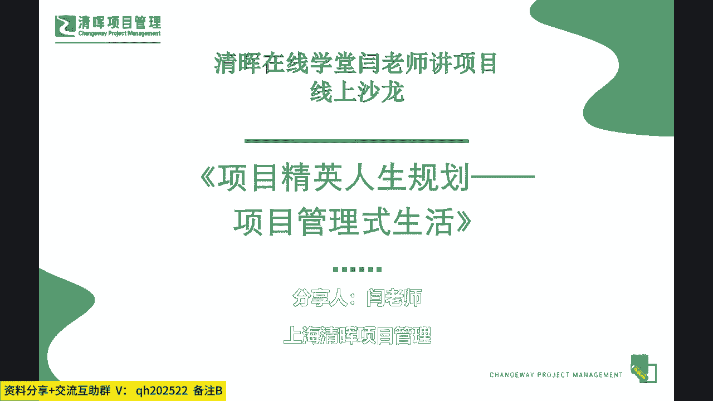
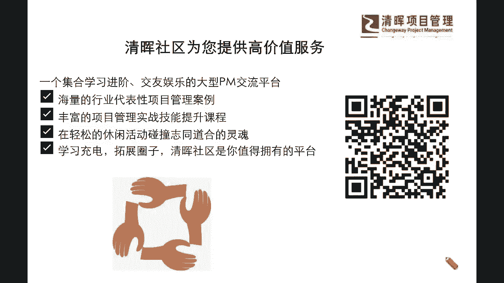
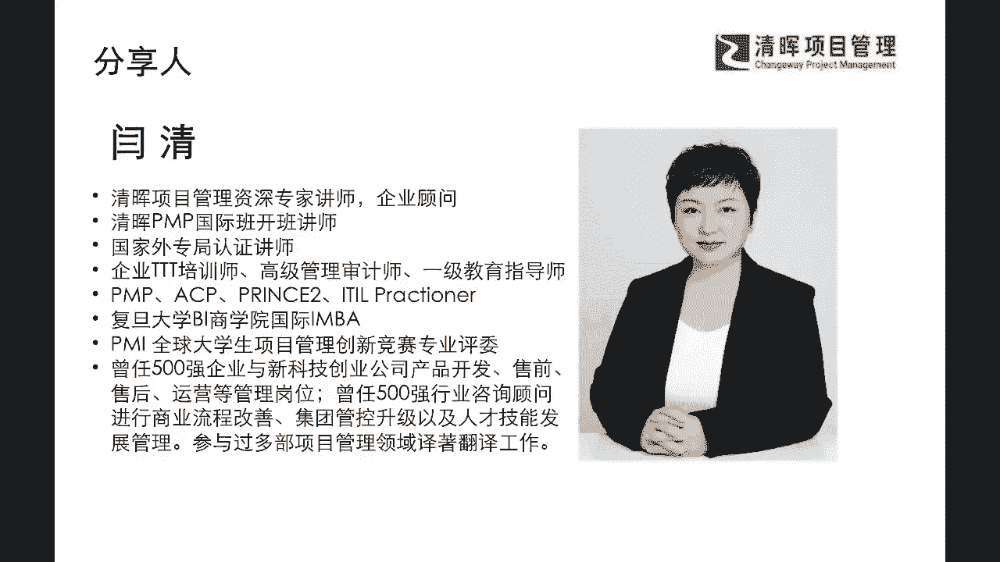
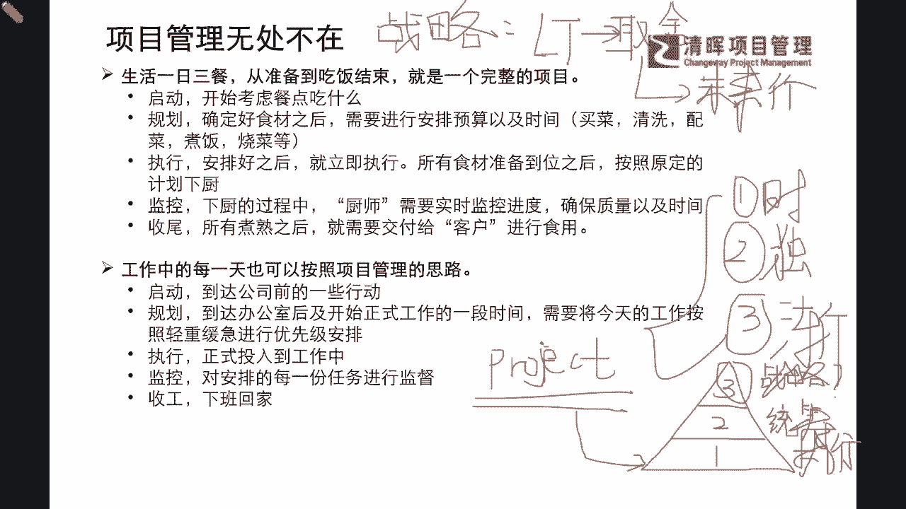

# 项目精英人生规划--项目管理式生活 - P1：1.项目管理无处不在 - 清晖Amy - BV1im421W7vR

好我们各位在线的啊，同学们，伙伴们，大家周日晚上好啊，我们也再次相聚在咱们的整个的这个啊，周末的这样的一个微课共享当中，我相信可能周日的晚上哈，嗯很少跟大家约这个时间啊，但是啊我也看到。

陆陆续续有很多的同学也在上线了，那么也非常感谢大家一再的这个关注和支持，也同时给我们非常啊长时间的这样的一个，这个反馈和激励呢，其实从另外一个角度上来讲，让严老师也看到了。

大家可能在晋升的这样的一个路径当中，以及在大家目前自己个人在成长的这样的一，个啊遇到的种种的问题当中，其实我们已经啊，可能给到大家一些比较感兴趣的话题了，那么能让大家在周末这么一个非常非常啊。

好不容易休息一下啊，等愿意把这个时间来去分出来，进行这样的一个提升和学习，那么我们也期待啊，也跟各位同学能够有这样的一个，非常重要的一个沟通啊，一个啊咱们共共同双向的一个奔赴，就是来在我们本次分享啊。

线上沙龙当中来跟大家讨论讨论，也许啊平时咱们在听课呀，在看书呀，可能还没有涉及过的一些这种方面和角度啊，那么我们今天这个话题呢，也是会围绕我们的项目管理师生活，和我们的这个项目经理的一些人生规。

划的一个逻辑来去展开的，那么这个话题之下的，我们能去讲的东西其实非常的广泛和多元，那我们本次呢咱们在今天的这个分享当中，我们尽可能啊聚焦点把它收拢一点啊，来去跟大家分享，已经在某一些我们的前沿的尝试。

或者是一些新的方法论当中，大家已经有一定的共识，并且已经有一些学者和一些项目管理专家，他们已经在实现这样的一个路径，并且已经有一些成功的案例了啊，也就是说我们可以跟大家去讲出来的。

都是可以立即去做的这么一件事啊，那么可能在我们今天的很多的一些分享当中，大家会看到啊，以如果有同学跟着闫老师的读书会，一路走过来的话，那么也一定会记得我们在最初啊，应该是将近3年半以前是吧。

好将近3年半以前啊，严老师跟大家分享过一本书，叫做项目管理师，生活是非常薄的一本书，但是在当时分享的时候啊，我们其实跟大家更多的去讲了，书里面的一些内容，大家可能对于某一些部分。

还不太有这么深刻的一些感觉，那么随着我们的一些考证啊，随着我们生活资历的逐步加深，那我们今天可能结合一部分啊，这本书里面的理论，再加上我们一些最新的这样的一些啊，思考和沉淀。

那我们也来看看大家有什么新的收获和成长，那也非常欢迎大家如果有什么样的一些问题啊，或者你想要去解决的一些痛点，也可以随时放在我们的讨论区互动区，严老师也会在我们的这个整个沙龙的，过程当中啊。

来去给予大家这样的答复啊，那我们也非常愿意去帮助我们每一位同学，把自己的啊，你们自己身上发生的一些这种痛点，也把它分享出来，那么我们可能也有针对性的给你一些建议，也许更能帮到你啊。

好那我们有了这样的一个基础，那同步呢我们也欢迎大家继续扫码啊，持续的这样的一个这个反馈，因为我们要确保大家一定是闭环啊，这一点严老师非常非常重视，也就是说我们线上的课堂，线上的沙龙。

它跟我们的这个线下的面对面的，是有一些不同点的，大家隔着屏幕啊，也许我不知道各位可能处于什么样的一个，环境当中来听啊，处于什么样的一个呃自发的目的来去选择，必须要去对自己有一些晋升的要求。

那么其实在这样的一个，双方不太了解的情况之下，我更想去知道大家，可能在这样的一个诉求和痛点的解决上，还有没有什么具体的一些克制化的想法，那么这些想法也许不方便放在讨论区啊，或者你想要描述的更为详细一点。

你想把你的一些需求，把它变得更加具体和让老师有针对性的回复，那么可以随时呃留言给我们的这个社区啊，我们的小仙童，那严老师也一定会一个一个去看到大家的反馈，同时把这些反馈变成我们后续的小微课程。

来帮助大家快速解决这样子的一些痛点和问题，帮助大家快速提升。

那么同步呢啊我们也有很多啊老朋友啊，当然也有一些新朋友，那么严老师呢，不光是给大家来带来很多的一些新的，前沿的理论知识，那么另外呢，我还更愿意帮大家解决一些实际实践当中的，一些问题。

那么这些实践问题更为关键的一点，就是有没有能够立即拿回去用，能够拿回去解决问题的这么一个这个效力，如果是有的话，那么值得我们快速去同步，那如果是一些很不容易听得懂的理论。

那我们也许啊可能该去理论化系统化学习的，我们还是要去什么学习，也就是说我们必须要搞清楚，大家其实在这样的一个过程当中，我们更加关注的是如何接地气，如何用起来啊，这也是我们共同的一个目标。

那我们的小微课程呢，我也希望大家至少两个小时时间里面，能实现这一点啊，好那么我们看到今天这个话题的时候，我不仅要再跟大家来提一个小问题了，我们一般都会去讲什么叫做项目管理式生活啊。

我们一般来说，我们说我们知道这个项目管理，也许是无处不在的，对不对，那我们也提倡了一个叫做事事皆项目是吧，我们比如说我们现在在工作当中，去接受到了一个新的挑战，我们在我们的人生当中。

比如说我们每一个这个决策，像我们的呃，比如说这个这个教育方面也是这样，有幼生小呀，有小升初呀是吧，有这个呃初升高啊是吧，这些阶段性的一些选择和阶段性的一些事件，大家会发现它都有一些共性。

甚至我们的一日三餐什么样的共性呢，我们其实在PMP当中跟大家讲过，项目的特点有什么呢，第一个特点是什么，就是我们会有一个临时性是吧，临时性就是它的一个时效性，它不是一直持续的，它是在一定的周期之内。

会按照一定的这样的时间节点进行快速交付，并且产生成果的这么一个过程啊，这是他的第一个临时性啊，就是有起点有终点啊，那么第二个就是它的独特性是吧，独特性啊，那么独特性这一点上严老师要稍微说一下啊。

这一点我们在人生这一点上，大家会不会觉得，这是一个非常非常契合的一个话题啊，也就是说我们生而不同，每个人都是不一样的存在是吧，我们从啊生下来啊，从我们每个人的路径，从每个人的认知，每个人的体验。

大家都是有非常大的不同点的，那么这个就是天然的一种什么差异，天然的一种不同，那么在这个不同的点上，我们其实更需要啊回归到我们的生活当中，我们会发现其实每个人的成长路径都会不一样。

每个人想要的结果也不一样，所以我们可以说人生就是项目是吧，我们的每天的生活当中的也是项目，因为都是符合时效性和独特性的，并且我们还会发现，还有第三个潜在的特点是什么呢，我们在PMP当中其实也学过啊。

它有一个叫什么渐进明细是吧，渐进明细什么意思，也就是说我们其实不是一开始就知道我们，我们人的一生，每个人要活多少岁是吧，会经历什么样的事件，但是可能我们依然会非常非常坚持的啊，1。1点的去。

一个一个阶段的去把它搞清楚是吧，所以其实在我们的现在这样的一个过程当中，我们会发现其实一模一样的一个这个特点啊，也就是说我们每一天，我们人的一生以及我们每一项工作。

其实工作是不是每一段植牙也是一个项目呢，啊是的啊，那么它们都符合项目的这些特点，那有了这些项目的特点，我们就更加需要让大家去持续做好一件事情，那就是我们要以项目管理的思维来去，对应到我们的生活。

对应到我们的人生的管理，对应到我们的职涯规划，以及我们的工作当中的每一项事情的一个落实，和我们的一个规划，那么这样子的一个过程当中，我们就会给自己提出很多的一些要求，挑战和一些问题了。

因为如果事事接项目的时候，那我们在这里来去提到一点啊，我这里顺便着啊，我们既然提到这个非常有意思，非常有注意的话题，他也跟我们的这个人生的战略都有一定关系了，那我们就跟大家从基本概念上掰扯一下。

我们先来看看啊，project项目，既然我们刚才说所说事事凡事皆项目，那么我们也搬到了项目的三个特点是吧，那么我们从层级上我们是否还记得啊，我们跟大家去讲过项目，项目集，项目组合，项目在第一层。

项目集在第二层，项目组合在第三层，是不是，那我们来去想想看，那既然事事皆项目，但就是每个项目它是在我们的什么，第一层的执行端的，也就是说项目它其实确定了，你就要去什么一步一步启动执行规划监控收尾。

你就要做下去的，就跟你被生下来之后，你就需要一天天长大，你就需要去幼升小，小升初是吧，呃一路这样子学下来是吧，那这都是有它的一个执行顺序的，项目就是要去执行落地的对吧，那么我们再来看看它还有项目集。

项目集是什么，其实项目集就有点类似于，大家现在每一关在通关打怪是吧，我们是不是仅仅做好活着这件事情，去执行好这个整个的过程就OK了呢，我相信可能凡是不想当将军的士兵不是好士兵，啥意思。

也就是说我们的诉求不仅仅是这一点，我们还想要做得更好，那么在项目集层面，你就不仅仅是执行了，你还要去什么统筹规划，就像我们讲的，我们要做斜杠青年是吧，我们看到谷爱凌是吧。

又能够这个体育项目上又非常非常优秀，那又能学习上非常优秀，情商上又非常优秀，那我们就需要去全面开挂是吧，我们还不想就是只是在某一些点上，有一些这样的成就，我们希望我们是活得像一个360度。

一个非常综合性强的这么一个成功的人是吧，所以这是一个统筹的能力，那么统筹是在项目级的层级，那么我们再往上去跃迁一个级别，到项目组合的时候，在第三个层别，在项目组合的时候，我们又会看到什么。

我们之前在学PMP的时候，学到项目组合，我们首先映入眼帘的，或者是跟我们提及到的就是有什么战略是吧，我们在项目组合主要是在搞战略，那么战略这个东西我就稍微要提醒一下大家，战略是我们一般的各位伙伴们。

你只要稍微去想一想，就能把它想得很明确，很彻底，很正确吗，我相信这可能就是一个很大的问号，因为你要提及到人，我们讲一个很大的话题，叫做人身，人生要成功是吧，那人生成功最重要的一点是要干什么。

就是要做好你人生战略的规划呀，你你所谓的战略，我们在这里跟大家来讲一讲啊，我们也集由这个话题，跟大家夯实一些基础的理解，基础的逻辑，那我们在讲到战略的时候，我们是怎么解释它的，我们在线的伙伴啊。

如果大家还听得清楚，看得清楚，我希望大家尽可能的互动起来啊，把一些你们想法啊，没有任何偶像包袱的敲在我们的评论区啊，来告诉闫老师，你是怎么想的啊，那我们的战略是什么，我们在严老师的这个PMP班级时。

我通常都会去给大家总结一些关键字，就是我们一定会有一个非常学术的一个，一个解释，就是我们可能会去感觉上，要考试的那种解释是吧，非常严丝合缝，但是我们也可以抓一些核心的一些逻辑，底层的一些要点来去理解它。

那么首先我们战略的它的一些底层的核心的，这么一些要素的这个要点是怎么说的呢，我们是否还有一些印象，我们一般谈战略的时候，我们是谈的近期的还是远期的呀，近期还是远期啊。

一般都是指的什么long term的，是不是啊，我们肯定是要去谈的长期的规划是吧，那么长期的规划里面，我们又会去提到一点是什么，你长期还要去有取有舍，是不是，也就是说我们永远不可能去all in。

什么都想，要是吧，既要又要，那肯定是不行的是吧，那我们要要想确认到有取有舍的时候，那么我们应该怎么去做到这样的取舍呢，取舍的一个根本点在哪里呢，这里面就牵扯到一个什么长长期的取舍。

是基于什么未来最大的一个什么价值是吧，未来价值的最大化好啦，那么现在问题就来了，那如果你作为一个你的项目组合的一个。

这个管理者，你又要去长期规划，又要去有取有舍，又要去达到这个未来价值的最大化的时候，那你怎么去做到这个要求，我们可能很多同学就会一下子反应过来，一个什么，我连现在的一些事情都疲于应付是吧。

我怎么去做到未来价值的最大化呀，这个太难了吧是吧，所以其实这就是我们平时在我们的企业当中，在我们的这个组织当中，我们的高层级的管理者，Executive，他们非常非常难做的一点就在于这里。

这其实就是我们的一个什么战略能力的养成，其实我们如果想成为我们自己的这个人生的，项目经理是吧啊，我们想成为自己的一个主宰的话，那么你也要必须拥有和练习，学习这种战略化思维，这也是包含在我们的项目组合的。

这种能力当中的，所以你看看我们其实作为项目经理，如果你想要去拥有这种项目管理师生活，你的综合实力，一定也要跟我们的项目经理的这种高级的，senior的project management。

甚至proportfolio management进行这样的对标是吧，所以我们有了这样的一个概念。