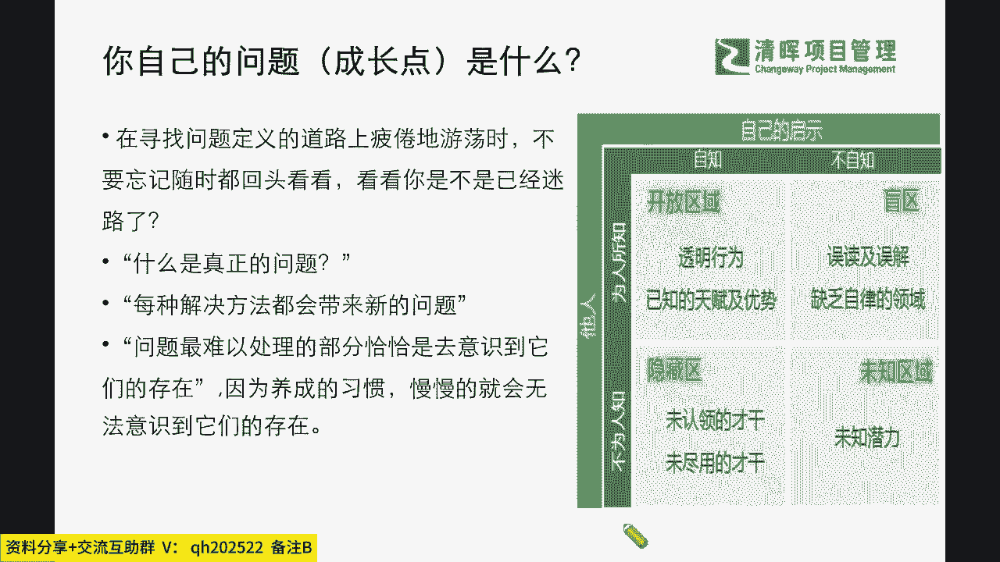
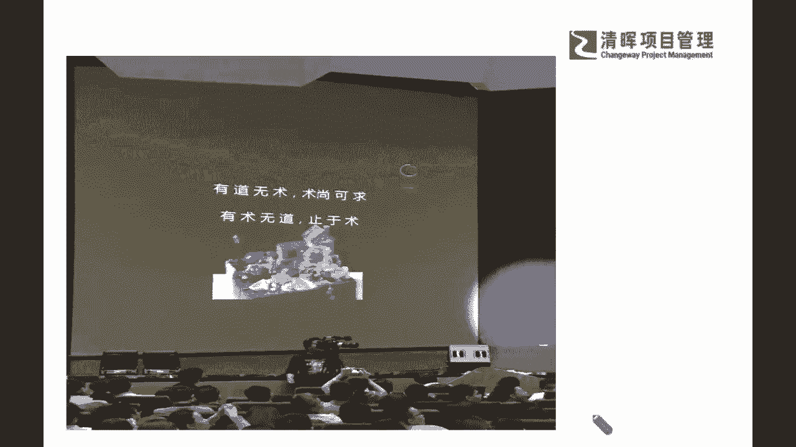
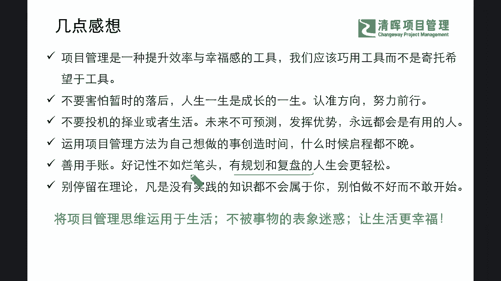
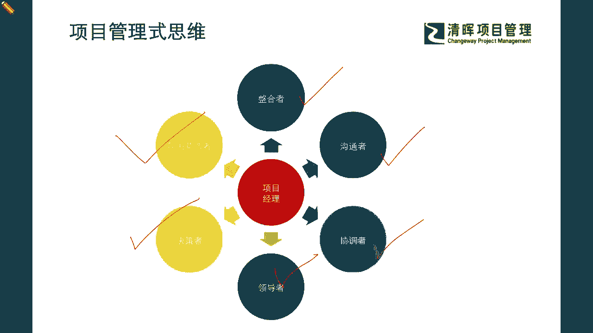

# 项目精英人生规划--项目管理式生活 - P4：4.你自己的问题 (成长点) 是什么 - 清晖Amy - BV1im421W7vR

老师也跟大家推荐啊，之前也推荐过的一本书，这本书真的是非常非常简单一读啊，它叫做你的灯亮着吗，啊这这本书呢它其实是告诉我们了一个问题，说啊发现问题的真正所在在哪里啊，因为它是啊介绍给我们。

就是怎么样去解决和发现真正的问题，那么在这本书里面，其中有一句话非常非常我很赞同啊，也把这个分享给大家，他其实提到的一个东西叫做问题，其实是你期望的东西，和你体验的东西之间的差别。

也就是说其实什么叫做问题，就是你眼高手低了是吧，好就产生问题了，是吧，这就是一个非常直接的一个体验，那么我们怎么样去解决这个问题呢，你就要去看到这个问题的本质，是你的期望过高，还是你什么手太低。

就是你的体验和你的变现这个过程太差了，太弱了是吧，所以你要分得清楚这两个点，你就一定能够把这个问题拆解，并且可能在后续的一些更多的一个问题解决上，采取正确的一些方式方法是吧。

所以可能有了这样的一个过程的时候，我们就可能会看到你自己可能性的一些。

成长点和问题会在哪里，那么首先来看到我们会有非常非常重要的一个，这种正常的一个认知是什么，我们不太知道我们自己，还有哪些未知的盲区是吧，甚至你也不知道你还有哪些未知的潜力是吧。

那么可能看到这样的一些不同的点的时候，我们也许可以知道啊，我们整个的过程当中啊，那么能够怎么样打开自己的盲区，发现自己的未知未知区域，发现自己的潜力是吧，我们也能够呃看到这样的一个过程。

我们去寻找真正的问题在哪里，那么也许我们在整个的过程里面，我们忽略掉的东西，恰恰也可能是实现我们这种人生目标，和打开我们格局的一些关键点，不妨呢大家自己给自己画一个四象限，尝试着去让你的周围的人。

或者你自己给自己一次360度环顾的机会，让自己呢也能够更好地去，抓到自己平时没有关注到的一些点，发现另外一面有很有可能性啊，产生更大价值的一个自己的特征特点是吧，所以在这个里面呢。

严老师也要再赘述一下啊。

我们在之前的，分享过程当中，严老师跟大家讲过啊，我们啊有一句非常经典的话，我曾经在我的沙龙里面分享过，那我觉得这句话在现在依然非常适用啊，叫做什么，我们其实很多的学习很多的一些东西。

我们觉得啊我们可以去进一步的充实自己，我们会发现有道无术术尚可求，有术无道止于数，什么意思呢，也就是说我们往往忽略掉那个道了，我们学了很多技巧方式方法，你会发现这样的一个部分，你如果只有一些技术。

而没有这个道，你可能就所有的一些能够看到的视角和格局，就只在这个什么这个树上啊啊，你就会被这个树所受限，那么从另外一个角度，如果我们知道了这个道理和底层逻辑，就像我们今天跟大家分享的这部分。

但是呢你欠缺一些必要的技术和技巧技能，那怎么办呢，你还可以多去学习，比如说你可以去学PMP，你可以去学PBA可以学敏捷，可以学NPDP是吧，甚至也可以去念一个MBA是吧，所以可能在看到自己的这些部分。

其实它是基于你有这样的逻辑底层，你才能做出的一些选择，所以很当很多同学来问严老师说，严老师，这个我不知道我现在考完PMP之后，我下一步应该去怎么规划，我的这个证书的一些这个这个考核的一个顺序。

我应该先考什么呢，其实面对这样的问题的时候，我往往会给我们的同学一点非常关键的建议，就是请你抽一点点的时间去梳理一下，你自己的这种志向和本质，就是你想要去做什么，和你现在去做什么之间的差异是吧。

你梳理一下，那么你当中的这个差异，就是你需要去快速补足的能力啊，那么你就知道你现在可能考哪一个证，也许对于你作为你实现这个什么目标的一个，最重要的一个战略性的不足是吧。

所以还是围绕在你自己的一个什么目标性上啊，目标性上，那么在这样的一个过程当中呢，我们有更多的一些思考，也有更多的一些沉淀啊，给到大家，那么可能在这个部分我也想去赘述一下啊。

也就是说大家一定要非常非常明确，在我们的所有的项目管理师思维里面，目标导向都是一个非常重要的底层逻辑，也就是说，你不能把自己放在一个，蒙着眼睛走路的过程当中，那么在这个过程当中，如果你不了解你的预期。

不了解你的参照物，就是你要知道你在过程当中到底是好还是不好，就像我们每一年你的一个绩效的考评，你对于员工绩效的考评一样，其实这不是一个简单的，打A或B或C的这么一个过程，而是来帮助他干嘛对标和调整的。

所以你要知道你是在帮他，他也要有这种积极正向的一个什么，这种概念和理解，那么我们会知道在这样的一个过程当中，我们能看到啊，我们非常明确的这样的一个，目标的一个导向的时候，我们就需要知道怎么样。

才能得到这种清晰的一个这种预期，那么在这个清晰的预期之后，我们也需要去准确的回答，准确的去来去体现到这样的一个预期的呈现呢，那我们可以看到这个项目你可以去问一些问题，第一个这个项目到底会对谁产生影响。

那么谁决定了这个项目的成功是吧，他们的预期是什么，那么我们项目的一些限制又在哪里，那你怎么样让大家能够达成这样的共识，那么在这个过程当中，我们也许能够看到，如果你把你的人生，你把你自己的一个职业规划。

当做一个这个时间轴来去一步一步实现的时候，你要问自己这个项目会对谁产生影响，那这答案就是我自己是吧，啊也许也有我周围的人，那么在这个过程当中，谁决定了项目的成功，我们的预期是什么。

那么谁决定了项目的成功啊，那肯定是我自己是吧，也是我，那我的预期是什么，你需要花时间去制定好，你每个节点的一个里程碑，和你最终要实现的那个什么目标是吧，那么你的限制使用，比如说我现在还有若干的困难是吧。

比如说我们还有各种各样，我们现在还不成熟的一些点是吧等等，那么还有呢，就是我们最终可能想要去达成这样的一个啊，这个目标的时候，我们也需要让自己拥有一个成熟的这么一个，这个结论和收尾一个共识。

就说这个部分是已经明确，达到了我们自己本身的一个什么，这个预期和结果了是吧，那么我们看到这个部分的时候，我们也会知道啊，我们整个本身的这个过程当中，你需要去遵循一些思路和思维，去一步步的去应对和回答。

比如说你可以去把你的这些所有的一些相关方，重要的相关方，以及需要去做好周遭的调研，了解清楚知己知彼的部分，你可能也需要花多一点时间去做这样的一个，沉淀是吧，那么我们会看到啊。

整个的这个部分应该怎么去呈现的，这个呃环节当中，我们也许有一些这种重要的一些工具，那么这个过程呢，我们也希望可以在后续很多若干的课程当中，大家也可以去收获到这样的一个，工具和方法和技巧。

那么可以看到我们会有一些关于决策的，关于授权的是吧，关于你自己需求的，以及我们怎么样去建立一些很好的资源链接，能去发挥一些这种我们的一些情绪，价值和能量的，那这些其实都是可以提前去做一些必要的规划。

那么在这些规划的过程当中，我们可能会需要去搜集广泛的反馈和信息，直到我们拥有一个明确的细节的一个答案，这才叫一个落地的一个根本是吧，那么在这个过程当中呢，我们可能需要去打开我们一些高质量的。

一些信息的搜集啊，也需要去进行我们的一个受限区域，盲区的一个什么探索，也就是说，我们可能想象成为，我们在整个的这个项目管理当中啊，在人生职涯的项目管理当中，我们会有范围的一些受限，会有输出质量的受限。

会有资源的受限等等，那么我们怎么样提前识别到这个部分，并且可能能够提前部署一些积极的一些应对，那么这个就是非常关键的，一些这种提前的前置的一些风险分析，那么在这个过程当中，我们不妨啊你也可以在家里啊。

就快速去尝试一下，比如说你可以把局限模型，用在我们日常的时间啊和生活管理上，再组织一些家庭的这种活动啊，还有一些家庭的这种矛盾冲突解决的时候，你可以花点时间列出可能的一些障碍是吧。

那这些可能会大大的去降低你的压力是吧，当你面对一片混沌不清的时候，你可能会有很多的这样的一个什么啊，我们的一个这种压力和这种难点，你会觉得啊非常难以解决，但当你真正的把它列下来，帮你把这些限制条件啊。

把它一个一个的放出来的时候，可视化的时候，你才会发现，其实当你能够正视这些问题的时候，这个问题就已经解决了1/3了，你剩下的就是需要来去沉淀，来去把这个部分持续地把它什么深挖清楚，逻辑理清楚是吧。

那么在这样的一个过程里面，我们也会看到在整个的一个挖掘，在整个的一个这种啊剖析的过程当中，我们会发现难度其实是非常非常巨大的，因为但凡是颠覆掉一些旧的，产生一些新的部分。

我们也会看到有很大的一个不同点啊，因为我们其实在讲到的尼古拉啊，马基雅维利他就已经提到过，没有什么比创造新秩序难度更大的了啊，所以我们能看到这样的一个过程的时候。

我们还需要去学习很多的一些技能和一些技巧，我们怎么样去进行这样的一个什么啊，确定这个合适的相关方，确定我们怎么样能够达成共识，确定怎么样问出这种本质，确定怎么样确定我们的一些真正的这个，核心的范围。

那么可能在整个风险的控制和管理当中，我们就会看到我们的影响和可能性，它变成实际风险之前，其实每一个步骤，我们都可以提前做预警管理和控制，那也就是说我们通过这样的一个逻辑思路啊。

那么严老师也去把它稍微好总结，和去简化一下啊，变成我们自己的一些话来跟大家总结总结，讲一讲啊，那么可能会看到这样的一种情形的时候，我们想要去把我们的项目管理思维。

贯穿在我们整个的项目管理是生活当中的时候，我们就需要去把自己变成一个项目经理的角色，那么项目经理的角色呢，他一定是需要有一些技能的，你需要把项目管理变成变成你自己，提升效率和幸福感的一个工具，并且呢。

我们也希望是通过工具去实现我们的目的，而不是单纯为了学工具而学工具是吧，我们也知道，学习考证，不是为了去满足这个证书收展的需求是吧，我们更多是要把里面的一些内容能够怎么样啊。

更好的来去来去呈现出来来去解决了，并且运用项目管理的一些这种逻辑，来帮我们处理好，我们植牙和生活当中的一些事情是吧，那么我们知道了这个部分，我们就要知道我们是利用工具，但是我们不依赖工具。

那么我们也不要害怕暂时的落后，人的一生是成长的一生，我们是一个动态的过程，只要我们认准方向，持续的前行，每个人都能够成功，不要给自己设限啊，不要认为自己这里不如别人。

那里又不如这个可能有一些自己的受限啊，这些东西我们其实要打破一些一些，认知的壁垒啊，那么同样我们不要去投机的择业或者生活，因为未来不可预测，我们不断的去发挥优势啊，我们不断的去成长，也许我们都会变成。

我们非常非常在自己感兴趣领域，在一些有价值的领域，我们都会变成一个非常有用的人啊，那同步呢，我们也可以去运用这种相对应的，项目管理的方法，为自己想做的事情来去创造时间，那什么意思呢。

也就是我们通常所讲的，我们永远都在寻找自己，未来一个准确的定位和方向，我们永远都想变成更好的自己，那么这个过程和目标，我们不是一个固定的固态化的一个不动的过程，我们在这个过程当中，也许你会发现。

我们还有很多的可能性和潜能，并没有被发挥出来，那我们是否能够积极的正视它，能够意识到，只要我们明确了目标和目的，我们任何时间点启程都不算完，同样我们可以去记录下来，这一路的一个经验和成长。

这就是记录好我们的一个手帐一样，把所有的一些我们的过程，都能够一步一步的来去实现，并且能够把它变成我们日后成长当中的一些，有效率的一些价值的资产，那么我们就需要有规划和有复盘，这点也是非常非常重要的啊。

因为我们所有每个人的时间，一天都是24小时是吧，为什么我们有些人成长的就是几何级数的成长，有些人的成长就会比较缓慢呢，其实这还是源自于一个底层逻辑的一个部分，那么可能在这个部分里面。

我相信大家可能从一些最基础的点上去，进行一些尝试，也许啊，你能够更好的有一个轻松的成长型的人生，可预见的成长型的人生，就是你需要有规划，有复盘是吧，这才是有进一步的一个资产的存储。

那么同样我们讲了很多的逻辑，我们也希望大家不仅仅是听这些理论啊，当然我们也规避掉了很多比较高深的一些理，论的一些东西，但是我们希望大家还是要快速去，转化成我们的行动，也就是说把它变成我们的一个实践。

在这个当中也许你会发现很多很多的一些事情，他在真实的场景当中，他也许就不叫做一个问题，但是有一些部分我们认为它不会有问题，但是它在实际的过程当中恰恰变成了一个瓶颈，那么在这样的一个过程当中呢。

我们其实会非常明确的一点，就是我们将这个项目管理思维，运用于生活的时候，我们希望大家不要被事物的表象所迷惑，而要让我们的生活更加的幸福，更加的成功，那么同样我们应该承担什么样的角色呢。

就需要去做到我们在PMP当中所学到的，项目经理的角色的这六张饼，这是非常经典的一个，这个六六个角色的一个饼啊，我也借鉴这个饼，在我们即将尾声的时候来提到，对大家的一个明确的一个要求。

大家不仅要去整合好你自己所有的资源呢，时间呢受限条件啊，所有的信息啊，不仅要有这个整合的一个全局观念，你还要去主动积极的引领，作为一个领导者，你不能去被动的接受，那么同步呢你还需要在这个整个过程当中。

我们要不断地与外界沟通，与我们的资源协调，那么我们才能去想办法，营造出一个高绩效的这么一个氛围，也可以去做出相对正确的一些决策，我们要敢于为自己做选择，做决策是吧。

所以我们可以借鉴的这个项目管理思维当中，我们项目经理的这个角色的一个概念，也是非常非常有帮助价值的，那么这是我们的其中之一。

