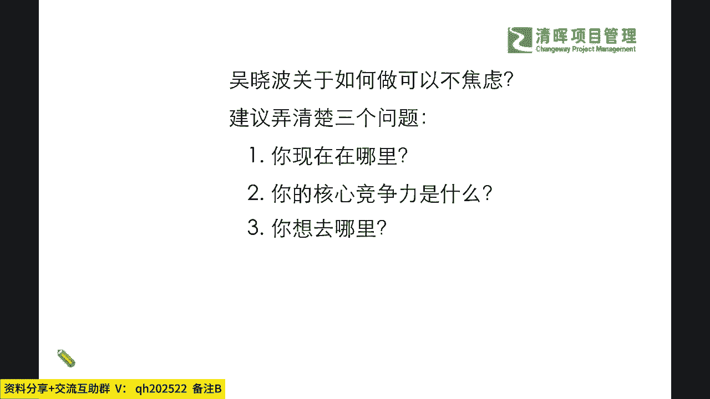
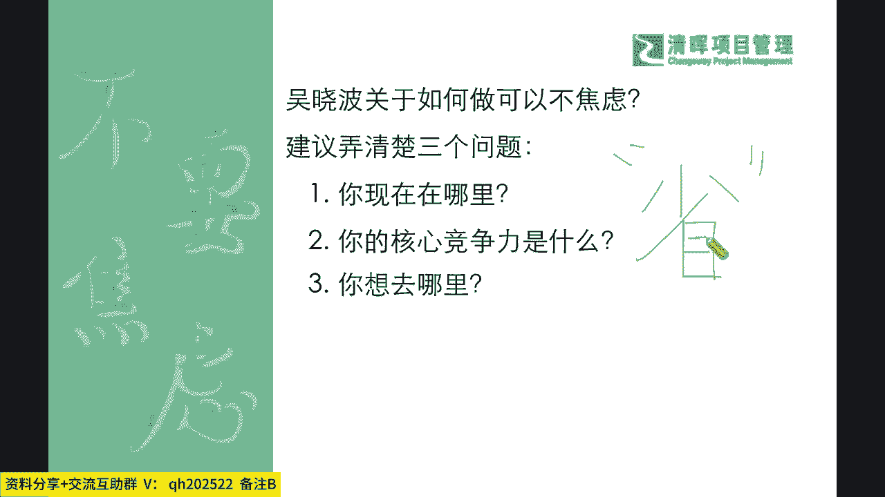
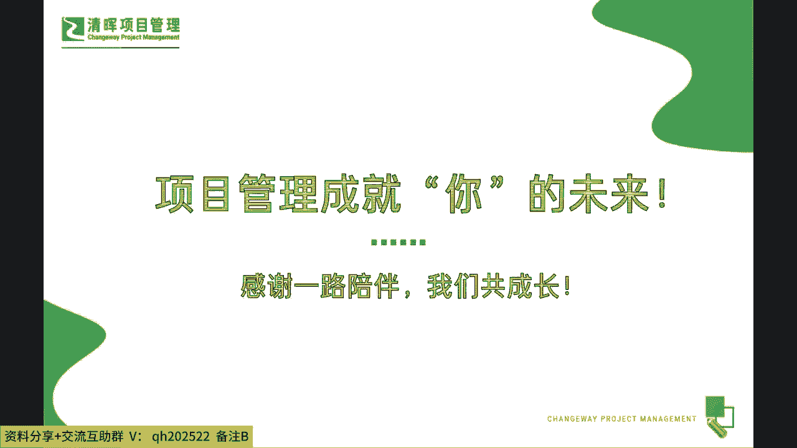
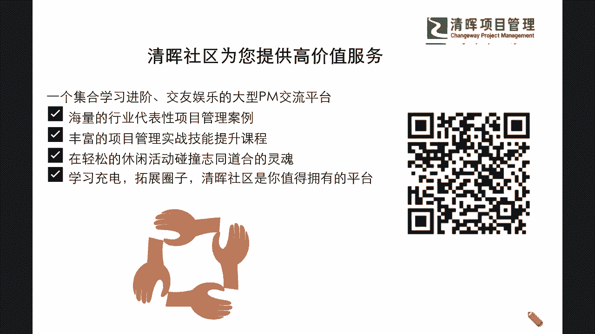

# 项目精英人生规划--项目管理式生活 - P5：5.如何不焦虑 - 清晖Amy - BV1im421W7vR

老师可能想要跟大家再去分享的，就是我们经常会听到有一个啊，我们这个非常知名的一位人物叫吴晓波是吧，经济学家，那他其实提到了一个如和可以不焦虑啊。

那如何可以不焦虑呢，他建议要去干什么，弄清楚三个问题啊，这三个问题是什么呢，第一你现在在哪里，第二个问题呢，你的核心竞争力是什么，第三个问题呢你想去哪里，大家在看到这样的一个过程的时候。

你是不是觉得诶这个我要不焦虑的话，我要想思考清楚这三个问题还是有一定难度的，是不是啊啊，所以大家可能平时都没想过这些问题吧，是吧啊，我相信啊这个东西啊，需要大家定期一定要去自省一下啊。

因为我们的复盘和自省是非常非常的重要的，你看这个醒字怎么写啊，我想跟大家讲清楚的一个底层逻辑，这是一个多音字是吧啊，我们叫自省的时候，它会上面是个少，底下是个木，什么意思。

你一定要什么自己独立去完成这件事情，不要在什么很多人的协助，甚至很多人在关注着你的时候，看着你的时候是吧，你要自己在一个安静的环境里面去想一想，你自己的这个核心竞争力是什么，你的优缺点在哪里。

你想要达成什么样的一个目标是吧，所以这叫自省，那么我再想办法帮大家掰扯掰扯啊，在这里呢严老师再转述一下，我再增补一点。

思考一个问题是什么呢，我们通常会知道条条大路通罗马，是不是啊，但如果有人已经在罗马了，那我会很开心，如果我还不在罗马，那是否我可以通过学习这个路径，可以学会如何以开心，高效的方式来到达目的地呢。

其实这就是一个什么不焦虑的基础，就是你不要去什么嫉妒，也不要去什么对自己的一些困难，过于的什么悲观，其实我们还需要去有一个非常积极，正向的一个这种啊逻辑和我们的一个态度，来去，应对。

未来的这种各种各样的一些挑战和不确定性，那么恰恰呢项目管理的这种思路和思维，又是非常非常应景和符合我们的要求的，那么在这一点上，严老师也补充着一点思考和建议，那么也濒临我们分享的尾声。

不知不觉已经两个小时了是吧，那么我们也希望大家能够听进去一部分啊，把这些一点点的小火星啊，在心里在沉淀沉淀，想办法点燃你的一些火焰的火苗，让自己在某一点上，也许在某一天你会忽然发现哦。

原来其实还可能有这么一种可能性是吧，那么我们希望大家不断的要去自省，不断的要给自己更多的一些可能，不要焦虑，多思考，多运用项目管理的思路思维来去帮助自己，理清楚现状，管理好过程，规划好未来的战略。

那么在这个过程当中，严老师也在咱们的分享的尾声，送给大家一句话啊，我们也许啊可能会需要去坦然地接受，不完美的过一辈子，但是也请大家不要一辈子都假装自己很完美啊，麻木的度过学海无涯，进一寸有一寸的欢喜。

希望今天的分享呢能够星星之火，点燃你心里的某几颗星星，我们在日后更多的课程当中，在日后更多的互动当中，能够帮助大家切实做好诗和远方的一个协同，我们不仅能走好眼前，也要能够过好以后。

也感谢大家这两个小时的陪伴啊，我们也期待项目管理能够一路成就大家的成长，也希望大家能跟我们持续陪伴下去，我们也希望我们的赋能能够持续的双向奔赴，感谢大家今天的参与，如果有任何的疑问和问题。

欢迎大家一定要留言扫码，把你们的建议，想法和感兴趣的话题留言给闫老师，留言，给我们的线上团队，那么同样我们在线上的名师专栏，我们的直播课程，还有我们后续海量的一些啊。

这个新课程在24年规划的这个新课程当中，我也会跟大家做一个交付啊，也就是说大家感兴趣的，大家想去解决的，这些，也是严老师所关注和想要去给大家赋能的部分，那么感谢大家，今天的啊两个小时的一个支持。

我们希望听到大家，我们也希望一路陪伴大家的成长。

