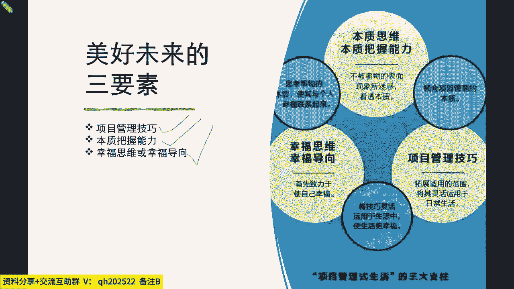
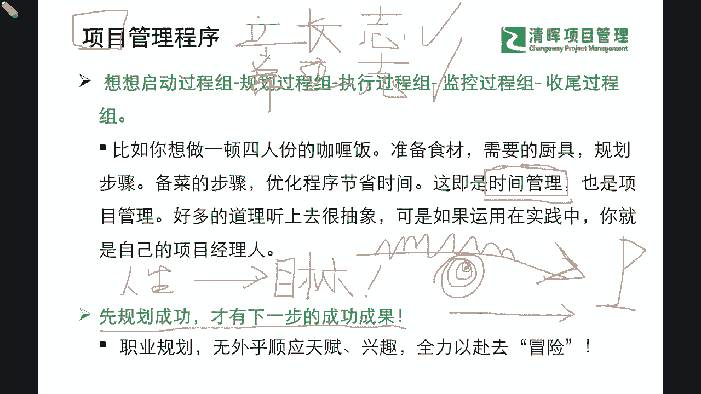
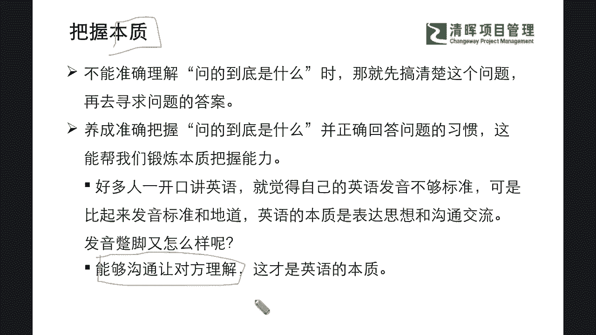
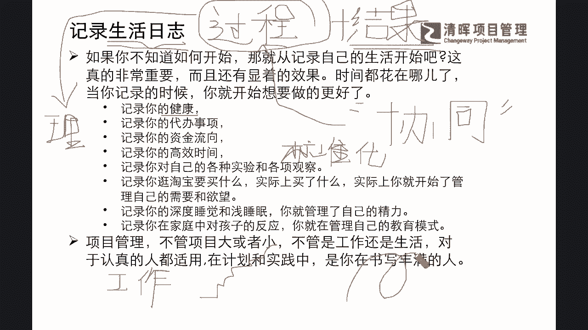
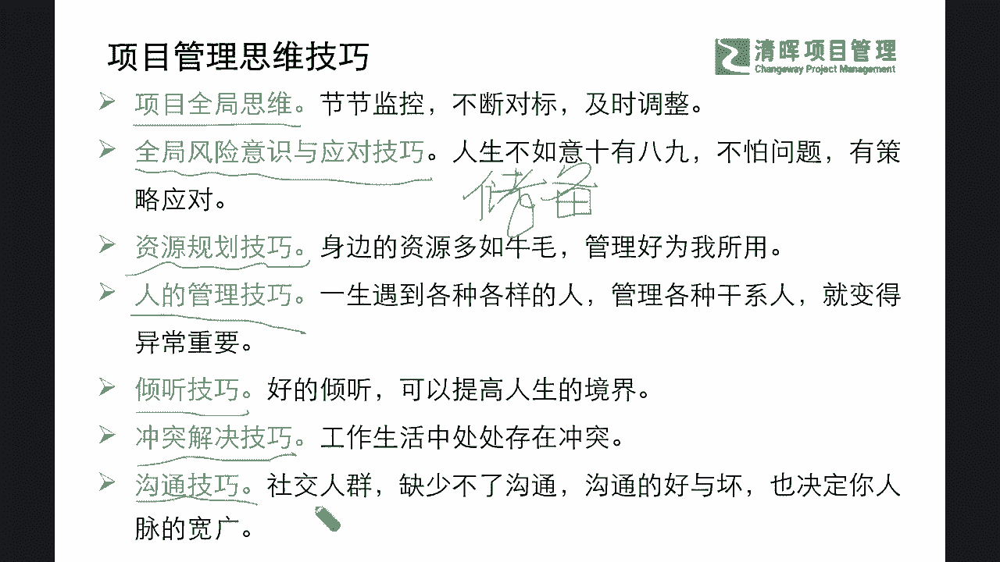
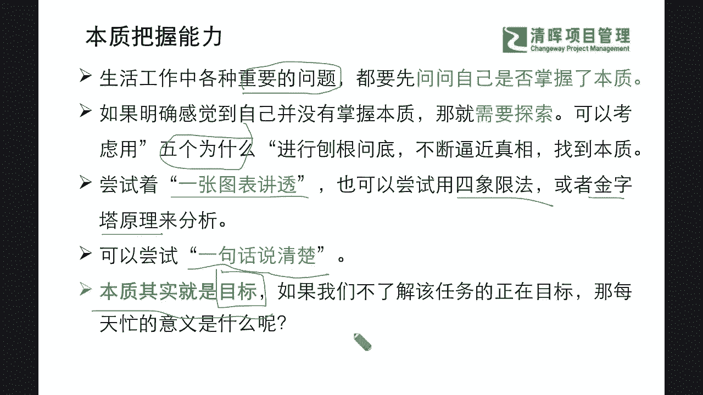
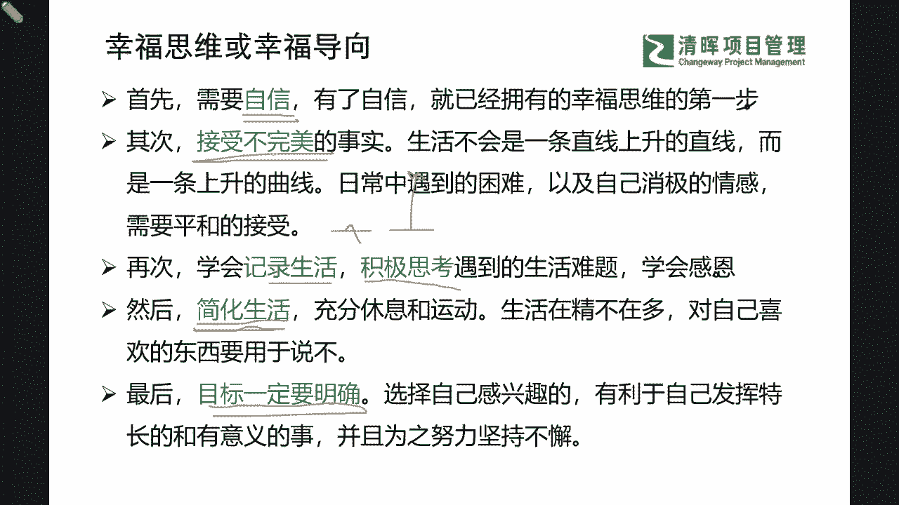

# 项目精英人生规划--项目管理式生活 - P3：3.美好未来的三要素 - 清晖Amy - BV1im421W7vR

下呢我们就会看到，在我们原来分享的这本书里面啊，我们要再去提取它非常精华的一部分，作为我们今天的一个借鉴，那就是我们会看到这个美好未来的三要素，在项目管理师，生活在这样他的一个逻辑思维之下。

他其实提出了有几个方面的一些这种要素，但是分成三三种大类了啊，那第一个大类大类呢，就是有一些必要的项目管理技巧，也就是说我们怎么样去学会，拓展适用的一些范围，那么可以把我们的各项的项目管理思维和技巧。

灵活的运用在我们的日常生活和工作当中，但同时我们也能拥有把握本质的能力是吧，那么这个把握本质的能力，他其实要求，我们不被事物的一些问题和表面现象去迷惑，而是需要去看穿本质。

采取对应的最正确的一个解决方式，那么在这样的一个高要求之下，其实我们会遇到各种各样的迷雾，遇到各种各样的一些不确定性，那么这种不确定性，它也一定会转化成为我们的问题对吧，所以在这里面我会稍后告知大家啊。

我们怎么样去把握它的本质，其实是有一系列非常重要的，又非常简单的工具可以去参考，那么第三大类呢就是我们的幸福思维和幸福的，好像也就是说，如果我们奋斗了一生都没有变成一个正能量的，开心的人。

变成一个更好的人，那么你又何尝能有幸福感，能有成就感呢，其实我们讲的，如果我们也有很多啊，这个百岁老人在回顾自己的一生是吧，那我们也会看到有很多人，就会给我们这样的年轻人啊。

我们有一些这个非常年长的长辈，就会去啊提醒我们啊，提醒我们的年轻人，如果你年轻的时候想去做一些事情的时候，你不妨就大胆的去尝试是吧，反正人生只有一次是吧，你又不能倒着火是吧。

所以可能在这样的一个过程当中的时候，我们就会去发现，其实我们还有很多放不开，不敢不能，或者说我们还对自己有很多天然限制的部分，所以可能在这样的一个部分里面，我们就需要去知道，在我们的这样的一个过程里面。

我们怎么样能够去把握住这样的一个根本，让我们敢于去冒险，敢于去尝试，敢于去拿成果，那么在这样的一个过程里面，我们又该怎么样去让自己，高效率地开心地去走好每一步，过程当中的艰难险阻呢。

这就对我们是一个很大的考验了。

那我们首先来看看他提到的非常重要的一点，叫做项目管理的程序，那么我们看到这个项目管理程序的时候，我们首先可以来想想我们的项目管理的过程组，那我们大家一定都在PMP当中学过。

我们有启动规划执行监控收尾是吧，那么我们就像准备一顿饭一样，我们就需要去遵循这样的一个逻辑，但是在我们的整个的工作管理当中，这其实就是一个本质上是什么管理呀，是我们的一种时间管理的观念。

也就是说你有没有意识到你的人生啊，你的这顿饭他是有时间限制的啊，讲起来可能感觉突然有点残忍是吧，但是我们一定也会非常明确的希望告知大家，我们在这个过程当中，是希望让大家能够看穿迷雾，抓本质。

我们知道我们时间有限的时候，我们就要更加善于去利用我们的每一分每一秒，善于去规划，也许你花在游戏当中，花在休闲当中，和你花在自己想做的事情上，这样的每一步的这个部分呢，其实你带来的收益结果是完全不同的。

那我们也希望啊我们每一位伙伴，每一位同学，因为清辉我们在线学堂呢也是非常优质的一个，校友的平台，我们其实可以看到很多非常优秀的同学，背景，非常非常优秀的同学，大家依然在坚持学习啊，这种学习呢。

他一定不是仅仅是为了学习一些技能，一些这种技巧，那这种学习更多是一种什么，我们的这种可持续发展力，可持续竞争力的一种体现，因为我们知道未来谁也不知道是什么样子，但是只有快速能去适应未来的那个人。

快速能去学习的那个人，他才有可能是最快啊，能够去胜出的那个人是吧，所以我们知道了这个部分，我们就要更加注重我们时间管理的一个，技能的培养，那么这就是必须要去学的这个部分，可以通过学习我们的项目管理思维。

可以通过学习偏僻啊，甚至学习我们的敏捷啊，学习我们的PPA啊，其实都有很多，这样非常啊这个有价值的，这样的一些借鉴和参考，那么我们在看到这样的一个过程的时候，我们还需要去坚定一个信念。

那这个信念是什么呢，就是我们凡事预则立，不预则废，也就是说项目你如果说你的人生和职涯，人生和植牙都是项目的话，那么我们会非常明确的一点，你的人生如果是碌碌无为的时候，我们就会遇到非常大的一个什么。

非常大的一个挑战，也许可能是一个失败的潜力，也就是说你不能蒙起眼睛，没有目标的去奋斗啊，这种努力也许没我再次重复一遍啊，没有明确目标的努力，也许只是一种自我感动，什么意思，也就是说今天我们很多同学说啊。

我其实并不知道我未来，我想成为什么样子的一种人，但是我觉得我现在嗯非常爱学习，我也非常想学，所以我看到有帮助的东西我都会去学啊，我也相信通过我的这种努力，我也一定会啊这个实现我的一些梦想。

并且想尽办法来让自己变成更优秀的人，其实在某些层面上，也许啊，严老师可能会稍微打击一下，有这种想法的同学啊，我们还是要非常客观的泼一点点冷水给你啊，什么意思，就是你千万不敢去没有目标的努力啊，同志们。

因为我们的人生时间是有限制的，没有目标的努力，就像在打罗圈，就像我们今天你没有明确的目标，也许你多走一步，他这个都不是往前走，都是在原地踏步，甚至可能还会什么变得更加的什么受限是吧。

所以你一定要有非常明确的目标，我想要成为一个什么样的人，它就像一个灯塔，像一个旗子一样是吧，给你指出了方向，那么你有了目标，你就直接要奔着目标去，不管你在当中遇到了多少的艰难险阻，你遇山这个搬山遇水。

什么涉水就好了，你可能路线是很曲折的，但是你的方向是不会搞错的是吧，所以我们一定需要有规划，也就是说，如果今天在线的各位伙伴们，我想问你一个问题，你的职业规划，你在未来3年想成为一个什么样子的一个人呢。

长成为什么样的一个职场人呢，你有大概的计划了吗，甚至你有目标了吗，如果你现在暂时还没有计划，我可能还能理解，但是如果你连目标都没有，你说3年之后我能成什么样就成什么样啊，那这不是目标啊。

所以如果你连目标都没有的话，那么我请大家一定要先进行规划，开始进行这个规划，这个目标的一个细化，先有目标，再有目标的细化，你才可能有下面每一步的一个成功的一个落地，也就是说。

职业规划无外乎要去选择你自己感兴趣的，有成就感的，顺应你所擅长的领域的，那么你必须要去明确那个目标，全力以赴，因为我们人生太短了，我们不可能什么都去做，所以我们要想办法变成一个镭射激光一样。

我们找到这个目标，我们就要聚焦，赶快去什么啊，进行这样的一个部署和规划，那么同样我们可能有些同学会感觉到有些困惑，什么困惑呢，比如说我问一个问题，大家说也许我今年还是这个目标。

明年我就变成另外一个目标了，有没有这样的现象，有还是没有，一定有的是吧，一定是有的，为什么，因为我们环境在变啊，同志们是吧，也就是说你本来计划的好好好好好的，但通常来讲有一句话叫做什么计划没有变化。

快是吧，所以这是再正常不过的现象了，但是在这样的情况之下，你怎么办呢，严老师要让大家明白一点啊，即便再变化，即便再变化，它还是要有一个什么目标的什么目标，所以我们有一句话叫做人要立长志。

立长志长期的长啊，志向的是志，人要立长志，不，不能去常立志长经长的长，不是长短的长啊，好啥意思啊，也就是说我们需要去想办法，给自己规划一个什么非常什么啊，看起来是long term，远期的。

但是也是自己非常想要达到的，那个什么那个位置，那个高度是吧，你叫立长志，你想比如说我们一一般在问这个孩子说，你未来想做什么呀，那有些孩子说我想当科学家，我想当医生，我想当老师是吧。

那这个就是可能是一个长同志，就是一个需要不断去奋斗的去达成的，这么一个志向是吧，那么我们就不能因为随着这个环境的变化，就不断地说哎呀我感觉我现在学不进去了啊，我就我就不去不去当科学家了吧。

我就去呃这个呃做别的吧是吧，其实可能小孩子他会有这种变化，但是成人啊，成年人我再讲句扎心的话啊，成年人如果能做到这样的一些部分啊，你一定能够区分得清楚你的退缩是因为什么，你的退缩不是因为你不擅长。

是因为你欠缺这样的韧性和毅力，也许你可能就不太想去为这样的一个，最终目标去努力，并不是你不想要啊，所以可能在这个过程当中，我们就需要请大家非常明确的来去提出一点啊，就是也让大家能够看到和能够去啊。

看到这样的整个的一个这个不同点的时候，能够意识到这个目标的一个重要性，但这个重要性之后呢，我们也去看看怎么样去把握我们的本质。

那么把握本质啊，一直就大家都知道我们要抓事物的本质，抓根本，但是我们想告诉大家的一点，什么叫做根本啊，什么叫做根本，但如果你不能准确地理解，你这个问的到底是什么，那你就先要去搞清楚这个问题。

那么根本就是你先要去养成，想办法去问到那个基础，问到那个本质的一种能力，就是一种提问的能力，你必须要去打破砂锅问到底是吧，所以可能在这个里面，我们可能一开始啊，就会被一些这种所谓的表面现象所误导。

比如说很多人一开始学英语啊，就开始说哎呀我的这个发音不准呢是吧，然后我可能没有没有人家这个呃这个外老外啊，这个人家母语的这个发音这么地道，那么我可能就没有人家说得好，我就不敢张嘴说是吧，等等。

找了一堆的这样的一个理由，但这些都不是本质，但是我们实际上我们要搞清楚，我们去学外语，当你的母语不是这个英语的时候，你把它当做一个外语去学习的时候，其实真正的目的是为了干什么，是让你讲的跟老外一模一样。

是让你讲的跟人家母语一样，这么标准吗，也许这并不是一个目的，目的是干嘛，就是让你对方双方能够互相是吧，听懂就行了，能沟通就行了，所以你干嘛把自己的那个什么目标，要变成那样的一个目标，就是你可能会发现。

很多时候你想要这个呃及格啊，我们讲你学一个新东西，你想要去达到60分，也许还是可以的是吧，你作为一个门外汉，但是你如果你想达到，比如说七八十分，你就需要努力努力还是有希望的，你想达到90分以上。

那就需要十分的努力，当你想达到100分的时候，这也许有时候就不光是努力的问题了，还存在一个什么天赋的问题是吧，就是你你是不是那块料是吧，我们其实真的要承认这一点的，那我们每个人的发光点，闪光点也不一样。

所以有些人他就是你就像这个，我们举一个也许不恰当的例子啊，我们看看我们的这位啊，小米的这个雷总是吧，那雷总呢他其实本身他英语就是不好是吧，大家还有很多网友特别去感觉是在啊，这个笑他一样的是吧啊。

就是把他这个讲外语的，讲英语的这个拍成一个小视频啊，放在很多的这个这个地方，然后说这个啊这个雷雷军啊，雷总讲的这个英语大家都听不懂是吧等等，但是实际上能沟通能够表达出来对吧。

thank you very much又怎么样呢是吧，这就达到目的了呀是吗，所以我们其实从另外一个角度来讲，我们其实是要掌握的，更根本的本质是你处在不同的环境，处在不同的这种角度。

你最终希望把握的那个关键的本质是什么，不是成为这种母语的这种表达者。

你是为了去交流清楚问题的是吧，这就是抓本质，那么同样我们也来看看，怎么去达到我们那个人生的那个组织过程，资产的一个价值的最大化，就是要学会啊，或者是简单的要记录好，我们的生活的一个这个痕迹和一些日志啊。

那么实际上在这个里面的时候，我们相信很多的伙伴和同学，大家出了学校之后，出了那样的一个环境之后，我们就很难去对自己有一个这种要求，要求啥呀，就是要求自己去做一个什么这种日记的，每日的一个总结和陈述是吧。

那实际上在这个过程里面，我们就会发现有很多的差异点，很多的差异点在哪里呢，就是你没有去复盘，你没有去很好的把自己的这些过往踩过的雷，走过的坑啊，甚至可能怎么样去获取这样的一个很好。

结果的一些经验去总结好的话，有可能你所有的成功都是一场幸运的，什么游戏是吧，什么意思啊，我举个例子啊，来我问一下啊，我们看看线上的伙伴，大家是不是有在认真的听哈啊，我们来看一下，打比方打比方。

我来问大家一个问题，如果我们想要去得到一个很好的一个，成功的人生，大家认为是过程重要还是那个成功的结果重要，好我们在线的伙伴啊，来我再重复一遍问题啊，如果你想要去拥有一个成功的人生。

你会认为是那个过程比较重要，还是那个成功的结果比较重要，就是通常来讲什么叫结果比较重要，不论什么猫，反正逮着耗子就是好猫，就是那个意思是吧，它不论这个英雄出处是吧，他只看结果是吧，那个叫只注重结果。

是过程重要还是结果重要啊，我看到冯素娟同学和手机尾号8352的，这个朋友都已经留言啊，非常相反的两个两个观点是吧，我们还有没有在线同学有不一样想法的啊，如果你想拥有一个成功的一个人生啊。

那么你认为是过程重要还是那个结果重要啊，来大家都互动一下啊，不要光听啊，光听只是push啊，推式的这样的一个沟通，我们是希望有一个闭环啊，尽管咱们隔着屏幕，但是我们不要让他信息只是在推送啊。

我们消化消化再给严老师推回来，你就可能有一些自己的一些吸收了啊，往往都是积跬步至千里的是吧啊，我们看到这个画眉同学说，我更在乎过程的享受啊，非常好啊，那么杜文君同学说享受过程获得结果啊。

两边都沾了是吧啊，那么这个也是非常看起来很资深了啊，那么手机尾号0437的朋友说，结果好，我们已经非常明显的三个阵营了，第一个阵营注重过程，第二个阵营呢说这个享受过程获得结果。

看起来就两个好像都挺重要的是吧，那么还有同学认为结果更重要，那么到底它的底层逻辑在哪里呢，我跟大家来举个例子，大家就能听明白了啊，如果我们在某一件事情上取得了成功，或者说我们今天是一个企业的管理者。

你在带领一个团队，带领这个项目的时候，你成功的把第一个项目带出了好，结果落地了，但是这个时候呢你的老板啊，你的boss他让你可能去带一个更多人的团队了，你原来只是你自己单打独斗吗，是不是啊。

你去沟通其他的团队的成员，让你单打独斗，你把这个项目给带成功了，这个时候你老板看到了你的这个优势啊，说不错啊，这个小杨干得不错是吧啊，这个项目带的挺成功的，现在我要晋升，你要要让你去带一个团队了啊。

你去带个这个十几个人是吧啊，看看那咱能不能把这个更多的项目，更大的项目，把它落地的更成功一点好，那么在这里什么问题来了，同志们能听清楚什么问题来了，如果是你自己很好地管理好这个项目，很好的落地。

产生这样的一个很好的成果，那这是你自己的一个什么内在的一个过程，是不是啊，但是这个你自己能管理好自己，等不等同于你能够管理好团队，你等不等同于我，相信大家一定非常清楚，一定是什么，不等于号是吧。

一定是不等于号的，你自己能管好你自己，你自己能够带出带出这个很好的项目，不代表给你人了，你就能够持续的，让每一个项目都能这么成功是吧，为啥通常我们就知道人多的地方就有江湖嘛。

啊超出这个超出这个一两个人开始，就各种的这种事情就来了是吧，什么事情呢，那其实就是管人的时候就有复杂程度，因为人是需要有一些什么协同的，我再去跟大家讲，大家我不知道，我问一下啊，大家有没有去读过一本书。

也许可能在你这个参加中高考的时候，部分的去看过啊，我相信大家步入职场之后，一定不会去看的一本书，但是我稍微稍微点一点，也许你可以回回过去再翻一翻，哪本书呢，就是我们特别特别啊。

这个在呃政治思想课上学的那个马克思啊啊，他写的这个资本论这本书里面，其实他提到的一个最基本的一个观点，大家也许去读一读，你就会发现他提到什么，就是他提到人是社会性的一个动物，也就是说我们需要去群体协同。

才能产生更大的价值，个体的价值肯定是远远不及群体的价值的，这是它的一个定性，所以但是在这个过程当中，他提到的一点是什么，群体的这种价值，它是一定需要去进行什么很好的管理的。

也就是说我们一但凡形成一个团队，但凡不是你一个人来去做这件事情，你就需要去进行一些管理，那这个管理能力就非常非常关键，因为你需要去让每一个团队成员去协同，不仅仅是要发挥他们的擅长。

更要去有一个什么高效率的啥玩意儿，在这儿呢，就是我问的这个问题，就是高效率的过程是吧，高效率的过程啥意思，其实也就是说今天打比方，我们马爸爸讲过一句话啊，大家可能去看了很多他的绯闻哈。

看了一些这种很有意思的一些信息，不妨你可以真的去读一下他的那种啊，这个自己的一些这种文章或者是一些自传，你其实能读到很多有价值的一些部分，也不完全是这种小故事是吧，那其实他就说到一点啊。

这个马云就说到一点，他对于团队的要求有一个非常基础的一个观点，就是他的团队，以这个leader是否能够再进一步被晋升，或者他会被认为有更大的一个领导价值，取决于什么，不是他能带出多少个。

这种重大的项目的成功落地，就是它不仅仅要实现几个亿的目标啊，拿到很多大项目，签了几个大客户，不是这样，他签更多也没有必然的联系，而是他需要能够把过程什么标准化，他讲的非常的接地气啊。

就是今天我能让你去带团队，不仅你自己能够带来大项目，你还能帮我把这个过程，把你带来大项目的这个过程标准化，啥意思，你如果没有过程的标准化，你就不能快速复制，不能快速复制，就不能产生1+1大于二的效果。

不能产生1+1大于二的效果，你就只是一个独立的产生价值的个体，你是远远不能被放在一个什么，所以这是一个什么，也就是他提到的过程加结果一样重要，也就是说，如果你只有过程没结果，你的老板不会放过你的是吧。

但是如果你只有结果没有过程，那你可能下一次的成功就需要去什么，求求神，拜拜佛，看我运气好不好了，因为你没有去复盘过，没有把你的这个过程标准化，你没有办法快素复制，就这么简单一个逻辑是吧。

所以可能这样的一个过程里面，我们其实认识到这些部分的时候，我们就知道过程加结果同样重要，那我们在这个过程里面，其实这就是我们的生活的组织过程，资产的一个重要的点，就是需要把你的过程把它沉淀下来。

你以为的这些小细节，我们就举一个很简单的例子，比如说我们的这个每个月的花销对吧，你的进账多少，花多少，花在哪些方面了，我怎么样合理的规划，怎么样去储蓄，怎么样去投资，怎么样去花在这个合适的地方是吧。

其实这些东西啊，我相信很多的一些小伙伴啊，可能是大致的知道一点点，但是我们真正详细在规划的一些，它一定是能够产生巨大的效益的，为什么，因为你就是很多东西，你不去仔细的去盘查他的时候。

你就无意识的会不不知不觉地，就去犯一些重复的错误，其实在这个里面我们就会发现，有很大的一些坑是什么，比如说我们举一个例子啊，就是我们将见到啊，我们人人都想收获一个幸福的人生，健康的健康的人生。

也就是说如果你身体不好，如果你只是为了赚钱，身体毁掉了是吧，那你可能赚的那点钱还不够，你住院的是吧，那我们道理都懂，但是可能我们怎么样平衡好这个节点呢，其实这里面也有很大的一个学问。

我们就像我们人人都知道，要保持健康饮食是第一步，那健康饮食是什么，通常医生都会告诉你是吧，是清淡饮食是吧，一日三餐要均衡是吧，不能去挑食，而且不能暴饮暴食，这些道理都懂，但是真正到落地的时候。

你怎么去实现呢，我们还是会发现人家告诉你了，你要去健康饮食，但是我们还是我们的胃口和大脑神经，你的脾脏会告诉你，他很想要填的东西啊，甚至你的胃也告诉你，它会延迟反应，还没有饱，他还想要不断的吃。

那你在这个时候能不能通过你的一些理性意识，理性意识，什么叫理性意识，理性意识就不是你的感官意识，是你需要去沉淀下来思考思考，才能在再去做出行动的，不是你本能的一些反应，本能反应是什么，我想吃甜的。

立即就去吃，我没有吃饱，还要继续吃，这是本能是吧，但是你会发现本能是什么时候，是会害到我们的是吧，因为你会发现你觉得好吃的那些东西，其实都不健康是吧，油炸食品啊，所有的这些部分里面添加剂特别多。

就香嘛是吧，那其实这些东西你就会发现，这种感官是会欺骗我们的，他会把我们引入到一个误区，但是我们又很难就真正你如果没有过程加结果，这种复盘的话，你很难一下子跳到这种理性的，有没有感觉到理性。

你是需要有些沉淀，就是我们讲老马识途啊，你自己本身有没有去做过这个事情，你有没有接触过，你有没有复盘过，你有没有listen learn，这些才是呢，你能够产生这种理性的一个坚实的基础。

就像我们之前在讲的，姜是老的辣，为什么它不仅仅是撸起袖子来分享一些，以前我怎么怎么成功的，而是在利于现在的过程，它能够结合最新的状况，把它原来的一些坑也能够结合进来，变成新的一个风险意识。

提醒大家注意这些就是非常重要的，就像我们现在以前，可能我们在二三十年前，所谓的健康问题都会出现在哪里，吃不饱穿不暖，营养不均衡是吧，营养不良，但是现在我们的问题会出在哪，恰恰相反，我们就营养过剩是吧。

我们甚至还有很多的这个部分，我们的饮食出现了严重的这种什么不健康是吧，只是贪图一些感官的这种快感是吧，我们就会去选择一些不健康的一些饮食，但是在这种过程当中，其实你会发现你的植雅恰恰不也是这样子吗。

也就是说你你在你的人生当中，打比方，你今天要进行一个工作的选择，你要去找新工作了，你要去换平台了，那么什么样的工作才是你应该去选择的呢，我们通常会大家理想当中的那个是啊，最最perfect。

最完美的工作是什么，钱多事少，离家近是吧啊，当然这也是一个大家共性的一个诉求，但实际上我们永远没有办法，完全达到这样的一个什么，我们的一个完美的要求，甚至远远还不止这种钱多事少，离家近。

我们还想要有成就感，还想要有认同感，还想有更多的成功的这么一个这样的一个结果，那其实在这样的一个过程当中，你就会发现我们往往啊能够去更好的上升，只会有一种情况，那就是踩着阶梯，而不是什么过山车是吧。

那踩着阶梯是什么意思，你是有一些积淀积跬步至千里的，而不是啊我开心的时候，我来劲儿的时候上去了啊，不爽的时候，情绪波动的时候下来了。

你开始有很多的这样的一些过山车式的反应，那么其实在这样的里面，我们的项目管理思维，它恰恰能够规避这种什么非理性的一些部分，你会发现啊，我们很多的一些这种环节当中，能够扎实的一步步过得好的。

我们也是需要具备这样的一些复盘思维，具具备这样的一些记录思维，所以可以及时的啊，也请大家现在大家都是很少用纸笔去写字了啊，当然啊严老师还是推荐大家，希望大家如果有时间的话，我们先不要去讲，一日三省吾身。

我也反复在强调这一点，我们不是先贤，我们不是圣人，我们没有办法在一天之内不断地反思自己，到底还有哪里可能能去改进的地方，也许没有那个时间和精力，但是我们至少现在的生活节奏，我们一周一个月甚至一年。

你是不是给自己一定的空留白时间来去，给自己一张A3纸来去列出来，你自己有哪些过程做得好的，结果上，为什么可能某些不不如人意，哪些就能更好地体现出这个价值，你要做一个整体的一个沉淀和复盘。

那么这些所有的记录，所有的一些组织过程资产，都会变成你下一步扎实上升，稳步上升的阶梯，那么在这个过程当中，我们就不禁看到，我们的项目管理的一个思维技巧，它其实也实时的存在在我们整个的人生规划。

职业规划和我们的这种项目管理思维，去管理我们生活的方方面面，比如说我们就会发现，在我们PMP当中学过的很多的这种部分，像项目管理的全局思维是吧，我们就要15矩阵横纵去考虑十大知识领域，五大过程组是吧。

我们都会去考量到我们会有步步的监控，不断的去对标，及时的去调整这些差异纠偏是吧，那么同样我们也通过这样的一个全局的思维，项目管理的一些这种技巧，我们也能够去学会，怎么样去有一个全局的风险意识是吧。

那么我们会看到我们全局的风险意识和，应对技巧，也在现在的直言当中，是非常非常重要的一个存在，举个例子啊，我们现在经过了疫情的这个考验是吧，我们有很多企业也经历了全球黑天鹅的事件，大家会发现。

我们现在不仅仅是外面这个天气是寒冬，也许在我们的整个的一个企业当中，我们也是一个寒冬的一个阶段，我们会有很多的一些企业的变变化，业务也许不如原来这么好，那我们也许面临到我们可能需要去什么。

再找一些更好的平台，甚至可能面临到企业的重组，裁员升级，甚至是可能转型是吧，各种的一些坎儿，那么可能在这样的一个不确定性更加强的，一个环境当中的时候，我们作为一个这样的一个职场人。

我们怎么样去让自己能够拥有这样的一些，应对的能力和技巧呢，其实这就是一个风险的排查，也就是说我们其实今天在线的，我看到星期天的晚上啊，非常非常不容易啊，大家还有几百位啊，这个我们的这个伙伴还在在线。

来去听严老师掰扯这个话题，那说明什么，说明大家还是有这样的一些，这种不断的升级和学习，这种学习性思维的这么一个体现的，那其实这种思维恰恰也是非常非常关键的，我们需要需要去通过不断的学习。

不断的去尝试来去提前预测，提前部署，我们可能在未来发生的一些变化，也许我们可能有不同的一些选择，但当这些选择来临的时候，我们已经提前做了一些可能性的部署和准备，那么这些部分一定是需要提前有风险意识的。

也就是说我们不是等风险来了，我们才被动的接受是吧，甚至我们非常明确的一点，我们现在很多的大家的一个储蓄意识，也非常有很大的一个改变，我们没有过多的这种什么，每家每户是吧，以前都是家里有余粮是吧。

但是现在我发现诶，从我们的八零后，九零后，甚至可能更更多的这个年轻一代啊，大家不会去存钱了，就也就是说你那个储备没有了，也就是说你被动去应对风险的东西，可能也许是不存在的啊，也也许是不堪一击的是吧。

所以你需要更多的就是什么主动去应变，那么主动去应变，你就需要知道，你也许能够遇到什么样的一些风险，你的识别风险的意识，你分析风险的一些方法，以及你怎么样去提前应对。

学习也是一种应对风险的一个什么技巧是吧，所以这是我们看到大家已经在去做了，那么同样我们还有很多的资源规划的，一些技巧是吧，你周围的资源的整合，大家不断的在升级，怎么样去管理好身边的资源，那让更多的资源。

大家能够凝聚来去产生更大的价值，对我自己本身的工作和生活，产生更大的一个益处，那么这个部分也是非常非常啊重要的一个技能，那么还有一项技能也是大家非常关注和关心的，就是我们的人的管理技巧。

因为我们在一生当中，在我们的职场当中，在我们的生活当中都会遇到形形色色的，该气人是吧，所以我们知道我们在PMP的学习当中，我们就知道了，我们不可能去什么，让每一个干系人都会言听计从是吧，完全赞同我们。

完全去符合我们的各项的期待和要求，但是我们能去做的非常重要的一个点，就是干什么，做好干系人的一个体验度和参与度的管理，所以在这样的一个过程当中，我们就要不断的去提升，我们的干系人的管理技巧。

那么同样我们还有很多必要的软技能，比如说倾听技巧啊，比如说冲突解决技巧和非常重要的，人际的沟通技巧，那么在这些必要的项目管理思维的技巧之下呢。

我们就会看到我们还回归到刚才的本质，把握的能力，我们就会进一步给大家往下再挖深一下，那刚才提到了你想去把握本质，那你就需要去学会提问是吧，把这个问题要提出来，并且能够感受到什么样的一个。

就是我们讲刨根问底，刨到最后啊，大家都已经有这个感觉，跑不动了啊，这个就是一个最根本的一个问题了，那么在这一点上，我们也会不断地去提出一些技巧，来让大家进行刨根问底，不断的去逼近真相，找到本质。

那么可以看到都有什么样的一些本质呢，首先我们可以去用五个Y是吧，大家非常熟悉的，为什么为什么为什么一路问下去问五，至少每一个事件问五个，为什么，那么在这个过程里面，大家就会感受到。

也许我们往往啊真相它不是表面那么简单，那么另外一个部分我们就不可视化，用一张图表来去表示，也就是我们之前学过的一些结构化思维，像金字金字塔原理啊，也也有我们的一些这种所谓的呃乔哈里视窗啊，是吧。

我们也可以通过这样的一些工具来去帮助我们，看到我们一时半会儿看不到的一些问题，那么这是其中一点，那么另外一点，我们也可以尝试让自己一句话去讲清楚它，如果我们不能去精简地做到，一句话去讲清楚的时候。

我们也许是没有抓住到那个本质的，那么从另外一个点我们也可以看到本质的根本，我们回归到我们一开始所谈到的这个部分，我们会发现所谓的本质的根本还是什么，就是我们所提到的目标，你是否有目标。

你是否了解这个任务他真正要达成的一些目标，那么这才是最核心最关键的点，那么也就是说我们其实不妨尝试性，你就问问自己啊是吧，我们人生也许就是个八九十年是吧啊，七八十年哈，可能我们都不知道在这个过程当中。

可能会遇到什么样的一些事件和意外，但是如果在这样的一个有限的时间段之内，我们都并不能去找到，我的一个存在的目标和价值的话，也许这可能会对我们每天在繁忙，疲于奔命的一些这种最终的一个目的。

可能会产生一些影响啊，也就是现在为什么我们现在可能有啊，一部分的同学也许会提出这样的一些疑问，是说啊，我我这个整天忙碌不就是为了五斗米折腰吗，一日三餐嘛是吧，为了生存嘛是吧，但是我相信啊，还是那句话。

大家为了生存，这是一个基本的本能，但是每个人从一开始出发的时候，你一定是想要去做一些你想要做的事儿的，也就是说并不是一开始你对自己毫无要求的，所以我们还是返回的那句话，你的那个立长志长长度的长，立长志。

你的那个终极目标是什么，你是否走着走着就忘记了呢，那么如果在这个过程当中，如果没有忘记，只是为了去做另外一件事，情，为了去满足这个养家糊口，我可能暂时把它压抑下来了，那是否你有一些计划。

你还是想要去把你的这个人生的这个目标，来去实现呢，因为我们毕竟啊可能活这么几十年，我们希望自己是开心的，拥有成就感的，实现自己梦想的一个人生，我们就希望大家自己对自己负责，我们也不想啊学了一身的本领。

最终还是什么麻木的，去完成这样的一些既定的动作，因为什么麻木是什么意思，我们只是为了去人家要我去学，我就学是吧，人家说这个这个东西有用就就学，但是我自己有没有去想过，也许我职业的一些上升。

就像很多同学来报考p mp，由于很多同学在报考PBA，甚至可能在学习更多的NPDP的证书的时候，大家都会有一些初始的想法，也许也许我可能还有另外的一条可能性的路呢，是吧。

那可能在这样的一个开天窗的一个初心当中，我们其实就能去感受到，我们人生其实是不设限的，我们很多的时间就像我们有一位啊，今天我也在我的沙龙当中分享过这句话，我们有很多的这个很有意思的一些，这个啊伙伴啊。

这是在咨询这个有一位这个围棋大师啊，那个围棋大师就就在呃提出来，他提了一个问题说啊，其实我发现我的这个孩子啊，非常有这种数理的一些这种可能的一些天赋，但是呢他在小的时候，我没有去给他报这个围棋啊。

那导致他现在呢已经快上大学了是吧，等到高中了，感觉没有时间学了是吧，那么可能这样子，是不是就把他这个天赋就就给浪费了呢，那其实当时这个这位围棋大师就提到了一点，就说啊其实真正的这个学习围棋的最佳时间。

一个是什么，婴幼儿时期是吧，越早越好，大家能够去看到这样的一个潜能，去提早去进进行一些逻辑的梳理是吧，一些训练，但是另外一个最佳的时间就是什么，就是现在，那其实他非常诙谐和幽默地，提到了一个东西叫啥。

就是我们千万不要给自己设限，如果你已经意识到你现在在哪一方面，也许是可以有一些发挥，或者你可能对哪些部分感兴趣，那你可能现在不要去觉得啊，我已经啊三五家了是吧，我已经很年长了，我要怎么办呢。

我是不是能够更好的来去这个这个呃，来去把这个部分能够做到这个这个是吧，我保守一点，我们就不要去东想西，想了，就把现在事情做好就行了是吧，但实际上这也是一种什么受限，那么可能在这样的一个过程当中呢。

我们也希望大家看到这一本质。

那么在整个的这个三大块当中的，这个幸福思维和幸福导向，那就是跟我们提出了若干的一些要求了，这叫自信，就是在别人都不相信你能够做到的时候，你必须要自己给自己打气，我能够做到啊。

这是一种自己给自己赋能的最重要的一个环节，那么再次呢我们要去接受不完美的一些事实，也就是说也许在某一些节点上，在某一些这个过程当中，所有的事情它并不是啊直上直下的，你努力了就能看到成果的。

它是一个曲线上升，甚至可能很长时间，就像我们今天去种一个竹子一样是吧啊，我们讲种豆芽和种竹子，竹子你可能种了很久，发现你怎么就看不到它，等到隔了一年之后，发现冒了一个小笋尖儿是吧啊。

那但是可能你种豆芽很快就看到它发芽了，就长成一个芽了，但是可能我们在讲，他非常非常不同的一点是什么，当你能够看到竹子能冒尖的时候，它的根已经非常的深了啊，那么豆芽能够快速冒出来，但是你拔的时候。

你会发现它的根很浅是吧，所以也就会知道，所谓我们的曲线和非直线的部分，其实都是在扎根，那都是在不断的沉淀和积累的阶段呢是吧，所以我们再次来去把这些过程记录下来，通过你积极的思考和沉淀。

来去变成你自己日后的一个组织过程，资产同步，我们也也被要求要simple is best，要简化生活，什么意思，就像今天我们再跟大家讲，大家现在每每一个人人手一台车是吧，哈哈我们现在讲了这个。

我们国家有个国策叫3060，要去节能降碳，我们很多时候我如果我们是公共出行啊，如果是绿色出行，你会愿意自己走上一段路，再去乘地铁，乘公交，甚至可能啊骑自行车来去做这样的一些。

这种节能降碳的一些这个动作吗，我相信啊，可能天气好的时候，你还挺愿意的啊，尤其时间充裕的时候，但是天一冷啊是吧，然后再加上人一懒是吧哈，你就不太愿意去做这样的一些努力了，但实际上我们就会发现。

往往你越简化返璞归真的一些东西，就像我们今天拿纸笔去记的时候，触动到你的指尖，流动到你的指尖，能写出来的东西，和你敲在电脑里的东西，是非常非常不同的一个体验，也就是说我们今天不仅仅你简化你的出行。

你去骑了自行车，你去乘了地铁，你去走了很长的路，那么这些不仅仅是能够去降碳，能够绿色出行，它还能够让你的身体变得更加好，如果你持续的去不断的啊，可能给自己很多我们就是无缝衔接啊，在家就一直坐着是吧。

不是躺就是坐，出门就是什么开车也是一直长期坐是吧，那么这样一种生活状态，其实它也是非可持续，也是不健康的，不仅仅对你的身体不利，也是会产生很多的这种什么啊，摊牌是吧，所以可能你会发现很多事情。

它其实可以简化的做，反而是更好的，其实生活和我们的各项管理恰恰就是如此啊，产生太多的一些内耗，一些这种所谓的这种感觉是锦上添花的东西，其实往往对我们都会产生一些双刃剑，比如说他的确是能让我们省劲儿了。

那是省劲儿的背后就是什么，就是不健康啊，就是你会发现大家都在想办法去投机取巧，去偷懒是吧，没有人愿意去下一些匠心的功夫是吧，其实这些也是一个平衡的一些点，那么最后呢就是目标一定要去非常非常明确。

一定要有志向，有明确的一个节点，那么在这里呢我们就会知道。

