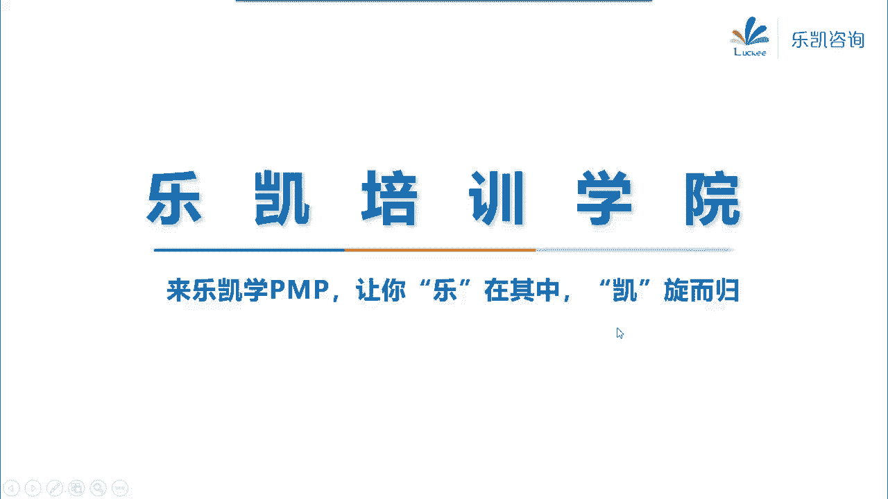
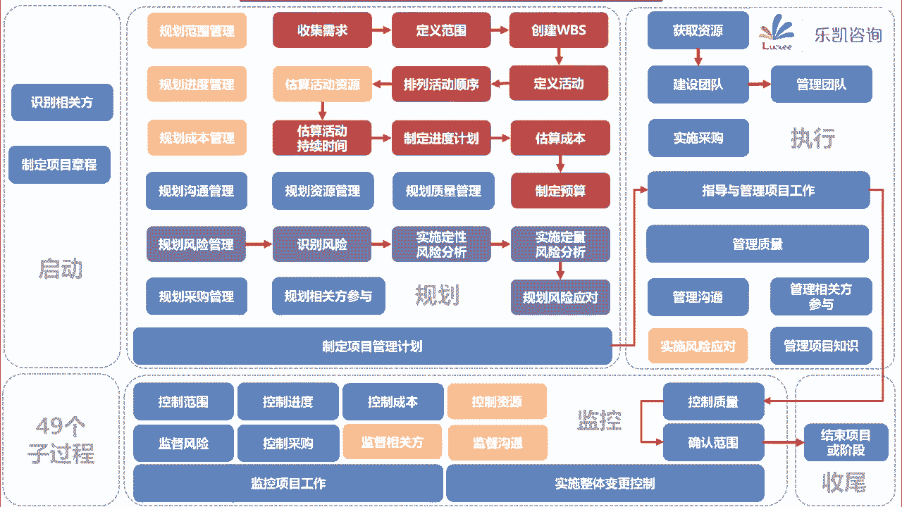

# 项目经理PMP-100分钟串讲 - P1：12月考试：全书100分钟串讲 - 行走在拉美的搬运工 - BV17V41117KM

呃今天晚上的这样，今天晚上我让我这个跟大家一起，把整本书从头到尾的快速的过一遍好吧，那么大家呢其实可以不用翻书，然后呢我来说大家来跟在后面听一下，看看能不能这个把我说的东西呢回忆出来好吧。

这个呃希望大家呢这个听完了之后啊，但是这个我也会让严老师把它给处理成这个，mp3文件，然后放到喜马拉雅，大家在平时的时候呢要多听好吧，最起码对这一套知识体系，有一个比较好的了解啊。

这个要抓紧时间好好复习一下啊，这个9月份的这个情况大家也都知道了啊，所以说一定要抓紧时间，好吧好，那么我们就直接开始。

大家在回顾的时候啊，可以跟着这张图来进行回顾，好，那么整本篇博客呢，它其实包括了49个过程对吧，那这49个过程呢，它其实呢，虽然说五大过程组是可以重复去做的啊，但是呢我们可以用一些顺序把它给联系起来。

首先呢我们先回忆一下，做一个项目启动过程中要做什么事情，首先第一件事情，那么我们按照PMP里面的说法，特别是pm bok第六版的说法，他说识别相关方很早就要做了啊，可以跟制定项目章程同时开始。

甚至可以在制定项目章程之前对吧，所以我们先回忆一下识别相关方这个过程，识别相关方式启动过程组里面的一个过程，那么这个过程呢主要就是把项目中，凡是能够受项目影响或者能影响项目的相关方。

全部都把它识别出来对吧，那么识别相关方这个过程呢，我们在上课的时候，我们回忆一下，首先我们要注意识别相关方，它应该是一个迭代的过程，它不是说只识别一次，全过程都要去识别相关方，然后识别的新的相关方之后。

我们要注意把它更新到相关方的地侧对吧，那么这个过程呢，它的输入我们在上课的时候没有做过多的强调，因为输入无非就是看，比如说早期的商业文件对吧啊，或者说其他的，比如说协议。

那么这些东西那么关键是它的工具和输出，我们怎么去识别相关方呢，它的工具里面我们分成了三大块，大家还记得吧，第一块叫数据收集技术，里面有问卷调查，头脑风暴对吧，那么我们通过这种方法来收集到什么信息呢。

我们说一般是收集到相关方的一些，比如说姓名啊，电话呀，这种身份信息，或者说叫基本信息对吧，然后我们还可以通过相关方分析这样一个工具，那么相关方分析这样一个工具，可以帮助我们来识别出。

或者说分析出相关方的评估信息，那么有呢身份信息，有呢评估信息，我们在借助，比如说相关方映射分析或者表现这样一个工具，比如说权利利益方格来对相关方进行什么，进行分类，那么这个权利利益方格。

在偏报考第六版里面没有讲到，但是考试会考到，那么分类要会对吧，权利高，利高的双高的这种人，我们要重点管理权力高，利低了，我们要令其满意，权力低，但是利益高的我们要随时告知两个都低了。

那么我们也要监督对吧，那么我们还说过，权利利益方格主要是用用在什么呢，小型项目上相关方的不是太多，如果说相关方社区里面的人员很多的时候，我们也会用另外一种工具叫凸显模型。

这个凸显模型呢大家稍作了解就可以了，那么通过这样一种分类的方法，我们可以得到相关方的分类信息对吧，所以这三个工具正好就对应了这个过程的输出，这个过程的输出叫相关方登记册，它就包括三块内容。

相关方的身份信息，评估信息，还有一个就是相关方的分类对吧，所以这个相关方登记册里面的内容，大家要记住，那么在考试的时候，大家要注意一下相关方登记照，或者说识别相关方这样一个过程。

它往往有一种题目考得比较简单，当出现新的相关方的时候怎么办，首先第一步我们要更新相关方登记册对吧，这是首先要做的第一步，第一步一定要更新相关方的内测，更新完了之后，我们才考虑后续的，比如说规划沟通啊。

规划相关方参与啊对吧，第一步一定是更新，因为它在启动过程组，好吧好，这是第一个过程，然后接下来启动过程组还有另外一个过程，还记得是什么吗，唉我们非常重要的一个过程，制定项目章程，没有章程就没有项目对吧。

那么制定项目章程，这个过程是授予项目经理，动用组织资源的一份文件的过程对吧，其实他也是让项目正式确立地位的一个过程，那么制定项目章程，这个过程它的输入有商业文件里面，包括商业论证，消息管理计划。

那么我们回忆一下，我记得在上课的时候，我们说过商业论证这个东西，项目经理要定期审核对吧，如果在考试中遇到题目，说你发现商业论证有问题，问你怎么办，那么注意一定要跟其他人去沟通，或者建议对吧。

不能不要说直接去做好，那么商业论证这个东西，它也能够决定项目是否值得投资，还记得这样一个特点吗，那么它的输出主要是商业文件，那么还有一个输出呢叫协议，特别是我们给客户做项目的时候，这个协议往往叫合同。

那么关键我们拿了这两个输出之后，怎么去做项目章程呢，哎我们可以通过专家判断，可以通过头脑风暴焦点小组对吧等等，包括我们还要做好引导啊，包括如果要开会，要做好会议管理，这些工具都比较简单。

那么最终我们做出一份文件叫项目章程，那么项目章程这份文件，大家一定要注意它里面包括哪些内容，首先项目章程这个文件是由发起人发布的，或者说发起人批准的，这里面就说到了项目的目的目标，成功标准。

退出标准包括所有的高层级的，比如说高层级的范围，高层级的需求对吧，总体的里程碑，进度计划，整体的风险等等，这些高层级的总体的都在项目章程里面，当然还包括项目经理的责任和权利。

啊那么项目章程这个东西在考试中啊，如果涉及到项目经理的权利的时候，问你选什么，一定要选项目章程对吧，包括所有的高层级的总体的都在项目章程里面，项目章程一旦发布，那么就代表项目已经正式启动了。

好那么除了项目章程这样一个输出以外，还有一个输出，什么输出还记得吗，叫假设日志，假设日志是记录了我们这个项目的，所有假设条件和制约因素的对吧，那么我们说什么叫假设条件呢，假设条件就是那些不需要验证。

就认为是正确的因素，我们在上课的时候说过一个说法，叫我们做项目都是基于这些假设的，或者说基于这些前提的对吧，那么什么叫制约因素呢，就是说对我们项目能够产生限制的职业因素，那么假设条件跟制约因素。

要把它全部记录在假设日志里面，目的是为了什么，那么最起码大家要想到一点目的，最起码有一个是我们为了好好识别风险，因为分析假设条件，如果假设条件不成立，我们会识别出威胁，分析制约因素，如果制约因素放松。

我们会识别出机会，而威胁和机会就是分析对吧，所以假设条件和制约因素，有一个工具叫假设条件和制约因素分析，它是识别风险的工具好，那么第一个过程制定项目章程，主要的内容就是这么多。

当然还有一些前面的小细节啊，我能想得到的，我就把它回忆一下，比如说项目经理应该尽早认命对吧，对早没有要求，对晚最晚不得晚于规划的时候对吧，项目经理可以参与商业论证，项目经理可以制定项目章程。

这些都没有问题对吧，他只是说参与或者说制定，而最终我们项目章程是发起人批准的对吧，商业文件在前期也是发起人来负责的，另外要注意，项目经理如果发现商业文件有什么问题，可以提出建议，但是它不能修改，是吧啊。

就是这些小的细节，所以说这些东西呢大家在看书的时候，脑子里面也能够想得出来，或者最起码你看到了题目之后要能够想得出来，好吧好，这是启动的这两个过程，接下来启动做完了，我们进入规划，那么我们干什么。

那么按照PPT上面这个提示，我们回忆一下，首先我们做了规划范围管理，那么规划范围管理，大家注意一下，规划范围管理这个过程输出了两个计划，一个叫范围管理计划，一个叫需求管理计划，那么我们在上课的时候说过。

范围管理计划里面说的是如何管范围，需求管理计划里面说的是如何管需求，这两个都是典型的指南型的计划，告诉我们怎么去做，如何去管的，这里面既没有记范围，也没有记需求，所以大家在考试的时候要注意一下。

如果客户提了一个新的需求，如果客户要新加一个功能，你可以走变更流程去更新范围基准，但是你不要搞它的范围管理计划对吧，我们在上课的时候说过，这种指南型的计划，有点像我们中国人说的祖坟。

不要动不动就去刨人家祖坟啊，这个招人恨是吧，所以说这种指南型的计划，特别是第五章，第六章，第七章指弹型的计划，其实没有什么太实质的内容好，接下来我们开始收集需求，收集需求其实就是收集相关方的需求和需要。

的一个过程，那么我们在昨天整本书串讲的时候说过，收集需求我们要参照什么，要参照上那个叫项目章程，项目章程里面有高层级的需求，另外还有一个东西要注意，就是相关方登记册，我们一定要在这个阶段。

让让相关方尽早参与进来，对吧好，那么这个过程在考试中的重点是什么呢，是它的工具，那么接下来我来回忆工具好吧，大家来看一看能不能跟得上，比如说收集需求有很多种方法，畅所欲言的，我们只追求数量。

不追求质量的叫头脑风暴对吧，哎我们可以直接跟人去交谈，在信任或者保密的环境下开展的这个叫反弹，可以获取机密信息，我们还可以找同一个职能，或者同一个领域的相关方和主题专家，我们来一起聚焦在某一个领域。

聚焦在某一个领域嘛，就是focus对吧，那么focus group就是焦点小组对吧，唉比如说我不知道怎么做，我想做一个短视频的软件，我不知道怎么做比较好，我看一下做得好的抖音是怎么做的。

我想做一个打车软件，我不知道怎么做比较好，我看看滴滴打车是怎么做的，这个工具叫识别最佳实践，形成改进意见，叫标杆对照，标杆对照对吧，哎还有，假如说我在给我们一个企业做需求的时候，发现他在各地都有分公司。

地理位置分散，然后呢受众很多，那么这个时候地理位置分散，受众多样化，我们应该用什么工具呢，用问卷调查这种方法对吧，适合开展统计分析对吧好，然后我记得还有一些比如说投票的方法啊，用德尔菲来投票。

包括获得一致性同意，包括超过50%的同意的，就认为同意了，叫大多数原则，如果说有多个选项，没有哪个超过50%，找一个相对多的叫相对多数原则对吧，如果我们有多个标准，多个维度设置权重，然后每个维度去评分。

权重乘以得分，算出一个总分的，这个叫多标准决策分析对吧好，然后我记得还有什么工具呢，还有这个啊，我们有一句话叫物以类聚，人以群分，我们把相亲的相近的进行分组，然后后面再进一步分析的。

说到分组分类的叫清河图对吧，然后如果说我们有很多信息，想把它整合在一张图里面，反映共性与差异，激发新创意的这个叫思维导图啊，包括我们还可以用这种投票排序的方法，叫名义小组对吧，唉包括刚刚有人说到了。

如果要协调跨部门需求，协调相关方差异的，你既然要在己方之间协调，那么就涉及到一个工具叫引导，要引导大家是吧，然后还有一个工具叫什么呢，我们可以减轻返工的风险诶，我们在买房的时候可以去看一下样板间对吧。

哎我们在做制造业的时候可以打一个样，我们在做软件项目的时候，可以用actual这种画一个什么东西，叫原形，原形法可以减轻反攻的风险，还记得吧，那么基本上就是这些工具了哦，还有一个观察和交谈。

我想起来了对吧，观察和交谈是在别人不愿意说，或者难以说清楚的时候，我们可以用观察和交谈的方法，用这种方法可以获取隐藏需求对吧，那么对大家的要求是这些工具呢，它的关键字要熟。

不一定要你从头到尾一个一个全部都背下来，但是在考试的时候，如果遇到这样的描述，你要反映出来他说的是哪一个工具好吧，那么这个过程做完了之后，就输出到需求文件和需求跟踪矩阵，其中需求文件说的是。

我们这个项目里面有哪些单一需求，然后这些单一些需求是如何满足，跟项目相关的业务需求的对吧，然后需求跟踪矩阵呢它其实是作为跟踪使用的，它是把产品，产品需求从来源链接到可项目成果对吧。

然后确保每一个需求都得以实现，都有价值，在全生命周期过程中来跟踪需求的好，那么收集需求这个过程主要就是这么多好，那么收集完了需求之后，我们应该怎么办呢，是不是所有的需求都要做呢，我们发现不一定的。

我们要对这些需求进行一些筛选，哪些做对吧，哪些不在我们的范围以内，要把它提交了，那么这个过程是什么过程，定义范围对吧，定义范围定义范围在书上说的是，其实就是从需求文件里面筛选掉一些需求。

然后并且我们还要描述好，将来用什么可交付成果来满足这个需求对吧，所以我在上课的时候说过，需求往往是一种需要，比如说客户渴了想喝东西，这是一个需要，而定义范围是第一个可交付成果，来满足这个需要是吧。

那么需要跟可交付成果之间，用什么来关联起来的，就是用需求跟踪矩阵来关联起来的，那么定义范围，这个过程，既然要从需求文件里面去筛选一些可交付成果，它的输入一定有需求文件对吧，当然你还可以参考。

项目章程里面有高层级的范围好，那么这个过程怎么去做筛选，我们可以用备选方案分析，多标准决策分析，产品分析，包括引导对吧，那么这个过程他的输出比较重要，他输出了项目范围说明书好，大家还记得项目范围说明书。

有哪些相关的内容吗，我记得他们是这么说的，项目范围说明书代表了相关方，就范围达成了共识对吧，然后项目范围说明书里面包括了产品范围描述，然后有一对非常重要的，叫可交付成果和验收标准是什么对吧。

另外还有一个东西叫除外责任，我在上课的时候说，特别是那种容易产生争议的地方，唉比如说你帮客户做一个网站，那么里面的素材应该由客户提供，对吧啊，比如说中英文的翻译应该由谁来做，一定要把这个工作面切割清楚。

那么定义好除外责任有助于减少范围蔓延，管理相关方的期望对吧，除外责任这个东西就是我上课通俗的说的，你要跟客户说清楚，我做什么，有另外一些事情我是不管的，我只帮你找老婆，但是我不帮你一定生儿子的对吧。

这个我要说清楚的好，那么定义范围这个过程做完了，我们输出了范围，说明书里面就定义好了，我们这个项目最终交付哪些可交付成果，来满足你的需求，但是我们发现这个可交付成果呢，好像颗粒度很大，不太好管对吧。

那么我上课举过一个例子，说你要把一个很大的衣柜搬到你的房间里面，这个太大了，无从下手啊，那怎么办呢，那么我们就想办法要把这个可交付成果分解，分解成较小的更易于管理的组件，那么这个过程叫什么。

叫创建WBS对吧，创建WBS，实际上它的本质就是把可交付成果分解成什么，分解到我们最底层，有一个东西叫工作包，把它给打散了对吧，因为风险小了，我们就能管了吧，好。

既然这个过程是要把可交付成果分解成工作包，那么它的输入应该有什么，它的输入一定有范围说明书对吧，当然我们也要关注一下数学文件，然后接下来我们再去多它对它进行分解，那么分解的时候呢。

这个工具里面有一些细节，大家要注意一下，不同的可交付成果可以分解到不同的城市对吧，那么分解呢不是分解的越细越好，分解的越细容易造成管理成本的增加，然后在分析的时候，我们还有一些原则。

比如说有两个原则是很重要的，第一个叫责任要为一，第二个呢要符合百分之百原则对吧，那么其他两个原则呢，大家可以参考一个叫80小时原则嘛，还有一个叫4~6层原则嘛，对吧好。

那么另外分析出来的这个WBS工作分解结构，我们说他组织并定义了项目的总范围，我们以后不在WBS里面的东西，就不要做在里面的东西，那么一定要做是吧，然后WBS里面每一个组件，我都有一页纸来描述它。

然后把这些每一页纸都装订起来，就像一本词典一样的，那么这本词典是用来解释WBS里面，每一个组件的，我们叫它WBS词典对吧好，那么这个过程输出了WBSWBS词典，然后再加上我们刚刚的范围说明书。

然后把它放在一起，获得相关方的批准，形成了我们的第一个基准叫范围基准，对吧，好在这个过程范围基准出现了，然后接下来我们规划进度管理，我们想一想这个进度应该怎么管，做出一个进度管理计划对吧，好响了之后。

我们发现药管进度直接拿工作包来跑一排，进度好像不行，我们上课举过一个例子对吧，两个工作包，你说你怎么排，你只能简单的加一加，但是我们发现这个工作包是由活动得到的，还记得我们上课举过一个例子吧。

买菜的例子，但是这些活动之间它是有人可以同时做对吧，可以节约我们时间的，所以要做进度，接下来我们做进度的第一步是什么，第一步就是我们要把工作包再把它拆拆成活动，那么定义活动这个过程。

它的本质就是把工作包风景成活动的一个过程，好既然要把工作包分解成活动，那么它的输入应该有范围，基准范围基准里面有工作包，然后怎么把它分解成活动呢，我们可以用分解这个工具对吧。

然后分析的时候还要注意有一个工具明确，在这边作为工具的，我们要做滚动式规划，不一定一次性就能把它封好了，好那么这个过程分解了之后，我们就得到了活动清单，活动属性和里程碑清单，那么大家要注意一个细节。

在这个过程输出的里程碑清单，它是一个重要的时间点或者事件，它不是活动，它的持续时间是零对吧，那么我们可以看合同中里面要求的，强制性的里程碑，我们也可以根据历史的信息或者经验。

来设置一些选择性的里程碑对吧，那么这个过程就把工作包打散成了更新的活动，还有里程碑，那么拿了这一堆活动和里程碑，接下来怎么办，我们就要考虑哪些活动可以同时做，哪些活动必须先后做。

所以我们做了一个过程叫排列活动顺序，那么这个过程他的输出，无非就是我们刚刚的活动清单对吧，包括活动属性，包括里程碑清单，那么怎么对他们去排序呢，好我们介绍了三个重要的工具。

第一个叫PDM紧前关系绘图法对吧，我们说活动之间有四种逻辑关系，最常用的是FS关系，我们说紧前活动怎么样了，今后活动才怎么样，比如说FS紧前活动finish了，今后活动才能start对吧。

那么颈前关系绘图法，是一种常见的这种排列活动顺序的方法，那么除了这种方法以外，还有我们还要考虑活动之间的依赖关系，那么依赖关系我记得分为了两对，有四个，第一对叫强制性依赖跟选择性依赖。

所谓强制性依赖关系，就是我们所说的硬逻辑或者硬依赖，它是由法律或者合同要求的，或者说由事情的固有属性来决定的，比如说你必须先拿到驾照后开车，这个是法律要求的，你必须设备先到货了才能进行安装和调试。

这个是由工作的性质决定的，你是不能违反的对吧，那么还有一种叫选择性依赖关系，那么选择性依赖关系，就是说这两个活动之间的关系呢，是根据最佳实践来排的，我在上课举过一个例子，比如说根据我的最佳实践。

我是先刷牙后蹲坑，蹲马桶对吧，那么如果说你的项目想要去压缩工期对吧，那么我们就要去看一看哦，这两者是一个选择性依赖关系，那么也许我可以并行去做，我可以坐在马桶上刷牙对吧。

那么其实这种并行的做法就是什么呢，快速跟进，所以如果我们打算快速跟进某一个活动，一定要审查他们之间的依赖关系，是不是选择性依赖关系对吧，那么这是一对，还有一对是什么呢，叫内部和外部依赖关系。

那么要注意的是，内部是指项目活动之间，外部是指项目活动跟非项目活动，所以这个内部和外部，其实说的是项目的内部和项目的外部，对吧好，这是第二个工具，然后第三个工具我记得是书上有一个地方，印错的地方。

提交量和滞后量对吧，两个活动之间可能要设置滞后量，比如说我们上课举过一个例子，你家里装修好和你搬家入住，这两个活动之间可能就要设置滞后量，因为要通风，那么有的时候呢在前一个活动没有完成的时候。

我们后一个活动就可以同时开始了，那么这种叫提前量对吧。

那么我们经过这些工具对所有的活动去排序，最终得到了一张图叫项目进度网络图对吧好，然后接下来排列活动顺序，做完了之后，接下来干什么呢，实际上呢按照道理讲，应该是做第九章的一个过程，叫估算活动资源。

为什么不是直接估算活动持续时间，因为你要先估资源，不同的资源做同一个活动，它的时间是不一样的，那么这个过程呢由于其实没有什么太多的内容，所以呢我们就直接跳过，我们看一看估算活动持续时间好吧。

那么我们回忆一下估算活动持续时间，实际上就是估一下这些活动大概需要多久对吧，那么这个过程呢它的工具比较重要，大家能想得到的工具有哪些，比如说我记得有一种工具啊，速度快，成本低，但是他年龄不准对吧。

就像我上课举了一个例子，张嘴就来，别人问他准不准，他说你就说快不快嘛对吧，那么这种活动是什么呢，叫类比估算，一拍脑袋就出来了，根据历史的信息做过类似的项目的对吧好，还有一种工具，他也是拿到历史信息。

但是他是从历史信息里面找到一些基础的数据，然后再经过一些数据模型，说白了就是经过一些公式套公式再来算一算的，那么这种方法叫什么呢，叫参数估算，那么参数估算它准不准取决于什么。

取决于你的基础数据是不是可靠，你的参数模型是不是成熟对吧好，再比如说如果要考虑到风险和不确定性，我们应该用什么估算方法，唉应该用三点估算的方法对吧，三点估算里面三点估算也叫pert计划评审技术。

那么这里面默认我们要用贝塔分布对吧，当然还有一种比较准的方法，但是它的耗时相对来说比较长，它是先从细节，然后汇总到整体，这种方法叫自下而上的估算对吧，当然我们在估算活动持续时间的时候，也要考虑到风险。

那么这里面我记得在书上讲过两个东西，一个是用来应对已知未知风险的，我们要留应急储备，项目经理呢可以直接动用应急储备对吧，那么随着应急储备的动用啊，我们要随着这个应急储备的实际使用情况，来动用。

减少或者取消应急储备对吧，然后如果是用来应对未知风险的，我们要用管理储备，管理储备呢，项目经理不能直接用，要走变更流程的是吧，那么主要就是这些工具在进行估算，活动持续时间。

这个过程做完了之后就输出了持续时间估算吧，那么有呢项目进度网络图那张图，有了图里面的每一个节点，每个的时间也有了，那么接下来我们就可以干什么，就可以制定进度计划了对吧，那么制定进度计划这个过程。

同样的它的工具比较重要，比如说它的工具有第一个比较重要的，不考虑资源限制的情况下，我们用的一个工具叫关键路径法对吧，我们上课讲过这个方法的顺推和逆推，那么什么叫关键路径。

就是所有路径里面最长的那一条路径，它决定了项目的最短工期对吧，我们顺推逆推做完了之后，关键路径算的总浮动时间应该是零，或者叫总时差应该是零，但是呢我们后面也解释过，有的时候关键路径的总时差可能是正的。

可能是负的，而且我们在做题的时候还遇到，如果总浮动时间是负的，往往就意味着什么，意味着这个活动它延期了对吧好，那么既然说到总幅度时间，我们回忆一下总幅度时间，它的定义是什么，是说这个活动可以延期。

但是不影响项目的工期的对吧，它体系的进度的灵活性叫总浮动时间，还有一个时间叫自由浮动，自由浮动是指我延期，不是不但不影响整个项目，是这意思吧，这个叫自由浮动时间好，那么这是关键路径法。

但是我们发现关键路径法在做的时候，没有考虑到资源的问题，没有考虑到资源约束，所以我们排的计划一旦把资源插进去，就有可能发现问题，那么所以关键路径法，如果你做了之后，一定要配合他的黄金搭档。

有呢关键路径就有它，就像有了你就有你老婆对吧，两个人你不理我，我不理你，这个叫什么叫资源优化技术，那么资源优化技术，主要就是为了解决资源被过度分配，这样一种情况对吧，为的是平衡资源的一个压力嘛。

那么资源优化里面包括两种，一种叫资源平衡，一种叫资源平滑，那么资源平衡呢，容易导致导导致关键路径的延长，而资源平滑我们在上课画过一张图给大家看了，它是通过活动在浮动时间里面划来划去。

来避开这个资源的波波峰的一个投入对吧，所以说资源平滑它不会影响关键路径，但问题是也不一定能实现所有的优化对吧好，那么除了这两个工具以外，还有一个特别重要的工具叫进度压缩，进度压缩对吧。

那么进度压缩是指在不缩减范围的前提下，我们来压缩进度，它里面包括了两种方法，一种叫赶工，一种叫快速跟进，那么赶工就是指以最小的成本增加来压缩进度，我们说赶工的例子有三个，加加人加班加急。

它的本质我们总结了一句话叫花钱来买时间，所以它会导致成本的增加对吧，还有一种方法呢叫快速跟进，把原来顺序进行的改成部分并行去做，那么这种方法，它最直接的后果是带来风险的增加是吧。

那么这两种要注意区分好吧，那么主要的工具就是这三个关键路径法，资源优化以及进度压缩，这三个工具在考试中出现的会比较多一些，那么其他的工具呢大家稍微了解一下，我记得会有一个工具叫。

如果出现这个情况会怎么样，如果出现那个情况会怎么样，不断的在运营嘛是吧，来考虑不同条件下进度的可行性，好像叫假设情景分析对吧，还有一个叫不断的反复模拟，我们上课举过一个简单的模拟的例子。

还记得有一个典型的工具叫什么叫蒙特卡罗，对吧好，那么这个过程做完了之后，我们就得到了进度基准，进度基准是一个经过批准的进度模型，进入基准对吧，那么从基准里面或者说从这个模型里面。

模型里面又可以导出不同形式的计划，我在上课举过一个例子，就像大家在招聘网站上保存了自己的简历之后，可以导出来word，可以导出来PDF，那么这个模型也可以导出各种样子的计划。

比如说导出显示主要可交付成果和外部接口的，叫什么图，叫里程碑图，如果说可以导出那种用来向管理层汇报，来显示项目进展的，这个叫横道图或者叫甘特图对吧，横道图甘特图是一样的对吧。

大家还可以导出项目进度网络图，那么这个是从模型里面导出来的不同形式的，我们叫项目进度计划，另外这个过程还输出了一份日历，这份日历告诉我们我们这个项目什么时候工作，包括工作的班次对吧，包括什么时候不上班。

这个叫什么，这个叫项目的日历，显示我们项目的工作班次的好，那么这个过程我们就做完了，我们得到了进度基准，包括也可以导出各种形式的进度计划，那么进度计划有了之后，接下来怎么办好。

接下来我们就要考虑成本的问题，我们规划成本管理，规划完成本管理之后，我们接下来就要估算成本了，好我们发现啊估算成本有这样一个问题，就是说首先我要知道活动它的成本是什么，另外还有一些特殊的成本。

特殊的成本是什么什么，比如说它取决于进度的，如果你进度越长，那么比如说那些利息就越高对吧，所以说我们就直接把一个东西作为输出，把项目的进度计划作为了输出，因为进度计划里面既有活动要干多久。

也能够体现出那些特殊的成本大概需要多少，所以我们以进度计划作为输入来进行估算成本，而估算成本要用的工具都是我们之前用到过的，比如说类比估算参数，估算三点估算自下而上估算对吧，那么在第六版pm报告里面。

这里有一个工具叫储备分析，他只讲了应急储备，还记得吧，我在讲课的时候特地跟他们说过，第六版改版之后，这边只强调了应急储备，想一想也是有道理的，因为项目经理能估的，你只能对已知风险去估留多少应急储备对吧。

当然还有一个第八章有关的叫质量成本，那么我们通过这些工具得到成本估算和估算依，据对吧好，但是要注意啊，估算成本这个过程它的定义是什么，它的定义本身就是对我们项目的成本，做一个近似的估算对吧，特别在早期。

我记得书上说它是不准的，偏差可能在多少，还记得吗，负的75%到增到25%啊，负的25%到正的75%对吧，然后确定性估算呢-5~10，所以说这两个特别是在过的时候，一开始它其实是非常不准的。

我们叫粗略量级估算，那么我们做一个近似的估算之后，估完了之后，接下来我们要干什么，我们要制定预算，那么制定预算是干什么的，制定预算就是一个建立经批准的成本基准，的过程对吧，因为你一开始估值是估的不准啊。

只是做一个近似的估算了，它的偏差范围很大，大到什么程度，负的25%到正到75%啊，对吧好，那么制定预算这个过程就是借了一个金，批准的成本基准的过程，那么它的输入肯定有我们刚刚的成本，估算和估算依据。

然后接下来用了哪些工具呢，我们回忆一下我们上课讲过的工具，有成本汇总，储备分析，专家判断隶属关系和资金限制平衡，对吧啊，这个我还是能够背得出来的，但我记得第六版里面，历史关系改成了叫历史信息。

历史信息审核对吧，那么这些工具里面都比较好懂，有一个工具大家要理解我们上课讲的意思，就是关于资金限制平衡，资金限制平衡是说我们组织为了稳定的运转，所以我们支出的资金他不是说无无限制的，它总有一些额度的。

如果说你比如说这个月的额度你超了，那怎么办，那么不行，你只能下个月再去弄对吧，所以说大家还记得资金限制平衡，我们往往通过什么方法来实现吗，在篇报告里面，我记得是这么说的，可以在进度计划里面添加强制日期。

也就是说来改你的进度，来实现资金的平衡支出对吧，那么这个过程，最终我们得到了一个经批准的成本基准，那么大家要注意成本基准里面有应急储备，但是没有管理储备对吧，这也是为什么项目经理。

将来可以直接动用应急储备呢，因为它的成本基准里面，那么成本基准加上管理储备，就是我们的项目的资金总需求，或者说叫项目的总预算好，那么这个时候制定预算结束了，成本基准也有了三大基准范围，进度成本对吧。

所以为什么我们说范进程，范进程铁三角为什么没有把它顺序换一换，就是因为由范围得到了进度，由进度得到了成本，那么规划这个过程组啊，还有一些其他的工作，比如说我们还要做好规划质量对吧，那么规划质量这一块。

我们一开始就强调了一些概念，比如说什么叫质量，什么叫等级，关于预防和检查，关于属性抽量和变量抽样对吧，还有关于工伤和控和这个控制界限，包括什么叫客户满意，包括管理层的责任对吧，包括持续改进等等。

那么前面的这些内容比较简单，大家看到了，要能够想得起来好吧，那么我们规划质量这个过程是干什么的，规划质量是说我们要定义好，我们这个项目需要达到的，质量要求和标准是什么，而且我们还要说清楚。

我们将如何证明，能够达到这样一些要求和标准对吧，说白了就是说我们将来会如何管理质量，如何控制质量，我记得我们在规划质量的时候，它的输入这里面，当然我们要考虑相关方相关方的问题。

相关方要参与有相关方的预测对吧，另外在组织过程资产里面有一个叫质量政策，我们说一般是由高级管理层推崇的，当然项目经理在特殊情况下，也可以跟团队一起来制定，那么规划质量的工具呢，其实重要的不多。

大家掌握这么几个啊，我记得有一个工具是这么说的，他说我们要考虑我们投入的成本，然后再考虑它产出多少效益，然后我们要规划一下这个质量活动，我们将来做还是不做好，这个工具叫什么，那么大家注意。

凡是说到投入多少成本呢，然后又产生多少效益的，来比较成本和效益的，这个叫成本效益分析对吧，这是一个比较典型的工具，然后接下来还有一个工具叫质量成本啊，我们要合理的去预留一些一致性成本。

来降低非一致性成本，一致性成本里面就包括预防成本和评价成本，预防成本里面包括什么呢，包括培训啊，流程文档化呀对吧，可靠的设备呀，正确的时间做事啊，那么评价成本或者叫评估成本或者叫检查成本。

这里面就包括什么，就包括三种检查类的检查测试，破坏性测试对吧，那么这些都叫一致性成本，还有一种叫非一致性成本或者叫失败成本，那么它分为两大类，内部失败，比如说反攻废品，外部失败呢。

客户只要发现了就是外部失败，比如说保修对吧，哎比如说这个业务的流失，比如说我们公司的商誉受到了影响，这些都是外部失败，什么对吧，那么规划质量我们还着重讲了一个图叫流程图，我们上课举过一个例子。

关于肯德基炸薯条的一个例子，如果你要管好这个项目，为什么我们在规划质量的时候，要有这张流程图呢，因为我们可以去看这个过程，来发现所有的步骤和分支，然后看一看可能在什么地方容易出问题。

那么我们在规划质量的时候，就可以把这些容易出问题的地方，将来纳入到我们的检查点里面对吧，那么主要的工具嘛就这么几个，其他的工具什么标杆对照了，包括什么各种什么什么矩阵图了，这个呢稍微了解一下就行了。

那么这个过程我们输出了两个东西，一个是质量管理计划，质量管理计划里面说到了质量的标准，我们说质量标准一般是某个行业的行业标准，或者国家标准对吧，包括里面说了如何管理质量，如何控制质量。

质量管质量这个方面的角色和职责有哪些，另外还输出了一个东西叫质量测量指标对吧，质量测量指标，就是测量可交付成果的一些具体的指标，将来是控制质量要用到的好，这个是质量这边的规划，然后我们还要做好什么规划。

还要做好资源方面的规划，好资源方面的规划做哪些，首先大家要明白我们团队的资源，它包括两块，一块叫人力资源，一块叫实物资源，那么我们资源管理这一边主要侧重于什么呢，人力资源在老版本里面。

第九章本身就叫人力资源管理对吧，那么我们要规划资源，其实最重要的一个工作，就是要明确我这个团队需要哪些角色，需要哪些职责，所以说在规划资源的时候，我的PPT怎么跳了，所以在规划资源的时候，对吧。

我们才用到一个什么工具呢，我们要用到一个叫层积型这样一个工具，层积型这样一个工具，比如说我们借助WBS对吧，我们可以明确一些高层级的决策和职责，这是一种层级性的工具，另外我们还可以通过举证型的。

比如说RACI责任分配举证对吧，责任分配矩阵来描述角色和职责，那么责任分配矩阵IM它有两个层级的，高层级的显示了一个工作包，有哪一个团队或者小组负责低层级的呢，显示了每一个具体的活动由谁来负责。

那么责任分配矩阵RIM里面其中有一个例子，就是RACI对吧，那么我们说RACI里面a accountable，只能有一个人负责，那么这样做的好处是避免职责不清，所以说在考试中。

如果问你用什么东西来避免职责不清，最好的一个工具就是责任分配矩阵对吧好，那么我们通过这种工具，我们得到了资源管理计划，资源管理计划，就会说我们这个团队需要什么角色，什么职责，他们的能力要求是什么对吧。

包括我们还有项目的组织图，来显示团队学员的汇报关系好，资源管理计划里面还有一些重要的东西，大家还记得吗，有一些东西我们前期也要定义好的好，我看到有人说到了非常好啊，关于培训的策略对吧。

关于团队建设的方法，关于最初的认可的计划，这个在团队在这个资源管理计划里面，一开始就要把它给定义好了是吧，那么这个过程除了输出资源管理计划以外，还输出了一个东西叫团队章程，我们说哪怕他们做流氓。

做土匪对吧，落草为寇，你也得有个帮规吧，是不是，那么我们一个团队也得有个规矩吧，所以说我们要定义一些，我们整个团队可以接受的行为对吧，那么把这些东西定义好之后，可以减少误解，提高生产力。

那么团队章程就是这样一份一份东西，他还有另外一个说法，在考试中经常用一种说法叫基本规则对吧，那么包括里面如何去解决冲突，包括刚刚有人说到了会议礼仪的问题是吧好，那么规划资源组了，主要是做了这些工作。

然后接下来我们还有一些要规划的，我们还要规划规划将来怎么去沟通呢，对吧好，规划沟通有一个很重要的输入，能不能告诉我这个输入是什么，规划沟通有一个重要的输出，就是我们在规划的时候，不是自己拍脑袋去想的。

我们要根据相关方的需求和需要，来为他们量身定制的，所以它有一个重要的输出叫相关方登记册对吧，我们首先要知道我们要跟哪些人沟通，他们的偏好是什么，对吧好，那么怎么去规划呢，有这么几个重要的工具。

我记得有一个工具叫沟通需求分析，我们要了解相关方的沟通需求是什么，他们需要什么信息，用什么类型，什么格式对吧，这个叫沟通需求分析，那么刚刚有人说到，这里面还涉及到一个沟通渠道的计算，N乘以N减12。

最后不要忘记了对吧，那么我记得还有一些工具，比如说沟通记录啊，你打电话还是发邮件，但是在pp里面呢，我们在上海也没有强调，因为其实用什么技术都可以，关键要考虑到，比如说什么敏感性啊，保密性啊对吧。

包括及时性啊等等，你去进行合理的选择，包括我们还讲到了沟通模型对吧，发送方编码，编码好了之后发送或者叫传递，然后接收方接收了之后解码，这三个比较简单，要注意的是，解码之后，首先我们要做的是什么。

是确认收到，在老版本里面，第五版里面，我记得它叫告知收悉，就是告诉别人，我已经收到你的信息了，但是不代表我同意或者我理解了对吧，先告诉别人，我收到了，然后最后才是什么呢，才是反馈对吧，好。

还包括什么工具，我记得有一个很重要的工具叫沟通方法，有三种方法，效率最高的方法叫交互式，或者叫互动式沟通对吧，如果只是我单纯的要把信息发送给谁，发给特定的受众，这个叫推式沟通，哎如果我信息很多对吧。

信息很多，我只能放在一个地方，让接收方主动去获取的信息很多，信息量很大，这个诉讼很多，那么你只能用这种拉式沟通是吧，那么推式跟拉屎，我在上课举过一个例子，比如说快递直接把你的快递送到你家门口，敲门。

送给你，发给特定的受众，这个叫退市啊，或者说就放到你的门口，那么推视他不一定能够保证，你真的能够收到快递放在门口，或者说你们中午叫的外卖放在门口，有可能会被人拿走的，他保证不了了对吧，那么什么叫拉式呢。

就是说当我的快递很多很多人需要拿的时候，我可以把它统统统一的放在我们小区的，叫菜鸟驿站对吧，或者放在一个自动挡，拿快递的那个机器里面对吧，然后接下来你们主动去获取吧，那么你接收方主动去获取的。

这个叫拉式沟通是吧，好那么除了这个工具以外，还有一个工具叫沟通风格评估，我们要沟通，我们要评估相关方的沟通偏好，他喜欢用什么形式对吧，他喜欢怎么沟通，为什么我们要评估这个这个偏好呢。

为什么我们要做一个舔狗呢，因为我们发现有一些人，本身就不太支持我们的项目，所以这种舔狗性质的工具往往适用于什么人，往往适用于不支持我们项目的相关法对吧，一定要做好沟通风格，评估他们的偏好是什么好。

那么主要就是这些工具，这些工具最终做完了，得到了什么，得到了沟通管理计划，沟通管理计划很特殊，它里面有沟通，他里面就说到了相关方需要什么信息对吧，用什么形式，什么详细程度，包括什么频率，什么时性要求。

包括这里面还说好了，我们的问题升级在第六版里面，叫上报的房那个流程对吧，包括还有通用术语表，所以沟通管理计划里面我们说是有沟通的，它是一个很特殊的，有具体内容的计划好，那么除了规划沟通之外。

我们还要规划风险管，理好规划风险管理我们要注意什么，我们要注意好我们将来如何管风险，那么说到如何管风险，就涉及到有几个地方比较重要，比如说我如何管风险，我一定要看我这个项目的相关方。

它究竟是风险的冒进者还是风险的规避者，说白了就是他们胆儿肥不肥对吧，唉相关方的风险偏好不一样，就决定了我们的临界值是不一样的呀，所以说风险管理计划里面有一个东西，叫相关方的风险偏好，对吧好。

然后我们在规划风险的时候，还要考虑一个问题，将来我们识别风险怎么识别啊，你一句我一句吧，太乱了，我们最好有一种结构化的方法对吧，能够帮助我们识别，所以我们在规划风险的时候做了一个东西。

叫风险分析结构RBS，另外我们发现将来我们对风险要进行什么呢，优先级排序对吧对吧，要评估每个风险的概率和影响，要把概率乘以影响，得到风险的敞口去排序，所以说我们要定义好风险的概率和影响。

还要做出一个概率和影响的举证，所以说风险管理计划里面有四个重要的东西，我们刚刚都说到了，相关方的风险偏好是什么对吧，Rbs，然后概率和影响的定义，概率和影响的举证，但是这里面唯独没有风险。

这是很多人在考试或者做题的时候，最容易犯的一个错误，风险管理计划里面只有我们刚刚说的这些，但是它里面没有风险，风险管理计划是无风险的，风险是记在风险登记册里面的对吧，所以我们第一步，我们先规划风险管理。

接下来我们干了什么，我们识别的风险，我们通过各种工具，先要把这些风险识别起来对吧，比如说有哪些工具呢，头脑风暴啊对吧，反弹啊，这些就不用说了，好我记得有一个工具是这么说的。

他说我们把历史的项目或者类似的项目，它里面的风险呢把它拿过来，然后呢，我们看一看我们这个项目会不会存在这些分析，对吧，那么这个工具叫什么呢，放到一个切割类似的里面，这个工具叫核对单。

那么我们用核对单这个工具要注意一点啊，核对单不一定能穷尽所有的风险，因为我们说项目是独特的对吧，我记得昨天还说过，上一个项目做得好，不代表你下一个项目就做得好，上一个项目做的烂，下一个项目也许做得更烂。

因为项目是独特的，所以说不能用核对单来取代风险识别工作，我们还要考虑到那些不在核对单里面的风险，对吧好，这是一个工具，然后接下来我们还可以做我们刚刚说的，假设条件和制约因素分析对吧。

包括刚刚有人说到的文件分析，包括还有一个逼格很高的分析优势来识别机会，分析劣势来识别威胁的，这个叫索分析，对吧好，还有一个东西叫什么叫提示清单，还记得吧，我们把它跟核对单放在一起去区分的。

那么提示清单跟核对单最大的区别是什么，提示清单我们一般用RBS的最底层，所以提示清单里面记的不是具体的风险，而是风险的小类别，用来提示我们的对吧，主要就是这几个工具吧，好那么识别了风险之后。

接下来我们最终输出了什么，输出了风险登记册，那么最初的风险登记册里面包括什么呢，包括风险有哪些，一个一个列出来，然后潜在的应对是什么，潜在的责任人是谁对吧，那么除了输出风险登记册，还会输出一个报告。

这个报告的不是很重要，叫风险报告也要不断的更新的好，识别完了风险之后，接下来怎么办，接下来我们要定性了对吧，我们要定性，那么定性这个过程是干什么的，定性这个过程用一个词来说叫评估。

我们要评估风险的概率和影响，然后排列风险的优先级对吧，所以定性这个过程，每一个风险我们都要去评估，评估每个风险概率打多少分，影响打多少分好，我顺便问一下概率打多少分，影响打多少分，这个分数分成哪几档。

你是打一分三分五分还是打0。1，0。30。5取决于什么，就取决于我们之前在规划风险的时候，怎么定义的概率和影响对吧，打好风之后，陈一层得到最终的得分，那么最终的得分。

它能够体现出这个风险是高风险还是低风险，那么用什么东西来判断呢，这就是我们规划风险的时候，做好的概率和影响举证对吧，所以说定性分析里面就有这些工具，比如说它用到概率和影响的评估，概率和影响的矩阵对吧。

当然在这个过程里面还明确了一个人，我们在识别风险得到了叫潜在责任人，那么在定性风险分析呢，就明确了这个责任人是谁，把责任人给定下来了，对吧好，另外还有一个细节，我记得是这么说的。

他说如果遇到低优先级的风险，我们应该怎么办，那么大家要注意第一优先级的风险，我们也要把它纳入在风险登记册里面，所谓的有一个叫观察清单里面，对吧啊不要把它给删掉，那么定性主要就讲了这个内容。

我们上课用过一个例子，12月5号考试会遇到什么风险对吧，然后我们对每一个风险进行了定性，然后算出来哪些是高危风险，然后并且明确好责任人，大家还记得吧，那么这个过程当然会更新风险登记册。

输出风险登记册的更新，这个过程要注意它每一个风险都要定性，然后定性完了之后，我们对那些可以量化的，把概率和影响量化出来的，可以定量的分析，我们才做定量定量，这个过程呢倒不一定是要做的对吧。

那么定义这个过程我们要掌握的是什么呢，这里面我们介绍了有几个比较重要的工具，比如说，对了有一个图叫龙卷风图对吧，它属于敏感性分析，那么敏感性分析是什么意思呢，我在上课举过一个例子，说到敏感性分析。

你就想到过敏源测试对吧，我们去医院测试过敏源怎么测的，一帧一帧的去扎，其他先不要搞对吧，先扎一针，看一看影响有多大，有没有过敏，那么敏感性分析也是一样的，把其他不确定的因素固定在基准值，只考虑一个因素。

它对项目的影响有多大，然后把它从大到小进行一个排列，就形成了一张像龙卷风一样的图对吧，这是一个工叫概念比较重要的工具，另外还涉及到一个计算叫预期货币价值分析，用预期货币价值分析来形成决策对吧。

这个工具叫决策树，这个要会算，我们在考前会把计算题再过一遍的，那么定量呢掌握这个就行了，好接下来还有一个重要的过程，规划要做的叫规划，风险应对，我们要规划一下，识别出来这些风险怎么去应对它呢。

好对于积极和消极，也就是说威胁和机会这两类分析，我们有两个同样的策略，一个是上报，一个是接受对吧，这两个在威胁和机会的策略里面都出现了，那么不同的是，他们各有各自的另外三个，比如说对于威胁来说。

我们如果能够让威胁不发生，或者让项目免受威胁的影响，这种策略叫什么，叫规避对吧，比如说我们可以改变策略，我们可以缩减范围，我们来规避掉这个危险，哎如果说我想要把风险连同责任，把它推给第三方。

让第三方来承担，当然我也要给他支付一些转移费用的，这种策略叫什么呢，叫转移，比如说最典型的叫买保险或者呢外包对吧，那么如果说我没法规避，我也不想转移，那么我还我还可以怎么办，我还可以降低概率和影响。

或者呢降低启动资金，总之把最终风险的敞口降低到什么时候，降低到临界值以内，这种方法叫减轻，比如说我们可以采用更简单的流程，更多的测试对吧，选择更可靠的供应商，包括购买冗余部件，包括用原型法。

这些都是减轻的例子对吧，那么这就是威胁的这几种独有的策略，那么机会也有三种独有的策略，刚回跟规避对应的叫什么呢，叫开拓，开拓是说让机会百分之百出现，那么开拓的例子是什么，两个牛逼对吧。

要么把组织里面最牛逼的资源分分给你，要么用全新的技术啊，我说叫牛逼的技术对吧，这个叫开拓，它体现出什么呢，最有能力的资源或者呢全新的技术，还有一个跟转移日对应的叫分享，分享就是跟小伙伴成立合作公司。

合资团队，合作团队对吧，哎这种叫分享跟减轻对应的叫提交，那么提交就是为了缩短时间来提来，怎么增加普通资源，那么这里面就涉及到最有能力的资源，和普通资源的区别是吧，那么这个是机会的这几种策略。

然后还有哪些工具能想得到吧，我记得有一个在某个东西发生的时候才做的，叫什么，在预我们发现有些风险是有预警的，所以在预警发生的时候，我们可以采取一些行动，及时的来处理风险，这个叫什么，这个叫应急应对策略。

对吧，哎包括我们昨天上课，我们还复习了一个风险要处理，可能有各种各样的方案，所以我们要在众多方案里面选择一个，所以这里面就涉及到备选方案分析吧，而包括我们在应对风险的时候，要看一看这些方案。

它的成本是多少，能够取得多少的效益，也要做成本效益分析吧对吧，唉包括刚刚有人说的很对，同时我们还要做一些自身风险啊，包括一些残余风险对吧，那么主要就是这些了，包括还涉及到什么弹回计划。

那么这个过程主要就是在风险登记册里面，去更新什么，去更新每一个风险，我打算用什么策略去应对它，然后具体的行动方案是什么，对吧好，另外还有一个细节，在这个过程有可能会输出变更请求，为什么会输出变更请求。

因为如果我们定的策略是缩减范围，而且这个策略获得了相关方的一致同意，那么这个时候我们就得怎么样走变更流程，修改范围基准，比如说我们要购买冗余部件，可能要增加成本，比如说我们用更多的测试。

可能会影响到记录和成本，所以这边就会输出变更请求对吧好，那么规划风险应对就这么多，接下来我们还要做规划相关方参与对吧，唉我们之前启动识别的相关方，我们要规划一下怎么样让这些相关方参与进来。

要定一些策略的对吧，那么这里面用到了一个工具，大家还记得吧，一个很low的工具叫相关方参与度评估，举证相关方的参与度分成了五类，不知晓对吧，抵制中立支持和领导，然后他用C来表示当前的参与程度。

这个C代表英文字母的current对吧，用D表示我们期望的参与程度，这个D表示英文字母的desire对吧，那么如果C和D不在一个位置，说明我们要干什么，我们要通过各种努力。

包括通过沟通来弥补这两者之间的差距对吧，这个工具其实很low的，那么这个过程输出了相关方参与计划，主要是引导相关方参与进来的一些策略好，同样的，如果我们有一些东西我们发觉自己做不了。

那么这个时候我们还要规划什么，我们有可能会变成甲方爸爸，我们要规划采购啊，对吧，我们要做好自制外购分析，我们要做好公方选择分析是吧，当然项目经理还要对一些合同类型有些了解，要选择合理的合同。

比如说范围明确的，我们一般用总价类合同，比如说有范围，但是预计会发生重大变更的，我们可能会有成本补偿的合同，比如说时间紧，任务重对吧，做一天算一天，临时请一些资源或者专家呢叫公量合同。

然后我们做好自制外购分析，得到了自制外购决策对吧，输出自制外购决策，比如说我们决定了要采购，我们通过官方选择分析得到了什么，得到了我们的最终的攻方选择标准对吧，那么除了这些以外，我们还做了。

比如说这个叫招标文件，我们甲方要做的输出的招标文件，招标文件里面包括应答格式要求，Sow，还有你签订的合同条款对吧，那么另外还有一个重要的输出，就是我们刚刚招标文件的一部分，叫SOW工作说明书。

工作说明书就详细描述了我们要采购的产品，服务或成果，包括什么数量啊，性能啊，履约地点啊等等对吧，sow是招标文件的一部分，最终也会成为合同的一部分，而一旦它成为合同的一部分，就不能修改了。

大致就这些输出吧，好那么我们刚刚讲了这么多，从范围到进度到成本到质量对吧，资源沟通风险，采购相关方所有的规划工作都做完了，他输出了各种各样的子计划，还包括了三个基准，然后这个时候我们做了一件事情。

我们把这些子计划和基准全部都装订起来对吧，说的通俗一点，就要把这些计划装订在一起，用偏僻的说法，叫我们把这些计划整合在一起，好整合在一起，得到了一份综合的计划，这个过程叫制定项目管理计划。

所以在PMBOK里面制定项目管理计划，这个过程的定义就是，我们要整合所有规划过程的子计划，形成一份综合的项目管理计划对吧，那么这个过程由于我们要整合的东西太多了，为了避免遗漏。

所以刚刚李爽说到一个很好的工具诶，我们可以用check list来打勾嘛对吧，哪些东西要整合进去的，勾一勾嘛，这个叫核对单，是它的一个典型的工具，然后这个过程最终输出了一份综合的，叫项目管理计划。

好输出了项目管理计划之后，我们开了一个很重要的会议，所以这个过程里面有一个工具叫会议，还记得是什么会议吗，考试中经常出现的会议，对了叫开工会议，可靠服会议，以前老版本里面往往把这个会议叫启动会议。

那么现在第六版改版之后，一般都叫开工会议了，好开工会议在什么时候开，大家要注意在规划的尾巴上开，一般是规划的最后一件事情了，这个会议的召开就意味着规划的结束，马上要开始执行了对吧。

那么在这个会议上我们要干什么，我们说在这个会议上，我们要传达目标，阐明角色和职责，获得承诺对吧，然后大家一致认可这一份综合的项目管理，计划好，然后规划结束，我们进入执行对吧好，那么进入执行了怎么办。

你进入执行要干活吧，你记录执行要一些材料吧，所以在执行过程就涉及到两块，叫招兵买马对吧，那么招兵买马就涉及到什么呢，资源这一块怎么招兵呢，诶我们可以获取资源啊，因为我项目经理手上没有人吗。

没人我就要去招兵啊，怎么招兵呢，好有这么几个工具，首先你当初事先分配给我的人，说好给我的，给给给给我呀，这个工具叫什么叫御风派，说好给我的，你得给我，然后接下来我自己站在公司里面去。

用多标准决策分析去物色一些人，然后我发现诶物色的这些人物，要么在职能经理手上，要么在别的团队，所以我要去跟这些孙子干什么，要去谈判对吧，谈判在考试中经常翻译成什么呢，翻译成协商对吧好，如果谈判了。

协商了这些人还是不够，那怎么办，那么也许我只能动用虚拟团队了，我们给了他一个说法，叫什么上课叫云对游对吧，不在同一个地方，那么虚拟团队要注意虚拟团队有没有好处，有好处的，可以节约出出差成本。

可以获取更多的专家对吧，可以把身体不便，甚至包括残疾人纳入到团队里面，但是虚拟团队最主要的问题在什么地方在沟通，所以在考试中，凡是遇到虚拟团体之间存在误解，基本上都是审查沟通管理计划，对吧好。

然后这个过程做完了就得到了实物资源分配单，包括项目团队派工单，另外还输出了一份日历，来显示每个资源在你这个项目上，什么时候归你用，能够用多久的，跟资源的档期是有关系的，叫资源日历，对不对。

然后把这一堆人获取了之后，我发现一个问题，这一堆人刚开始在一起啊，他相互独立，一开始也在相互认识，但是相互独立不一定开诚布公啊对吧，这是塔克拉模型的形成阶段了，这他妈不是一个团队呀，那么接下来怎么办呢。

接下来我就要想办法建设团队，对不对，好在建设团队之前，我们就学了一个模型，叫塔克曼模型，或者叫塔克曼阶梯理论，一开始形成阶段相互独立，相互认识，不一定开诚布公对吧，过一段时间可能本性都流露出来了。

所以有一些不同的观点和意见正当阶段，然后开始协同工作，学习相互信任，规范阶段再变成什么呢，组织有序平稳高效，相互依靠，这个叫成熟阶段，最后释放团队解散阶段对吧，这些关键词要记住好，回到建设房的这个过程。

我们希望打造一个团队，提高团队的凝聚力对吧，提高团队的能力，着眼于整个团队，用偏僻的一句话说，叫提高团队绩效的这个过程叫建设团队好，我们可以怎么建设团队，比如说我们可以在一些特殊的时期。

把人集中在一起来，增进沟通和集体感，好这种方法叫什么，这种方法叫集中办公对吧，但问题是集中办公的不一定可行，往往这个虚拟团队的不太好集中办公对吧好，那么没关系，我们还可以这样，我们可以组织团队成员呢。

比如说出去吃饭去唱歌对吧，在一起的，那么就出去吃饭唱歌洗脚搓澡对吧，如果不在一起的，哪怕我们可以通过一些虚拟的手段，比如说玩玩什么在线的游戏啊对吧，在线K个歌，那么不管怎么说。

哪怕是虚拟团队也要重视什么，也要重视团队建设，那么我们篇报告里面说，团队建设的方法多种多样，可以是会议上的5分钟的议程对吧，也可以是一些专门为团队搞团队介绍而出，而组织的一些活动。

那么团队建设最大的目的是为了什么，是为了促进团队成员之间的协同工作，对吧好，这也是一个重要的工具，好，如果说发觉我们团队里面的人，工作起来没有任何激情对吧，哎呀或者说他觉得这个事情太简单了。

每天做这些简单的事情不能够体现老子牛逼，这个时候你就要去激励别人，那么我们一般用什么来进行激励呢，好pm包括里面是这么说的，如果人们感受到自己的价值，并且通过奖励来体现这种价值，他们就会受到激励对吧。

而且我提醒过大家，不要说到激励就认为是发钱，虽然金钱是有形的奖励，但是也存在同样有效，甚至更加有效的无形的奖励对吧，比如说一些表彰也可以的，那么我们要注意认可和奖励呢，要在全生命周期中要尽可能的给予。

然后只有满足被奖励者某个重要需求的奖励，才是一个有效的奖励手段，对吧好，那么还有什么方法能够建设这个团队呢，好比如说我发现团队成员之间水平的差异很大，我希望减少他们之间的差异，或者说我发现有些人。

技术技能或者管理技能的不足，那么这个时候怎么办，唉这个时候我们就要做好培训工作对吧，另外还有一个工具叫个人和团队评估，我们在上课的时候说过，有点像360度绩效考核对吧，洞察团队学员的优势和劣势。

用来促进相互理解好，那么这个过程做完了之后，我们就得到了团队绩效评价，有四个指标来评价个人能力有没有提高，团队能力，有没有提高离职率，有没有降低凝聚力，有没有加强，对吧好，虽然我们可以通过这些手段来。

不断的提高团队的绩效，但是接下来问题来了，我们说人就是江湖，有人的地方就他娘的有江湖啊，所以冲突总是不可避免的，我们要解决团队中出现的问题，管理团队的变更，所以我们还做了一个执行过程，叫管理团队对吧。

那么管理团队他的输出是团队章程，我们要参考团队章程来解决，比如说一些冲突，它的工具里面冲突管理这个工具比较重要，重要的点有两个，第一个关于冲突处理的顺序对吧，首先团队成员你们自行解决。

如果发现冲突还在继续怎么办，项目经理提供协助，而且一般是私下的协助，如果还不行怎么办，那么只能用正式的程序，甚至包括惩戒措施对吧好，还有关于常见的五种冲突解决方法，考试必考的，比如说从冲突中退出。

把问题推迟解决，推给他人解决了，这种方法叫什么呢，叫撤退回避对吧，唉比如说我们把问题放在一边，强调一致性而非差异，考虑其他方的需要，共同开发，这个叫什么缓和包容，因为问题没解决对吧。

问题不解决的只是缓和了关系而已，好如果说问题部分解决了一定程度的满意了，这个叫什么，既然是部分解决，就代表双方都做了一些妥协吧，这个叫妥协调解是不是好，如果说我们强迫要推一方，强推一方的观点。

或者说我们要用权利用职权来解决紧急问题，那么我们用强迫命令的方法，当然最好的方法是什么，是用是综合考虑不同观点和意见对吧，用开放式的对话，合作的态度来达成共识，这个叫合作解决最好的方法对吧。

那么管理团队主要内容就这么多，这个是跟人有关的，我们叫招兵对吧，招兵好，还有一个买马，涉及到采购东西的是哪一个执行过程呢，是实施采购好，实施采购它的工具很重要，还记得那四个字吧，叫招投平寿。

招就是发布广告来招标对吧，头是指我作为甲方爸爸，我干什么，我举行一个投标人会议，投标人会议，投标人会议室，澄清潜在供应商不了解的问题，我们目的是为了确保所有潜在供应商。

对我们的招标要求都有一个清楚一致的了解，而且要确保没有人受到特别的优待对吧，好，投标人会议开完了之后，这帮小子回去准备投标文件去了，然后他们来投标，接下来我们第三个字做什么，做评估叫建议书评估对吧好。

最后一个字叫瘦是什么意思，是指授予合同之前，我们还要做一轮采购谈判，来谈判合同中的细节问题对吧，所以实施采购四个字，我们把它总结成招投平手，那么这个过程做完了之后，我们输出了什么，输出了选定的卖方。

还有一个东西特别重要，我们说采购过程中有任何争议，都看这个东西输出了什么，输出了协议，也就是合同，好在上课的时候，我还问了大家一个问题，那么这个时候我们是甲方爸爸，供应商。

拿着我们跟他签订的合同回去干什么去了，马上有人就反应过来了哦，供应商拿着合同回去制定他们的项目章程去了，然后过一段时间他们立项了之后，要找我们来收集需求对吧，然后定义范围，创建WBS做进度，弄成本。

然后开Q客服会议，邀请我们参加，这个时候又走了那一套去对吧，好，那么这个是实时采购，当然在整个执行的过程中，我们还要不断的跟相关方沟通，做好管理沟通，还要去管理好相关方参与对吧，这些都是执行过程。

特别是管理相关方参与，有四句话很重要，怎么去管理他参与，怎么去盘它，我们要引导参与获得承诺，通过谈判沟通来管理期望对吧，早点预测一些问题和风险，包括澄清和解决问题，一定要好好的盘它。

一定要及时的跟他沟通，拿着工作绩效报告做项目报告发布，跟别人去汇报对吧，这些都是执行过程，那么有呢人有呢材料最终真正的把东西做出来，是哪一个过程的，是指导与管理项目工作，这是一个最终的整合的执行过程。

好执着与管理项目工作，它就是以项目管理计划为输入对吧，我们来干什么，把项目管理计划里面教我们做的事情，把它给做出来，另外还要参考批准的变更请求，对不对，那么这个过程输入就是项目管理计划。

还有批准的变更请求，然后去做，做完了之后就得到了什么，得到了可交付成果对吧，如果有问题会输出问题日志，如果有变更会输出变更请求，对不对，主要是把可交付成果做出来，那么我问大家问问大家一个问题啊。

我们在做的时候，要不要顺带看一看，对吧，你不能闭着眼睛瞎做呀，我们组织是什么政策流程和程序，我得看一看有没有遵守啊，所以伴随着执行过程，有一个过程同时在做哪个过程，管理质量同时在做对吧。

要看是不是遵守了我们组织的政策流程和程序，那么管理质量这个过程它的工具比较的重要，比如说我们可以通过什么工具来管理质量，我们可以通过过程分析对吧，来分析过程，识别非政治活动，我们可以通过核对单，看一看。

每一个过程是不是都符合我们组织的政策，流程和程序，我们可以通过根本原因分析来分析一下，出现问题的根本原因是什么，然后避免问题的再次发生对吧，哎我们可以话说这种图，比如说什么因果图啊。

哎比如说显示显示频率和频次的直方图啊对吧，比如说显示这个相互之间，有没有关系的散点图啊，包括我们还记录了直方图的升级版，叫帕雷托图啊对吧，当然还有大家刚刚说到的质量审计，质量审计就是审过程的过程。

有没有遵守组织的政策流程和程序，它包括一识别，二分享，三协助4G的用户确认，还记得吗，识别过程中哪些做得好的，哪些做的不好叫易识别，二分享，分享行业中的良好实践，三协助协助过程改进，协助提高生产力对吧。

四积累，强调每一次审计都会组织经验教训提供积累，五确认确认批准的变更请求的实施情况，那么做这件审计的人的人的名字叫审计师对吧，审计可以是事先安排的或者随机进行的，可以是内省，可以是外省对吧。

好质量审计里面还有一些其他的工具，比如说有一个工具要优化设计的特定方面，我们比如说叫面向安全性的优化，或者叫面向安全性的设计，面向稳定性的设计，面向可靠性的设计，包括面向成本的设计。

这个工具叫什么叫面向X的设计，DFX对吧，包括问题解决的步骤，在这边也说了，首先遇到问题怎么办，那么我们上课的时候，结合我们实际生活中的例子，举了个例子好，回家发现你老婆不开心，这是一个问题怎么办。

首先第一步定义问题，把问题记录在问题日志对吧，好，第二步识别问题的根本原因是什么啊，经过你不断的套话，不断的套，最终你老婆说了，因为你的前女友给你发微信了，她不开心好，第三步怎么办，生成很多的解决方案。

比如说是给他买个包还是买个表，还是说IPHONE12已经出来了，要给他买一个新手机，生成各种方案，然后第四步选择一个方案对吧，四选择好，选择好了之后，第五步干什么，实施这个方案，然后最后第六步。

验证一下问题有没有得到解决对吧，还包括两个高逼格的工具，叫质量改进方法，也是管理质量的工具，还记得吗，一个叫PDCA，一个叫6C干嘛对吧，所以伴随着执行过程，我们也在审查过程，也在做管理质量。

当然这个过程还有这个执行过程组啊，还有一些其他的过程，比如说管理项目知识啊，什么显性隐性的知识，最重要的是营造一种信任的氛围对吧，然后输出了经验教训，登记册，包括在执行过程。

还要让风险责任人去实施风险应对，一定要让他去干对吧，只有风险责任人真正的去实施的风险，应对，风险的敞口，才能得到主动的管理，那么这些过程都是我们执行过程组要做的事情，最终其实主要这些过程都是在为谁服务。

知道吗，这些我们刚刚讲的执行过程，其实最终都在为指导与管理项目工作，这个过程服务，最终是为了做出可交付成果好，接下来可交付成果有了怎么办，我们说可交付成果是独特的，而且呢要可核实。

我们最终要把可交付成果再交给一个过程，叫控制质量，进行核实，我们要检查呀对吧，自己先查一查是不是符合质量要求啊，所以说这就到了监控过程里面的控制质量，控制质量，我们根据质量测量指标对吧。

然后再拿着可交付成果作为输入，如果有批准的变更请求，顺带看一下批准的变更请求，它的落实情况好，今天每日一练，有很多人问了一个问题，批准的变更请求的落实情况有没有正确落实，在哪个过程在控制质量。

因为他既然说到有没有得到正确的落实，说的是结果做的对不对对吧，好，以这些为输入，我们可以用核对单核查表，统计抽样这些简单的工具对吧，来进行检查，我们也可以通过专门有一个工具叫检查的，来查结果对吧。

另外我记得控制质量还有一个图也很重要，叫控制图，显示过程是否稳定，是否具有可预测的绩效呢，对吧好，那么进行QC之后，最终我们得到了质量控制，测量结果得到了核实的可交付成果好，如果可交付成果做的有问题。

那怎么办，我们要了解原因，查原因，走变更流程，做缺陷补救，如果可相互成果没有问题，变成了合适的可相互成果，那么交给谁，那么就交给确认范围，这个过程交给确认范围干什么好，确认范围要注意啊。

这个翻译翻译的很不好，它的英文叫validate scope，其实就是验收的意思，确认范围就是客户或者发起人来正式验收，每一个可交付成果，为什么确认范围要验收每一个可交付成果。

因为他想通过确认范围这个过程先做好，然后来保障最终的切那个产品复活成果，通过验收的可能性对吧，也就是说确认范围，这个过程是为了保障最终的收尾的顺利的，对吧好，那么既然核实的可交付成果会交给确认范围。

这个过程，那么确认范围就有一个很重要的输出，叫核实的可交付成果对吧，那么接下来客户和发起人，要对这个核实的可项目组合去验收用的工具，叫检查查它是不是符合需求，是不是符合当初定义好的验收标准好。

如果通过验收，那么就没问题，如果没有通过验收怎么办，第一步要了解或者记录，没有通过验收的原因是什么，第二步要走变更流程，做纠正或者做缺陷补救对吧好，另外刚刚有人说得很好，如果通过验收了。

我们一定需要有一个正式的书面的文件对吧，一定要非常的正式来记录这些可教授，我已经通过了验收对吧好，那么如果确认范围这些东西全部都做好了，就可项目成果全部都通过验收了，都变成验收的口项目成果了。

那么最后怎么办，这些验收的可交付成果整合起来做收尾工作，形成最终的产品服务或成果，所以收尾这个过程结束项目或阶段，它的输入就是验收的可交付成果对吧，然后输出是什么东西，最终的产品服务成果的提交。

包括输出最终的报告，包括更新了组织过程资产对吧好，那么我们讲到现在讲了这么大一块过程，基本上主要的过程都讲到了，那么还有一些过程它是贯穿始终的对吧，我们说启动规划，执行收尾，还有一个贯穿始终的监控过程。

那么监控过程有哪些，比如说范围这边的有控制范围，防止范围蔓延的，对吧，进度这边有控制进度，成本这一边涉及到政治管理计算的，政治计算的有控制成本质量，这边我们讲了控制质量对吧，资源这边有控制资源。

这个过程的不重要，然后沟通这边有监督，沟通风险，这边有监督风险，好监督风险有几个考点要注意一下，首先监督风险是，主要是审查整个风险管理过程的有效性，的一个过程对吧，当然也包括识别新风险，评估现有的风险。

那么监督分析这个过程有些工具大家要注意的，比如说储备分析，监督过程组的监控，过程组的储备分析它是干什么的，他是看剩余的储备跟剩余的风险是否匹配的，说白了什么意思，就是剩余的储备还够不够对吧。

然后监督风险还做了第二大审计，叫风险审计，审计整个风险管理过程的有效性呢，另外在监督风险这个过程还经常开一个会议，叫风险的状态审查会在这个会议上，我们会识别新风险对吧，来跟踪现有风险。

包括关闭过时风险对吧，那么这几个工具还是有点重要的，那么采购这边呢我们也有控制采购啊对吧，控制采购我们拿着协议作为输入，因为有任何争议，我们都要看协议了，唉如果说河图有什么变更。

他也会输出批准的变更请求对吧，那么控制采用的工具有哪些呢，有任何争议对吧，我们首先谈判，谈判不行，ADRADR不行，那么实在没办法起诉这个叫索赔管理对吧，那么还有其他的工具。

比如说我甲方对乙方偏过程性的检查，叫采购绩效审查，我甲方对乙方偏结果性的检查，叫检查，检查都是查结果的，对吧好，如果说我甲方要回顾一下自己整个采购过程，我要总结经验教训对吧，有利于未来的采购。

那么这个工具叫什么，这个叫采购的审计对吧，那么控制采购如果最终做完了就输出了，采购关闭，由采购管理员发送，正式采购结束的一个书面通知啊，这个是控制采购对吧，好这些监控过程监控的子过程。

从控制范围一直到最后的监督相关方，他们有同一个输入和输出，有没有人告诉我他们有什么相同的输出和输出，但凡是一个监控子过程啊，第五章开始到第13章，任何一个监控子过程，都会把一个东西作为输出。

而输出另外一个东西好，姚孟辰说的非常好，他们都会把工作绩效数据进行整合分析，得到工作绩效信息对吧，好范围有范围的工作绩效信息，进度有进度的SPI对吧，SV成本有成本的CPICV。

然后其他的也有其他的采购的绩效信息，风险的绩效信息，那么这些信息最终要怎么办，最终在这个过程监控项目工作，把它整合，把信息整合成什么，整合成工作绩效报告，这份报告将来用来我们跟别人去沟通。

他的目的是为了制定决策或者引起关注，对吧好，当然还有一个最重要的过程，所有的变更都要走变更流程，如果我记得没有错，在书上115页是这么说的，实施整体变更控制贯穿始终，项目经理负最终责任。

任何相关方都可以提变更请求，可以口头提，但是必须要以书面形式记录，然后要评估变更对进度和成本，包括其他方面的影响对吧，那么变更都应该由某一个人批准，在考试中默认我们都是提交给CCB去批准的，对吧好。

批准完了之后，接下来不管通过不通过，我们都要更新变更日志，如果变更同意了，我们甚至还要更新项目管理计划，对吧好，接下来我们还要把最终变更的处理结果，通知给受影响的相关方。

所以我们帮大家梳理了一个比较简单的叫，一记录，二评估，三提交四更新五通知对吧好，一个小时39分钟对吧，99分钟差不多100分钟，我们把整本书所有的过程回顾了一遍，对不对，所以大家以后啊。

如果有时间你怎么办，你自己就拿着这张PPT，你自己就像像我一样，你看看能不能像我一样，把整个过程全部都回顾出来对吧，很多人今天听完了在旁边打字，哎哟感觉好像忽而豁然开朗对吧，哎我感觉这套体系。

我总算现在把他给理顺了是吧，还记得我之前说的那句话吗，一开始不要想着串你串不起来的，但是你只要跟着这个节奏，到了现在我再带你们串一串，基本上就没什么问题了对吧，所以接下来大家最终的任务我跟大家说一下啊。

这周的任务是这样，我会把我们刚刚讲的内容，让严老师把这个mp3给抽取出来，抽出来之后放到喜马拉雅对吧，然后接下来你们在上下班的路上，就不断的去反复的听对吧，我希望大家在模拟一之前。

对于整个一套体系要非常的清楚，要非常的清楚明白吧，哎你也可以直接看这个钉钉里面的录播也行，那么喜马拉雅里面你直接搜索嘛，搜索乐凯PMP嘛对吧，然后我会放一个叫，20年12月份办的一个目录吗。

然后你自己看或者在盯盘里面哦，在这个这个群里面，群回放盯盘里面去看也可以的，明白吗，不断地听啊，一开始对这个东西要有一个大致的了解啊，我们刚刚复习的内容，实际上就是我们平时强调的一些，比较关键的内容。

好吧，一定要抓紧时间啊，一定要抓紧时间，然后星期三呢我们把敏捷的内容来讲一讲啊，把米线流程讲一讲，这周六我们会自己做一下，模拟一下，一周我们可能有其他的这个复习的那个内容，下一周呢我预计呢是这样。

预计每一天帮大家再把各个章节再复习一下，一天复习那么几章，好吧好，那么今天呢我们就不耽误大家的时间了，时间比较宝贵，说好的100分钟，那么就差不多100分钟好吧，那么今天我们就先到这里啊。

大家呢可以根据自己的节奏，自己再去复习一下好不好。