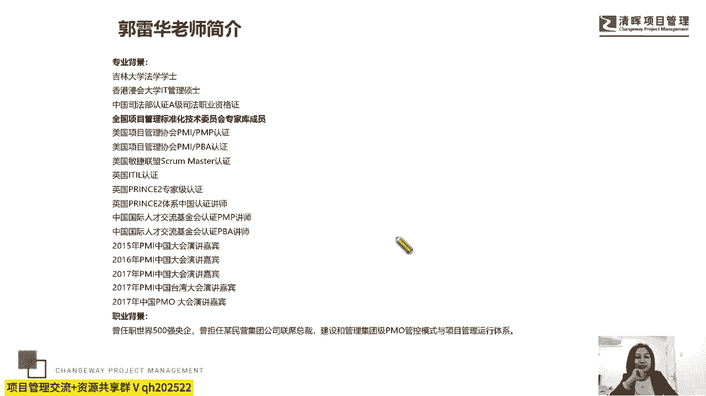
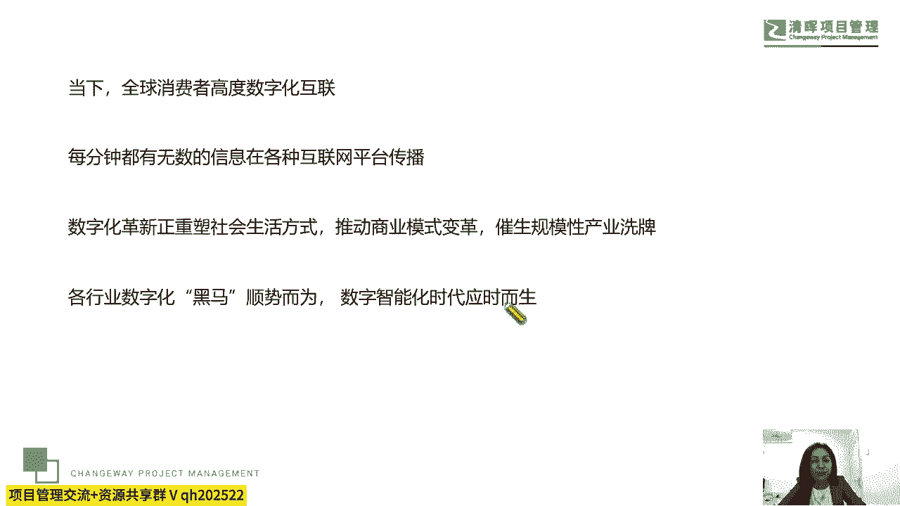
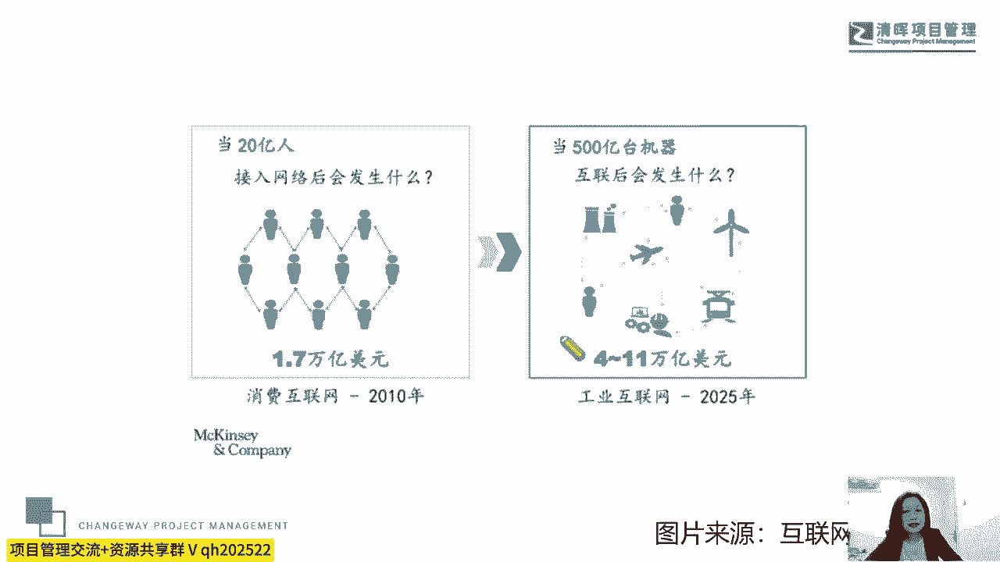
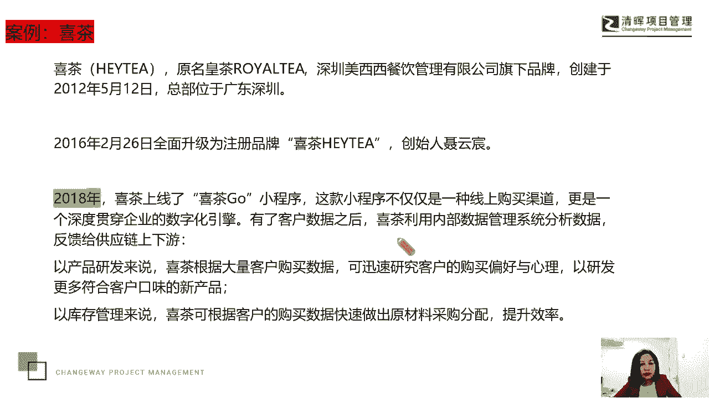
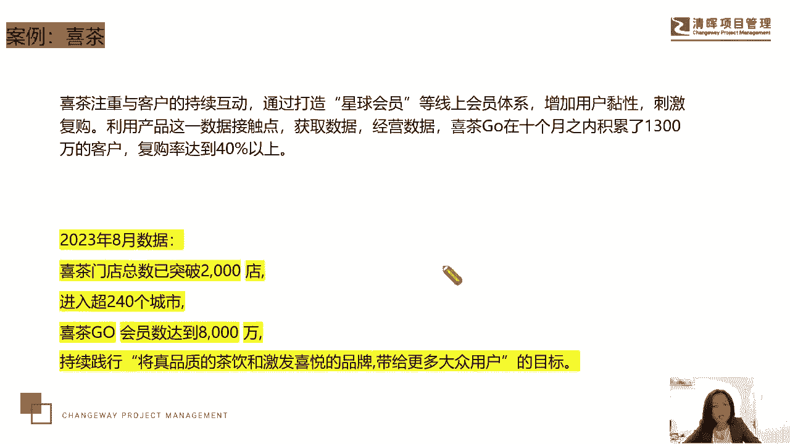
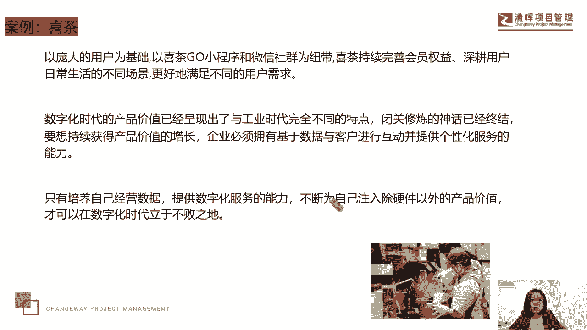

# 项目经理数字化转型五讲 - P1：1.项目经理如何理解数字化转型 - 清晖Amy - BV1FM4m1U7Nd

各位学员大家好，感谢大家在一周的辛苦工作之余，来到我们的清晖在线学堂，山水清晖，你我同行，让我们一起来开启今天晚上的交流课题，今天晚上我将与大家一起来交流这样一个话题，就是作为我们的项目经理。

如何来理解数字化转型这样一个课题，那么谈到数字化转型，我相信可能关于这个课题，这个名词与我们的工作，与我们的生活如影随形啊，好感谢大家，感谢大家过来啊，谢谢，那实际上今天这个话题呢。

可能聊起来会有一点点的枯燥，所以我也很一是很抱歉，二是呃，嗯也不知道大家是不是能够能不能有耐心啊，一起来聊一聊这个话题，但是我自己会比较关注这个课题和这个话题，我也会关注关这个数字化，唉，还有数字化。

还有这个智能化等等这些课题，我觉得它正在改变我们的生活，改变我们的社会，改变我们的这个人类啊，改变我们的这个人类，好，那么我们一起来聊一聊。

那很高兴大家会感兴趣这个话题啊，好那关于我的背景呢，我就不多介绍了，依然是老样子哈，希望能够嗯今天晚上的交流。

能够碰撞出更多的火花吧，好那么当今这个社会，其实我们面临着这样一个环境，就是当下呢全球的消费者高度数字互联对吧，那每分钟都有无数的信息，在各种互联网平台去传播，数字化的这个革新呢正在重塑社会生活方式。

推动商业模式的变革，催生出了规模性的产业品洗牌，那各行业数字化的黑马顺势而为，数字智能化时代应时而生，嗯给大家讲一个笑话吧，我其实在3年前，今年是2023年吧，我大概在2021年的时候，去一家企业。

应邀做一个企业战略和项目管理的一个转型，当时呢我提到了一个概念，我说我们要关注这个数字智能化时代的到来，对于我们的一个影响，因为这家公司呢它是做工业互联网的啊，他是这个号称这个呃这个什么呢。

叫百万APP的这个供应互联网的一家企业，那因为我们之前提到的是数字智能化时代，后来我就直接叫数字化时代，结果我们那个交流的课中间时段，休息时段，我就听到有两个人在外边聊天，说这个老师啊一直都是大舌头。

因为我说的是数字化时代，他们以为是数字化时代，但实际上我们原来说的是数字智能化，在后面我就一直哈哈缩缩裂了啊，所以每次看到这个词，我就想起那一次有意思的这个事情，那我正好在屋里头，他们在外面聊天嘛。

因为是休息时间，我听到之后，我回来之后，我在下半段的交流中，我就不再缩略了，我叫数字智能化时代了，好那今天晚上我们也聊一聊啊。

有这样一张图片说在2021年的时候，那么这一家很著名的公司做了一个模型啊，说是这个20亿人接入互联网，那么这个叫消费互联网，能够产生1。7万亿的这样一个市场规模，那么2025年。

那么当500亿台机器互联后会发生什么，就是有四到11万亿美元这样一个市场的市值，所以这个数字我们是不管它是用什么样的模型，来呃打造的。

或者说计算出来的，那么不可否认，我们说现在我们都到达了一个数字智能化，转型的一个时代，唉那么嗯数字化或数字化，那么它都需要我们去理解我们的工作，我们的生活将会受到数字化的影响。

将从数字化的方式开展我们的工作啊，那么我们给大家看一个案例，这个案例这个名词大家可能都不陌生，甚至很多人可能就是他的客户啊，不知道有没有特别喜欢的，那么因为我呢比较喜欢喝传统茶，比如白茶。

唉这个六宝是不是嗯，那么比如说在北京特别喜欢喝茉莉花茶，但是大部分的茉莉花茶呢，它都是用这个绿茶打底，但是绿茶呢它在传统文化中讲它比较寒，我也确实啊喝了绿茶，我觉得我有时候会胃酸。

所以我就会用寻找到了比较品相好的，用白茶打底的茉莉花茶，或者是用六宝打底的茉莉花茶，嗯好，那我们先来回到这个年新兴人类，年轻人喜欢的这个课课题啊，叫什么呢，叫喜茶，那这家企企业呢。

他最早创立于2012年5月12日，总部在北京，那么在2016年2月26号，全面升级为喜茶这个品牌，嗯在喜茶这个品牌，那么在这种情况下呢，嗯2018年就是它前面的这个发展，我们不关注。

我们关注它和数字化有关的那一部分，在2018年，喜茶上线了喜茶购这个小程序，那这个小程序呢不仅是一种线上购买渠道，也是一个深度贯穿企业的数字化引擎，有了客户数据之后，那喜茶呢就利用内部数据管理系统。

分析数据反馈给供应链的上下流上下游啊，从产品研发来说呢，那喜茶呢他喜欢大，根据大量的客户的购买数据，来迅速研究客户的购买偏好和心理，来研发更多符合客户口味的这个新产品，那从库存管理来说呢。

喜茶可以根据客户的购买数据，快速做出原材料的采购分配。

来提升它的一个效率嗯，那喜茶呢，它实际上呢非常注重与客户的持续互动，通过打造这种星球会员等线上会员体系，增加用户粘性，刺激复购，利用产品这一数据接触点来获取数据，经营数据嗯。

在喜茶2018年上线十个月之后，就积累了1300万的数据，复购率达到了40%，在他这个喜茶构上，那我想说一下，看看20123年啊，也就是2018年，他上线了这个喜茶的这个喜茶购，这个在小小程序。

2013年8月，就这个月这个月初喜茶的官方啊官方报道数据，他说呢这个喜茶门店总数已突破到2000家，进入到了超过240个城市，喜茶购的会员达到了8000万，大家看一下8000万，那么他们也在持续践行。

把这个真品质的茶饮和激发喜悦的品牌，带给更多的大众用户的这样双标，所以这就是一个广泛的去应用数字化，坚持数字化。

也可以讲，他从18年就已经捕捉到了数字化的影响，因为你大家都知道我们的日常消费习惯中，非常多的企业可能都有自己的小程序对吧，那么都可能有自己的APP，那在这种情况下。

那么是不是能够把这个小程序app给它用好，坚持去用，甚至能够保证它的一个日活量，能够保证它的一个营销价值，能够产生数字化的这样一个价值。

那么在细查身上，我们是看到了啊。

所以我们说以庞大的这个用户为基础，以喜茶购小程序和微信社区为纽带，那么喜茶呢它持续完善会员权益，深耕用户日常生活的不同场景，更好地满足了不同的用户需求，所以我们说在当代这个社会，数字化的这种产品价值。

已经产生出了，与我们的工业化时代完全不同的特点，闭关修炼的这种神神话已经终结了，所谓酒香不怕巷子深，在这个时代真的完全被颠覆了，那么我们要想获持续获得产品价值的这个增长。

我们的企业必须拥有基于数据和客户进行互动，必停并提供个性化服务的这种能力，所以我们说呢真的是只有去培养自己经营数据，提供数字化服务的能力，不断为自己注入除硬件以外的产品价值。

才有可能在这个数字化的时代立于不败之地，那关于这个观点，关于这个案例，所有的数据都是来自于官方报道的啊，我想问一下大家，大家有没有这种感觉，实际上我们每天在互联网平台，不同的平台上去去看资讯啊。

休闲也好，或者说是专业化的这种资讯寻找也好，大家都知道算法现在更加叫算力，对不对，他都是和这个数字化有关的，经常会被推送是吧，哎那我我有一次出差，跟我的这个我们的助理老师，我们两个人坐高铁。

我就会发现一个很有意思的事情，像我呢看微博，我呢看百度，然后我们这个小朋友作为九五，九五后的新新人类啊，九五后的新型人类接近2000年千禧年的人，他们一路在在看什么，你们猜他们在看什么。

他们在看小红书啊，女孩子在看小红书，哎我其实平时不太看小红书，然后我就会发现他看到的小红书的推送方式，跟我用百度，我通过百度微博给我推送的都差不多，跟你的认知热爱习惯，阅读习惯啊。

你关注的点是都是有关系的，那实际上这也是我们被数字化所驱动的一种啊。

