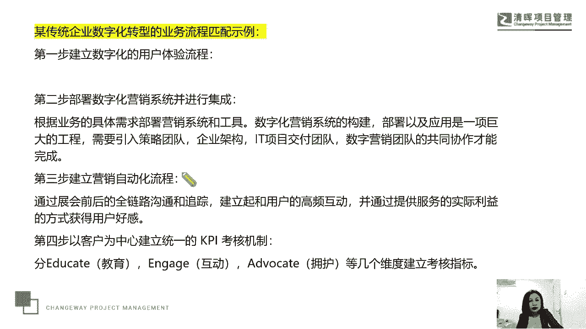

# 项目经理数字化转型五讲 - P4：4.数字化转型失败的土些原因分忻 - 清晖Amy - BV1FM4m1U7Nd

那么我们刚才提到了，就是说在数字化的转型中，一定要引入敏捷的理念，不管你们这种i it的项目用不用敏捷方式来做，一定要敏捷的理念，因为敏捷价值观，敏捷原则，敏捷开发模式。

就能够帮助我们去搭建我们的数字化转型的，这个呃这个初级的模型，因为他有试错的机会，因为它更加注重我们的这种身段，柔软身形嗯，这个什么灵活的这样一种企业的这种成长能力，腾挪跳跃的这种能力对吧。

数字的数字化时代，所有的一切一定是有涌现这个特征的，大家知道涌现这个词，是我们在项目管理中出现在敏捷项目管理，他要求我们的这个block product啊，我们的product backlog。

就我们的产品待办事项，相当于我们要交付的这些功能，它要有本种现实的一个特征，那涌现这个词，大家以前跟着我们一起了解过，它出现在我们这个宗教里头，宗教里头会有一些新的想法对吧，它出现在哲学里面的心理学。

它会出现在植物动物学，它会出现在金融学啊，也会出现在我们的软件IT行业，那么它其实就指的是动态的突发的，那么原来没有规划，原来没有成立的，唉，没有案例的，那么新的情况有可能就是对我们刚才所说的。

通过数字化反哺出来的新生事物，所以敏捷，他的这种关于涌现的，这种对涌现这个状态的一个拥抱和承接能力，决定了它会助力我们的数字化的这个转型。

那么一个企业要想实现我们的这个数字化转型，我们说呢要从这四个层面，从认知层，从流程层，从应用层和组织层这四个层层面，我们要去做什么。

要去做这个推动，我们来看一下啊，我们也服务一些企业，他们在或多或少或深或浅或长或短的，这个长短就指的是时间啊，多与少就指的是局部或者是整体啊，深与浅就指的是嗯微转型还是这个重转型，这几个维度。

我们总结了一些经验，我们会发现呢，其实数字化转型第一个是认知层的一个问题，那么在我们刚才那个转型推进模型中，第一个就是我们的这个认知层，那么认知层出现问题的原因，就是数字化的这种转型。

数字化的这种对于企业自身的一种营销能力，因为我们要创造价值，不管你是to b to b to c，你都有这种营销能力嘛对吧，那数字化的这种转型营销能力的认知没有建立，那么也就很难实施彻头彻尾的改革。

所以导致和数字化转型有关的项目，做着做着夭折了，我们来看看这个认知层这个问题怎么去理解呢，认知层不仅是我们的执行层，项目经理这个层面的，认知了很多公司的这个数字化转型啊，嗯上下没有打通是绝缘的。

隔热的啊，没有就是说我们所说的这个打通，那没有打通的，原因就在于，第一层是我们的最高的各种什么CXOCFO，CEOCMOI等等，那么他们在对于数字化转型的这种支持认知，同理心上没有实现。

因为我们的CEO要去负责，批准整个数字化转型的战略，我们的CMO要负责数字化转型上，这种方法论的这种输出，对吧，哎那么我们管理流程的建立，数字化手段的落地和数字化组织的建立，这都是我们CMO要去考虑的。

那么我们说呢，这个CFO要去考虑到我们的预算的选题，那第一层有了就是我们的上边唉高上层，那么我们中间层是我们中间管理层的认知，我们的各种什么技术总监，产品总监，市场总监，项目总监，电商总监这一系列啊。

我们说的这个其实是我们的客户他的一个特征，但脱敏之后就允许客户也是允许我们出来拿，因为这个衣服我们从搭建的和诊断的，那么很多公司呢PO啊，甚至卓越绩效中心啊，甚至QA部门。

这都是我们所说的去负责我们的嗯，结构方法流程，数据标准化的来绩效管理的这些部门，那么他们要有一个对于数字化的一个认知。

这是我们的这个认知层，那么这两个认知层如果打通了，认同数字化转型啊，对数字化转型有理解，甚至有什么有实质性的这种推动，我们知道这个在偏激中有个理念叫什么，叫干系人参与矩阵对吧。

那么我们说要去要去考虑什么，要去考虑，我们叫对于我们的这个嗯肝细人的管理，那肝心人的管理有五个模式，还有五个阶有五个状态，第一就不知道，就是我不认为这个事情和我有关系，我不知道他和我有关系。

那第二个呢就是我知道他会有关系，但就是知道那第三个我们说他会干什么中立，那中立的意思是什么呢，就是我们所说的A我无所谓啊，不积极也不反对，那接下来是我们所说的，还有反对的层面，那还有什么层面呢。

引领和推动这个层面这几个层面，那我们的这个呃这个企业，我们的中层和我们的高层要去真正的去，不是说我中立，不是说我去反对，而是说要去引领推动这个我们的数字化转型，那么如果我们从上而下的这个推动力有了啊。

这种推背感有了，能推着整个企业去前进，那么我们说呢就要达到我们的流程层了，巧妇难为无米之炊，那么支持数字化转型的流程没有被建立，或者没有密接匹配，这是我们服务的企业中。

他们数字化转型受挫不顺利的一个第二个原因，刚才是说这个认知层没有打通，没有自上而下的推背力，唉没有推背感，所以举步维艰，靠我们自下而上，这个是很难的，那么流程层呢，我们说你得去支持这个数字化转型的。

我们所说的这个信息化嘛，那么流程的建立，那么仅次于认知要比应用层要高一层，我们四个层面，认知流程，应用和组织层，因为如果我们能够建立这个流程了，就数字化转型的这个匹配自己的流程，无论你的人员如何流动。

你企业的营销如何去推进，那么这个流程的建立，都会有利于你的管理效率的提升，那么你的管理方法的规模化和可复制性啊。

这是我们提到的流程层，那么我们来看一下某一家企业啊，他们做数字化转型在业务流程层面的一个推进，这也是一家，我们觉得我们服务的比较好的一个企业，他第一步就是建立了数字化的用户体验流程。

I是基于他通过各种啊，各种在这个小程序上去嗯，去在线的哎，33D3维的去感受你的业务，来体验它的这个业务，它有一个数字化的用户体验流程来吸引你，然后让你来干什么，到现场实现购买或者实现真实的线上体验。

在这个层面上，这是我们所说的数字化的用户流程体验流程，它搭建起来了，那么第二步去部署数字化营销系统并进行集成，那根据业务的具体需求来部署营销系统和工具，通过数字化营销系统的建立。

那么它呢去引入了一个很扎实的团队策略，团队唉架构唉，我们的it交付团队，然后打造了一个数字营销团队，那么第三步建立营销的自动化流程，我们说通过这个整个企业项目之后的，这个全链路的这种沟通和跟踪。

那么建立起和用户的高频互动，来提供服务的实际利益，来获得客户好感，那最后就他们的绩效考核建立了新的机制，就以客户为中心，我们怎么去教育客户，这个教育客户的意思就是说，让客户对我们的产品。

对我们引领的产品理念，对我们引领的消费习惯，对于我们引领和推荐的使用习惯，有这样的一种认知，那第二我们去互动，那第三我们去拥护，拥护的意思就是说增客户粘性，爱客户下单成交率等等。

来打造他的API的这样KPI的这样一个指标，所以他们的这个数字化的这种三套流程啊，那么一个是我们的体验流程，一个是我们内部的这种像中台一样的，我们的这种营销系统，然后我们的这种集成。

然后我们的营销自动化流程和我们的这种爱，支撑这个的我们的一个管理应用，结果就是我们的p pi的考核也是一个流程，很多公司的项目是没有KPI考核的，或者KPI考核的模式方法不先进或不明显，就会导致嗯。

大家呢在这个推进数字化转型，这种项目上的积极性也并不高啊，这是我们的一个企业的一个案例，那么我们说刚才讲到的是我们所说的。

这个叫我们的嗯认知层和我们的这个流程层，那有了认知和流程，我们的应用层怎么办好，我们最担心的就是什么应用层的这个瘫痪症，有没有非常多的公司那个cm系统啊，咱就不要说现在人工智能CHAGDP了。

咱就说这个cm系统，咱们就说这个他们公司的这个ERP系统，都是在瘫痪的，我们最近服务的一家企业叫嗯特别有意思，就是他们公司呢有CM系统，有ERP系统，有各种哎项目管理的p mix系统。

但是这家公司有一个特别优秀的项目经理，他呢也是公司重点培养的，就任何一个时代，我一直都坚信，任何一个时代都是最好的时代，任何一个时代也都是最最最难的一个时代，那么这家公司呢。

呃他说呃他们在重点培养那个项目经理，他自己就成长了，他走的特别的快，他说用chat GDP啊，他们可以去优化他们的需求管理，然后呢可以去优化他们的开发，他说他呢把他自己在一个小项目上。

基于这个层面的一个呃实实践分享，经验分享给全公司了，然后全公司呢就正常的去推荐应用，结果发现呢没人喜欢用，不喜欢用的原因就是大家习惯用传统的模式，然后慢一点就慢一点嘛，不创新就不创新嘛。

所以这个项目经理很苦恼，那么他是他的成长肯定比这个企业的成长要快，你们知道为什么我说这句话吗，因为啊第一当CHINEGP出来之后，很多企业都在思考研究这是个什么东东，对不对。

哎我们都在开CHINEGP的玩笑，那么有因为你用全GP就可以做尝试着做，试验着做很多事情，但是这个这个项目经理他不是浅尝辄止，因为最近可能用他的GDP来开玩笑，在社交媒体上的人已经很少了。

这个热浪已经过去了对吧，那真正研究他的人就还在继续研究，那么我们大部分人可能对这个事情的热度，已经没有了，但是这个项目经理，他已经真的去用产品GDP去干什么，为公司的产品和业务去做服务了。

而且有了小小的成功案例，效率的提升的一个经验，总结了他把他推倒给公司，而公司居然在说我们去推荐应用，推荐就意味着什么呢，我们再回顾到一个蓝色巨人IBM公司，那么1993年上任。

4月1号上任的郭士纳先生讲过吗，员工不会做你要求期望的事，他只会做你要求的事，他也不会做你要求的事情，他只会做你什么要求之后有什么的，有检查的事情，他也不会做你有检查的事情，他只会做你检查之后有考核。

那可他也不会做考核的事情，他考核的时候一定有奖惩，这是人性的基本管理定律，那这家公司我刚才说这个员工成长的比企业快，他把这个东西贡献给企业了，但是企业只是建议，但建议就很多人是不动的，那不动了。

整个组织效率就是不提升的，已经有提升组织效率的方法了，但没有人去把它作为一个刚性要求，所以我说他成长的比企业快，那么这个项目经理最近在思考离职了，当你发现了一些好的办法，好的好的好的能力。

好的工具的时候，企业跟不上你的节奏，那么他就会离职，他他离职的抓手是什么呢，他用新的这种人工智能的方法，去做其做事情的这种能力，他现在这个成长的对接非常的好，所以当我们听到说大大厂在裁员。

35岁被毕业的时候，那么我们除了感慨和这个无奈之外，其实还有一点就是你改变不了环境的时候，要改变自己，强化自己的学习能力，对吧啊，所以我们说呢我们真的很担心这个应用，瘫痪症嗯。

这就是我们刚才讲这个案例的一个意思，所以数字营销手段的一个应用，它包含了我们的官网啊，内容啊，社交媒体啊，唉购买媒体啊，包括直播电商员工带货，那么数字营销工具的这个呃，这是手段，这是工具。

那么指的是如何对业务有利，那么决定系统的哪些模块满足什么目的啊，那么是我们这个策略和我们的，执行层面的这个问题啊，执行层面的这个问题，所以我们在应用层有营销手段，数字营销手段和我们的数字营销工具。

这两个模块好。

我们来看一下另外一家公司，他们在做这个应用层数字转型的这个内部分析，那么他们分析了一下啊，说这个我们这个转型呢有几个模块，一是用户特征，所以我们要深度分析，我们的客户是这个to b的还是to c的。

当然还有什么to g的，那么他们的这个消费习惯是什么，他们的消费内容以及对什么感兴趣，出于什么行业等等，这些决定性的用户画像，来影响我们的用户标签体系的一个搭建，来决定采取什么样的渠道，用什么内容。

用什么方法来做营销，嗯大家在机场，比如首都机场啊，虹桥机场，你会发现哦，有机会在这个这个机场去做这个呃，呃这个广告的就是我们在去，比如说下飞机了，从这个飞机上，通过这个长长的通道走到出口对吧。

哎嗯这个这个过程一定会看到大广告，你比如说我们经常看到飞书的广告，什么先进团队先用飞书，还有一类什么沃尔沃的广告啊，我我最近比如在虹桥，在上海啊看的比较多的，还有什么呢珠宝的广告对吧。

哎一些珠宝商还会传统的珠宝商会做广告，那么还有一些就是一些这种什么华为云呀，这个阿里云呀也在做广告，但实际上这种广告我就在想，是不是还可以去考虑一下用户特征，然后就是决定用华为云，阿里云的人。

他在机场看到这个广告对他有多大的影响对吧，哎所以我们说呢，这个用户特征在数字化转型内部，我们现在去我们的我们提供的产品，但我们的产品是提供我们的客户的，所以我们要去做客户的分析，然后营销目标。

那么我们要去考虑品牌的知名度，好感度，那么还有我们的新用户的获得，还有说我们的增长已有客户价值，那么也都决定了我们数字化的这个方法的使用，那还有我们的这个什么呢，资源和我们的预算。

那么很多企业它面临的这个客观情况，是我们这个资金比较紧紧缺的，那我们怎么去既为整了具保证了企业的成长，又保证了我们的这个数字化的一个转型好，那么我们来看一下啊，这个组织层，我们刚才说了我们的这个模块嘛。

它包含了我们的这个认知层，流程层，应用层，最后一个就是组织层，那么队伍不好带的，我们经常讲到一个一个段子叫什么呢，叫做定战略，搭班子带队伍，队伍不好带是吧，哎这句这个葛老先生的这个话，葛优说的很经典吧。

队伍不好带，那么队伍不好带，在带之前得干嘛，得先建队伍，所以我们说组织是最底层的，也是最基础的，我们要建立我们的什么呢，符合数字化治理结构的这个组织架构，来避免出现我们的组织僵硬症。

我们刚才说到应用层的时候，我们用了一个词叫瘫痪，瘫痪症，就这东西有，但他没人用，摊在那儿摆着，那没人用，那么组织僵硬，就是说我们心有余，很多企业就是种心有余，力不足，他也想用它比瘫痪呢状态要好一点。

是僵僵，就是它不柔软对吧，哎你说他没有这个东西吧，它有在组织层面上有这个理念，有这个要求，但是他就是没有非常灵活起来，对不对，那么我们来看一下啊，首先呢我们说这个企业要根据企业的特点。

和我们数字化转型所处的这个不同阶段，来搭建我们的组织架构，来因地制宜，唉这个因时制宜，一个是因地，一个是因时时间空间，这两个要素都要考虑，那么对于我们的初创企业，哎，我们的建议啊是复用现有人员。

就没必要去建立和数字化转型有关的，专业队伍了，因为企业规模本身不大，业务不复杂，那么这样的附现有的复用人员让他来兼职，但主责唉它数字化的转型，那么从对企业发展最有帮助的岗位和业务。

开始推进我们的数字化转型的这种探索，也就是有人一个两个，他承担了数字化转型推进的这个职责，挑业务唉，挑项目，挑人员，挑岗位，把我们的这个系统化和数据化给它应用起来，甚至从流程的搭建开始走起来。

那么对于我们相对成熟的企业，那么一定是要建立一个数字化转型的主责部门，来系统的推进，就相对成熟，规模再大一点，由这个部门去系统性的推进，那么对于大型企业，它会涉及到比如数字化这个事业部和事业部唉。

产品体系和产品体系之间，条线条线之间的这种组织协同，那么我们就要把数字化转型，集中到一个职能部门，相当于我们讲到的现在这种叫什么呢，从POPMO我们之前讲过啊，转型到了我们的这个什么呢。

叫做呃智慧价值中心啊，叫做智慧价值中心，那么我们说呢这样的一个部门他来支持他，在总部层面，他来支持不同事业部的工作，然后呢，就说在企业层面设立了我们数字化转型部门，同时我们要在事业部层面来设立知识。

这个数字化转型的这个数字营销人员啊，那么数字转型的推动人员，相当于我们以前的一家企业，那时候还没有提到这个数字化，我们是帮他们打造了这个PMO的这个系统，那么在这种情况下呢。

他们有组织层面的这种战略偏谋，还有我们所说的在这个什么呢，在这个呃事业部层面的这个业务篇谋，那么在职责上它会涵盖到项目管理，制定战略执行和运营向上汇报流程制定和优化，那从职能上就是我们说这个部门。

它包含了我们的网络运营，我们的搜索引擎，我们的社交媒体，我们的大数据营销等等，那无论哪一种模式，那么都应该是一个组织，他都要去负责数字化转型工作，或数字化转型项目的这种目标的协同，把数字化转型。

这个项目和这个工作本身要给他做分解，要拆解到与之相关的每个人去分工明确，职责清晰，要不然就会是一种愿望，理念啊，就会变成这个寒号鸟，就会变成叶公好龙，没有办法去落地，那么最后一定不要忘记啊。

这个马无夜草不肥，所以说一定要制定适当的疾病，通过量化的结果达成和完成交付的这个质量，客观评价我们参与人员的表现，然后让大家从精神和物质层面，都接受企业化转型，因为一定会打破这个什么啊。

打破这个我们所说的叫这个工作方法，工作习惯嗯，我给大家举一个我自己经历过的例子啊，我在去年的时候为宜家央企，然后呢央企的一个呃子公司，核心子公司去引入敏捷的训练和服务，以及课程因为是一个很重要的央企。

而他们说的核心子公司引入这个理念，所以我们的这个课程的这个课件呀，是经过公司呃班子讨论过的，不能随便瞎讲的，也不能随便举例子的啊，跟大家聊天可以随便聊一聊，但是跟他们讲课是很严肃的一个事情。

当然不是说不尊重大家啊，因为我们本身这个就是一个交流探索，因为那家企业很特殊，我们不能讲他的名字了，呃总之呢是公司要求我们引入预计划驱动型，就是偏僻加敏捷一起讲，重点要讲敏捷，但因为这家企业。

他承担了国家的这种大国重器的这种科研任务，而且要把科研任务转化为这种呃产品，要实现产品的交付和应用，在这种情况下呢，然后他们以往的研究模式一定是预计瀑布型的，就是设计好了干什么开发开发好了测试。

然后一环扣一环流程成熟流程标准，然后大家在这个区，在这个环境下呢就工作的比较舒服，这种舒服是精神层面的舒服，不是没有需求变更，但是需求变更就会走比较严格的变更流程，就有很多人从40多岁到50多岁。

在这个企业已经工作了很多年，他们按这种模式已经走惯了，但引入敏捷理念有一个前提，就是要求拥抱变更，响应变更要因为他们研究的大国重器，这种大国重器又不是我们国家才有，他要对标国际，对标国际的产品。

它的市场变化，它的一个应用方式，甚至可能由于国际国内环境和形势的一个变化，它带来的一个紧迫感，所以以前那种计划驱动型，预测型，把设计完全搞好了，再去做什么开发，然后再去做测试，再去做集成已经不行了。

他就必须要用敏捷模式接受变化，迅速变化，然后不断的去试错，然后甚至要用到类似于像极限编程这种，每天重构，每天集成，每天测试，所有的工作节奏都被打乱，负责做流程的人都是蒙圈的，因为他们既要保证合规性。

还要保证过程的严肃性，还要保证出成果，所以流程的人都带着睡袋在干什么，在补流程，每天在跟流程跑流程，整个的一个混乱状态，然后在这种混乱状态之下呢，嗯领导就觉得还要给他们做个培训啊，所以去年我们去呃。

经过层层筛选，我去给他们上这个课，也给他们做教练，结果有一名这个50岁左右的老员工，在课堂上他就爆发了，因为他不接受敏捷理念，他说我们这种项目怎么能够随便给，他，不可能不敢去跟领导去杠。

但是都说外来的和尚好念经，我这个和尚，我这个尼姑就没把就没没没有制服他，他就直接说这个课有什么意义呀，这就是在忽悠人，哪个公司的重要项目会不严肃的去拥抱变化，响应变化会不尊重合同和流程。

会不要合同和流程，因为我们今天在座的学员，基本上都考了ACP或者PNP了嘛，大家都是知道这个敏捷的原原则和价值观，所以我就没有贴出来，因为以前的交流中经常贴，我怕今天晚上大家看到了，太烦了，我就没贴。

但大家都知道的对吧，我们讲的是我们重视什么左边，但是我们更倾向于加入右边的动作啊，就是左右两边的敏捷与敏捷价值观，但他就要一定要曲解为，就是怎么可以没有流程呢，怎么可以没有合同呢对吧。

怎么可以没有计划呢，他一定要跟你杠，然后呢，他说怎么可能随随便便的去响应变化呢，我们这种项目到最后怎么能够变呢，然后他的领导就因为在课堂上讨论，他就爆发了，领导就觉得很尴尬。

这个班子成员在中国可是一个特殊的含义，大家都懂的，党委会开会审审议过的嘛对吧，所以呢有领导就说郭老师，您先别着急，我来跟他交流一下，他们领导也没有说用这种什么管理权力，他还是用的是领导的这种能力。

就是引导他，他说你说不接受变化，那么咱们的项目在以前没有引入敏捷的时候，变没变过，你们有没有因为必须要变，但是变更流程又太漫长，太复杂，你们又影响你们的进度，然后你们有没有士气低落，有没有找我投诉过。

就领导真的是特别耐心的跟他掰开了，揉碎了，把领导他自己理解的敏捷流程，和这个员工提出的问题一条一条的去杠，可能平时这个领导没有机会这么跟员工，用这种放松的方式来探讨方法论，探讨体系。

然后最后把这个人给用领导的话说，我把他制服了，郭老师，你接着讲，没问题，中午吃饭的时候呢，我们跟领导在那个小桌上吃饭，领导跟我说了一句话，他说嗯郭老师，你理解一下，就是他们一加班很辛苦。

第二这种流程的变化，需求的变化，他们接受不了，尤其是这个老员工，他平时工作就是非常的僵化，当然私底下讲啊，说他非常的僵化，他非常的严肃和认真，一板一眼，所以你让他理解敏捷理念，他真的很难。

包括他完全不认同我们这种爱极限编程，每天重构，每天测试，就这个领导也是技术出身的，他完全知道他们在研发设计中，主用的这种敏捷工作模式，这不是简单的scream了，是用极限编程来交互的。

那么他说他完全不理解，他也跟不上这个节奏，所以呢嗯他也痛苦，他带的团队也痛苦，我们最近已经打算就是让他去做这种顾问了，就是不担责，唉那么去做技术顾问，他不承担具体的这种研发任务，因为研发任务有指标嘛。

有这个严格的考核，他跟不上，他就很苦恼，这个人是个好同志对吧，所以这就是我们提到的，那么在组织层面上，我们会遇到这样一个比较极端的在数字化转型，在敏捷方法落地运营过程中的一个员工。

那么嗯这家公司呢还是很顺利的在推进，因为大浪大浪淘沙，一定会有人跟得上，有人跟不上，而企业呢也是这样子，企业呢他一定要从精神和物质层面给予激励，对吧，给予激励，因为他们这个项目的奖金很高，你掉队了。

你去做顾问了，你的奖金就没有了呀对吧，过分的奖金是比较低的，但是真的跟上这个节奏走下来的，那么奖金就拿到了，辛苦呢也有一定的回报。

这就是这个社会的一个本质的现实，所以我们说呢这个不同层面的这个企业啊。

它都会有我们的这个什么呢，都会有我们的这样的一个管理模式，就是我们要去搭建我们的这个企业的这个，数字化转型的一个推进，那么去构建基于我们数字化转型战略的一个，金字塔的模型，那么最顶层是我们的认知层。

那么又分为高层和中层，要为我们整个公司带来数字化转型的推背感，那第二个是我们的中间层，就是我们的流程层，要带来规模化的效益和效率的显著提升，要快速的优化流程，重构我们的流程。

那么接下来用应用层来承接我们的流程层，应用是千变万化的，那么它影响的核心因素，就是我们的产品所对应的用户特征，因为像刚才我们讲的这种，他都不是说是真简单的，是什么，这个to b端和to c端了。

它一定是to g端，为国家爱交付的，那你这个国家的交付，他就要跑抛放下你个人的这种习惯嘛对吧，你个人的这个习惯，那你就要去适应，去改变，跟不上，那只能被淘汰，所以这个用户特征他们做的是to c端的。

甚至这种大国重器的项目，还有我们的营销目标，我们的资源和预算的匹配，那最底层呢，我们说是数字化转型的这个组织的搭建啊，要去建立这样的组织部门，在这个推广过程中，它可能涉及到企业文化，涉及到绩效考核。

涉及到人员资源，所以我们要因时制宜，要因地制宜好。

