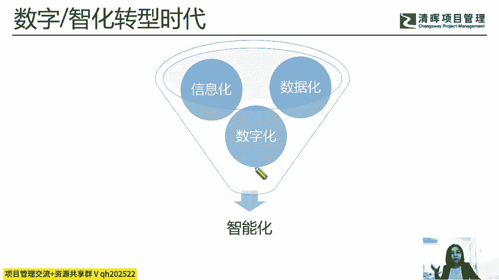
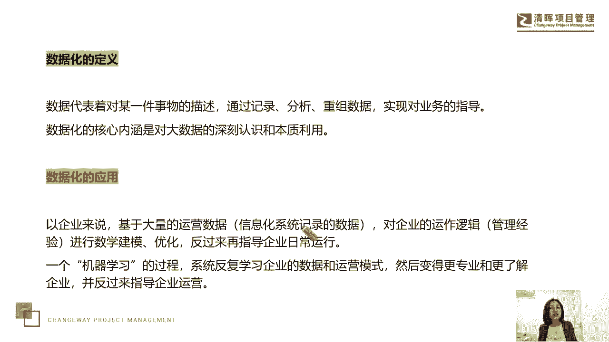
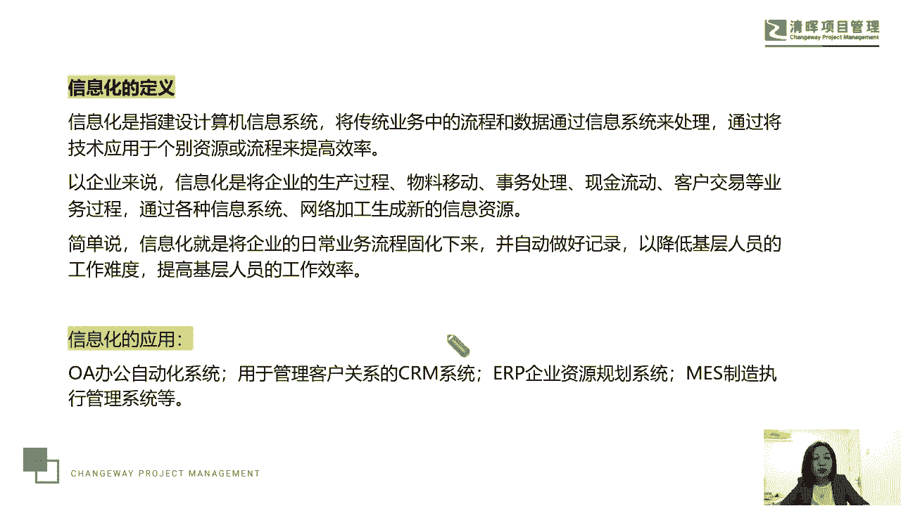
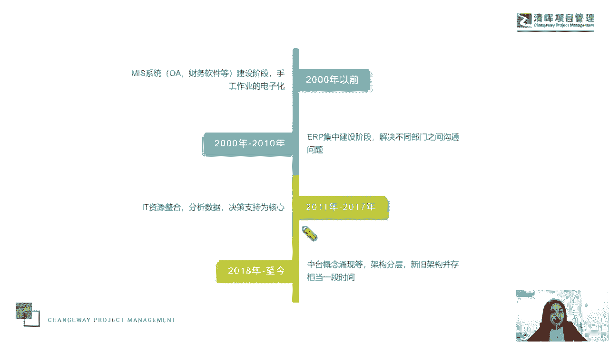
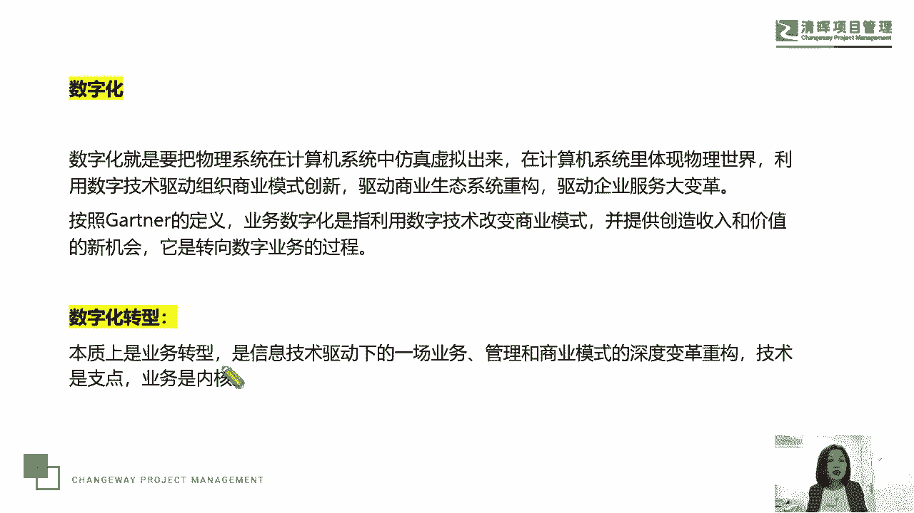
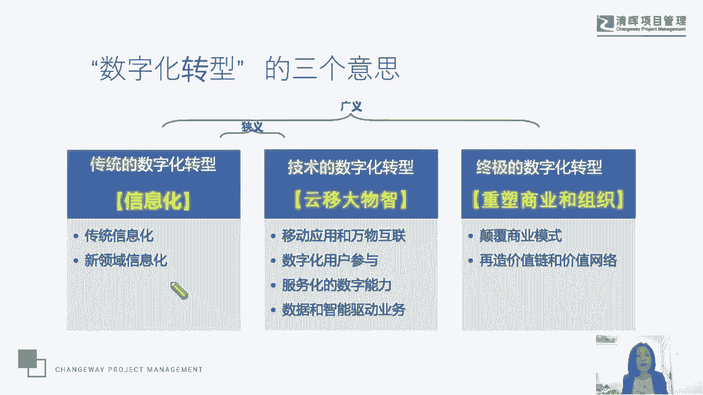

# 项目经理数字化转型五讲 - P2：2.数字智化转型时代 - 清晖Amy - BV1FM4m1U7Nd

习惯，所以我们可能要去关注这样几个词，就在当代社会在数字化转型或者是数字化，就是数字智能化转型时代，我们可以去思考一下这几个词，一个呢我们就是叫信息化，一个呢叫数据化，还有一个叫数字化。

还有一个叫智能化，大家觉得这四个词有什么区别吗，今天晚上可能很多朋友都看到了我们的海报啊，那我们的海报呢也讲到了，说我们将会围绕这四个数这四个名词，然后结合企业现在在数字化转型中的一些问题。

包括我们项目经理怎么去理解这件事情，或者我们一些机会在哪里跟大家聊一聊，所以有陆续进入到我们直播间的同学，跟大家打声招呼，问问好，感谢大家一直特别捧场啊，因为可能大家也都知道。

我们郭老师每个月大概会有3~4次的一个，线上直播来跟大家交流不同的课题，我一直一直都很喜欢教学相长这个词，每一次我去挖掘挖掘，寻找新的课题来跟大家交流，在我准备它的内容的同时呢。

其实也是一个自己成长学习的一个过程，如果也能给大家带来一些思考，我也会很开心啊，好那我们就一步一步来看，首先在这个词里，在这个模型里头啊，我想说的是，我在做这个模型的时候，我最大的一个感觉是什么。

就是我们的数据化，信息化和数字化，那么像什么，像这个饺子一样，扑通扑通扑通就跳进去了，跳到一个大锅里头，然后这个锅里头叫什么呢，叫智能化，跳到这个大锅里头了，我自己今天在做这个模型图片的时候。

我就有这样的一种感觉，实际上他们还不是完全有先后关系的。

但如果一定要说的话呢，那数据化这个词既是现代，在智能化时代我们要用到的也是一种行为，那么比如说我们业务数据化或数据业务化，有这样一个说法吗，就一切业务数据化，然后我们的数据业务化，把它数据给他管理起来。

做业务，通过数据产生我们的业务价值，但实际上业务数据化这个词，本身有可以回溯到最早的时代，比如说我们读的古人会结绳记事对吧，那个时候在我们的古人古代那个年代，我们就会有关于数学算学。

然后我们会通过结绳记事，我们会记录这个时间，记录这个事件，所以数据它代表了对某一事物的描述，通过记录分析重组数据，实现对我们的业务的指导，那数据化的这个核心内涵，是对大数据的深刻认识和本质利用嗯。

我曾经辅导过一家这个做投资的公司，大概在5年前呃，那是一家私企，他们做投资额规模呢并不大，但是是一家家族企业，然后这家公司的董事长，他就有一个很明显的特征，就是别人给他推荐的项目，只要和大数据挂钩。

他就特别的感兴趣，他对大数据这个词特别的感兴趣，所以就导致他下边的这些什么呢，大项目经理哎，就是说做孵化的，做投资的这些大项目经理，下必效之，就会去找那些有大数据特征的这样的企业呃。

然后呢没有也会想办法去包装来，以便拿到这个企业的一个投资，和这个企业的一个孵化的机会啊，所以这里我们提到说，数据化的核心内涵，是对大数据的深刻认知和本质利用，那么数据化的应用起最早，比如说像我们去记账。

对不对，哎我们要去记账，那我记得在这个我非常喜欢看的两部电视剧哎，几部吧，排名前几部，我大概有自己喜欢看的十部电视剧，在我的句库里头，这些剧都会反复的看，其中有一部叫知否知否，很多男男生可能不太爱看啊。

他不像甄嬛传讲的是宫斗，他其实讲的是这个女子的生存智慧和成长技巧，我是这么认定的，反正每一段我都觉得非常的好，那么在这部剧里头，其实明兰女主人公在结婚之后，然后呢要养她的丈夫的这个呃。

就是所谓的这个这个前妻的女儿吧，啊妾氏的这个女儿包括这个什么呢，他大伯大伯嗯嗯嗯这家的这个女儿，就他的大大伯哥的家的女儿，她家在教育这两个孩子的时候呢，他就让他们学会持家理财，在持家理财的时候。

他们就问了一个问，就让他们看过去的这个账本，家族里过去的账本，让他们发现一些问题，那看账本记账，那就是数据化嘛，来经营一个家族的这个产业对吧，你看王熙凤还得时不时的去放点租，放点高利贷。

要不然钱也不够用，对不对，这就是我们所说的这个数据的运营，而且那个你那个知否的那个剧里头啊，那两个小朋友也就678岁的样子吧，啊然后已经开始读书啦，读诗词了，已经开始计算给记账理财了。

他们就发现一个问题，说是在过去的某一年，那一年，这个我他们家族里头，用于这个购买粮食的支出特别的高，咱们就查询了一下，是人口发生了巨大变化吗，没有，那么是那一年的这个这个涨粮食涨价了吗，对吧。

那么他们就要分析，那还有那一年遇到了什么灾难吗，通过这一系列的数据对比，他们会发现嗯，原来是家里的管家干什么贪污受贿了，所以我们说呢对于大量的这种运营数据，这个信息化系统记录的这个数据。

对企业的运作逻辑啊，管理经验进行数学建模优化，反过来再指导企业的日常运行，那么我们看那一段啊，我经常讲就说如果你研究项目管理，你会有一种职业病，就是你看到任何一种生活和事业工作场景，甚至看剧。

你都会想到他和项目管理有关系，所以我们在谈到这一段的时候，就突然想起在知否里那一段了，后来他就得出一个结论，那么就是你再信任的管家，你也要监督他，就像我们说既要管理又要什么呢，领导，那么既要有胡萝卜。

也要有大棒，你再信任他，时间久了，他会利用你的信任去做一些不好的事情对吧，所以我们说呢，这就是我们所说的，用大量的数据I进行建模优化，在引导我们的企业日常运行，那在那部剧里头，他是在金融操持一个家族。

那么它是一个我们说数据化是通过机器学习，反复系统的去学习企业的数据和运营模式，然后变得更加专业，更了解企业来指导我们的企业运行，所以从古人的结绳记事，到我们现代化中的，通过机器学习来经营管理我们的企业。

让我们变得更专业。

这个叫数字化，那么信息化，我们说去建立我们的计算机的信息系统，把我们业务，传统业务中的这个流程数据，通过信息系统来处理，然后通过技术应用于我们的流程，来提高我们的这个效率啊，比如说OA的自动化办公。

客户关系管理的cm，企业管理的这个ERP，对制造管理的MES对吧，还有我们项目管理的CHEMIES，IDMIS这样一些项目管理的一些系统等等，这都是我们所说的信息化啊，信息化。

那么信息化呢，实际上它也从2000年前到基本的miss miss miss系统，OA系统对吧，财务软件到后来ERP到，再到后来呢我们说现在这种中台的概念唉，架构分层等等这样的一个呃过程。

那我们刚才谈到这个数据化，还谈到了这个信息化，现在我们再来聊一聊什么数字化，数字化，就是把物理系统在计算机中仿真虚拟出来，在我们的计算机系统是体现物理世界，利用数字技术驱动组织的商业模式的创新。

驱动我们的商业生态系统的重构，驱动企业服务大变革，其实刚才我们在讲这个喜茶的案例，洗茶垢，这个这个APP其实做一个APP，做一个小程序真的不太难，在当今这个社会，但是你怎么能够把它用好。

也就是说我们在计算机里头给你出钱，你别说我们以前买东西，你不得到喜茶的门店吗，对吧，哎你就到门店去排队，你得去下单，你得去交易，但是现在你在计算机系统里，你在手机里，你在我们的小程序上。

就像就像有柜台了啊，就像有收银了对吧，然后呢建造了一个物理世界，然后用这个数字技术去驱动我们的商业模式，做了一个新的创新啊，然后驱动了它的生命生态系统的重构，来实现了他的企业服务的大变革。

所以刚才喜茶的那个案例，完全就是这段话的一个经典再现，那么我们说呢，这个业务数字化，是利用数字技术来改变商业模式，提供创造收入和价值的新机会，把他们转向数字业务的这样一个过程。

其实这个数字化的这个服务啊，在我们当今社会里头真的是完全不同了，你像咱们讲一讲，刚才我们讲的是大的这种企业，那我们说说小的企业，那这个小的这个企业呢嗯也有啊，比如说很多个人的这种。

我们经常以前以前有个词叫个体户对吧，现在叫个人创业，那么你像我认识的一个朋友啊，她是我的一个我我闺蜜的一个好朋友，她以前在线下开服装店，那么在线下开服装店，他就要找到人流量比较好的这种街商店。

街街区商铺，然后租金每年都要被上涨，然后呢他能获取的人流，就这条这条街或者有商圈的，那现在在最近这个过去的3年，由于疫情逼着他把自己的店开到了线上，然后他把他以前这个库房。

可能就随便找一个什么很便宜的地方，他现在在一个写字楼里，用很便宜的价格，拿了一个非常大的500平米的这个什么办公区，然后作为他的销售场所，大家想想，开服装店怎么会开到一个办公楼的高层呢，它可以啊。

那么第一电梯好，第二这个办公区呢每周一到周五都可以供什么，空风暖，供空调，冬天有暖风，夏天有空调，很多办公区周末是没有空调的啊，他这个地方有唉，有签了协议也能保证，另外呢电梯也很便利，价格又便宜。

然后环境又很好啊，全部是大玻璃，然后外面有有这个河景，在市区里头有河景，非常满意一个环境，那么他呢按照不同的风格，打造了他的一个这个摄影棚，打造了他的直播间，大家听懂了吧，哎直播销售。

所以它其实就是数字化转型，那么它整个的世界可以做到全世界了，那么他自己也做了一个自己的什么，他通过百度也在卖，通过淘宝也在卖，通过抖音也在卖，小红书也在卖，而且他自己也像洗茶垢一样。

打造了一个自己的这种小程序，在小程序上下单，他会有更大的一个优惠，它完全就在走，刚才我们说的喜茶购物这个模式，那么它其实就是我们说本质上数字化转型，本质上就是我们的业务转型。

是信息技术驱动下的一种业务管理，和商业模式的深度的一个变革，和我们的重构技术是支点，业务是内核啊，所以他为我们带来了无限可能，那还有大家知道吗，就是另外一个朋友知道在卖什么，买家厨房用品啊。

那以前你可能做批发，你可能做零售哎，但现在他在网上卖，他就每天给你干嘛，在线在在晚上给你直播，他是怎么擦这种各种脏东西，清理厨房，反正咱也不知道他怎么找的那么多厨房，每天都擦。

然后擦完之后就告诉你怎么样能擦的更好更快，然后呢我有这个产品，反正我们去下单，在各种什么超市的APP上去下单，和在他那一下他自己的这种小程序下单，没有什么区别呀，在百度上给他下单，真的就靠这个方式唉。

把这么一个很小很小的百货类的，一个小品类的一个产品做到了什么，做到了全中国啊，这就是我们提到了数字化的转型。

本质是我们的一个业务的一个转型，那数字化传统的这个数字化转型呢，它是信息化，就是传统的信息化，新领域的信息化，唉可能信息的发布，信息的这个沟通交流和展示，那么到了我们现在提到这个这个云出现了之后。

那么云时代了，那么有移动应用和万物互联，数字化的用户参与数字化的数字能力啊，那么到了现在我们说呢，中期的数字化转型就是完全去重塑我们的商业，和我们的组织，颠覆我们的商业模式。

再造价值链和我们的这个价值网络啊。

这是我们提到的数字化转型。