# 项目经理数字化转型五讲 - P3：3.数字化转型案例分析 - 清晖Amy - BV1FM4m1U7Nd

那我们再来聊聊这个智能化，智能化这个词大家其实也一点都不陌生，我们说呢是使我们的对象具备灵敏，准确的感知功能，正确的思维和判断功能，自适应的学习能力啊，这种自适应，就他能够主动的根据环境的一个变化。

以及行之有效的这个执行功能而进行的工作，好文静你好，感谢大家啊，来到我们的直播间，那我想问问大家，大家对于智能化恐惧吗，对于人工智能恐惧吗，因为我们说他会有这种正确的思维判断，有自适应的学习功能。

那么这种自适应的这种学习功能，实际上它能自适应到什么程度，我们觉得不好不好不好说呃，我仔细大概想了一下子啊，就是他的技术能达到什么程度啊，但是我们人工智能的教学，有一天可能郭老师就不存在了啊。

那个嗯人工智能就能替我来做了啊，有一次我记得前两天我讲了一个课，用的是这个这个叫什么呢，叫讲这个虚拟背景，然后虚拟背景呢，我本人就是在那个背景里晃来晃去，然后有个同学问说今天是真真人老师在讲课吗。

我说真人老师如假包换，这个背景是虚拟的啊，好那么我自己想到一点啊，比如说最近嗯前几天吧，这个中国的这个茅盾文学奖又颁布了，他是呃又颁布了五本小说获奖了，然后我因为是一个比较热爱，就是伪文艺。

嗯中年吧或者老年人了，哈哈不敢说你青年啊，这个年纪也不是青年了，但是呢哦按联合国的来说应该还算，所以我我自己比较喜欢看文学作品嘛，我也会关注，就是这个茅盾文学奖的获奖作品。

它也代表了中国当代最好的这个现代文学作品，好在这种情况下呢，我就思考了一下，我说人工智能，它可能你给他一个主题，他可能会帮你学唐诗宋词，但实际上这个文学这个课题从古代到现代，从东方到西方。

你说不就讲的是什么人性爱情对吧，哎围绕着无非就两件事情，人性与情感，因为情感有很多种，有爱情，有亲情是吧，那么其实就是人性和情感的这种冲突，所有的这个文学作品，无论是诗歌也好，无论是散文也好。

他都讲的是人性与与这个情感啊，这样的一个冲突，或者人与自然之间的这种情感，人与人之间的这种情感，那么在这种情况下，我就在想，其实你给他一个命题，你给他一个创意，他可能会写的比你还好。

但他自己会没有这种自主的这种创意能力，说哎呀，我今天这个机器人坐在这儿，我现在构思一个什么什么样的一个故事对吧，因为你看从古代到现代，文学围绕这个人性，围绕这个情感这两个主题。

每个人写出的小说是不一样的，咱就不要说这种传统出版的这个文学作品了，就是晋江文学，还有各种读小说的app，对不对，每天日益日益什么亿计的这种文字在出现，所以我想他是不是应该没有自主的这种。

不能说他没有思考能力，他没有自主的这种基于情感的这种构建能力吧，啊所以这是我自己的一个判断，他没有灵感，他应该没有自主的灵感能力，我不知道我说的对不对，可能我也不专业，那么我们说虽然智能化从官方的说法。

它是一个从人工从自主到自动到自主的过程，但它会产生灵感吗，我不确定，那么我们说这个事物在大数据，物联网和人工智能等技术的支持下，唉这个数字化结果的这个产生，所具有的能能动地去满足。

能主动地去满足各种需求的这种属性，那智能化的这个应用呢主要对人工智能，由人工智造出来的系统表现出来的智能啊。

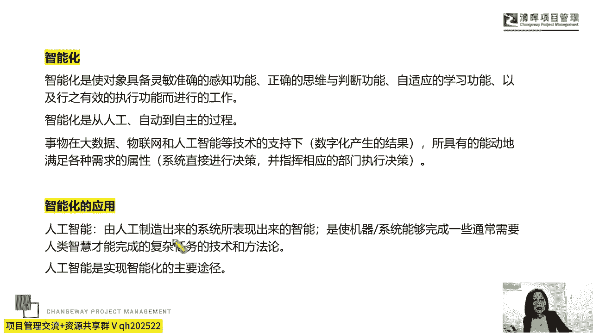

那人工智能也是我们现在实现智能化的一个，主要的途径，所以我们把这几个词放在一起，数据化信息化我们的数字化和智能化，那么嗯呵呵，PDU的基点可以数字化转型一下，你想具体怎么数字化转型呢，提点建议出来啊。

好那么我们说这个数据化为执行服务，一切业务数据化，唉这样可以提高我们的效率，那一切数据业务化，那我们可以提供我们的价值，所以数据分析为切入点，那么通过数据我们去发现问题，分析问题，解决问题。

打破这种传统的经验驱动决策的方法，来进行科学决策，而我们的这个信息化和数字化，是为系统化来服务的，那么通过系统化数字化和数据化，实现人工的精力和时间的最小化，达到人工智能来改变我们工作的。

这样的一个效率。

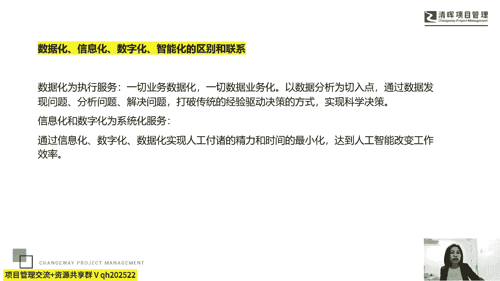

是他们的一点关系，所以我们来统计一下，那信息化它侧重业务信息的这个搭建和管理，那数字化它侧重产品领域的对象的，资源的形成和调用啊，那么嗯这个数据化，那么它侧重的是一个结果，而智能化侧重于工作过程的应用。

好是审核后自动级别，现在说还要人工养五个月，人工效率很低嗯因为这个PDU的这个积累呢，它不仅是我们，还有我们的什么呢，还有我们的这个呃叫什么偏麦那边啊，协同作业，实际上这个建议可以跟PMI提一提。

因为PMI毕竟是美国的，而美国的人工智能的这个成熟度和发展，是很快的，很好的啊，你这个去诉求我们可以提一提聊一聊。

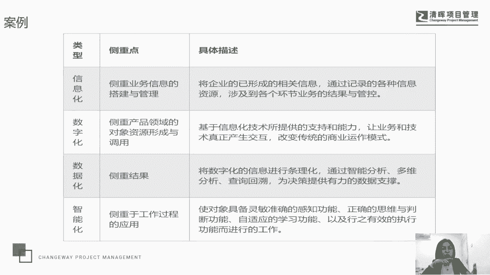

很有意思好，那我们来再系统的看一下，就是数据化这种所有的什么业务数据化，然后一切数据业务化，能够帮助我们去实现更精细的运营，基于大量的运营数据的分析，对于我们企业的运作逻辑进行数学建模建模。

那优化之后呢，也可以反过来再指导我们企业的一个日常运行，那么信息化我们说通过建设专业的信息化系统，来实现我们企业业务管理的数据化啊，那么使我们的业务的表单信息的流转，以数字的方式去存储。

那么嗯这种数据的存储啊，这种数据的存储，我们说呢要可利用可分析和改进嗯，很多公司其实它的这个呃OA系统，它的ERP系统，它的这个cm系统，甚至很多公司的项目管理的系统，它虽然实现了表面的信息化。

但是我们在为他们服务诊断调研的过程中，发现这种只真的就只是表面的信息化，那么这些数据真正的能够被高效率的去利用，分析和改进，没有没有做大啊，这可能是很多企业都会存在。

这是一种僵化的或者表面化的这种信息化，那么我们怎么去在有数据化这个理念，和这个应用有信息化这样的一个基础的情况下，我们怎么去提升呢，那就要用到我们的数字化和我们的智能化了啊。

那么我们说数字化呢是打通我们的信息孤岛，我刚才不是说了吗，很多公司有信息化，披上了信息化的外衣对吧，但是他的这个业务数据没有被利用，没有被分析，没有被改进，甚至是浅层次的利用分析和改进。

但是引入数字化这个理念，就一定要逼着你去打通信息孤岛，让数据得以连接，让数据产生价值，那么通过对这些数据进行综合性的多维分析，对企业的运作逻辑进行数据建模指导，服务于我们企业的日常运行。

所以我们的数字化，可以理解为是我们信息化的一个高阶，是信息化的广泛深入的应用，是我们从基本的收集数据，分析数据，到真正的去预测数据，经营数据的一个延伸，当然那么你有数据，你没有信息化。

那就没有办法实现数字化啊，但是你有了数据化和信息化，你不往前再走一步，再拉拉再再提一下子，那么我们把信数字化引入的话，那其实也是我们所说的这个嗯，就剩差那么临门一脚，我刚才说的这种情况。

大家所在的企业有没有，就是既有数据化这个说法，也有信息化，但是没这些数据化和信息化没有干什么，没有产生更好的价值，那如果我们能够引入了数字化，推动拉动哎，我们的这个数据化和信息化的一个有效的。

这种价值产生的话，那么最终就能够实现智能化，它是我们信息化，数字化，数据化的最终目标，也是我们发展的必要趋势啊。

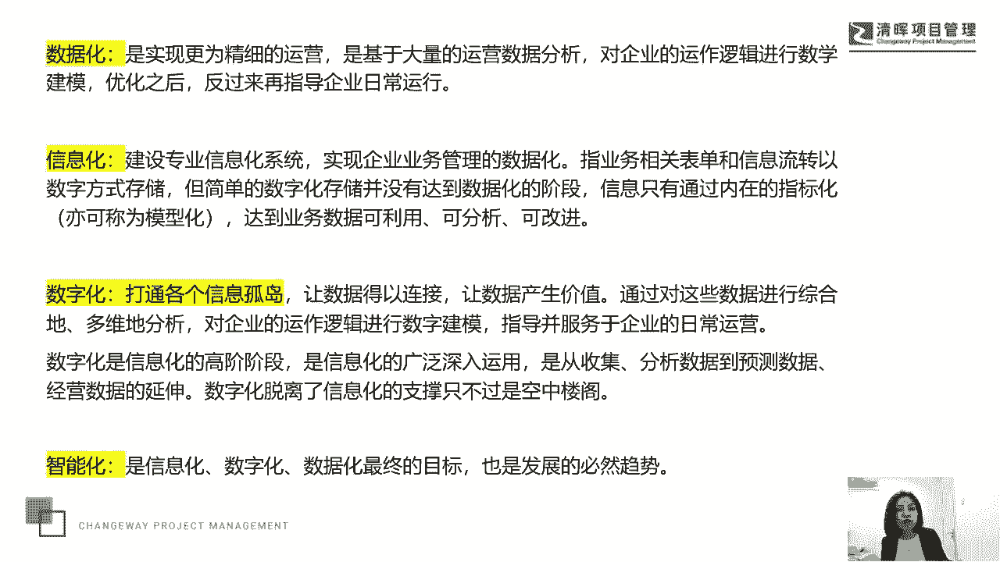

发展的必要趋势，所以我们来看一下，这是一个今天的昨天的最新新闻啊，今天是14，今天是14号，那就是前天那前天的新闻，他说呢，这个科大讯飞宣布面向行业客户的私有化，大模型。

已经与多家行业巨头客户达成试点印象，而今天我看到的最新新闻是，科大讯飞的这个大模型叫什么叫星火大模型啊，什么各种大模型的名字，是不是啊，哎中国古代山海经的神兽，这名字都不够用了对吧。

那么科大讯飞的那个大模型叫星火大模型，那么呃今天已经跟很多企业在签约了，所以我们说呢，实际上这就是我们所说数字化和智能化，也就是说我们最终落实到我们的人工智能，它的一个实践性的一个探索。

通过升级聚合分析与应用，那么信息的物理系统会催催生出新的工业，那么我们说呢会布局现有的产业布局啊，那么嗯智能化的这个体现，信息应用的一个层次和水平，它通过我们新一代的人工智能，而人工智能呢。

我们说是实现智能化的这个主要途径，业务产生数据，数据反哺业务，从而推动我们的数字化转型，那么你们知道郭老师为什么会呃，比较关注科大讯飞的这个大模型啊，它的人工智能，因为科大讯飞跟腾讯跟百度啊。

跟这个其他的还不一样，因为我觉得包括跟那个XPGPP，我都觉得都不一样，因为百度也好，腾讯也好啊，XPGPP也好，它更多地提供的还是信息的这种服务，但是科大讯飞他有to b端，to c端。

to c端的哎这三个品类的这个产品的应用，所以他的这种什么呢，大模型，它的人工智能是完全迅速的，加注在了它的产品端的，以及它的用户端的，应该说百度啊，百度呢，那么加上我们的这个腾讯对吧。

国内包括华为也在做自己的大模型，那么华为的大模型我也会很关注，因为他们都有很具体的产品to g端，to b端，PC端，像百度，咱们当然百度有百度云啊，那么腾讯有腾讯有云。

但是我觉得我还更关注这种具体和具象的啊，好哎呦，真的写了，买了一个讯飞的AI鼠标，一分钟写个平民的报告，好哇哈哈，我也可以去试一下啊，我还没有，我还没有买他的AI鼠标呢，我们可以去试一下好，所以我们说。

人工智能是实现智能化的一个主要途径，通过业务产生数据，通过数据返祖业务。

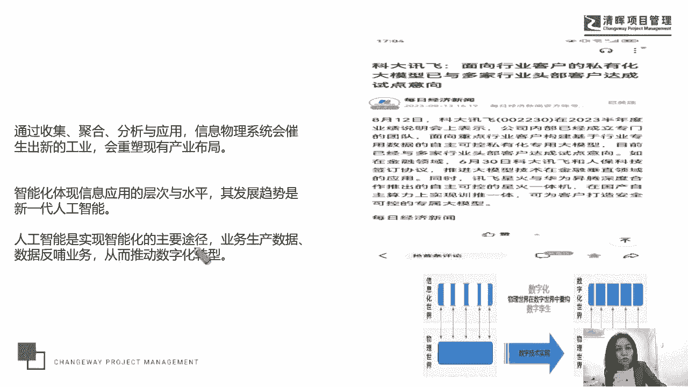

推动了我们的数字化的一个转型，那么有一个新的理念啊，这个理念叫什么呢，叫做数字化魔方，他他呢用这个方式帮助我们去理解数字化转型，这样一个创新思维模式，就是数字化转型几乎成为大中小企业。

包括我们也会关注的一个课题，但是怎么去理解我们数字化转型，它怎么去落地，它到底是一个什么样的具象，我们觉得用魔方特别好，表示他通过我们说魔方，它代表了说一个企业，要想打造一个数字化转型的一种理念。

或者是去落地和推进，那么他就要考虑到多个维度，比如说增长企业的成长，运营财务生态技术，客户价值，产品，人才等，企业的各个关键职能的，组织能力的一个全景视图，那么我们知道魔方是由不同的面。

不同的模块组成的，那么我们刚才提到的这些要素，就代表了在一个企业进行数字化转型过程中，你需要关注的多个点，那么需要你去全面审视数据和技术的价值，你就像我不知道大家会不会玩魔方啊，我我不太，我不会玩。

但是我我先生会玩，我记得呃我跟我先生大学同学，我认识他的时候，他给我表现比较就是作为显眼包表现，他的绝技就是给我给我给我转魔方啊，他能够很快的把魔方，就是我记得那时候刚刚在大学生嘛。

我们两个大学同学在大学时代谈恋爱，然后去逛商场，然后也买不起什么好东西，90年啊，我们是90年代的大学生嗯，买不起什么好东西，也没有什么奶茶可以喝，然后去最便宜的地方买了一个魔方。

我还不明白他为什么要买个魔方，人家买了不对，不是买魔方，是他载到了魔方的那个铺位摊子面前，唉拿起人家的魔方转了一下子，然后人家有所有的魔方都没有，是都不整齐，他把人家整齐那个拿起来给人转了一下。

人家马上就制止，他说你不要给我弄乱了，你弄乱了，我转不回去，他笑嘻嘻的说，你想要几个转回去的，他在那个地方把人家的魔方全部都给人家，转好了，转的非常整齐哦，就规规矩矩的，然后呢。

人家就很便宜的卖给我们一个魔方，所以对魔方这个词我还是蛮有感情的，那它也让我确实能理解，对于我们用魔方来理解数字化转型，来理解这样一种创新思维，那么我们需要去全面的审视数据和技术的价值。

从战略设计到有落地，来理解我们数字化转型的一个全新的视角，全新的视角为准确评估我们的数字化的成熟度，来提供了一个量化的一个工具，那么帮助我们去找到，我们打造这个数字化时代的这种组织能力。

嗯所以我们说既然数字化这么重要，我们刚才也讲了大大小小的一些案例啊，其实我讲的这些案例也并不新奇，是大家在生活中都能够看到的，甚至也可能亲自参与过的，那么我们说数字化转型是技术转型。

业务转型和组织转型的一致成功，我想问一个问题啊，大家现在去买这个呃星巴克咖啡，还是买这个库库迪咖啡，还是买这个嗯，其他的咖啡比较多，因为在中国经应该也是全球，我觉得是非常大的这个咖啡的消费市场了。

如果我不知道你们的这个手机里头有没有，这个星巴克的这个呃，我有他的公众号啊，我也是他的会员，那实际上我就会发现他的经营方式还比较传统，大家也知道这个在中国，这个瑞幸咖啡的这个各种数据指标。

已经超过了这个星巴克，那么可能比较经常有人会喜欢喝百事可乐，有人会喜欢喝这个可口可乐，很多很传统的咖啡饮者啊，他会还坚持买这个星巴克，那我自己呢，因为对星巴克的一些单品有一些偏好。

所以我还会坚持去买星巴克，那有人就会说出于价格的敏感性啊，出于对于新兴消费习惯的这种嗯变化呀，可能星巴克就不如什么，就不如有我们所说的这个什么瑞信呀，不如库迪呀。

是不是不如minor manner啊对吧，那我自己也感觉到了，就是星巴克可能在中国市场，它还会进一步的去萎缩，那么在全球市场它会不会萎缩，因为我我们这几年也都不出国嘛，也不太知道在国外对于新鲜人类。

他们的COE咖啡消费习惯，会不会再像我们中国一样被宠坏了，对吧，哎中国的消费者其实是被这个商家宠坏了的，那么大家是共享共赢，你宠我，我也回报你，我会去购买，从价格上啊，从品味上啊。

从这种促销互动啊等等啊，从新鲜的这种消费体验感上来说，这个星巴克还是比较传统的，所以我们说呃那么数字化转型，它代表了技术转型，业务转型和组织转型，那技术转型这个层面上是支支持你的产品的。

那么业务转型代表了你的营销模式，那组织转型代表了你的一个匹配度，我们后面还会分析这几个模块，那么当今社会产品形态不单一了，在数字化时代，企业应该如何去追求最大的一个产品价值呢。

也是我们需要去考虑的一个问题。

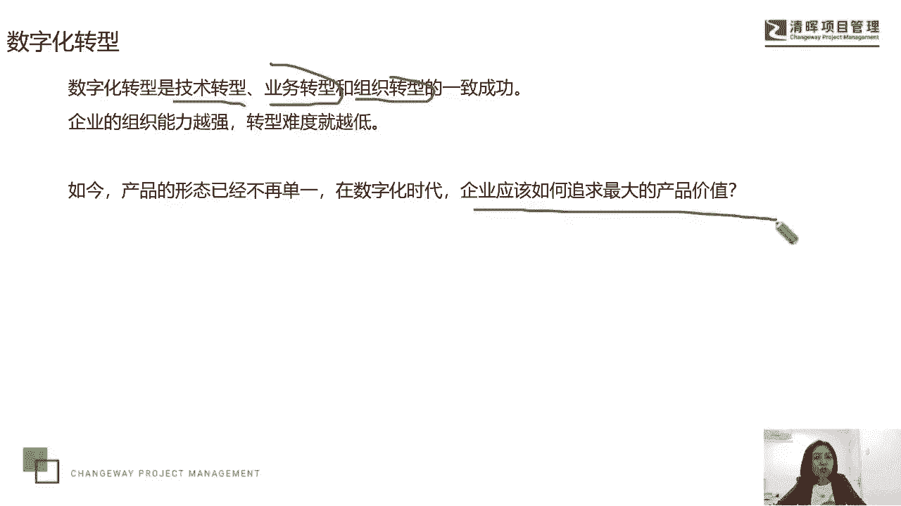

我们来看一下这样一些总结，说是在这个数字化时代，最具代表性的这个产品形态，它包含了我们传统的这种物理产品和服务，客户的单次购买，完成与这个企业的价值交换，成为最传统和基本的产品形态。

那这种数字化的增值产品，我们说产品本身依然是传统产品，但是呢会用这种唉数字化渠道进行销售，比如电商平台利用数字化时代提供增值服务，比如说在线客服，24小时的在线客服，有有我们现在找客服。

大家有没有一个习惯，经常会问说您是真人嘛，因为有时候就是这个机器人的客服，他的回答会比较机械嘛，那实际上我们就想跟真实的这个客服去沟通，具体的问题对吧，我自己就经常会问您是真人客服吗。

他会有时候回答我是的，您请讲，他有时候会说，不好意思，我是机器人，他真的会告诉你，不好意思，我是机器人，有一次我看了一个不好意思，我是机器人，我就笑了半天，笑死我了啊，那么我们说因为他说了个不好意思。

这就是一种主动的一种对话，因为他很可以回答说我是机器人，但他说了个不好意思，虽然我知道这是一个预先设定的程序，但是我依然爱笑的感觉很有意思，那么利用数字化手段来增值品牌价值，比如说微信公众号啊。

微博等社交账号，小文书账号等等，那么还有数字化产品，就这个产品，比如说本身就是数字化的及软件及我们的产品，很多这种SARS啊，那么我们说数字化的这种体验和服务I等等，软件以及模型等等。

这都是我们所说的数字化时代的这个产品形态，每个行业它其实都可以去匹配。

你到底是哪一种这样一种形态，那么做数字化转型，我们就一定离不开嗯，离不开这个呃，围绕客户打造数字化体验和服务，有没有是客服在逗你玩儿，呃我当时其实我在笑完之后，我也在想有没有可能是在逗我玩。

因为我我确实那个问题比较具体，它不是客服的这种机器人，客服能够有标配化能够回答的，所以我又问了一下，我又问了一个句子的问题，他还是就是机械的回答，那我判断他还真的不是啊，不是在逗我玩，确实是。

然后我就询问请问如何转这个在线真人客服，然后他就告诉我一个时间段，这个时间段，我们公司的这个服务是由真人在线客服的，那我就等那个时间段好了，蛮有意思的好，那么要想做这个数字化的转型呢。

要围绕客户来打造数字化的体验和服务，整个人类文明社会的发展，从最原始的以物到物，到现在的这种小规模的手工作坊产品到蒸汽机，唉，到这个珍妮纺织机，到我们所说的这个蒸汽机唉。

这个电力时代供应的这个工业时代的，规模化的批量生产到批量交易，再到我们现在这种互联网的服务，其实产品始终占据着这个整个商业文明的，核心地位啊，也就是说核心一定是产品。

虽然我们说现在这个社会酒香也怕巷子深，但前提是酒要香，酒香的，那么巷子深一点，可能咱们走的慢一点，但是依然能够屹立不倒，这个酒要是要不香的话，这个酒要是不好的话，那么你就是嗯嗯。

挂在这个时代时代广场的大屏幕上，可能意义也不大啊，所以我们说产品依然是重要的，但是我们说呃产品它又不能够一成不变，要为不同时代的客户去提供，最大价值的产品和服务，是我们企业跨越这个时代。

经久不衰的一个利器啊，所以产品是人类商业文明的核心地位，但是产品又不能够一成不变，我们想问一下大家，这个嗯我们没有任何偏见啊，我们就举个例子，比如说沃尔沃汽车，福特生产的各种汽车对吧。

奔驰宝马的这个汽车好不好，它依然是好的，但是呢他们在今年都陆续表达了，要向中国的新能源汽车去学习看齐，加强合作，甚至都加强了这个合合资合作品牌的合作，合资产品的一个生产对吧，我记得今年4月份的时候。

福特汽车的总裁就对由衷的在官方媒体，对中国的新能源汽车表达了他的敬意，而在前天吧，就是这周吧，今天是周，今天周二就是上周啊，今天是周一啊，上周，那么美国发布了一个针对中国的一个白皮书，比如提示清单。

那么对中国就是完全形成自主产业链的，比如说新能源汽车和我们的这个呃，这个叫什么光伏式光伏产业，这两个产业他们要以一种杀敌什么呢，杀敌1万，自损8000的这种形式来进行博弈了啊。

他发发布了一个呃这个提示报告，那么也叫白皮书吧，反正这种情况是不不不好的，那么为什么呢，因为我们这两个产业现在已经比较成熟了啊，应该说今年是中国的这个新能源汽车，的一个爆发的一个行业啊。

很多新魏小李这几个牌子都已经在，就是未来小小小鹏还有理想啊，都已经在快速的成长了，那么还有一些其他的这些词呀，这个新能源汽车我们后面也会讲到这个案例，那么在工业时代。

我们说产品基本单纯的物理产品的形式存在，产品价值就是传统的交易价值，产品售出交易完成，所有的价值除了售后以外也都完成了，那谁能够以更高的效率，更低廉的产生产出质量更优的产品。

谁又成为工业化时代的市场领导者，那比如说这个60年代，70年代一直到80年代初期的日本，就是这段话的一个写照，对吧，日本汽车的这个价值更更好品，价格更低，对不对，唉那么20世纪初我们说呢就是本世纪初。

福特它依然以生产优质价廉的产品为目的，开始以流水线的方式来组装汽车，那么它以无以比拟的这种价格优势，成为最大的这个汽车制造商。

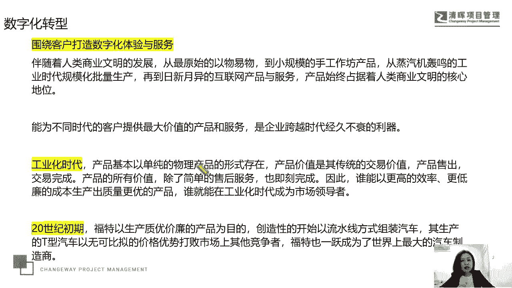

但是到了数字化这个时代，我们说企业的产品和服务定位要改变了，其实福特的这个产品的质量下降了吗，没有对不对，哎，但是消费群体发生了变化，消费者的想法发生了变化，那你就应该围绕你的经典产品。

重新去塑造你的产品价值呃，亮点了，那要作为企业整个商业模式的价值管理的定位，来实现组织的啊，这个能力的一个变革，有人会说老师这个跟我们的项目经理有关系吗，我觉得是有一些关系的。

因为我我自己现在服务的企服务的工作，有为企业去做培训，这是我们的基础服务，有做诊断咨询，还有做项目经理训练营，这种像经理的代教练服务，那实际上企业嗯对于项目经理不再是简单的，希望他是执行层了。

那么大家都知道从PMI发布的，大家都在积累PDU，那就会关注PMI发布的这个这个叫什么呢，嗯人力模型，那么它在最近5年内发布了两版，之前叫战略和商业的这种管理能力，到他去年发布的一版已经没有这句话了。

项目经理，真的你不具备这个去做战略和商业管理的，这个嗯这个基础在企业里头，你没有赋予他那么高的一个对等的权利和责任，所以你把这个作为他的能力模型，肯定没有办法落地，但他去年发布了一个也叫敏锐币。

那么实际上我们服务的很多企业，他会跟我说，郭老师有没有一种什么样的课程，有没有一种什么样的这种能力训练，在传统的这种项目经理的这种领导力啊，执行力呀对吧，软技巧能力之外去打造他们的敏锐力。

他们能够成为我们企业，因为做项目经理，他就一定有技术的一些积累，他就有一些业务的积累对吧，那么它就会有行业的积累，它属于一个正在成长型的一个岗位，那么相当于企业去中流砥柱的这一部分，中坚力量啊。

对于一个企业来说，这个中坚力量是要拖得住，因为它要承上启下，他要拖得住，上边他要拉得住，下边，他说能不能再增加他们的敏锐力的一个训练，那后来我我我理解了，为什么企业有这样的诉求，实际上就是企业面临着。

对于在有信息化和数据化的这种基础之上，怎么去实现数字化转型，那怎么去来上下呃，同域，比如说从战略层到项目经理的这种，中间的这个管理层到我们下边的这个执行团队，大家怎么能够上下同欲，利出一孔。

利出一孔对吧，第一个是力量的力，第二个是我们的利益的力，所以我们为什么今天来聊这个话题，那么也是我自己在企业中，我们会发现企业的老板，企业的这种现眼现在的管理环境，希望我们的项目经理对于数字化。

对于数字化转型有一些认知，有一些敏锐度啊，然后所以我们也是去聊这个课题，也会给他们做一些这样的训练培训探讨，那么我们继续来说这个这个数字化转型，这个谁呢，这个福特，那在汽车行业。

福特成为世界上最大的这个汽车制造商，百年之后，然后特斯拉横空出世了对吧，打破了汽车行业的生态格局，那作为破局者，我们说特斯拉最大的不同，它提供了数字化服务，虽然特斯拉已经出来好几年了。

虽然我们说今年我们国家的这个新能源汽车，我们中国的新能源汽车在发力，尤其在国内市场上，但是我们说新能源汽车作为汽车行业的，打破汽车行业的生态格局者，哎作为破局者，那么作为新的汽车行业的这个产品。

价值的一个重新定位，我们还要谈它的啊，因为我们自己的这些新能源汽车，他们只能是属于一个追随者，所以长久以来汽车行业，它追求的是高速度的这种引擎，高质量的性能，高规格的安全性，那在保证这些基础的情况下。

随着特斯拉市场的这个入场，汽车行业的竞争开始转移，那么马斯克他说呢，特斯拉在很大程度上是一家软件企业，他说这个汽车软件的更新，可能会跟你的这个手笔记本手机的这个更新的，性质是一样的啊。

嗯我这个电脑啊真的是挺头疼的，我买了个惠普的电脑，因为它比较轻便轻薄，便于我出差，尤其我以前的那个苹果电脑，它的散热系统不好，于是我一直播它就因为散热，它就会有沙沙沙的这种电流声。

所以我们直播课程大家在在电脑对面哎，听到了就很痛苦，我就因为直播课我特意买了个惠普电脑，但是我特别的痛苦，我这个电脑呃经常出故障，今天就差一点出问题诶，就是它一旦微软更新了系统啊。

windows更新了系统，然后跟我的这个这个什么呢，跟我这个惠普电脑的这个硬件就不匹配，之前有一次是这个蓝屏了，把我吓坏了，那电脑刚买那长时间蓝屏了，我我拿到这个惠普售后去修，人家说不是其他问题。

是系统不匹配了，重装系统好，那么再有一次一更新之后是什么呢，视频哎不好用了，然后你们就看不到我的图像了，然后怎么办，我又去修，那么还有一次又被更新，又出现了视频不好用，后来我买了一个外置摄像头。

今天没有用啊，然后过了一段时间他又自己修复了，今天又被更新了，结果呢下午突然一瞬间他的音频不好用了，我很担心，我马上就重启电脑，然后查看他的各种数据的匹配，终于在咱们这个课程开始之前。

把这个音频也给搞好了啊，所以就像说我们经常说是手机，电脑会去更新软件，那么它的汽车软件也会再更新，那么他关注的是汽车版本的升级，以及软件给客户带来的个性化的体验和服务，呃我自己不会开车啊。

但是我有个朋友在开特斯拉嗯，特斯拉的那个软件里头呢，会有一个宠物关爱模块，他会关它，能够就是帮助你在线的去管理你家的这个宠物，所以我觉得那个功能真的是对于人来说，是特别有有有个性化的需求，很很强大啊。

所以大家会说汽车软件的价值在什么，它就是智能化的，那么进入到数字化时代后，客户经历同样经历了这个技术飞跃的轰炸，那么以往的这种一成不变，千人一面唉的这种产品无法再满足需求了。

那么可能我们更想要更多的服务自己，个性化的这种服务和自己的一个体验，所以特斯拉提供的个性化服务的这种能力，是传统汽车无法去跟随的，那么在云端建立档案，记录驾驶偏好和习惯，那么让他们在入车的时候。

就能够享受到最舒服的驾驶状态，也成为这个行业的一个引领者，所以我们说数据转化为我们的数字化的功能，那么成为产品成功的一个决定化的一个应用，那企业如何为客户去提供，数字化时代的这种服务呢，那从数字化时代。

产品成为数据的来源，大量的数据从产品中来，经过我们的数字资产的一种加工，再回到产品中去啊，所以我们说客户产品，数据算法产品再到客户形成了一个管理的闭环，来持续的提供价值，这段话我觉得也会我会去。

会有很多项目经理去分享，那我们项目经理其实除了默默无闻的唉这种，去脚踏实地地走向前走，我们可能还要去干什么呢，还得去抬头望星空，哎我们既要关注脚踏实地。

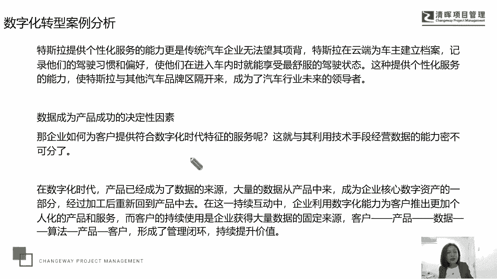

我们还得眼望这个星空，那么数数企业的数字化它怎么去推进，怎么去实施呢，我们说对于我们的企业化，要做好这个数字化的这个转型，要去找到这样一所开启数字化转型的这种钥匙。

那么嗯我们参照了一个麦肯锡的一个模型啊，他有个推荐，第一步叫认识数字化，就是学那么构建制造先进技术的这种认知储备，第二个是规划数字化，就是思那么明确企业数字化转型的价值取向，第三个叫推动数字化。

叫做融合赋能要素部署和推广数字化变革，这个其实还有点什么呢，有点像这个华为在引入这个这个什么呢，也就是IDM的这个IDD流程的这个过程中，有个要求，第一步叫做什么讲法，I在第二部叫什么护法。

第三部叫做什么优化，所以也是一个学学呢，就是我们不知道这个东西，我们就先不要去质疑，我们就先一板一眼的去学，所以将这个僵化这个词不一定是错误的，那要看在哪个场景，哪个场合啊，那么第一步先去一板一眼的学。

那你像我们学武功学功夫，那不也是要从蹲马步开始扎扎实的去蹲马步，对不对，哎所以先将然后再去固固话就是我学学到了，像郭靖学对了，想用18掌一掌一掌的去打，就是我们所说的这个固定这个专业的这个模式，对吧。

那么这个标准的这个周期，接受过训练和学习的这个羽毛球选手，和这个像我们这种被叫做楼呃，叫什么呢，楼区羽毛球选手，它的区别就在于你的动作是不规范的，你站立的姿势，你这个发球的姿势，接球的姿势。

扣杀的姿势完全是你自然在什么，在楼道中间小时候玩出来的对吧，哎这叫弄堂选手，跟人家受过专业老师训练的是完全不一样的，所以我们说呢要去学。

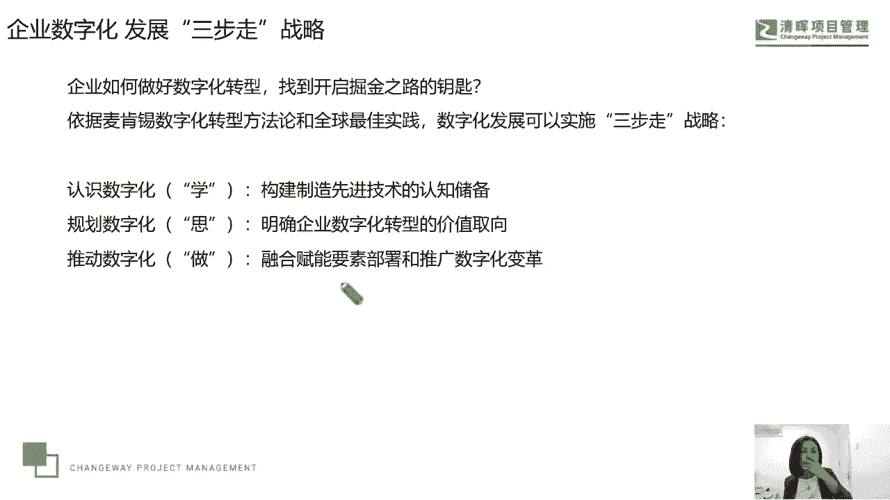

要去思，然后再去做，那我们就一步一步的来看，第一步我们说呢要去对的守破离啊，手破离，这也是一种日本的一种嗯，所谓的这种新心学心法，对的守破离好，那么我们来看这个认识。

数字化就是构建制造先进技术的认知储备，那在当今呢，我们说这个制造业的这个物联网，技术发展非常成熟，有易联通强交互低成本的特点，为企业的这种先进技术的布局，提供了一个绝佳的机会。

那所以我们的这个企业管理者，应该尽早地开展对于这种智能制造，先进技术的认知和挖掘，去明确企业的建价技术架构，探索，可以驱动企业价值这种颠覆性的这种技术啊，那么这个实际上是我们去提到了，一个一个管理点呃。

这个东西大家不要小看它，每个行业都要关注这一点，就是思考我们认知数字化，那么它对我们的企业怎么去影响我们的技术，影响我们，你像我们培训也是有技术的嘛，对吧，哎那我们怎么去影响我们的技术架构。

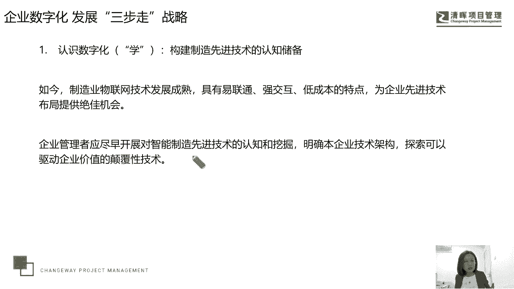

来达到我们的一个颠覆性的一个服务，那么第二个呢我们需要去规划数字化，那么明确数字化转型的价值取向，数字普化转型不是为了技术，而而技术我们去做这个数字化转型的，这个过程中，我们要首先明确的战略。

就是要首先去明确我们自己的这个，业务中心和价值取向嗯，数字化转型为传统企业带来的价值创造，有两类啊，这也是我们通过调研去发现的，一个是激发我们的原动力，就是运营模式的这个效能提升。

那么比如说通过消除浪费，这个在敏捷中敏捷理念，我们很多学员刚才提到了ACP是吧，那ACP就是美国的这个敏捷认证，那么敏捷理念中，他会把这种我们所说的这个呃，叫这个精益生产中的理念拿过来，让少除浪费。

那敏捷呢它强调的是提高效率，虽然我们关注这个流程，关注计划，但是个体和互动更重要对吧，所以提高效率，优化流程，改善工作方法，那么这也是我们去通过数字化去激发原动力，提升我们的运营模式。

那么增加驱动力就是通过数字化，那么去商业模式的快速和调整，所以你可以理解为就是规划这个数字化，那么它第一步是基本的，我们内部的一个基基本的一个应用，比如激发原动力唉，就是通过数字化来消除浪费。

来改善我们自身，但是这是我们所说的这个叫开源节流，这个叫节流这一部分，那如果用中国传统东西说这个什么呢，我们叫这个开源，那么你就要通过数字化去干什么，增加我们的驱动力。

要引发深度的对于商业模式的这种探索和调整，我们运用数字化技术带来全价值链的这种创新，应用场景，来全面的去颠覆我们原有产品的这个交付，探索新的商业模式和我们的这个价值动能啊。

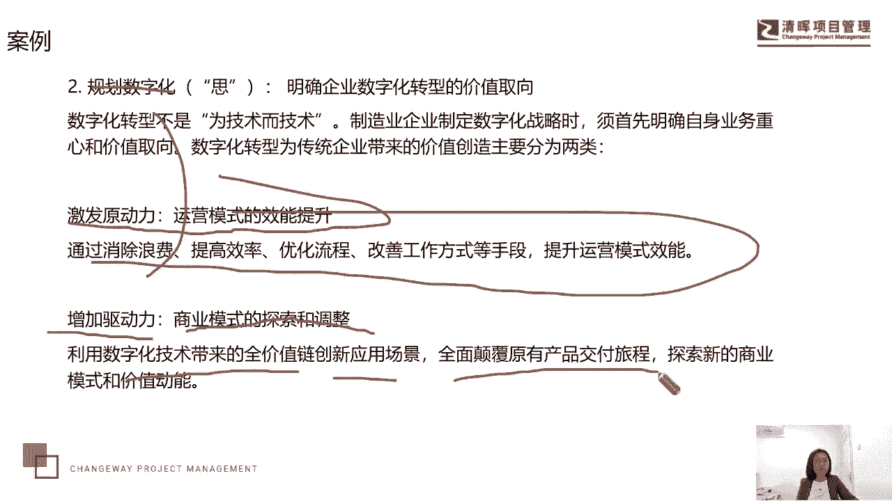

这是我们提到的两个应用层面，那么第三部分就像我们首课的一样，我们得去做，那么我们要去推动数字化，去融合部署要素和，我们去融合我们的这个要素的部署，来推动数字化的改革，以呢这个先进技术为支撑。

来思考运营模式的改善和商业模式的创新，明确转型价值这个取向后，企业开始我们的这个数字化转型的一个布局，所以在这个转型升级过程中，既要仰望星空，也要脚踏实地，那对于我们项目经理来说呢，也要去思考。

就是我们企业怎么去学，怎么去思，怎么去做我们的这个数字化的一个转型嗯，最近我们服务的两家企业，已经接受了我们的这种建议啊，已经在项目经理中开了一个，他们在8月份他们公司这个年终会开的比较晚。

我说的其中一家企业，他们每年大概要在就是今天14号，大概8月20号之前把这个年终会开完，那我也要给他们去做一个分享，那么他们在开年终会之前，他们为什么会把这个会开到，就上半年的这个年度嗯。

对上半年的时候总结的年终会嘛，半年会要放到每月的8月20号呢，就他们公司先的财务数据，大概在7月10号左右就能出来了，对于上半年的数据，他们会先对这些数据做一番分析啊，然后把什么呢。

把这个数据再反馈给各条线各团队，我们的产品团队，我们的业务团队，市场团队宣这个什么呢，品牌团队啊，营销团队，然后他们反馈回去之后，他们会要求，比如说这个数据大概在7月10号左右出来。

然后公司的这个PO和经管中心，两个部门协同作业来分析数据，就是数据的二次运用，因为你的财务数据，你的营销数据可能是第一次出数据，它是个原始数据，那么PMO和经营管理中心会做二次数据处理。

他们会做一个基本的分析，做完这个分析之后，再把这个分析成果和原始数据再反馈给你，原来提供数据的这个各业务条线，各支部门反馈之后，然后让他们去对什么呢，对下半年的工作做出一个修正，按工作计划，工作方法。

工作思路，工作节奏和步骤，甚至考核指标做一个修正，机会大概会在7月30号之前去提交，提交之后呢，然后公司呢大概会在这个8月呃，10号左右就会给他们反馈，然后大家在我们的这个什么呢。

拜年会上拿这个数据的三层应用吧，然后来去对标，来把这个会开成一个誓师大会，成为我们下半年的用PMP的说法，叫kick off meeting，叫开工大会，今年会推到8月2号，是因为这家公司受疫情影响哦。

这个不是灾灾情，就这个这个洪水的这个灾情影响，大部分的这个生产基地受灾了，然后嗯呃工厂也有受灾的地方，包括办公区，甚至发生了这个员工的伤亡事件，所以他们公司把这个会议转推后了十天左右啊。

今年那么这就是我们所说的在数字化转型，这个这个公司呢他们已经做到了上下统一，已经今年提供了一个主题，其实就是和数字化转型有关的，他们的数据从数据到数字，用数字化转型来激发信息化。

和我们的这个什么数据化的一个深层价值呃，这是他们必须到一个理念，尤其是他们的项目经理，更加要学会去整合全公司的这个数据和信息化，然后为项目去做服务啊，这是我们的一个客户。

那么我们来聊一聊这个成功的这个企业，数字化转型的这五大基础，它包含了这种组织的数字化能力，可协作的生态系统，健全的这种物联网架构和用力啊，用力就是我们的应用场景，以及网络信息的安全保障。

和数据的这种资产化管理啊，这些呢我们说其实是第一步，我觉得很重要，嗯最后一步也很重要，当然这五个关键点都很重要，但是如果让我来为企业去做分析判断，我会关注第一步就是组织的数字化能力。

他不应该只是一个象征，他也不应该只是一个部门，也不应该是少数人的一种隐微度，他应该是整个组织层面，那么第二呢就是说你最重要，当你有了组织层面的数字化能力的时候，你就要产生这样的一个回报了。

就是把你的数据的资产化管理，资产化管理之后，他就会产生商业价值了，那这三者是放在中间的，当我们有了这个基础，这是我们想要达到的目标，那这是我们赖以实现目标的另一些一些支撑啊，比如说可协作的生态系统啊。

这种物联网架构用力呀，以及网络的信息到账，所以我会关注一和关注于这两个层面啊，这两个层面是很重要的。

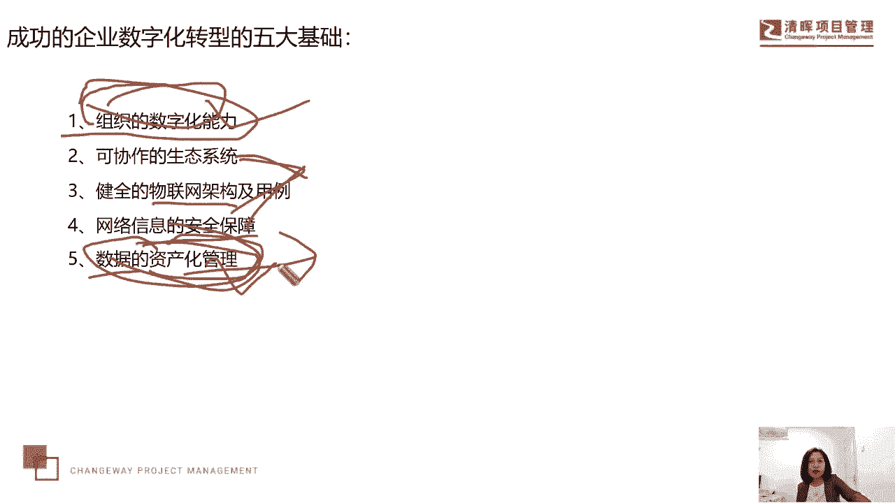

那么我们来看看这个企业去做数字化转型的，环境挑战，最近3年也在辅导企业，我们去谈论这个课题，去共同的去研讨这个课题，因为这个课题，实际上他现在还处于一个摸的和石头，在过河的阶段，嗯虽然我们提到的。

比如说像喜茶，他的这个体查构很很成熟对吧，包括华为从IPD升级到FTC这样一个模式，那么实际上嗯这个这个数字化转型，它能达到这种高度，它能达到的这个价值实现是没有什么边界的。

就像我们不知道人工智能最后会走到什么程度，对不对对，我们人类真的会造成什么样的影响，我们能不能实现科技向善，这样一个人类的终极理念，甚至我们能不能以后能不能驾驭的了。

我们自己研发出来这个怪物人工智能都不知道，所以虽然有些企业已经做了一些好的，这种数字化转型的一个模式了，但依然会面临着巨大的挑战，比如说从技术驾驭哎，就是你做数字化转型，以为技术的转型到你的业务转型。

你的业务需要创新，那么从组织变革到文化重塑，他一定会改变我们以往的范式思维，改变我们以往的奶酪，我们的分配机制，我们的绩效机制，我们的组织架构，我们的权利机制都会发生变化。

那么还有我们说从数字化能力建设，到我们的这个人才培养，这是我们的基石，这也是一大挑战，因此我们说这个数字化的转型成功，它不可能一蹴而就，他一定肯定必定是一项长期监运的这种任务。

很多企业可能要几年的时间才能，取得一些这个亮点啊，取得一些亮点，那么我们来看一下具体的一些难难题，这是我们为一家企业在服务的过程中，跟他们协同推进数字化转型这个过程中，那么遇到技术的难题。

比如说技术人员和业务人员沟通不畅，那么大家对于数字化转型的认知不一样，理解不一样，那么支撑企业的这种支撑又不一样，因为我们一会会讲到这个转型的这个模型啊，它包含了认知层面，它包含了这个流程层面。

它包含了应用层面，它包含了组织层面以后，我们会讲这个模型，那因为在这个四个层面上，大家的认知是不一样的，那么大家的响应能力是不一样的，习惯是不一样的，以及对于转型过程中，你要去必须去新增加了新的知识。

对于新的工具方法和知识的这种应用啊，每个公司它的刚性考核程度也是不一样，所以导致就是老问题了，老生常谈，技术人员，业务人员沟通不畅，是基于数字化转型的沟通不畅啊，那么还有就是老旧系统的转型障碍。

我们刚才不是提到了吗，这个数字化转型你离不开信息化，虽然信息化这个产生，它比数字化转型这个词要出现的更早，但是你离不开信息化，你有数据，你没有信息化，你的数据就效率很低，那么你有数据有了信息化。

但是你没有通过我们的这个数字化的，这种模式去推进，那么重复重构它的价值也是没有意义的，那么你就必须你的信息化体系统，能不能支持你的数字发展机，也是一个很正常的情况啊，还有一点就是我们的管理者。

缺乏数字化的管理洞见，我们经常会讲究预见对吧，哎还有洞见我们的洞察力，那么比如下象棋，下各种棋类，你经常说我们得看到三步五步，对不对，那么这种洞察能力也是很重要的，那么可能在你这个数漫长的数字化转型中。

3年五年你不一定能收到，很快的去看到什么样的效果呀，很快的看到什么样的成绩，甚至是我们所说的这种对于现金流，利润的这种快速的改变都未必，那么你能不能去坚持，你有没有这样的洞察力。

对于企业来说已经捉襟见肘了，你还要去推推动新的数字化转型的一些项目，一些业务，这些业务和项目有可能就是在什么在试错，因为他以敏捷的方式展开嘛，所以我们说呢，敏捷最大的一个特点就是要求试错。

曾经有个学员对对他特别不理解，他说呃，因为他他们公司没有这个敏捷的这种工作环境，而现在的这个偏僻考试题目里面，有大量的这种敏捷题目嘛对吧，所以这个学员就第一次学敏捷，这是点状的了，说快速试错怎么去理解。

那我们不是应该减少错误吗，那么我们为什么还要去试着去错误呢，他说觉得我说试错，就是看我们这个有没有价值去试一下，他说那我们谨慎一点，我们去努力的找，好像没有错误的事情去做嘛，没有错误的产品去去做嘛。

那实际上谁能告诉你这个产品没有错误，没有人知道对吧，IPAD在刚产生的时候，IPAD1都没有摄像头功能，是华为并不具备这个能力吗，并不是他的产品就在实际，如果我们去读乔布斯传，我们就会发现。

其实乔布斯这一生做了N多产品，大部分都是不成功的对吧，唉只有IPHONE手机，IPAD的是比较成功的，所以我们说呢，他就是通过我们的一个再试错的过程，那既然是试错，又不能确保达到我们的价值回报。

你在你试错的这个产品上，那你又要去占用资源，所以加剧了我们资源再分配的这个困难，这都是我们在企辅导企业的过程中，我们去发现的啊，这些具体的这些难题，从我们刚才提到这种环境挑战矮大的起源环境。

到我们的具体的难题。

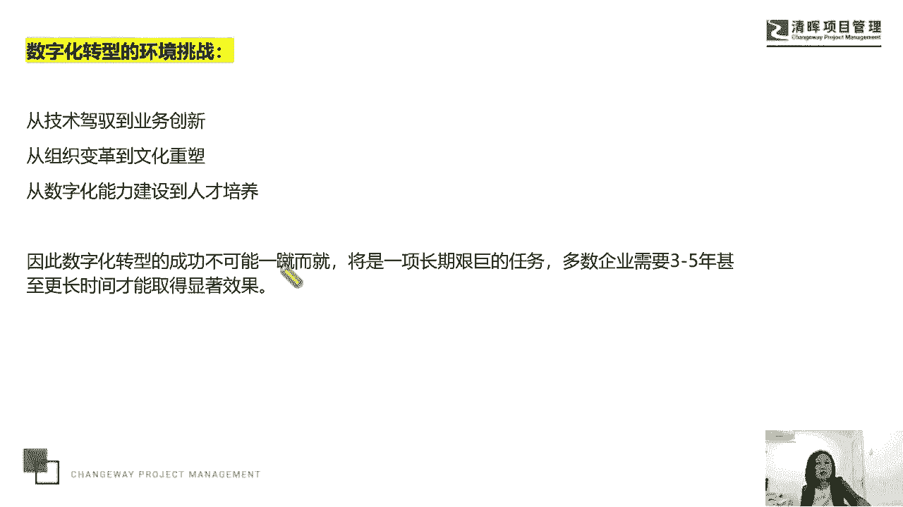

那么任何时候都是不破不立的，对不对，所以我们要守要破要离对吧，那也有不破不立这个说法嗯，对于数字化转型时代，我们人才的这个机会，我们也可以说一下，就是肯定一定确定企业是在替代。

建立这个数字化的这个人才储备，那么在这样一个人才需求当中，我们具备了系统化思考能力，因为我们学项目管理学，整合学，系统化思维，就是具备了项目经理的这种能力，那么具备系统化思考能力，项目经理一定是企业。

数字化转型的中流砥柱和生命军，那么它将也应该去跟随，我们这个企业的转型布局，然后通过对自身数字化潜力进行一个现状评估，用力试点，那么运营分析，然后在企业这种最优的短期，中期。

长期的战略方案中去推进我们数字化转型，项目的一个落地，去找那些不数字化转型，能杠上的，能蹭上的，能刮边儿的这种消息，唉这种信息，这种消息，还有我们的项目这种商机吧，我们说引入我们的什么，引入我们的这个。

管理模式引入到我们的项目当中，当然如果我们今天在座的可能很多规定，项目经理可能是我们的这种专尖端的技术人才，那我们也可以通过这种员工程师啊，大数据分析师啊，网络分析师，数字化市场专家等等啊。

数字化市场专家，指的就是有数字化市场营销能力的，这样的项目经理，他有时候会叫数字化的市场专家嗯，我们的一个客户，这是我们一个客户提出的市场人才需求啊。

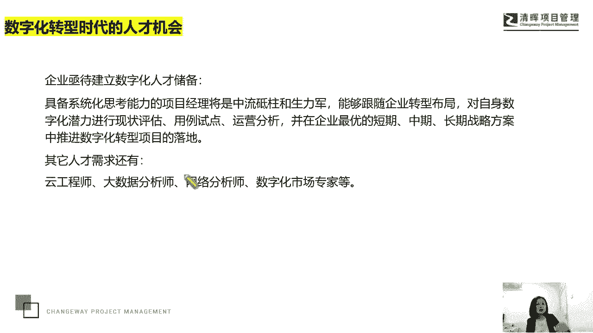