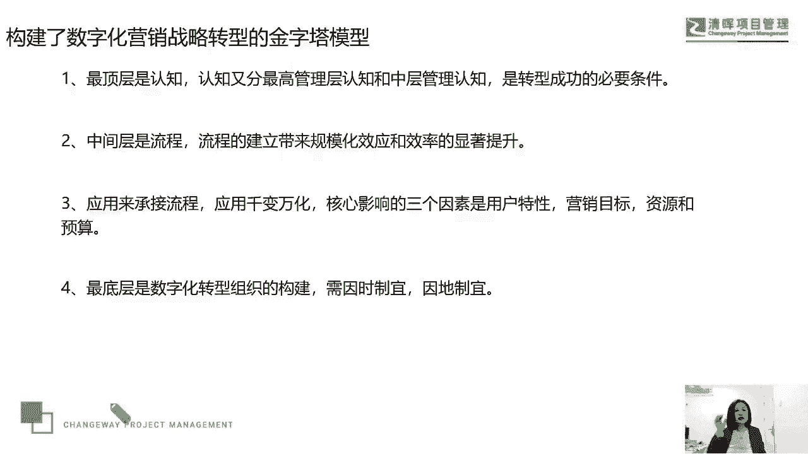
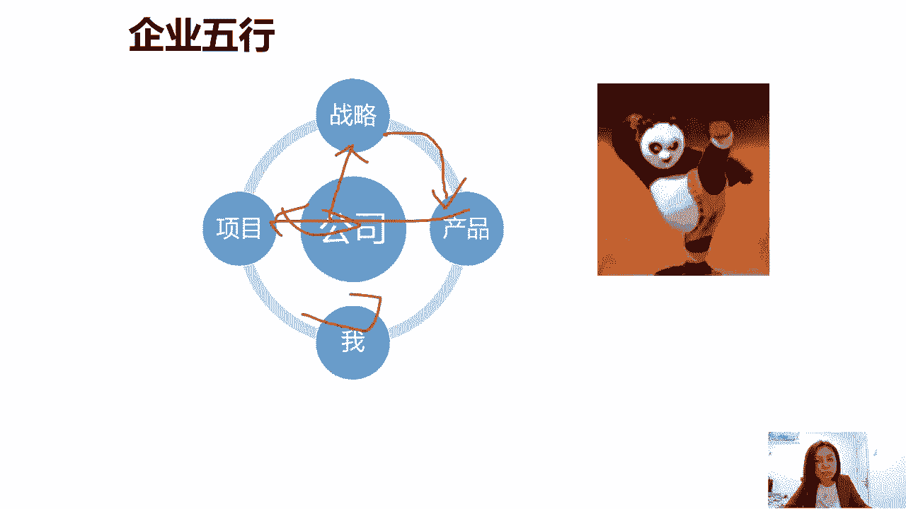
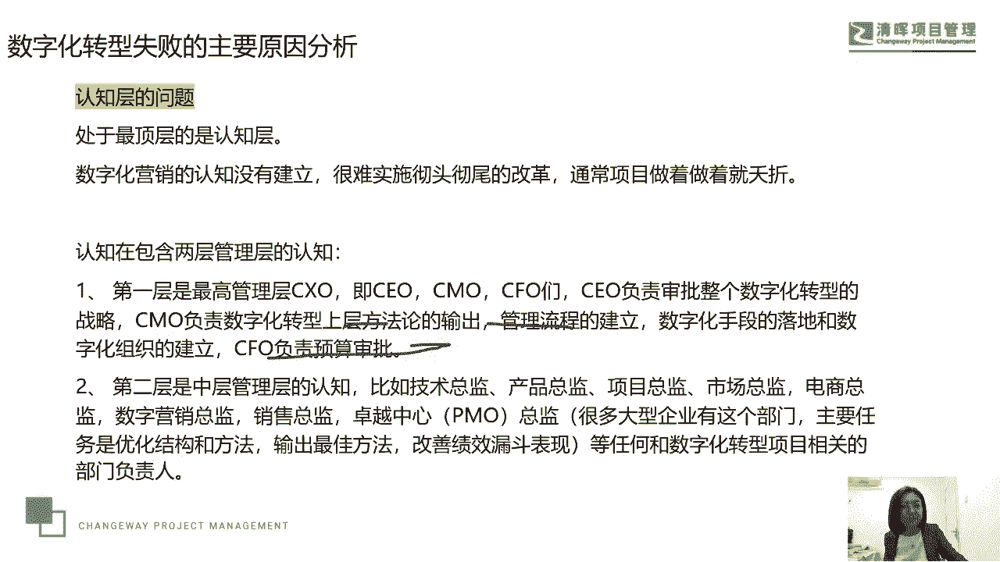

# 项目经理数字化转型五讲 - P5：5.企业五行 - 清晖Amy - BV1FM4m1U7Nd

依然要回到郭老师的这个核心理念上，就是我们要考虑到我们的公司这个平台，战略产品项目，以及每一个你或者我我们怎么去共创，共享共赢这样的一个理念好，那今天晚上关于我们怎么去理解数字化转型。

它呃的一个几个关键词，我们的数据，我们的这个信息化，我们的数字化和我们智能化的这个关系，以及我们在数字化转型过程中，遇到的一个挑战难题，我们给出的数字化转型的这个推进模式，大家呢做了一个简单的交流。

好看看大家有没有什么问题可以提出来，我们来探索一下，看大家有没有什么问题，有吗，有没有对于自己的行业，对于自己的岗位和数字化转型的关系，以及数字化转型的一些思考呃，医疗数字化变革额。

医疗医疗这个行业最近太火了是吧嗯，医疗要看哪个哪个细分行业，因为医疗也有太多的这个范围还是太大，是为医疗行业提供信息化服务的吗，还是医疗产品的生产制造，还是医疗行业的营销，营销是吧啊，你看我。

因为我们那我觉得这个这个医疗的这个医疗营，营销行业的这个数字化变革，我觉得是比较还比较容易和数字化相关联的，那比如说嗯首先你们我自己啊，我们自己应该是去年年底，今年年初服务过一个医疗营销行业。

它是个整合了医疗行业的一个平台，那么一个平台嗯，他呢其实也做了一些数字化的一些尝试，比如说他们首先作为一家医疗行业的，这个营销平台，他们会跟很多的医院，会跟很多的这个医生名医建立这个关系。

他们就是为医生医院来做营销服务的嘛，所以他是个医疗营销平台，那这家企业呢，他们以往传统的方式就是比较笨的那种，像末班哎，线下现场去沟通，去交流，然后呢用传统的模式去做一些推广，像你们这你们以前看到那种。

比如说好医生在线对吧等等啊，还有什么春雨医生，那么后来呢呃他们引入这个数字化之后呢，嗯他们也在探索说怎么能够去做网，数字化用的模式，基本上是我今天晚上推荐的这种模式，你比如说他们就从公司的层面。

把他们的这个PO部门，设定为他们数字化转型的一个呃主责部门，那么在这种情况下呢，嗯实际上嗯实际上他们的一个操作模式，就是有了这个主责部门之后呃，他们有三条产三三个事业部，这事业部的规模都不大。

他们在里面呢机遇就是什么呢，啊比武招亲，就哪一个业务条件，愿意，首先接受数字化的这个管理模式和营销模式，他们就找像你说清河图的应用，那么因为你一定要主动的愿意接受。

因为这个试错的过程中就会带来人员的变化，薪酬的变化，绩效考核的变化，所以他们通过PO选了一个产品条线，然后去做这种什么呢，做数字化的一个变革，那无非就是把以往我们所有的这种数据。

和我们用来支持这个数据管理的，这个信息化系统，和做了一个数字化的一个呃管理提升，所以他们是这样的一个组织模式的一个推进，那么具体到他们怎么去做的，这个我我觉得就不太好。

因为涉及到他们的这个行业的一个机密吧，行业的一个机密啊，首先还是要去有专门的主责部门去推进，然后有了主责的部门，那怎么去做我们这个行业，这个产品的这个数字化的变革的话，就是一个专业化的研究了。

然后探索探索摸索摸索这个路就出来了，好我们来看第二个问题啊，就是其业务品怎么和数字化联系，也就是说我们以前没有数字化或者数字化的，理念，概念，不不典型的时候啊，不普遍的时候。

那可能就是按部就班的哎定战略，然后出选产品，然后立项目，然后你和我去推进，那么到了这个数字化的这个时代呢，我们说那我们在定制战略的时候，要把数字化和战略关联起来啊，关联起来，刚才我们不是讲到了吗。

这个我们的组织层面，我们的这个比如复杂一点的这个组织层，那么我们这个呃认知层面和组织层面，都要互动起来，我们第一个是认知，那我们的CEOCFOCFO对吧，各种C什么O。

他们在战略层面上愿意为数字化这个事情，给予资金资源和试错空间的一个支持，这就是我们所说的从公司这个层面，那么在这种情况下，在战略里头就会把数字化纳入到战略，那到战略里头就会给出和数字化有关的。

这种产品的诉求和需求的选择，然后我们再去立项，然后又会把数字化去做，驱动了数据化和应用信息化的这种激活，最后呢我们自己在这里头要跟上这个时代，跟上这个企业的变化和跟上这个节奏，不被淘汰，能跟得起。

那刚才我们提到的嗯，那个案例就是一家企业，他的项目经理自己用拆的GDP，已经可以去优化工作效率了，已经可以去优化设计了，结果在这种情况下，公司没有跟上这个步伐，公司是推荐大家使用这个项目经理。

他其实比较刚，他觉得他这么好的东西，他真的是做了一个闭环，就是他用chat GDP，他怎么理解，怎么研究，怎么应用在哪些项目上用了，因为已经从拆除GP推出到现在，已经有半年的时间了嘛，对吧。

他是怎么用的，然后他写了一个很好的报告，他认为啊这个报告如果被公司推动了的话，实际上它就会成为数字化管理的模块的，这个升职加薪，但这个目的没有实现，那没有实现怎么办，他就准备走人了啊。

这是我们提到的这样的一个模式，好我们来看制造业的制造企业的数字化转型，其实你去关注一下嗯，很多企业，尤其物联网制造行业，你像特斯拉不就制造行业吗，包括我们说的这个科大讯飞，你能你能你能说它不制造吗。

科大讯飞有那么多的产品呀，对不对，他to to c端，to b端，它都有产品to c端，所以嗯你可能他不算纯粹纯粹的制造业啊，嗯制造业的这个数字化转型特别的多，现在去网上搜一下。

我们觉得是比较容易找到的好，那么我们说数字化转型是让企业降低成本吗，呵呵这个关于拆的GDP违反了我国法律，这件事情嗯，我们另外再说啊，总之呢嗯它是可以用的，呃有些项目上可能我公开场合讲讲这个不太好。

但这这这是一个真实的一个案例啊，这是一个真实的案例呃，嗯怎么用，我们不肯定不会违规违法呃，但是确实有应用的一些一些怎么说呢，嗯一些机会吧啊好，那我们来看这个问题，就是数字化转型是让企业降低成本。

当然是降低成本呀，当然是降低成本，那么如果增加了成本，那企业是不愿意冒风险转型的，但这个事情没有人能够保证，谁能够保证说我一定会这个呃不增加成本，所以我们刚才说了，要认知层面呀。

从高层层面要给你这个试错空间嘛，对不对，要给你这个试错空间啊，所以这也是为什么刚才在推进模型中，我们第一步说的就是什么。

就是我们提到的这个认知层面，第一个认知层面就是我们的高层，就是我们的管理层，从方法论上，管理流程上爱，包括预算审题上都给这个机会的啊，好大家还有什么什么问题吗，也感谢大家一起参与我们的这个深度思考啊。

感谢大家参与这个深度思考，好，还有没有什么问题，那未来我们还会有很多机会去交流和探索，各种新兴话题啊，如果你们有什么嗯想听的这个话题，想聊的也可以提出来，以后我们也把它作为一个小专题。

小案例给大家讲出来，好不好好，那今天晚上时间也比较晚了，嗯周一呢也是第一个工作日，大家呢每周的第一个工作日，大家也比较辛苦，我们今天的直播就到这个地方，谢谢大家，谢谢谢谢，感谢各位嗯。

好下次有机会我们去看一看啊，好谢谢，这是我们下一次课程啊，下一次课程呢是我们的8月18号，我会讲效益实现管理指南这本书嗯，单次购买是十十九块九呃，整体购买我们一年的项目管理小书房，会讲这个11本书。

22次课程，以前的课程是可以看回放的，购买价格是188啊，如果大家感兴趣，也可以持续听我的这种小课来交流，好吧，谢谢大家。

