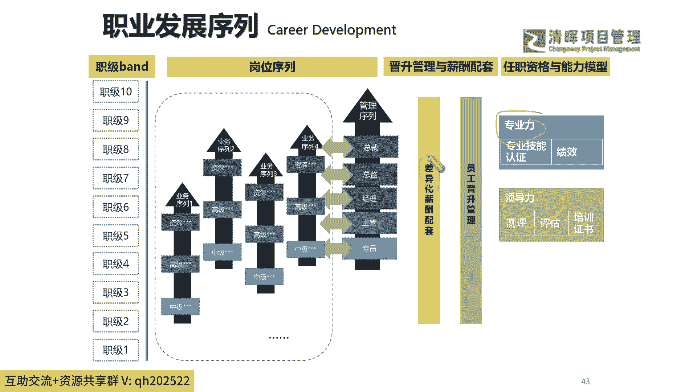
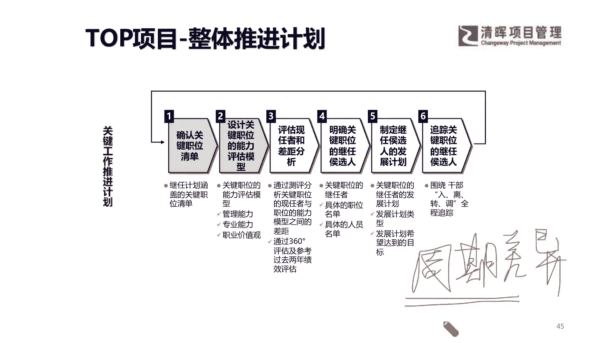
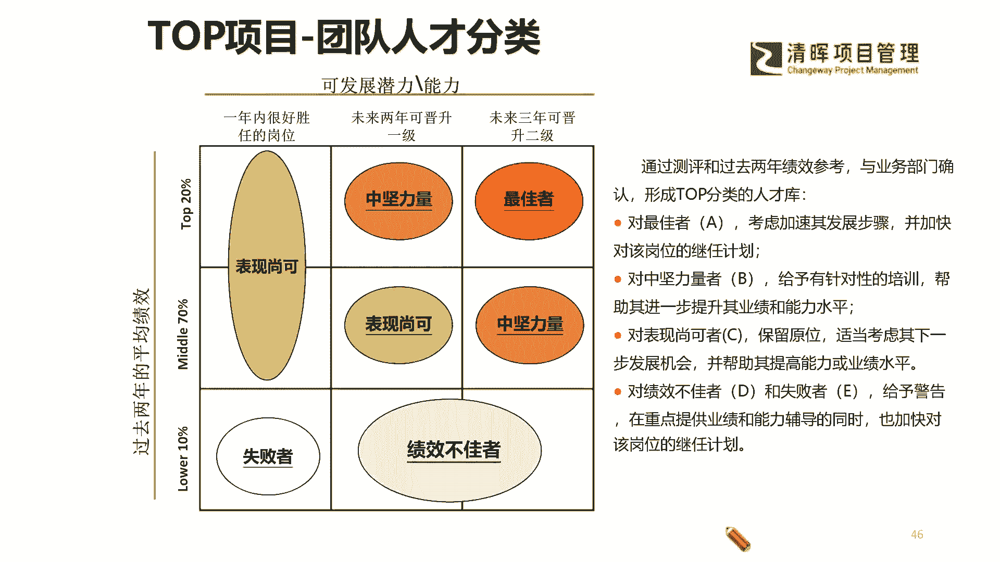
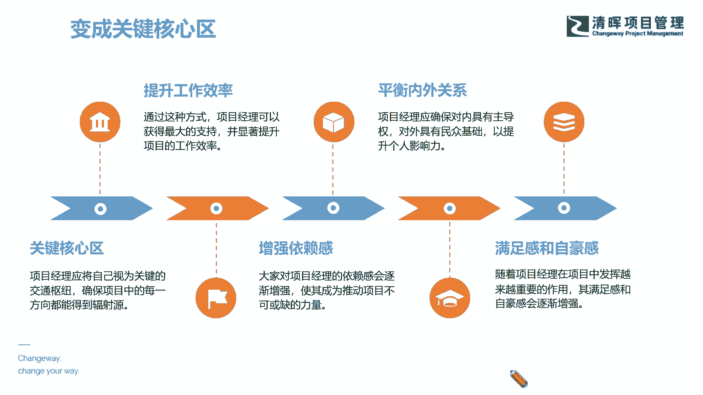

# 项目经理晋升4要素--训练营12讲 - P11：12.职业发展序列 - 清晖Amy - BV15Ps4epEYc

也许我们的职业发展序列啊，他就能够在我们的这种专业能力和领导力的，这样的一个双向加持之下，逐渐的什么一步一步合理，并且最短周期的往上去升了是吧，因为我们必须要找对我们的差异化发展的，一个什么优势。

差异化很重要，不是所有的人才的，这个虽然我们讲的都是什么职业发展，但每个人跟每个人，职业发展路径不完全相同的啊，所以一般来讲啊，我可能讲一个有点嗯，这个让大家认识不太一样的话。

就是我们有之前有朋友圈很多在讲，说我的成功可以复制是吧啊，其实不太建议大家听太多这种什么鸡汤了，当然这是一种正向的激励啊，大家可以理解为激励的话，但是每个人的成功都是不可复制的。

你必须要有自己的一个什么规划路径，因为每个人是不一样的是吧，这种差异化取决于你自己本身是个什么苗子，就像你可能是一个这个什么样的树，你就长成什么样的一个样子一样是吧，就像我们教育其实也一样。

你就像有些孩子天生就是一个大象，有些孩子是个猴子，有些孩子是个小兔子，有些孩子是乌龟是吧，你如果要跑步的话，那肯定有些动物占优势，有些不占优势，就跟我们讲的，我们可能有些优势不在这个上面对吧。

但是我们一定有我们自己的闪光点是吧，所以我们要去对自己有一个正确的认知，并且在组织的这样的一个环境之下，对自己有一个正确的评估和道路的选择，那么在这样的一个情况之下呢。

我们就能够去把我们的一个这个，从自己个人的一个岗位，到我们的最终变成一个种子选手的这个路径，就能够去闭环了，因为我们自己本身来讲，其实就是在啊这种时间的一个周期差异啊，周期差异才叫成功，呵呵呵啊。

周期啊，我们讲成功者都是在在讲周期的，周期差异才叫成功，什么意思，举个大家能够听得懂的例子，比如说我们的这个嗯马爸爸啊，就是我们在讲这个这个阿里巴巴的成功，那后期也有很多公司在搞这个互联网平台啊。

为什么没有成功，当然可能人才组织也是一方面的因素，周期和时代也是有很大的问题的啊，也就是说很大的影响，那阿里巴巴它不仅有一个这样的一个团队，有这么一个这个很好的一个时间点，他也在各个周期的表现上。

其实是踩对了赛道，踩对了这个点儿快速成长起来了，也就是说我们一般来讲，你要么就是抓住一些先机是吧，就像大树底下好乘凉，你先去发展起来，你就会去垄断一些资源，那可能其他人再去进来这个门槛，那是不行的。

为什么很难是吧，比如说你现在有一些头部的这种什么公司，它本身已经占据像bat的公司，如果今天你说要搞一个直播，是不是啊，你想去靠自己一己之力去搞一个直播平台，你说还不如b a at公司下场。

随便派一个这个大咖下场之后搞直播，立即就什么啊，这个流量就就就非常爆棚了是吧，因为平台在那是吧，你的周期流量在那，它就会在最短的时间实现变现，这就是没有办法去改变的事情，所以你作为一个小蚂蚁。

你在跟这个大象去进行pk的时候，其实你要打什么，你就要比他快嘛，是不是好，其实就是这么个道理啊，所以后我们看到这个部分的时候，那么其实我们就意识到了，我们自己本身也是处在这样的一个。

不断的人才分类，人才发展的这么一个周期提升的过程当中的，那么我们看到了这个部分，我也希望在咱们今天的尾声啊，我们既然知己知彼了，也知道我们要有规划，要知道对自己有一个二七十，二十十的一个分析啊。

也去评定自己的发展潜力能力。

那我们最终呢其实还是希望大家自己，把自己变成一个关键的核心区，变成团队的关键核心区，让大家能够对我们产生依赖感，并且能够很好地平衡内外的关系，提升我们的工作效率，并且达成我们工作的一个成果。

来提升我们的一个满意度和自我成就感，在这样的一个环节里面前，才是什么可持续的。

