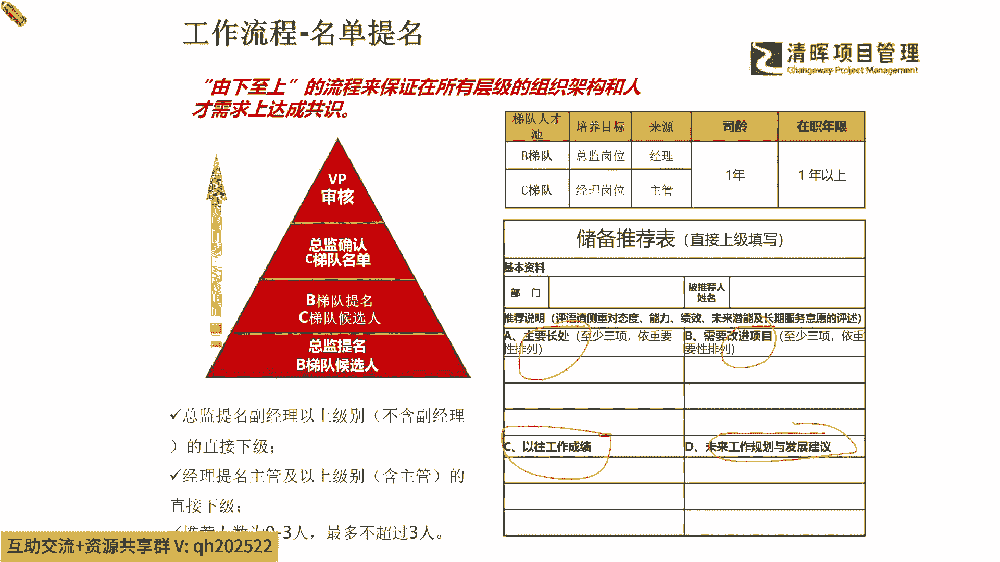

# 项目经理晋升4要素--训练营12讲 - P12：11.人才梯队建设框架逻辑 - 清晖Amy - BV15Ps4epEYc

我们其实我们从所有的这个具体细节上，从提名啊，从你的boss开始逐级往上去储备推荐，你主要会被提到的就是你的长项，你的短项，还有你的以往的这个成绩，以及你未来的一些潜力和你的可行性发展计划。

逃不出这四点啊，所以知道了这几点之后，你自己就要去想想看你怎么样能够被你的boss啊，被你的hr给盯上啊，成为这个实力派种子选手的话。

你就得把你自己的这些点，自己先提前去复盘复盘是吧，那么另外就是在我们的这个hr的IDP，你的个人这个职业发展当中，你就要自己不断的去跟你的直属的老板，我刚才重复了几遍了是吧。

跟你的这个both man啊，然后跟你的这个人力资源的这个HR啊，不断的去交流沟通，能够变成你自己的一个什么，这种可持续不断提升和校正，自己行为的一个这个点。

那么我们知道了这个部分我们就知道啊，可能如果你已经踏上这个路径的时候，我们的hr就会把你放进这个池子放进去了，那么晋升就是你的一个迟早的事情了，是不是啊，好那么知道了这样的一个部分。

我们看看啊，你看人才梯队一个建设的框架逻辑，其实非常的清晰和简单啦，你就是变从新员工的这个好苗子啊，一步一步可以能够把自己的岗位技能啊，hr的绩效的一个这个提升，以及你个人的一些DP的一个规划。

来去进入到我们的一个这个所谓，我们比较熟悉的管培生是吧，那我们再去从管培生当中，能去发展出我们的中层的储备干部，那这个中层储备干部就像扎根和学习一样，你也需要经历一些风雨不断地成长。

当然组织可以给你浇水是吧，也可以给你施肥，但是成长是靠你自己的啊，如果组织过于压苗助长的话，有可能把根儿拔出来了是吧，所以一般组织也不会这么过做，所以就是基本上同步的这么一个点上来讲的话。

可能给予大家比较好的一些培训是吧，那么你自己也要意识到，除过组织的培训，你可能还要主动去干嘛，主动去多扎根，多去学习，不仅不能仅仅依靠公司的资源是吧，你可能很多同学我们这样我们印象非常深刻。

我们有很多这个同学是这个公司送送进来，来考PMP的，那么我们还有更多的同学，都是自己个人要来考PMP的，是不是，所以我们能够看到这样的一个这个，思维观念的转变时候，你就开始往这个什么。

这个高层的一些种子选手去跃迁了，因为高层的种子选手他一定是高绩效，高潜力加高实践落地能力的人，那么在这样的一个过程当中呢，我们就能够去看到我们自己本身的这样的一个。

