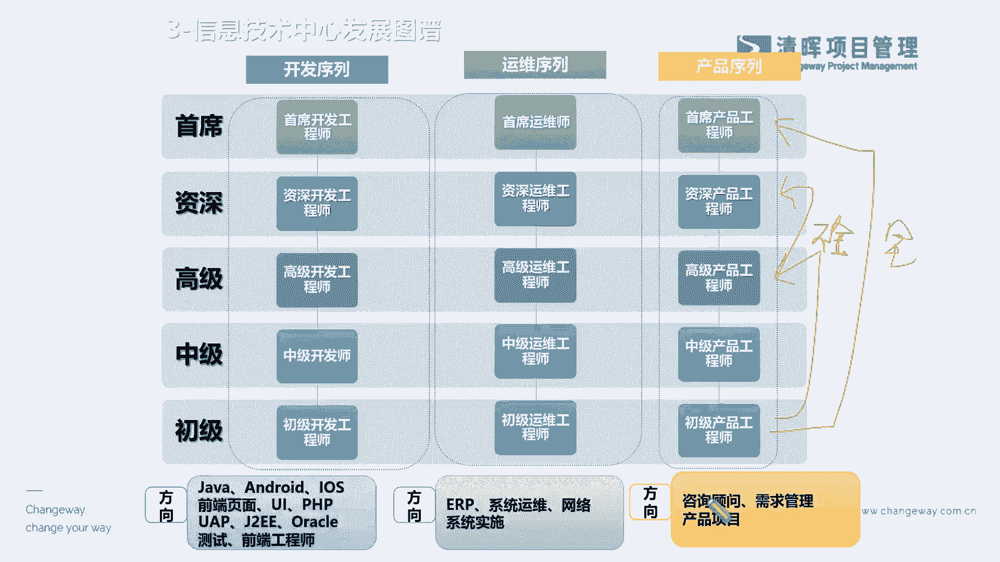
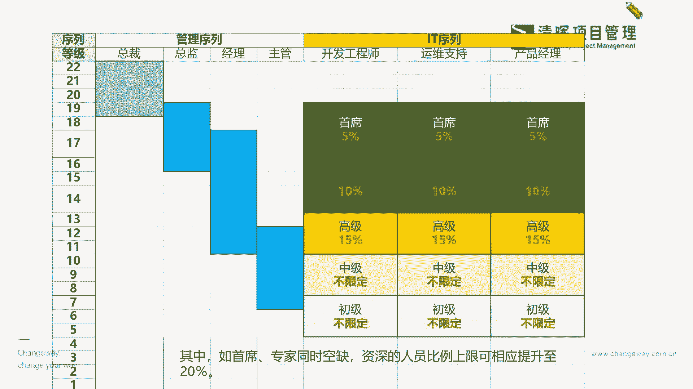
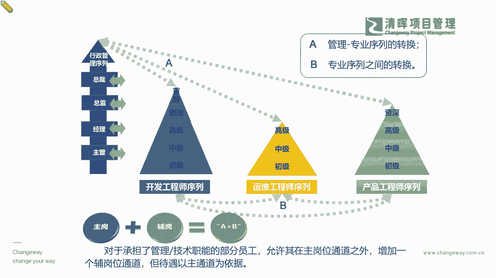

# 项目经理晋升4要素--训练营12讲 - P4：4.信息技术中心发展图增 - 清晖Amy - BV15Ps4epEYc

也来去举个例子啊，比如说我们有很多的这种，就是我们以i it业为例啊，我们有很多这种it的这种这种组织架构，比如说它会分成开发，分成运维，分成产品序列是吧，所以它会在不同的序列当中。

也会从呃这个junior level到我们的中级到高级到资深，甚至principle啊，到首席是吧，那我们在这样的一些不同的这个级别上，甚至还可能会发展出来很多的一些综合的。

比如说我们的多元的这种咨询顾问啊，啊我们的一些产品管理的一些综合能力啊，甚至我们还能去做一些这种呃我们的执行啊，就是加上战略的executive的一个晋升路径是吧，我们看到这样的一个典型的这个。

职业发展图谱的时候，其实我们就知道啊，其实咱们在晋升的时候，我们大家一般的这个认知的概念是什么，各位同志们，在企业里面，尤其是这个体系化相对健全的一些企业当中，大家有没有可能一下子从这里。

从初级跨到这里啊，Yes or no，能不能一步一步到位啊，同志们能不能一步到位，哦我相信各位各位一定都是心里默默的在讲啊，这个哪有这个天上掉馅饼的事情是吧，除非什么我爸是李刚是吧。

啊但是可能在这样的一个情形之下啊，其实大家要清楚啊，这也就是刚才严老师所强调的一点，每个人都要经历时间的沉没成本，你不可能越级，我们也在逐步发展当中，我们并不能什么跨越一些历史阶段一样啊。

其实在职业发展当中跟我们人成长一样，你从一岁两岁三岁一直到是这个呃，小学初中高中大学到成人，你也是不能一下子变大的啊，企业发展也是一模一样是吧，所以可能我们在植牙的迭代当中啊。

如果是在一个体系相对健全的公司里面，你想一步到位，这基本上不可能，所以你要把心态先摆正，那么第二个问题就是什么，如果你会发现有些咱们的一些这个同事啊，或者一些伙伴诶，他有可能从一个平台当中跳出来之后。

他还真的有点像一步的冬天啊，从这个初级下至少到不了首席吧，到了高级了是吧，甚至有些还能去到了高级之后，很快就跃迁到这个资深了，行不行呢也行，这是一种什么什么，就是在体系相对没有那么那么完善的。

这样的一些公司，比如说什么小型的创业公司啊，我们有很多新兴新兴行业是吧，我们有很多的机会给到我们的，敢想敢干的一些这个职场人，所以大家想去谋求不走寻常路的晋升的时候。

你就一定不可以在一个很成熟的平台去发展啊，因为很成熟的平台呢，它其实基本上不太会一步登天是吧，因为它有严格的评价体系，尤其是我们终身雇佣制的企业是吧，它是不可能出现说我去晋升一个完全的。

就是可能相对经验还比较薄，年字还比较短的人是吧，去到一个高级管理层，他是一定要有一个逐级晋升的一个概念的，那么我们一些相对新兴的行业，它就有点不拘一格降人才了是吧，当然也许也是决定在他的体系还不完善。

所以可能有很多这样的一个什么机会是吧，所以我们讲的乱世才出英雄呢，是不是，所以可能在很多的情况之下，如果各位咱们屏幕前啊，咱们正在听课的一些小伙伴，如果大家对自己24年甚至25年。

现在整个经济大家也看到非常困难啊，也有很多的一些不景气的现象啊，我们有很多的挑战，那么在这样情况之下，如果大家想去求稳哈，我们想去以稳步提升的话，那么你就放下你的这些利器啊，不要去comply哈。

是把这些打破这个牙齿混血吞啊，就是自己来去从内部打破自己，让自己逐逐级的定定心啊，沉淀下来，去不断的成长和学习，当然后面我们也会跟大家讲，你怎么去关注这些点，那么另外呢，如果你对自己。

目前希希望可以有一个更大的平台，甚至有一些突破的时候，那么你不妨可以去study，可以去考虑考虑是吧，我们怎么样能换一个这样的一个平台，能够给你自己一些什么，参与到去建立体细的这么一个工作当中的时候。

其实你的机会就来了，因为我们更多时候在成熟企业，你已经在别人建立好的体系之下去工作，那你当然是只能当那个里面的一个什么，这个螺丝钉是吧，但是如果你到一个新的这个平台，那么你就有可能会什么。

从一个级别会跃迁到另外一个，更加什么高的一个级别是吧，这个点大家一定要认知清晰啊，不存在任何的奇迹，这个都是根据这样的一个状况来去干嘛，来去进行的这样的一个选择而已，所以我们之前在讲选择大于努力。

是讲这个意思啊，那啊我们看到这样的一个情形啊，景色同学也说这个工作而已是吧，要调整好心态没错啊，心态很重要，但是心态的背后呢，我们也希望大家不是无可奈何的这种心态，而是什么。

你已经看清楚这样的一种底层逻辑，你选择了以什么样的方式来更适合你的发展的，这种好心态是吧，而不是无可奈何的心态是吧，所以这你就要懂啊，你就要了解自己的一个优势劣势，了解底层逻辑，了解这个规则玩法。

你才能去什么。

对自己有一个这种清晰明白的一个认知，那么在这样的情况之下，我们再以这个例子来看看啊，为什么每个人这个晋升那么难，因为你会看到我们从这个底层往上升的时候，比如说你从一级一直往上拉的时候，你会发现啊。

在我们基层干活的就跟我们像金字塔一样，是不是我们在中基层干活的一些人员的执行端，我们其实还是比较庞大的一个团队的啊，就像我们讲的二八原则一样，也许executive从高级senior live。

到资深和principal啊，顶尖的这样一个CXO级别的这种这种level，它只占20%到80%，都是中基层的一些执行的上传啊，下达甚至落实的这么一些执行端的人员，那么我们在晋升的渠道上。

它势必是在不断的什么缩窄的这么一个过程，是吧，缩窄的这么一个过程，那么我们知道，既然它就是一个客观存在的这么一种，这种晋升的机制，那我们就要去了解一下啊，我们要去了解一下。

我们怎么样能够去看到这样的一个什么啊，这个过程，那么在这个过程里面啊，我们其实也会跟大家去啊，了解到我们自己本身和我们在这个体系当中。

需要去注意的一个跨界的问题，为什么我们有很多的人员，他能够快速去get到一些这个要义啊，甚至可能通过啊一些转岗调岗，甚至去多学习多元的一些岗位的一些经验啊，他就很快能够什么晋升到一个原来不可能。

什么按部就班去晋升到的一个位置上是吧，所以其实可以以这个为例啊，我们其实更多的就是它击穿了一个什么，就是你的一个本质的擅长的一个能力，加上你的一个什么拓展能力是吧，什么意思啊，简单而言，今天你纯搞。

你在一个it公司里面纯搞管理行不行，也不太行，为啥，如果你不懂这个整个的一个什么i it系统，开发的一些逻辑，是你不懂这个这个一些专业的知识，那么你其实在带团队，带一些这种开发人员。

带一些不同的这种技术团队，你其实会非常非常什么吃力，你无无法去理解，可能互相彼此的瓶颈在哪，甚至你都揪不到重点是吧，那么这是单纯管理人员的一个瓶颈困惑是吧，那么另外一个困惑在哪呢。

就是你纯技术的其实也不太行啊，纯技术也不太行，啥意思啊，也就是说你这个纯技术的人员，最主要的一个gating在哪里啊，纯技术人员最主要的一个更新在哪里，其实就是因为他的技术思维。

技术脑已经占据了很大的一个这个部分，它可能在相对应的啊，可能有一些这个我们讲的叫什么，你的这个呃知识层面啊，你的管理能力，领导能力层面，甚至你团队的情商方面，可能就没有那么的强是吧。

所以你会看到现在的有很多的这样的一些，非常厉害的这个呃中高级的这样的一些，甚至资深的一些这种管理者，他们都是一个像一个结合体一样是吧，就是我们的管理加上专业都有你，比如说现在非常非常火的这个呃。

尼维达的这个什么啊，我们的这位教主是吧，这个黄黄教主是吧，他其实虽然是也是一个什么啊，P技术出身的技术background，就是技术专业这么一个这个这个工程师啊，但是他在职场里面其实大家都清楚啊。

他自己从事过6年的销售工作，销售跟专业，这跟这个技术一点关系都不搭嘎，它更多的是接触的市场，接触的客户，接触的渠道是吧，整个的这样的一些副，这个他自己所学的一些专业的一些这种知识。

加上他在职业岗位上多元的一个历练，就促成了他现在综合的一个这么一个，管理能力是吧，所以现在大部分成功去晋升的，都必须是这种什么A加B的模式是吧，也就是说说白一点，各位伙伴们啊，大家现在的这个时代啊。

人人争取在做斜杠啊，当然不是说大家要去啊，不经专研究你的本岗，但是在你本岗之外，就像我们讲的，我们特别去推荐我们的一些这个技术，技术的一些同学啊，就是你一定要去学PMP。

或者一定要去考一个这个这个工商管理硕士，或者是MEM啊，我们的这个工程管理硕士等等，这种综合管理能力的这种啊，晋升呢其实是一个非常非常能缩短，你这个什么成功晋升周期的，这么一个非常快速的路径。

它不叫捷径啊，因为学习也是要付出很大的一些时间精力，甚至你可能一个决策啊，因为你要花花费一些这样的一个财力等等，那你自己本身呢，你通过这样的一种投入，你其实换来是你这个成功周期的一个缩短是吧。

所以这也是一个能够跳脱出你要靠癌资历，甚至我们很多那种去熬资历，也不一定顶得上一个空降的，什么什么这种什么什么MBA啊，名牌的一些这种管理的一些这种这种人才，为什么是因为人家通过学习了综合的体系。

跑在你的前面了是吧，因为学习思维体系这种东西一定是学了才有。

并不是从你本职工作就能什么生发出来的是吧，好那我们知道了这个部分。