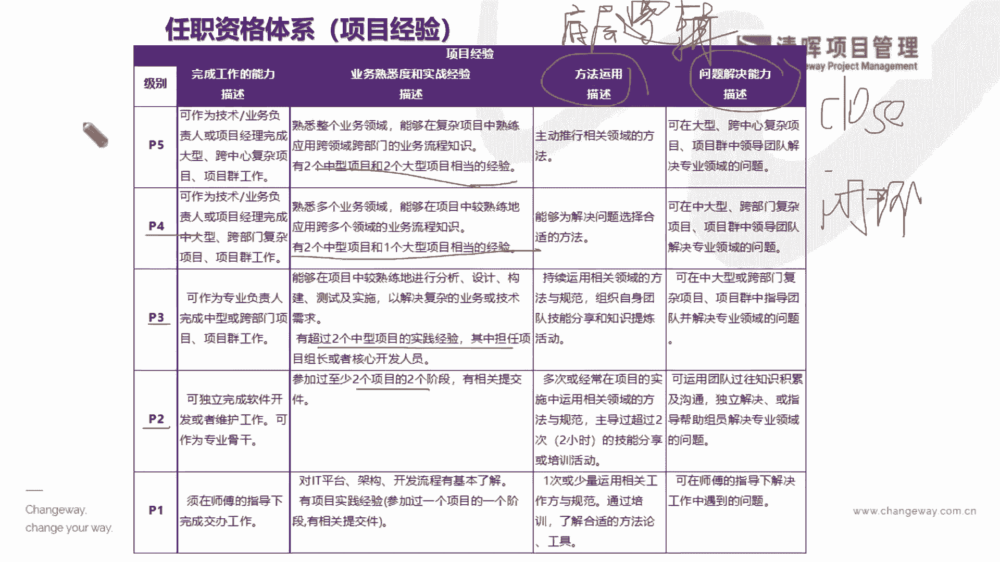

# 项目经理晋升4要素--训练营12讲 - P5：5.任职资格体系(项目经验) - 清晖Amy - BV15Ps4epEYc

一个动作里面，其实我们返回到hr的体系，我们也跟大家简单介绍一下hr体系，就会把它更加细化，因为它要量化嘛，对于所有人才评级，他说非常非常明确的是吧，那他就会变成我们非常熟熟知的。

这种任职这个资格体系啦，就是根据你的年资，你的经验，你的学历，你的能力啊，然后来去分成，比如说你的p one级别啊，到p two p three p four。

p five p这个一直是很高的级别等等是吧，其实这就是把前面这几个东西把它量化了，能理解吗，它里面所写的这些，就是他怎么样去量化你的这些东西，你看看举个例子啊，你比如说在p two啊。

p two和这个P3P4，再往上，你看他对你的什么业务的广度。

就是你的这个干嘛啊，实践项目经验都是有一个极度的要求的。

就是你有没有参与过几个什么样中型的项目，有没有参与过几个什么不同的阶段，甚至你还有参与过几个不同的大型项目，这不就是看你这个实践吗，你不能光懂，你不能光去什么，知道了，光去理解了，你没有去应用也不行。

是不是啊，所以可能这个我们就理解了啊，其实他是这么来评判我们，它决定我们能不能晋升的，就是你即便你已经是个挺厉害的一个，这个这个大拿了是吧，但是你可能如果仅仅是停留在理解的，这个层面的话，其实不行啊。

他可能还要评价你有没有在什么实践层面，有一些输出，那么这就是我们影响我们晋升的，一个重要的因素是吧，另外呢他还会去看你的什么，就是你的一个方法论，方法论是什么，说白点方法论就是你的底层思维认知。

就是你的底层逻辑，比如说比如说你出现了一个非常棘手的问题啊，他可能会影响你的交付，有些人第一时间想到了说这是谁谁谁做的，然后我就赶紧回去问责他是吧，你怎么做成这个样子，影响我交付了，这是一种思维。

那么还有一种是什么，你发现这样的一个非常重大的一个，影响交付的问题的时候，你会把什么相关主要的干系人，都都什么带领起来，大家一起快速的集中办公来去解决问题，而不是什么来去，把这个责任。

仅仅推给某一个相关的什么功能部门是吧，这也是一种底层逻辑，是不是啊，所以你会发现这是什么，这其实就在拼认知啊，就是我们刚才讲的，我们到底是犯一些基本的错误，说我不清楚，我不知道，这不是我所管的。

还是说好，我来分析一下，我来学习一下，尽快给您答复是吧，这是一个非常重大的不同，就是你的方法论和底层逻辑上的不同，那么另外一个就是你的什么，你的应用能力就是你的知道啊，叫到理解到应用。

你到底能不能把这个问题给什么，Close，就是来去彻底解决掉，就是你的闭环能力就这么简单，所有的管理者都必须具备非常成功的，闭环思维和闭环能力啊，这一点就是所有这个leader啊。

愿意去晋升你的一个最重要的点，因为我们知道啊，我们在学PMP，我就在我的班上非常强调的一点啊，所有的leader在项目资源管理第九章的时候，我们提到了，所有leader再去进行这个种子选手的选拔的时候。

都只脑海里都只有一个量化的标准啊，什么标准呢，就是plan for success，什么意思，就是为了成功而去选择它，也就是什么意思，他必须明确地知道这个人选放在这里，它就已经代表这个项目成功了。

或者它已经具备这样的一个成功的，一个这个资历和他的一个经验放在这里，就是一个成功的选择了，他才会去做这样的选择，而不是抱着试一试的态度啊，同志们是吧，也就是说你的老板生意啊，绝对不可能是说我来试一下。

看他行不行啊，绝对没有这种想法，都是要干嘛来去生那些，他们已经什么十有八九非常明确，这个人一定行，他已经有做过了很多的这样的项目的一些经验，证明他行啊，所以可能在这样的一个环节当中呢，我们就能够知道。

其实都是我们的一个什么这样的一个啊，plan for success的一个闭环的思维是吧。

那么在hr的这个这个评级，它也会根据这样的一个闭环啊，不断的把我们的认格，任任职资格的一个标准，去进行一些这种打分儿啊，核心这个素质呀，也去不断的去让大家做做测试是吧。

进行一些你年终啊me the term，或者是年尾这个final term的一些这种，整个的一个这个绩效的一个评级是吧，等等，项目经验怎么去分，他就会建立一个非常完善的这样的一个，这个标准的评分原则啊。

你为什么要这样子，因为我们讲了所有的相对完善的一些公司，他们都会有非常完善的体系的人才，一个选拔和评价的标准，没有无缘无故的什么这种突然去晋升一个人，更没有无缘无故的干嘛无缘无故的去什么去啊。

可能给一个人去达到一些什么不好的绩效是吧，所以我们能够看到这些部分的时候啊，那我们怎么样才能够更好的啊，看到我们自己的这些晋升的机会点呢。

才是更重要的，那么在这样的一个部分里面，我们就要看到落差了是吧，你这个落差的落差到这个中间的gap，到行动的时候，你就一定要清楚你自己的一个职业发展的target好，凡事预则立，不预则废。

你必须要有一个清晰的职业发展的一个目标，比如说你给自己定的一个flag啊，你需要在半年之后达成什么目标，你需要在一年之后做到什么样的一个，什么知识面是吧，你甚至还有什么。

你自己本身还有什么样的一些更多元的，这么一个什么啊，这样的一个发展的计划，更斜杠一点，让你具有更多的一个这种什么啊，这种能力啊等等，那么其实在这样的一个啊环境当中呢，我们其实就能够看到啊。

你自己其实可以给你自己去制定一个叫什么，个人发展的行动计划，就是我们的IDP，那么再加上你的一个沟通的一个，什么能力和技巧，来去不断的跟你的这个合作部门，跟你的这个领导者leader向上管理是吧。

来去抓到你hr的一些这种这种啊培训啊，或者你hr的一些这种可能性，对于人才这种发展体系的给予的机会和平台呀，你能抓上这波节奏啊，来去快速发展你自己的一些优势能力。

那么在这个过程当中，我们就能去看到咱们的发展方式啊，不仅仅是来自于培训的啊，公司和企业给到大家的training，我相信很多企业其实已经有啊，这个七十三十的这么一些培训的原则，是不是啊，所以什么意思啊。

就是你起始啊，70%，你切实的能力是来自于你的一个什么实践，加个人的一个什么专业提升的，也就是说你的这个工作的一个task，你的工作的一个什么设立的广度和深度，你能解决多少的问题。

你能够去这个参与到多少不同的一些，这个项目的范围啊，其实这个还是有非常大的差异的，那么这个差异其实就决定了，为什么别人能够快速生，你不能是吧，或者为什么你比别人涉猎面广了，你就能占得先机是吧。

其实在这个当中呢，其实我们要看到我们本身hr的发展，人才发展方式，它也是符合这样的一个底层逻辑，就是我们需要啊去首当其冲，把我们的本职工作当中的这个这个事情，要把它做什么，做深做细做广。

那同步呢去结合啊，比如说我们的hr公司，给到大家很好的一个培训平台，甚至可能我们之前在做内训的时候，我们公司也会定期给大家有很多这样，非常好的一个这个什么我们的一个岗上岗培训，不管是线上的还是线下的。

那大家来去争取，来去报名，那大家有没有积极主动是吧啊，其实这些也非常关键，也大概会占到20%，那么另外一部分就是八小时之外的东西，就是10%的东西，就是八小时之外的一个这个差异了。

也就是说我们都下班了啊，就像今天我们也是大家下班的时间啊，我们来去听这个线上的课程是吧，那么我们有些同学可能下了班，大家就去吃吃喝喝了是吧，但是我们还是有啊很多的几百位的同学。

我们还是坚守在咱们的这个线上的这个，直播间是吧，我们能够去看到我们自己的这样的一个什么，这个提升的一个过程，那么我们就更加能够去了解到，我们自己个人也好，还是我们自己本身啊，整个成长的体系也好。

其实我们如何能合理的分配掉我们的时间，和有限的这样一个精力，其实更有利于我们快速的提升和晋级呢，其实不妨可以尝试一下这种七十二十十的原则。

那么在这样的一个加持之下呢，我们就能够看到，在以i it业作为这样一个参考的时候，你就会看到其实在不同级别上，大家所实践和学习的内容，也是非常非常不一样的是吧，所以可能我们了解到。

我们如果今天想去越级跃迁的话，从初级变成资深首席或高级的话，你的管理的东西就是一点儿也不能去省的，是不是一点儿也不能去省的，所以可能我这就是，为什么我们有很多的一些学员啊，大家一开始很这个刚刚毕业。

在工作岗位上一两年就会来问啊，就是我到底应不应该哎来去学一学，这个项目管理，学一学我们的产品管理，其实如果要问到严老师的，我一定会非常坦诚的回答yes，因为你越早去接触，越早去学领导力这个东西。

你一定是会受益的更早，你的底层逻辑才会什么成长的更加的深，就像挖地基一样是吧，如果你的地基比较浅，你就只能盖平房啊，你没有办法去盖那个摩天大楼，你只有越早的挖地基，挖的越深，有些时候你在挖地基的时候。

别人看不到你在干嘛，就像你在上课，你今天在听这个这个小微课程啊，别人也以为你在吃吃喝喝呢，但实际上你把这个时间花在这里了是吧，也不一定那么显眼，因为你在扎根呢是吧，你再去挖地基呀，当你挖到足够的深度。

你开始往上去盖楼房的时候，挖得越深的同学，你才能盖的越高，这个就是一个最基本的一个道理是吧。

所以我们一定要了解清楚这样的一个体系。