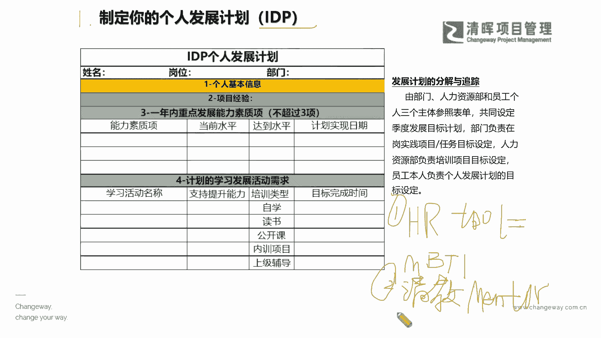
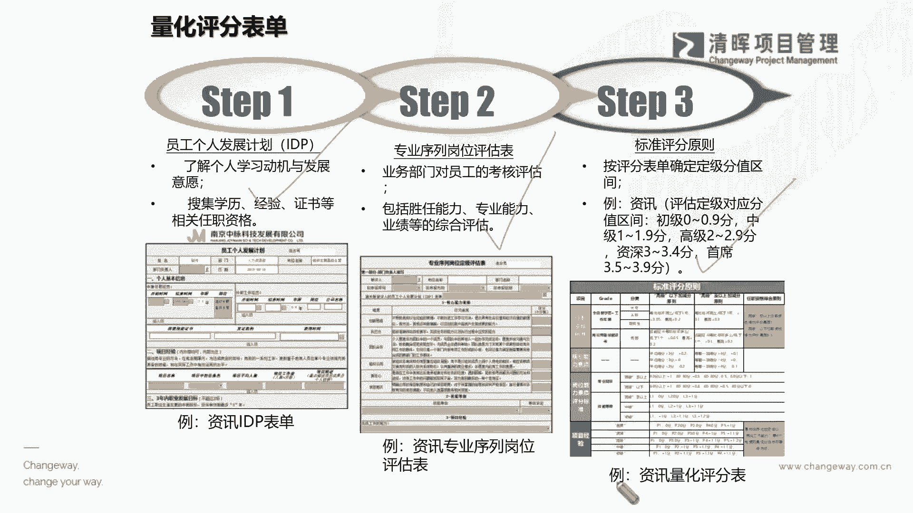
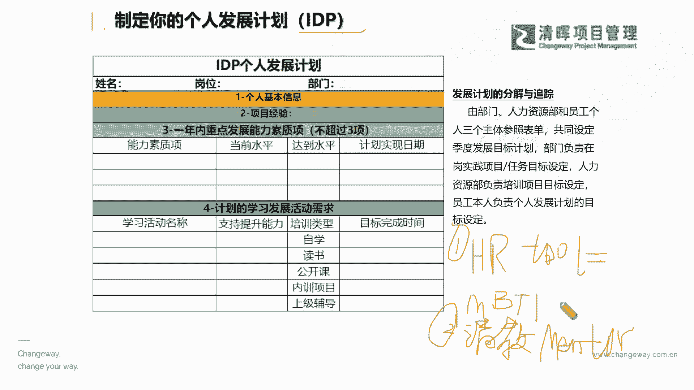
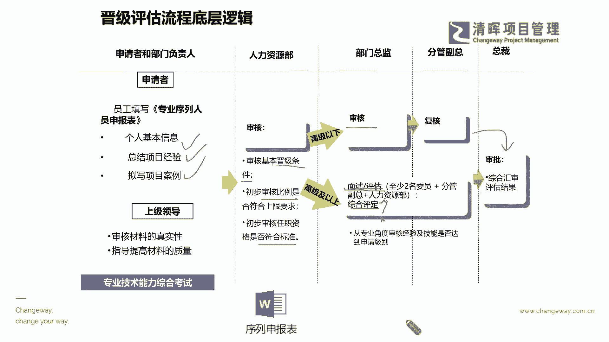
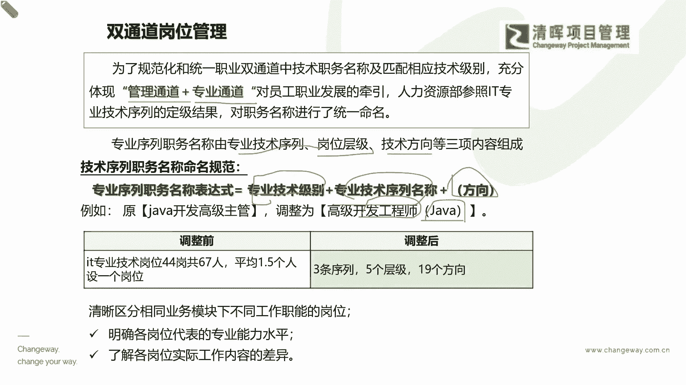
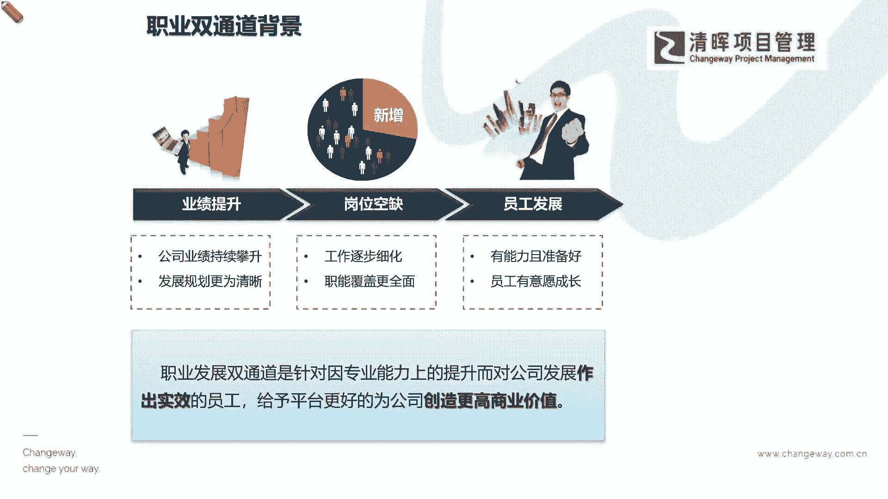

# 项目经理晋升4要素--训练营12讲 - P6：6.制定你的个人发展计划(IDP) - 清晖Amy - BV15Ps4epEYc

在这样的一个情况之下，我们就更应该首当其冲要抓什么，如果你想晋升的更快的话，相信大家都听出来了，你先把你自己个人先搞清楚吧，来定一个你自己的IDP啊，这个个人啊。

一个individual的一个development的一个plan是吧，就是个人发展的一个计划，那么个人发展计划它会涵盖什么方面呢，就是你一定要去分析到，你自己目前最需要去什么补足的能力是什么。

但是这个能力不能太多啊太多，因为你必须要有时间周期是吧，你有时间周期的话，那么你就啊能够去量化，能去追踪，并且确保它一定能落地是吧，但如果你列子太多啊，我说这个七八十项哈，甚至还有很几十项。

这个这个可能有点难啊，你先去抓首样的top的3top5等等啊，这个一般来讲不超过五项了是吧，然后再来去看看你为了围绕这些能力，你最应该去做的一些学习的活动是什么是吧，甚至有一些。

比如说你要培养你综合的这种高层级的，管理意识，那有些同学就要去plan，你就要考这个MBA，那MBA呢就需要你要去什么上这个这个呃，至少是兼职的part time的这种工商管理硕士。

那你就要腾出时间是吧啊，你需要什么样的知识分析一下你的资源，分析一下你的这种啊，整个的投入的一个周期等等是吧，所以我们必须给自己去规划出来这个路径啊，也就是说你必须先有一个自知之明，照照镜子是吧。

照照镜子，如果有很多同学，你可能会比较疑惑，说老师我并不知道我现在缺什么啊，当你当你有可能在疑惑我现在要学些啥的时候，因为有也有很多同学在问杨老师说杨老师，我现在到底应该学些啥。

我考完PMP应该考啥是吧啊，在这样的一个情况之下啊，我推荐大家也去用用一个，如果你不知道你要你要发展什么能力的时候，你对自己不是那么太了解的时候，你可以借助一些什么呢，就是在偏僻里面也学过的啊。

就那hr的工具，hr to hr的工具有什么呀，hr的工具有什么呀，hr工具就是我们之前讲的大家比较熟的，有一个叫MBTI是吧，职业性格测试是吧，大家可以搜到很多的版本，你自己借助这样的工具去测一测啊。

当然还有一些什么，就是呃有很多这种，现在有很多说I人伊人的这种测试是吧，啊哈也有也有很多这样的一些测试，我建议大家啊，你们可以去问一下你们的hr啊，问下hr做人才测评常用的工具有哪几个，他推荐哪几个。

你就去下载一些版本去测测，即便是简化的版本也没关系啊，因为我们讲的这个专业的hr的一些自测工具，它其实都是有它的一个什么呀，都是有他的一个这种长期累积的经验，所沉淀出来的，一些这样的一个。

这个他的一个本身的这么一个啊这个价值的，所以你只要能够去把这个现在的成熟的工具，用起来，那么其实就说明啥，就说明你其实对自己能够初步有一个了解了，是吧啊，初步有个了解，那随着你的一个什么。

在这个初步的框架之下，对自己再去深入，再去观察，你也要自己观察自己啊，是吧啊，你也要自己观察自己，再去观察，进一步的这样的一个呃，你的工作表现和你的短板的时候，其实你也可以干嘛，第二个第一个建议啊。

不知道怎怎么去找的时候，第一个用hr to第二个干嘛，我给大家讲的建议一定都是实用的啊，那个同志们，你尝尝试去用一下，你一定会有很大的收获，第二个干嘛尝试去请教，尝试去请教你在公司啊。

或者是在比如说我们的这个专家啊，培训培训机构也好，或者是你的一个职场当中啊，你自己的一个职职场环境当中，你会认为比较成功的人士啊，符合你的一个成功标准，比如说他既非常学识渊博。

又有十足的这个这个什么实际经验是吧，你请教一个这样的一个什么叫做什么，这个mentor啊，我们叫做这个啊教练吧，啊就是一个这样的一个专家教练，请教一个能做你mentor，做你coach的这么一个人啊。

来去想办法跟他谈一谈，因为在有很多的这个公司里面，其实是有这种young taylor，年轻的人才，我们会有一些mentor program，就是有一些会给他有一个师傅，资深的师傅。

那这个师傅呢就会去不断的去来去跟他交流，来去跟他解决他这个思维上的一些问题，甚至可能还会啊输出一些，对他这个整体有帮助的，这么一些这种这种想法和idea是吧，所以我们的专家请教这个这个啊。

我们的专业人士，请教你认为比较成功的这些人士呢，其实也是一个非常好的，能够发现你自己的一个能力，提升项的这么一个很好的一个方法啊，那我们有了这两个部分，我们就能够找到我们的一个必须要重点发展。

能力的一个建议了，那我们就列出来啊，实打实的来去看到这样的一个呃过程是吧。

那我们知道了这样一个过程，我们就会逐步的去量化，我们自己在这个过程和所列的这个能力当中的，一个发展，是不是这个符合我们自己的一些这种什么啊，要求，以及我们某一些评估表当中的能力，我们还存在哪些欠缺。

以及我们可能更倾向于拿到哪一部分的，一个分数，也许对我们的这个晋升是更加有益的是吧，好韩俊同学也说，在定期谈话当中，咨询做得好或者需要改进的环节，这个非常重要啊，因为我们通常来讲请注意啊。

这里我再去多一嘴啊。

这里的请教我们的一个什么，你认为的成功人士或者是专家，这个不是复盘，不是你的自我复盘啊，我在这里去强调一下，不是你自己检讨你自己，是你要听到你自己以外，第三视角的一个360度的反馈，什么意思。

你不能自己的眼光来看自己，当然自盘自我复盘很重要，但是这不是全部，甚至可能不一定是一个完整的视角啊，所以你必须要找到一个相对的第三方啊，这个专家是，而且是你认可的这样的一些专业人士。

他能够给你一些什么专业的建议是吧，好，那么这个这个点啊，我讲啊，其实在呃我们的这个西方啊，其实他们很横去讲究这个这个所谓的mentor啊，就要有第三方的一个辅导，为什么，因为大家都知道啊。

在西方这个小宝宝啊，这个baby刚生下来的时候，她除了自己的爸爸妈妈之外，他还会去认什么养父养母是吧，教父教母哈，就类似于说他是一个辅助性的，他会去可能这个这个他的一个这个教父教母呢。

他是从他的本身的这个，比如说父母的一些你非常优秀的朋友当中啊，来去进行这样的一个选择，并且他们达成一致说啊，你可以给我的孩子什么样的一些这种，除了爸妈之外啊，还可以给我的孩子一些这样的一个持续的指导。

那其实有很多西方的这个这个孩子呢，他其实不仅仅是他自己本身是吧，就是很很在乎啊，或者是很在乎父母的这种，甚至可能到了叛逆期的时候，这些孩子都不见得会听父母的话，但是他可能也会寻求这个这个教父。

教母的一些这种指导是吧，但是可能在国内以前还有干爸干妈是吧，以前还有干爸干妈，但是现在可能很少是吧，但是可能其实这是一个很很重要的角色啊，其实大家也可以去了解和看到这样的一个好处。

那这样就能帮助我们去解决到，我们这个过程当中的，一些这个这个矫正和纠正和问题啊。

那么我们在晋级评估的时候，我们就会看到hr的逻辑思维是什么，底层逻辑是啥，他其实就是有很多人都想升职加薪，你这个时候就要先背你的这个什么boss啊，先被你的boss要先放进一个人才的池子里面。

这个人才尺子一般专业上面来讲，它叫做一个专业序列人员的一个什么尺子，讲的白话一点，它是什么，就是一个高级人才的储备池，这个池子里面会有你的一个个人基本信息，你有什么经验。

然后你的个人的一些什么这种ambitious，所以什么呀，就是你自己个人的意向，因为我们在很多在填IDP的时候，至少在一些底基层的这个管理者的时候，他就会让你去填，你比如说你未来想当什么呀。

你是想当一个这个项目级经理，还是想当一个项目总监，还是想当这个这个呃function的一些这个leader，还是想去做呃这个首席的一些专家等等，他会让你去填一些倾向性是吧。

那在这个当中就会去看到你的一个什么，你的一个综合的一些信息，那在这个池子当中的信息都是要逐逐步的，甚至可能定期去迭代的啊，所以有了这样一个池子之后，这个hr就开始审了，他就开始呕D了啊。

这个OD啥是OD啥嘞，他就会来去看每一个人才，你的基本条件，符不符合他的一个晋级的一个标准，然后我们也要看看啊，咱们今年根据整体组织发展的需求，我们需要去晋升多少人，在什么级别承担什么职责。

所以从言外之意啊，各位同学们，各位伙伴啊，即便你非常优秀啊，也有很多的企业其实它不能去晋升，一步到位的，这个根本原因还是因为你组织的一个什么啊，限制并不是你不优秀啊，甚至你可能换一个呃。

这个在某一些层面上换一个更有机会的平台，你可能很快就上去了是吧，所以可能在这样的一个部分，我们也要意识到客观的一点的确是组织啊，你的组织文化，你的组织结构也是非常非常重要的一个，考虑因素啊，各位同志。

其实刚才我说的比较宏观，宏观是什么，就是你在一个体系比较成熟的一个这么一个，这个机制里面，你其实晋升的这个什么啊，晋升的这个机会是相对比较小的，对不对啊，但是如果你在一个相对体系还在架设。

很多地方欠缺啊，这个这儿不规范，那不规范，这反反而是说明了什么机会啊，是吧啊，其实我们看到了这个部分的时候，其就知道了啊，我们其实hr在审核我们的就是这个比例，它会结合组织的要求来去定。

我们到底生多少人是吧，那么另外呢我们就要去进一步的审查，我们的人员是否严丝合缝的，符合我们的一个这个标准，那么在这样的hr的一个综合的评级之下哦，我们还会有这个什么进一步的面试，甚至综合评定。

为什么在这里要提一下啊，如果也想要晋升到senior level above，就是你开始要到总监，资深总监，甚至VP，还有一些这种更高层级的，这个这个层面上的时候，其实这个所谓的综合评定是什么。

大家猜一猜啊，前面这些面试肯定知道，想想去聊一聊是吧啊，见见人啊，也互相彼此加深一些这种这种关系啊，加深一些理解，那么这个综合评定主要是凭什么，我们如果用一个比较这种浅显的话讲啊。

其实这个综合评定就跟我们在面试考编的时候，讲的那个叫叫什么哼，我们要看的就是你的一个啥，你的一个政政治面貌嘛，呵呵对吧，就政审一样，就是你还是得要去了解到啊，除过你工作能力之外。

人家还要评定你是不是什么啊，跟周围的团队有能够互相长期，可持续合作的能力，以及你是不是有大局观，是不是有长远的视角是吧，你这个人本身的一些个人的素质怎么样是吧，等等，所以你看到这个东西的时候。

你就不奇怪了是吧，从各个角度啊去逐层审核，最终才会变成一个什么啊，我决定要不要去生，他才会去报批是吧，所以你可以看到这个逻辑的时候，你就会知道啊，其实咱们整个的promotion哪能只是靠工作年限呀。

是不是哈这个因素多了去了，那我们在这个整个的这个多元的因素之下，咱们怎么能去找到一条，相对缩短咱们周期的路呢，其实刚才也提到了，就是咱们一定要去干嘛，打开我们的视角，一定要去A加B是吧，那么A加B是啥。

就是把你的管理和专业都抓起来嘛，其实很浅显的一个道理，但是很多的咱们的这个小伙伴，就可能会走一些弯路是吧，因为我们一般来讲啊，这个管理的东西它也是有一定的什么早学啊，早实践的这么一个什么优势的。

也就是说专业是你从大学就学的，你比如说你学这个信息工程啊，你学这个机械，你学这个某一方面的，这个这个可能你的一个专业的能力，那这些大学这些硬知识就已经学了是吧，但是管理这个东西。

你说你除非你大学本科学的是工商管理，或者学的是相关的管理，但实际上呢更多的一些管理，都是通过工作实践来去升级，在工作当中去学MBA，去学PMP，去学这个PBA等等，才能去升级起来的。

所以我们的这个很多成员的这个意识啊，可能暂时你的行动啊没有跑的，没有跑在前面的一点，就是你可能没意识到，这个A加B其实是需要越早开始越好的，所以在这个当中我们就会去看到，打个比方啊。

我们看到这个你被扔进这个人才池的时候，刚才提到这个专业序列是吧，已经被扔进人才池的时候，他其实里面就会去提到，比如说你的序列是什么，岗位层级是什么，技术方向是什么，那么它就你就会被定一个编号，什么编号。

就比如说啊你这个原来是一个开发的高级主管，你现在变成一个什么高级的，这是专业级别，专业序列名称，开发工程师是吧，然后方向是什么，是你某一某一专业是吧，那你其实有了这样的一个概念的时候。

你就要去明确的区分清楚啊，你各个岗位代表的一个专业能力水平是什么，以及各个岗位工作内容的差IE是什么，以及你在各个岗位的现状上，你怎么样，A加B能够把这样的一个能力更好的提升起来。

那么在这样的一个过程当中。

我们打通了这个A加B的双通道的时候，我们其实就能看看到啊，其实这是公司特别喜欢的人才，你就能够有这样的一个又有理论啊，又又又有体系又能落地的人员，就必须得把它抓上来啊，必须得填补我们的这个领导的空缺啊。

也能去双向发展我们的业绩来去提升员工是吧。

