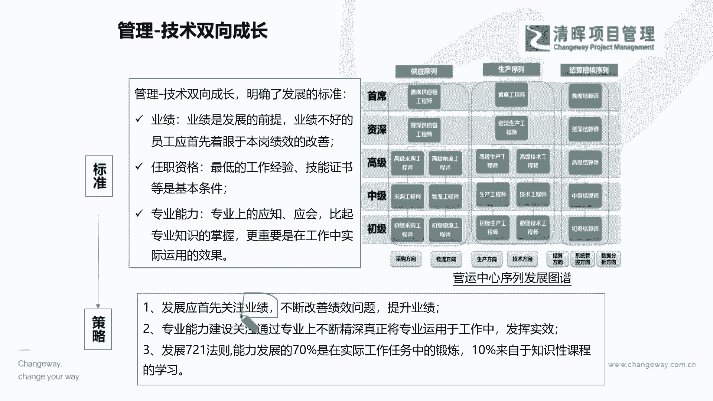
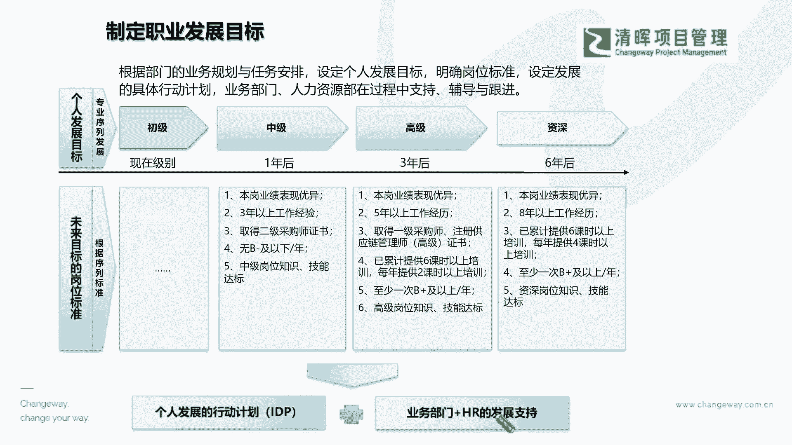

# 项目经理晋升4要素--训练营12讲 - P7：7.管理-技术双向成长 - 清晖Amy - BV15Ps4epEYc

在这样的一个双向成长过程当中的时候，我们就会发现，其实我们早就已经干嘛把我们的标准啊，我们的人才的衡量的一些个人标准呐，这个IIDP的个人发展标准呐，还有你的一些各方面的一个什么实践标准啊。

早就把它转化成为什么，你的一个提升的价值策略了，也就是说简言之升得快的人啊，晋升的快的人，你一定是踩在公司业绩的价值的，那个路径上面的，也就是说永远啊，就是比如说现在国家最近几年都在培。

培养这种什么人才，AI人才是吧，人工智能大数据，以前前几年的大数据，现在叫人工智能是吧，所以我们有很多这种专业数学专业是吧，等等就又开始红火了，那我们其实在很多的层面，这也就是踩在了这种什么。

它的一个发展红利上是吧，其实说白一点我们自己的一个提升啊，虽然360行行行出状元啊，但是我们要客观地去认知到一点是什么，如果你能乘上一些什么发展的风口，公司缺既懂技术又懂管理的人。

你能够把自己填补这个空缺，那你一定会比别人晋升的快，这个是毋庸置疑的，能理解啊，所以从另外的角度来讲，如果我们国家缺的啊，还是具备一些专有技能的人员，那么如果你你能够嗯去啊多学一学啊，这样的一些。

比如说呃非常专业精专的一些技能，那甚至可能在教育方面，让孩子也可以去，对某一些新新兴产业感兴趣是吧，这其实都是一些策略来去让你什么双向成长，也就是说我们双轨道之下，势必是要把我们的各项衡量标准。

把它变成你的一个什么思维的策略。

来指导你日常的一个什么这种学习和晋升的，那么在这样的一个过程当中，你就必须得把这个什么从标准到策略之后，落地到你的职业发展的规划啊。

