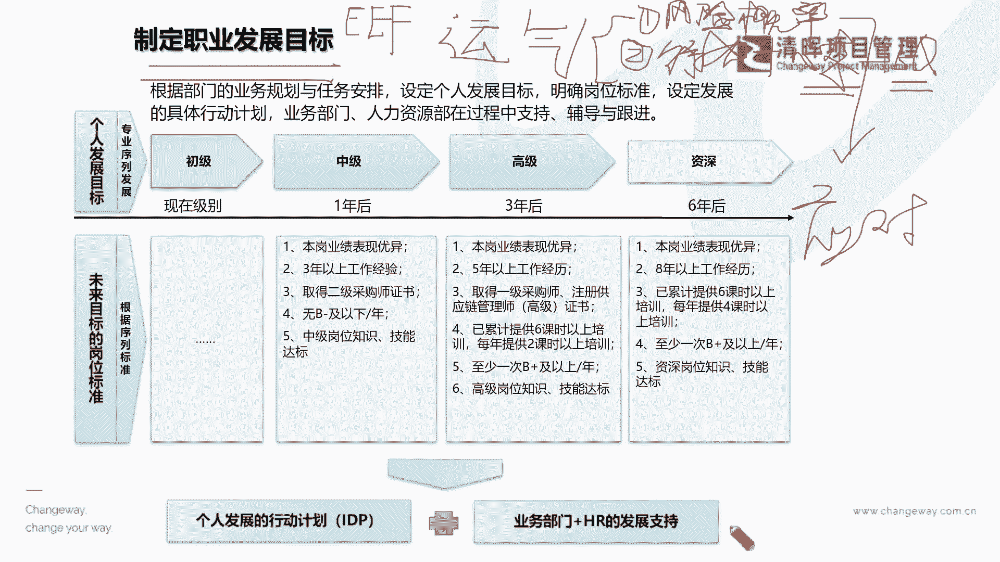
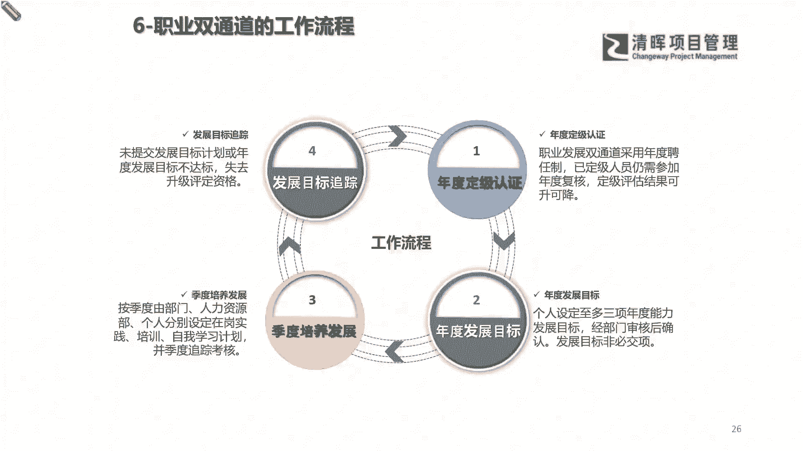
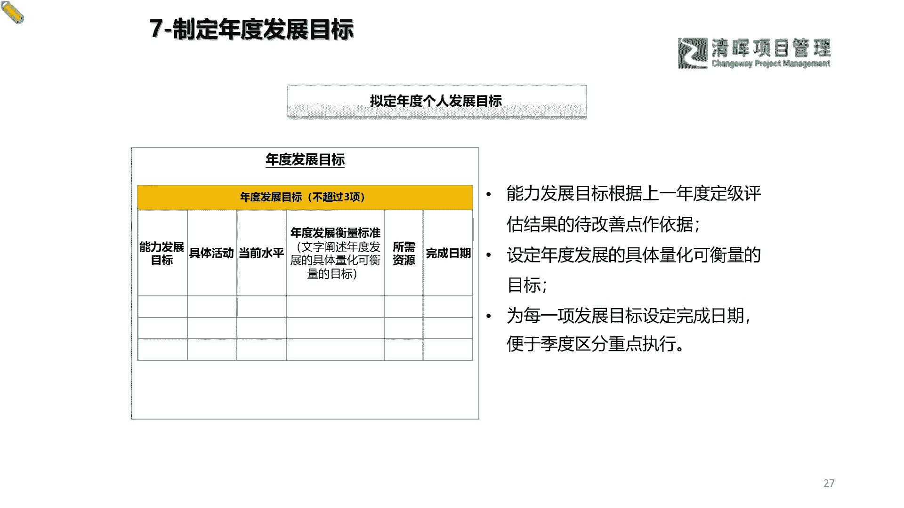
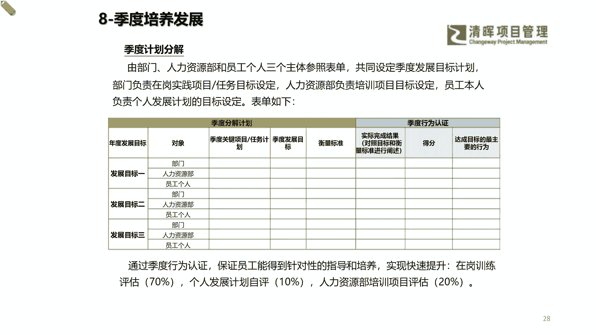
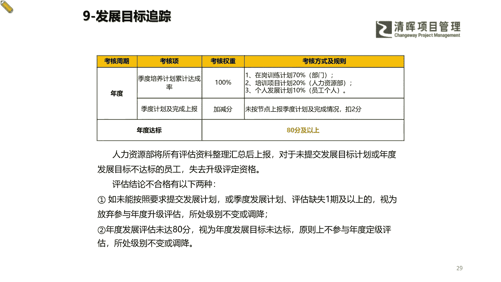
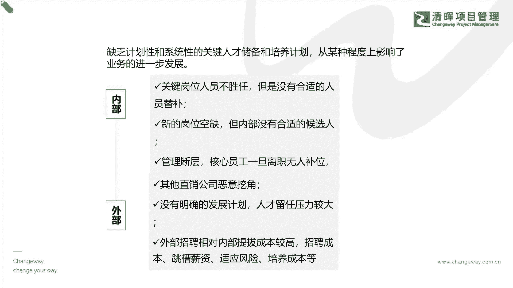
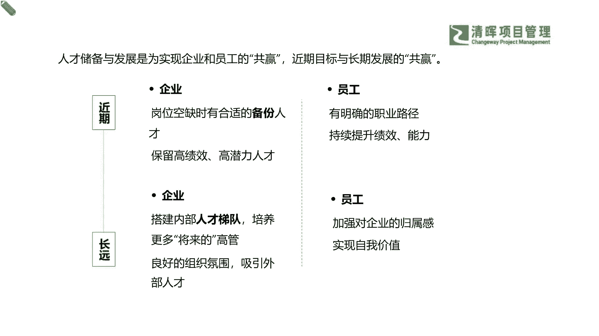

# 项目经理晋升4要素--训练营12讲 - P8：8.制定职业发展目标 - 清晖Amy - BV15Ps4epEYc

刚才我们其实也知道了啊，我们会有不同的级别，但是你个人发展的目标和，未来岗位的发展的标准，他其实还是会非常非常取决于，你自己个人的觉悟的早晚，以及你对自己的规划是什么，也就是说你永远啊。

除非这个人他已经这个运气已经好到不能再好，但是我们不能把我们的什么，不能把我们的这个职业成功，甚至我们的人生成功寄托在运气上是吧，啊运气这个事情他不太靠谱是吧，他可能也需要一些累积。

但是我们完全可以去做，尽最大程度的一个努力是什么，就是我们要认定目标，咬定青山不放松，是不是，所以可能看到这样的一个部分的时候啊，我们能够去了解到，如果你能够越早呢能够把你自己的目标定清楚。

你能够越早去储备你达到目标的那个能力，你才能越早的成功，这就是越早就是缩短你的周期，是不是咳，检测同学说这个运气也是实力的一部分啊，是吧，没错啊，但是大家都知道这个这个韵。

那既然提到这个很有意思的问题啊，咱们就来唠一唠，大家知道这个运气由什么组成，哼哼我们有很多的同学一直说啊，他运气就比我好啊，他就是能去能去这个怎么怎么样啊，但是可能我们在这里讲了。

这个韵到底是什么东西啊，啊我们大家有有读过几本国学的这个书啊，那我们这个同学说实力能力啊，运气是啥啊，实力能力没错啊，但是这个实力能力就是你的扎扎实实的东西啊，运气是啥，我们我们用那个专业词来啊。

学过PMP的同学，运气是啥，第一个这是不是一个什么风险概率呀，啊，我们用一些西方的这个结构化思维，来解决国学的疑问是吧啊，我们也不讲那些特别道可道非常道的，它其实就是一个风险概率是不是对吗。

呵呵既然说有人运气好，有人运气不好，这就是一个概率分布的问题是吧，那也就是说有可能有一部分就是好运，有可能比如说有人中彩票，有人不中彩票，这就是个概率问题是吧，承认啊，这是个风险概率问题好。

第二个运气还是什么运气还是啥，我们之前跟大家讲过啊，什么好人一生平安是吧，什么意思，就是你的一个什么行为和你的哎呦，我这个鼠标不好控制啊，这个大家来听我讲，知道我讲什么就行了啊，行为加上你的心态。

加上你的EQ，就是情绪啊，情绪能力，这就是你的运气，什么意思，你做了些什么，俗话说善有善报，恶有恶报是吧，不是不报时候未到是吧，也就是说你自己本身做了些什么，这就是种瓜得瓜，种豆得豆。

你今天学了就没有白学的东西，没有白走的路啊，同志们，你不要说啊，我之前做了哪些事感觉没有用啊，他一定在哪里是有用的啊，没有白走的一步，因为我们每一天都在成长啊，就像孩子在每一天都在长大。

我们每一天都在往这个资深的路上在变啊，都在变化，所以你的行为很重要，第二个你的心态很重要，心态是什么，心态是啥，一说到心态的时候，我们其实就讲到了一些什么，你的什么个人的自控能力。

也就是说你自己本身是不是能够经历一些，好或不好的这样的一个情况，而不被什么不被带偏了，说白一点就是今天如果即便你遇到了不好，运气不好的时候，你也能够什么坦然接受，你势必什么。

就像这个走入低谷和上到这个高峰之后，你可能本身的这个心态啊，处变不惊是吧，没有什么太大的一个这个起伏，你能够镇定自若淡然的时候，这也是一种很好的管理是吧，那么EQ就更不用讲了，我之前告诉过大家。

这是情绪能力是吧，情绪能力，那么我们在这里啊给大家总结了这两个点，但是我们如果用这个叫什么，用这个啊比较这个这个专业一点的，我们一口气把这个运气解释一下的话，它其实就是在这种什么在我们的这个运行啊。

生命和项目和我们的经验，职场发展的运行轨迹当中啊，随机性很强，概率很小，但是又不可控的一些部分，但是恰恰又能对未来产生一些什么影响和结果，的一些事件，这个叫运气，大家在听这个解释的时候。

你觉得跟什么很像，在我们讲PMP的时候，我们有一个什么多半来自于外部的不可控的，有可能会带来好或不好影响，那个叫啥事业环境因素是吧，EF运气就这么个东西啊，他就是事业环境因素是吧。

其实就是就是事业环境因素啊，EEEF啊，就是我们的事业环境因素，就是你不可控的周围客观的一些规律，会对你带来一些好或不好影响的是吧，所以可能在这样的一个情况之下，你完全去靠大环境行不行，其实也行。

就让我们讲的，你完全靠运气，也有人运气真的好，就是他就是站在风口上，甚至他有有这个踩对了，做了做对了选择，他就是可能一路就什么飙升起来了，是不是啊，所以但是这个EEF它还是时刻在什么变化的。

所以你在这种不可控的情况之下，你能够把你的运气变好的前提，你就去要去对什么风险做一个什么应对是吧，既然他是风险，那就要应对啊，你就要去规划呀，所以这就是我们做职业发展这个规划的，一个底层的目的。

就是为了把你的风险概率给它降到最低，成功的概率提到最高是吧啊，好那么知道了这样的一种情况，我们再接着来看啊，我们在这样的一个发展路径当中呢。

其实就能够了解到，我们在整个的一个学习过程当中，你看看啊，其实分不同的行业，刚才以i it，咱们现在以供应链一样，你要学习的东西还真的是不少啊。

所以可能在这样的一个学习当中，我们就会不断的去在A加B的这个循环当中，去看到你自己的一个个人的认定，然后再回到你的年度的一个这个什么指标上，你到底有没有去达成，然后你在今年之内还有一些迭代的指标。

可以去进行这样的一个发展和持续的跟踪，一直到最终再回到你的一个年度的一个交付，也就是说我们之前有很多同学也在问，这个严老师和我们很多的这个啊，我们的一些清辉的资深讲师啊。

其实我们看到清辉有很多老师非常厉害啊，其实怎么个厉害法啊，大家都可以看到我们有很多的专家，他们虽然也已经在某一领域是做了很多研究了，但是他依然在持续学习什么意思，就比如说在这个职业的双通道上。

基本上人均啊每年还在去进行，至少考那么一到两个证，甚至还有更多的这个资质证明的这么一个路上，什么意思呢，其实进步永无止境，大家会知道永远知识知识都在迭代的啊，知识绝对不是这个啊，这个我们现在学的。

就像我们可能学了9年义务制教育，也知道啊，学这些东西还远远不够，我们还要去了解，现在就是像现在高考为什么考新题型，因为是时代变了嘛是吧，你不能总是考那几个，就是这个这个原来的这个老老课文是吧。

但是你要去结合现在实际的一些情况，所以我们必须要打通自己的这个认知，与时俱进，你才能更加的缩短周期和达到晋升自己，和提升自己价值的一个目标。

那么在定目标的这个过程当中啊，严老师就不过多的赘述了，为什么刚才逻辑告诉大家了，你必须去先搞清楚你最需要发展的那个前三大，前五大的能力是什么，并且把它去定出来一个量化的标准。

你需要多久去达成什么样的一个目标，这个非常关键啊，你必须得有目标，必须要去聚焦，你如果没有这样一个清晰目标，没有去聚焦，就会影响你的一个什么速度，就像我们之前讲啊，特别有很多同学在呃，严老师在线下沙龙。

讲那个职业职业发展规划和职压发展的时候，有同学就说了，说啊这个严老师我其实对我未来没有什么想法，但是我总觉得现在只要是不断的努力就行了啊，在我本职岗位上兢兢业业啊，我只要不断努力就行了。

但实际上这个点啊我一再一再的强调给大家，其实也是想返回到这个底层逻辑，再去重申一次，没有目标的努力，都是向那个什么把眼睛蒙起来，拉着磨盘，那个旋转的那个什么驴一样，是吧啊，你没有目标，你其实就是有可能。

你所有的努力都是在原地打转，甚至我们可能你工作了30年，你发现什么，你自己个人的一个能力，还是仅仅在你的一亩三分地上，并没有什么额外的一个什么增值的，双通道的价值。

甚至你都没有跟上公司与时俱进的这个节奏，那你觉得你会已被晋升吗，甚至可能我们再讲的残忍一点，现在有很多公司，不仅啊可能对于人才的筛选非非常苛刻，还有什么，还有就是特别特别会去提到了，我们的一个什么啊。

我们的本身的一个这种，个人的一个能力的一个定位，你是不是能够去意识到你自己在原地打转，甚至跑在公司的这个节奏的前面，去提前获得一些机会是吧，这也是非常考验你个人思维意识的呀。

啊所以可能看到这个部分的时候，大家一定要遵循这个去定定目标啊，还是那句话啊，大家不要执迷于那个那个格式，有很多同学就说啊，那个老师我这个能不能去把那个格式给我一下，让我去往里面填一填，我们所有的格式。

你只要稍微去搜一搜都有啊，尤其现在AI时代，哪有没有拿不到的信息是吧，信息是爆炸的啊，但是缺的是什么，你必须得去做呀是吧，你自己得去沉淀，你得去做，你得有人的思考是吧，你不能依赖这个框架，让你填什么。

你就填什么是吧，你要思考一下，你把你的需要执行的这个能力列出来了，那么你怎么样去评价它才是最量化的，那你什么样的时间点对你是可行，并且又能去争取你自己成功的一些这种先机的。

这只有你自己思考才行啊，所以可能在这样的一个过程当中，我们就必须啊，可能借鉴hr的这些发展的一些目标，的一个方法逻辑，你可以给自己再定一定是吧啊，就是我们刚才所提到的，其实二十十的原则，你把它分一分嘛。

就是我们该借外力的借外力，我们自己主动争取的就是主动争取，让我们自己该去沉淀和什么自己自我复盘，并且不断给自己重重新迭代目标的，我们就要自己定期去做呀是吧，你自己就要在你的日历上。

在你的所有的这个这个职业的周期上，就要去把这些事情，作为你必须要去做的一个事情，放进你自己的一个目标里面，这样才是一个什么健康和什么有运气啊，有好运循环的一个体系是吧，那么在这样的一个过程里面呢。

我们其实就能够看到你自己本身，你做了这样的一个目标，升级的时候，你不断的给自己打个分儿哈哈，你这个月度目标达成了没，比如说闫老师就给自己，这个月就定了一个目标啊，啊我要去考这个PMO啊，在全球最新啊。

公布的一个这个我们的一个叫这个项目的一个，这个管理办公室的一个最新的一个，CP标准的这么一个这个师资认证考试啊，杨老师就给自己这个第一批啊，我就勇往直前啊，这个先去抓住这个这个机会啊，也给自己定个目标。

然后这个这个月呢，我要通过一个这个体系化的学习，并且总结出自己的一个这个这个输出的一个，这么一个课件啊，给自己一个总结，并且通过这个PMI的一个，整个全球的一个这个专业啊，种子选手啊。

种子这个资师资认证的这么一个考试，因为人不多，因为他的这个体系化还在建，所以呢啊，我也会去总结自己的一些这样的一个体系，把它文字化，把它图表化，把它可视化下来，作为自己的一些交付成果。

所以可能你必须量化的去定这个，你才能自己去评价是吗，如果你只是泛泛而谈，说我要去一个星期读一本书，读书是目的吗，同志们，就像我们很多同学一直在参加严老师读书会呃，这个有很多跟下来将近4年的同学啊。

其实已经非常知道，我从来不给大家一个书单的啊，为什么不给书单，因为没有什么太大价值啊，什么意思，就我可以给你一个100多本书的是吧，还有特别好，当然可能该去推荐那么一两本，我会讲一讲。

但是我不太会给那个12345678，一直数到特别多的一个书单，为什么读书不是目的，读每一本书你get到什么，你能够去变成多少自己东西，那个才是真正的目的是吧，也就是说我并不是为了去跟别人比。

他一年读30本，我一年读20本啊，他就比我强，或者我一年要突破50本或者怎么样，这个没什么，你要是囫囵吞枣的话，其实读50本也没有什么太大作用啊，所以可能在这个当中，我们就要去找到一个可以去量化。

并且切实的一些角度，来去衡量自己的一个这个交付成果。

那么同时呢我们也要意识到，如果你不能够，如果你不能够去给自己一个体系化的一个，这样的一个计划和规划的话，其实你会发现啊，你永远是被这个什么外部环境和内在组织，在裹挟着走的啊。

就是我们通常讲的那句话就是什么啊，你就这个这个在职场当中，这个发展发展着发展着，你就变成自己最不喜欢的那种人了，是不是，嗯其实可能这个所谓的最不喜欢，就是因为你欠缺规划呀，啊你就不得不去为了适应环境。

你做一些应激的反应的时候，那你有可能就会发现哎，我怎么变成我原来最瞧不上的一些，这种职场人了，是不是，但是可能在这个过程当中，我们自己本身也是需要去有一个，明确的自我认知，从内部到外部，一定要有规划。

一定要了解hr的逻辑，也一定要了解自己个人的一些长短板啊，擅长于用我们的一些这种工具啊，同时要了解组织是吧。

那么在这样的一个互相共赢啊，了解你的组织的文化，了解你组织的一些这种价值，组织趋势的情况之下，你才能更好的踩上正确的赛道，这才是选择比努力重要，就是你不能盲目的去选是吧，除非是什么。

除非我们在讲的有很多，这种非常非常具有一定的自我，这种什么极致价值的什么意思，就是我不管今天这个事情他认不认可，我就要坚持下去，一直坚持到他能够被大众所认可去成功啊，这样的人呐有没有有，当然有啦。

比如说乔布斯是吧，但是有几个乔布斯啊啊是吧，也就是说其实大部分的职场人，你没有办法，可能一下子就能找到一个非常非常，你认为很有潜力，或者一定要坚持，即便再多人反对，再多人，这个有一些这种不同的想法。

你都能坚持做下去，这些东西其实大部分的成员啊，咱们都是普通的职场人是吧，咱们就讲咱们切实的事儿，如果你本身这个具备这样的一些兴趣和天赋，甚至你有一些你自己个人的一些这种，价值的一个清晰的认定。

你想去这个fight一下，想去去赌一赌啊，想去去拼一拼，这也未尝不可，但是我们讲的大部分的咱们的职场人啊，咱们还是要去踏踏上正确的赛道比较关键啊，也就是说你可能本身你的行业，就像我们讲的一句话。

其实并不是并不是你不成功，而是什么时代淘汰了这样的一个什么行业而已，是吧，就是有些时候这个淘汰你的不是你的竞争对手，而是这个时代是吧，所以可能看到这样的一个东西，就是你必须要去从近期到长远。

从你的内部组织到外部环境条件，都具有这样的一个多赢的认知，你才能去进一步的腐烂。

