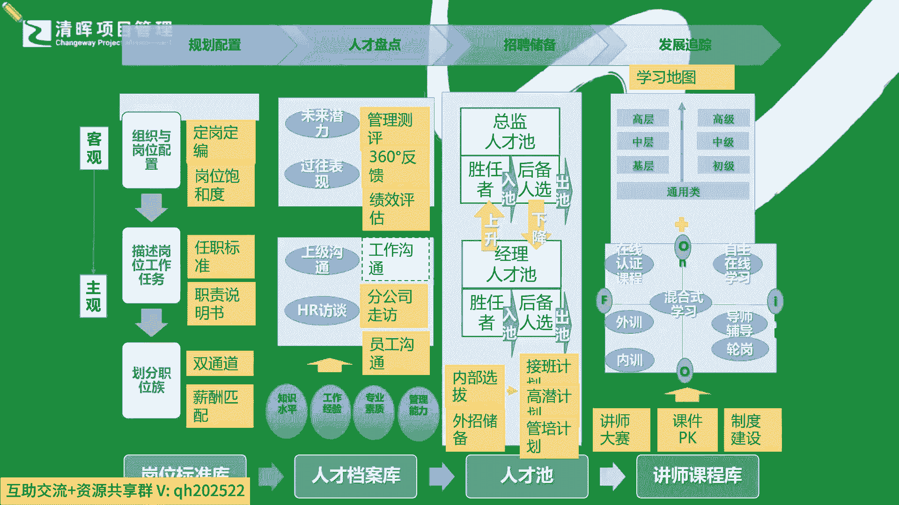

# 项目经理晋升4要素--训练营12讲 - P9：9.PM晋升作战地图 - 清晖Amy - BV15Ps4epEYc

个晋升。

那么从而呢可能我们就能够有一个更加全面的。

这么一个这个作战地图了啊，也许这个可能我不知道，这个压缩之后可能有一些看不太清楚。

但基本上能看清楚啊，就是你的这个客观到主观。

我们怎么样从你的一些这个本职岗位的一个，基本的一个信息标准，到你的一个综合测评。

知己知彼，直到你的一个什么，自己对自己个人认知的一个这种刷新。

储备和发展所达到你的一个最终目的。

也就是说所有的人员的一个晋升和发展，上台阶的过程，都必须经过规划复盘。

你的个人的一个什么这种啊这个计划的落地。

不断的学习。

然后最终实践当中才能去被啊这个看到，或者是体现出更多的一个价值点，那其实这个部分呢也是对我们最大的一个考验。

就是我们太多的同学啊，一般来讲啊。

大家是知道要学的啊，我们很多同学非常棒啊，就是知道要努力。

但是我们就处于一种假努力的状态哈，这个讲的有点扎心是吧啊，但是讲的什么叫假努力，假努力，就是觉得我只要每天还是。

比如说这节课我也来听了是吧，但是真正会学习的同学怎么听课。

我其实跟大家在讲的同时，我自己也在去旁边放一个小的便签本。

我把一些要点我也自己在记，在给大家画的同时，我自己也在记，那大家在听的同时呢，你是不是在去take1些notes呢。

哈我们之前讲啊，这个人脑是最不可靠的一个东西。

你听完之后基本上很快就能忘记了，为什么信息太多了是吧。

有太多的干扰了，所以我们在课堂上学习也好，我们在听一些课程也好啊，至少啊严老师都会随身。

不管是带着电脑还是带着笔记本啊，我都会去做一些简单的笔记啊。

当然不打扰我听的情况之下，我会做一些笔记，那么可能在某一些复盘当中。

我会再去想起来一些要点，那这种其实很关键啊，为什么你要去消化一下，就像今天不停的给大家嘴里面喂东西。

给大家脑子里面去塞这种底层逻辑。

你再去听明白了，当时听这个哦，是这个意思。

我也我也非常认可啊，或者是我我我理解了，但是你的理解也许只是暂时的哈，也就是说可能在整体的实践过程当中。

你能不能想起来去用它啊，或者你想起来以什么方法来去做它。

这其实还是要不断的学而时习之，就是你要那个实习啊。

各位同学啊，我这里讲到这个这句话的时候，我也要提醒大家一句啊，大家肯定在中学小学学论语都学过这句话了。

学而时习之是吧。

不亦乐乎是吧，那其实这个实习是什么意思。

之前老师教我们这个实习，都是已经让你复习是吧，你要复习了啊，这个学习完之后你就复习，这不是让你很高兴的一件事情吗。

不是哈，大家这样子来翻译的时候，你会觉得是什么，我去复习这个东西。

怎么会让我高兴了是吧，其实真正的那个那个翻译啊。

真正它本身的意思啊，你在看论语的时候，你注意一下它本身的意思，不是简简单单一个复习的意思，它是指什么，习是指习作实践。

就是你学到的东西要拿去用。

你会觉得很有趣很有意思，是这个意思啊，所以可能你要知道。

孔子他本身也并没有那么这个方法论啊，他不他是非常落地的一个人，他讲的就是你要学了，听了的东西你就拿去用啊。

学习转化能力最快的人才是才是什么啊，最最强的是吧好。

