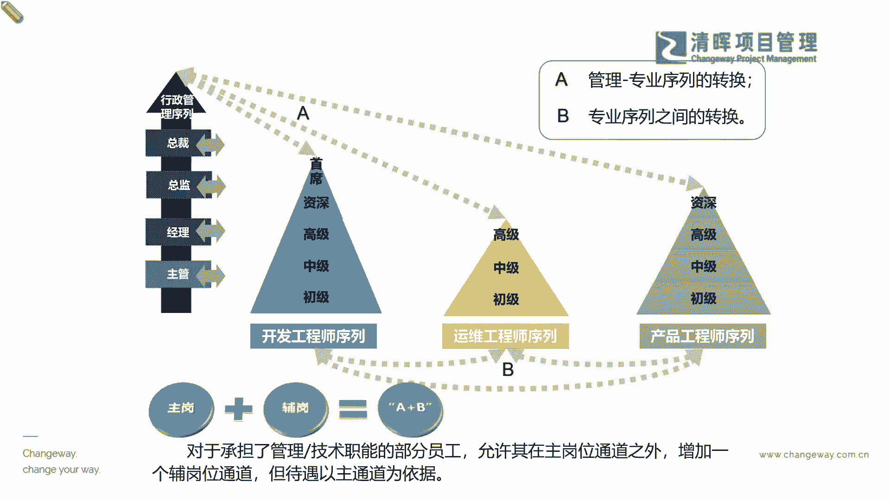

# 项目经理晋升4要素--训练营12讲 - P1：1.项目经理晋升4要素 - 清晖Amy - BV15Ps4epEYc

接着往下来看啊。

那既然我们要去培养这种综合的能力，那我们就可以知道我们自己本身的学历家，加上我们的一个什么必要的，工作年限的一个锤炼，也就是说，今天我们仅仅是拥有了一个很高的学历，其实它并不能代表你等于能力是吧。

学历不等于能力啊，那我们从另外一个角度，什么叫做能力呢，能力是等于你的学学业的历程加上工作年限，加上你的一些什么个人成长啊，个人成长这个才叫你的一个什么能力啊能力，但是学历啊，我这里讲的有点像绕口令了。

请注意跟上啊，学历第一个是你的学习历程的这个力啊，历史的力学历他既然看不出一个人的能力，那他能看出啥来，他只能看出来一个东西啊，叫什么，另外一个学历是吧，啥就是你学习的能力啊是吧。

会学习也是一个非常重要的能力啊，同志们，也就是说今天大家既然都已经要去放假了啊，咱们还还在周末，抽出两个小时的时间来去听听课啊，把自己的认知边界尽可能再拓一拓，这就是一种非常强的学习能力。

学习能力并不一定要去挤出来很大块的时间，要去上大课，那个才叫会学习是吧，所以我们在整体的这个过程当中啊，我们已经能够去看到的一些，那这样的一个啊过程当中，我们就知道了啊，咱们自己怎么样啊。

能够在这样的一个过程当中去，补足自己这个方面的一个综合素质呢，其实就是你基本的学历，工作年限，加上你个人的一些这种发展是吧，然后这是你的基本条件，那你就在不断的去锤炼你的leadership嘛。

这个核心素质说白一点啊，说白一点就是我们的一个什么，就是你的领导力的不断的一个什么提升啊，那么我们能够看到这样的一个啊，这样的一个过程的时候，我们就知道了我们自己的领导力其实要怎么样。

你领导力会不会无缘无故自己来提升啊，哈哈我们之前有很多说啊，你就是不断的努力工作，你可能工作个10年你就有领导力了啊，之前我真的有听学员去说过这个话啊，我当时也挺震惊的。

我其实当时第一时间也跟这个学员做了一些，交流和探讨啊，我告诉他啊，领导力这个东西不会无缘无故长出来的，除非我们讲了，干什么事情都有天赋，是不是你跟那些有天赋的人去比，那没得比。

是不是大部分的人是普通人啊，我们都是普通人，那其实在这样的一个啊情况之下呢，我们其实能够去看到的，就是我们能够去了解到的，我们的领导力其实是越早学越好，越早学越好，你才能去什么跑过人家的认知周期啊。

同志们，所以你不要以为啊这个你变老了，你就有经验了，老和有经验没有直接的关系啊，老和有经验没有直接的关系，所以我们这样讲的啊，我们少年才出英雄啊，也就是说很多情况之下，我们不一定是要看年资。

来断定他是不是一个人才的是吧，而且现在大家也都深刻的体会到，我们现在越来越敏捷的这个项目时代，我们越来越趋向于这种什么年轻化，为什么，因为我们迭代速度快呀，你如果倚老卖老的那个速度。

倚老卖老这种态度太多的话，其实我们也会成为一个瓶颈，对不对，所以我们更多的是希望大家都有成长型思维，是不是啊，所以我们一定要早学这个领导力leadership是吧，那你怎么去早学呢啊。

比较smart比较聪明的咱们的同学啊，就像今天在线的几百位同学啊，我相信并不一定所有的同学现在都是工作10年，8年甚至更久的一些同学，有些同学非常的年轻，那你们选择了清辉的这个平台，其实就是一方面啊。

你可以去通过咱们这些老师的这种小微课程啊，跟大家带来一些刷新的一些理念和一些关键点，那么除此以外，如果你接触到了，你知道了，你开始要在这个真正的能力上去做晋升的时候，你一样能够在我们平台上去找到。

非常适配的一些课程，把它金砖下去，比如说PMP，比如说PBA甚至NPDP产品管理等等，你还可以去把它击穿下去，在我们所有的综合管理的这种培训当中，leadership都是首当其冲的是吧好。

那么在这样的一个情况之下，就leadership是早学，那在这样的一个早学的情况之下，你还得干嘛，早恋是吧，哈哈这个练啊练习的练啊，也就是说你要早学早实践，才能早转化成为你自己个人的东西啊。

因为学的东西总归都是一个认知方面的，先跑步，但是你落地能力是一定要你去拿，那你学到的东西去做的啊，你在做和碰撞的过程当中才能去看到哪些东西，也许啊可能理论需要更新啦，或者哪些部分。

你自己还有你自己的一个额外的一个，什么价值和沉淀收获是吧，所以你一定要早去练，什么意思，就是我们刚才所讲的有很多的一些这个成员啊，咱们的团队成员，虽然你在短期之内不能因为你的年龄，因为你的年资。

你在短期之内，也许还不能快速晋升到你一个某一个层级，但是你争取啊，你自己个人争取去换岗啊，轮岗，甚至去参与多元化的一些项目，这其实都是在干嘛，积攒你的项目经验，这是在早练习，这个太重要了。

所以积极主动性多么重要，积极主动就是leadership，又是一个非常核心的点，所以所以这个就是一个底层逻辑啊是吧，看起来大家好像都认识字，但是你真正理解了吗，我们讲的不是知道了啊。

刚才已经说过知道和理解之间的这个差别了，那你理解了吗，你理解了之后，我们又讲了第三个，你用了吗是吧，这不就串起来了是吧，你如果没有用，其实这个还是一个悬在半空当中的东西是吧。

好那么我们随着我们不断的一个练习和沉淀，项目经验的累积，我们就会越来越发现什么，我们自己在能力转化当中真正的bug在哪里，学历一次性的，因为你大学毕业，硕士毕业，博士毕业就就那个学历了是吧。

你后期可以什么专升本，本升硕或者硕升博，那是那是你线性的东西是吧，但是真正能够去一年工作年限，也动不了手脚了是吧，一年一年随着你的这个这个工作，那他就会累积起来，真正能够去增加和赋能。

你能力提升的就是啥，就是你个人能力这方面就是你的专业能力，他又回到你的专业技能上的一个提升，这就闭环了，听懂了吗啊各位同学啊，所以我们其实即便今天，我把这个简单的模型放给你，你能理解里面这个底层逻辑吗。

你理解了，你做了没是吧，甚至我们现在有很多这样的一个，在项目当中累积，你已经发现你明显的一些什么短板了，明显的一些bug了，比如说我们现在有很多同学，你在做项目管理的时候，你会发现。

为什么老板一直在让你做可行性报告啊，我举个简单例子啊，跟上节奏啊，我举个简单例子，如果你老板就会问你说，你到底选A还是选B还是选C，那如果你又犯了，刚开始我放的那个什么几句坑的那个画错误。

说老板我没有参加早期项目评估，我不知道这里面的一些这个价值的，完蛋了，又又踩雷了，是不是啊，那我们其实要应该要怎么去讲，其实你现在就要去返回到你的专业能力这里，你要去反思，你要补充什么。

那其实如果你的老板一直在问你，说A方案型还是B方案型还是C方案型，这典型是什么，这就是商业分析的内容啊，你就得考完PMP，你就再学一个PBA，你就把这事搞定了是吧，也就是说你在整个的商业分析当中。

你就会知道啊，我到底是哪一个方案，它更具备经济可行性，并且还能去逐步把我的收益落实等等啊。

所以这也是我们的一个闭环的动作。