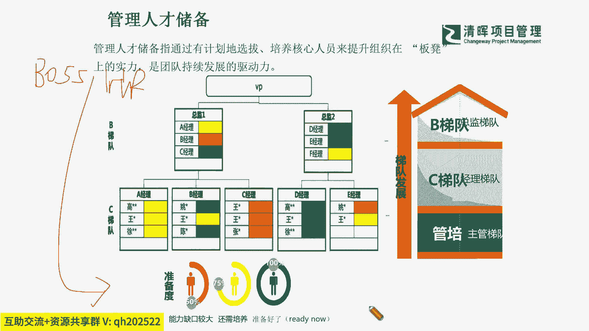
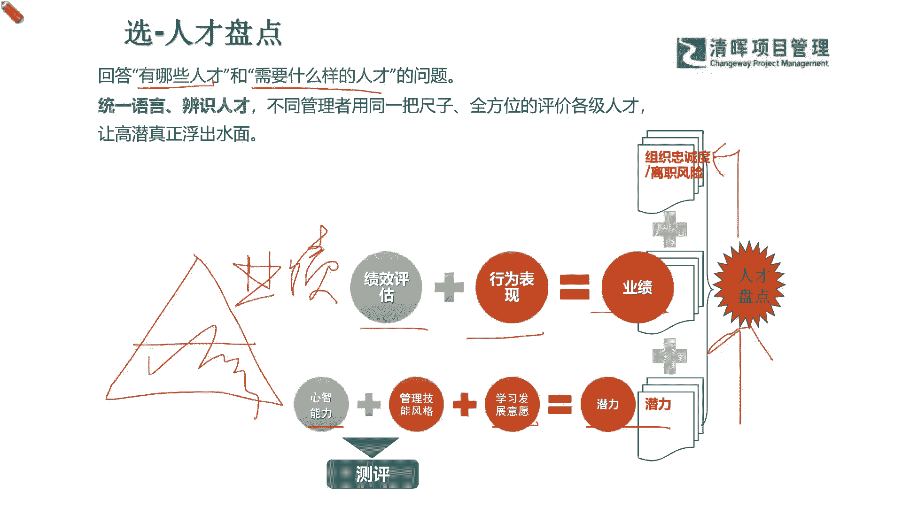

# 项目经理晋升4要素--训练营12讲 - P10：10.管理人才储备 - 清晖Amy - BV15Ps4epEYc

部分的时候我们就知道，我们其实整个的一个这个组织当中的，管理人才的一个储备，他其实就遵循这样的一个什么原则呀，他就看你的readiness啊，所以你即便有可能现在还没有被晋升。

但是你可能已经在什么准备度比较高的，一个人群里面，你其实还是可以有机会，加速你的一个什么成长的一个步骤的是吧，那么如果你的准备度还欠佳，其实这个向谁来了解啊，第一个向你的什么直属主管多去了解。

他是不是能够给你啊，一个清晰的一个这种，你的人才储备的一个什么级别是吧，另外跟谁了解啊，就是跟你的hr了解他的标准是吧，你知不知道你自己是处于哪个人才池子里呢，啊一个是boss，一个hr抓住这两个啊。

一定要去多交流，多搞清楚是吧，多搞清楚你就知道你自己是处在哪个梯队了，那你在哪个梯队，你目前你就是自知之明嘛，你就要对自己有一些分门别类的，一些这种不同能力的一个规划和认知。

你才能一步一步去实现你的一个什么这种跃迁。

那么在这样的一个过程当中，就知道我们其实在人才选拔的时候，hr人才选拔和你的老板进行一个晋升，选拔的时候，他其实就是最基本的逻辑，就是发现你到底我的团队当中有哪些人才呃，我现在需要什么样的人才。

才能去把这个项目做得更成功，就这两点没有什么特别的一个原因啊，那么啊我们去知道这样的一个部分的时候，我们就知道，可能在我们的这个底层的这种潜力上啊，我们刚才也说了，你个人的心智，你的管理能力。

这就属于你可以去通过早期一些测评是吧，能去自我测一测，然后你的个人的发展意愿就是你的self motivation，你愿不愿意去成长性思维是吧，你愿不愿意这个与时俱进，同时还要跑在前面。

想在前面规划在前面，这个就很关键，从你的潜力上再去加上，你能展现出来，这个我们就讲像冰山原则一样，这个潜力就是在这个水面以下的，就是冰山水面以下看不见的那部分，这是你自己可以通过你的不断的一个。

自我的一个一个发展，然后你自我测评自我的一个IDP是吧，能够去发展你这部分的潜力，那么露出水面的部分是啥嘞，就是你所看到的这个业绩了是吧，你自己的这个绩效达成的如何，你个人岗位的这个KPI如何。

你表现出来的这个大家是否团队领导力，这个行为这个准则，然后你到底是不是能够拿到非常好的一个成绩，一个实际的啊，这个我们显性或隐性的一些这种交付成果是吧，那么有了这个业绩之后呢。

你就会再一次被什么组织所什么政审，哈哈就是开始政审了，就是让这个组织来去再辨识一下，你是否具备这样一个长期可持续发展的，这么一个能力，他们才会去把你放在那个什么高管的位置上，因为我们通常都讲了高管。

我们的这个企业都是一个什么都是一笔资产，人才是资产，是不是，所以我们都是希望能够去什么，尽可能要留住的这么一部分的人啊，所以我们有了这样的一个过程。

