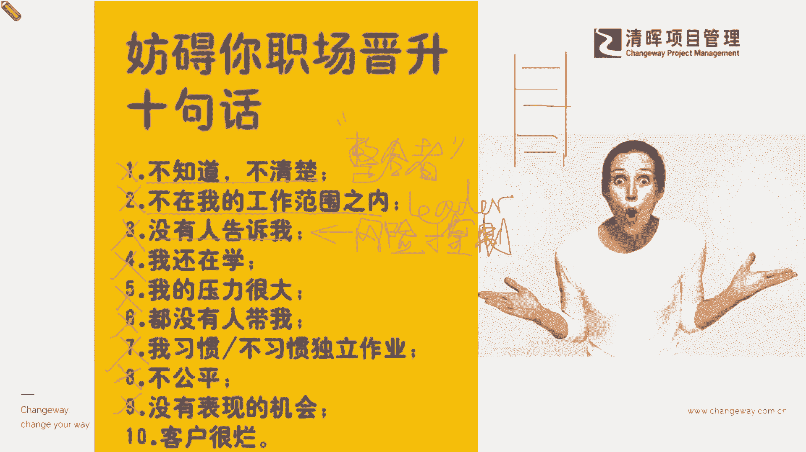
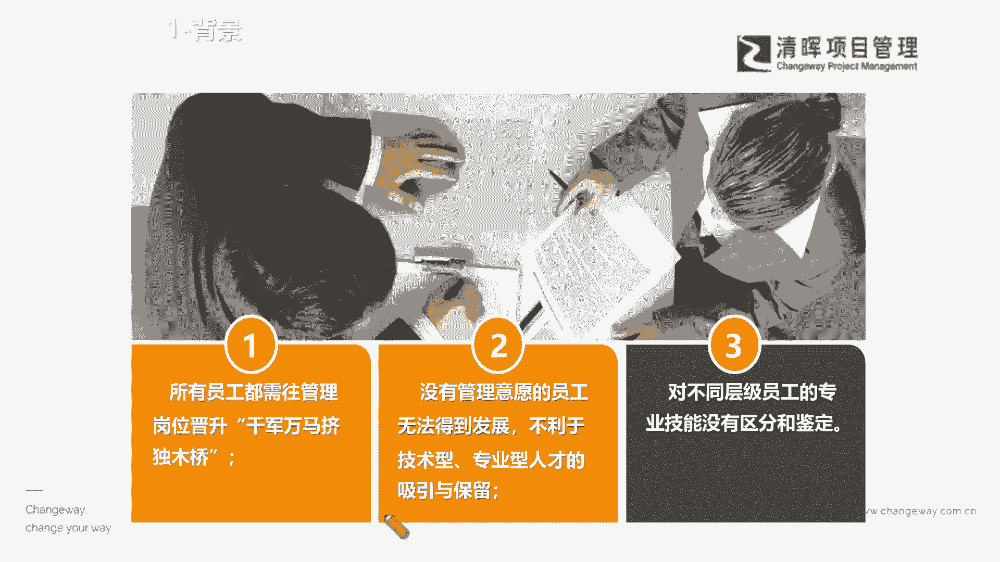
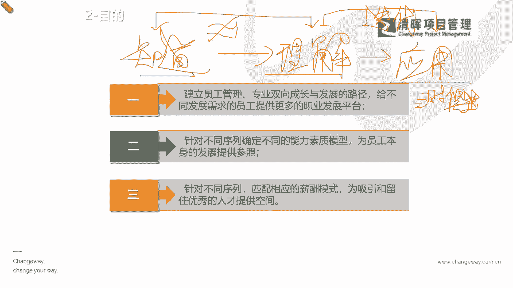

# 项目经理晋升4要素--训练营12讲 - P3：3.妨碍你职场晋升十句话 - 清晖Amy - BV15Ps4epEYc

在职场上犯了很多这种啊，踩下去就是一个惊天大坑的这么一些错误什么，比如说啊，我们哪些职场晋升绝对不能去犯的错误，我们一般啊，如果但凡你在职场当中去犯过那么一两个，或者是踩过那么几个雷区。

其实也会延缓你的这个什么晋升的周期是吧，我们举几个比较典型的例子啊，当然我们情况和这样的场景还是很多元的，但是我们举几个例子，比如说领导来问你，话说你这个昨天发出去给客户这个报告啊。

为什么客户反馈回来说，你里面的技术细节不够完整呢，啊老板来直接问你了，你的boss来问你了，那么你回你要怎么去回答你的boss来啊，你要怎么去回答你的leader，难道你说哎呦。

这个技术细节是由某某某这个研发团队的peter，提供的啊，这个我不清楚，我不知道啊，还是得问peter好，你这么一句话其实就怎么样啦，哈哈给你自己埋了一个雷了啊，为什么为什么大家来细品啊，你品一品。

你仔细品这句话错在哪，第一个我不知道，不清楚项目经理最主要的一个任务是什么，大家在学PMP的时候，我们知道项目经理的那个六个角色是吧，有六六个六个圆圈是吧，画了他六个角色。

在他脑脑瓜上面的一个角色叫什么，整合者，还记得吗，啊我相信咱们今天听课，大部分应该都是咱们社区的会员吧，还有一些咱们的新同学是吧啊，我们学过PMP的同学，你一定要记得，项目经理就像一个什么交通枢纽一样。

你是所有项目信息的一个整合者，一个领导者，你作为领导者，作为项目的这个leader，你是不能够去回答，你不知道你的项目当中发生了什么，这是一个极其不专业的回复是吧，也就是说今天如果你去医院看病啊。

你问你的这个医生了是吧啊医生说好，你回去就吃这个药啊，这个去一个比较普遍的一个这么一个，这个这个病情，那么你就继续去问你的这个医生啊，你说到底是什么病啊，我有什么样的一些呃。

这个这个可以去参考的一些症状，我自己在家也能去自检一下是吧，或者有什么样的一些更好的一个，这个自我的一个这个康复的一些措施，我也去在家多注意一下是吧，那么这个时候你的医生说啊，你不需要知道啊。

这个其实也有点模糊，但是我们见得多了，也就知道怎么治了，它甚至连病情都不能给你准确的讲出来，就直接给你开了药了是吧啊，对于这样的情况，你会对他有多少信任呢，啊，我相信大家都会有一致的。

这样的一个什么评价了，因为我们其实一模一样，你作为leader来讲，你肯定要对你自己的一亩三分地要非常了解，非常熟悉是吧，那么作为医生，你就要对对症下药，就是最基本的一个什么职业操守。

如果你连病情都不知道，你怎么可以什么模糊的去下药呢，这不是很这个违反这个什么啊，专业度的这么一种做法嘛是吧，所以千万不敢说这个话，那么还有什么not in my scope啊，不在我的工作范围之内。

请注意啊，如果你是一个leader，leader是干嘛的，你英文词的这个leader跟一个词很像，就是我们那个爬阶梯是吧，爬的那个梯叫ladder是吧，一级一级往上爬。

其实leader是更加形象的一个什么，这样的一个角色，就是你带着团队一级一级往上爬，也就是说如果你今天告诉啊，这个你的boss说，你不清楚这个为什么这个功能有一些问题，你说这个不是我的人工作范围啊。

你得去问RD，那么你的这个boss就会感觉到你什么，你没有在什么做整体的一个组织，你没有在了解你的团队做什么，甚至你没有在带领你的团队再去解决，在同一个方向上，你可能遇到的种种的一些这种问题。

并且达成一致是吧，所以这是一个leader非常忌讳，所以你要讲了这句话，你的boss第一时间就会感觉到，你不是一个什么特别领导力很强的这么一种种，这个这个呃种子选手是吧。

这因为这是一个非常非常明显的一个，领导力偏弱的一种表现了是吧，那么还有什么像比如说我就不一一去讲了，比如说没有人告诉我啊是吧，你让谁告诉你呢，因为你是整合者啊，你是整合者，这里面就有一个非常明确的讲啊。

没有人告诉我本质在后面体现了什么，就是风险不能不能控制，大家都学过pp里面风险控制第11章的内容，我们特别在咱们的绿皮书讲义上有一句话，请大家都画下来是吧，那啥意思啊，也就是说你的项目经理的能力。

其实一方面是在排计划上面，另一方面就是在风险控制和落地上面，也就是说如果你不能很好的去控制项目的风险，不能很好地去应对风险啊，你指望别人来告诉你怎么做啊，别人来告诉你这个怎么处理。

这其实也是一个什么非常欠缺和有问题的，这么一种什么情况，所以这也许是你能力上的一个瓶颈是吧，好那么我们还看还有什么啊，我不知道怎么弄，我还在学呢，哎我压力太大，你别别太问我了。

我然后也一开始来的时候也没有个师傅来带我，我很多东西我也不清楚的，边做边学的，我之前都没有自己独立去做过这个报告啊，可能就是言下之意是什么啊，我出现一些错误，你就应该接受是吧，还有一些什么呢。

就是所有的这个压力都在我这儿了，但然后我在很短时间赶出来的这个东西，还没仔细看呢，就觉得你对他不公平了是吧，甚至可能还有一些什么，我们就是就是在执行端，然后我也不知道为什么有这个项目。

为什么要加这个功能，其实这个功能非常非常难实现，而且给我的资源呢，给到项目团队的资源又是非常有限的等等是吧，你就会若干的一些抱怨，一些这种不经意间的透露出来的，一些这种这种说法，是不是就可能害了你啊。

其实是非常非常鲜明的一点啊，人说的这个病从口入，祸从口出啊，一点都不假啊，所以还是给大家第一个建议啊，除了刚才跟大家讲的这个底层逻辑是吧，我们要缩短这个周期，不是恐惧这个付出。

而是我们要缩短这个周期的方式，方法要对，那么另外就是要管住我们的什么情绪啊，情绪为什么我们不是讲只管住嘴啊，嘴是由谁支配的，当然是我们的大脑支配的，大脑是由什么支配，有你的emotion是吧。

有你的emotion，有你的理性逻辑，有你的感性逻辑，所以我们一定要去什么，管住你的逻辑，管住你的一个情绪，就是我们所通常所讲的EQ是吧，好啊，各位同学好，看到这个韩军同学也上线了啊。

大家如果有什么你们的问题，也可以随时剖出来啊，咱们一起聊一聊啊，那么在这个情况之下，我们就来看看啊，提到职场晋升的时候，那我们所有的一些团队的员工啊，团队成员我们都想要去什么不断往上升，没人不想生的啊。

没人不想升职加薪，所有人都想去升升职加薪，但是能让所有人都升职加薪起来吗，啊这也是一个非常实在的话题啊，不可能是吧，不可能把每个人都升起来是吧，也不可能给每个人都加一模一样的。

这个薪资一定是有会会有倾向的，一定也只会生一小部分人，那嗯更多的一些员工，也许我们其实看到的就是什么，我们没办法快速的啊，像我们如我们所愿的去晋升，那么在这个过程当中呢，我们其实就需要去看看啊。

到底怎么样的一种方式，方法，才能够，协助我们在这个晋升的这个周期和体系上，能够学到一些要义啊，帮助我们知道和管理啊，我们首先来去搞清楚啊，大家知道一些知识，大家去知道一些知识和要去理解好，我来凡是啊。

这个听长期听严老师课的这个小微课程的同学，应该知道啊，我不完全照本宣科，我会讲底层逻辑啊，所以大家还是要跟上这个节奏，我相信大家都充分明白，只有底层逻辑非常清晰的人，才是万变不离其宗的啊。

我们不要被那些什么太多的信息，爆炸式的信息搞混淆了是吧，好，那第一个知道，第二个理解，第第三个呢我们叫应用好，我来问大家一个很简单的问题，知道和理解一不一样，知道和理解一不一样呵，可能字面意思上来讲。

大家认为这两个词可以化约等于吗，还是可以，基本上是一样啊，一不一样啊，我相信大家去看字面和你自己平时的这个，职场上的一些经验来讲，大家一定不可能去画一个什么约等于，而是什么。

中间还得画一个什么slash，是不是画一个斜杠，不等于是吧啊，景色的同学说知道只是片面不一样，没错啊，其实知道和理解他完全是不相等的，什么意思，我举个例子啊，比如说比如说啊大家之前都会呃这个讲啊。

我学过这个生物，我学过地理是吧，我知道啊，我知道这个呃外面这只鸟呢啊，看起来它应该是一只什么啊，这个这个呃我们的这个叫什么，就是我们的一个啊雀类啊，就一个雀类的鸟，因为它这个叫声比较响亮。

而且这个体型啊比较小，然后等等啊，你说啊我知道它是一个雀类的，这叫知道我知道它是只鸟儿是吧，但是理解是什么意思，就是你能够说出来它叫什么，什么什么什么什么金丝，什么什么什么什么黄雀是吧。

那它属于什么什么什么纲目啊，他的生活习性是什么，长期居住于啊栖息于什么样的一些地带，他的饮食习惯，以及它的整个的繁殖体系是怎么样，那这样的情况之下，你能够去再追根溯源。

不断往下去把他拉出来一个体系的时候，这个就是什么，这是理解，就是你不仅仅知道它是一只鸟是吧，它还是一只什么什么什么什么样的一个鸟啊，当然鸟类是非常庞大的一个概念，而是你在大的一个概念之下。

你能够把它细化深入到一个体系，你当你去判定，你对这个事情是知道还是理解的时候，请记住杨老师一句话，啊啊你们也许是需要去自己实践一下，你更能加深啊，你只要先记住这句话，你来判断你自己对某一方面的知识。

到底是知道还是理解的话，你只需要去了解一个评判标准就行了，就是什么你能不能说出他的一个什么体系，也就是说如果你仅仅是知道，你肯定是不知道，说不出来它里面有什么样的一些体系的，但是如果你理解了。

你就能说出来，比如说如果没学过项目，这个呃，管理这个专业人士认证的，PMP认证的这个这个同学呢，他会说啊，项目管理就是什么，要去把这个项目要管好，要交付了，然后他可能也知道要达到一定的满意度是吧。

他可能就这就叫知道他，这这已经是他能够说出来的很多的要点了是吧，但是理解的这个同学就是你能够说出来，什么十大知识领域，五大过程组，甚至现在你还可以说出来敏捷的一些理念，甚至还可以说出来我们的一些什么。

绩效欲和原则，是不是啊，所以这叫理解，你必须能说出它的体系对吗好，那我们清楚了这个部分就知道，这是知道到理解之间的鸿沟，那么理解到应用呢，那更不用说了啊，理解和应用中间的鸿沟在哪儿啊。

他肯定不是等于的是吧，你即便你已经非常熟悉体系了，就像我们讲的，你学到博士博士后了，但是你没有去通过实践，没有通过这个具体的一些这种案例来去应用它，不断去有一些这种复盘，不断在现实当中面临新的问题。

不断去更新你的知识体系的时候，你有可能会发生什么，我们的理解的体系会什么，out of da就落伍五了，也就是说在现在这个这个情形之下，其实举个例子啊，举个例子啊，也许并不那么恰当，但是真实存在的。

大家现在观察啊，我们的这个学校啊，我们公立学校和我们的国际学校啊，我们就举一个简单的例子，一般国际学校如果你不是双轨制的啊，如果家里有小朋友的，你可能多少有些了解国际学校就是学IP啊啊，学这个IB啊。

或者学AP啊啊等等这种不同的体系，那么我们的公立学校呢就是9年义务制是吧，我们的人教我们的这个各个不同的版本的教材，我们就是非常体系化，123年级学什么，后面我6789年级学什么是吧，那这是一个体系。

它有体系，但是你会发现，国际学校他们并没有完全成型的一些教材，什么意思，你会发现他上课他只给你发一些这种叫hand out，就是一些最新的一些案例，最新的一些材料，最新学者前言所研究出来的一些体系。

它不是很早就印出来，甚至我们不是大家学了几年啊，这个还是都是人教版的那版教材是吧，不并不是这样子，所以这是一个什么什么概念呢，也就说其实我们的理解也需要与时俱进的，也就是说应用最大的一个挑战。

就是那个周期就是要与时俱进，如果你不能去做到实时迭代，你的一个什么知识体系，你就不能叫做理解，也就是说今天啊我们其实有很多的这个同学，考PMP考的比较早的啊，我们在最早有第四版，第五版的时候。

P m p，那现在我们已经到第七版了，是不是啊，那么其实即便你以前有过一些基础，你考过这个第第四版，第五版，你对实物矩阵有过一些基础，但是你如果现在不再去深入学习到第七版的。

这样的一个敏捷的和这种价值的这种思维的话，其实你还是有可能会什么理解不了，为什么现在这么强调项目的价值，为什么这么强调这个项目，经济时代的一个这种综合多元的，一个什么这种产业价值是吧。

所以我们的理解和应用中间的鸿沟呢，就是你的体系的迭代啊，就是我们讲的你必须与时俱进啊，我们不能因为啊我是90年代的北大毕业生啊，你现在就觉得过了30年了，然后我还是非常牛，并不一定啊。

所以你就一定要给自己一个什么更新，迭代的一个过程，所以咱们今天讲这个体系呢，其实公司也一样，他决定要不要晋升你是吧，或者我们自己在评价自己，具不具备这个晋升的这个资格的时候。

其实也就是匹配这些底层逻辑啊是吧，各位伙伴们一样的，就是公司挑我们和我们双向来对自己。

有一些这种自评的时候，也是在看这个东西好。