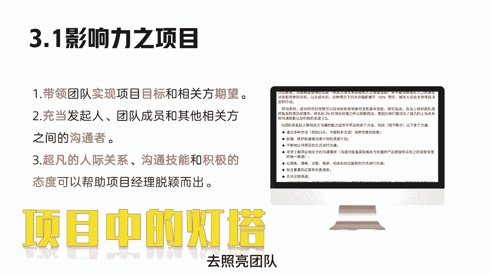
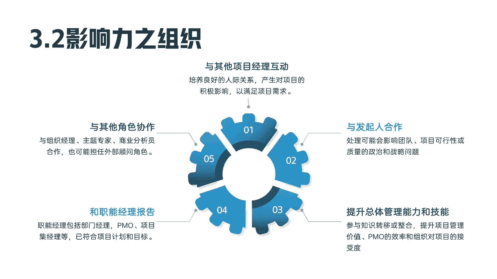
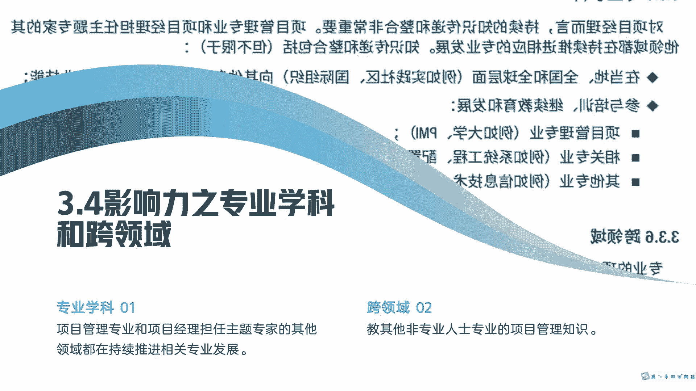

# 项目经理角色上-PMP系列第10讲 - P1 - 之之喂知知 - BV1VS4EeiEwz

各位老板好，今天开始我们项目经理角色的第一讲，我是吱吱V吱吱，先来看一下我们大家比较稍微熟悉点的角色，乐队指挥，乐队指挥我们经常可以在电视上看到哦，他拿着指挥棒指挥交响乐团演奏。

项目经理我们会把它类比为乐队指挥，是因为他们都需要掌握许多团队技能，去带领团队得到好的结果，项目经理需要对项目结果负责，乐队指挥需要对音乐会结果负责，乐队指挥不需要精通某种乐器。

但需要具备音乐知识理解和经验，项目经理无需承担每个角色。

但是也需要具备项目管理的知识，技术知识理解和经验，再来看一下项目经理在项目中的地位，我习惯于把项目经理比喻为项目中的孤勇者，是因为项目经理在项目中，通常以个人的形式存在，项目经理不同于职能经理。

职能经理他可能只需专注于某个领域，或者业务部门的管理监督就行，项目经理他和运营经理也不一样，运营经理他只需保证业务高效运行，项目经理他通常是以个人的形式，引导团队实现项目目标，从左边这张图我们可以看到。

项目经理他是属于金字塔的最底层，但是他需要去影响比他职位和级别高的，各干系人，来看一下项目经理在项目中的影响，书上为我们列了列了三点，第一，项目经理需要带领团队，实现项目目标和相关方期望。

第二项目经理充当发起人，团队成员和其他相关方之间的沟通者，三超凡的人际关系，沟通技能和积极的态度，是项目经理脱颖而出的关键，我个人更习惯将项目经理比喻为项目中的灯塔，他需要去鼓舞团队，去照亮团队。

为项目目标而奋斗，再来看一下项目经理对组织的影响，项目经理他需要去与其他项目经理频繁互动，培养出良好的人际关系，在关键时刻满足对项目的需求，是因为我们项目经理通常会和其他项目经理，有资源竞争。

这样良好的人际关系会帮我们解决很多问题，第二项目经理需要与发起人合作去处理，可能会影响团队的项目，可行性或者质量的政治问题，战略问题，项目经理他需要提升总体管理能力和技能，他需要去参与知识转移或整合。

提升项目管理价值，提升PMO效率，提升组织对项目的接受度，项目经理他还需要去和其他职能部门经理汇报，这里的职能部门经理，包括部门经理，Pmo，项目引进等，他报告的内容，使他们相信。

项目满足项目计划和能实现项目目标。

项目经理还需要去和其他角色互动，比如说组织经理，主题专家，商业分析员，项目经理，很多时候还可能会担任外部顾问的角色，再来看一下项目经理对行业的影响，项目经理他需要去时刻关注行业发展趋势。

他需要去判别这些趋势是否对项目会产生，积极或者消极的影响，项目我心理他需要去关注行业标准，他需要去关注行业动态，他需要去关注市场空间，他需要去关注新技术，再给大家举两个例子。

项目经理为什么要关注行业标准，像我有个项目，我们都已经验收阶段了，然后行业标准发生了变化，这时候用户要求参考最新的行业标准，对项目交付内容做修改，必然这时候会对项目的精度产生影响，新技术。

比如说我们需要去关注，人工智能是否会提高我们的开发效率，提升我们的文档效率。

再来看一下项目经理，对专业学科和跨领域的影响，项目经理他对专业学科的影响，主要是项目经理需要去推动项目管理，相关学科的持续发展，项目经理对跨领域的影响，我们主要理解为项目经理。

他需要去帮助非专业项目管理人士，掌握基础的项目管理知识。

好了。