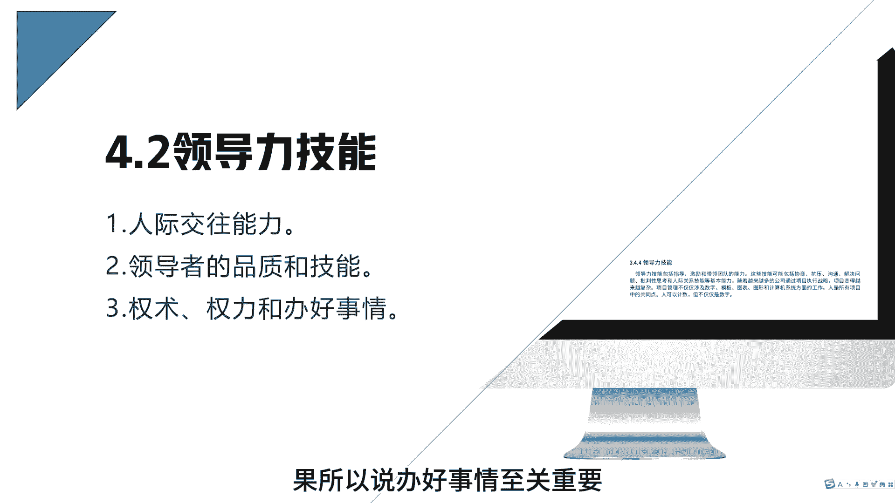
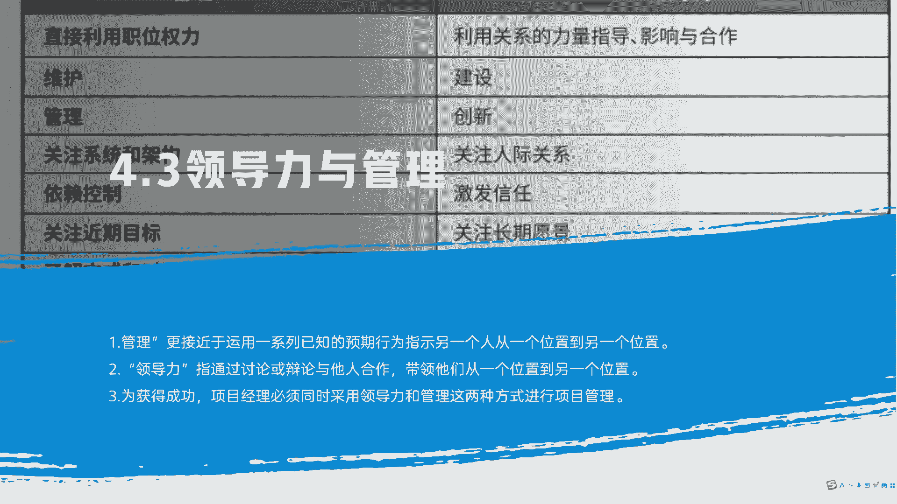
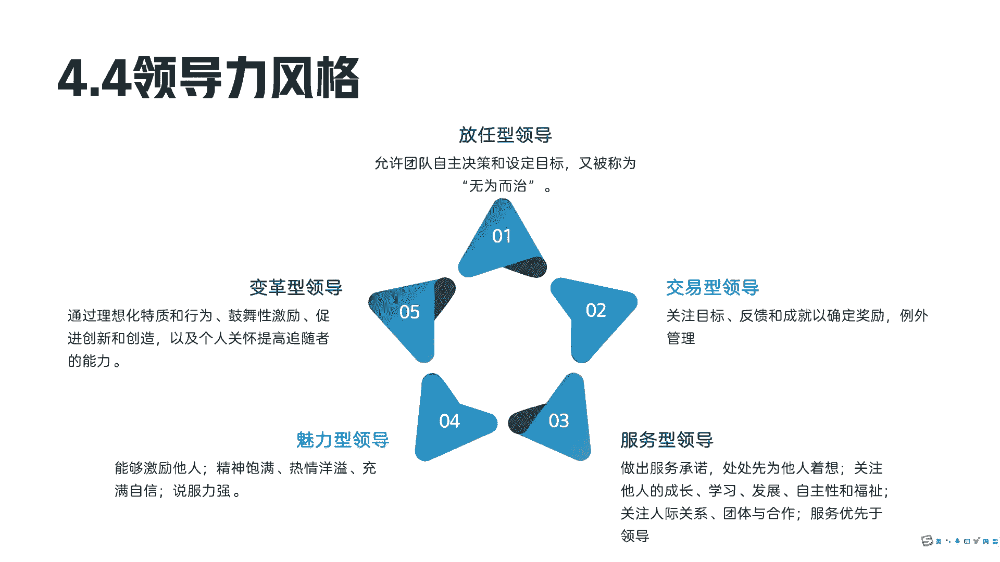
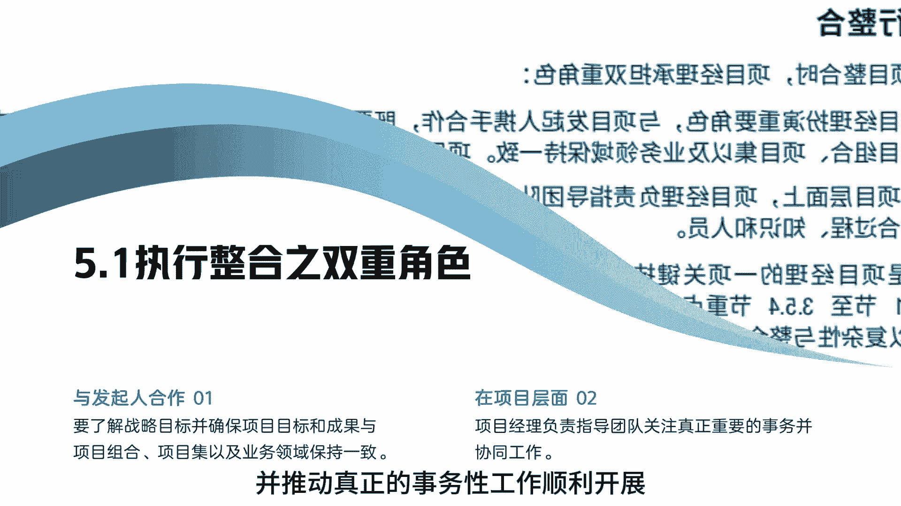
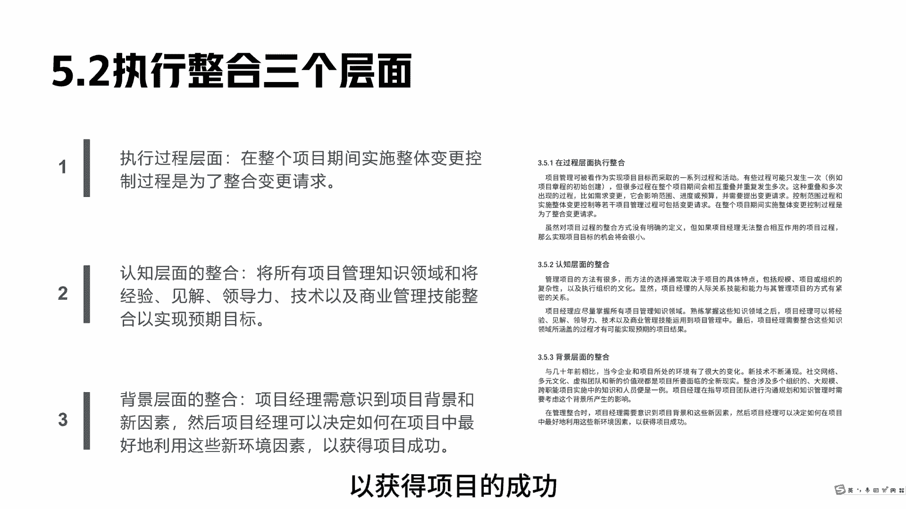
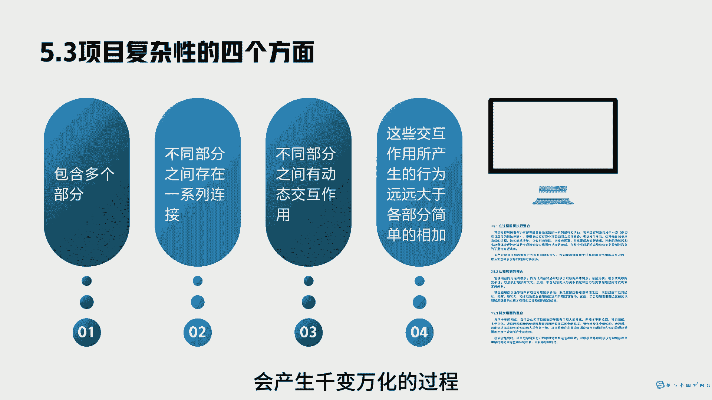

# 项目经理角色下-PMP系列第10讲 - P1 - 之之喂知知 - BV1qntAePEoe

各位老板好，今天继续我们项目经理角色，第二讲，我是孜孜魏芝芝，先来看一下人才三角，人才三角是指项目经理在项目执行过程中，需要具备三个能力，第一个能力是技术项目管理能力，项目经理在项目执行过程中。

需要去和相关方频繁沟通，这时候你就需要具备相应的业务知识，技术知识，这样你才能更好的去理解相关方的诉求，项目经理所需具备的第二个能力是领导力，是因为项目经理在执行项目过程中，通常都不是单兵作战。

他需要去和相关方去和项目团队进行沟通，这时候你就需要去指导激励你的项目团队，解决项目中遇到的问题，第三个，项目经理所需具备的能力是战略和管商务能力，是因为项目经理在执行项目过程中。

它通常需要去配合组织完成对应的战略目标，确去支持商务完成对应的商务工作，领导力技能丰富有三点，第一人际交往能力，这个很容易理解，项目经理他需要在项目内，项目外和不同的人打交道，80%的时间都是在沟通。

所以说良好的人际关系至关重要，第二项目经理需要具备领导者的品质和技能，这也很重要，项目经理他需要有很强的抗压能力，他需要有带领团队走出困境的能力，他需要有帮助团队的能力。

他需要有良好的沟通能力和解决问题的能力，第三项目经理他需要有办好事情的能力，这也很好理解，我们做项目，最终是为了给相关方交付一个各方满意的结果，所以说办好事情至关重要。

这也是项目经理，取得各方信任的一个很重要的一点，你看一下领导力与管理的区别，管理它更趋向于运用一系列已知的预期行为，只是一个人从一个位置到另一个位置，而领导力是指通过辩论或者讨论与他人的合作。

带领他们从一个位置到另另一个位置，而我们项目经理在项目管理过程中。

需要同时采用领导力和管理这两种方式，看下领导力风格的五种类型，第一种放任型，这种团队领导，他允许团队自己决策，自己设定目标，这有点像敏捷的是gay master啊，他这时候主要是通过无为而治而领导团队。

那这时候团队可能觉得你什么用没有，交易型领导关注目标，反馈成就，确定奖励，第三种服务型领导关注他人的成长，学习发展自主性和福祉，来提高团队赢协作，这时候他的理念主要是服务优于领导，第四种魅力型领导。

他通过激激情的演讲来激励他人，他说服力比较强，这种领导有点像马云老师啊，变革型领导，通过理想化特质与行为，鼓舞性激励，促进创新和创造以及个人关怀。

提高追随者的能力，项目经理的双重角色，第一种角色，他需要与发起人合作，项目经理需要与发起人合作，确保项目目标与组织目标一致，项目经理在项目层层面的角色，项目经理在项目层面的角色。

他需要负责指导和关爱团队，并推动真正的事务型工作顺利开展。

来看一下执行整合的三个层面，第一个层面在执行层面，我们在整个项目期间去实施整体变更请求控制，是为了整合变更请求，第二个在认知层面，我们将所有的项目管理知识经验见解，领导力技术与商业管理技能整合社会。

希望实现预期目标，第三个在背景层面整合，项目经理需意识到项目背景和新因素，然后项目经理可以决定如何在项目中，最好的利用这些新因素，以获得项目的成功。

最后我们看一下项目复杂性的四个方面，第一包项目包含多个部分，第二项目不同部分之间存在一系列的连接，第三不同部分之间动态交互，第四这些交互作用所产生的行为，远远大于简单的相加，所以说我们项目是很复杂的。

我们十个过程组相互叠加，会产生千变万化的过程。

