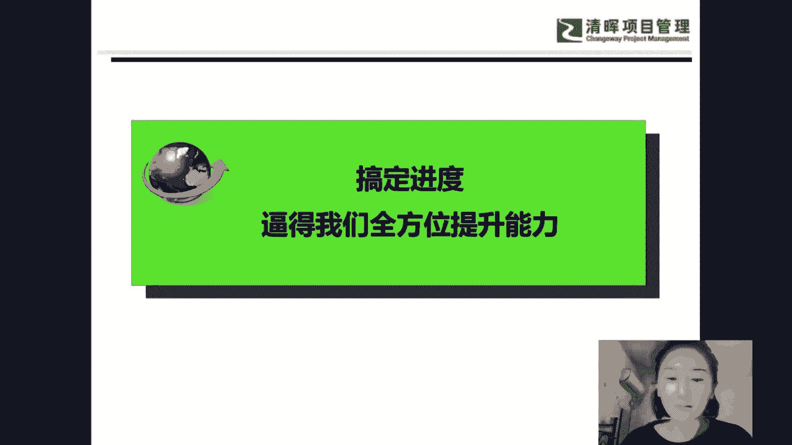
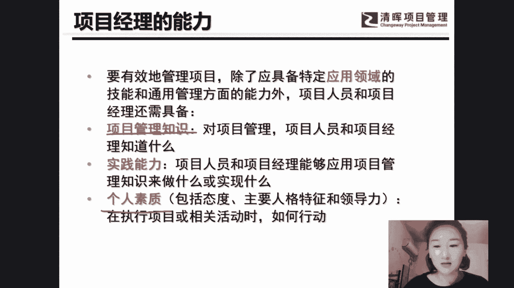
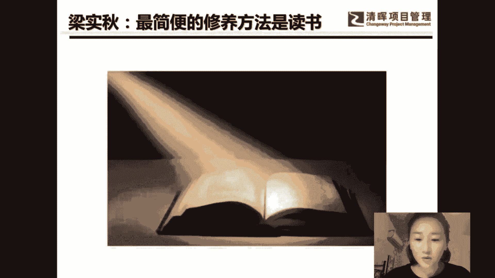
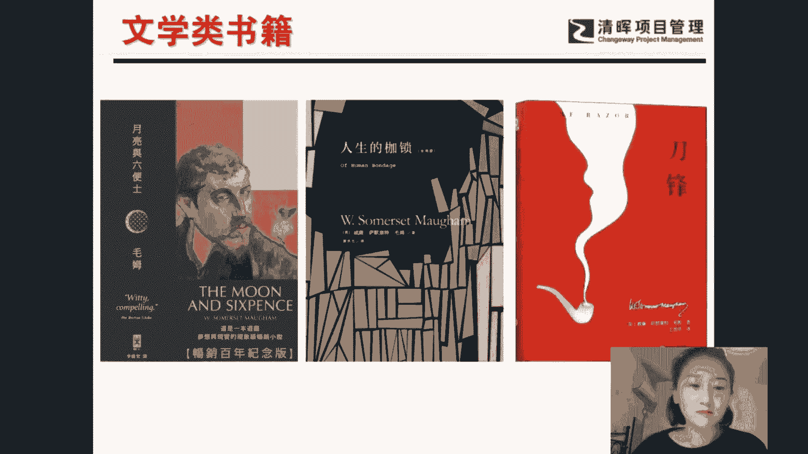
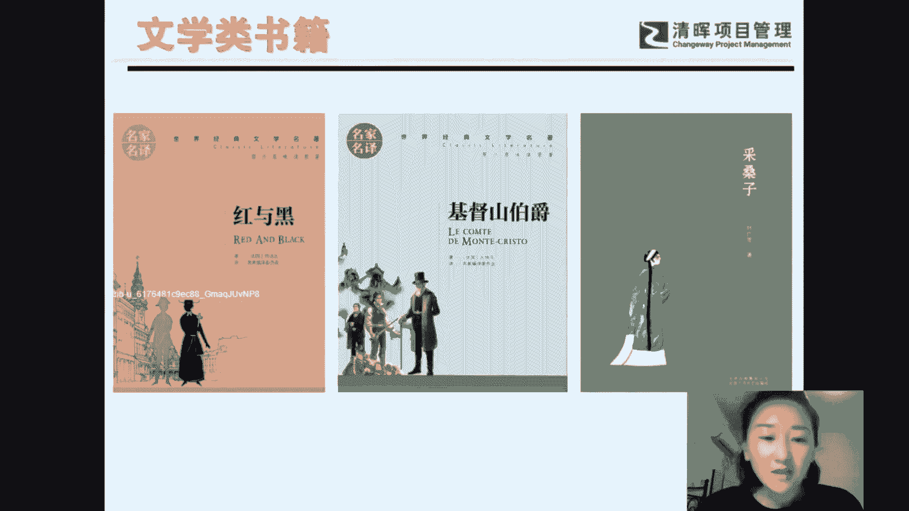
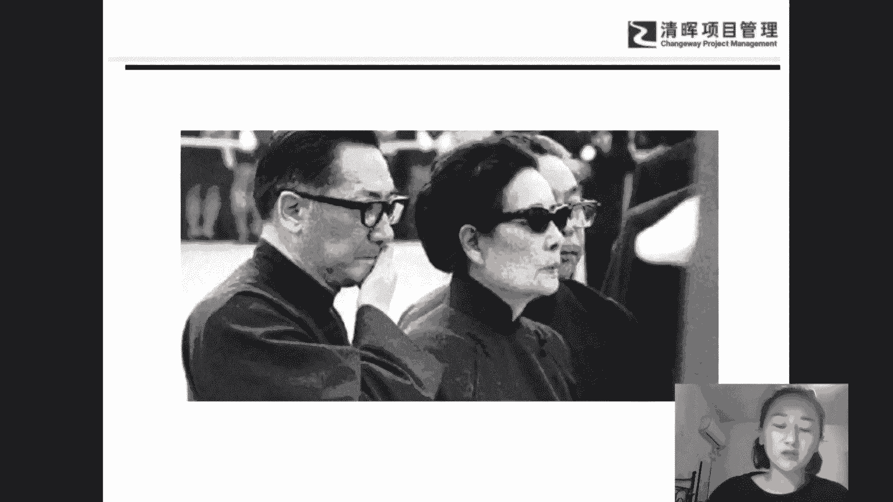
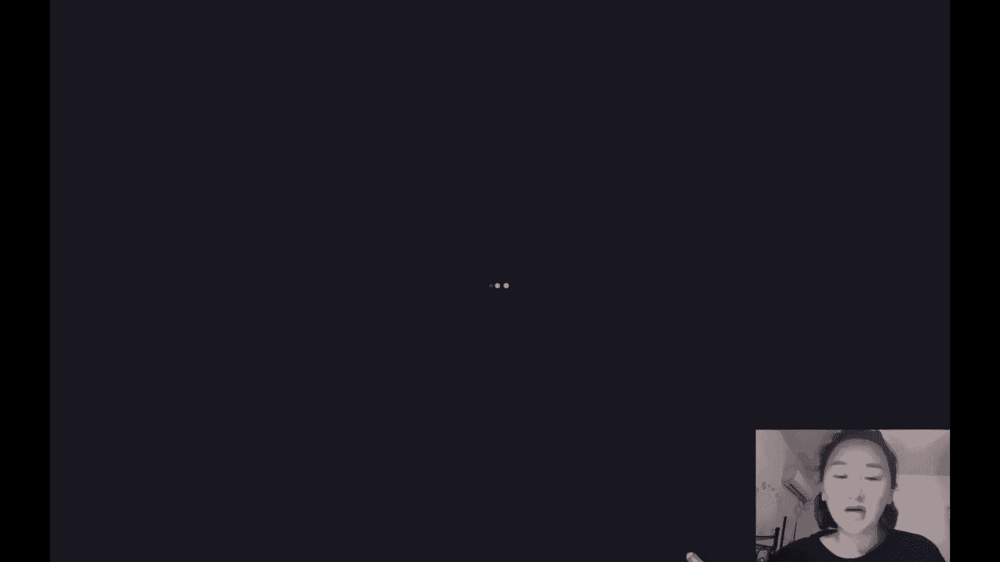
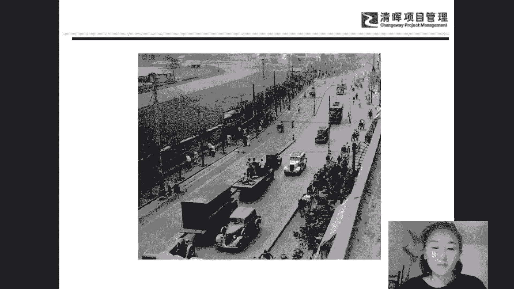
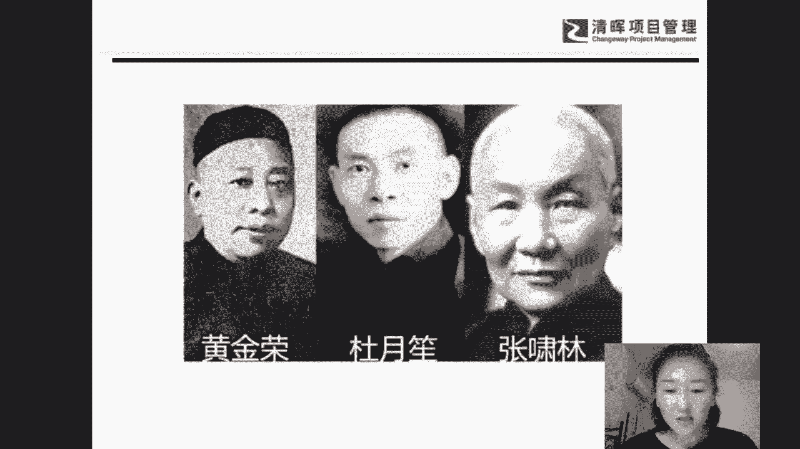

# 项目经理进阶过程：如何做好进度管理 - P3：项目经理如何全方位能力提升 - 清晖Amy - BV1kb421a7Fv

这里说的全方位能力的提升，其实也是整合的一种体现。

那么我们之前啊在偏僻的知识体系当中还讲过三重的制约。那么三重的制约是说什么呢？很简单，这个说的是动一条边其中至少一条会发生变化。也就是说你动范围可能会影响成本，那么动范围也可能会影响进度呀？

所以动任何一条边都有可能会影起进度的变更。所以动资源会影起变动，进资源，资源动进动呃动资源会影响进度，动风险会影响进度，也就是每个方面每个内容都有可能会影响进度。那么反过来说，如果进度发生了变化。

是不是也会引起其他方面的变化。所以进度很重要，它需要我们全方位能力。那么项目经理的技巧在哪呢？由于项目很难做，进度很难搞定项目经理才有价。是这也是职场上的一个规则，干的活不能太简单。如果干的活太简单了。

那么我们的职场可替代性也就太容易太多了吧。有件工作你能干，他能干，谁都能干。那么你怎么样提高自己的这个反脆弱性呢？所以我们干的活不能太简单啊，这样才能体现我们项目经理的一种价值。因此，我们在职场上。

项目经理有哪一些价值呢？比如说我们项目经理在职场上会有这些能力的一些约束，或者是说会有能力的一些要求。首先第一个是在我们呃工作当中所具备的项目管理的知识。你具备了多少项目管理的知识。

也就是我们所说的硬技巧。硬技巧是什么呢？硬技巧，比如说刚才我们讲的WBS的一种应用需求呃需求跟踪矩阵的一个应用。这种工具的应用啊，还有这个啊一些其他比如说甘特图啊，项目管理软件呢？

这些软件硬技巧的一些应用，你能不能运用这些模板，你能不能使用这些应技巧，使用这些软件，使用这些工具，就叫做硬技巧。那么第三个呢，我个人认为的是个人素质的一个提升，个人素质的一个提升。那么。

个人素质如何提升呢？个人素质如何提升呢？看微信看朋友圈能够提升吗？我个人感觉打游戏也没法提升，刷朋友圈也没法提升。不看微信，看整天看些微信或者是玩这个游戏都没法提升。那么个人素质的提升，最好的方法。

我个人感觉的应该是读书，读书是什么？也就是看一些杂书，这可以提升个人素质，为什么要看一些杂书呢？你看的书比较多了。那么你和客户的共同话题就容易多。比如说你们恰好喜欢某一个作家。

恰好喜欢啊某一个明星恰好都喜欢看某一部电影或者是恰好都喜欢某一个歌手，那么你看的内容多，你了解的东西多，与客户吹牛的谈资就越多啊，所以我觉得最有效的方法。

就是读书。那么我等会儿也会推荐一些，我们大家要读哪些书。

比方说文学类的一些书籍。呃，我觉得英国作家毛姆的一些书籍啊确实都值得我们去阅读。那么英国作家毛姆的书籍，我大概读过这么几本啊，我拿了几本比较经典的，你们看过吗？应该看过吧。啊打游戏当然可以了。

可是你和客户喜欢打的同一款游戏，你觉得这个概率会不会很高呢？应该很难吧。很少吧，你看的书越多，你了解的东西就多。客户所关心的，或者是客户领导喜欢的，你也知道，那你跟他的共同话题就多了呀。所以看书看杂书。

可以扩大自己的谈资，扩大自己了解的一些知识。啊，比方那我们就继续介绍啊一些我比较推荐大家看的书啊。第一本是毛姆最经典的一本书叫做月亮和六变士。他写了一本什么呢？

写的是一个原本在伦敦有一个非常这个事业稳定啊，家庭事业都非常稳定，事业有成的一个中年人。然后呢突点突然他有一天呢对这个艺术着了魔，特别沉迷于这个艺术。于是呢他就抛抛妻弃子。不管别人的眼光。

然后呢就去这个太平洋南太平洋的一个小岛上叫做大西提，也就是我们现在所说的大溪地来进行一个艺术的探讨。那可能在我们啊现实的生活当中，这个人肯定是个疯子，抛妻弃子什么都不要了，也就是我们现在所说的渣男。

什么都不要了。跑到一个小岛上面去画画。但是呢在这个艺术当中，我还是比较佩服他的。因为他可以抛弃原本的所有的安稳生活，真正寻求自己对理想对艺术的一种追求啊。所以毛姆描述了这样的一件事情。

他是以一个画家为原型，以个画家为原型，也就是保罗高根吧，为原型，写了这样的一本书啊，喜欢的同学可以去看一下。好，第二本呢叫做人性的枷锁。人性的枷锁也是毛姆的作品，有没有同学看过呀？

这本是毛姆的一个自传类的一个书籍，有同学看过吗？人性的枷锁。也翻译为人生的枷锁。啊，这边没有同学看过是吧？好，那我们就简单介绍一下，他说的是呃其实是保姆自身的一个成长啊，但是他构造了另外一个人啊。

他说有一个小男孩叫飞利浦，这个飞利浦呢怎么样从啊最早由一个性格自卑、自闭的一个小男孩，然后摆脱束缚你的各种枷锁成长成为一个对自自身特别自信而又追求自己理想，能够放弃身边所受到的束缚你的枷锁的一个过程。

比如说感情的枷锁，那么我们在现实生活当中也经常会出现这样的一些问题。有的人就比如说你是男生，有些女生呢，其实并不是很漂亮，也很普通，他也并不是很喜欢你，但你就是对他很着迷，哪怕你一次次的被耍弄。

你也心甘情愿。这种过程呢，你觉得自己很痛苦，但你就非常奇怪就。喜欢这种痛苦的过程。就有些人不喜欢你，又给你了一些痛苦，但你就很着迷这种痛苦。但有些人呢有些女生长得也挺漂亮，也很自信，还对你好。

可你就是不喜欢她有没有这种经历啊，就不管男生女生都有可能会这种经历吧。所以这个是毛姆在人性的枷锁当中所描述的情感的枷锁。也就是这个主人公一次次的经过成长，经过历练，经过啊感情上的这些痛苦和枷锁。

然后看看他如何能够及时止损。我们在PMP的知识体系当中讲过一个概念叫做沉默成本的。他的意思就是指。你要向前看，不要去总纠结那些已经付出的已经过去的。比如说你现在花100块钱买了一张电影票。

那么这个电影你一进去就发现特别无聊。然后呢，你就有两个决定了。第一个做法是掉头回家，就当做这个电影票是免费送给你的这100块钱没花掉头就走。第二个呢，为了这个100块钱，你继续赔两两个小时进去。

那么对于纯理性的角度应该是及时止损。这个叫沉默成本，就是不要去纠结那个已经花掉的钱。那么毛姆也是在说这个内容了，情感的枷锁也是需要及时止损的。那么每一个人可能都有一个这样的成长经历，何时及时止损。

你就摆脱了情感上的枷锁。那么毛姆也认为人有很多枷锁，除了情感上的，也有人性、性格方面的枷锁，也有你信仰方面的枷锁，也有你宗教或者是信信仰，也有你成长经历上的很多很多枷锁。那么这个他是一个自传体的小说。

就是写这个一个主人公叫飞利浦，就是他自己构造的。其实就是他毛姆自己的一个自身的一个成长经历。那么第三本书叫做刀锋。那么刀锋也是毛姆的一本小说啊，他是写了一个主人公，他是一个飞行员，叫做拉里。

拉里呢就呃在开飞机进进行这个好像是经过二战的时候吧。然后他的同伴他的一个好朋友为了救他牺牲了。他就觉得生命啊失去太容易了，太突然了，然后呢，他就进行了一个生命的探讨，他觉得人活着个意义到底是什么呢？

是不是每个人都要按照别人的想法去生活，这才算是每个人啊正常的一种轨道。然后拉里就经过了一些探索之后，就觉得人生的征征谛，应该不要按照别人的想法去生活，应该是按照自己的想法去生活。啊，这个就是刀锋。

刀锋就相当于是啊越过就是刀最最坚韧的地方嘛。如果你克服了这个最坚韧的地方，克服了最危险的地方。那么你就啊寻得了这个生活上的一个自由。所以这本书我也挺喜欢的。啊，这个是啊老姆的作品。

好，那么还有什么书的一些推荐呢？也可以是这个一些比如说文学名著类、世界名著类。那这几本书我也比较推荐大家。第一本叫做红与黑。红与黑很出名的，有同学看过吗？有同学看过吗？孔与黑。斯汤达的作品。

法国作家斯汤达。世界明珠应该都看过啊，可能你们不好意思说，是不是？那我就稍微说一下，其实红与黑我个人特别喜欢，为什么啊？首先他为什么叫红与黑呢？他这个红啊代表的是呃就是一个男人。他比如说一个男孩。

他要成长成为一个男人，他可能会在法国当代有两种选择。第一种是从军，就是你进入军队，从军就是穿上军装，像拿破仑一样，拿着这个宝剑去战斗，这个是红。那么黑呢就是黑色的这个教会的这个衣服就是黑色嘛。

所以教会是另外一条路。也就是你以后当神父去从事一些宗教的一些啊这个事业道路，所以叫红与黑啊，这个就是一个男男生成长成为一个男人必经的两条最好的路。啊他所以他描述的是有一个主人公，他是一个木匠的儿子。

他叫于莲，他长得特别帅，人也很聪明，可是呢出生很卑微，就由于他自己层层次比较低，就成级比较低。所以在家里也不受待见。他的老爸和他的哥哥都经常虐待他，所以他就觉得自己性格扭曲了。

一心想要啊借助自己的个人能力来飞黄腾达，跨上新的一个阶层，跨上上流社会。那么他就使用了自己的一些手段，因为他自己长得帅吧，这是最好的武器了，摊上了市长夫人。然后呢。

结果他和市长夫人两个人的情感呢就被暴露了，被人发现了，就被贬去了一个叫做呃法国的一个小镇啊，我忘了叫什么名字，去了一个神学院。结果在神学院呢，他又觉得比较无聊，然后呢，他又去了一个侯爵府，在侯爵府。

他又利用了自己的美貌。然后又攀上了侯爵的女儿。最后啊他和侯爵的女儿快要结婚的时候，这个前面的这个情人呢，就市长夫人嫉妒他俩的关系，就告发了这个余联。这个余莲一气之下就把这个市长夫人开了两枪。

那个时候在他这个阶层，如果向上流社会的人开枪，而且还是向市长夫人开枪，最后是被判死刑的。这件事情看上去是一个狗血的爱情剧，对吧？那么其实啊他当时是作为法国的一本禁书，那么这本书为什么写的好呢？

是因为它突破了前面的一些所有惯用的一些书籍的使用方法，使用手法，他运用了大段的心理描写，就语言对话很少，动作也很少，就是情景描写都很少。但是主人公的心理描写特别多。

所以这本书最好是好在他的心里描写非常多。他描述了这个人为什么这么想。就比如说他要去握这个市长夫人的手，他就一直想啊，我怎么应该握着他，他握着他了以后会想什么，我应该想什么，我应该怎么样应对。

那么市长夫人有了反应，就是比如说他抽出了手，或者是他愿意握手之后呢，他又会怎么想。所以他最出名的应该是大段大段的心理描写。Yeah。好。😊，呃，那么这本书最出名的是一个心理描写。

那么最后啊呃这个他被判了死刑啊，那这本书呢就是最后于莲被判了死刑，但是余莲他并没有呃去求这个上流社会，可怜他，让他活着。所以这本书写了两个内容。第一个内容。在法国，人是没法跨阶层的。

就是你原本出生是个平民。然后呢，你不可能变成上流社会的人，他努力了这么久，也没办法改变这样的一个事实。第二个。于莲临死之前没有向上流社会投降，也没去妥协，他宁愿去死，也不妥协。

他追求了理想和精神上的一个自由。所以这是红与辉写的一个好处。好，第二个呢呃是基督山伯爵。基督山伯爵也是一本是世界名著了，他说的是一个船长的助手爱德蒙汤泰斯，他为了送一份送一封信，遭到了两个人的陷害。

法官也陷害他，为了保住自己的这个帽子，陷害了他。于是呢这个汤泰斯就被打入了地牢。后来呢在这个牢里面认识了一个狱友。这个狱友啊是一个啊传是一个懂非常多知识的一个人啊，叫法利亚法利亚神府给他传授了很多知识。

然后呢，在临终之前把在这个一个基督山岛上的一个宝藏的秘密，告诉了他。然后呢，这个汤泰斯出了狱语后，就是出狱之后，就去这个基督山岛上面找到了这份宝藏。后来他找到了一份这宝藏之后，就成了一个巨富。

从此就化名叫做基督山伯爵。后来经过他好多年的一个精心策划，他最后报报答了恩人，然后惩戒了仇人。所以这个基督山伯爵，他就是为了写有恩报恩，有仇报仇的一个故事。所以这个是叫做金山伯爵。

那么有的同学还会说了啊，我可能对这个外国的一些小说不感兴趣，那么不感兴趣，没问题啊，你也可以看一些这个我们中国的一些小说，有一本小说写的挺好的，叫做采桑子。采桑子呢他的作者应该是叫叶广晴吧。

一个满族人哈，讲的是民国的后期，应该是民国，快民国了，满族贵胄后裔的一个生活。其实有点像那个大宅门，也有点像那个名著红楼梦。他说的是在大宅门当中，每个人的一些故事，每个人的一些性格特点。

所以他描述的是一个名门望族由呃最风光的时候变成最落魄的时候，每个人就大家子女的一些命运和历程，命运经历的一个过程。啊。好，那么还有一些这个书籍呢，比如说人物传记类的人物传记类的，我比较推荐两本。

一本是曾国藩的。另外一本是杜月笙的。这个杜月笙的呃，我是个人比较喜欢他的这个杜月笙这本书。那么杜月笙这本书呢呃其实啊啊他是多看看这个杜月笙的一个成长经历和杜月笙，由一个卖水果的一个卖梨的少年，卖梨的人。

然后成长成为上海青帮老大的一个过程。这个杜月笙情商特别高。那么就简单介绍一下他吧。

那么这个杜月笙呢？他其实最早是卖莱阳梨出生的，小时候啊爸妈都啊就爹娘啊基本上都去世了，只有养母。后来养母呢又也失踪了，所以只能靠他一个人孤苦伶仃的。后来卖莱阳梨传说啊他削梨的功夫啊特别好。

就是哎这个手右手拿刀，左手啊就直接转动这个梨，然后梨皮就厚薄均匀的整条就可以从这个梨上削下来，传说他很厉害。然后呢，他就觉得整天卖水果，好像没有什么，没有什么没有什么这个出血。

于是呢他就觉得自己应该就干点正事。后来呀他就进入了黄金荣的府邸，黄金荣嘛也是上海的三青帮三大亨之一，跟这个杜月笙齐名的。他其实最早的这个师粉叫做黄黄金荣。那么他就经人介绍，进入了这个黄金荣的府邸。啊。

最早只是干一些提携呀，帮他一些什么拎包的一些苦活累活。但是就觉得呀他自己在黄府应该好好干，不应该再这么整天呃游所游手好闲了。于是呢他就决定改掉恶习，吃喝嫖赌，样样都不沾了。

但是呢他发现这个黄金荣的府邸啊，并不是黄金荣说了算，而是另外一个女人说了算。

谁说了算呢？是黄金荣的老婆林桂生说了算，那么林桂生是谁呀？是上海的三大女流氓之一。他觉得既然黄金荣说了不算，那我就应该去看看老板娘怎么样能够帮助我能够提携我。所以杜月笙，他就想办法如何搞定这个老板娘。

那么怎么搞定老板娘呢？投其所好嘛，刚才我们就说了，有一天这个林桂生生病了。他就自己在他的门外整夜伺候，帮他端茶递水。然后呢，林桂生他呃这个生病的时候，除了端茶地水以外，他还可以帮他跪着洗脚。

试问有几个人能够做到他，就是帮女人洗脚，而且还跪着帮他洗脚啊。在那个年代。那个时候有一句话叫什么？叫做男人的头和女人的脚都不能随便乱摸的。所以能跪着帮他洗脚。

已经对这个已经对这个对他来说已经是非常屈尊降贵了啊，所以呃帮他跪着洗脚。但是林桂笙顶多觉得这是一个好用的一个呃好用的一个下人而已，就没有把这个呃杜月笙引入到他的一个核心生意当中。

那么这个杜月笙为了能够进入黄金荣府邸的核心生意，那么他就主动去帮林桂生收赌债。那么收赌债的时候也体现了一种能力的吧。也体现了一种能力的。如果你赌债收回来了，老板娘绝对对你刮目相看。

那如果你主赌债收不回来呢，那么以后你可能就没有这样的机会提拔你了呀。所以杜月笙非常珍惜这一次机会。于是呢他就拿这个钱箱子，跑到这个赌场去等这个赌场开门。那赌场开了门了，这个赌场老板一看哎来了个新人。

所以呢就不理他不想把钱给他。那么这个杜月笙没办法了。然后就把这个赌场的台子呀，上面所有的牌酒啊，什么都推掉，都躺在这个这个赌场的台子上面，不让这些人不让这些赌客来来玩耍。那么这个赌场老板没办法了。

就把他丢出去，让人把他丢出去啊丢出去，他又跑进来，丢出去又跑进来。后来对他拳打脚踢，连续打了50分钟，然后对他是就是他身上一身的伤，满身是血的跑回来。然后最后这个老板没办法了，你一直赖着我这儿。

我没法没办法开门做生意呀，所以只能把钱给了他，而且打的浑身是血。然后林桂生一看，哎，这小伙小伙子不错，能够把钱收回来，把这个难要的骨头帮他啃回来了。所以这一次这个林桂生，也就是对他有所改变。然后呢。

所以就呃让这个让这个杜月笙来帮他做一些核心生意。那么怎么去帮他做一些核心生意呢？那也要看杜月笙的能力的呀，看杜月笙能不能把这件事情搞得定？那么有一次啊他们呃黄府就是丢失了一批烟土就丢丢失了一批鸦片。

因为他们是靠烟土生意起家的，丢失了一批烟土，然后当时这些手下就跑到这个林桂生面前来说，他说哎呀，老板娘，我们的烟土丢了一车了，这个事情闹大了可不好啊，然后正好呃这个杜月笙在旁边帮他洗脚。

然后他就直接问月笙这件事情你怎么看。那如果是我们在座各位同学呢，老板娘问你你怎么办？就是现在有手下的人跟老板娘说，我们是我们丢失了一车烟土，然后这车烟土有可能是手下的一个伙计给他弄丢的。这个人没有回来。

我们一车烟土也不见了。然后他就问月笙，你怎么看，你要是杜月笙，你会怎么回答？你会怎么回答？你会说老板娘，我去。大多数人都会这么回答，老板娘，我去体现你自己比较勇猛，对不对？但是这个杜月笙很聪明。

他两面都不得罪。如果他说老板娘我去。那你把其他手下其他兄弟不就得罪了吗？其他兄弟会觉得哦，就你行，我们不行是吧？你就把其他兄弟得罪了。所以杜月笙他的情商高就高在这里，两边不得罪，两边还拍马屁。

首先他跟老板娘说，老板娘把兄弟们管教的这么好，想必这个兄弟应该是迷路了，并不会私吞鸦片。第二个，要不让我拿一把枪去把他找回来，跟着其他兄弟一起上路，让其他兄弟帮帮我的忙，所以他两边都不不会去得罪。

这个马屁拍的好吧。然后呢，他就呃拿着一把枪。带着一几个兄弟就去这个外面去把这个烟土去找他了。然后这个时候我们就说到这个呃这个呃有可能这个拿了烟土的人会跑到哪里？我们就要讲到上海市当时的一个地界了。

当时上海市的一个地形是怎样的？有三片区域，一片是英租界。是别人的地盘，一片是法租界，是黄金荣和杜月笙，他们自己的地盘。还有一片是华界。那么在华界是不能卖烟土的。

所以这个人肯定不会去华界在杜月笙又在分析了。然后呢，法租界是黄金荣的地盘。这个偷了鸦片的兄弟不可能会跑到自己的地盘上面来撞上枪口吧，所以肯定不在法租界，他就断定，这个偷了烟土的人去了阴租界。

于是呢他就拿着一把枪跑到鹰租界，这个人偷了一车鸦片呢，跑也跑不快啊，所以他就找那些黄包车，只要黄包车上面运了一箱货，他就去跟踪一下。

然后有后来呢好不容易在一个很黑暗的一个角落里看到有一个黄包车师傅沉甸甸的运了一车货，在前面跑。然后他就马上用枪逼着他，让这个人跟着他回去。那么他把这个人呃把他逼回去了以后，掀开这个车一看。

果然是一车鸦片。所以在这件事情上，他又为老板娘立了功。那这个老板娘非常高兴呢。他非常高兴了，他就拿了很多钱，拿了大概是20万息20万大洋吧。那个时候巨款呢老板娘给了他20万大洋奖励他。

然后杜月笙这个时候，如果把这笔钱拿出去乱花。那这个老板娘会觉得这就是一个普通人吧，无非就是酒肉之徒。然后杜月笙拿着这笔钱，把以前对他好的一些兄弟们纷纷都给了他们很多鸦片。老板娘觉得哎这个小伙子不错。

有情有义的，所以赏钱来考验人品，那也是杜月笙经过的一层考验。所以这个杜月笙啊之所以厉害就厉害在情商非常高，他可以刀切豆腐两面光，既不得罪这边又可以拍好那边的马屁。啊，而且呢他经常说一句话。

他说我向来不做锦上添花的事，就是顺水人情，我才不屑去做。我经常做的都是雪中送炭的事情。如果你有什么难处，你有什么为难的地方，我可以帮你搞定。所以他说他向来只做雪中送炭，从来不做锦上添花，锦上添花的事情。

谁不会做呀，那这个人就别人不会记得你一般雪中送炭送温暖的事情，人家才会记住你吧。啊，所以他就成为了黄金荣和林桂生的最得力的助手，也帮助他们开了上海市最大的鸦片公司。

最后呢还帮助黄金荣和林桂生削弱了英租界的一个英租界的一个呃他们的一个权利，削弱了英租界。因为他们只是法租界嘛，后来把英租界那篇的那篇的实力全部吸引过来了，相当于扩大了他们的生意啊，渗透了英租界啊。

所以最后青帮三大亨，一般是杜月笙为首了，超过了他的自己的师傅黄金荣。

好，那么有的同学会说了啊我对这些什么文学类书籍啊，或对这些人物传记都不感兴趣。我就对管理类的一些书籍感兴趣。嗯，没问题，我也可以推荐一些管理类的书籍给大家。比如说关于一些风险的书籍。

那么在风险管理当中有两种说法，一个叫做黑天鹅，一个叫做灰犀牛。那么黑天鹅是指什么呢？这个概念从哪来呢？这个概念是来源于16世纪的澳洲。16世纪英国人觉得所有的天鹅都是白色的。

于是呢他们杜撰了一个词叫做黑色的天鹅。黑天鹅是指那些不可能出现的事件。然后呢，在18世纪的澳洲，他们发现了有一只黑色的天鹅。既然你发现了黑色的天鹅，是不是就是代表？所有的天鹅是白色的，就完全颠覆了。

所以黑天鹅这个词是用来描述。小概率的事件一旦发生，当呃会导致颠覆性的影响。所以这种风险就叫做黑天鹅风险。是指小概率事件一旦发生产生颠覆性的影响。那么灰犀牛这个词呢。

灰犀牛这个词是指大概率很容易出现的一些风险。那么比方说你去这个呃去这个非洲大草原上，你是被狮子吃掉的概率高，还是被灰犀牛撞死的概率高啊？一般人有没有听过被狮子吃掉啊，很少吧，极其少。

但是呢在非洲大草原上，却有很多人都被灰犀牛撞死了，为什么呢？呃，是因为这些导游啊都会提示你，他说你千万不要呃离那个是不要不要离那个灰犀牛太近。如果你离得太近的话啊。

这个灰犀牛会朝用60码的速度朝你狂奔过来。然后你躲闪不及的，所以这些人啊基本上都是听不进去的。然后他们看见狮子就觉得哇很恐怖啊，一张口就觉得太太吓人了，他们会离他远远的。但是灰犀牛看起来笨笨的。

所以他会啊一直就是观察这个灰犀牛，但是灰犀牛一旦朝你狂奔过来的时候，你是躲闪不及的。所以灰犀牛这件事情导游是提醒过你的，可是你不相信，所以它是指大概率事情会发生。

但是呃呃但是很可能会发生的一些风险就叫做灰犀牛。所以，黑天鹅是指小概率事件一旦发生，产生颠覆性影响。灰犀牛是指大概率出现的一些风险，被你提醒了没有用。

由于你一些懒惰拖延和一些这样的一些呃觉得它不可能会发生。所以导致自己的一些啊导致这个风险真的发生了，它是大概率事件。那么如果大家对这个风险有兴趣的话啊，也可以也可以去看一下这几本书。

但是黑天鹅这本书啊我个人看过觉得比较枯燥。如果你喜欢看一些例子的话，我们可以看另外一本书叫做黑天鹅效应。那么黑天鹅和呃黑天鹅这本书的作者呢叫做塔勒布。塔勒布啊，他还写过另外一本关于风险的书籍。

叫做随机漫步的傻瓜。那么他是什么时候出名的呢？大概在08年金融危机的时候，他就预测到了会有一次金融危机。然后呢，他就是在金融危机来临之前，把自己所有手上的股票全部抛售了，他就没有受到金融危机的影响。

大赚了一票，因此他又写了一本书叫随机漫步漫步的傻瓜。他是指什么意思呢？他说。呃，每个成功的人呢都不是因为他智商比你高，也不是能力比你高，而是运气比你好。他只是说运气比你好，因此叫做随机漫步。

他只是概率轮到了你而已，并不是因为真的他比你聪明或者真的能力比你强。所以他在这本书里面又举了两个例子，他说。现在有两个人，一个是纽约交易中心的一个最优质的呃这个证券交易员，每年大概几百万美金的收入。

另外一个是出租汽车公司的一个司机，他就说了这两个人谁的抗风险能力更高一些。那么一般人来说一般人说吧，一般人都会觉得是那个呃证券交易所的那个人，那个员工抗风险能力强。但是他说不是的，一旦金融危机来了。

那这个纽约证券交易所的人很有可能会破产就没钱了。但是另外那个出租车的司机呢，他还是司机，他破产也破产不到哪儿去。所以他说这个司机的抗风险能力其实更强一些。啊，所以这个是呃叫做塔乐布的一个想法。

那么塔罗布还写了另外一本书，叫做反脆弱。反脆弱它其实是一个概念，他说的是抵抗外界环境的一种影响的能力。所以它叫做反脆弱。那反脆弱这个故事是怎么来的呢？他说的是在这个古罗马呀，有一个国王，这个国王很怕死。

他很担心有人会毒死他，他就每天吃毒药，每天吃毒药，就好像哎我记得是金庸的小说还是谁的小说里面呃，有一个要练成什么什么蜘蛛万毒手的一个人哈，好像是张无姬的妹妹吧？张无忌的是不是表妹啊。

想要练成那个什么一个毒的那个什么竹毒猪万毒手还是什么的，每天也是被蜘蛛咬嘛？今天咬一口，明天咬两口，所以他就越来越厉害，越来越毒性越来越高了。那么这个国王也是的，他很担心别人就是吃药毒死他。

所以他就每天服毒，每天吃一点点，今天吃一克，明天吃两克，后天又加0。01克，或者再后天加0。02克，吃到后面呢毒药已经毒不死他了。后来他就觉得哇，好没劲哪，连毒药都毒不死我了。因为他吃毒药。

别人害不死他了，他就觉得活着没劲了，所以最后只能砍死他。啊，所以讲的是这样的一个反脆弱性。啊，然后呢呃第三本书叫做呃清醒思考的艺术。这个作者叫做多贝里。那么多贝里的书为什么会放在这儿呢？

因为这个刚才我们说了黑天鹅是谁写的，塔勒布写的吧，那么多贝里启发了塔勒布写了黑天鹅。那么多贝里自己就觉得我应该也自己写书，他觉得风险这个概念非常好。所以在清醒思考的艺术当中。

他里面讲了52种可能会出现的思维篇悟。比方说呃我里面印象最深的叫做火鸡的错觉，错觉也叫做零风险偏悟。他是说有一个农民。然后呢，买了一只火鸡回来。这个伙鸡啊就觉得哇，牛买我回来是不是要把我吃掉。

所以他就不吃不喝绝食了。那这个农民就觉得啊我过两天再说吧，先把你养着。那这个伙鸡就绝食，他觉得你肯定要吃掉我的，我不吃不喝，让你吃不了我，我这么瘦，你吃不了我吃了也没劲，所以火鸡绝食了，但今天没吃。

明天也没吃，后天还没吃，哎，这个伙鸡觉得哎自己很安全了吗？原来你不是想吃我呀，所以他就大大口就是暴饮暴食。他就觉得自己已经很安全了，没有风险了，没有被吃掉的概率了。然后他就已经哎放松了，警惕，放松了。

结果这个农民在感恩节的前一夜把这个伙计给宰了。所以这个就叫做零风险偏物，就看似好像很安全的时候，实际上也是最危险的时候。我们就经常不是听过一句话吗？最危险的地方就是最安全的地方。

其实它里面讲的零风险偏物。它说的也是最危险的时候也是最安全的时候，你觉得最安全的时候，其实也是最危险的时候。所以让我们要有风险的意识。比如说你在职场上觉得哎所有人对你都很好，你也很顺利的时候。

你觉得已经很安全了，自己可以啊可以随便想干嘛干嘛了。这个时候其实是风险最高的时候，因为你觉得没问题了，只是你认为而已，因此我们大家要有风险意识。那么呃关于风险类的书籍有这些。

还有一些同学呢可能觉得啊压力很大，或者是经常生活很焦虑不安。我也可以推荐一些心理类的一些书籍。比如说这两本书有一本叫做你的生存本能，正在杀死你。还有一本叫做蛤蟆先生去看心理医生。有没有同学看过？

有同学看过吗？啊，没有看过是吧，有同学看过吗？今天的这个书籍好像就只有几位同学看过哈。😊，啊，第一本这个生存本能正在杀死，你是讲什么呢？他说人为什么会焦虑不安？因为生活压力大嘛，你感觉不舒适。

你才会焦虑，你才会恐惧。但是这本书里面反而说你焦虑失眠的行为却可以让你生活感觉更加舒适。你的这些反应都叫做生存本能，就说你焦虑失眠不安恐惧，都是你的生存本能吧。你有这些行为是因为这样会让你感觉很舒适。

那这些本能是不利的这是疏理的观点啊，所以这是比较新颖的一些地方。所以他分析了你焦虑也好，恐慌也好，这都是你的生存本能，他就呃写了一些你不你不舒服的这些感觉和本能之间的联系。

然后呢介绍了一些比较实用的方法，让你学会怎么样以轻松正确的方式去应对外面的一些环境和世界，来摆脱自己的恐惧和挫败感，展现自己的最佳状态。就是调整你的焦虑和你的不安的一些做法。

那么另外一本书呢也是呃可以也是以一个蛤蟆先生，也就是这个小动物呃，得了抑郁症，他得了这个焦虑和抑郁症。然后呢，他和这个心理咨询师之间的一个互动。因为这个蛤蟆先生啊从小呢就很爱炫耀，但是他又很自卑。

所以这是这就是为什么会有抑郁的焦虑的情绪在里面的一个来源呢？又自卑。但是反而呢又很爱炫耀。因此他会抑郁。因为性格如果你两极分化太严重，就容易焦虑，容易抑郁。那最后被这个心理咨询师就挖掘出来。

是因为他童年的经历有一点不愉快的，所以对他的人格产生了深刻的影响。那么这个这本书也解释了你怎么样进行自我成长，怎么样成为一个独立自信的人，解决掉你的一些焦虑和不安和一些抑郁的问题所在。

所以这些一些心理类的书籍。那我讲这些书籍的原因是什么？都是为了告诉他啊，都是为了告诉大家如何提高自己的层次吧。啊，提高层次就是为了和客户和领导和你的干系人能够有一些共同的谈资，多看一些杂书。

这样的话你们的谈资就多了，共同话题就多了。你搞定他的一些呃难度就更加小了啊，所以这是一些主要的一些书籍的一些呃讨论。那么还有的同学会说了，为什么不重点介绍一些工具呀、模板呢？其实工具和模板只要发给你了。

你想用就用就可以了。但是在项目管理当中，在进度管理做当中，最重要的不是工具模板的使用，而是软技巧的一个使用，也就是人际关系技能，也就是你如何能够搞定干系人，你搞定了干系人不就搞定了需求吗？

需求搞定了范围就搞定了，范围搞定了，那么你的进度就搞定了。啊，所以这个是搞定了干系人，我们就能直接搞定进度。

