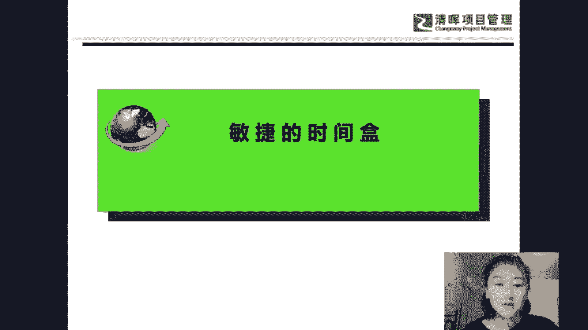
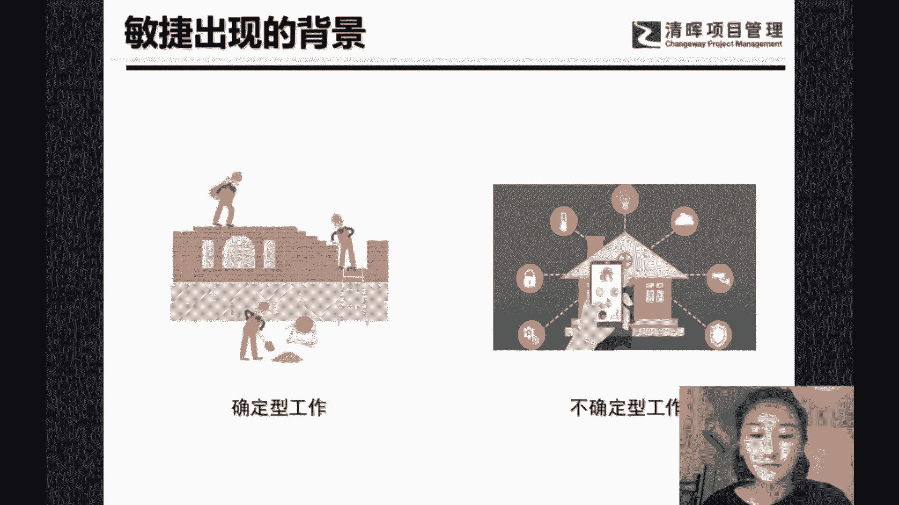
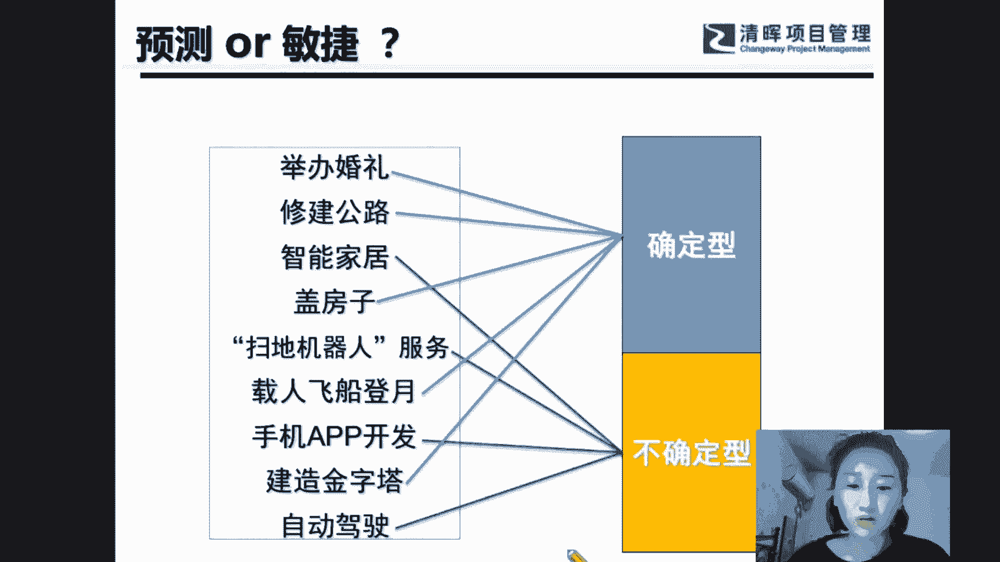
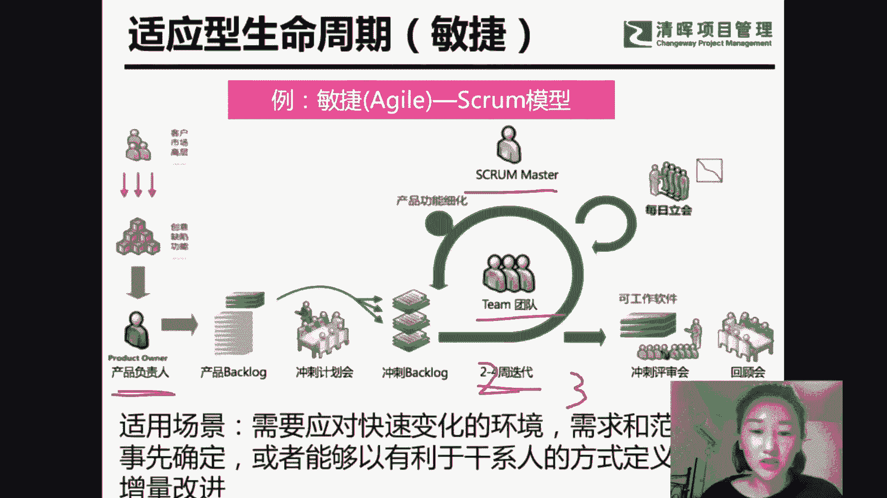
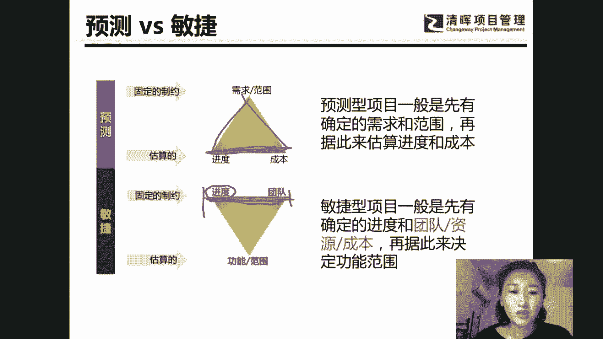
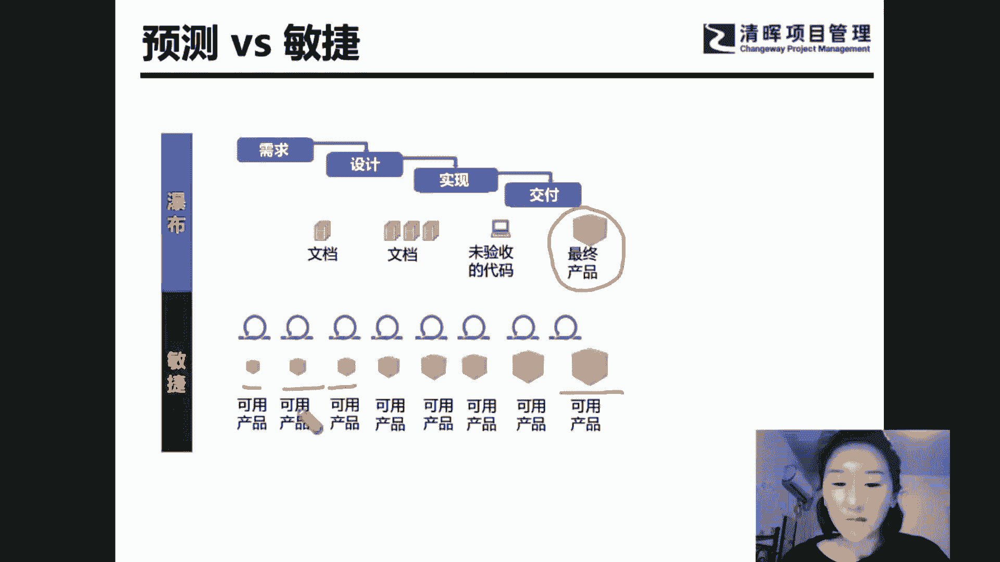
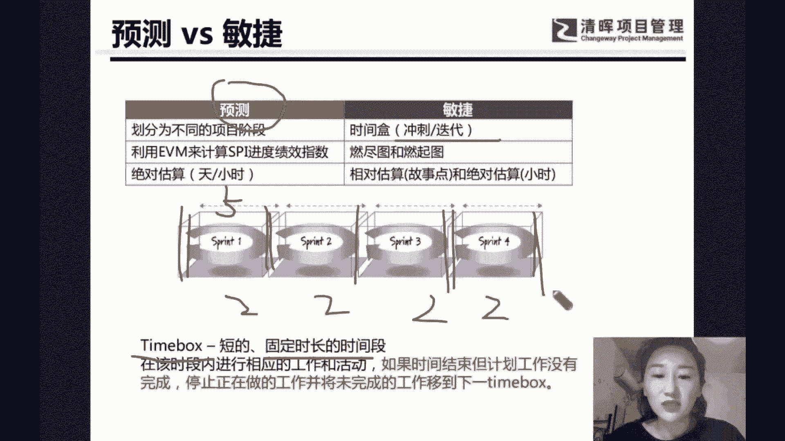
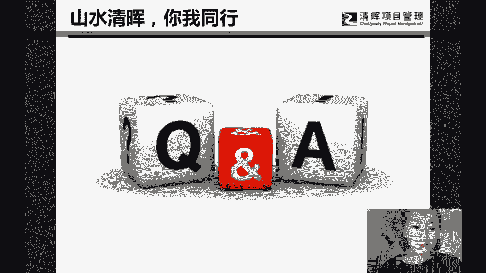

# 项目经理进阶过程：如何做好进度管理 - P2：项目经理进阶：敏捷的时间盒 - 清晖Amy - BV1kb421a7Fv

好，我们最后一个话题是关于敏捷当中的一些，时间和的内容，那什么叫做时间和呢。

那首先我们要了解一下什么是敏捷的项目，那么有确定性的工作和不确定性的工作，比如说盖房子，造大桥，然后还有一些啊研发制造确定性的工作，也就是可以有啊项目管理的固定的流程，一步步的按照步骤，按照计划来做的。

那么第二个呢是不确定性的工作，不确定性的工作有哪一些呢，比如说啊这个扫地机器人来扫地，还有巡航导弹，或者是说有一些这个卫星的一些发射，都是一些不确定性的工作，就是你的需求没法那么明确。

你的计划也没法定的，那么定的那么死的一些工作，这个叫做不确定性的工作啊。

所以我们旅呃列举了一些例子，哪些是确定的，哪些是不确定的，确定的例子，我们可以叫做预测性项目，那么另外一个就是敏捷性的项目，比如说手机APP的开发自动巡航，扫地机器人啊，或者自动驾驶。

这些都是可以用于敏捷的项目。

那么在敏捷的项目当中，我们又叫做适应型的生命周期，我们在讲偏僻知识体系当中，也提到过这种生命周期的，相当于是你的需求变化比较快，你需求真的定不下来，但是很多同学会说了，是不是我的项目也适合敏捷呢。

我这个项目我们的老板，我们的客户一天一个想法，一天一个变化，这是不是敏捷的项目呢，那么在这里需求变化很多，我们就要确定一下到底是哪个原因造成的，一个原因是你的需求确实定不下来。

这个比如说软件开发或者是一些代码的编写，确实确定不下来这些需求，那么还有一种是客户太作老板，菜桌领导特别喜欢拍脑袋，那么对于这种人太作的问题，你就没法用敏捷了，敏捷并不是什么什么问题都能解决的。

他今天一个想法，明天一个想法没法用敏捷，所以你要搞清楚，他到底算不算是一个不确定性的工作，如果是他太作的话，那说明是你的干系人没搞定，所以还是传统项目要搞定干系人而已啊，所以在这个我们地方要确定一下。

到底是不是真的敏捷，那么敏捷当中我们就会有三个角色，P o scp master，还有team团队，也就是我们开发团队，那么首先PO做什么呢，排需求优先级的，也就是它会在固定的时间和内。

我们的时间和是固定的，就是一次迭代，如果讲了迭代是两周，那么我们时间和就是两周，如果说了时间和是三周，我们迭代时间和就是三周，也就是在固定的时间和内排需求的优先级。

再来决定在这个时间盒内先干什么样的工作啊，所以一定是排需求的优先级，因为时间固定了嘛，那么时间固定你不可能什么都干呢，你只能是挑优先级高的先干，所以这是适应性生命周期。

所以敏捷和预测的方法它区别在哪呢，我们预测的项目三重制约哪一个是确定的，范围是确定的，就是你的活儿是确定的，看你要花多少时间，那么敏捷的项目呢，敏捷的项目是倒三角的，这条边就是进度确定，时间和确定。

也就是你的啊迭代长度确定就是时间确定，讲好两周，就是两周，在两周内我们要干优先级最高的工作，所以这个是敏捷的项目，也就是适应的生命周期。

那么敏捷的项目和预测项目还有什么区别呢，预测的项目一般来说经过了流程之后，最后再来交付，那么敏捷的项目呢，每轮迭代就是每个时间和我都可以交付，一些可用的产品和可用的一些软件。

可用的一些呃一些可交付成果啊，所以这个是预测和敏捷当中的内容，因此敏捷在频繁交付，敏捷是在啊这个定期有交付，所以他是被客户所用得上的一些产品。

所以敏捷当中别带也好，冲刺也好，还是我们所说的啊，time box也好，都叫做时间和的一个概念，它都是固定的长度，就是这里固定的两周或者是固定的三周，说好两周就两周，下一个是两周，都是两周。

两周两周两周进行交付的，它是时间固定，范围可变，那么预测项目呢再强调一下，是范围相对确定，看看要花多少时间，所以我们预测的项目，如果干系人没搞好，资源没搞定，或者是范围没搞定，你进度经常会延期。

那敏捷的项目，就克服了进度延期的这一个问题了，它进度一定不会延期，因为时间固定了，所以进度不可能延期，时间固定了嘛，他就在固定的时间内挑优先级最高的工作先做，那么还有的这个呃社会上的一些现象啊。

有很多公司很多领导都在说我要敏捷，或者是我们公司正在做敏捷，那么经常啊很多项目都是假敏捷，都是伪敏捷，为什么呢，首先第一个会犯的误区是什么，我们的迭代的时间和假设我们约定是两周，我们在两周。

两周两周里面，然后呢我们挑优先级高的，比如说我要做五个任务，认领了五个，那么这五个任务五个工作，这一轮迭代没做完，那么有的领导就说了，那么两周不够，我就再多一点时间吧，给你三周时间。

你三周做五个任务总归可以吧，那么如果你改变了时间和，改变了迭代的这个长度，就不是敏捷了，这就叫做伪敏捷，假敏捷啊，所以去呃我们要明确的是，敏捷当中时间和是固定不变的。

千万不要为了完成工作而去延长时间和啊，这是一个啊偏误，另外一个呢，我们在固定的时间盒内也是挑优先级最高的，你就问领导或者问客户，你觉得这五个功能里面哪个最重要，我就先做，客户说什么都重要。

客户说不要排优先级，我什么都想要，那这是不可能的，你时间固定，时间有限，只能挑价值最高的先做，如果他说什么都重要，那这就不是敏捷了，敏捷一定是排优先级的，所以甲敏捷伪敏捷，这两个是非常明显的。

如果有一个公司有一个项目，它出现这两个问题，我们就能判断它不叫敏捷，因为时间和就是固定不变，你只能挑优先级高的先做啊。

好的，那么这就是时间和的一个概念，好我们总结一下今天我们晚上讲过的一些内容，首先我们讲了预测的项目，也就是传统项目当中如何搞定进度，搞定进度其实就是要搞定需求，搞定范围，搞定干系人和搞定资源。

然后呢第二个由于你需要搞定进度，搞定范围，搞定资源也就是进度和所有的制约都有关系，所有制约任何一条变化，都会引起进度的一个变化，所以逼着我们项目经理去提升综合实力，他并不是呃某一个使用工具的能力。

也不是某一个啊利用模板的能力，而是要提升综合实力，提升综合实力最难的就是人际关系技能，那么如何提高人际关系技能，提高层次呢，刚才我们也介绍了很多杂书，你多看一些杂书，那么你就了解的内容。

了解的一些知识更多一些，那你就更了解客户，更能洞察客户到底想要什么啊，万一你跟客户有共同的爱好，共同的一些想法，那你跟他的共同话题就多了，他就会多给你一些面子，你搞定它的难度就会降低啊，好，那么呃。

第二个内容是敏捷的一个时间和的一个内容，敏捷时间和就是确定的迭代的啊，也就是我们的所说的SCN方法当中的冲刺啊，也就是我们所说的冲刺，嗯好的，大家看看有什么需要提问的吗，或者是有什么问题。

其实沟通的本质不就是人际关系技能吗，跟我们刚才讲的干系人管理其实是一个道理，人际关系技能，如果大家觉得自己需要提高的话，也是逼着我们和不同的人打交道，去站在别人的角度上面考虑，他们在想什么。

你要去考虑别人为什么要帮你的忙，别人为什么要帮你来进行项目，站在别人的立场上考虑，有的同学会说了，诶这个资源为什么不卖力呀，那我想问这个资源为什么要卖力，凭什么要帮你的忙，你是有魅力。

还是有一些特殊的做法，还是有一些其他让人比较佩服的一些行为，可以让资源愿意帮你的忙呢，所以人际关系技能，其实就是讨别人喜欢的一个技能，你能不能讨你的客户喜欢，讨领导，喜，欢讨你的老板的喜欢。

那么这些呃就是你的一种人际关系技能了啊，其实这个项目管理的本质就是搞定干系人，搞定项目，首先要搞定干系人，如果你搞不定，比如说搞不定的是什么钱成本，那是绝对搞不定的。

你怎么样变着方法来搞人际关系也是搞不定的，有些活你真的没法搞定，那其它的好说，除了成本的问题，一切都好说，那还有的同学会说了，我天生就人际关系能力不太强，怎么办呢，其实额是你的压力不够大。

如果压力足够大，你绝对会逼着自己去求人，逼着自己去搞好人际关系，假设你想你想啊，有一种这样的一些情况，比如说你现在啊老爸欠了一屁股赌债，老娘嘛瘫在床上，需要你整天伺候人嘛。

自己的小孩嘛刚生出来需要奶粉钱，那么你该求人求人，该下跪下跪呀，是不是，如果压力足够大的话，那你绝对什么都做得到，所以那些说自己啊情商不够高，或者是人际关系不够好，那些人是因为不是真的没法提升。

而是压力不够大，好的大家再看看有什么问题吗，嗯其实甲方也并不是特别好做的，呃我以前做过甲方的项目经理，如果你面对的乙方，是那种单一来源和唯一来源的，那就会特别难做，或者是就算乙方很配合。

那么你甲方的流程，就是自己公司的内部流程会非常的难走，所以不管是甲方项目经理还是乙方的项目经理，其实遇到的问题都是一样的，比如说人很难搞定啊，需求总是会变更啊，啊今天老板这个想法，明天他那个想法啊。

还有你自己的资源不配合呀，资源效率不够高啊，那就是让资源开心嘛，刚才我们也讲了，让资源开心呃，讨别人喜欢讨资源的开心才能搞定人力资源，所以资源不开心了，她当然不愿意为你干活了，所以还是那个问题去面临啊。

面对各种各样的干系人，其实我们在这个这个偏僻的知识体系当中，还会提到这个矩阵式组织啊，有三种矩阵式组织，比如说啊这个弱矩阵平衡矩阵和强矩阵，那么其实在实战当中没有什么弱矩阵，平衡和强矩阵的说法。

如果你人际关系做得好，你搞得定职能经理，抢得到资源，那么你就是一个强举证，如果你在这个呃我的项目当中是一个空降兵，没有资源也搞不定职能经理，那么你就是个弱矩阵，所以还是看你的人际关系技能，嗯有位同学问。

敏捷固定时间和无法产出产品增量怎么办，那么就要看情况到底是什么原因，没法有产品增量，如果是工作太复杂导致没有产品增量，那么你就把工作分的再细一些，你的时间和就不要搞得那么长，比如说原来是三周。

那么你就变成一周一周一周一周，把工作分的再细一些，分得再细一些，那么你一定会有增量产生，一定会有可交付成果，好的大家再看看还有什么问题吗，其实在我们实际项目当中。

那考试当中当然是有问题上报可以找发起人了，但是在我们实际项目当中遇到的一些问题的话，不可能动不动就找发起人，动不动就找领导和老板的，领导和老板会觉得哇你这也搞不定啊，那也搞不定，是不是啊。

我刚才说的时间和不变啊，呃刚才说的时间和不变呃，说的是不能因为工作做不完，而随便延长你的时间和那刚才有位同学问的是，他没有产品增量，没有可交付成果，那说明他的工作分得不够细。

或者是它的迭代长度时间和太长了，就这两个是不同的，对老板和领导，只要结果，那说明你还是没把领导搞定，如果你把领导搞定了，你告诉领导，告诉老板，我们的结果，我们的成果难度在哪儿，我们遇到什么样的问题。

他就会替你想办法，他会主动问你，哪里遇到了问题，需要我来帮你什么忙，所以归根结底，老板不够理解你，是因为老板没被你搞定，好的，那么没有什么问题的话，呃，我们今天的这个直播分享就到这里了。

如果大家还有一些问题需要问的话，可以加我们的小助手，然后啊再来进行后面的一个分享和交流，好吧好，今天就到这里啦。

