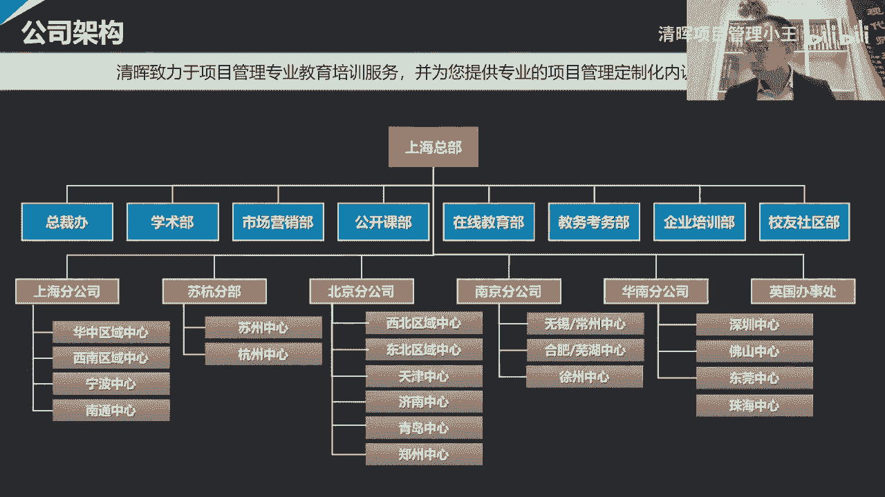
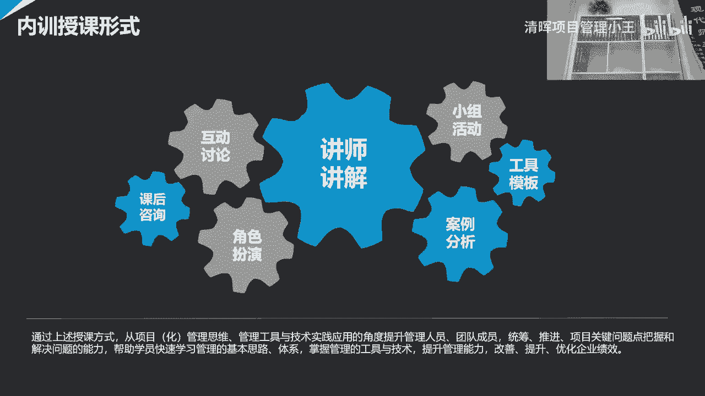
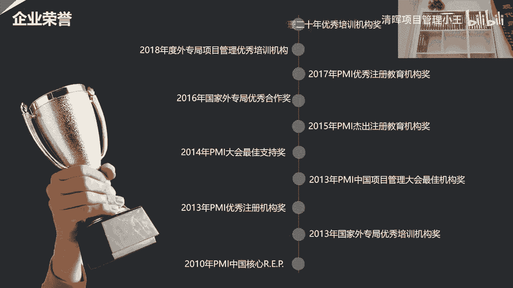

# 项目经验必备10大工具和模板 - P1：项目经理必备10大工具和模板 - 清晖项目管理小王 - BV1GA411m79k

我，不来了，下期绝对不是啥都会，生命长的就是说还有一种，那就早上的时，你的头顶不好呀，也不是他忘记了吗，之后豆子然后就掉进去了，不知道晚上呢，并在影响你的实力，会导致的，一定要适合有腹肌感啊。

这样还经常提醒自己，这样才能少吃，诶我看了一下，看着好像怎么我看不到了呢，嗯夏老师，您看一下这个位置，就是上脚脚这个位置，您看您这样可以吗，就是从这边可以看到，但是我这个直播链接它好像现在只有回放了。

看一下吧，我下午的时候复试了，反正大致上就是这么一个情况，如果您要是觉得那什么的话，我把这个看能不能再调小一点，就是他大概就是这样一个角嗯，嗯您这样可以吗，可以啊，可以是吧，现在是在什么是在测试。

对是在测试观众能看见吗，啊别人看不到啊，我就不打你了，这样也还行诶，等会再弄大一点，等一下他是这样的，那个因为一会儿我不我就不要诶，诶哪去了，那个你等会office当前已安装，这是什么，还完了吗。

嗯应该是我看一下这是啥关闭吗，点击开始，所有应用还不快去门关了，下班了，然后那小鹅直播，因为一会儿我要看屏幕，就是我要看我的那个嗯，您，您到时候就直接正常的把这个最小化就可以了，对对对。

因为我反正就看我这个东西对吧，哎我那个啊这那就在这u盘是您的啊，因为我这个硬盘里面有两个哦，对然后哎我看我那能出来了，诶，可以了，哎啊现在是看了这个。

我看一下没事，你按完了，难道这个是，你可以先放下哪场啊。

对你等会儿你那ppt在哪呢，像我两边那个ppt直接再送啊，我看哪个是你打开的pc这个w p s这个啊，对对付就可以，它会自带声音，是有台风啊，不用f5 就可以，好，那你帮我听听声音怎么样。

主要是我说话的声音。

啊啊。

是啊。

啊啊啊啊啊，啊啊啊啊啊。

唱情歌情歌情歌情。

西瓜妈妈妈妈妈妈妈妈妈。

西卡拉卡哈哈哈哈哈。

啊啊啊啊啊。

啊啊啊啊，啊啊啊啊。

啊。

啊啊啊，啊啊啊啊啊。

啊啊啊啊。

妈妈妈妈妈。

啊啊啊啊。

啊啊啊。

啊啊啊啊啊。

啊啊。

啊啊啊啊啊。

啊啊啊啊。

啊啊啊啊。

尊敬的各位学员，大家晚上好，今天是520哦，正好在这个幸福的日子里呢，欢迎大家在百忙之中抽出时间，来参加本次的系列在线微课，本次系列讲座，我们很荣幸地邀请到了襄阳老师，来给大家进行分享。

肖阳老师头衔特别多，首先是微权力下的项目管理思想，创始人和倡导者，全国项目管理标准化技术委员会tc 343委员，美国片卖全球高管理事会理事，英国内阁办公室prince to和msp授权讲师。

从项目经理到年薪百万的职场精英的作者，曾在金风科技，摩托罗拉菲斯卡尔，索尼爱立信，lg电子，英国标准协会智联招聘的集团，担任重要的管理岗位，并作为管理咨询顾问，帮助多家龙头企业。

建立了po和组织级项目管理体系，本次系列共有六期的课程，六大模块逐一击破，今天的微课主题是通过工具模块，让项目管理落地的密集，在这里要提醒一下肖阳老师，分享结束后，讲座还设置了互动答疑环节。

所以各位学员在听课过程中，可以将问题发送在讨论区，肖老师会抽取问题进行回答，接下来就让我们一起期待肖老师的分享来，大家可以刷起来集体刷一，欢迎肖老师。

可以了是吧嗯行，嗯各位学员各位各位嘉宾，大家晚上好，很荣幸啊，在520这样一个有特殊意义的日子里边，然后呢开启了我们这个系列的项目管理讲座，然后呢感谢勤工业项目管理给予提供的平台。

那感谢呢大家对于这次讲座的支持啊，那接下来呢我们正式的开始我们的讲座，这个讲座呢是一个系列的微课讲座，这个呢其实也是啊，我们第一次去尝试这个系列的微课讲座，然后呢这次的系列呢我们把它设成了六节课。

然后呢这六节课的目的呢，其实希望的是从由浅入深的，那然后帮助大家呢去理解，在不同的层次和阶段上之后呢，我们项目管理需要去学什么，懂什么，然后给大家稍微介绍一下啊，这个六次课。

这六次课呢其实是有一定的进阶的，就换句话说难度系数不一样，那今天呢是第一次课，第一次课呢相对来说是最简单和基础的，所以呢我们先从这个工具模板开始，我们说工具模板呢它最容易落地，然后呢。

但是设计工具模板这个时候其实是非常复杂的，这个最容易落地的东西，其实往往也是设计过程中最复杂的东西，因为大家知道这个把这个简单的东西复杂化，不太容易，把复杂的东西简单化更难。

那其实任何一个优秀的工具和模板呢，它其实背后呢都其实蕴含着非常智慧的，这种设计的思路和理念，然后所以呢这个越是智慧的这种设计的结果，越容易让这个工具模板显得简单易懂，容易落地，然后大家用起来之后呢。

还能够帮助自己去提升能力跟效果啊，然后这第一课呢，当然我们主要讲的不是怎么去设计工具模板，我们更多的其实讲的是说，如果我们有了一些工具模板之后呢，我们大概怎么去用，所以这是第一次课，从工具模板开始。

第二次课呢，我们准备讲的是说这个关于pp落地的问题啊，这个偏僻呢大家考过的很多偏僻呢，其实也是所有的这个从事，项目管理职业的一个起点，那包括我自己也是一样的，那其实呢这个啊。

我们的外专局呢在20年前引入了项目管理，尤其是引入了py的项目管理体系，那其实由此而来呢，这个项目管理呢用了20年的时间呢，在中国这个蓬勃的发展，然后呢才导致了是说呢现在在中国。

项目管理逐渐的形成了一个行业，产生了很多不同的岗位，形成了很多的职业，那其实都是从那我们最开始的去学习，这个美国项目管理协会，pi的这个p m p的资质开始，那其实pmp呢。

呃估计在座的有很多学员已经考过了，那考p m p的过程就很痛苦啊，因为大家需要记大量的东西，因为p m p本质上它背后有一本书叫pinbox，那pinbox其实是项目管理知识体系。

那项目管理知识体系呢它更多的是知识啊，而且是体系化的，项目管理知识学的过程呢需要记住很多的东西，然后在脑海中建立对这个项目管理体系的一个，这个系统性的了解，那其实这往往是我们这个项目管理。

这些发展道路的一个起点啊，通常呢我们把它视为是入门级，换句话说呢考过pmp之后呢，其实我们通常认为他入门了，入门其实挺难的，我们说入门是一个职业化发展道路的起点，但是入这个门并不容易。

很多的人呢我们说什么叫门外汉，有很多的人其实干一个事儿干了很久了，但是始终在门外转，就是不得其法，说明没有入门，所以一般的来说呢，这个我们走上职业化的项目管理道路，都是从先入这个p m p这个门开始的。

但是呢这个pip落地挺难的，所以呢我们呢其实第二次课并不是讲，这个p p是什么，我们其实要讲的是说的这个懂个p m p之后，我们到底怎么样才能让它在实际工作中落地。

那这件事呢其实比这个学p m p更难啊，所以呢它其实在我们看来是一次进阶的过程，第三次课呢，其实呢我们想谈一谈关于敏捷项目管理的问题，因为呢现在的这个疫情，大家知道这个疫情呢改变了我们的世界啊。

使我们这个世界变得更加不确定啊，更加多变，那在这种情况下呢，其实项目管理和各种组织，那我们所说的组织包括企业对吧，这个政府组织啊，各种非营利组织，它其实都是组织，在这种疫情之下呢。

所有的组织呢不得不通过转型啊，然后去适应这个多变的环境，在这个过程中呢，如何的去提升自己的适应性，适应能力变得更加灵活，更加敏捷啊，因为原有的这种固有的机制呢，它不是不对对的，但是更加适合的是。

更加适合的是过去的这个环境和组织形式，但是当我们的组织这个整个外界的环境变化了，那组织也要跟着去进行自己的这种结构性调整，那项目管理也是一样，那现在其实大多数的企业呢，它都是通过他怎么去调整呢。

他要去产生适合未来的战略，那战略呢要落地，落地的时候呢，它是以项目的形式，那如果呢项目做不成功，或者是说项目本身简化，那这个时候呢它其实就很难，这个很难让自己的组织，那去按照战略的要求去调整。

成未来的环境所需要的形式，所以呢这个不光组织要转型，那项目呢也要去增加自己的敏捷性，提升自己的适应能力，那所以呢第三课呢我们主要想去谈一下，这个如何让我们的项目管理变得更加密集一些。

那如果我们想成为一个敏捷型组织的话，那我们大概其实是需要去做哪些调整，第四节课呢，它其实讲的呢其实偏向于，更多的偏向于项目治理，那其实这个呢会基于我原来的写的那本书。

就是我一直所推崇的微权利下的项目管理，那我们更多的谈的是说呢，如果我们想把一个项目组织好，那我们需要去给项目搭建一个受控的环境，那搭建受控环境呢，他这个搭台子的事，那它不仅仅是个理念，他是要实操的。

那前三节课呢它有些东西呢它虽然是有工具啊，有理念，第四节课呢它更加难的是因为它偏向了智力操，他更多的讲的是我们如何搭一个平台啊，因为通常呢在我自己的观念里，项目呢是一种组织保障形式。

像你这种组织保障形式呢，它其实是为了保障呢，我们来自各种不同相关方的这群人，为了共同的目标走到一起，它能在很短的时间之内形成合力，那为什么让他们在很短时间形成合力，而且能保证大家在一起呢。

能够想形成这种共同的执行力，把一群人变成一个人，变成一个真正有执行力的组织，他必须要有一个台子，有一个受控机制，那威权利的项目环境下呢，它其实更多讲的是说我们如何呢对吧，能在不借助权力的情况下。

然后呢他把这个台子搭好，然后呢，让一群人共同去实现这个有挑战性的目标，那所以他背后是搭台子，是偏向于智力，所以这是第四课，第五课呢会变得更难了一点，第五课呢其实我们要谈的是风险管理。

风险管理呢一直都是项目管理中其实非常难的，难的原因呢，是因为他永远在讨论的是未来没有发生的事情，我们说一旦发生了就不叫风险了，发生了的话对吧，我们说不好的事，要问题，这个讨论没有发生的事情对吧。

预测没有发生的事情，思考如何去应对没有发生的事情对吧，分析如何这个没有发生的事情，它背后的规律是什么，那这件事其实通常就是我们所说的，他其实推演啊，那从既要推演，要应对，那这个过程呢其实会更加难。

他比我们干一个当下的事会更难对吧，我们一直以来我们说回顾过去，其实这个复盘其实很多的，很多的公司大家都会发现，其实复盘就很难，但其实从这个找规律跟总结的角度来说，其实复盘是最容易的，因为你是回顾过去。

第二呢应对当下对吧，应对当下这个如何能够在现场解决问题，那其实这个就比回顾过去要难一些，我们说预测未来在没有发生的时候去应对未来，这个难度系数会变得更大，所以第五课呢。

当我们去谈未来没有发生的事的时候呢，我们要练的是大家这个因果推演和应对的，这种能力，那这是第五课，第六课呢，其实我们讲的是说这个再往上面去走对吧，我们要去梳理呢，我们整个的这个一个职业发展的历程对吧。

当我们走到了项目管理的最顶端，那我们会变成一个什么样的人啊，这个过程呢这个路径是怎么走的，在什么样不同的阶段呢，我们会遇到什么样的问题，所以第六课呢，我们其实又偏向于回到了。

人的这个职业发展的过程里面去，那在每个不同的阶段，我们需要掌握什么能力啊，突破什么样的瓶颈对吧，然后呢切换什么样看问题的视角，我们需要去做哪些事情，然后那这些呢其实是我们在第六课里边。

我们要去给大家讲的，一共呢这个是六课，第六课呢主题都不一样，然后侧重不一样，但是我相信呢这六课呢首先每一课啊，其实都是希望能帮助我们的学员，能够的这个从一个独特的视角啊。

有价值的视角去看待项目管理这件事情对吧，有的可能是项目管理工具，项目管理的职业对吧，项目管理中的一些关键的主题模块对吧，方法思考逻辑，那所以六个角度不同，但是它们之间有着相互的关系。

所以呢我希望呢能够通过这个一系列的微课呢，能够帮助我们大家呢能够去更清晰的啊，去梳理项目管理的一些脉络，加强了对项目管理的一些本质上的认识啊，所以呢这六个课呢，它基本上呢这个覆盖了我们说项目管理的道法。

数器是吧，这四个层面的东西我们其实都有涉及对吧，有弹道层面的东西，然后又谈法层面的东西对吧，我们治理，然后呢数这里面有方法对吧，然后这边有t我们有工具，那所以呢这个虽然只有六节课。

但是呢把道法术器都覆盖了一下，所以呢我自己呢也非常期待啊，当我们把这六节课都给大家讲完的时候，那希望能够看到大家呢啊，因为第六次课呢能够有一个比较明显的提升，所以这是我们说这六四克。

接下来呢我们开始讲这第一课，那第一课呢我们讲工具模板呃，这次讲工具模板呢，我想尝试用一种新的方式来讲，这个往常呢讲讲课跟讲市场活动啊，一般都用这个p p t，然后这次呢因为讲工具模板。

然后呢我准备不用ppt了对吧，因为工具模板呢，我们这次讲的工具模板，基本上都是这个用word或者imax project，或者是excel所形成的模板对吧，因为大部分模板都是这样的。

一般课件都是p p t，汇报材料都是p p t，但实际落地的时候呢，大部分东西它不是ppt，它往往是用word写的报告对吧，然后呢这个用excel写的各种记录单评价表。

或者是用ms project用的计划，所以呢这次我想尝试用这样一种新的方式，那用这种新的方式的目的呢，其实是这个我们讲工具模板吧，那我就直接看工具模板就好了，然后呢我们就不把它放成一堆ppt了。

所以呢准备这个用直接用模板给大家讲啊，但这个对我来说也是第一次，就我们看看效果怎么样，这次呢讲工具模板呢其实是讲九个工具模板，但是呢我给大家举个例子不止九个，因为有的工具模板呢。

嗯因为不同的行业用的东西侧重不太一样，所以呢我希望呢尝试这个居于不同的行业啊，然后给大家讲讲不同的工具模板，但是呢这个工具模板呢其实是讲讲九个酒类，那这里面九类是什么呢，一个就是项目的立项。

立项报告怎么写，第二节项怎么写对吧，通常我们说这项目一头一尾这两个比较重要，然后呢项目的计划，那这个项目计划呢，一直以来是项目中最重要的工具之一，所以我们会讲讲进度计划。

然后呢风险风险项目风险管理落地呢，我们他一定会落到风险登记单或风险记录表上，所以我们讲讲风险的登记单是什么样子的，项目中呢会有变更，有变更的，就涉及到变更的审批对吧，项目中呢要验收这个产品。

要验收成果要验收，所以呢这个成果验收审批表是什么样子的，项目做完了之后要做评价啊，项目做评价呢，那我们一定会至少评价三个方面，我们要给项目做评价对吧，这个评价的是项目本身，然后呢我们要给项目经理做评价。

然后呢我们要给项目成员做评价，那这三个评价是分着的，所以呢我们尝试了各给大家举个例子，看看这个这个评价项目评价，项目经理跟评价项目成员啊，这个到底有什么不一样的，一般从哪些角度来做评价。

所以呢一共是这样九种不同啊，九种不同角度的这个工具模板，立项结项对吧，进度进度计划这个风险变更，然后验收，然后项目的评价，项目经理的评价和项目成员的评价，然后呢这个我们争取用啊，这个不到一个班。

现在还有一个小时零15分钟的时间，那我们给大家去讲一下这几个模板，我们先从这个项目的立项报告开始啊，嗯我们首先先看这个项目的理想报告，这个呢其实是一个用word版本的，一个项目的理想报告。

那这个项目的立项报告呢，呃它其实是来自于这个it的，来自it行业的一个项目的立项报告，那这个立项报告呢首先并不复杂，我们大家看一下这个立项报告，其实一共也就才两页，对这个两页的简单的立项报告。

在这个立项报告中呢，我们主要看一下，是说当我们在去项目做立项的时候，我们去需要思考哪些问题，首先呢在这里面需要跟大家讲一下的，就说这个项目立项呢，其实一直以来都是项目中最最重要的一件事情。

我们知道项目中有很多很多事情，然后呢如果大家学过pmp的话，会知道项目中有这个五大知识领域，十大过程组，那130 40种不同的工具方法啊，然后当然我们说的项目有很多种类，项目中有很多工作，有很多阶段。

有很多活动，我说把所有这些东西都算上，那如果我们挑项目中最重要的一件事，一定是项目的立项，这件事情为什么呢，因为项目的立项是项目中最重要的一个关卡，一个git啊，那这个这个这个关卡呢。

它之所以重要的原因是因为呢项目中对吧，项目中立项之前所有的事都是在筹划阶段，立项之后，所有的事都进入到实施阶段，实施阶段呢是真金白银的要投入成本的，那立项之前筹划的时候，他虽然也投入成本。

但是相对于整个项目的周期来说，它的成本要小很多，大家知道这个我们之前讲项目管理的时候，一直会提到一件事情，我们知道这个项目管理呢，它本质上首先它是基于目标的管理方式啊，就是换句话说呢。

一开始这个项目要明确目标，然后呢因为目标明确了，我们把目标反向做分解，那去梳理我们从现在到目标，实现目标出来的一个路径，然后呢，这个这样我们才有可能呢这个笔直的向着目标，这个去前进，所以呢。

这个项目管理一直以来锻炼的能力是什么呢，就是我们首先还没有干之前，我们得先把最终的终点目标想清楚之后呢，我们要把从我们当下的这个这个起点啊，到目标之间的这个路径想清楚之后呢，我们再去做这件事情。

所以项目管理呢他一直以来锻炼的方式吧，他是说当我们做一件事之前得先想明白，然后再去做啊，而不是靠试错试出来，我们说这个传统的项目管理了，当然我们说这个后来敏捷出现了之后。

这个呢在一定程度上那有了些灵活性，但是从总体上来说，项目管理的一个基本的思维，他锻炼的还是说呢在没有做一件事之前，想明白我要做到什么程度，想明白我们要怎么去做，想明白我们要张罗谁跟我们一起做对吧。

其目的是为了减少风险，减少不确定性，少走弯路，那这那这个怎么来判断，我们想明白还是没想明白，那最主要的一个方式，首先就是立项的评审，所以立项的评审呢它是帮助我们解决几个问题，立项评审评的是什么。

立项评审，他其实是要把我们说公司内所有最有经验的人，凑一块儿，那大家要评的东西呢，它主要是凭三个方面，第一呢这个事值不值得做对吧，第二件事呢我们要评的是什么呢，这件事即使值得做了，我们有没有能力做。

那第三个角度要评价的是什么呢，这件事值得做啊，我们也有能力做，但是我们有没有能力去实现，这件事的收益和价值，虽然这三件事第一有没有价值，对吧，第二有没有能力，第三有没有实现收益和价值的能力。

所以这时候我们会判断的这里边是两个能力，第一首先我们判断要有价值，没有价值的事不干对吧，这个因为佛陀不知道为什么干，第一有价值之后，有了价值之后呢，接下来呢要判断有两种能力。

一种能力是实现项目产品的能力，或者实现项目交付物的能力，换句话说建设项目产品和交付的能力，第二个呢我们关心的是说，即使有了项目的产品跟交付，但是大家知道有了项目的产品跟交付，跟有项目的收益，这是两件事。

因为有了项目的产品跟交付之后，我们接下来要思考的一个事儿叫成果转化，什么叫成果转化呢，就是我们如何把我们的项目的产品，那应用到目标的用户那边去，而变成项目的成果，然后而借此去实现我们预期的收益和价值。

所以这时候呢我们会看见呢，这个即使有建设项目产品的能力，它并不一定有实现收益的能力对吧，换句话说我们上了一个信息系统，系统是建完了运转正常，但是用户不接受，用户不接受，就没有人用这个系统。

没有人用这个系统呢，这个系统到底好不好用对吧，用了之后能不能办公司，提升效率和降低成本，你就不知道，因为没有人用，换句话说没有落地东西，这个项目的系统没有落地就没有成果，成果是什么呢。

成果描绘的是一个项目的产品，被我们的目标用户在他的环境中用起来之后，所被改变之后的一个状态，成果描绘的这个状态对吧，成果是什么因果的果对吧，成果的概念就是有没有实现因果的这个果。

我们说建设项目产品是个因，这个原因原因是什么概念，就是说我们希望通过建设一个新的项目产品，去改变我们目标用户的行为，他的工作状态和生活状态，而由此去获得发起这件事儿，所预期的收益和价值。

如果我们把项目产品建出来了，而没有因为用户没有去使用它，那这样就见不到成果，用户没有用，见不到成果，我们就不知道这件事到底有没有收益和价值，对吧，所以在立项的过程中，我们其实是要评估这件事的。

我们要评估的是什么呢，第一这件事有没有价值，第二件事我们有没有能力建设产品，把音创造出来，第二第三件事，我们要评价我们有没有能力实现成果转化，对实现预期的收益，所以呢当这三件事的条件都具备的时候。

说明什么呢，说明我们应该去做这个项目，如果这三个条件中有任何一个条件不成立，那我们说我们要非常慎重的考虑，我们是不是真的要去做这件事情，所以首先这个是我们做立项评审的时候，我们的一个目的。

那这个项目立项的报告是干什么的，项目立项报告呢是说，当我们这个我们要去做立项评审的时候对吧，我们总得有个材料吧，这个材料里边呢他得写的是说所有立项时，对，我们其实像我们的项目管理委员会，我们要去证明。

我们在决定找公司要资源去做这件事之前，我们把刚才说的那三个问题想清楚了对吧，三个问题是什么来着，一这项目做完了，对公司有没有价值，二我们要证明我们有能力做这件事儿，这个能力是什么呢，第一个能力。

我们有把项目的产品交付建设出来的能力，第二个能力，我们有能力拿着我们建设出来的项目的产品啊，去实现成果转化，去实现预期的收益，给公司带来价值对吧，去证明这件事，证明这仨条件是成立的。

那既然你为了证明它是成立的呢，你必须得有报告对吧，那里边得把我们这个证明的材料给写上，那这个其实就是项目的立项报告的作用，项目立项报告呢，一旦通过了项目管理委员会的评审。

那意味着呢就形成了项目的一个基准线，就是说项目baseline这个基准线是什么呢，就是项目的目标，这个目标的概念，就是说当我们项目最后结束了之后，或者包括我们项目的过程中。

我们要评判我们这项目做的好不好，对不对对吧，我们要评判的是什么呢，我们项目最终实现的结果，跟我们项目的立项报告中写的这些东西，是否是吻合的对吧，如果高度吻合，说明我们项目的目标管理做的非常好。

那意味着我们能很好的实现目标，证明项目管理管的好，如果高度不吻合啊，偏差很大，那不一定说明这事是错的，他有可能偏差很大，这事依然是对的，为什么呢，因为可能开始对象是想错了，那这时候呢他不能说明事是错的。

但是他一定会说明项目管理管的不好，项目管理是管什么的，项目管理就是我们首先我们先僵化的去看，项目管理啊，当然我们也可以灵活的看项目管理，就首先我们先僵化的看，当我们僵化的看项目管理的时候。

项目管理的概念就是目标管理，目标管理的概念就是项目立项报告的时候，我们定的目标是什么，我们就要保证我们的项目的团队，最后干完了之后，跟这个项目立项报告定的目标是一致的对吧，里面说让干什么我们就干什么。

里边说不让干什么就不干什么，里面说上什么时间完成什么，我们就什么时间完成什么里面，如果如果没有说什么时间要干什么，我们坚决不让大家干这件事情对吧，这项目标管理，首先目标管理呢它的一个基本逻辑是。

除非目标变更了，如果不变更，我们肯定不打扰它，这个按照这个这个目标以外的事去做，当然变更了之后就形成了新的目标，那当然我们就可以按照新的去做吧，所以呢项目管理呢，他首先解决的是保证大家的执行力。

这种执行力是基于项目立项报告中，所达成共识的，项目的目标和过程的执行力去进行执行啊，所以我们说啊首先这是项目的立项报告，那基于这样的一个目的呢，去做汇报的时候呢，那我们需要提供哪些信息，然后呢。

让他们对我们的项目经理和项目团队，能有信心啊，然后呢让他们认为这项目值得做，然后公司可以投钱，可以投资源对吧，然后呢愿意去支持我们，那其实这就是我们通过理想报告中，其实要去写东西。

通常当我们要去写一个项目，一项报告的时候呢，对吧，首先这个谁写的什么时间写的对吧，项目的名称是什么，然后呢接下来呢这个项目的核心对吧，项目的核心的领导团队，那通常至少有两个人，一个是叫项目总监。

一个叫项目经理，那通常情况下呢，当然可能在有些企业中，可能只有项目经理，没有项目总监，那这个但按照一个标准化的项目管理项目中呢，其实这个领导者应该是有两位的，一个叫项目总监，一个叫项目经理，他有分工。

项目经理呢主要负责呢组织大家干具体活，那落实呢项目管理委员会的决议，项目总监呢是领导，准确的来说呢，项目总监呢是监督和领导项目经理，同时呢项目总监呢去负责协调项目管理委员会，对吧。

我说项目管理委员会是一群领导，我们说光靠项目经理协调一群领导困难，大家不一直几了，所以呢这时候呢他至少得项目总监呢，他是领导，领导呢协调一群领导在领导之间构建平衡，这就是委员会。

项目经理呢他给领导们决策提供素材，他呢要负责落实领导们的决议，那组织大家去实现这个领导们的各项要求，同时呢反馈结果，所以这俩人都重要，尤其呢这个这个不管是到英国的项目管理，还是美国的项目管理。

就按照西方的项目管理的，那我们基本上都会认同一件事情，这件事情是什么呢，这个任何的一件比较复杂的事啊，创新的事他如果要想去落地的话，他其实至少有两个人对吧，一个是当领导定方向定决策。

第二呢是得有一个具体的执行的人，来组织大家干这件事，这就是项目经理，所以这个标准化的项目管理，应该是两个人作为这个核心成员，做领导的项目监，那这个组织大家干具体活的项目经理，通常的这个项目总监呢。

它不是项目的发起者，一般的来说呢，一个项目呢在一个企业中发起项目的发起人呢，就我们通常说这个sponsor啊，然后或者叫owner，项目的发起人呢，他往往是公司内一个手握资源的大领导啊，他相当于投资人。

大家知道投资人是不干具体活的，投资人只投钱对吧，投资源啊，所以往往在公司里边呢，这都是大领导什么，比如说什么项目总经理啦，那么总裁了ceo了或者vp了对吧，那项目的发起人呢往往都是大领导。

他掌握各种资源，那项目总监跟项目经理的工作是干什么的，项目总监跟项目经理呢，他把这个项目发起人当个投资人，他要去说服项目发起人，觉得他们拿着发起人的钱对吧，项目总监和项目经理和项目团队。

拿着发项目发起人的钱对，去折腾这么一大摊子事儿，这件事将来最后对发起人的有好处，对他得有价值，它它就有收益对吧，所以呢发起人也要定义，第二呢，这个项目呢既然有项目总监和项目经理。

他肯定有项目的主责部门啊，这个取决于项目经理属于什么部门呢，他肯定还会有一些相关部门对吧，有些部门要支持，所以可能我们要去写一下，比如我们做一个项目，是不是需要研发部门的支持对吧。

是不是需要it部门的支持，是不是需要业务部门的支持，是不是需要人力资源部门的支持，那相关部门通常当我们在写立项报告的时候呢，这个我们还要关心一件事，就是这个项目是什么类别的，因为不同类别的项目吧。

它管管理方式不一样，其实呢这个就像我们刚刚所讲，就在我的观念里边吧，项目它是一个载体，它是个组织保障形式，它更多的组织保障的是什么呢，是一个创新的过程，承载的呢其实是一个创新的业务过程。

承载的是一个实现向目标的过程，所以这时候呢，这个我们要实现的目标和产品的类别不一样，他就这项目的管法就不一样，虽然都叫项目管理，我们大家知道这个项目管理和项目管理不一样，项目管理跟项目管理的差异。

取决于项目上所承载的实现的项目的目标，产品和业务流程对吧，我们说这个盖房子也可以叫项目工程项目对吧，我说这个开发软件它也可以叫项目，做业务流程创新也可以叫项目，搞市场活动也可以叫项目。

我说当然还有很多很多的项目，这些不同的项目，因为它上面承载的业务流程不一样，所以它的管理模式不一样，当我们要去判断一个项目该怎么管，我们要首先判断这个项目上，承载的业务流程是什么。

然后再去思考他的项目管理的手段，是否是合适的，所以呢通常我们要写个类别在这，然后呢这个一般项目可能还会有个编码对吧，然后呢接下来项目的起止时间什么时候开始，什么时候结束对吧，我们说既然叫项目吧。

它必须有明确的开始和结束点，主要没有明确的开始和结束点，这不叫项目了，这叫运营，其实呢本来其实所有的事啊，他其实都会一直发生，然后呢其实可能该结束，这也是会结束，通常呢当我们要把这事当项目管的时候。

我一定是希望他能在更短的时间内结束对吧，最好的是在规定的时间开始，可以在规定的时间结束，那往往这个规定的时间，规定的结束时间呢，其实一定比那个如果你不搞项目管理，他要提前对吧。

你拿到其实一般来说呢这个时间紧，任务重的才当项目管，要时间不紧，任务不重，就不用当项目管，就顺顺其自然的发生就可以了，所以呢但凡教项目，它一定会有一个对吧，比常态化的工作更有挑战的时间上的要求。

所以呢我们从一开始在立项的时候，就得把这时间上要求给写上，如果我们说项目起止时间一起，我们大家一看哎呦这个时间足够宽泛对吧，谁做都能做得完，那么不用当项目管了，我们必须得写上一个，大家一看。

哎呀这个一般人在这时间肯定干不出来，那这时候他才叫项目对吧，我们说做项目的目的是为了抢时间，是为了用更少的时间，更少的资源对吧，然后呢，更高的质量去完成一个项目的目标，和项目的事儿，所以呢起止时间呢。

这一定是最重要的一个要求之一对吧，所以我们也会看到所有的这个项目的考核，这个即使别的什么都不考，他也至少得考核这个时间是不是按时完成，说到这儿了，顺便提一句，这个以前的时候呢。

这个经常有很多项目经理会抱怨说，这项目给时间太少了对吧，时间不够，但其实呢这个我们换一个角度去想啊，这时间上从一开始一看就够了，就不用当项目管了，一直以来，其实项目管理最大的价值就是。

如何在人家看起来不可能完成的时间里面，我们通过优秀的项目管理，能让他完成，换句话说比别人用的时间少，这才是项目管理的目的，如果我们说我们用了项目管理，后来发现跟不用项目管理，大家完成的时间是一样的。

那这项目管理一点用都没有啊，白白增加了管理成本，所以呢我们说既然都管理成本增加进去了，张罗了一帮人跟我们一块干事情对吧，本来人家可以各自干各自的，结果我们整了个项目经理，整个项目组件。

把一群人从自己的岗位中揪到一块儿，一块儿去干活，把人家那项目的预算和资源拿过来，我们进行统一管理，然后结果我们干完这个事的时间，再不如人家干事，这个时间用的更短，那这件事岂不是一点价值都没有。

所以呢项目管理的首先的第一要求，一定要用b其他的方式，更短的时间完成项目管理才有价值，否则的话就不用被弄的这么复杂了，所以起止时间也很重要，而且这起止时间大家的一看就觉得哎呀，这时间挺有挑战的对吧。

这才有价值，我们最怕的是项目管理委员会一看，哎呦用这么长时间，你说这这项目的价值何在对吧，假如项目管理委员会一看，发现有你这么短的时间就能完成，说一件事，他才是一个有价值的事情。

上面的东西呢其实一些基本信息，接下来呢我们说在项目中呢，我们一定要去讲的是什么呢，就我们要去讲这个项目的背景，那项目的背景和目标收益啊，这是要花重点时间进行描述的，所以我们看到这时候。

我们先先不管具体活是什么，项目的立项报告，大家记得项目立项报告永远讲三件事，第一件事价值对吧，那价值呢来源于收益和目标，所以讲价值之后呢，第二件事才讲诶，我们有能力实现项目的产品。

然后我们有能力居项目的产品，实现项目的收益对吧，所以项目中的目标通常有两个，一个目标呢是交付物，就项目的产出对吧，什么时候这个项目的交付是什么，什么时候能完成交付，这项目的第一个目标。

大家大家要记得这个目标是阶段性目标，正在发起人的角度，项目真正的目标不是要那个产品，是那个产品成果转化之后所实现的收益，以及这个收益得是对项目发起人有价值，所以项目标有两个，一个目标是产品。

一个目标是收益，那这两个东西我们都要在这一段中先去描绘，对吧，那他描绘清楚了之后呢，我们其实才解决一个问题，就是这事儿值不值得干的问题，我们最怕的是从一开始描述到这，大家发现描述完了根本就不值得干。

那后面不用讨论，或者呢有些项目经理压根就没有描绘这个东西，只是描绘了我要干哪些工作，那这件事对于项目的投资人，我们说站在项目的投资人，他首先关心的不是你怎么干这个活。

他首先关心的是你为什么要干这个活对吧，以及你干这个活，到底对公司跟投资人有什么好处，有什么价值对吧，就像我们说这个我们想买买个东西，不管是买衣服，买房子，买车对吧，我说买个房子，买个车得最为明显。

因为这属于对家庭来说投资比较大，那当我们要买房子买车的时候，我们要首先思考的问题不是如何买的问题对吧，我们要首先思考问题是我为什么要买，如果我没有一个特别强硬的理由支撑，我要取我有一个理由来支撑。

我应该买这个房子跟车，以及买了房子跟车之后，能够给我带来更大的回报的情况下，那其实我们没有必要去思考怎么买的问题对吧，比如说很多人买房子的原因是什么呀，是你不买房子结不了婚，所以这时候投资回报就很明显。

买了房子能结婚，买不了房子不能结婚对吧，所以这时候大家想为了结婚拼命攒钱买房子，所以呢我们要先把这这东西想清楚，然后对吧，得有了钱，然后有了一个买房子的理由，然后我们才能去探讨是说怎么买的问题对吧。

所以所以我们知道这个，那这一部分项目的背景和目标，它解决的是相同的问题，就是我们为什么要干这件事，那当我们去思考为什么要干这件事的时候呢，那这个时候其实我我们也要去思考的一个问题。

是说第一这件事怎么出来的，首先啊这个大家一定要记得，我们当我们接到了一个项目的任务的时候，我们要首先思考的问题，不是说这活怎么干，首先思考诶这项目哪来的，为什么会产生这样一个项目，谁提出来的对吧。

因为提出来的人他为什么提出这么一件事儿，为什么要思考这个问题呢，我们要思考这事儿到底对他有什么收益和价值，对吧，比如说如果是总经理提出来的，我们要向总经理为什么提出这样一个项目呢，对吧。

如果是客户提出来的，我们要想客户为什么要提出这么一个项目呢，对吧，如果是说某一个其他的对吧，一个工程师提出来的一个项目，我们要想工程师为什么提出这样一个项目，所以第一呢我们要首先看这个项目是怎么来的。

对吧，我们的项目是其他的一个项目的延续，二期还不是一个完全创新的东西对吧，还是客户一个需求，我们一般讲说项目的这个来源有三类，第一类呢是战略规划分解下来的，第二类客户提出来的，然后第三类是我们自己人啊。

创新的想法想出来的，对我们首先想想是哪来的，这样谁提出来的对吧，这个提出这个项目的人，他该不该提出这个项目，我发现你提出这个项目人其实他本来就不该提，那我们要思考一个项目该不该做的问题。

就是所以第一看来源，第二个问题呢我们要讲明白的一件事是什么呢，这个这项目到底最后要的交付是什么啊，对顺便再补充一句啊，项目的背景呢其实还挺重要的，大家知道这个一般很多时候项目优先级啊。

它取决于谁提出来的，如果你说你这项目是公司董事长提出来的，这项目优先级就高，你把这句话摆这项目背景上，写上公司董事长提出来要做这样一个项目，这通过率就高，就像背景上写着某一个工小工程师提出来的。

这通过率是第一对吧，你说要是某一个非常重要的战略大客户，提出来的这项这项目立项通过率就高对吧，你要是项目背景写的时候说，项目经理我自个儿想出来的，这事儿通过率就低，所以第一首先谁提出来的很重要。

第二这个项目目标项目标的写交付对吧，最后这个项目做完了要交付什么东西对吧，要交付什么样的系统，软件还是硬件对吧，还是一套流程，还是一个什么有形的产品目标要写清楚，否则呢大家不知道说你干了半天。

最后干到什么算结束，项目的截止点对吧，项目的截止点取决于我们的交付，如果你得把交付能讲的很清楚，验收标准讲的很清楚，那这时候这这交付我们才知道干完没干完，我怕最怕什么呢。

项目干了半天就不知道截止点在哪儿，截止点是基于项目目标来去定义的，所以从最开始的项目的目标呢，我们说狭义上讲就是项目的交付物，所以从最开始呢准确的定义项目的交付，我们才有了明确的目标。

很多的项目目标不明确，首先体现在不知道项目最后的交付是什么对吧，不知道项目的交付，最后有多少，不知道项目的交付的验收标准是什么对吧，不知道最后谁来判定，这个项目到底是符合不符合验收标准。

所以向目标的时候呢，我们就得去思考这个问题，再有一个呢预算对吧，初步估算一下到底要花多少钱对吧，成本问题，因为不想成本问题，我们就不知道我们有没有能力去干很多，非常优秀的项目，后来一看花钱太多。

对于公司当前的情况下，没有这么多钱干这个事儿对吧，等钱富裕的时候再说吧，那如果没有对吧，我们说这个站在企业经营的角度，有多少钱干多少钱的事，尤其是像当下这种环境，这个因为疫情。

每个公司的现金流都都不怎么好对吧，能不裁员就不错了，能不降薪就不错了对吧，那接下来那么思考的问题是，如何能够用最少的钱干出最大的事来，这才是本事啊，所以呢这个预算的多少，那在这里边一定要写。

我们不能光写事假，只有一还得写这个，最后我们看的是性价比对吧，是看在我们多少钱的范围之内，能把这事干出来才有意义，接下来这个预期收益，预期收益也很重要，预算谈的是我花多少钱，收益谈的是我要赚多少钱。

那收益呢通常有两类，但我们大家知道这收益他一定得是，我们得看对谁的收益对吧，有的项目是对公司的收益，有的项目是对部门的收益，但关键是呢，当然我们说站在项目经理的角度啊，我们要关心客户。

但是呢我们不能光管新客户，我们要首先关心的是说呢，这钱是公司投的，我们公司给我们发的工资，我们给公司干这活儿对吧，我们做任何一个项目的时候，得首先得考虑说这件事对公司有什么好处。

所以首先想的不是对客户有什么好处，当然我们得想着对客户有什么好处，但我们更重要的是，一定得想这事对公司有什么好处对吧，如果是自己部门的项目，就想这事对自己部门有什么好处，如果是自己事业部的项目。

我们得首先想对自己事业部有什么好处对吧，所以预期收益我们要想，我们关心的是对谁的收益，然后呢所以呢这同时呢收益有两类，一类财务收益类，非财务收益，财务收益非财务收益一般都比较重要对吧。

我说呢最好能有财务收益，有财务收益时最好测量对吧，赚钱不赚钱，在公司财务报表上能看得出来，那这件事呢对吧，投资少，收益大的事，一定公司会支持，那如果是说实在没有办法量化到财务收益上。

我们才考虑非财务的收益对吧，非因为财务的收益往往是定量的，那非财务的收益呢，它其实就不像财务收益那么直接了，有时候我们可能提升了效率对吧，提升大家工作效率，然后呢提升了公司的品牌形象，降低了风险。

听起来挺好的，也是个收益，但是不如财务收益，那么直接，为什么呢，比如说我们提升了工作的一些工作流，程和岗位的效率，但是后来发现效率提升了之后，其实对公司的赚钱没有什么特别大的影响对吧。

对公司最终的财务报表没什么影响，为什么呢，因为虽然效率提升了，但是提升完了之后，有很多的人呢，比如说原来用一天两天干完的活，以后用一天干嘛，一天干了之后，但另外一天没有事干。

这时候我们发现提升效率意义不大对吧，我们说除非是什么呢，活都干不过来了，然后因为提升了效率对吧，原来两天干完的活，又一天干完了，这样的话他可以用另外一天去干更多其他的事，这时候提升效率有价值。

如果说两天的事儿一天干完了，另外一天闲着，那这样的话可能还不如不提升效率对吧，你闲着不定干什么去了，所以呢非财务收益呢有的时候他也重要，但是它不像财务收益这么重要，所以呢通常呢从项目管理的角度来说。

我们积极的鼓励大家，最好能够把这个东西量化的财务收益上，当然了，我们知道很多项目可能量化到财务，社会上不太容易，尤其是一些研发类的项目对吧，因为可能研发的项目经理，技术的项目经理。

平常不太关心公司这钱怎么赚回来的对吧，我说这个研发线呢，尤其这个研发的特点是说它更多善于花钱，他不太善于赚钱，所以呢，很多时候这个大家讲花钱的理由的时候呢，但是我们都站在公司领导的角度来说。

你花钱的目的是为了赚钱，我们最怕的是只懂得花钱，而不懂的是说其实我们花的钱是为了赚钱，那这时候呢他讲这个花钱的理由，就不容易讲明白对吧，我们说如果你想让别人投钱，支持你花钱。

你必须要能够给投钱的人讲明白，你花的钱能够给他，帮着他赚更多的钱，这是我们做财务的投资回报问题对吧，我们不能光讲我们怎么花钱，关键是我们为什么要花钱呢对吧，我花钱的目的是为了赚钱。

所预期的收益的这个部分，他最好能往投资回报上靠，所以前面这四块主要解决的是这个为什么对吧，前面主要解决的是为什么要干这个项目的问题，那接下来呢我们再接着往后看啊，这个接下来一大部分呢他要讲。

我们前面大概讲了一下项目的目标和产出，那后面我们还要拆分立项的时候呢，我们要关心呢，我们大概有多少个不同的交付物对吧，这个交付呢要分解前面的只是总体目标，那后边我们要把我们的这个项目目标做分解。

那就是分解产产品分解对吧，对应不同的业务需求，我们形成什么样的功能对吧，因为如果我们有一系列的项目的交付，或者一系列的需求的话，一系列功能，那这时候他排优先级，我们不能说我们的项目对吧。

我们有50个产品或者50个功能，这50个功能是并列的，都重要，你说都重要，等于都不重要，所以当我们如果有一大堆的需求，或者是一大堆的交付的时候，我们一定要在最开始的时候，就对这个交付进行优先级排列。

为什么要建一个优先级排列，当我们需求功能多的时候，他一定有这个实现的相互顺序问题对吧，时间紧，时间一紧，肯定就得有完不成的对吧，然后有这个实现的好时间的不好的，我们最怕的是什么呢，我们非常努力勤奋的。

把50个需求中的49个都实现了，就一个没实现，我们居然挺有功劳的了，但是呢怕的是后来很遗憾的发现，其实我们的客户和我们的项目的发起方，其实最重最重视的就是那我们没实现的那个，我们之前实现了一大堆。

可能都是人家不太关心的对吧，所以呢这件事我从一开始的时候，就得跟需求方达成共识对吧，你给我一堆需求到底哪个最重要，哪个不重要，我们以此来判断我们优先干什么对吧，当我资源不足的时候，我把哪个先不干。

或者说当我资源不足的时候，我哪个质量稍微降低的差一点，我们得首先保留优先级高的对吧，我们最怕的是保的是那个不太重要的，把那个重要的给漏了，所以呢交互要分优先级，交付要明确验收标准对吧。

我们最后怎么知道这东西符合不符合要求，明确验收标准，这是在项目立项阶段等等，项目干完了再去明确验收标准，除此之外呢，项目中吧这个制定项目计划对吧，那这个因为这个不是项目计划，就是立项报告。

一项报告里边呢，要把项目计划中的关键的节点要列出来，项目的里程碑节点是什么呢，项目里程碑节点其实就是项目的阶段性目标，对吧，我们说项目的最终目标，最终验收完成阶段性目标，但是过程中要阶段性目标。

而这个最终目标分解到每个阶段，形成阶段性目标，为什么要产生阶段性目标呢，因为项目管理我们要做过程控制对吧，我们不能是一个交钥匙工程对吧，中间不管哎，就看最终那这样的话呢，它不符合项目管理。

项目管理重在预防对吧，我们不是说等最后这个到最终的时间点才发现，完不成了，我们必须要前面每个阶段都要去看，我们能不能完成，而且呢从第一个阶段开始对吧，甚至从第一个阶段之前。

我们都要去预测我们集中完成的时间点对吧，所以这时候呢我们要把项目做阶段划分，每个阶段划分呢要阶段的评审点啊，很多项目中阶段评审点叫里程碑啊，当然也有的叫关卡对吧，要么叫git，要么么要送。

那既然有里程碑呢，我们就定第一个里程碑在什么时间对吧，第一个里程碑的交付是什么，因为我们的作为阶段性目标，我们评判的方式跟项目最终目标是一样的，我们还得是说评判对吧，到了阶段性目标的那个时间点。

我们有没有完成阶段性目标，所该交付的交付物，这个交付是否能够获得验收方的验收对吧，所以所以这个里程碑要重点去洗，因为它是我们进行项目过程中，阶段控制的重要的抓手，就是这个里程碑的交付验收标准之后呢。

项目一项报告中我们还得去去写的，是这活谁干的对吧，所以哪些项目成员来自什么部门，在项目中担任什么角色，这很重要，在项目中担任什么角色，我们最怕的是这些人后面都写到项目成员，项目成员是什么对吧。

然后那我们更怕是，项目中写着一堆工程师的名字对吧，有的叫测试工程师，项目角色叫测试工程师，然后或者是说呢这个什么开发工程师对吧啊，为什么呢，我们不能最后项目决策中写一堆都是工程师，打造工程师是他的岗位。

它不是项目中的角色，项目中的角色是什么概念，大家知道岗位呢是一个人在部门里面岗位，一般他就指的是这个人的专业能力对吧，我说测试工程师说明他的专业能力是测试，开发工程师，说明他的专业能力可能是开发对吧。

然后呢可能应用工程师说明他的专业能力，其实是这个项目的应用的层面的，这种开发或是设计对吧，然后我说市场经理，他也是个岗位，那说明他是什么呢，他专业技能是是做市场管理工作，但是呢他本来的岗位啊。

它并不一定是在项目中的角色，项目中角色的概念说，比如说我们从一个嗯，开发的岗位和一个测试的岗位上，我调了一个人到我的项目中，我要是在在我的项目中干什么对吧，我们说在项目中一个测试工程师。

他不一定仅做测试啊，我们可以在项目上干更多的事情啊，他可能可以去做一些项目管理的组织协调工作，对吧，他可能可以去做一些用户的需求分析工作，那至于他在项目中所担任的角色，这个其实是项目经理。

可以根据项目的需求，去为它再一次做定义的对吧，我们不一定要把他原来的岗位名称，照搬到项目中，如果我们仅仅把一个人，他的原来在部门中的岗位名称，照搬到项目中的话，那么这个人在项目中。

他一定也只干他原来在部门中，岗位所要求的工作，所以通常呢我们一般比较支持的是说呢，当我们在构建项目团队的时候，我们不管从哪调来的人，在项目中呢，他这个要给他定一个角色，这个角色的名称呢。

一定跟他原来岗位名称是不一样的，因为就是为了防止他呢，老按照自己原来的岗位要求干工作，而是希望到项目中的，融入到他在项目中的一个新的角色，我们可以围绕他在项目中，新的角色去定义他的职责对吧。

比如说原来的一个测试工程师，在项目中呢，我们可以把它定位成在项目中的一个，叫小组经理对吧，那我们可以把它定成是一个，比如说项目中的对吧，这个需求测试的小组经理，那这时候呢我们可以围绕他在项目。

一个小组经理这个角色呢，去给他定义更多的职责，超出他原来的测试工程师的岗位，那如果这些工作，那这个项目的人，他本身也觉得这件事对他很有意思对吧，愿意提升，愿意呢干一些超出自己岗位之外的事情。

以便帮自己提升能力，或是创造更多的成绩的话，那这时候我们说项目经理就会很成功了，因为呢这时候我们才真正在干项目管理，所以大招一个优秀的项目经理，他一定要有一种能力，就是把来自不同部门跟岗位的人。

那把它整合到我们的项目中，在我们项目中为他定义新的角色和职责，让他在项目中可以去承担更多，他在原来部门中的岗位上所不能承担的工作，对吧，在项目中赋予它一些新的这个角色和职责，的目的。

是为了帮助他在一个项目中去建立自己，新的能力，甚至是发现自己一些原来没有发现的潜力，可以在项目中去创造出，一些在原来的岗位上创造不出来的成绩啊，所以这是我们的目的。

所以呢我们一定不能说这人原来的部门干什么，到我这还干什么，我们说要把一群在原来部门干什么的人，放到项目中，还干他原来的事，那我们成立项目没有任何意义，我们之所以成立项目的原因。

就是因为原来的人在原来的部门上，大家各自的活干完了之后，发现项目中的这个事还是干不出来，所以我们才要把它组合到项目中，打破大家对自己原来的岗位和部门的认识啊，成立一个新的团队。

新的团队中大家有了新的角色，在新的角色上大家去干一些不同的工作，当然可能主要活还是原来的事，所以在项目中我们要的是不同的人的能力，要的不是他在原来的部门和岗位的职责。

所以这一点是我们在定义角色职责时要关注，再有一点呢，通常可能我们要明确一下，这个人到底是专职的还是兼职的对吧，然后预计在项目中大概参与啊，装时间对吧，有可能是人天赋是人越啊，以及他项目中具体的职责。

所以姓名部门项目中的角色对吧，项目中的职责，项目中的这个参与模式，以及参与的这个时间的长短，这是我们的成员，再往下的这个项目资源的需求呢，他有可能还会有一些其他的需求对吧，除了我们公司自个儿的人。

那可能要求外部的顾问对吧，然后呢可能需要一些这个项目的软件，硬件的采购对吧，甚至可能要求一些什么培训对吧，其他的各方面的资源，可能需要要求一些什么会议室对吧，那这些其实都是额外的需求啊。

然后呢在项目立项报告中，我们当然还一定要谈的一个事儿叫风险，所有的项目都有风险，没有风险的项目不应该叫项目对吧，因为项目就是因为一个事有风险，还得组织一群人跨职能部门的去做的时候，这才努力向对吧。

一个没有风险的项目，说明这是什么这些常规工作，所以项目中的一定要去识别风险对吧，所以我们要把项目，但是我们不能把所有风险都写立项报告上太多，所以通常呢我们一般只写，比如说前三个，前五个前十个对吧。

把最主要的风险写出来，因为我们汇报的目的是什么呀，汇报的目的，我们大家知道我们汇报风险的目的，不是仅仅为了告诉大家有风险，第二也不是为了脱责，换句话说就是不是说我提出来了过了啊，所以将来这风险在发生。

跟我没关系的不实项目中，提出，风险的目的是为了获得相关方的领导的支持，项目经理能自己搞定的风险，不用汇报，项目经理自己搞不定，需要借助各位不同的领导的支持，才能搞定的情况下，我们才汇报这个风险。

所以呢当我们描绘风险的时候，我们要要要站在一个角度是什么呢，我们一定要讲明白，我们需要人家什么支持，需要什么样的领导支持什么，以及这风险为什么它应该支持我们对，往往是因为这风险跟人家有关系。

影响到他了对吧，如果这个风险一旦发生了，某一个部门也受影响，某个部门领导也受影响，这时候你提出来说你应该支持我，等于支持你自己，这时候人家才愿意支持你对吧，我们如果描述了一个风险，最后描绘完了。

发现只有项目经理自己倒霉，自己背锅，跟别人都没有关系，那是没人支持了，所以呢这个如何描绘风险，第二呢描绘重要的风险，不要什么风险都描绘对吧，最怕是列了一堆大家觉得都不太重要的事，那这就没有意义了。

如果列了一堆都是项目经理自个儿的事儿，也没有意义对吧，所以我们描绘了一大堆，一定是说跟参会的这帮人有关系的，需要人家支持的，而且有合理的理由让人家来支持的，我们才把它列上去，所以呢要么会风险。

然后会风险大家的影响对吧，应对措施和责任人，如果有其他的事儿呢，这个也可以罗列一下，之后呢，项目的立项报告呢对吧，我说这个需要哪些签署对吧，这个可能po对吧，所属部门的领导啊，项目负责人为什么呢。

为什么要把它列这儿呢，说明这个立项报告在上会之前对吧，这个项目的负责人就是大家写的，项目所属部门的领导已经做过评估和审批了，觉得对符合他的要求，项目管理办公室也做过评估和审批了。

符合了项目管理办公室的要求，然后再去上会对吧，我怕是上了会之后，项目负责人拿这个立项报告上了会，自己领导发现自己都没看，自己都没看时，就张罗别的部门看，这是不负责任的表现对吧，第二呢，这个上了贵之后。

项目管理办公室发现他都不知道，这也是有问题的，项目管理办公室的一个重要职责之一，是让所有的事上到领导会之前的时候，得先过项目管理办公室这一关，因为项目管理办公室，其实代表了公司领导们的基础要求。

如果基础要求的评审都没过就去上会，这肯定是浪费大家的时间啊，所以呢我们知道，这是项目的这个理想报告的模板，那给大家这个嗯，希望对大家能有所帮助，之后呢，我们再换一个立项报告看一下啊。

这个这是一个制造业的，刚才那个是偏向于i t的，那偏向于i t的项目呢，它其实相对来说，这个证明价值意义还相对容易一点，因为尤其是做乙方i t的项目，它其实背后带合同的，换句话说签了合同了。

只要这活干完了就能回款，那相对容易，但是有些制造业它有研发的项目，这时候证明项目的价值会更难，为什么呢，因为这个研发了一个产品对吧，然后如何能证明这个产品将将来投入市场，他能为公司赚钱对吧。

如何能证明这产品将来能规模化，然后能为公司赚大钱，能为让能为公司近期赚钱，其实这些呢他需要花费更多的心思和精力，所以很多的时候呢制造业的项目会更加复杂，那这时候呢可能会更符合啊，撇m跟p m p的要求。

所以呢同样这个我们要去描绘项目的价值，这个这个项目的背景和意义之后呢，我们要去思考项目的价值对吧，价值呢可以分成有的是商业价值对吧，有的是业务价值，然后呢项目呢我们要去判断它的技术的可行性。

那关键资源的可获得性，然后呢，以及呢我们可能要描绘项目的约束跟假设，为什么呢，因为很多这个大型的设备的研发周期很长，那一旦外部环境发生了变化对吧，比如说就像疫情一样，你会发现。

因为这个疫情的原来很多有价值的项目，可能都变得没有价值了，因为原来很多可能有需求的都没需求了，比如说像现在很多海外，这个因为疫情对吧，这个各国家之间交通都断了，所以很多海外的这个产品没有人要了。

那这样意味着是说呢，那如果对吧，如果这个这个我们开始在立项的时候，其实我们并没有强调，是说我们立项的这个获得收益的前提是说对吧，各个国家之间的往来是正常的，那这时候这个项目对吧，他他就没有理由停下去。

如果开始我们假设的是说我们立项的前提对吧，比如说我们研发了一款海外产品，然后呢，所以我们前面可能有个假设，这个假设是说，我们跟这个海外这个国家之间的关系，依然非常友好。

如果我们这个国家因为这个因为某个原因，国家之间的这个合作没有了，那意味着说我们结果导致了我们这个项目产品，它不能获得原有的价值，那这时候呢其实并不能说明项目是失败的，所以很多的时候呢。

我们其实在这个项目立项的时候啊，这个为了确保这个项目，不是因为项目经理和项目管理不好，而是因为确实是一些，因为一些外部的客观条件啊，以及或者是因为一些现有的客观的限制，而导致这个项目有些事是不可以做的。

或者有些项目的不成功是可以理解的，那我们要提前把这些理由写上对吧，像我们约束主要解决的是什么问题呢，哪些事我们不能干，为什么就是我们不是项目中可以做所有的事，我们一定有些事是不能干的对吧。

有些底线原因是什么就不能突破的，我们虽然是创新，但也不能是说无底线的创新，第二假设对吧，假设什么样的情况突发出现了，我们这项目其实他做不成是可以理解的对吧，这件事其实也要提前把它写出来之后呢。

项目有哪些成功要素对吧，我们项目的目标是什么，项目的目标我们是分成交付的目标，然后成果对吧，这个落地是什么样的，会带来哪些效益效益，可能有经济效益，社会效益，那项目呢我们这个实现项目的时候。

我们有哪些方案对吧，方案可能不止一个大型的项目，这个有几种不同的选项，那我们推荐什么立项的时候呢，可能我们还是要把我们项目的一些，这种高阶的计划放进去对吧，有几个关键里程碑交付是什么阶段。

名称是什么阶段工作是什么对吧，主要利益相关方是谁，其实时间点在什么位置上，然后呢我们项目的团队是怎么组建的对吧，需要哪些部门的人是吧，这些人呢我们需要他不同的人需要多少，他多大的工作量对吧。

是不是这些人还需要一些培训，因为有些创新型的项目呢，现有的人他无论如何都不具备相关的能力，但是呢我觉得他有潜力，那我们也会先把他都召集过来对吧，然后组织培训，再往后呢对吧，在这个不同的阶段。

那不同的人什么阶段担任什么角色，什么职责对吧，因为不同的阶段，其实每个人的职责是不一样的，然后呢，这个项目中的组织结构是什么样子的对吧，九委员会都有谁，谁是项目总监，是项目经理对吧。

然后项目分成几个小组，每小组的负责人是谁，成员是谁，那我们要形成一个组织结构，然后之后呢，这个就把项目我们需要花哪些钱对吧，这些预算对吧，然后呢这个预算怎么来的，这具体有哪些内容对吧科目。

然后呢我们怎么去验证这个项目的，最后这个是这个项目的，这个有没有达到我们的目标，所以我们就评价指标，评价指标呢分两类，一类是管理的评价指标，一类是这个技术的评价指标对吧，那管理的评价指标呢。

更多都是项目管理的要求对吧，是不是规定的时间，规定的预算对吧，然后成果的转化率，然后规定了要获得哪些收益，这是从管理的角度去看，然后从技术的角度看呢，看交付对吧，有哪些验收标准是什么。

总体偏差是什么对吧，然后验收方法和验收人都是谁，那其目的是当我们在做验收的时候呢，能够比较容易的对吧，跟验收方达成共识之后呢，跟我们前面讲的一样，像我们要做风险分析，要做应对计划，然后呢复杂的项目呢。

我们还要做项目的利益相关方分析对吧，我们项目有哪些关键利益相关方，这些人是谁，大概在项目中是什么角色对吧，对项目有什么期望对吧，他会对项目造成什么影响对吧，为了获得他们的支持。

我们需要用什么样的方式跟他们沟通对吧，大概沟通多少次，那这就是相关方分析的内容要放进去，以及呢整个项目做完了之后对吧，除了项目的交付，我们是不是会带来一些其他的成果对吧，尤其譬如研发类的。

是不是会形成了新的标准对吧，形成新的专利获得新的认证对吧，然后呢另外呢就是说这个过程中呢，是不是不会带来一些环境健康安全的问题对吧，或者说使我们的环境健康安全变得更好了。

这个e h s这个偏向于社会责任，换句话说，是不是我们这个在社会责任上也有贡献，再有呢，这个每个项目其实核心目的还是要培养团队，培养人的尤其是新业务创新型的工作过程中呢，我们要培养哪些人对吧。

一个项目做下来，我们要的不仅仅是钱，更重要的是带队伍，要把我们项目的过程中，尤其是一个创新的项目公司投了很多钱，很多资源投了很多时间，其目的呢是，至少把我们一批的人在过程中锻炼出来。

这样我们下次再做类似项目的时候，我们就会更容易对吧，所以这个项目呢一定要思考去培养人的问题，这是项目的立项，接下来呢我们再看项目结项啊，我们这个项目立项报告花的时间比较多一些。

就是因为像我们之前所讲的一样，项目的立项是项目中最最重要的一个东西，那项目的立项的时候考虑的越多对吧，评估的越多，评估的越精准，项目后续过程中出现的问题越少，如果项目的立项呢草草就过去了。

那这时候其实就给后续埋了很多的问题跟坑，所以项目中的坑要想少就得更加重视，相比立项，当然结项呢也很重要，项目结项的目的呢，其实很多的时候，他其实也是一个阶段性的复盘啊，就一方面呢是说。

这个要确保我们的项目资源释放之前呢，我们达到相关的要求，第二方面呢，其实我们希望的这个过程中呢，我们顺便复盘一下，看我们这个项目过程中啊，到底什么做得好，什么做得不好啊对吧，然后收集经验教训。

形成知识库，其目的是为了将来我们下一期做项目的时候，可以做的更好对吧，得持续改进，那在这里面呢我们给大家举个例子啊，看一下这个项目的结结项报告，这检验报告呢分成了五个部分基本信息对吧。

这个项目的交付的验收结果对吧，项目的评价指标和收益的这种测算，然后呢有哪些经验教训和对未来的建议，以及项目整个团队绩效的评估啊，分成这五个部分，那首先项目的基本信息就不多说了对吧，这个项目经理是谁。

发起人是谁，什么时候立项，什么结项了对吧，然后最后项目当前这个状态，这个状态是什么呢，他得描绘一下这项目是按照计划结束的，还是干不下去，半截终止了对吧，如果干不下去，半截终止了，这属于项目这个对吧。

这属于一个完败呀，这个完全的失败，那这时候他是需要说明一些原因的啊，项目基本信息之后呢，我们要讲一下项目形成哪些交付物对吧，交付是什么对吧，你是个新系统啊，还是个产品呢对吧，还是个流程啊。

还是个服务包啊对吧，然后验收标准是什么，验收结果是什么对吧，谁负责验收的，这很重要对吧，我们说验收通过了，关键是这是谁验收的对吧，万一将来通过东西有问题，我们追查能追查到验收人身上啊。

然后再往下第三块呢，第三块是判断的时候，这项目最后做完了之后吧，这个到底带来了对吧，指标指标怎么样，我们要评价一下，我们说有了成果，交付物并不一定等于很好，按照项目的管理分成了项目的目标和指标。

上面那个可交付成果通常是目标，就是我们要这些东西，指标评价是什么呢，指标其实评价是我们完成目标的过程，是不是够好对吧，所以我们要指标指标呢分几类，有的叫业务指标，有的叫项目管理指标，有的是财务指标对吧。

业务指标主要评价的是呢，我们对于业务结果达成的这个效果，这个过程是不是好，项目管理呢说我们管这个项目管的好不好对吧，我们说这个项目中的工作分三类，首先呢是这个端到端的实现项目目标，的业务流程啊。

那这个业务流程顺畅不顺畅好不好对吧，是不是弯路走的少，这是业务指标评价的，第二呢，这个为了让业务指标实现的更好，为了让业务过程更顺畅，我们才有了项目管理对吧，那所以项目管理呢管的好不好。

这是从管理的角度去看项目管理，所以呢这时候呢我们也要去做评价对吧，比如说项目各个关键节点，那是不是按时完成了对吧，项目主要的成本的东西是不是按时完成了对吧，所以有的时候业务指标好呢，说明这事儿干得好。

这个项目管理指标好呢，说明是说我们管得好对吧，管得好跟事干得好，这俩不一定是一致，第三呢事儿干得好，管得也好，关键是价值好不好，是财务指标解决的问题，所以呢通常呢可能这三类指标都要去判断一下，再往下呢。

可能我们要关心一下，这个过程中有了哪些经验教训和建议对吧，这个项目当中什么做得好，什么做得不好对，因为我们要留给未来再次做项目的人对吧，希望他能够站在我们的基础上，我们最怕的是什么呢，这个项目重复的做。

这个总是跌倒在同样的坑里，那这时候其实呢这个对于整个的组织来说，这是一个非常可惜的事情对吧，对于组织来说最好的就是一个项目，那犯了错误，总结了经验教训，其他的项目就不用再犯了。

所以呢通常的项目的经验教训也很重要，之后呢这个除了活干的怎么样，我们还得评估一下，就是大家这个团队表现的怎么样，对吧这个所以团队绩效呢通常也要做一些评估，所以这时候他是这样的五个不同的部分。

这是结项的时候，我们再换一个结项报告去看一看啊，在这个结项报告里边的，那这是一个研发型的这个项目的结项报告，在这个报告里面呢，刚才的那个报告呢，其实是一个服务产品类的这个项目结项报告。

在这个研发的经验报告，在这个报告里面呢，我们采用的方式是先回顾一下整个过程啊，这个我们都干哪些事啊，什么时候开始，什么时候结束的之后呢，展示一下我们的交付成果，交付成果呢分两类吧。

一类是交付物都符合了验收标准，有多少个，第二呢除了交付之外呢，我们可能获得了什哪些标准专利认证对吧，这是相当于交付之外的一些成果之后呢，我们要对项目做评价啊，同样我们要评价是项目管理管理的好不好对吧。

这个范围有没有变更啊，时间是不是符合对吧，预算是不是符合之后呢，我们要去看一看这个时间上的，这个具体的要求对吧，我们这个每个阶段阶段目标是不是实现了，所以这时候我们看到这里是两个，一个是对结果性的评价。

一是对过程性的评价对吧，结果性的评价呢就到最终对吧，我们看这个变更了多少次，我们说首先变更次数越多，说明项目越失败，变更次数越少，说明我们前期预测越准，首先这个管理的好不好，这是结构性的。

第二过程性对吧，过程性是不是我们的过程也非常有节奏，有的项目虽然最终结果做得很好，但是过程中呢他这个过程中其实控制的很差，那这种项目它可能有风险，我们希望的是什么呢，项目不光结合好。

而且过程控制的也很有节奏，说明什么呢，说明这个项目其实是在一个非常受控的状态下，达到预期结果，这时候说明项目管理的水平很好，那意味着说我们在做类似的项目的时候，我们依然可以把它做得很好对吧。

否则有的时候一次项目结果做得好的，可能是偶然的，下次再多就不一定结果好了，因为过程可能是失控的，第三呢光从这个这个技术层面判断啊不够，还是从人的层面来判断一下，所有的时候呢，我们要要让用户评价一下对吧。

或者其他的相关方，有时候用户满意度或者其他的相关方满意度，让大家评判一下对吧，从人民的角度看一看，大家满意不满意，除此之外呢，可能我们还要评价一下收益对吧，然后呢我们还能对项目经理做一些评价。

对项目成员做一些评价，然后呢，以及呢我们要去判断一下这个结项的时候，是不是我们所有的交付对吧，都被接收方移交走了对吧，不光东西给了人家，关键职责也要移交走，为什么特地谈了一些职责也要移交呢。

因为我们怕的是什么呢，怕是交付转交过去了，但职责还在自己身上，换句话说呢，这个有些项目明明进入了运维阶段，但是还得老让研发的人去解决运维中的问题，这时候说明什么呢，交付过去了，还指责没过去。

项目移交的核心目的是移交的是职责，移交职责的前提是被移交方，他有能力独立的去支持这个项目后续的工作，那不管这个工作叫运营也好对吧，还是叫什么其他的，所以呢对于任何的一个项目经理跟项目团队，来说啊。

就是我们项目如果想结束，如果能想要释放项目资源啊，那唯一的原因是因为我们把后续接手的人，接盘的人培养起来了，让接盘的人有能力接手我们的工作，那这样的话我们才能撤出来。

如果接手的人他没有能力去接手这个事儿，那我们就撤不出来对吧，所以呢所有的项目经理，一定要非常注重移交这件事儿，移交移交的是什么，移交一交的是职责，职责，能够移交的前提是接收方的能力成长起来了。

他有能力干我们干的事情，它具备了跟我们相同的能力，所以所有的项目经理和项目团队呢，他从最开始项目的初期就要思考一个问题，我得培养接收方，培养接手的人，如果我培养不出接手的人跟接收方的话。

那我一辈子都撤不出来，那这时候可能我永远都交不出去对吧，我们说能够结束项目的前提是得能移交，能够移交的前提是，接收方有能力干我们所干的活，而且他有理由干我们的活对吧，或者说他找不出理由不接收走。

所以呢这件事不能等到该移交时在想他，理论上来说，在项目一开始立项时就得想，我们说整个项目的交付的过程，其真正的目的就是为了能够让接收方，顺理成章地把我们的事儿接走，所以整个这项目的过程。

其实我们努力的方向都是为让接收方接走的，但是我们在项目中，甚至能够看到另外一个经常常见的现象，就可能项目从一开始，在开展项目的过程中，都没想明白接收方是谁，不知道移交给谁对吧。

大家高高兴兴的把一个项目的产，产品的交付创造完了对吧，建得很好，后来发现没有人接手，结果自己由项目干到了运营对吧，结果只能自己接种好干，直到干到有一天别人能接走，后来发现老没有人接手。

结果把变成自己的事了，所以在一些企业里面，我们会看到一些项目团队，一些项目经理对吧，干着干着变成了运营了，为什么，因为找不到接手的，因为开始时只觉得这事儿好，高高兴兴的干出来。

以为只要项目交付出来就有人接手，后来发现开始要没想让谁接，这干嘛了，真不一定有人接，所以呢这个从最开始项目立项的时候，就得想明白将来这个谁接收对吧，然后呢我们要努力的创造，在项目中创造的过程。

能让他更顺理成章的接受过去，不能让他找各种理由不接受对吧，如果项目中有遗留的问题呢，我们还得这个把这个后续怎么解决，把它列出来之后呢，还是项目经验教训对吧，哪些亮点，哪些不足，项目中的资料要归档对吧。

这个归档的东西是什么，但放谁那儿了啊，这个也是项目一个重要的工作，所以这种说项目的结项报告，然后检验报告呢这个还可以有一个，大家再多举个例子，这个结项也挺重要，这个呢举一个英文的这个结项报告的模板啊。

因为这个是从外资公司来的这个啊，大家如果不懂英，我觉得大多数应该是能懂英文的啊，这个因为我相信大部分干项目管理的，肯定应该也是大学毕业，大学毕业呢，意味着至少四级或六级考试应该是通过的。

这四级跟六级考试通过了呢，这里大部分词应该是能认识的对，然后实在不认识的，这个我也可以帮大家解释一下，这份报告呢我之所以把它拿出来的原因呢，是因为，我觉得他这个报告里面其实有几个亮点啊。

这个首先第一个亮点呢其实前面差不多啊，首先第一呢这个项目都有一些基础信息对吧，这个项目发起人是谁，项目经理是谁，什么时候开始，什么时候结束的对吧，然后客户是谁，然后呢在这里边呢。

他要把这个整个的项目的状态呢，它有无报告。

今天稍等一下，然后呢这个项目中它有一个描绘项目的报告，这个描绘项目的状态的报告呢，它采用了这个红绿灯的方式对吧，在这个项目的最终我们做完的时候，甚至是阶段的时候对吧，这个这个项目中呢对吧。

主要的这个主要的成果是什么对吧，主要的major accomplishment，然后主要的成果是什么，然后呢主要的里程碑的完成的情况怎么样对吧，哪些是按时完成的，那些不善时完成的对吧。

然后呢是不是有后续的计划，然后呢包括这个过程中呢对吧，我们有几个主要的不同的工作的内容啊，然后呢包括有哪些关键的风险，这是一个通常的一个这个项目的状态报告，那当我们在项目最终的阶段的时候呢。

其实我们要把这个状态报告附进来，那它其实显示的是这个项目到结项的时候，它最终的一个状态是什么，当然我们这状态报告不光是用在结项的时候啊，这个阶段性也可以用，之后呢，在这里边呢有一个比较重要的点是什么呢。

就是当我们做评价指标的时候啊，项目是不是按时完成了，然后或者是项目的成本控制怎么样，那同时呢其实我们还要关心的是什么呢，这个项目成果啊移交到了运营之后，那运营的这个指标是怎么样的。

大家知道这个在项目管理中吧，它有一个通常有个阶段，一个阶段叫爬坡起对吧，爬坡起，然爬坡期呢它一般它叫run up，这个爬坡机指的是什么呢，任何一个项目的产品，如果它是一个创新的产品。

当它转交到生产或者是运行，或者是运维或运营的时候，它不是一下这个运营的绩效就变得非常好了，他需要一个爬坡的过程对吧，一个渐进爬坡的过程，所以很多时候这个项目呢它移交到运营之后，他不是说转交过去之后。

他就撤出来，他一定要一个这个爬坡期，所以这时候呢我们要去界定的时候，当我们的这个项目的产品，那移交给了运营之后，这个运营的这个绩效指标爬坡到什么的时候，我们才可以撤出，所以意味着是什么呢。

项目经理这个移交的过程对吧，它其实是一个跟运营去交接的过程，它是一个并行的阶段对吧，这个阶段呢可能叫试运行期啊，也可能是叫这个爬坡期，这个阶段是项目的人呢跟运营的人他俩都在，那其目的是什么呢。

它保证一个顺利的营销，那怎么判断移交是不是结果ok了呢，他是看这个我们的项目的产品在运营的阶段，它的这个运营的绩效指标，是否达到了一定的位置上啊，所以这个其实从来也要考虑一下。

然后呢以及在后续的过程中呢，我们要告诉运营，对他怎么样能够继续的持续改进对吧，可以让这个运营的爬坡的过程越来越好对吧，能够在相对较短的时间之内，达到一个比较比较高的，这个运营的绩效的结果对吧。

那因为达到一个比较高的云的叫结果之后，这才说明什么呢，说明这项目的产品实现了成果的转化，我说如果项目的产品始终在运营的阶段，这个导致绩效都很差的，这说明成果转化不了，那充分转化不了收益就实现不了对吧。

所以我们要结项的时候，也要考虑一下对运营的关系对吧，运营的状态是什么，我们不能只关心说项目撤出来了，我们更要关心的是说，运营他已经能独立的去接手了，就像我们之前所说的一样，这个运营的过程中呢。

他得能保证是说这个运营的绩效好，我们才能撤，如果运营绩效不好，项目测不出来啊对吧，然后同样经验教训对吧，然后最后需要一个审批，所以这是我说这个技巧报告，这个几项报告。

接下来呢我们看一下项目的进度计划的模板啊，项目进度计划模板呢我们想给大家看两个，其中一个模板呢就是大家比较熟悉的，大家一看这个，大家一看这界面应该能看出来，这个背后是微软的project对吧。

microsoft project，那这个呢其实通常也是这个做项目经理的，最常用的一个做计划的工具，当然了，我们也可以用很多的这个现成的项目管理软件，但大部分项目管理软件里面呢，它其实做计划的界面。

基本上都是按照这个m代它这个界面来的，那通常呢当我们在制定项目计划的时候呢，我们说这个对吧，我们至少肯定我们得要做阶段划分对吧，所以通常呢当我们在制定计划的时候，我们一定会把它分成几个大的阶段对吧。

比如说在我们这里边，我们会分成这个构思阶段，方案阶段，执行阶段，上线阶段以及生命周期管理阶段，每个阶段之下呢，可能它会包括一些主要的活动的内容对吧，然后呢，这个或者是说呢主要的交付物，在这个交付底下呢。

可能我们再去走向不同的活动对吧，所以这里边呢，这个我们会逐层的进行分解和细分，这就是通常我们说的w b s，通常呢，当我们再去制定这个项目的计划的时候呢，我们除了做阶段划分之外。

我们还要特别注重的一点是，每个阶段结束的时候啊对吧，每个阶段结束的时候，他理论上都有个里程碑，这个里程碑它是用来做评审的对吧，或者叫关卡，关卡评审也可以，那评审的目的是什么呢。

评审我们是不是可以进入到下一个阶段，换句话说呢，我们阶段性的我们干了一大堆活之后，我们必须有一个阶段性的集中评审对吧，评审的目的呢是评审，我们是不是可以开启下一个阶段，以及投入下一个阶段的资源对吧。

所以呢这个要一个阶段性的低程碑评审，然后呢通常制定项目计划的时候呢，开始一定要有一个重要的事叫项目启动会对吧，通常这其实才是这个通常项目开始集中冲刺，实施的一个起点，要项目的集会。

通常我们会关心项目的上限，为什么呢，这个其实是一个帮助我们对吧，由项目阶段转成运营阶段的一个过程，所以通常呢首先最左侧呢得有项目的阶段，划分活动的内容，那w b s呢。

我们说所有的项目的工作分解结构对吧，work produstriker w bs，它其实呢是要在体现的这个这个任务名称的，给列一个，第二呢我们制定项目计划呢，除了工作分解对吧，和交付物分解之外。

我们还需要关心完成每个不同的活动，或每个不同的交付，我们所需要的工期对吧，开始的时间，结束的时间对吧，然后呢所需要用到的资源，用到哪些资源，而且呢这里边呢m product呢它有一个好处。

它可以定义不同的活动之间的依赖关系对吧，所以这一列对吧，比如说23这项活动，它的前序对吧，它的前序也不是这个24，这项活动它的前序是23，这一点意味着是说呢，你写签报结束之后才可以进行签报审批。

所以呢ms produ一个好处就是，可以定义不同的活动之间的依赖关系，通常当我们制定项目计划的时候呢，其实有两件事比较难对，第一个就是分解产品，分解活动分解对吧，分解呢其实是把一个这个模糊的东西呢。

它通过分解的方式进行结构化的分解呢，他去梳理它本身的这种结构和脉络，然后呢化整为零，当我们拆的越散呢，我们对这个东西本身的理解呢就就越精准对吧，所以呢其实分解的目的是为了帮助我们。

更准确的去了解项目的目标以及项目的活动，这么一个过程对吧，然后分解这事就挺难，之后呢，我们接下来要关联关联是什么呢，关联物我们是要基于目标做关联，我们基于的目标是什么呢。

基于这个目标是说如何能用更少的时间，更少的成本去实现项目的交付对吧，为了实现这个目标，我们要把项目分解出来的这一大堆活动跟交付，再次去进行关联，定义他们之间的依赖关系。

它这个依赖关系不是他分解式的依赖关系，而是他在实现产品过程中的先后顺序，以及谁必须依赖于哪个东西，完成了之后他才可以完成对吧，哪些活动是可以并行完成的，哪些活动是要先完成了，a在完成b的。

哪些活动是要等b完成了之后，a可以才可以开始的，那这些其实是他们的依赖关系问题，所以呢mx project最大的好处就是说，它可以去体现依赖关系，可以定义他们之间的依赖关系，通常情况下呢我们一般来说呢。

这个项目计划的展示呢，它它最好不要用列表，因为直观，所以往往我们会采用右侧的这个甘特图对吧，所以呢大家知道这个但凡做项目管理的人呢，一定都会非常熟悉这个图，甘特图，甘特图呢是项目管理发展史上。

一个非常伟大的发明，之所以伟大的原因，是因为它有一个直观的方式对吧，横向显示的是时间对吧，纵向显示的是活动和任务，可以用不同的颜色去显示了它的进度的好坏，对吧，那他所以呢所有制定的项目的计划呢。

它其实我们前面分析半天，那其实最终的目的就是为出甘特图，然后呢通过观测图呢，让所有的人都能非常直观的去搞清楚，是说这个项目对吧，什么时间点需要完成什么事，哪些活可以并行，哪些活必须串行对吧。

所以我们在这里看到对吧，有箭箭头线的，这说明他必须得串行，但这些并列的呢说明它可以并行，所以首先呢我们说制定项目计划模板，那通过m s pdie，这是一种方式对吧，然后阶段划分工作，分解工期交付的起点。

结束点对吧，然后这些不同的活动之间的依赖关系，用到什么样的资源对吧，然后呢形成甘特图，当然了，我们说这ms project它有很多的更多的功能啊，比如它可以自动的去寻找里面的关键路径对吧。

就是制约我们整个项目时间最长的那个路径，从来是项目最重要的路径，那当然这个因为咱们今天主要的目的，不是讲m scode，就不细讲了，所以呢这是一种计划的方式，这个计划的方式重在工作的分解，时间的定义。

然后依赖关系的定义，以及资源跟依赖活动之间的匹配，然后呢，我们还可以再看另外的一个，这个项目进度计划的表啊，这个这是个excel表的，这个我们说excel表也可以制定项目进度计划。

那我们想给大家展示这个项目进度计划的原因，是因为什么呢，在这个项目进度计划里面吧，我们跟这个项目的成本进行了关联，所以我们看到左侧呢，其实还是向我们的工作分解对吧，我们先做阶段，分解不同的里程碑。

然后分解不同的阶段的不同的任务，但是这这里面我们其实举这个例子，是建这个300mi体系的一个一个这个项目，然后呢基于不同的任务呢，我们有不同的开始时间，不同的结束时间对吧，工期更重要的是什么呢。

我们要关联每一个不同的任务，后边的他的工作量对吧，工作量人天在这里面有12个人天过程诊断，比如诊断用12个人天对吧，然后呢之后呢我们要去算呢干这个活的，干这个活，这个人天如果核算到成本上。

它需要多少钱对吧，如果这是人干的，他主要是人力的成本，那这时我们要判断干这个活的这个人，他什么级别的对吧，他工资是多少对吧，他的薪酬是多少，通过这个薪酬呢去反推呢，它的成本再把它关联到工作任务上。

那这个时候呢，其实我们就在制定项目计划的同时，我们就基本上除了知道活儿怎么干，什么时间点完成，我们还能够去测算到底哪项任务，他大概的成本是多少对吧，这是一个成本分解的过程，然后呢我们说这个东西呢。

那这样的时候呢，当我们逐条的去定义它的成本，而且这个成本呢它取决于他后边的资源，这个资源池是人力资源对吧，那人力资源这个价格呢它其实是要预设的，所以通常呢我们可能在后边会有费率，这个费率取决于什么呢。

在我们的比如说这家公司里面对吧，这个什么岗位的，什么级别的对吧，它工时费率是多少，人天费率是多少，我们先有一个定义，根据这个定义呢，我们在制定计划的时候呢，选择对吧，我们到底应该是选用啊什么级别的人。

什么岗位的人来去干这个事，选选择完用什么级别的人干这个事儿呢，那这时候会发现呢，它其实这个对吧，我们选选择完了之后，我们会发现它的费率会发生变化对吧，然后这时候呢我们最底下的就会出现。

我们整个的项目的成本，所以呢我们可以根据我们所能够接受的成本，那已决定对吧，我们在这个在在这个不同的任务上对吧，我们到底派什么水平的人去干这个事，其目的呢其实是帮助我们去进行判断对吧。

判断我们到底该用什么样的人啊，然后解解决我们的成本问题，所以那这样的做计划的好处呢，是说呢我们在制定项目时间表的同时，同时呢，我们关联到我们的人力资源的成本上对吧，处理人力资源的成本呢。

通常我们在做项目过程中，我们还得关心别的成本，因为有的可能有采购对吧，那项目管理呢也有项目管理的成本对吧，人工有人工的成本对吧，然后这个硬件硬件采购的成本，然后这些成本呢会发生在什么时间对吧。

我说既然我们要考虑到花钱，我们必须要考虑到一个它不是集中花钱对吧，什么时候花这个钱，所以这时候呢，它才有利于我们在项目管理的过程中，做成本控制，这大招呢这个项目过程中的成本控制。

一直以来其实都是项目管理中的一个难点对吧，大多数的人呢，他其实能够做到项目这个时间点的把控，就不容易了，但是呢如果我们能够在时间点的把控的同时呢，在能加入对成本的把控，而且能够那成本如果想把控。

我们就得必须得把这个成本跟这个活动，他俩之间做关联，成本呢我们至少会分成两类，一类是人力资源的成本对吧，一类是采购的成本对吧，人力资源的成本，采购的成本，如果我们能把人力资源的成本和采购的成本。

基于不同的时间对吧，基于开展活动时间不同，那用这个人的时间不同对吧，然后这个开展活动的时间不同，花这个花这个买东西的时间不同，当我们能把这个东西呢跟项目的这个计划的，时间表关联在一起的时候。

这时候呢我们才能够在进行项目进度计划，控制的同时去完成对于成本的控制，我们说包括对人力资源成本的控制，以及对于项目采购成本的控制，所以呢这也是一种制定项目计划的方式啊，这个希望给大家做一些参考。

刚刚我们讲完了项目的进度计划，在我们制定项目计划的时候呢，其实一定有一项非常重要的工作，就是我们得考虑风险问题，那在制定项目计划的时候呢，我们往往一定会能识别出好多风险来，我们识别出风险之后呢。

我们既然要识别了，就得评估一下这风险对吧，影响大不大，然后呢，所以这时候呢那我们在评估之前呢，我们通常所有识别的风险，他必须得先记录下来对吧，我们不能只知道了没有地记。

所以通常的每个项目呢应该有自己的一个风险，登记表或者登记册或者登记簿，或者叫登记单都行，反正总得有一个记录风险的地，所以呢通常呢我们识别出一个风险呢，我们要把一个风险放这对吧，我们描述一个风险时间。

这风险事件呢，往往是说这个项目可能有延期的风险，这个事件我们可能我们通常都要给这个项目，分个类对吧，他是哪种类别的风险对吧，你进度风险，技术风险质量风险，合同风险对吧。

成本风险人他可以有很多种不同的风险，分个类，比如说这是进度风险，然后呢我们要思考这风险是怎么造成的对吧，原因是什么，通常呢从风险管理的角度，原因应该是已知，原因，就是它一定是已经发生了的。

因为一个已知的原因，所以呢我们去推演出它可能会带来一个时间，这个事件可能会发生，事件还没发生的，如果事件已经发生了，不叫风险，叫问题，所以呢通常呢一个已知的原因，它带来了呢一个可能会发生的事件。

这个事件如果一旦一旦发生了之后呢，它会带来影响，就是e这一点不会发现它可能会带来影响，那这个影响呢如果对我们来说，是一个很很有影响的影响对吧，比如说延期了，客户会因此而索赔的对吧。

或者是领导会因此而发怒的，那这个时候我们才要去考虑，我们是不是必须得去应对它对吧，第一影响很大，第二呢我们还得关心什么呢，影响大，如果发生概率低，比如说虽然这个风险影响很大，但发生发生概率特别小。

5% 10%，那我们可能也就不管了对吧，因为你这个应对风险它是有管理成本的，如果风险的发生几率太小，就不要应对了，这个否则应对半天很可能根本发生不了，那就没办法拼运气对吧，这个然后呢。

但如果发生概率很大，而且时间又很近，那这时候意味着我们必须要去应对它对吧，所以呢那比如说呢刚刚我们举这个例子吧，比如说呢我们发现了这个原因是什么呢，我们在项目中开发音模块。

这个模块呢是需要的开发资源比较特殊，而且这开发资源的多个项目共用，我们目前明显看起来吧，大家都用肯定不足，肯定都用不上的，所以呢我们担心的是什么呢，这事件是万一这个我们该用时，结果没用上。

结果导致我们的项目受影响了对吧，这个预期造成的影响，结果呢我们的项目受影响了，肯定我们倒霉，对吧，所以呢为了而且这件事发生概率又挺大，所以我们要想办法去解决它，怎么解决呢，那我们要想的应对措施。

举个例子，比如说我们要联系公司的p o对吧，因为涉及到跟别的项目抢资源了，我们自己抢，这是抢不来呀对吧，他必须得升级两公司来帮助我们抢，所以说我们要联系公司的po，让公司pmo呢，帮助我们把这个问题。

然后呢我们要去汇报说明什么呢，说明我们项目很重要对吧，我们优先级要更高一点，什么叫优先级高呢，就是说我因为我们的项目比别的项目重要，我们要要说服领导，我们的项目比别的项目重要。

所以这稀缺资源应该我们先用对吧，然后呢这样对公司大局有好处，所以呢当我们会发现我们资源不足的时候呢，我们要站在公司大局角度考虑问题，站在公司大局角的考研问题，我们要说服公司的领导们，站在公司的大局。

你得先保证公司内重要的项目，我们的项目比较重要，所以呢这个稀缺资源应该先给我们对吧，所以这是一种应对措施，那如果是说呢我们这个说服成功了，我们提前锁定了公司的资源，领导们答应没问题，这资源先给你们预留。

谁也抢不走，说明这应对措施有效对吧，那既然要做这个应对措施，我们这有个责任人对吧，比如说我们派项目助理对吧，去做这个这个汇报，同时盯着公司，这资源是不是在我们这儿对吧，然后呢。

这个我们描绘风险的状态发生了还是没发生，然后将来可能我们要关心一下结果，实际的结果是什么对吧，我们说有可能因为我们的优先级提升了，获得了领导的支持，提前锁定了稀缺资源，就我们开发的时候。

就我们资源重组了，当然我们虽然充足了，肯定有倒霉的可能，别的资源，别的项目资源就不充足了，当然如果我们站在项目经理的角度呢，我们狭义的对吧，我们狭隘的去考虑这个问题，先保护我们自己的项目对吧。

但是呢我们需要公司领导们，站在大局的角度考虑问题，但是如果我们不是公司领导，我们就不站在公司领导角度考虑问题了，我们需要公司领导站在公司大局的角度，先把我们自个儿的项目对吧，所以这时候呢。

可能因为我们用了一个合理的方式，去请求领导资源的支持，结果呢我们先把资源抢过来了，所以呢我们要总结一下成功经验，深空间是什么呢，在项目立项阶段的时候对吧，这个我们要及时的预测和评估风险啊，然后呢。

并且请求的项目管理办公室，跟项目组管理委员会的支持，那支持的目的呢是希望能通过他们的支持，帮助我们解决资源不足的问题对吧，我们最怕的是什么呢，这个资源不足没提前想到，而当发现资源不足的时候才去要求。

但那会儿其实别人帮你协调都很困难了，所以所以有些事要提前想，所以我们说前面为什么这第一项是要多想对吧，然后为什么要做计划，那其实这些东西呢，其实都是其实为了帮助我们解决，提前预估到问题，提前找人帮忙。

这样更容易解决问题，最怕的是什么呢，现发生问题，现找人帮忙，这对谁来说措手不及，都不太好弄对吧，所以这种说风险登记册我们所需要做的，对于项目经理来说呢，风险管理是个非常重要的事，那因为题非常重要。

所以呢我们这个一定要有风险登记表，那有风险登记表的目的呢，其实是为了帮助我们的，别忘了那些重要的风险，对吧，然后风险要还有限级，那这个风险登记表前面这几个东西啊，包括我们说项目的立项啊。

项目的组织结构啊，项目的计划呀，然后什么风险呀这些东西呢，其实在这个这个英国的项目管理，就是prince里面，他其实讲的特别好，所以其实这个我们说这个当初呢，因为这里面很多的这个这个表格。

这个工具都是都是我们自己设计的，设计的时候呢，里边其实运用了很多这个英国项目管理的理念，然后同时呢也运用了这个美国p m的，项目管理的一些工具，所以呢大家知道这个嗯设计这个项目管理的，工具模板的时候吧。

他其实要提前学很多东西，那其实英国跟美国呢各有其优缺点呃，美国的项目管理呢善于这个在这个数和器层面，这个善于这种工具啊，跟这个有一些操作的这个东西上，英国的项目管理呢。

它善于这个梳理这个项目中的一些逻辑和方法，所以呢当我们在一个设计最终的项目，工具与模板的时候呢，其实我们要结合，因为要根据我们自己的项目情况做定制化对，所以这个过程中呢它其实都可以用上。

所以它其实是一个综合的结果，换句话说呢，每一个优秀的模板出来，他一定是说可能禁用了这个英国的项目，管理的理念方法，运用了这个py的项目管理的工具和技术，然后同时呢结合了我们这个项目中的自。

己的实际情况进行了改造和调整剪裁，所以才能形成一个比较好的这个模板，项目变更，项目变更呢嗯这个东西呢这个项目中变更，我们说不可避免对吧，这个对待项目变更的一个基本逻辑啊。

这点其实在英国的普里面提的特别明显，就是说我们对于项目变更的态度是让变更受控，而不是阻止变更，为什么呢，这个对于项目经理来说，该变的变不该变的不变，但关键是谁来决定该变的变不该变的变不变呢。

它其实应该是项目所有的利益相关方，共同形成的项目的集体决策机制，就是我们通常说的，所以对于项目经理来说呢，他这是最主要做的一件事，说呢，我们要确保这个所有被捕获到的项目变更啊，或者收到的项目变更。

他必须得经过一个项目变更的审批流程，然后得让这个该来参与评价和审批的人，跟着参与评价和审批对吧，我们最怕的是项目一些项目变更了吧，一些关键相关方都不知道这个变了对吧。

很多项目中通常会遇到一个问题是什么呢，项目变更了，很多领导都不知道，或者项目变更了，客户不知道，或者项目变更了之后呢，项目中一些关键的成员不知道，那结果导致的是什么呢，可能一些不该变更的变更了。

所以呢这个项目变更审批的目的呢，就是说我们首先要让项目中关键的相关方，所形成的项目管理委员会，或者是变更管理委员会，得首先他们得知道，他们得同意，他们得给这个变更把关，来判断这个项目该不该该不该变。

那项目变更过程中非常重要的一点，就是说我们要去关心的是，这些项目变更完了之后，在首先第一呢这个要项目的基础信息啊，项目的项目经理对吧，这个是谁项目的级别，然后我们重点描绘的项目变更的原因是什么，对吧。

为什么会有这样一个改变，更重要的是什么呢，我们要去关心的是这项目到底变了什么对吧，你改变什么东西了，是目标变了还是范围变了还是进度变了，是成本变了对吧，那这个改变带来了什么影响。

这个影响对目标有什么影响，对范围有什么影响，对进度有什么影响，对成果对，对成本有什么影响对吧，还是说对质量有影响，还是对收益有影响，所以呢这个变更呢重点要描绘的是说，第一遍的内容是什么。

第二带来的影响是什么，变更的原因是什么，那我们把这些东西描绘出来的目的呢，其实是为了让对吧，让领导们审批对吧，首先项目的这个项目总监和项目主管，对项目中的这个负责领导，项目的责任领导要统一。

然后呢项目管理办公室要统一对吧，然后呢，最后最终呢很有可能是项目管理委员会要统一，如果大家都同意了，说明什么呢，说明这些项目可能改变对吧，如果不同意的话呢，可能我们还得接着再考虑。

到底是该变还是不改变的问题，所以说我们说呢，这是项目的这个变更的一个审批表，再往后呢这个所有的项目呢，它最终验收的时候吧，它有个成果验收的审批表对吧，每个项目的成果他最后得得有人验收审批。

他不应该是口头同意了，验收了货没验收对吧，我说验收是项目非常重要的事，这个事儿呢必须得落实到白纸黑字上，所以落实到白纸黑字上的时候呢，他就得有一个这个项目的验收审批表啊，验收审批的时候呢。

我们得考虑是说对我们验收的交付是什么对吧，然后呢验收的成果名称是什么，然后计划的验收时间是什么，实际的验收时间是什么，实际的验收地点是什么，验收的人是谁，验收的标准是什么，允许偏差是什么对吧。

用什么样的检验方法对吧，最后结论是什么，通过或不通过对吧，然后呢验收的话，如果需要还需要有验收的意见，那最后还需要签个字，是验收的什么时间点，所以呢，通常呢这个验收呢也需要一个验收的审批表。

那通常选这个，我们大家看可能大家觉得会有点复杂，但其实验收就是挺重要的事，他说这个越重要的事，为了防止重要的事呢，大家因为草率而造成一些不希望发生的结果，所以有时候我们要把这事搞复杂掉对吧。

搞的复杂了之后呢，大家想的就多了，想的多了，犯的错就少，然后白纸黑字留下来的东西它不容易推翻，因为白纸黑字需要签署的时候，大家往往会更慎重的去思考啊，所以这个时候说这个验收。

再往后呢我们会进入到评价阶段，前面我们说的这个评价吧，它分成几类，这个分成项目的评价，项目经理的评价和对项目成员的评价，项目评价呢其实当然也分成很多种啊，今天呢我们重点讲的是，这个项目的满意度的评价。

那项目满意度的评价呢，他就更多的是一个调研，就项目做完了之后吧，这个我们不光是说项目这个按时完成成本可供，那我们更多的关心一下的是什么呢，这个站在这个项目各个相关方的角度啊，这个项目相关方。

比如说客户对吧，然后这个项目自己的项目经理的领导，对不，或者项目的成员，大家都可以这个调研一下，大家对项目是不是满意，那通常满意的时候呢，我们可能会从几个角度对吧，这个第一呢是不是以客户为导向了。

第二呢交付的质量对吧，这个是达到标准了还是超出标准了，还是说就低于标准了对吧，然后呢这个在我们从履行承诺的角度来说呢，对吧，是不是我们承诺的事我们都做到了，所以呢我们怕的是什么呢。

立项之前的承诺了好多东西，结果后来发现项目过程中其实都没实现，就不太好了，第二项目的过程中呢对吧，响应速度是不是快，因为项目呢它中间有较多的不确定性和变化，所以呢这个通常我们对于项目经理的要求呢，是说。

他这个必须响应能力和应对变化能力非常强，才可以，所以响应能力通常呢我们也要做一些评价，之后呢，我们要看一下项目的收益对吧，项目的收益呢最后呢是这个超出预期了呢，还是低于预期对吧，对收益来做个评价之后呢。

对项目可能还有一个总体的评价对吧，基于前面我们说对于项目的客户导向对吧，交付质量，然后呢履行承诺的状况，响应这种变化的能力，然后呢以及项目收益，我们要给项目做一个总体评价对吧，在这里面呢。

我们采用的是这个1~5分打分的方式，那当然了这个方式比较主观，所以呢我们通常惨，所以我们说这种项目满意度的评价方式，那通过我们其实是把大家主观的感觉呢，进行了这个分数的量化，然后呢再进行这个综合的叠加。

最后形成对象的总体评价啊，这是一种方式啊，除此之外呢，这个我们还可以对这个项目经理那进行评价，对项目经理进行评价的时候呢，我们也可以采用刚才的这种方式啊，这个比如说呢，这个这个跟刚才走的是一个思路的。

我们相当于呢大家用项目的这种主观的评，价的方式去定义了这个项目的这种，把它进行分数量化对吧，所以我们可以评价几个角度，比如说项目经理的完成项目交付的，这个完成了这个项目交付。

交付的水平呢跟这个预期的项目标的比较对吧，是不是达到目标了，还是超出了对吧，然后呢这个交付水平做比较，第二项目管理水平，评价一下项目经理的交互水平，评价一下项目经理的项目管理水平对吧，然后呢。

我们还可以评价一下项目经理的工作量对吧，这个项目经理同时干一个干的好正常，如果项目经理同时干了好几个，还能干得很好，这时候水平就不太就比较比较厉害对吧，同时呢我们还可以评价项目经理的成长性。

这个项目做的过程中哎，这是不是这个能力一直在成长，还是这个项目做完了之后发现没什么成长对吧，然后呢以及还有哪些优点和需要改进的方面，那这个呢也可以去做评价，之后呢我们还可以换另外一个方式来去看一下。

这个换个评价表，那比如说呢，这是一个做乙方的交付部门的，项目经理的评价表，这个评价的方式呢比刚才那个又细化了一部分，刚才是偏向于主观评价，这个呢直接进入到了量化考核啊，所以量化考核呢。

我们就得把评分的规则进一步的细化，那在这个评价的里边呢，我们把项目的这个项目经理的评价呢，分成两大块，一个是评价工作态度，第二的评价工作的业绩和结果对吧，一个是偏向于行为类的，一个是偏向于实际的结果。

跟过程类的工作态度呢分成两类，日常考勤和工作态度对吧，日常考勤呢那比如说迟到早退对吧，这个要迟到早退要扣分对吧，然后呢这个从工作态度上来说呢对吧，违反公司制度要扣分对吧，然后呢。

这个所所以这个更多的其实是从行为上对吧，如果积极主动承担相关的工作，那可能会有奖励，所以这工作态度，第二类呢从干的这个活的结果对吧，工作结果呢又分成两类工作标准，就换句话说工作内容对吧。

是不是按计划都完成了，然后呢第二呢说这个按内容光完成了还不行，这个客户是不是满意对吧，因为你这活都干完了，但客户很不满，那可能还是不给你按时付款，或者是这个老抱怨这个不给下后续订单，这都是问题。

所以说呢这也是一种对项目经理的评价方式，那在这里边呢我们进行了更精准的这种量化啊，其目的是给项目经理能够更精准的给出来评分，然后呢因为规则更明显，这个项目经理内更容易知道它是如何被考核的。

这样也更容易做到，然后呢，我们再稍微花点时间，看一下对项目成员的评价啊，项目成员的评价呢，也可以采用，刚刚我们所说所说的第一种评价方式，就是通过主观的量化评价，来进行这种分值的量化。

项目成员的评价的维度呢，我们可以包括比如说对于项目成员的参与，项目过程中对吧，交付的递交交付质量对吧，配合度这是一个这个态度问题，交付质量呢这是这个交付的结果问题，项目成员的这种成长性对吧，然后呢。

我们也可以去评价一下，这哪些优点和提升的方面，然后对项目成员的评价呢，我们也可以进行各种这种分解，跟细项的量化对吧，我们也可以从成员的工作态度，和成员的这个这个工作的结果，这两方面进行考核。

工作态度呢也可以分成考勤对吧，只不过这时候呢我们会发现对他进行评价，就是项目经理了工作态度对吧，对他评价的是项目经理，然后呢从结果上来说呢，跟刚刚的这个有点像对吧，从结果上来说呢。

我们也可以分成工作的质量，是不是项目成员按时完成了他工作的要求，由项目经理进行考核对吧，然后从客户满意度的角度来说呢对吧，是不是项目成员干这个活，客户很满意，那如果不满意呢，被投诉一次扣分一次对吧。

那这个也是由项目经理来进行评价的，所以呢这个也是一种，对项目成员进行评价的方式，那所以可以有这样的一个模板，那基本上呢我们这次其实要给大家介绍的，这个这个项目管理的模板呢，就是这些啊。

虽然我们分成了九类，但是在这里边呢，嗯其实呢我们讲了几种不同形式的这个模板，那希望这些模板呢能够给大家带来一些启发啊，让大家去了解的，在项目管理过程中呢，我们要把项目管理的这种思想方法落地之后。

它呈现出来，最终真落地的时候，它是个什么样子对吧，最终落地呢，我们一定是落地落地到项目中的这种工具，模板和表单上的啊，工具模板和表单呢有的可以定性，有的可以定量，那那其实我们刚刚讲的这些呢。

其实就是在项目中最常用的工具和模板，那这些工具和模板呢，其实也是可以真正的帮助我们解决，让项目的思想和方法落地的最根本的东西对吧，你不光多优秀的项目经理专家大师，他最后让项目管理落地。

他肯定也得落地到模板上对吧，所以呢希望这些模板呢，能够对大家带来一些启发和帮助，那接下来呢我们看看啊，这个我们有哪些项目中的这个大家的问题，我可以答疑一下，诶，等一下我ppt哪去了。

我为什么找不到ppt呢，在这。

对接下来我们进入答疑环节，诶这个最大化是怎么理解的啊，知道嗯，答疑环节看一下收集到的问题啊，这个因为时间有限，这个挑几个呃，项目的立项报告，首先第一个问题啊，项目的立项报告是项目的章程吗。

项目的立项报告跟项目的章程不一样，这个项目的章程是在项目立项报告之前的，这个换句话说呢，项目章程嗯，他是这样的，项目立项，理论上来说呢，就是项目立项通常又会分成两个不同的阶段，那其中的第一个阶段呢是说。

这个一般早期的时候，我们得先把一些有经验的项目经理或一些专家，凑一块，我们要大概拟定一下这个项目的目标和范围，以及项的一些高阶的时间点，那这时候出来的东西呢，它并不是一个项目的立项报告。

但是呢它其实也帮助我们去描述了，项目的目标和范围以及具体的内容，所以呢一般要先去做一次初步的评审，然后真正的项目的立项报告呢，它其实要把项目中很多，这个就是我们在项目过程中，除了专家之外。

我们要召集项目中更多的人进来，然后呢要去形成项目中具体的时间点，做具体的评估和分析，那这个时候是真正的要判断是说，我们是不是要开始投钱去干这件事儿，那项目的章程呢。

往往是它是帮助我们定义什么叫这个项目的，然后但是项目的立项报告呢，是帮助我们决定，我们要不要真的开始投钱去干这件事了，所以呢它的详细程度是不一样的，所以立项报告呢准确的来说是基于项目章程。

我们用了更多的人，然后呢对他进行这种分析对吧，进行这种分析测算评估之后，所得到的一个更加详细的报告啊，所以这个所以立项报告不是项目章程，项目立项做的工作呢，其实刚刚我们讲立项报告时大概已经说了。

就是这个立项报告里面所有提的这些事，其实都是项目立项报告中，其实要组织大家做的，对于项目经理来说呢，项目立项报告不是项目经理也这写的，项目立项报告应该是项目经理组织对吧，参与项目中的各个相关方。

包括一些项目的成员，包括相关的领导，组织大家去写，因为那里面的内容非常丰富对吧，所以呢它里面不是项目经理，一个人能写的出来的，所以大家知道这个项目经理啊一定要善于借力，我们最怕的是项目经理吧。

只是自己勤奋的干活，项目经理的一定要善于组织别人干活，大家知道，项目经理这个职位，就是为了组织别人干活而诞生的，我们最怕的是项目经理的技术思维太强，技术思维太强的结果呢，就是项目经理呢自己很勤奋。

自己把别人该干的活都干了，但其实我们都自己把别人干的活都干了，这不是项目经理的行为，这是项目成员的行为或者技术专家的行为，所以项目立项也是一样，项目立项呢要组织，首先我们要知道项目中有哪些相关方。

然后我们要知道领导什么，他的目标和诉求是什么，期望是什么，然后呢我们要去想办法去说服所有的相关方啊，跟我们一块去讨论对吧，这个项目的价值是什么，我们有没有能力实现项目的产品对吧。

然后我们有没有能力进行成果转化，实现收益和价值，更重要的是组织所有的相关方，然后让我们的相关方呢，对于项目的立项的报告达成共识，项目立项的最终的目的是为了让所有的相关方。

对于项目的目标和项目中的过程计划达成共识，这样画在后续开展项目的过程中，因为大家已经达成了共识，我们才有可能顺利的配合，形成这种群体的执行力，下面一个问题呢，你是说项目的总监的职能。

是不是可以由p o的相关人员承担，我们的项目总监的这个活呢，他可以由任何一个部门的人承担，但是呢他必须得是个一定层级的管理岗位，这个取决于这个项目是什么层级的，因为项目总监是个领导，领导具备领导的思维。

pm是一个部门po部门里面也有很多的人，po中有很多的人可能很初级，他并不具备领导的思维，所以他没有办法像领导一样去定义方向，跟作出决策，跟协调领导做出决策，但如果比如说他是pm的领导。

或pm的一个资深专家，那这样的话呢，因为他的资历，因为他的视野对吧，因为他的决策能力，那他也可以可能是担任项目总监的那部门领导，也可以当项目总监对吧，公司的高层也可以担任项目总监，这取决于项目的职级。

那项目总监往往应该是，用一个最能够帮助这个项目去判断它的收益，价值方向，跟决策的人来去承担的，通常情况下这个提示一点，通常情况下，一般项目总监应该是大多数情况下，项目总监是项目经理的直接领导。

因为我们一定要保证的项目总监和项目经理，他俩是同一利益相关方，同时呢项目经理呢，因为呢跟项目总监他俩成绩不一样，所以看问题视角不同对吧，项目总监呢，更多的是站在方向和决策的角度看问题，同时监督项目经理。

项目经理更多的是站在组织协调，跟这个执行这个项目总监，跟委员会的要求角度看问题，然后他俩呢再配合在一起，这时候项目中它就形成了一个对吧，既有领导，又有组织协调的这样的一个这样的工作模式。

呃立项报告跟商业论证的区别，首先呢立项报告中不只有商业论证，商业论证是立项报告中非常重要的一部分，商业论证呢，他更多论证的是说这个项目有没有价值对吧，立项报告中呢他不能仅只写商业论证的东西。

因为商业论证更多的是从这个项目的收益角度，就是评价这个项目论证项目有没有价值，有没有收益的角度去看问题，项目的立项报告中呢，除了这部分呢，他还得这个判断项目的能力对吧，比如说项目的计划啊，干哪些活。

交付物组织人员对吧，然后风险，那这些东西其实都是在项目立项报告中写的，换句话说呢，商业论证它更多的论证是说，假如有个项目产品，然后我们能否顺利实现成果转化跟收益的过程，这是商业论证的过程。

但是立项报告中它包含两部分，它还得包含如何实现产品的这部分过程，然后再包括有了产品如何实现收益的过程，所以商业论证呢它只是立项报告中的一部分，它不是它的全部，一般商业论证中不包括如何实现产品。

因为如何实现项目产品一般都写项目计划里的，而且项目立项报告里边，除了项目计划跟商业论证，他还得写项目组织结构，决策职责对吧，资源这部分也很重要，立项报告呢里面写的是所有，当我们在正式开始实施项目之前。

我们需要项目中所有的相关方达成共识的内容，立项报告的目的是为了建立项目的基线，让所有的相关方达成共识，所以我们后续怕大家容易产生分歧的时候，我们最好在前面都要写在立项报告里。

这样的话目的是让大家达成共识，哦刚刚我们这里边呃，有学员问说项目来源三项分别是什么，那这个我我再我再重申一遍，一般来说我们说项目啊，潜在的项目需求有三个来源，一个呢是这个战略规划分解下来的。

通常公司会做战略规划对吧，有的叫14 五规划，有的叫战略规划，战略规划呢这个规划一定会分解下来一堆举措，这些举措呢会变成项目，这些往往是战略项目，第二类呢其实就是来源于客户。

那因为这个很多项目都是有客户的，尤其是乙方的项目，客户有需求对吧，客户的需求是项目的一个来源，第三呢是自己人的创意对吧，我们说作为公司的员工，我们要有很多的创新对吧，那我们的创新呢它也会变成向的来源。

所以往往这是三个来源，自上而下的战略分解的规划，分解的自下而上的，我们员工的创新，从外部过来的，就是客户的需求，下面一个问题，就是说这个项目的目标和预期的收益，怎么去拆分啊，他因为在很多企业里面嗯。

它通常会有一个常见的现象，就是大家往往用这个收益型的指标，代替了项目的目标，但是这样的项目呢它往往容易出现一个问题，就是尤其是在创新性很强，就是最开始的时候，大家对项目结果不是特别清楚的时候。

如果直接用收益的指标去替代项目的目标，他容易遇到的一个问题是，大家搞不清楚，到底我干什么才能实现预期的收益，但是往往在常规的项目中，他就没有这个问题，因为很多常态化的项目中呢。

因为这个过往长时间的去做类似的工作，大家已经基本上能判断干哪些事，能带来什么样的收益，但是创新型的项目呢是因为你没干过，所以并不知道到底产生哪些项目，产品实现什么样的成果转化，才有可能带来预期的收益。

所以呢这种类型的项目呢，我们是希望是说能够把项目的交付物，项目的成果和预期的收益，这三者分开分开的，目的呢是让大家要分别想对吧，要先想呢我们干什么活，能实现什么样的项目交付，什么样的交付呢。

能把我们的目标用户改变成什么状态，我们的用户改变成什么状态之后呢，他有可能带来给我们带来什么样的收益和价值，这三点分着想，然后再去思考他们之间的关联关系啊。

啊这一点呢讲的最好的就是这个英国的prince to，里面他有一个章节就是项目的商业论证，项目的商业论证，其实重点讲的就是项目的产出和成果，以及收益之间的关系啊，他其实目的就是为了把单一的项目的目标。

拆成三个不同的目标，这样的话呢，我们更容易判断项目目标实现的路径，还有一个问题呢，就是说这个哦我们这里边有学员问，是说是不是立项报告，就需要把所有的资源和岗位都说这么清楚啊。

这个取决于呢在我们自己的公司里边，我们的项目的立项报告是在哪个阶段出现的，我们说虽然都叫立项，但我们会看到在不同的公司里边，这个立项的阶段是不一样的，那准确的来说呢，我们一般会把立项呢分成两个大块。

其中的一个立项是内部的立项，第二个立项是相当于是这个真正的立项，或者是说呢预立项和立项，因为呢这个立项的前期呢，他最开始的时候，如果我们说这个项目一上来，这个项目的目标啊。

跟项目的定义和范围都没想特别清楚的时候，我们就召集一大堆项目成员，然后凑一块，把这个项目中所有事都说的特别清楚，这事儿有可能会浪费资源，因为很有可能讨论讨论，从而发现这项目不值得做。

所以通常采用的方式呢是说先用少量的资源，就是比如说项目经理，项目总监，个别优秀的专家，那大家呢先把这个项目初步的目标范围，这个跟这个这个时间线都讲清楚，这个可能会叫玉立项。

然后之后呢如果这个这个预立项得到了审批，大家觉得这事挺值得干的，玉立项的目的是判断这件事值不值得干，如果预立项觉得这件事值得干了，那这时候我们在进行正式的立项，这个正式的意向呢是我们要组织一帮人。

详细的去分析和论证，这主要判断的是什么呢，这件事我们有没有能力干，所以呢立项其实又可以分成两个阶段，前一个阶段判断的是项目值不值得干，用少量的人出一个相对高阶的立项报告之后呢。

我们再把更多的人召集在一块儿，详细的去分析这个项目的过程，判断的是项目的可行性，那这个时候呢，就要把我们刚刚立项报告中的那些东西，都要讲清楚了，因为你如果不讲清楚哪个东西没讲清楚，一旦进入实施阶段。

那个没讲清楚的事，都可能在这个过程中变成风险和问题，行这样这个因为这个咱们基于时间的关系啊，现在已经到了九点半了，然后呢，所以这个嗯可能有些其他的问题，我们就不能再继续回答了，然后将来呢。

这个我们下次在开展这个在线活动的时候，我们还有机会再回答，就有些活动可能这次没回答，我们争取下次的活动再回答，然后呢，这个我希望呢，我今天的讲座呢能够对大家有所帮助。

虽然呢我们其实貌似只是去想这个简单的，项目的工具模板，但其实这个工具模板的背后呢，它其实蕴含了很多的这个项目管理的思想方法，然后呢真心的希望呢今天的这个讲座呢对吧，不要白白的占用大家的宝贵时间。

尤其是520的这么宝贵的一个日子对吧，然后大家的牺牲了约会的时间，然后来这听讲座，然后呢，所以真心的希望呢这个今天讲的这些内容，能够对大家实际的工作能带有所帮助啊，好谢谢好的。

非常感谢薛洋老师的精彩分享，大家感觉讲的怎么样，如果特别好的话，请打三个六，让小杨老师看到哦，有三个六吗，刷起来三个六快点，好的，现在已经深夜了，现在的时间是21：33。

翔老师进行了很多的一个项目管理的干货，的这样一个分享，然后下次呢讲座请大家及时关注一下，我们的一个在线的项目管理的那个公众号，就可以的，好的，今天讲座现在要准备结束了，感谢大家的参加，520快乐拜拜。

