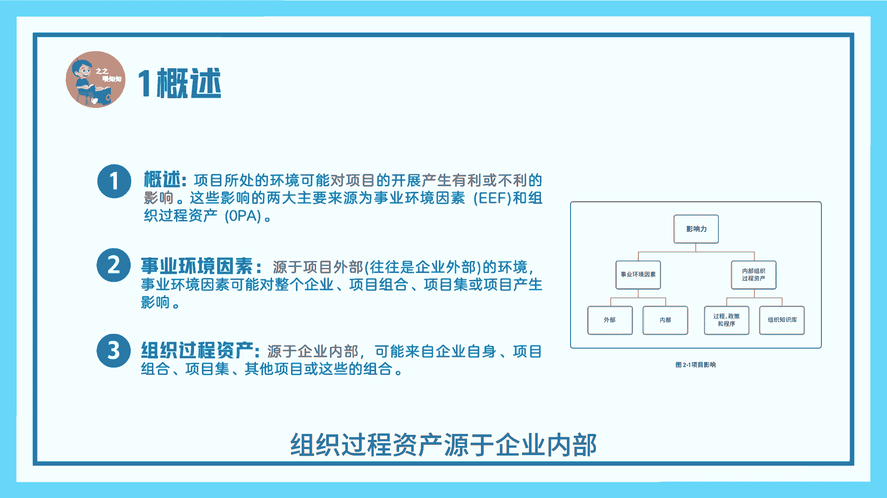
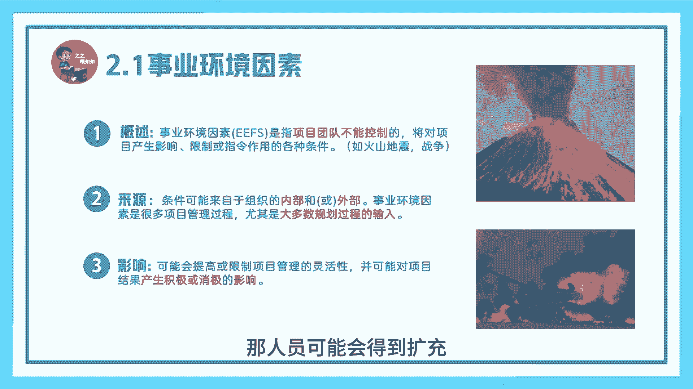
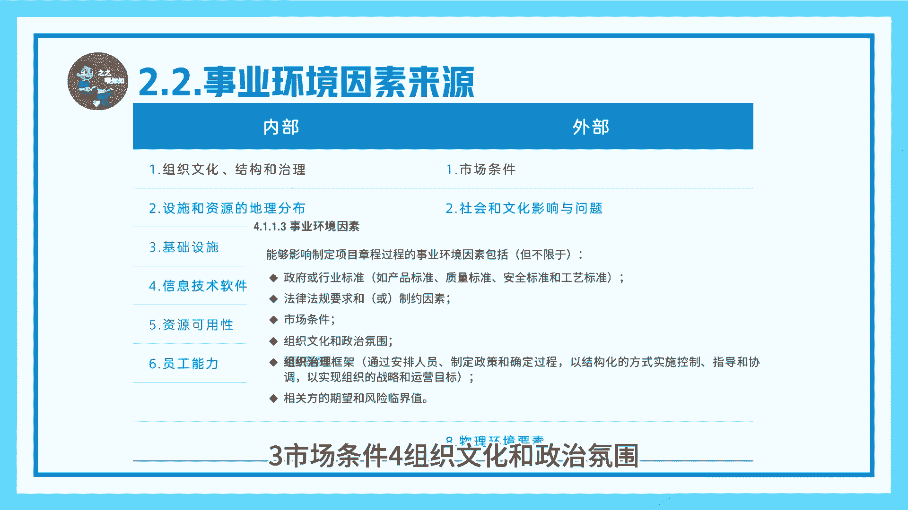
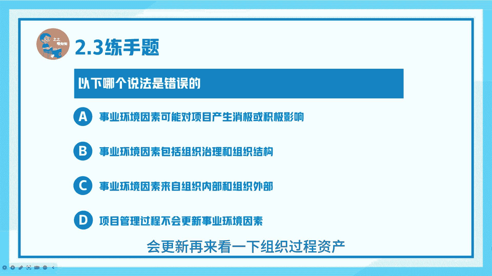
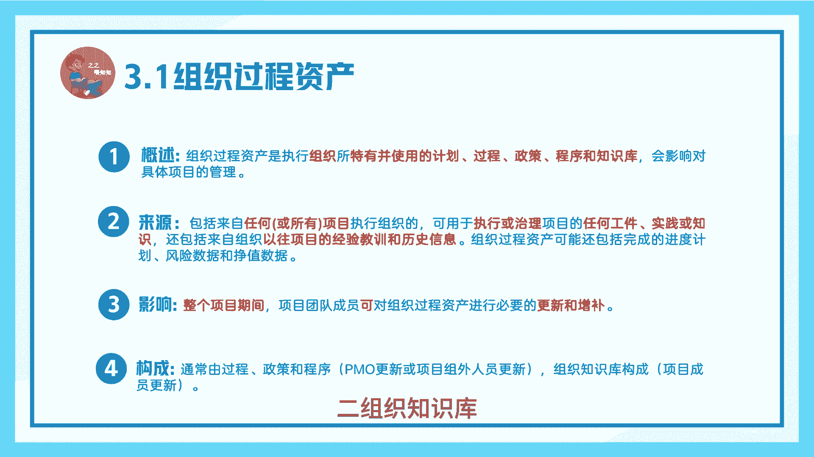
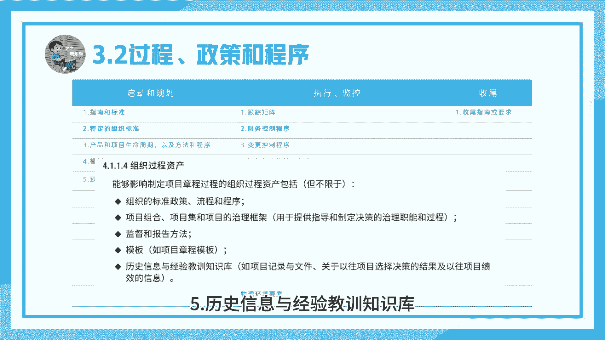
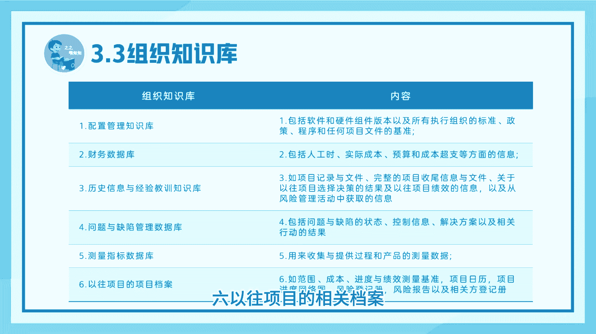
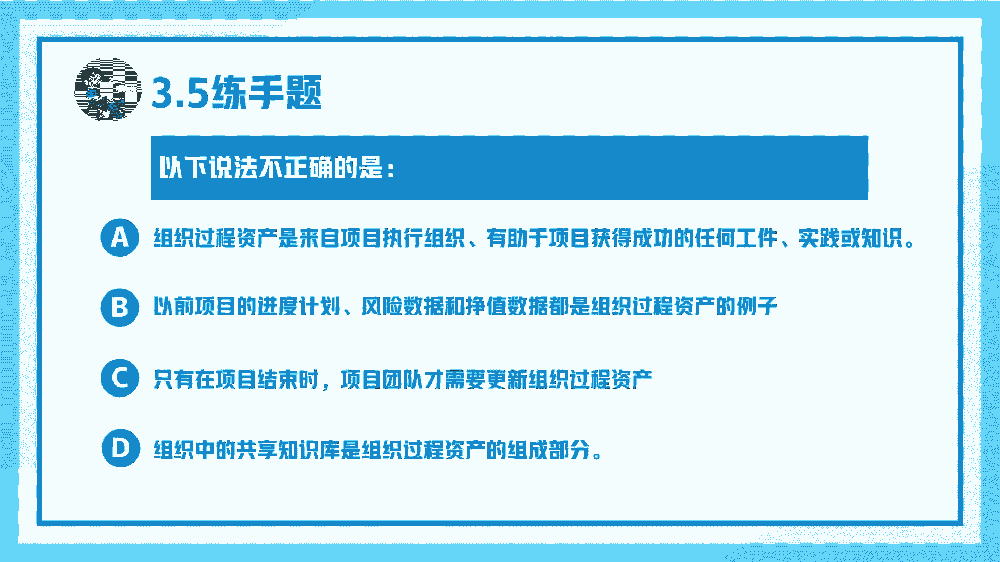
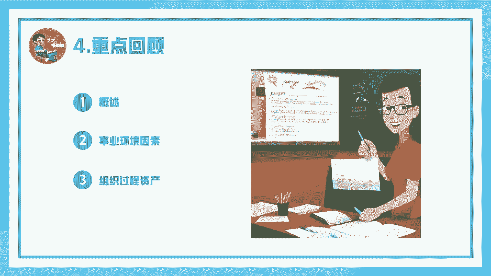

# 项目运行环境-PMP系列第七讲-之之喂知知 - P1 - 之之喂知知 - BV1CuHaekEqq

训导处报告，训导处报告3年二班，周杰伦，马上大家好，今天开始我们PMP系列第七讲，项目运行环境，我是孜孜魏孜孜，先来看一下概述，项目所处的环境，可能对项目产生有利或不利的影响。

这些影响主要来源为事业环境因素和组织过程，资产，事业环境因素源于项目外部，往往是企业外部的环境，事业环境因素可能对整个企业项目组合，项目集或项目产生影响，组织过程资产源于企业内部。

可能来自企业自身，项目组合项目及其他项目或这些组合，事业环境因素，世界环境因素是指团队不能控制的，例如火山地震，他们将对项目产生影响，限制或指令作用的各种条件，事业环境因素可能来自组织的内部或外部。

事业环境因素是很多项目管理过程，有些是大多数规划过程的输入，事业环境因素，可能会提高或限制项目管理的灵活性，并可能对项目产生积极或消极的影响，我们为大家举个例子，比如现在大环境不好，钱大家都拿不出来。

这么可能企业就会降薪裁员，那么你的人员就会受限制，项目进度很可能会受影响，如果环境好了，那人员可能会得到扩充。

那么你的项目进度可能就会有积极影响，事业环境因素来源主要分为内部和外部，内部总共有6。1，组织文化结构和治理，二设施和资源的地理分布，三基础设施四信息技术软件，五资源可用性，六员工能力，外部总共有8。

1，市场条件二社会和文化影响与问题，三法律限制，四商业数据库五学术研究，六政府或行业标准，七财务考虑因素，八物理环境要素，书上也为我们列出了项目章程，包含了事业环境因素，总共有6。1，政府或行业标准。

二法律法规要求或制约因素，三市场条件四组织文化和政府氛围。

五组织治理框架，六相关方期望和风险临界值，这里有这么一道题，大家看一下，问以下哪个说法是错误的，A，事业环境因素可能对项目产生消极和积极影响，正确，事业环境因素包括组织治理和组织结构正确。

C事业环境因素乃至组织内部和组织外部正确，D项目管理过程不会更新，事业环境因素，错误会更新，再来看一下组织过程。

资产，组织过程，资产是执行组织所特有并使用的计划过程，政策程序和知识库会影响对具体项目的管理，组织过程资产来源，包括任何项目执行组织，可用于执行或治理项目的任何工件实践和知识。

还包括来自组织以往项目的经验，教训和历史信息，组织过程资产可能还包括完成的进度计划，风险数据和增值数据，在整个项目期间，项目成员可对组织过程资产，进行必要的更新和增补，组织过程资产由两部分构成。

第一部分，过程政策和程序，通常由PMO或项目外人员更新，二组织知识库。

通常由项目组成员更新，组织过程资产中的过程政策和程序包括三部分，分别是启动规和规划，执行和监控，收尾内容比较多，我就不给大家读了，大家自己看，在书中也为我们指出了，项目章程中的国组织过程资产。

应包括组织的标准，政策，流程和程序，项目组合，项目及项目的整体框架，监督和报告方法模板，历史信息与经验教训知识库。

组织知识库六部分构成，一配置管理知识库，二财务数据库，三历史信息与经验教训知识库，四问题与缺陷管理数据库，五测量指标数据库，六，以往项目的项目档案。

有这么一道题，大家看一下，问组织过程资产可分为A过程，政策与程序和组织知识库，这是对的，其他的三个选项都不完整，再来看一下下面这道题，问以下哪个说法不正确，A组织过程资产是来自项目执行组织。

有助于项目获得成功的任何组件实践和知识，对B以前项目的进度计划，风险数据，政治数据都是组织过程资产的例子，这是对的，C只有在项目结束时，项目团队才更新组织过程资产，这是错的。

我们全过程都需要更新，本节我们主要为大家讲解了组织过程，资产的概述，事业环境因素和组织过程资产。

下一节我们将为大家讲解项目管理办公室，我是孜孜魏芝芝。