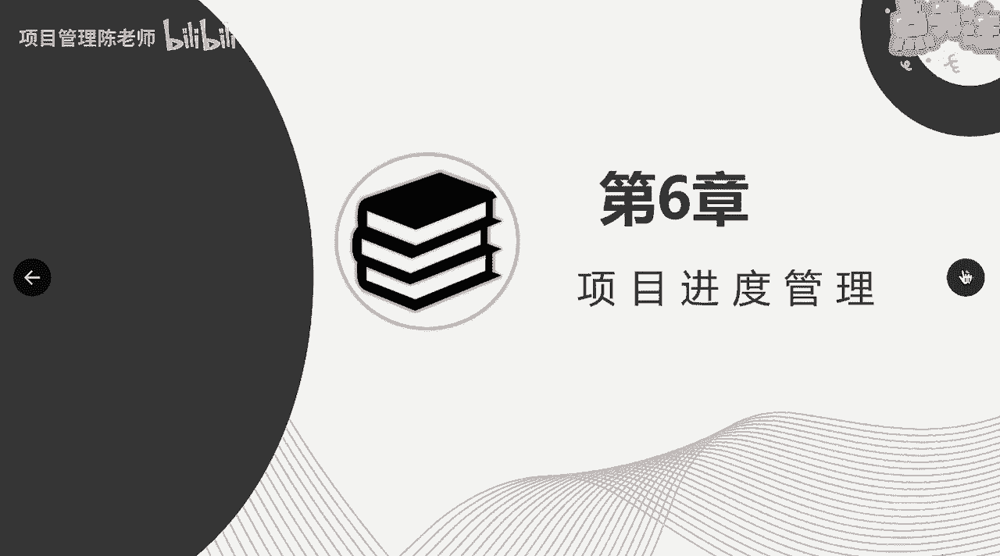
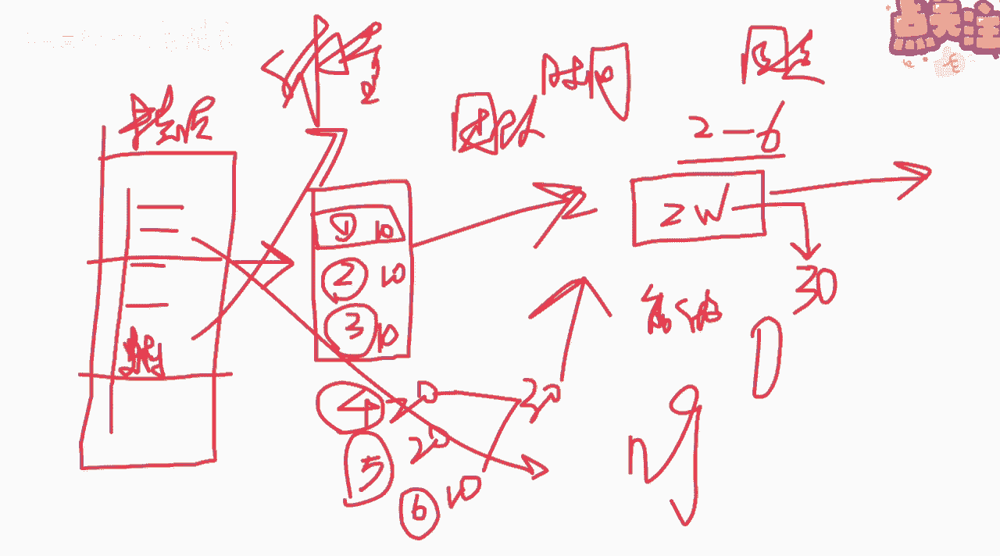
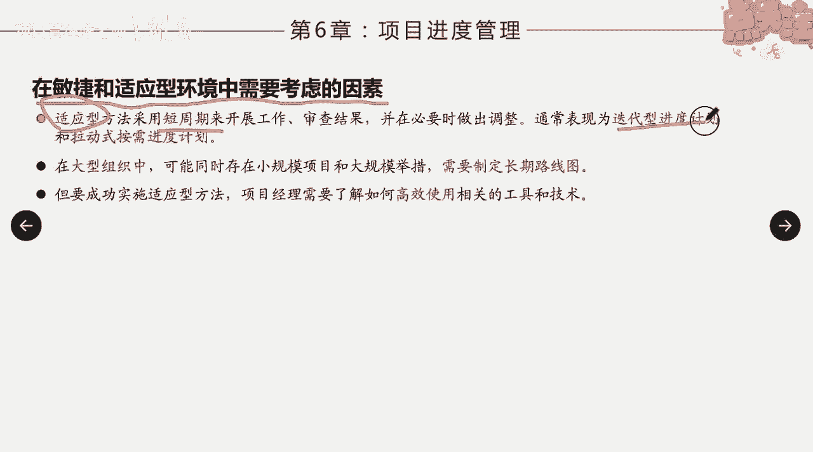

# 项目进度管理概述 - P1 - 项目管理陈老师 - BV1ix4y177ah

好，那今天开始呢我们来讲第六章，项目的进度管理啊，那么进度管理呢，应该说在整个项目管理的过程当中，或者是领域当中呢是比较重要的，因为呢我们都知道项目呢它具备临时性，这个临时性的特点呢。

就决定了项目一定是有明确的开始跟结束时间，或者说他是有工期限定的啊，那么为什么要给项目限定工期，因为呢我们的项目必须在一定的时间内去完成，正是因为有了这个时间的一个约束啊，那我们对进度管理呢。

就要做到什么样高效有效啊，否则的话一旦进度出现失控的一个情况，或者说没有有效的去管理进度，会产生什么样的后果和影响，相信有做过项目的同学呢，一定是非常的清楚对吧，比如说我们进度一旦延长或者是延迟。

那么至少会有出现一个问题，项目的什么呀，风险增大了，对不对啊，我们通常有一句古话说得好，叫夜长梦多是吧，你如果没有尽快把这个项目做完，拖的时间越长，它面临的不确定性啊，或面临的风险就会越多，第二点呢。

项目进度的一个拉长，它的成本是一定会增加的，对吧啊，因为你攻击拉长这些人工啊，资源啊啊都是需要花费一定的成本，所以对进度对于这个预算是会产生影响，所以呢对项目中的一个进度管理。

把它管好还是非常非常的有必要啊，而且这一章呢应该涉及到的知识点，也比较的多啊，也开始涉及到计算啊，所以呢我希望大家能够好好的学习。

进度管理这一章，那么首先我们来看一下项目，进度管理的核心概念，那其实呢整个进度管理，我们也可以管它叫什么呀，项目的时间管理管时间，对不对啊，那么我们怎么来管时间，怎么样通过一定的步骤来规划我们的进度啊。

所以呢这个过程啊，或者说这个领域呢，他主要的做的事情就是以下几步，第一步选择进度计划的方法，你打算用什么样的方法来规划你的进度啊，这里面有说比如说关键路径法啊，敏捷方法，那所以呢我们要依据我们的项目。

它的一个特点来选择我们制定进度的一个方法，就是这是第一个，第二个呢将特定的数据，比如说我们等会会讲到的活动计划，日期持续时间，资源依赖关系跟职业因素等等等等，这些因素呢放到我们的进度计划这个模型当中。

来创建我们的进度计划模型啊，我们把这些相应的这些数据汇总在一起，找出它们之间的相互的关联，最终得到一个进度模型，那么通过以上的工作呢，我们就要输出了项目进度计划这个成果啊，所以在这个过程当中呢。

我们要得到一个项目的进度计划，那也说说明了我们要得到一个叫做什么呀，另外一个基准叫进度基准啊，我们之前已经学过了一个基准，叫什么叫范围基准，那么在这个过这个领域里面呢，我们会得到另外一个基准叫进度基准。

那我们在整个整个项目的过程当中呢，要维护进度基准的一个权威性，因为我们不能随便打破这个进度基准，如果要对进度基准进行变更啊，或者是要进行一个修改，那么我们要走整体变更控制流程，那么在整个项目期间。

要保持进度计划的灵活性，使其可以随着知识的获得，对风险的加深以及增值活动的设计而调整，那么这个怎么来理解呢，就是说这个呢你既要维护他的一个进度基准，但是呢又要说了要灵活对吧，你不能够说我制定完之后。

我就不管他了，就一定严格按照这个来，因为项目的过程当中会发生很多的变化，比如说有一些新的技术的生成，你原来说又采用这种技术，他可能需要一个礼拜的时间，但是现在有新的技术了啊。

可能只要三天的时间就能够完成了，那么这个时候呢，你就要对这个东西进行一个调整，对基准进行一个调整，也可能我们在一开始的时候，我们之前有讲过是吧，叫滚动式规划，在讲w bs的时候。

一开始我们是规划的很详细，对于近期的活动，我们规划的非常的详细啊，甚至具体到每一天，甚至到每一个小时都有可能，但是对于比较远的活动呢，我们可能规划的就比较粗略了，因为呢我们把它叫规划包对吧。

那等到进度到了这个时候的之前要做之前，我们再来对它进行展开，进行详细的规划，那么这个活动呢也是需要去更新，我们的进度计划，使它保持一定的灵活性啊，所以这个是项目进度管理的一个核心的，两个概念啊。

两个概念，另外呢一些发展趋势和新兴的实践，我们也了解一下就可以了，比如说具有未完项的迭代进度计划，什么叫未完项，也就是我们之前说过的什么呀，待办事项对吧，我们说在适应型或者是敏捷型，的生命周期当中呢。

我们采用的也是其实也叫做滚动规划，就是把近期最着急，最优先的这么一些一些进度和活动，我们把它拿出来，先做详细的规划啊，比如说把需求记录在用户故事当中，按照一定的优先级排列。

然后呢在规定的时间和内开发产品的功能，那这个怎么来理解啊，我们可以来稍微说一下，在敏捷的过程当中呢，我们通常是有几个东西，几个概念，后面我们讲敏捷的时候会详细的讲，在一个冲刺里面的一个时间。

哪一个冲刺里面的一个时间通常是固定的啊，固定的啊，时间是固定的，一般呢两周到六周的时间我们称为一个迭代，称为一个迭代，或者说成为一个scream啊，成为一个冲刺啊，那么两周到六周。

假如说我们说是定两周吧，好两周里面我们这样就得到了一个叫什么呀，时间和两周，两个礼拜啊，two weeks啊，两个礼拜，那么我们两个礼拜要干什么，其实这也是涉及到进度的问题，对不对。

因为时间已经给你恰好了，那么我们会怎么样呢，我们会在这里这个所谓叫未完项啊，未完下，我们刚才说了未完项也叫待办事项列表，那么我们的产品负责人会在这里面呢，列出我们这回项目里面，整个项目所有需要做的事情。

他会以用户故事的形式来表现啊，那比较详细的可以确定的，我们管它叫用户故事，那么比较宏观比较宏大的，我们叫什么呀，之前有说过叫史诗是吧，史诗级用户故事啊，那我们这个制定好整个的未完项都是这些。

那么接下来我们会通过什么呀，迭代的一个准备会啊，来我们来确定我们在这一次迭代里面，要完成的事项啊，比如说在这次迭代里面，这次scream里面我们要完成三个东西啊，三个东西，那么这三个东西呢是谁来定呢。

是团队来定的啊，团队来定的，团队呢会一开始先对自己的这个整个，就比如说在两周里面，这个能完成多少故事点做一个估算啊，比如说我在两周里面我能完成过，大概我能完成这个30个故事点好吧，30个故事点。

关于故事点的估算，我们后面也会讲，他有一个方法可以用一个一种估算的方法，两个礼拜我能完成30个故事点好，那么我们接下来就开始来来在开这个冲刺前，这个迭代会议的时候，我们就会说来。

第一个用户故事包含了多少个故事点好，它包含了十个故事点诶，那么第二个包含了多少个哎，包含了十个，第三个包含多少个，包含了十个，好，正好满足我们两个礼拜里面，能完成30个故事点好。

那就进入到我们的冲刺里面，那假如说我们研究完之后，这次迭代结束了，下一次迭代开始的时候，我们挑了第四个雇用户故事，跟第五个用户故事啊，或者说456456用户故事啊，然后呢。

团队来评估这个用户故事需要多少个故事点啊，假如这个需要20个啊，好这个需要多少个啊，这个也需要20个啊，这个需要多少啊，这个十个好，那么只需要50个故事点，超出了我们什么呀。

我们这一个冲刺所能达到的极限，那么我们就会商量我们是不是第四跟第五，看哪个最更优先，我们优先完成哪一个也保持我们的什么，比如说我们留下四跟六三十个故事点好，我们把它放到我们的这。

下一次第二次通知来把它完成啊，所以这个呢涉及到故事点的一个估算，那么这里面的一个进度管理呢，其实就相对来说比较的什么呀，比较跟我们传统的不一样了，他是在要做之前才来规划我们要做多少事，而且时间是固定的。

在这次迭代完之后，我们是要完成这些的，假如出现没有完成的情况怎么办啊，假如世界没有完成的情况，那么我们可能就会出现没有，不是变更哈，可能就会说把这个未完成的这个用户故事。

是不是我们可能是放到下一次迭代去完成，还是怎么样一个情况啊，所以这是在敏捷环境当中，我们有这样的一个一个方式啊，所以大家看建造之前先优化用户故事，然后呢在规定的时间和内开发产品功能啊，在规定时间内完成。

然后适用于呢向客户交付增量价值啊，小规模小小幅迭迭代，同时允许并行开发量大，内部关联小的功能的好处，允许在项目整个生命周期内进行变更，比如说我们开发的这个刚才说的这个东西啊。

这个这个里面用户故事它的体量很大，体量非常大，都是用史诗级故事对吧，那么我们可以怎么样啊，同时引入几个敏捷团队对吧，有几个敏捷团队来完成，比如说我把它分为几个模块，这里一个模块，这里一个模块啊。

这个模块由项目a负责，项目组a这个模块由项目组b负责，那么他们每一个人都其实都得到了一个，未完项的列表，是不是，然后也可以按照这种方式继续的去推进。

所以这里面就说了，他的意思是什么呢，允许在整个周期内并行开发量内部关联较小啊，两个模块是相互独立的，你可以用这种形式，第二种趋势呢叫按需进度计划啊，基于资源理论，来自于精益生产的拉动式进度计划啊。

这个呢比如说我们后面会讲到看板，什么叫精益生产，精益生产这源自于日本的一种生产方式，就是说什么呢，以前啊以前啊大家生产的东西，就是我今天备备一些料，对吧啊，完了之后呢安排几台生产线。

然后就开始哐哐哐哐哐开始在做了啊，然后呢会出现什么情况呢，出现第一道流程啊，他比如说有第一道流程，第二道流程啊，第三道流程好，那这个时候会出现什么情况啊，第一道流程原材料准备了，这些做完好。

马上要到第二道，但是第二道流程呢它会出现怎么样，它没那么快啊，没那么快，他会在这边积压很长的一个时间，或者说碰到了问题，它的产能是比较慢的，那么结果他没有完成第三这个流程，他就没办法开始啊。

然后呢一这个流程呢又拼命的，往往这边一直一直生产对吧，他都停不下来啊，它卡住了，他也做不了，那最终你你说你这个生产出来的东西，能够能够及时的交付吗，不行，所以精益生产是怎么样呢。

就是在每个流程里面最多能生产多少呢，我给你按看板的形式来来做，比如说呢在第一个里面我允许你做100个啊，你的产能是100个好，到我这边变成50个啊，我允许的最多是50个，你每次给我的只能是50个好。

那你比如说一你每次就会说，那我就生产50个对吧，我给你50个啊，这50个我能消化，我再给下一个流程啊，你不会去说我一开始就生产100个，那100个完了之后呢，你没有交付到下一个环节。

你就没办法再生产100个啊，这个讲大家可能现在听不大懂啊，没关系，我们后面讲敏捷的讲看板的时候会详细来说啊，这是按需精益生产，这是节约资源啊，他的做法呢在资源可用时啊，立即从未玩象根里面提取出来，用。

适合在持续运营的环境中以增量式开发产品啊，任务规模相对类似，可以按照规模和范围进行组合的工作啊，这叫按需进度计划，这个我们大家先了解一下，后面我们将敏捷的时候会细细展开啊，然后在敏捷和适应性环境中。

需要考虑的因素是什么呢，适应型方法采用短周期来开展工作啊，表现为迭代进度以及呢拉动式按需啊。

然后呢在大型组织当中可能存在小规模项目，跟大规模的项目呢合在一起，那需要制定长期的路线图，那么要成功的实施适应性方法，项目经理的需要了解，如何高效地使用相关的工具和技术啊，比如说我们的迭代冲刺会。

那比如说我们的这个呃呃这个这个看板，这些工具和技术，我们都要灵活的去使用啊，依据项目的不同来灵活的应用好。

