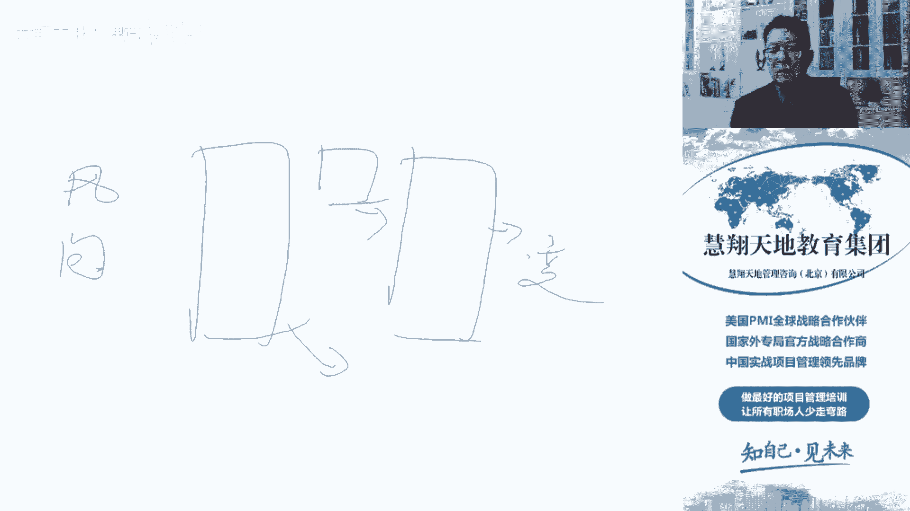
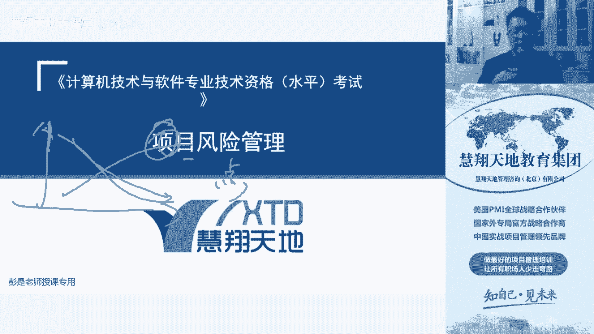
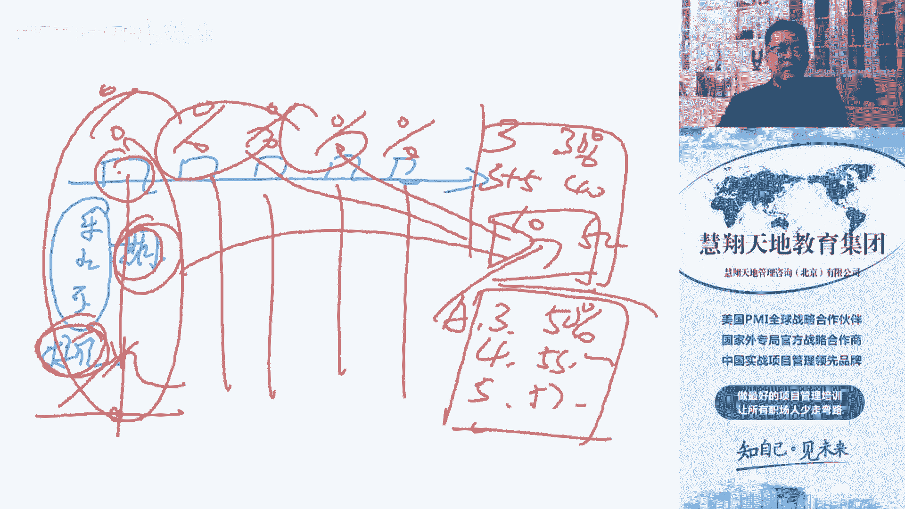
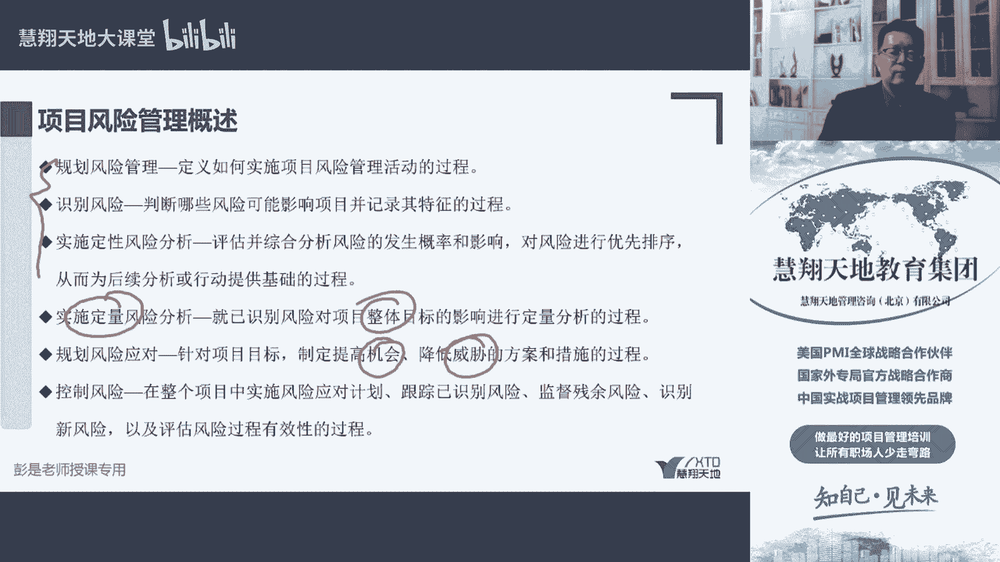

# 项目风险管理概述 - P1 - 慧翔天地软考 - BV1C14y1z78e

然后接下来我们花一点时间，把风险管理章给大家起个头，风险管理这章啊，实际上这个是离大家工作可能会比较远，其实做做得最不好的就是风险管理不重视，就像，啊，就像其实跟这风险管理这样结合到疫情去去记。

你倒比较容易记啊，就像经历过疫情这个事以后，大家现在普遍都具备了那么一点点，风险艺术对吧，但是这种临时的事情啊，一旦变成长期变成常态化的事情，大家这个风险意识啊就会慢慢慢慢慢疲劳是吧，麻痹大意。

这于是就会出现了一些什么歌地亚零星啊，又出现了一些问题，所以风险意识，风险意识我们做一些临时的事情，临时的事情，这个风险意识就尤为重要了，你要说常态化的事情确实是那么久，病床前无孝子，就这个道理。

时间太长，时间受不了对吧，但是临时的事情我们也咬咬牙努努力，还是需要值得花一些时间和精力去去分析，这个经历过疫情，你就想吧，疫情一开始大家风险意识都非常高，草木皆兵对吧，防火防盗防防治，草木皆兵啊。

任何一个风险点都不放过，各种各样的朋友圈，什么什么微信群找资料找信息啊，看看怎么来不让自己传染上，找到各种各样的风险点，找到各种各样的风险点去看看怎么办吧，能不出门就不出门，能少接触就少接触对吧。

不得不出门的怎么来消毒，开窗通风，把邻居一咳嗽马上关上去，风险意识非常高，那对项目来说也如此，项目刚才讲那张叫插图啊，我也不不带反复念了吧，前期不确定性高，随做随着工作的开展，这些不确定会越来越少。

那变更的代价，变更的代价，项目后期非常大，所以虽然虽然不确定性会越来越小，但是这些风险万一它一旦发生，产生的影响会比较大，所以这一章就在强调这个事儿我们怎么去做。

那怎么去做，一共分成了六个六个管理过程，这六个管理过程学过p mp第六版的同学，要忘掉那个实施风险，应对那个管理过程，第六版是七个，那第一个管理过程规划风险管理，这没啥收到就去分析呗。

我们这个项目风险咋管，写个指导性的计划，所以叫定义，如何实施项目风险管理活动，怎么去识别，怎么去实施定性，怎么去定量，怎么规划，应该如何去控制风险，告诉我们后面视频怎么去开展。

那告诉我们后面这些事怎么去开展，之前我们要先有一个东西叫定义，这是至少要记住的啊，叫风险的概率和影响定义，先说清楚，对咱这个项目来说，什么算是低风险，什么算是中风险，什么东西算是高风险，就像疫情对吧。

我们先搞清楚，我们在低风险地区还是中风险地区，还是高风险地区，这个事情搞清楚了之后，我们后面的行动方案才能明确呀，才知道怎么办对吧，低风险地区啊，不用扫码了，户外不用戴口罩，现在也不用喷酒精消毒了。

不用管这么严，核酸钾也不需要了，中风险地区不一样对吧，需要戴口罩，需要到处扫码登记，还需要什么什么往来出差，需要什么核酸证明高风险地区就索性就呆着吧，别动了对吧，不要流动了，少流动，减少不必要的流动。

先想办法把这个东西控制住，那对项目来说也如此，咱们先要提前说清楚，到底对项目来说，什么是低风险，什么是中风险，什么是高风险，后面我们找到了风险以后啊，才能知道知道知道知道这些事情怎么去处理。

那对项目来说，什么是中，什么是低，什么是高，再拐个小弯，这个取决于项目的具体情况，取决于项目的具体情况，取决于公司的情况，这句话其实说白了就是，我现在有一个亿的一个项目，然后啊员工跟我说呀，对吧。

不说涨多少钱呢，100块钱，这都不叫事儿，小事儿小事儿，毛毛雨，那以此类推，我现在有个100块钱的项目，涨价100块钱，这事儿就大了，这事又大了，以此类推啊，我们要根据公司的情况。

根据我们和甲方签的协议，根据公司有钱没钱，根据我们的范围，进度，成本质量，我们的分析结果来评估，还是否出现了一些会影响我们实现目标的，这些因素会影响到范围啊，进度啊，成本啊，质量啊。

至少我们能够考虑到一个时间，一个前让项目延期一个月，两个月，三个月，一秒钟，两秒钟，三秒钟，这个事情他们的重要性，重要程度是不一样的，影响我们项目100块钱，200块钱，十块钱没关系啊，1000块钱。

1万块钱，一个亿十个亿，八个亿，这事儿也不一样，所以我们在规划风险管理的时候，先把这个搞清楚，对答案，项目来说，对咱项目来说吧，可能100块钱的就不叫事儿，低风险可能什么什么1万块钱重新写啊。

100块钱的不叫事儿，低风险可能1万块钱到5万块钱，还这个区间，我们还咬咬牙能撑得住，中风险大于5万，收不了了，受不了了，高风险大家炒股也如此吧对吧，股价浮动1%也没关系，股价浮动到5%到10%。

受不了了，超过15%绝对受不了对吧，小心脏扑通扑通的，所以根据根据项目的情况，根据企业的情况，公司的情况，还要根据人的情况，因为为什么要说炒股呢，有的人赔到了1%哎呀，不行了，受不了了，割肉了。

有有的人赔了50%对吧，气定神闲，没关系，小事儿不在乎，所以其实每个人每个人对这个风险它的重要性，它的感受起了个名字叫风险的态度，态度啊，偏好啊，都是这个意思啊，态度和偏好不一样，有人喜欢冒险。

有人不喜欢冒险，比较保守，所以根据这三个因素，我们来决定对项目给出一个定这样的定义啊，低风险中风险，高风险唉，这是规划风险管理最重要的一项工作，是未来整个项目风险管理的基础对吧，如果碰上土豪的企业。

又是土豪的项目，再加上土豪的领导，领导和你说了，反正这个项目啊一共100万100一共100万，亏损什么10亿蚂蚁咱都扛得住，没关系，随便造可劲造毛毛雨，这种情况下，所有的风险就全都是低风险对吧。

那如果碰上我们需要赚钱的项目，甲方又比较抠，公司现在经济形势还不太好，那这个项目我们可能赔个十块八块的都受不了，所以规划风险管理，除了且各个管理过程的指导指导手册，风险管理计划。

那风险管理计划里面一定要记住这个风险，概率和影响定义，把这个东西搞清楚，后面我们在看书的过程中还会发现，根据风险的概率和影响定义，我们还要总结出一张图叫概率和影响矩阵，有了概率影响定义。

有了概率和影响矩阵，后面第二个管理过程都不用讲，第三个管理过程也不用讲，第二个管理过程是识别风险，就是找风险，第三个管理过程叫实施定性，风险分析是评估这个风险发生的概率和影响，来对风险做排序。

概率和影响，比如说这个影响100块钱，1000块钱，1万块钱诶，它的影响大小就决定了它优先级的高和低，重要性的高和低，那这个高和低到底100放到哪儿呢，取决于刚才得出来的风险概率和影响定义。

公司说了1000块钱以下都是低风险对吧，1000~5000是中风险，5000以上是高风险，现在有一个风险可能会让我们超支1000块钱，这就属于一个中优先级风险，有一个1万块钱的属于高优先级风险。

以此类推啊，这是我们要现在知道这么多知识点，那只知道影响不行，我们还要考虑概率，还要考虑概率对吧，明天可能亏损1万块钱，明天可能亏损1万块钱，概率是多少呢，万分之一还记得刚才说吧。

常态化以后有侥幸心理了，唉侥幸心理就是这个概率，我们还要看概率，万分之一还没关系，有的人喜欢冒险，觉得这不要不重要，有的人比较中庸，也觉得不重要，有的人比较保守，1%受不了，受不了。

每个人对这个概率的感知感受也不一样对吧，1%，万分之一，1‰，百分之百，80%，70%，那不同的概率我们还要考虑了它发生的概率，发生的几率也会决定这个风险的优先级，所以现在在刚才的基础之上。

我们在这个概率和影响定义里边还要加上概率，说清楚，对这个项目唉，比如说发生的概率啊，达到70%以上了，大概率事件了，然后导致我们工期唉成本吗，成本影响是1万，我们认为是一个高优先级风险。

如果在这个概率以下，我们还能接受，我们赌得起，就像大家打麻将一样吗，玩扑克对吧，也一样，都是概率啊，所以这是前三个管理过程，前三个管理过程啊，第一个管理过程出概率和影响，告诉我们高中低风险都是什么样子。

这个称之为概率影响定义，第二个管理过程是找风险，去看看整个项目里面都有哪些不确定的东西，把它找出来，第三个管理过程是评估这个风险，发生的概率和影响，然后使用我们的定义得出这个风险的优先级。

所以讲到这么多，前发过程讲完了，然后第四个管理过程是实施定量风险分析，这个需要单独讲关键词，先记一记整体目标，关键词是整体目标，这段下这段听完了听完了想一想，咱之前讲到过一个三点估算，又讲到了标查房产。

如果我们项目里边有很多个活动对吧，每个活动有一个最乐观，最悲观，最可能有这么三个数字，有这样三个数字，就说明这个活动，它的工期或者是成本存在着不稳定的现象对吧，快的时候一小时，慢的时候两个小时。

大多数情况下可能1。5小时，不确定，从我家到公司到底多长时间拿不准啊，除非车街上一辆车都没有，那这个时间我才有把握，否则不确定，那既然存在着不稳定，我们来评估这个活动在一定时间内完成的概率。

于是我们用了标准差算，用这个最乐观，最悲观最可能算出来期望时间，又用最大减，最小除以六，算出来标准差，然后啊我们结合到正态分布，那三个概率正一个标准差，两个标准差，三个标准差概率六十八九十五。4%。

四九十六。72，根据期望值，根据标准差，我们就能够评估这个一项活动，单一活动在一个区间里发生的概率，然后如果存在着多项活动，多项活动，每项活动都有这样的不确定性，我们都可以得出一大堆概率，好。

那接下来我们要想办法评估整个项目的工期了，评估整个项目的工期，我们就需要有一个进度模型，也是模型吧，然后把每个活动这一大堆数据，这一大堆数据都得放到模型里面去，比如说活动A在三天内完工的概率是，50%。

四天内完工的概率可能是51。7%，五五天内完工的概率五十五十八五十九，以此类推，每一项活动都有一大堆一大堆一大堆的概率，这数据对吧，想一想那个正标本就干这个事儿啊，有了这么多的数据，然后带入到这个模型。

我们才能得出整个项目工期的概率分布，整个项目工期的概率分布，就是项目在三个月内完工的概率，比如说30%，三个月加五天是40%，加十天，50%，以此类推啊，就能够得到项目的里程碑概率分布图。

项目的工期一的概率分布就是项目的。

整体整体目标，所以它会得出我们项目的整体的，进工期的概率分布，项目的整体的成本的概率分布，前面我们三点估算，算的是单一活动或者是几个活动，那如果我们的WBS里面有很多工作包，这些工作包下面有一大堆活动。

如果复杂项目，如果是复杂项目，我们都需要有我们的进度模型，把这些数据带进去，得到整个项目的工具概率分布，所以这是定定量风险分析，干这么干的这件事儿，看到他要想到三点分布，三点估算就是建立一个模型。

输入各种各样的数据来进行模拟，得到整个项目工期的一个概率分布，知道我们在一年一年，一年半，两年，3年四年还需要多少时间完成整个项目的工作，这是第四个管理过程，后边两个管理过程就简单了，规划风险应对。

看名字就不用解释了，规划风险应对，制定应对措施，所以制定提高机会，降低威胁的方案和措施，就想策略，比如疫情期间我们测体温，戴口罩消毒对吧，晒太阳提高免疫力，锻炼身体都是为了降低威胁对我们产生的影响。

降低威胁发生的概率，尽尽量的让我们不传染，少接触，所以就是规划这些风险的应对措施，然后最后一个管理过程控制风险也被删除了，什么实施应对计划什么的，跟踪识别的风险监督，看看有没有残余的风险啊。

看有没有风险，有没有新风险，看评估风险管理过程的有效性，就是控制过程做的事情，看看这事儿干的怎么样，哪些地方做得好，哪些地方做的不好改进，所以这是大概这风险这一章，六个管理过程最核心。

最核心最核心的是前三个要回顾回顾那个道理，然后定量风险分析把它想到三点估算，三点估算估算的是个体，我们来评估整体规划风险应对考点，重要的考点一定是这个机会，怎么应对威胁，怎么应对，应对策略。

怎么回避转移，减轻接受，开拓，提高接受，要知道这个应对策略，所以这是大概这一章。

