# 领导力原则--俞敏洪 - P2：02 - 清晖Amy - BV1BJ4m1u7YW

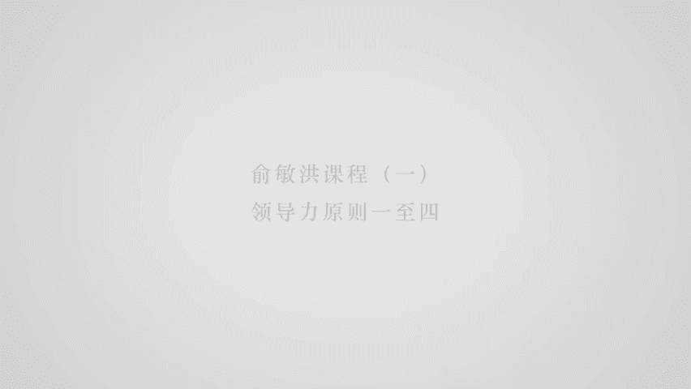

好谢谢各位，早上好，特别感谢啊，首先呢呃感谢混沌大学给我这个机会呀，就是我跟混沌大学还是很有缘分的，因为李善友老师在创立混沌之前，就是我的好朋友啊，所以混沌的这个创想，其实我还有一点点小贡献在里面。

呃那么呃今天因为让我讲领导力原则嘛，我是没有理论性的东西的，所以我只是从个人的一些就是感受啊，来给大家提一下，我列了24条原则，其实没有立全已经太多了啊。

但是呢给大家啊随便讲一讲啊，那第一个原则呢，我觉得领导就是个性原则啊，我认为这个呃领导力呢，而是来自于这个人本身的这个个性，和他的本身有个性所产生的个性魅力啊，这是真的啊。

那么实际上就涉及到的是我们的个性，能不能培养的问题，我认为呃我们的个性是能够培养的，我曾经真的亲身培养过一个特别小气的人，居然我把他培养成了一个特别大方的人，就是他特别小气，完了以后呢。

我就要求他每个礼拜必须请人吃饭，吃到到最后山穷水尽为止，完了呢我要叫他去挑吃饭的人数吃饭，他想跟谁吃饭，有的他如果邀请不到的，我帮他邀请，但是你就得请人吃饭，就是你旧的不断的把自己身上的钱掏出来。

你对于对一个小气的人来说，不断的掏钱这件事有难度的，大家不要以为在座的都很大方，这件事情往大扩展了以后，当你一个公司做大以后，你愿意不愿意把股权分给大，家，愿意不愿意把年终的奖金给大家多分点。

其实跟这个是密切相关的是吧，所以实际上是能培养的，后来这个家伙终于意识到了，跟人一起吃饭变成好朋友有多么的重要，就他突然发现了花钱背后，就是我刚才所说的投资，这个投资背后所带来的好处是多么大。

所以呢忽然看了，后来变成了一个很大方的人，所以明白这个意思吗，就是说很多时候，其实我们有的时候是被自己给局限住了，那么我觉得就说在个性原则中间，我比较看重的就是四个跟领导力相关的原则啊，是三观的东西。

第一个是一个人必须要有主动积极的能力，英文叫做positive，对不对，或者take the initiative啊，那这个概念什么呢，就说任何事情，如果说你能够主动的去参与。

并且呢即使你作为参与的时候，你不会作为领导人，甚至你觉得参与的时候就是甚至被别人疏忽，你还愿意去参与这件事情，你不太顾及自己的面子，也不太顾及自己的感受啊，那么这件事情就表明了你有参与能力，有参与能力。

实际上是领导力的第一步，那第二步呢就是合群友好，也就说实际上你必须在一个群体中间，你必须变得这个群体的一员，当然如果说在这个群体中间，最后你能变得这个群体的一个领导人，那是再好不过。

但是至少你要加入到这个群体中间去是吧，你要必须能够融合到这个群体中间，最后才能够有机会啊，得到更好的可能往上升的这个通道啊，比如说现在我们之所以大家愿意上商学院，E n b a n b a。

实际上非常重要的一个原因是，因为你跟这个班级里面就变成了一个群体，但是我们进入ENBANBA班以后，我们会发发现包括混沌创业营的班，我们会发现，有些人是在这个班内非常积极主动的啊。

有些人在这个班内是旁观的，有些人甚至是游离在这个班级之外的，那么我觉得游离在这个班级之外的人啊，只有两种可能性，要不就是他是个不合群的人，那这件事情你像倒过来，变成这个班级的这个这个这个这个这个领导人。

这是比较难的一件事情，要不就是他有更大的，比这个班级更重要的事情啊，来来干，那就是另当别论了，对不对，这个并不是说游离在群体之外，你就没有领导力了，这个开开朗坦诚啊，啊果断坚毅啊，这两件事情啊。

其实大家也能看明白，就是啊并不说一个领导人这四项都要有，而是只要有其中的一到两项，其实就已经奠定了你被人喜欢，被人接纳，以及最后有机会，你能够成为领导人的这样的一个基础，这个是非常非常重要的一件事情。

我是一个很愿意跟人交流，也很愿意跟人分享啊，也就是做事情也比较坦诚，就是呃我是一个难得装逼的人啊，也就是说更多的时候我是愿意一个啊兄弟啊，兄长啊，以及这个就是朋友的这个身份出现，而不是一个就是老师。

或者所谓导师的这样的身份出现，这也是很多小年轻跟我在一起打交道，依然觉得我还是比较舒服的。

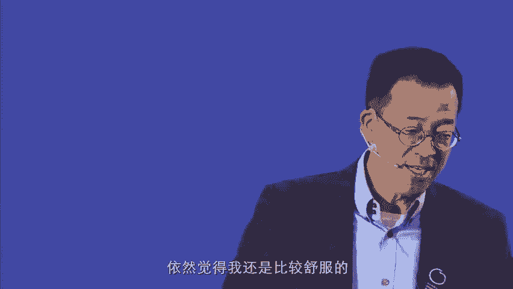

这个一个比较重要的原因，那大家都知道你如果拥有前面的个性特征的话，那么你的分享原则上就不会太困难是吧，这个分享包括了情感分享，知识分享成就分享利益分享，那我来讲一个就是我分享的小例子。

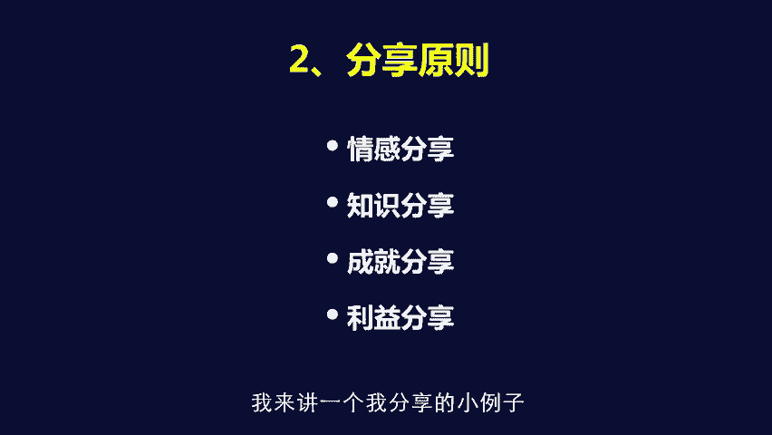

因为分享实际上是你最后啊，能够就是变成一群人的，这个关注度的一个基础啊，我每一个这个这个原则下面都会有一个小故事，实际上我的小故事就是我小时候的时候，就是呃是一个就说啊，在家里没有什么人跟我玩的人啊。

但是呢，因为我有一个相对来说比较大方的这个个性，而且呢我有一个就是刚好有一个，就说资源可以利用，就是我妈的姐姐，就是我的亲阿姨，是在上海呢，它是一个就是呃是是是是住在上海，就解放前就到了上海。

所以呢每到过年的时候呢，他都会给我捎两斤水果糖回来，要不他自己亲自拿回来，要不就是请人捎回来，大家都知道，对于农村小孩来说，有两斤水果糖这件事情是一件特别珍贵的事情。

那一般的孩子都会把这个水果糖放在家里，就自己吃掉了，很少会跟别人分享，但是呢我当时呢出于一种急迫的，想要跟小朋友们就说玩的这样的一种心理状态。

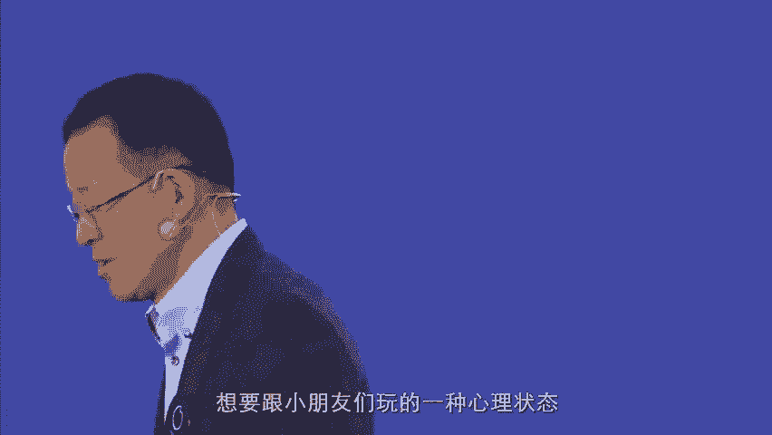

所以呢我自己呢就不吃那个水果糖，我专门把这想留着，去勾引那些小朋友到我家里来玩，那这些小朋友听说有水果糖吃。

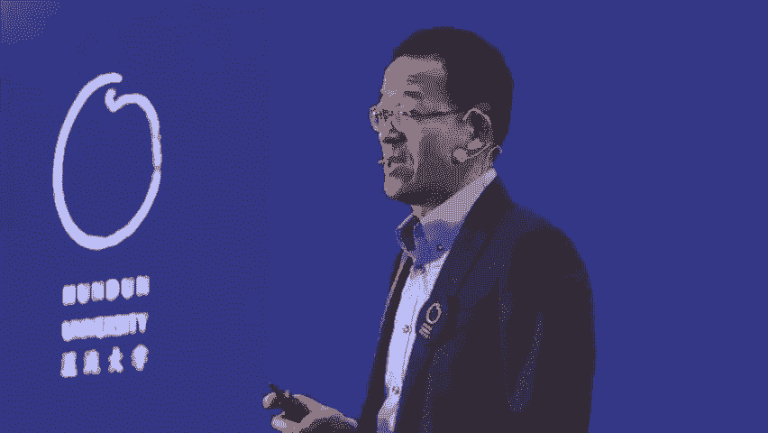

那他们就回来玩是吧，那么这样的话等于我把水管当封他们，我买的都是他们的什么跟我玩的友情，而且在这个过程中间，我迅速取得进步，刚开始我是一次性分完，结果过了半个月，他们又不来跟我玩了是吧。

后来我就意识到了，这样一次性分完这件事情是很麻烦的，我必须逐步的分啊，所以呢后来我就变成了就说每次来跟我玩，每人一颗水果糖，完了过了一个礼拜，你再来跟我玩，还可以有一颗水果糖啊，所以呢大家会发现。

就说我实际上在采取的什么呃，利益分享原则，就说我有这我有这个东西在这，但是我跟你分，但是跟你分的前提条件是你必须跟我玩是吧，所以很快的这个小朋友就聚集在了我的身边，而且我紧接着很快的就又发现。

这件事情是可以利用他们来帮忙干活的，因为我们农村孩子，每到放学以后都要外面去割草，割草的时候，我就顺便拿几颗水果糖，谁把我的篮子搁满了，我就给他一颗水果糖，其实到最后就变成了割草的时候，我根本就不用割。

我的篮子是第一个买的，买完以后他给他们一颗水果糖，完了以后我就坐在边上，等他们把自己的篮子再割完了以后，我们再回家，在这过程中间潜移默化的我就变成了我们村，当上小朋友的头，就变成小朋友的头。

所以你会发现就说一件小事啊，后来有人问我说，于老师，你后来做新东方是怎么做起来的，我说我小时候的这个故事，其实给我做新东方带来了，无穷无尽的这样的一种启示是吧，我新东方刚是一个人做的那把王强。

徐小平他们叫叫回来，就是大家一起来分堂是吧，所以这么一个过程，那分投的过程中间有条件，就是你要想分到我的堂，你就必须跟我一起把新东方一起做大，新东方就是在这样的不断的分配，就是把它做大的，所以很简单。

就说一个人就说当人感觉到你这个人啊，就是说到情感分享啊，当一个人感觉到你背后总是藏着点什么东西，掖着点什么东西，就是不够坦诚，让人不可不能达到几乎100%的trust，这种信任的程度的时候。

你就已经失败了对吧，就是你你招一帮人跟你一起干一个事业，但是这帮人对你不能给予100%的信任，总觉得你这个人背后有点猫腻，完了你的甜酸苦辣也不愿意跟大家分享啊，完了你在利益分享的时候又躲躲闪闪。

总是舍不得拿出点东西来，或者总是被别人所强行要求了，最后你发现你不得不再拿出东西来的时候，这件事情就麻烦了，所以呢啊实际上就是让人感觉到，就是就说有有有有难同当有有有有乐同享，就是有福同享。

这件事情其实是无比重要的一件事情，让大家感觉到在你身边做这件事情，跟你做的事情，他不用担心他的利益问题，也不用担心他的情感会受到伤害，他觉得到最后你总而言之，到最后你会给他足够的回报。

这件事情是非常非常重要的啊。

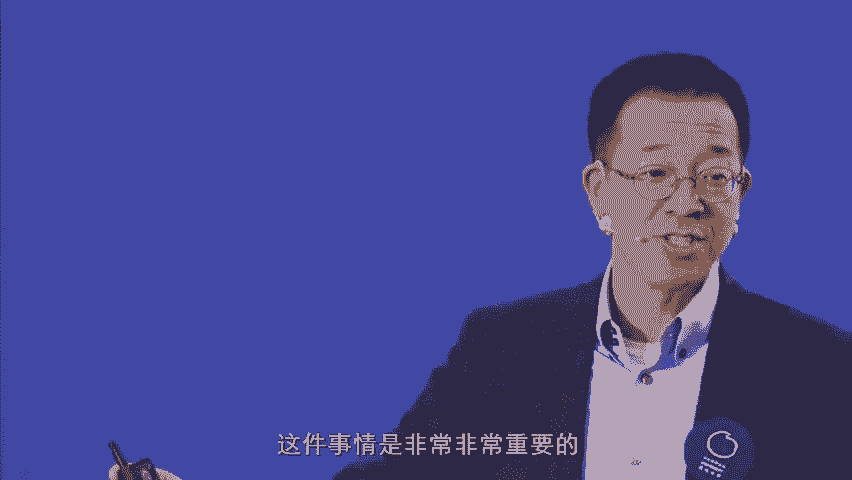

当然了，看人要看准了，因为有的有的领导人呃。

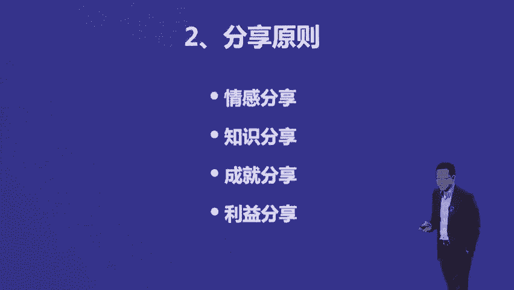

其实不一定能够有福同享的，有难同当是可以的，比如说越王勾践，大家都知道是吧，在越王勾践把吴王夫差给灭掉了以后，范例就非常的聪明，说赶快泛泛舟江湖，赶快走，因为他觉得越王勾践是一个不能由福空降的人。

但是文中没有想，没觉得这个没有问题，我们跟他一起打天下，那么那么好，最后我们跟他一起共享天下，我们也没什么野心啊，他他能拿我怎么样，所以就待在了越国，结果呢这个越王过节过了一段时间，就给了文中一把剑。

说这把剑唉，你好好留着，文中一看，这把剑就是原来什么他的父亲啊，赐给这伍子胥，让伍子胥自杀的这个一把剑是吧，最后文综就明白了自己活不下去了，就说也就意味着什么呢。

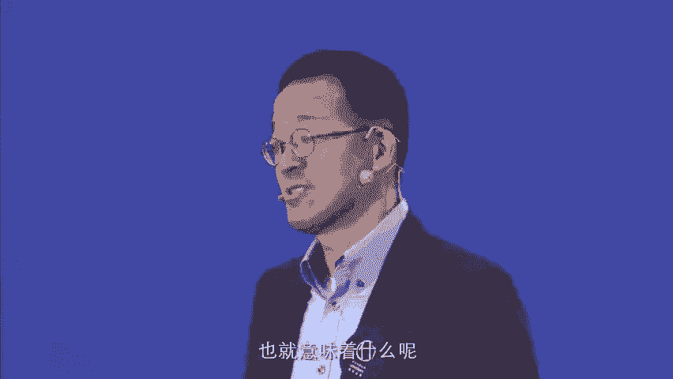

就说你要看这种领导人，就说你要你要做领导人的话，呃，有两种领导人，实际上朱元璋其实跟着啊越王勾践是一样的，朱元璋这个打下明朝以后，把所有的这个地下的大臣全部给漏掉了，一个没剩，但是像刘邦或者说是唐太宗。

或者说是赵匡胤就做的非常的好是吧，刘邦尽管也杀功臣，但是他杀的也就是韩信这样的，就说呃在年轻时候对他进行一个重大伤害的人，就是总而言之，就是说你作为一个真正有气度的领导人。

应该像赵匡胤或者说说唐太宗这样的人学习，唐太宗尽管把自己的兄弟都给杀掉了，那是为了王慧王王这个皇皇位，没有办法不得不做的一件事情，这是由机制所决定的，但是呢唐太宗在成立以后。

大家都知道这是唐朝真正稳定以后，他是没怎么杀过大臣的，那么我希望我们在座的这个这个这个呃创业者，如果真正创业成功以后，一定要不要向朱元璋学习，也不要像越王勾践学习，那新东方的人对我的感觉还算比较好。

是因为他们知道，就是说他们不管做怎样的伤害我的事情，我对他们都不会有报复心理，这真的到现在为止，新东方的人不管是以什么方式出去的啊，我都从来没有在公开场合说过他们一句坏话。

尽管有的时候我心里骂了他们1000遍是吧，复飞的很厉害，更加没有做过一件伤害他们的事情啊，那么这样的话就会让你已经现在在的团队，让他们有一种安全感，这个非常重要，实际上那第三个呢是主导主导原则。

刚才我讲到了主导原则，比如说我我小时候这个分堂的故事，那是一种主导原则。

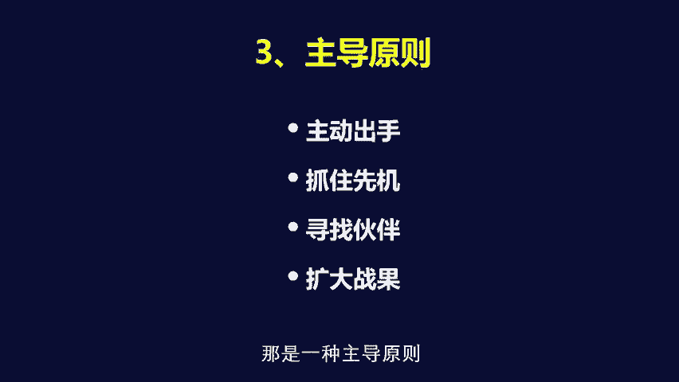

主导原则其实而涉及到了一个在一种场合中间，你能够迅速抓动主动权的这样的一件事情，那我再来看，就说我从小学到中学，一直到大学，我当过的唯一一次班干部，是我在高考第3年的时候呢，呃这个这个那个高考补习班。

我被选为班长，那选为班长其实呃只做了一件事情，就是这个补习班，大家从全全全县的这个各个地方，来到补习班的时候，穷人无所完了，教室里这个非常混乱，一塌糊涂，这个这个教室也非常的脏。

所以呢我就其实是抱着一个农村人的勤奋，完了带领全班同学，就把这个教室打扫得干干净净，所以当我们的班主任走进来以后说耶，他说我第一回发现就说我们还没开始上课，就把教室整理的这么干干净净的。

啊啊这是谁谁干的，完了所有的同学就指着我说是他干的，当时我们全班同学，没有一个人知道对方是什么名字，完了这个班主任老师就说。

那好吧，就是俞敏洪当我们班的班长了是吧，我们班不需要一个成绩好当当班长，但是我们班需要一个愿意为大家服务的人，当班长，我就被选了班长，那么这个这件事情，其实就是因为我带着大家扫了一下地而已。

所以有的时候就说，你抱着一个为大家服务的心态，主动的去承担某种责任，或者是主动的去做某件事情，那么到最后你就能够占据到一个优势的地位，那我当班长这件事情给我带两个好处，第一个是我既然当了班长。

那我觉得我就应该把成绩学好，现在在学习上花了更大的力气，这个直接导致我后来考上了北大，那第二件事情呢，既然我当了班长，我必须对我周围的所有的同学都好，并且呢要组织他们带领他们，完了呢一起把这个班给弄好。

这个班后来在我的带领下，40个同学，38个考上了全国重点高校，今天的新东方的CEO周成刚是我这个班的，完了新东方的行政总裁李国富是我这个班的啊，大家可以想象出来，就是说实际上就说那他们你看徐小平。

王强跟了我一段时间就走了，为什么，因为我在北大的形象是一个窝囊废的形象，他们觉得跟着俞敏洪不太可靠，但是为什么周成刚和李国富跟到我今天呢，是因为我在他们的印象中间，一开始我就是他们的班长。

所以呢这个天然的威望就在那跟着老班长走，这是他们的这个这个一句一句一句话，你知道吗，现在你看就主动出手抓住先机，有的时候在一个尤其是在一个陌生的团队中间，其实是非常重要的一件事情是吧。

那么在抓住新机以后，你要寻找一部分的伙伴，再比如说我我在这个补习班的时候啊，我组成了一个非常核心的五六个人的成绩，最好的人的学习团队，我给他们布置的任务就很简单，我们不能光忙着我们自己要考上名牌大学。

我们五六个人必须要去帮那个班内最落后的人，这样的话我们整个班全体共同进步啊，那就这件事情呢，呃就变成了一个什么，通过核心伙伴带动整个团队发展的一件事情，而后来我在做新东方的时候，基本都是这么做的。

比如说这个我在新东方形成了核心团队是吧，这个其实远远不止王强，徐小平两个人，当时的核心团队有七八个人，王强徐小平，只不过因为跟我关系走的比较近，所以形成新东方三驾马车，那这个整个的这个核心团队最后一起。

最后再通过核心团队再去招募，就是周边的就是有能力的人，就是一层层的扩散下去，就形成了新方的能新东方的能力圈，而这个新东方的能力圈，在这个核心团队的带领下，恰恰就把新东方最后带到了。

就是不断发展的这样的一个轨道上来，就是如果说你的核心团队没有，只是你一个人在那儿努力，或者说你一个人是一个，被大家认为是这个公司的领导，而其他的人只是对你来说，唯命是从的这样的一种状态的话。

那么你的力量是爆发不出来的，呃所以呃当然寻找核心团队，就会背后有利益分配啊等等这样的问题，那是另外一个问题，但是如果说你因为害怕利益分配，只找那些你信任的人，比如说你的家族成员。

或者说是你能够就说指挥的人，那么这个公司想要做起来难度也是非常大的，因为实际上这就变成了什么，变成了这个项羽的模式，项羽模式就是对谁都不表示信任，都觉得自己一个人能干。

剩下来他身边勉强有一个对他无比忠诚的，这个这个范增，到最后也被他气得背娼而发，最后死掉，乌江没有别的，没没没有别的路径可走，但是刘邦大家都看到马上就不一样，因为他是一个核心团队，这个新团队的。

他对这个核心团队的成员，是表示了无比的信任的，而倒过来，核心团队成员对他也是表示了无比的忠诚的，这个强者也包括了萧何张良是吧，其实韩信不能真正的算是吧，还有其他的一批啊，这个这个这个成员，那么气场原则。

气场原则这样的一个原则，就是说我们想要成为一个呃真正的领导人，或者培养自己领导力的话，你不能老是跟着人走的，我像他说一个人的进步呢叫做宁为牛后，不为鸡头，因为牛后就说我我跟着牛人走。

我能从他们身上学到很多东西是吧，但是呃当你想要培养自己的领导力，或者说想要就说真正啊，就是发展自己事业的时候，一定要宁为鸡头，不为牛后，为什么，因为鸡头毕竟是有头的，牛货只是牛屁股而已啊。

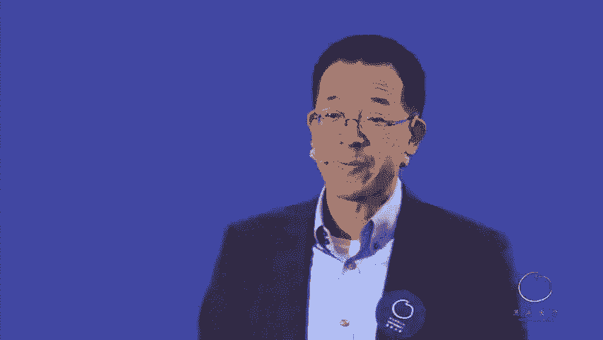

所以我说呃我我我讲一个在这我说避开高压，要自创气场，是什么概念呢，非常简单，我给大家举个例子就行，我在北大的时候。

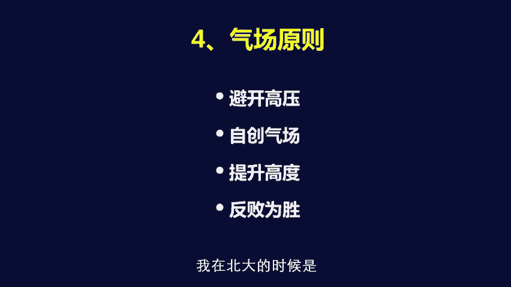

我在北大的时候呢是呃啊这样的一个状态，就是由于我进大学的时候，我的大学同学气场都非常的大，每个人就是身上体验的能力都比我强，我是在成绩上，英语水平上，中文水平上，读书上。

文艺体育才能上面都是没法跟我的同学比的，所以我在北大的整个的5年，气场一直是被压得非常的厉害，完了到最后压到大三的时候，神智啊啊，这个最后郁闷到最后得了肺结核的这样的程度，完了我在北大的时候当了。

即使当了老师以后，后来即使我过了5年以后，已经被认为是北大的优秀老师以后，我依然发现我的气场是被死死压住的，为什么，因为北大著名教授太多了啊，所以后来我发现我在北大这样下去的话。

其实就是一个尽管也有发展前景，但是就是永远是一个二流状态，而且你永远不可能来主导，你在北大的任何任何事情，所以这件事情其实构成了我从北大出来的，一个主要的原因啊，所以当我回想起来我的小时候的两件事情。

就说诶我在小时候我是小朋友的头二，我在补习班的时候，我是个非常有影响力的班长的时候，我发现我在北大了整整10年，依然没有产生任何影响力的话，我觉得北大就不是我一个，能发挥我自己能力的地方。

所以呢北大的这种压力对我来说，这个高压是非常大的，就是它是一个自然形成的东西，大家有没有发现，就是当你在一个地方是一个真正领导人的时候，到另外一个地方，你就只能是变成端茶倒水的。

比如说我在新东方绝对是一个真正的领导人，但是我到企业家俱乐部去活动的时候，我只有为柳传志，马云他们倒水的份是吧哈，尽管大家觉得一路可以平等相待，但是他就是不一样的是吧，只要谈到教育话题的时候。

我最多能说几句话，其他的时候他们就都是我的老大，在某种意义上哎这是真的，就是，而且我会自动的把自己下降为倒水送茶的人啊，你是没有办法的事情，因为那个气场在，当然当你气场增加以后。

你到最后也是可以就是反败为胜的，比如说我今天在北大气场还是非常足的是吧，我是北大基金会的常务理事，北大校友会的这个理事是吧，北大中，北大企业家俱乐部的创始人和理事长是吧，就说我在北大的这帮企业家中间。

我站出来，我绝对是大气场的，就是不同的人，不同的环境，你知道吗，你知道吗哈，所以每个人都应该有自知之明，但是呢你避开这种高压气场，让你不能发挥的地方，这件事情其实非常重要，所以就得要自创气场。

后来我出来办新东方以后，你看新东方我也是把控气场的，上来就是一帮下岗老太太跟我干，那我绝对气场压过他们是吧，后来徐小平，王强他们进来了，这个气场我就有点压不住了，你知道吗，但是之所以后来还能够混下去。

是因为我做了4年以后，徐小平，王强他们才从美国回来的，所以实际上我是新东方的唯一创始人是吧，他们是现在叫联合创始人，但实际上按照他们自己的说法，就是我是新东方的。

Only founding father，他们是新东方的founding uncle，明白这意思吗，其实呢它是不一样的，就是说所以呢如果说我坦率来说，如果当时是我像电影中间所描述的一样，就说凭着我的。

因为我这个人啊就是柔和有余，刚强和果断不足是吧，完了呢就说呃就说快刀斩乱麻的这种能力，在我身上基本上没有，所以这就是我的领导力的天花板啊，那么有着这个天花板，大家明白了，就到王强徐小平回来。

他们在北大又是我的老师，又是我的班长的时候，我在这方面是盖不住他们的啊，盖不住他们带来的，这个这个这个非常重要的一个问题是，如果同时大家联合创始的话，那最后的结果就是他们主导整个局面。

我就只能变成端茶倒倒倒倒茶的，端水倒茶的，所以呢我对这个我们在座的创业者，气场不足的人，就说当你要拉那种原来你的同学啊，朋友啊，哥们来一起干的时候，你一定要先干个34年。

把这个公司做的让人感觉到已经成型了，他们再过来，他们是加入他们，不是共创，你知道吗啊这个很重要，如果你本身气场很足，比如说像任正非这样的是吧啊，那谁都没法弄他，你你你就算是我爸爸，你也不行啊。

那这样的情况，那你叫谁来创业都没有问题，因为一个人要知道自己身上的这个弱点，并且避开这个弱点，所以我觉得新东方之所以后来能成唯一的原因，就是因为我一个人先干了10年，完了后来又弄了一大帮能干的人进来。

而这帮能干的人他们是加入，因此他们没法推翻我啊，就这样一个概念啊，因为我身上的这个典型的弱点，就是因为优柔寡断有余，刚强果断不足啊，而优柔寡断背后就涉及到了，就说有点像评价项羽那样的叫做妇人之仁。

富人责任的东西啊，这个但是这个没有办法，我现在现在已经克服了很多了，但是呢依然就说就是叫做，就是满肚子的这个柔肠，基本基本上这样就说让我下狠心，基本上不太可能对。

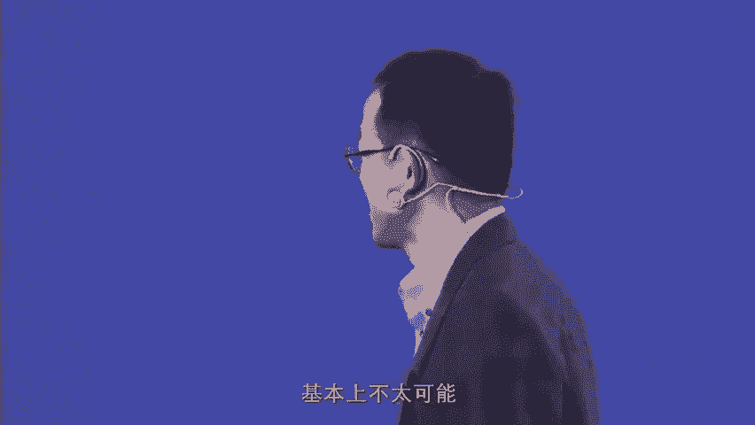

所以所谓的反败为胜是什么呢，就是你必须提升高度以后才能反败为胜。

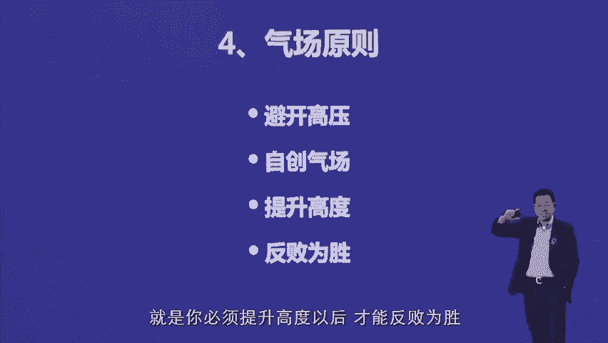

你看我在北大是被处分以后出去，或者说是在北大以后有点灰溜溜的出去的，这个状态反败为胜，就是当你的气场足够以后，你逐渐的再去拢那个气场的时候。

