# 领导力原则--俞敏洪 - P3：03 - 清晖Amy - BV1BJ4m1u7YW

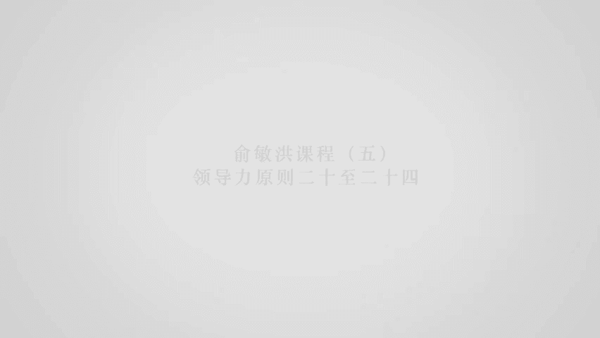

德行原则我觉得就比底线原则要高很多。

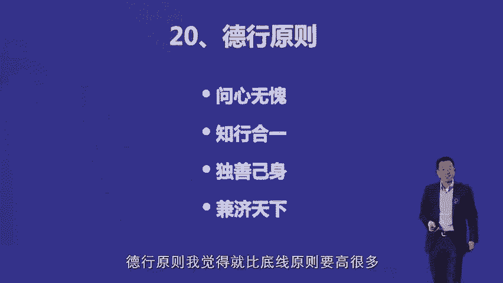

我觉得你未来要成为一个，真正的伟大的领导人的话，这个德行原则其实是非常重要的，就说首先做事情一定要做到问心无愧。

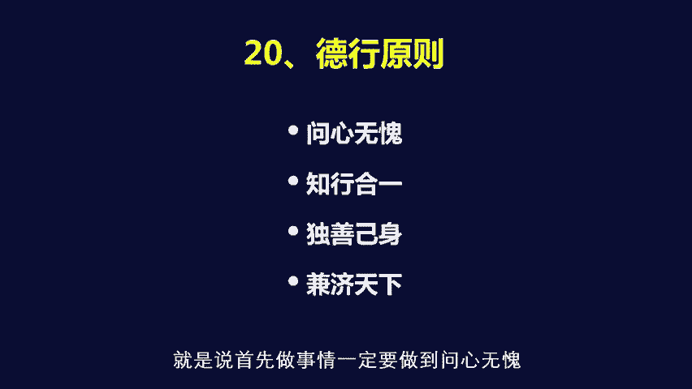

就说所谓的良知，就说你做任何事情一定是在良心上和良知上，能够永远对得起自己的事情，这个事情非常重要，所以我严重的反对做这样的事情，表面上你做的产品为人民谋了福利，但是背后这个产品所带来的后遗症出问题。

比如说造纸厂，一方面你造出来的纸是为人民服务的，另外一方面，你造纸厂背后把污水放到江河中间，像这种事情就是很麻烦的一件事，钢铁厂你造钢铁是为人民服务的，但是钢铁污染了整个的中国的天空。

这件事情本身是不行的，所以在中国有一家钢铁厂，我是比较佩服的，这个就是这个德隆德隆钢铁企业的丁立国的，这个钢铁厂，他花了巨大的资金，就是把整个的钢铁，它的钢铁企业变成了，就说在他的钢铁企业的上空。

永远是蓝天蓝天白云，它所有的污染全部给清融的一干二净，他的钢铁企业现在既然都变成了旅游点，让大家去看，而他现在他的钢铁这个本身的销量也是最好的，所以有的时候你做一件问心无愧的事情。

不一定会影响你的生意的，知道吧，那么做到刚才我讲到了知行合一，另外呢就说一定要想办法做到，就是所谓的独善机身啊，兼济天下，就说你做事情有两个标准，第一是这件事情你对自己的时候。

你要让自己想办法变得更加的完善，这对自己是要有严格的要求的，实际上这个因为一个不断的对自己，要求更高的人，你一定会怎样，一定会在别人的心目中变得更加的受人尊敬，因为你变得更加的受人尊敬。

你底下的人都更加愿意干，完了呢，你周边的人，外围的这个合合合作者，也更加愿意跟你一起一起去做，那么第二兼济天下呢，就说你你这个你这个企业也好，你自己做的事情也好，一定实力上必须要考虑到能为这个社会服务。

能为这个社会提供正能量。

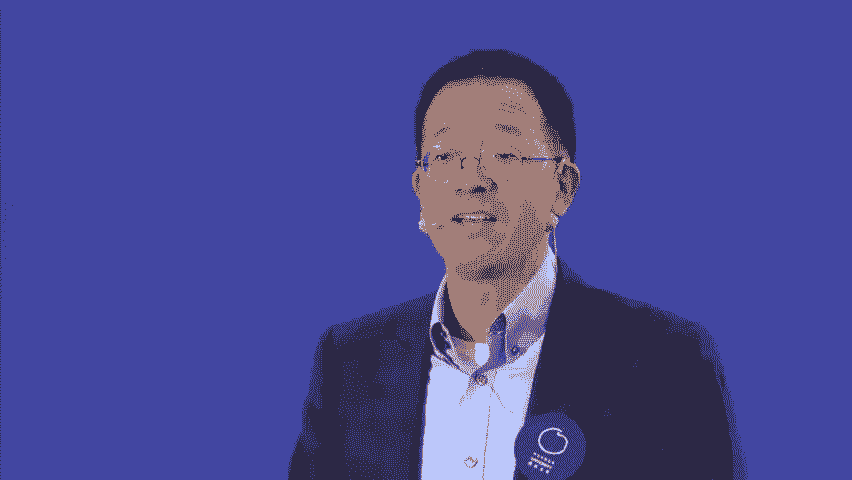

也非常的重要，抛光原则，当你不行的时候，你怎么办啊，大家都知道我们进退有度的背后叫做进推，是有另外一个叫进推失据或者进推维谷。

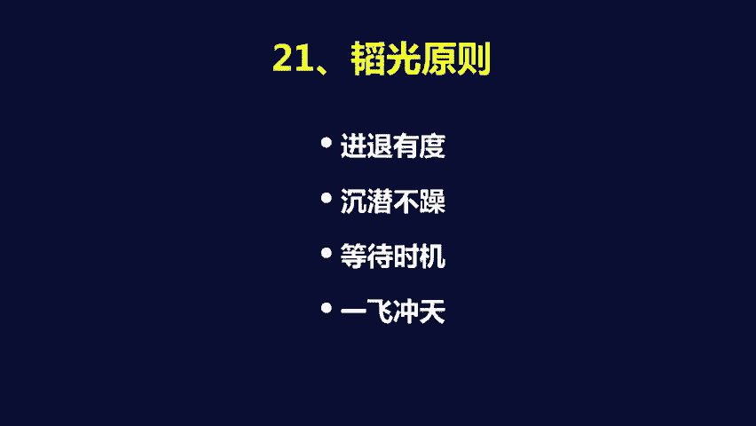

就说当我们有的时候遇到困境的时候，你采取什么样的这个方式呢，我来讲我的一个故事，大家就明白了，在2001年的时候，新东方公司化以后，股权集中以后呃，当时大家都知道新东方合伙人的时候是这样的。

新东方合伙人的时候，所有的利润当年全部分配完毕，公司是不留利润的，就是王强需要平把他们赚的利润的钱拿回去，就就就就就就就这个这个这个分完了，但是后来公司化有大家说要上市公司为指标，都要把利润留下来。

每人只拿工资，结果呢大家就产生了一种误解，这个误解是什么呢，真误解释说，俞敏洪通过上市公司这个结构，把大家的利润收回到公司去，到最后的结果是我们自己丢了很多钱，这个改变的过程。

从公司股权合并到最后大家利润流程，大家不拿钱，最后要等几年再上市了再拿钱，这件事情是有不确定性的，这个不确定性导致大家这个人心很慌是吧。

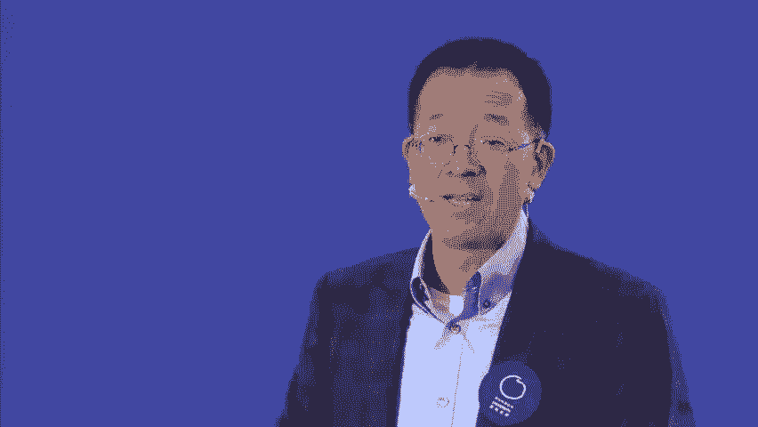

到最后的结果是什么呢，最后的结果是，就说他们认为俞敏洪领导新东方再干下去，已经没法干了，所以当时我就提出了两个要素，要求原两个解决方案。

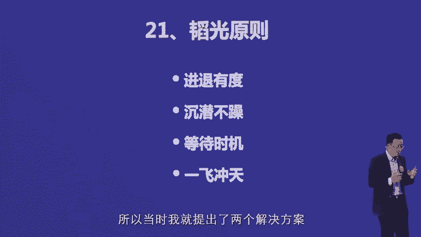

第一个解决方案，就说你们不是认为现在你们的股份不值钱吗，那这样这个股份我是送给你们的，那现在我全部收回来是吧，每一股每一一百万%人民币，我收回来是吧，他们当时已经分走了新东方50%的股权。

那我抽5000万人民币把你们的股份收回来，因为在当时是一笔大钱，而且我本身其实没这个钱，我要到处去借才能拿到这个钱，这样的话你们离开新东方，我一个人做新东方，免得咱们天天吵架，那第二个。

如果你们觉得这个不合算，那倒过来，我把我身上拥有的45%的股权，当时我拥有45%新的方全部分给你们，我离开新东方，你们拿着我的股权去干，后来他们想想也不行，说你分给我们了，我们可能互相又打起来了。

还不如我们联合起来一起跟你打好，但是呢他们说俞敏洪没有领导能力，这件事情已经被确认了，这个从大学期间就已经看出来了，对所以呢现在我们要做的事情很简单，就是你不要再当董事长了，也不要当总裁了。

后来呢我不当了，我说可以，我不当，那我就去管教学，后来说教学也不能管，因为你把所有老师拢在手下，我们极其不安全，那好那时候我就变成一个普通老师，后来我就变成了一个新东方的普通的教学老师。

完了最后他们说你董事会也不要开了，因为董事会你占45%的股权，你一开董事会，所以董事会你也不要开，股东会，你也不要开，所以呢后来呢新东方就变成了，就说有有那么两三年这个王强。

徐小平他们轮流当董事长和总裁，3年以后他们回来了，把我叫过去说，老于，我们觉得这个董事长和这个总裁真不是人干的，就说还是你来吧，对最后我再回到了董事长和总裁的位置上，我提了两个要求，第一个如果我上去了。

5年之内不要让我下来，第二就是我对新东方的发展，必须要有绝对的决策权，完了我带领新东方发展目标，我们定了就是到美国去上市，其实呢如果是我当时，其实我当时完全可以这么做的，就说如果我的脾气刚强一点的话。

完全可以这么说，新东方就说老子一个人做出来的，完了以后，你们在新东方前面干了这么几年，你们干拿的钱每分钱都拿走了，现在既然我们合不到一起，你们就离开新东方就完了，你们干你们的，我继续干新东方。

我只要把这句话说出去，新东方团队当天就散，但是最后的结果是什么呢，新东方也就做不到一个真正的上市公司了，所以大家会发现，就说就是其实我在这个背后的原则很简单，就是我认为大家在一起努力干。

是能够把新东方干出来的，那我所做的事情非常简单，就是我不能用我的极端的行为和语言，把这个团队给解散掉。

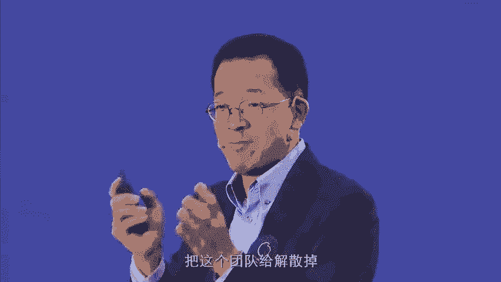

所以呢在成建了两三年以后，最后等待到了实际，我回到新东方，完了回到新东方，04年年底，我回到新东方，05年新东方启动上市，06年新东方美国纽交所上市，所以实际上它有一个过程在里面。

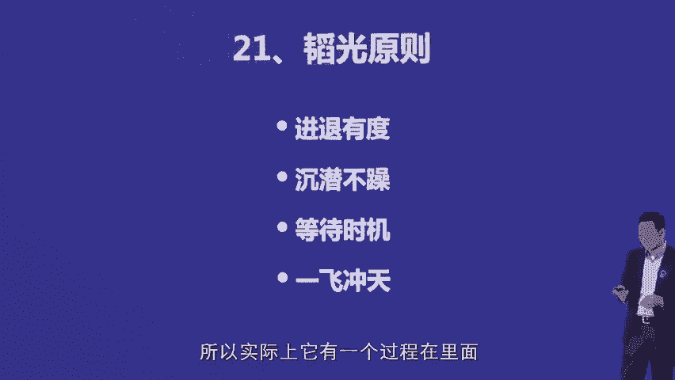

那包容原则非常简单，就说我觉得过线必罚是什么概念呢。

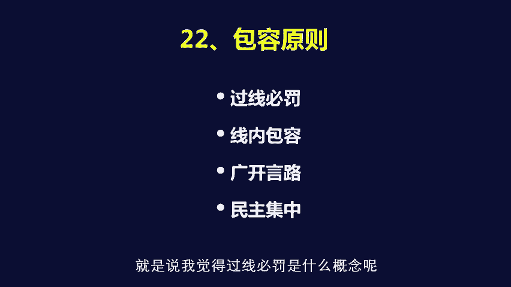

就是当你的部下，完全违反了原则性的问题的时候，这是必须罚的，所以新东方到今天也送了有五六个员工，进了监狱，非常简单，贪污这是绝对不能容忍的，但是呢如果说是非原则性问题，不管犯多少错误，你都是可以包容的。

哪怕有人侮辱你，哪怕有人作践，你都没关系，其实在我们就是几个合伙人斗争最激烈的时候，居然是有人，而且实际上我知道背后是谁，完了把我的隐私的事情放到了网上去，公开的是吧。

那这种东西实际上是某种意义上破了底线的，但是我认为这件事情其实能够解释，一个是对方对我感到绝望了是吧，因为新东方改革步伐我没引领好，第二个是就说你暴露我的隐私问题，只影响到我个人，没有影响到公司发展。

不是什么原则性的问题，所以我是可以容忍的，所以大家可以发现就说其实很简单，第三要做到的就说所谓广广开言路，就是我刚才所说到的，你必须作为有几个人是绝对跟你就说，至少在心理上面是平起平坐。

敢于指着你的鼻子骂你的，为什么到现在为止就说周成刚还跟我，他是CEO，我是这个这个这个这个这个这个董事长，两个人还配合的比较好，非常重要的一个原因，就是，因为新东方的年轻一代，都已经是比我年轻20岁了。

你让一个年轻20岁的人指着我的鼻子骂我，这在心理上是有巨大的难度的，你要知道是吧，但是你让我的一个同龄人指着我的鼻子骂我，是没有难度的，而当这些年轻孩子发现我的问题的时候，对我直接说是有难度的。

但是去跟周成刚说是没有难度的，因为他们跟周成刚说的是我的坏话是吧，那么周成刚知道了别人对我的态度以后，周成刚来跟我直截了当的说是没有问题的，所以呢所谓的广开言路，有的时候也是需要有设计的。

那我的设计很简单，就是让周通过这样的同龄人，变成所有了解所有的欲情，并且传达给我的这样的一个人是吧，而现在这状况可以直截了当的告诉老于，这件事情，你他丫的不能这么干，你这么干的话，这要是出大问题的。

你想给一个比我年轻20岁的管理者，哪敢跟我这么说啊，说于老师，你不能这么干，我靠你是谁啊是吧，这种感觉就出问题了是吧，呵呵好，就说啊，我们常常发现很多很多情况下，你以为是一个老板说了算。

后来我读马马化腾的那个那个那个那个，吴晓波写的腾讯传，我才知道马化腾跟他手下的这帮人，一开就是一天一夜比我还要厉害，这后来我才发现，就说所有的外部决策的效率性，都是内部会议的无效所产生的。

内部内部讨论的问题越充分，表面上越无效，越没有结论，其实有的时候越达到了核心问题，一旦这个核心问题达到一致意见，对外执行的，你会发现这个公司其实非常风生水起是吧，马云的18罗汉也起到了四个作用。

大家明白吗。

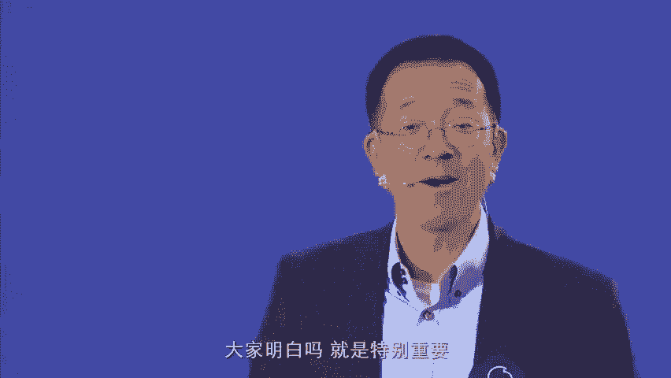

就是特别重要，个人成长原则非常简单，就是对我来说就是四个要素，第一读有用的书，这是那什么书。

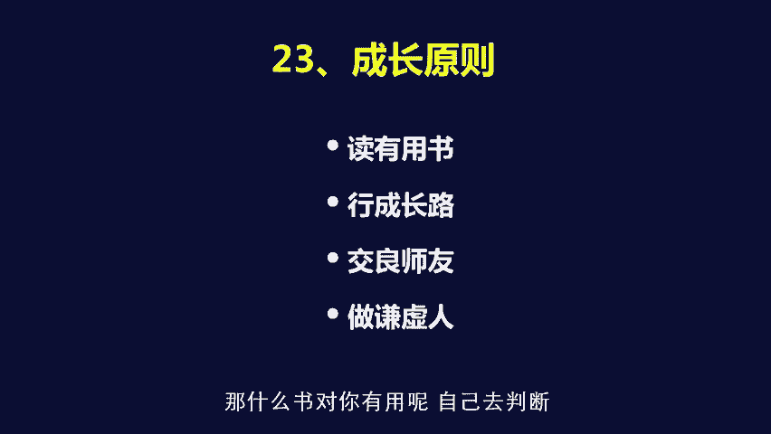

对你有用的，自己去判断是吧，新成长路就是要不断的行，成长路是特别重要，就说所谓的像我们现在到硅谷去考察啊，什么到哈佛大学去进修啊，这些都算是形成长路是吧。

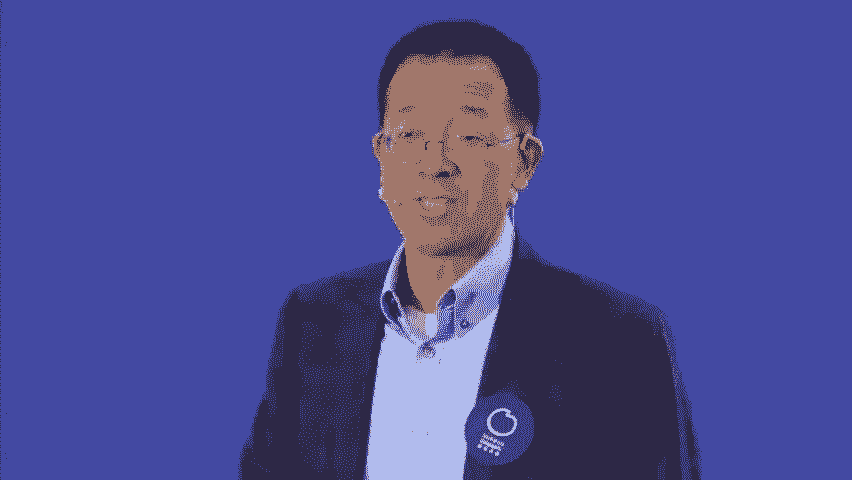

当然考察不同的文化地域这个特点，比如说包括到德国，我一到德国去到奔驰车。

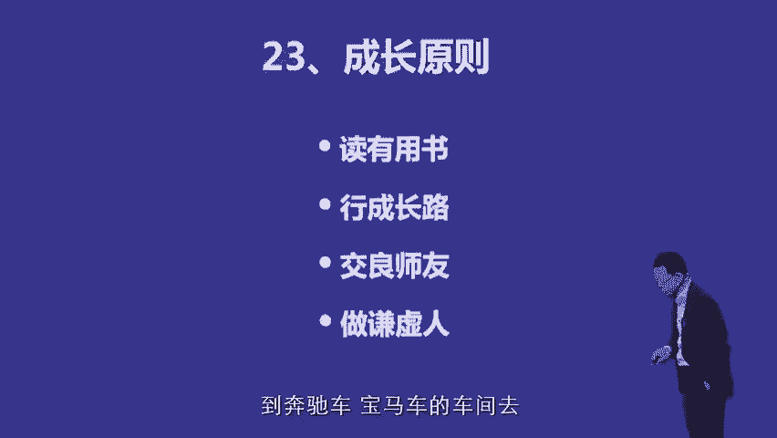

宝马车的车间去啊，其实也是用另外一种方式去去去去形成长路，交梁思友，这个也非常重要，就说我我交朋友的时候有两个要素，就是一个是比我更加年轻，当然这个年轻的就是，比如说年轻20岁这样的人。

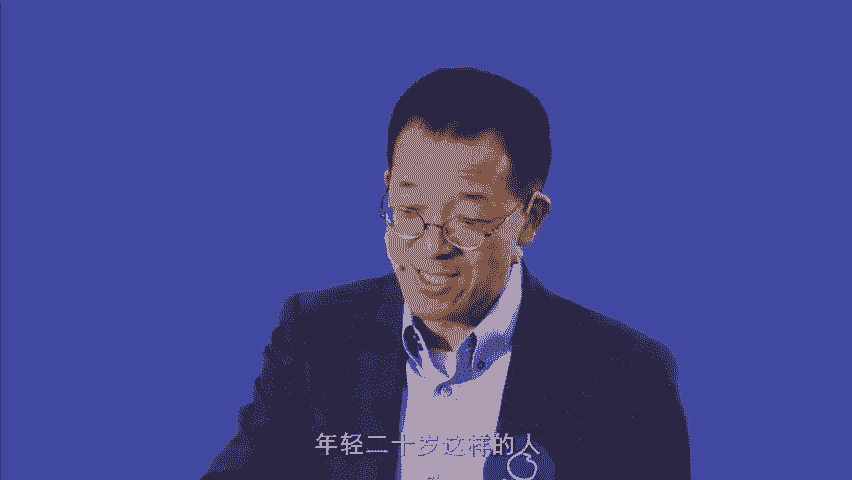

那我从他们身上取年轻的东西，但是还有一个是比我更加资历老的人，所以我会去主动拜访，比如说我会去主动拜访张瑞敏啊，主动拜访柳传志啊是吧，完了呢，参加这种就说企业家的，我刚才说的聚会这个重要性在于什么。

我从他们身上能学到更高级的东西，我在北大呃，这个还有其他地方去主动拜访学者，主动拜访思想家，甚至到庙里去找高僧，尽管到现在为止一个都没找到是吧，但是都是为了交粮室友这件事情。

那么做谦虚人这件事情大家都能明白啊，就是所谓的高调做事，低调做人嘛好，最后推升原则，最后一点，所谓推送原则就是第一推升的前提，是你这个公司的文化基础已经奠定了。

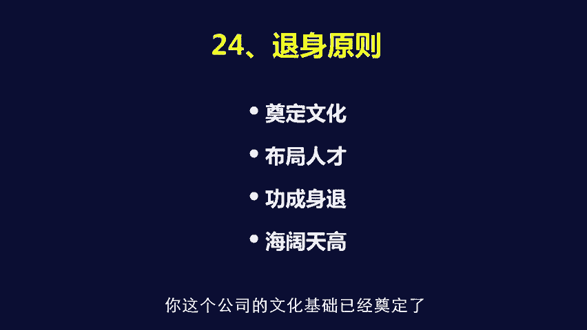

所以在创业阶段，你不要想去退声，因为你文化都没有开始有呢，你退什么身呢，对不对，第二个呢就是要人才要布局好，对于我来说，人才布局毫无疑问就是寻找接班人的问题是吧，就是那么啊我心中是有这样的人选的啊。

所以呢要要加快培养，而且呢寻找接班人必须必须必须隔代，比如周成刚老师现在是CEO，但他某种意义上不是我的接班人，是我的合伙人是吧，那真正的接班人，其实原则上必须是，比我们俩至少年轻20岁的人。

这样才行是吧，功成身退，刚才我已经讲过了，就说海阔天高呢，就是为自己留一个天地，我刚才说过了，我个人回到刚才开头的时候讲话，我个人要做的事情非常简单，就是我要做一个就是说能够自由自在的。

依然能够推动这个社会进步的人，并且让自己的本身的生活，也达到一个自由自在的状态的人，这就是我要做的事情好，由于时间关系啊，是不是已经已经超过了呃，40分钟了，这个非常抱歉。

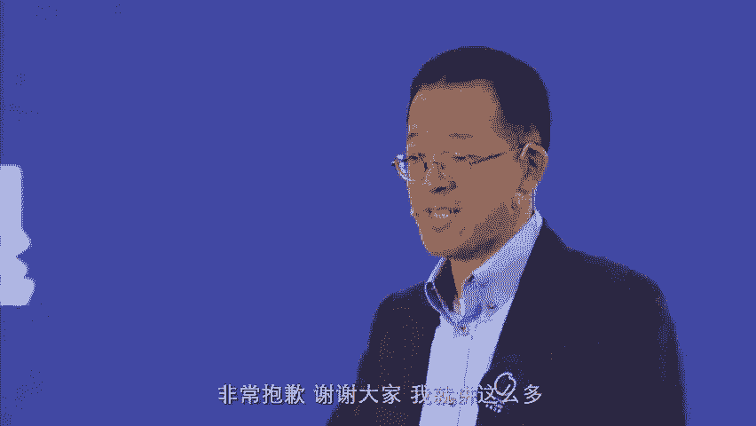

非常抱歉，这个谢谢大家。