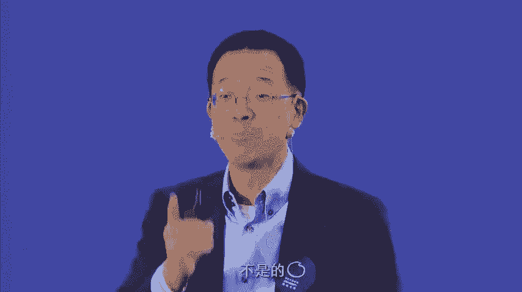
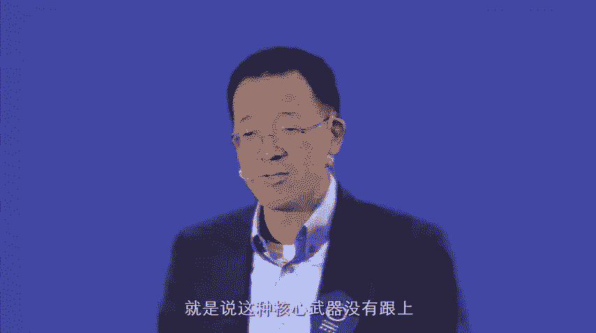
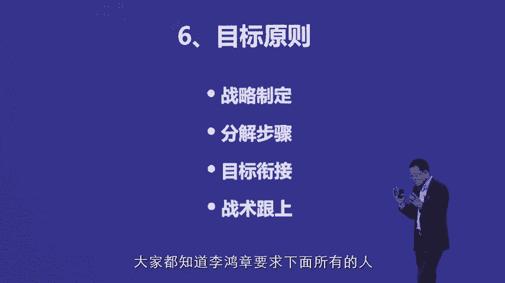

# 领导力原则--俞敏洪 - P4：04 - 清晖Amy - BV1BJ4m1u7YW

愿景原则呃，愿景原则就涉及到公司发展。

或者企业发展的问题了啊，那么我觉得这个几个要素非常重要，第一个呢就是你做一件事情啊，要清楚你这件事情的使命是什么，第二个是你的这个愿景到底是什么啊，使命使命和愿景不太一样。

使命是这件事情，从现在开始，你就希望达到的一种价值高度，价值高度是吧，那愿景是什么呢，愿景是这件事情呃，到未来，你这个企业最后在老百姓和你自己的评价中间，它会变成一个什么样的状态。

什么样的状态，那么你自己所谓的坚定信念什么概念呢，你自己要相信自己，要相信完了自己相信要激励成员，这个当然背后还涉及了一个一个一个一个要素。

这个要素是什么呢，就是说你的愿景和你的就是使命，和你的行为到底是不是一致的问题，等会我会讲到叫知行合一的问题，大家不知道有没有学过网王阳明的这个啊，新学是吧，大家学过没有，知道没有。

心学是一个什么概念呢，心学实际上是最核心的主题，这样的就说你心理到底在想什么，以及你明确的知道这件事情应该达到的路径，但是你做的时候可能是相反的，相反的话这就是不符合知行合一这个概念，那实际上很简单。

比如说当你眼前有一堆金子的时候，要你想要得到一堆一堆钱的时候，那么你知道就说最正确的方法，你心里想要得到一想要变富，想要一堆钱，那你最正确的方法是这样，你都明白应该什么，应该是努力的工作是吧。

应该努力的用正确的路径去做事情，比如说你公司想要发展，那么你知道公司发展应该是就说对客户忠诚啊，产品质量要要提升啊等等等等，但是呢我们其实很多人做的时候，其实就做歪了是吧，做成了就说欺骗客户啊。

完了呢这个最后呢投机取巧啊等等啊，这个或者说你想要有有钱的时候，你就坑蒙拐骗啊这种行为，所以呢这个实际上就是什么呢，就说言行不一致，那么对于一个企业来说，最后你所发生的最大的问题是什么。

你在口号上面喊着我要变成什么东西，而在你的实际中间，你做的是另外一个东西，比如说新东方的愿景啊，新东方的使命一直是啊，希望能够培养就是有世界眼光的，有全球格局的，有独立人格的新一代中国公民，这个愿景啊。

这个这个使命不可谓不大，是不是，那新东方的愿景一直是什么呢，一直是要成为一个令人尊敬的，有文化价值的教育机构，所谓令人经济，就说我们做的事情必须是让人感觉到，新东方真的在做非常了不起的事情。

有文化价值是要为历史留下遗产的，在中国有文化价值的机构，你想没多少的孔子创造了这个儒儒教，所以这个曲阜他办的中国第一个培训班，在信台下面算是有文化价值的培训班啊，因为全世界的培训班的祖宗就只有两三个人。

一个是孔子，一个是柏拉图，苏格拉底亚里士多德这些人，因为他们都是当时没有什么学位的嘛，就是站在一个信台上讲，下面学生听，听完了就传播是吧，那现代意义上来说有文化价值的机构。

比如说北大清华都应该算是有文化价值的机构，从古代走向现代，从这个封闭走向开放啊，从这个这个这个这个呃专制走向自由是吧，所以这有文化价值的，作为一个培训机构，想要变成一个有文化价值的教育机构。

其实是不容易的一件事情，那么不管怎么样，这个使命和愿景都是挺好的。

挺伟大的是吧，而且我自己充分的相信要往这方面去走，但是新东方出的问题是什么，我想告诉大家，在06年新东方上市以后，一直到至少到甚至到现在为止，新东方一直是被投资人牵着鼻子走的，或者说至少部分意义上。

那投资人要的是什么，大家就明白，要收入，要利润，收入利润好了以后，股票价格就能上涨，投资人就会有收益，大家不要小看投资人的力量，这个力量是无比强大的，因为他们是你背后真正的老板，你背后真正的老板。

所以在投资人的这种这种影响下，新东方的过去的78年，对校长们的考核原则，基本上都是放在了对利润收入的考核上面，大家稍微想一下，你考核利润和收入，那么校长们的动作就会全力以赴地，为利润和收入而去奋斗是吧。

于是呢大量的什么营销就出现了，因为营销带来收入啊是吧，大量的高价产品就出现了，那稍微想营销和高价产品，是不是真的在为老百姓考虑，是是真的在为把学生们培养成一个健全的。

有有独立人格的全球眼光的学生在考虑呢，不是的，所以呢你下面的动作跟愿景和使命是相反的。

这个相反其实鬼都能看清楚。

所以呢我再去讲，新东方必须全心全意地为孩子的全面成长，服务的时候，其实新东方没有一个人相信，当新东方没有相信的时候，这件事情是做不下去的，所以到最后的结果，新东方就变成了分类状态，大家明白吗。

所以呢最后给我带来的一个体会。

就是说所谓的愿景原则其实是。

第一你的愿景本身你必须自己充分相信，第二是你必须让团队成员越绝对的，100%相信这件事情，第三是你的所有的机制和考核体系，必须保证都是朝向这种愿景使命的执行，这样的话才能上下一致，叫做上下同欲。

好目标原则，目标和愿景是什么呢，就说你的愿景和使命是一个完整的。

就是一个有点像上面的一团一个太阳一样，它能照耀这个公司，但是呢你没法没法把它落地。

所以落地的话你就要分解分解，第一个就是你的战略，就说所谓的战略就是做事情的，达到你的愿景和使命的，做事情的一整套的方法。

大家都知道，就说你怎样做，你才能够把这件事情做成啊。

那么第二个呢叫分解步骤去执行第一步，第二步，第三步，第三呢是目标衔接，就是每一个目标跟下一个目标，是有上下贯通关系的，哪个先做了就会使下一步更加好做。

因为我们发现我们很多人做事情的时候，是想到什么东西就赶快去做，但是把这件事做完了以后，由于前面的准备工作没有做好，后面的架构没有打好，到最后的结果是什么呢，基本上是白做的，就是你只抓了点，没有抓掉。

抓到线的话，那么这个因为战略是整体的步骤和目标。

是一步步要去做的事情，那么到最后你把目标衔接上了，战术才能跟上。

否则的话你光有战术是不管用的，就是你在术的层面来解决问题。

永远解决，永永远解决不了真正的问题啊，再以刚才我讲到的清朝这个来讲。

清朝到最后这个船坚炮利是吧是吧，叫做这个这么一个过程，当时北洋舰队已经所拥有的军舰，比当时的日本的联合舰队的军舰要大很多，要高级很多，包括他们的大炮的射程，也比日本的联合舰队要好很多。

但是到最后大家都知道甲午战争的时候，这个北洋舰队被全部消灭掉，那原因不是因为他们这个后面的数没跟上，就说这种这种核心武器没有跟上。

而是为什么，而是因为他们上面的这个战略完全是没有的，比如说战略制定错误，当时李鸿章大家都知道李鸿章这个要求的。

下面的所有的人就说李鸿章做了两件错的事情，第一他觉得北洋舰队的保存，就是他李鸿章在清朝有地位的基础，所以它的前提条件是要求避战，保船就是你别打仗，你他娘的把船给我保住了，完了我北洋舰队存在。

我李鸿章就会有地位，我北洋舰队被消灭掉了，我就没有军队了，没有军队了，我在这个清朝我就没有地位了，所以这个B站保存这个战略，就变成了一个彻底失败的战略，因为你B站保残的话，你就不能主动出击。

你就不能再制定，从如果说战略是主动攻击，完了后面再制定主动攻击的战略的话，北洋舰队绝对不会被消灭掉啊，甚至很有可能把日本人给打过去了，但是因为B站保台就变成一种被动，所以大家有没有发现。

甲午战争一开始跟日本人一打炮，几炮一打，北洋舰队掉头就跑，为什么想要把船保留下来，但是犯了一个严重的错误，就是什么日本的美，这个这个日本舰队尽管它的船小，但是它的航速比北洋舰队的快，北洋舰队航速12节。

日本舰队是15节，你想想看，你跑的话，我就可以追是吧，结果最后就被打成了，紧接着第二次第二次到了威海海威海的时候，这个北洋舰队的船十几十艘，这个军舰就停在威海港里面，完了联合舰队。

日本的联合舰到了外围以后，所有这个北洋舰队的船都不出都不出去，结果就在里面被日本的联合军队围住了，当死狗一样的打，最后一艘船都没留下，这就是战略错误，当你把战略错误弄完以后。

你步步分解的任何步骤和任何目标都是错的，你战术再好，大炮再好也是不管用的，所以非常重要，那么在新东方原来的战略制定的时候，就出了问题，新东方的问题出在什么地方呢，新东方当时所谓的战略就是就是定的方向。

就是我们要尽可能多招学生，我们要尽可能多的收入，这是一个总目标。

那么这个总目标下面，那么就变成了叫分解，就说我们要多多招学生，我们要多这个这个这个，这个这个这个这个这个增加收入。

那我们要干什么呢，于是新东方采取了两个步骤，第一个步骤扩大教学点，就说因为教学点多了，学生不就多了吗，是不是这是一个第二个什么呢，拼命的做营销，因为做营销多了不就多了吗，这就是分解分解成两个步骤了。

是不是分为两个步骤了，再扩大教学点，就会有全国在东南区扩大多少，华南区大概多少等等这样的布局，那么营销就分成了，就是这个大媒体型营销和小媒体营销，自媒体营销和这个这个这个这个这个。

比如说像中央电视台这样的营销目标也有了，是吧，也衔接上了，但是到最后的结果是，新东方的品牌名声一落千丈，而且新东方的这个总收入，从0708年还能增50%的收入，到60%的收入增长。

一直到了这个到这个1314年的时候，新东方的年总收入增长只增长了13%，大家都知道，一个公司上市公司如果增长13%，就被认为是什么公司啊，没有任何希望的公司，所以现在的股票就变成了只有19块钱一股。

今天新东方的股票接近90块钱啊，那这里面出的问题是什么呢，这里面出的问题非常简单，它的问题就是他的问题。

就是上面的引领新的东西错了，所以到了1414年年底，15年的时候，我把新东方的所有管理干部关起门来。

告诉他们，请问我们新东方最想要的到底是什么，就说什么东西是能够促使新东方健康发展的，我们现在做的步骤很明显的证明已经错了，就说拼命营销，拼命开教学点，明显错了，那最后大家讨论的结果是说，只做一件事情。

我们到底做什么，那么这个事情就是，迅速的提高新东方的教学质量，因为现在教学质量已经崩盘了，那提高教学质量大家都认可了，我也认为这是对的，那下面我们就要分解步骤，第二教学从哪几方面提高好。

大家就分解了几个步骤，第一个步骤是新东方的所有的老师，要现在加强培训，第二个为了扒拉好老师留住，必须给老师迅速增加工资，第三个从入口端去抓，就是在招聘新老师的时候，必须从211985的这个学校去招聘。

第四内部的老师的这个这个考核体系必须增加，那么这样的话就有了步骤，那么大家紧接着制定这个目标，这个目标就是比如说如果说要从211985，引进新的这个老师的这个生源的话。

那么我们今年应该让哪个学校这方面的老师，达到多少比例是吧，紧接着就说培训老师的话，老师的课程体系应该是什么，应该制定多少小时的培训，那么如果说是老师工资要跟上的话，每个城市老师的工资到底应该加多少是吧。

那么再加上新东方的产品体系跟上，一切都围绕着教学质量去赚，就是最后是教学质量为主，以教学质量为主，前端教学产品啊，后端教学服务跟上去，这样的话呢再分解成步骤去做的话，那最后的结果呢。

新东方因为抓对了要素，新东方到15年年底的时候，新东方的收入翻到了20%，一，6年翻到了25%，17年翻到了30%，大多少，就是我想说的是，就是当你目标制定或者是战略不清楚的时候，最后或者本身就是错的。

就是那个大方向如果错了，你想要得到好的结果是完全不可能的，因为你整个的方向是错的，那第七呢是叫做判断原则，那判断原则是个什么原则呢，就是啊我觉得就是你对这件事情要不要去做的，判断原则。

比如说我刚才讲到的历史广泛调研，充分讨论，尊重尝试啊，灵活纠偏，这就是我刚才讲的新东方的那个例子，就说并不是我自己一拍脑袋说，新东方最重要的就是教学质量，而是要求所有的人多参与讨论，最后大家达到共识。

说我们过去走的道路和现代走道路。

当然也有人不认的，后来新东方的几个高层管理干部离开新东方。

就是因为不认，因为有的高层管理依然认为营销是起作用的啊，只是中间过程没做好，有的依然认为开教学点是对的，就说拼命的开教学点这件事情是对的啊，那么由于不能达成一致，我的要求是，既然大部分人都认为。

教学质量这件事情非常的重要，那么到最终的结论是不认可这件事情的，那么就可以离开这个团队，因为一个团队的一致性其实非常重要，那么所以呢我是做了比较广泛的调研的，也做了比较充分的讨论。

呃那么最后呢呃大家从常识性来问题，其实有的时候我们抓公司其实很简单，就是大家只要问一个问题就行，如果我们只做一件事情，在这个公司，那么我们到底应该首先做哪件事情，这个问题只要经过广泛讨论以后。

你就能够明白，就是你就大家都会明白，这件事情就是最重要的事情好，这就是遵从常识，因为每个人其实对某个事情的判断，都是有常识的，那么到最后呢就说要学会灵魂纠偏，把自己的这个这个偏向揪过来的纠偏。

说到纠偏的就有纠错原则，纠错原则呢就是首先有两个，第一个呢就说因为我们个人啊，常常是容易犯错误的啊，我在新东方也做出了很多这个决策错误，但是我后来我发现，只要是经过大家讨论的决策，错误的也也有错误。

但是呢比率就会下降。

迅速下降，所以呢有一个机制监控什么呢，就说我在新东方一直打造了一个一个要素。

最后是票决制的，七个人，任何问题，只要四个人不通过这件事情就不能干，这件事就不能干，如果呃他们第二个原则，就是如果说我们四个人都不同意，俞敏洪还要坚持干，所有的损失由俞敏洪个人承担。

因为只有我一个人是可以即使全部反对，我还可以坚持干的，他们给我开了这个路径，但是看了这个路径的后果，大家都知道就承担就不一样了啊，所以呢我我在新东方有过被扣掉工资的时候啊。

有过就是就是就是被这个被点名批评的时候，有过，但是呢也有过就是我决策了做对的时候啊，比如说新东方的这个中学业务，到时候大家想把一对一和这个班级业务，全面分开，变成两个不同的这个业务体系去干。

后来我说这两个业务应该是配合性的，不是这个不分开竞争性的，全国的所有的培训机构，都把这两块业务是分开干的，只有新东方一家是放在一起干的，那这回发现这个放在一起干是对的，因为现在新东方这两块业务加起来。

依然是全中国做的最大的，也是效率最高的业务呃，第二个呢就说所谓，所以我说机制监控对于新东方来说的机智监控，能够不断地对我提出挑战，那交流坦诚的就说你跟大家交流的时候，你心中所想的。

你所思考的以及所思考的步骤啊，你一定要跟大家交流的很清楚，你不能藏着掖着，心里就说有事不讲出来，但是又想那么做啊，你又不是皇帝是吧，非要非要非要这个这个这个清朝，这个出的问题是什么。

清朝出的问题是皇帝可以下密旨，密折就是什么呢，就是我不需要，就是让任何其他的这个这个大臣知道，尤其是包括在中央的这些大臣知道，我直接越过这些大臣，给下面的地方官员下一个密折，那到最后的时候。

就说我跟这个地方官员，直接直接就说私下交流沟通，但是其他的大臣对于你们的交流沟通，事情完全蒙在鼓里，那到最后的结果呢，所有的人他都不承担责任，那就会出问题啊，所以呢这个坦诚交流就变得非常重要啊。

所以所谓的坦诚交流就涉及到什么，涉及到别人敢不敢指出你的缺点的问题，所以他们说在一个公司里面，如果说有这样的几个人，是总是能够勇敢地指出这个老总的缺点，并且这个老总还愿意接受或接纳的话。

那么这个公司犯错误的可能性就会减少很多，那这个到最后呢就是自我批评，在新东方呢，我觉得我做的一件事情，就是如果我发现我做了比较错的事情的时候，这个我的自我批评速度还是比较快的。

那么这样的比较快所带来的一个好处呢，就是大家心中的压力就会被释放掉，吃饭掉以后，他们就会比较愿意继续跟着你干，因为他们发现就说还有一个好处，就说你因为你自我批评，所以带来的另外一个好处是什么呢。

是他们也会开始做自我批评，那么倒过来就是在相互批评的时候，大家都不会觉得有那么的难受和难堪，因为它变成了一种互相之间一种一种风气，呃同时呢我在新东方啊形成的一个风气，就是呃自我批评和到互相批评的时候。

以调侃的方式说出来，那这件事情大家就比较容易接受，其实就是开开玩笑的方式啊，来说出来就会更加容易接受，那么这样的话，再形成一个及时改正和及时纠正的机制，而使公司的发展就会不太容易走偏，奖励原则。

奖励原则我我总结的这四点是这样的。

就是说我曾经有过公开批评，就是部下的这个时候，但是我发现公开批评的时候，带来的一个重大问题。

就是部下面子上很过不去，完了内心会纠结很长时间，甚至背后会对你产生各种各样的这种不舒服感，但是呢当你私下把他叫到办公室来批评的时候，指出他缺点的时候，一般来说都能够接受，并且呢甚至他还会带有感恩心理。

因为他觉得你是在维护他的面子，并且呢你批评他的目的是为了让他进步，而不是让他下不了台是吧，这个但是呢奖励一定要公开，就说当你奖励有两种，就是这种所谓虚实并种虚实，口头上的表扬和鼓励，十呢就是现金的奖励。

不管是口头表扬还是现金奖励，一定要公开，就说在面上说人多的时候说，因为这样的话就给他了更大的这个激励，而且呢你公开让大家感觉到会公平，因为你私下的奖励或者私下的私相授予我，私下给你买个手机。

或者私下给你买辆汽车，这件事情就不靠谱了，马上会形成整个团队的这个分类气氛，整个团队的这个猜忌。

但是如果说所有东西你奖励都是公开的话，那么你一定在公开之前，你会想，你这样的奖励是不是放在一个公平的，这个这个角度上来评判的，所以呢这样的话你就会使整个的团队。

大家觉得呃是一个特别正常的机制，所以虚实并重，就是我们并所谓所有的奖励，并不是总是给人一个现金奖励，更加重要的是什么，更加重要的是，你要就是说啊让人感觉到时时有鼓励啊，并且呢实时有一个开放的平台。

在他们的这个眼前，那么平次和道是这样的，你不能天天去表扬，天天表扬，就是我们比如说我们中国的父母，对孩子的这个这个培养就出了大问题，在什么地方，这个父母要不就是天天骂孩子。

要不就是天天就是鼓励和表扬孩子，你天天鼓励和表扬孩子的，结果是孩子听了一段时间以后没感觉了，就会有麻烦是吧，所以呢应该是就是严格的要求，就是所谓的私下批评和公开的鼓励相结合，并且呢平次要掌掌握好。

比如说呃我们给员工发年终奖，其实你一年发一次这件事情频次太低了，起不到任何激励作用，但是你每个礼拜都发这件事情，频次数太高了，也起不到任何激励作用，所以呢比如说一年分成四季啊，每一个季度都给员工来一次。

就是小的鼓励和奖励是吧啊，进行阶段性认可，到了年终结束的时候，再来一次大的鼓励和奖励，那么这个就非常的重要，比如说你口头上的表扬和鼓励，如果说你每隔半个月，一个月给人有一次要面对面的交流。

或者说哪怕微信交流，但在交流的时候要鼓励他们，那这件事也变得非常重要，我对自己有一个规矩，这规矩就是每天不管是通过微信还是语音，还是通过面对面，你鼓励的人数不下于5~8个人，因为新东方的核心管理干部。

有接近150个人是吧，这150个人我都会要考虑到给他们的鼓励，那么这样的话呢，实际上是轮到他们一圈的时候，其实就已经是一个月过去了啊，那么我的这个整个的全国的新东方的核心团队。

都能够差不多每个月得到一次半次，我对他们的关注和关怀，他们会觉得就说最怕的是你把他们给忘了，最怕的是什么，半年一年你都不理我，这件事情，他们会很难很难接受啊，尤其是派驻在外地的这些大将是吧。

你像到乌鲁木齐去工作是吧，到呼和浩特去工作是吧，冰天雪地，在哈哈哈尔滨寒风呼啸，这样的地方，结果领导半年都没有一个问候语是吧啊，只是业绩差的时候打个电话说，你这个业绩怎么做的那么差啊。

那对方是不是马上就崩溃掉了。

