# 领导力原则--俞敏洪 - P1：01 - 清晖Amy - BV1BJ4m1u7YW

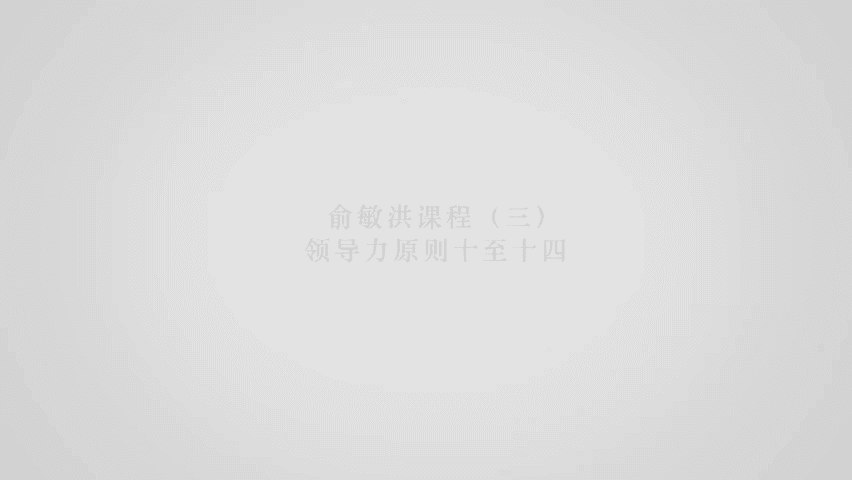

人才原则，人才我觉得是啊啊分成分成两种人才，第一种是长期人才，我把长期人才叫做是占有型的，比如说我一直认为。

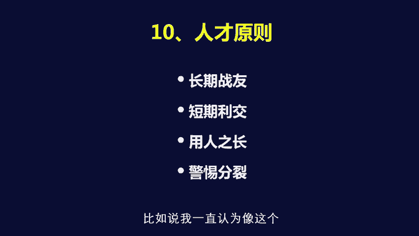

像这个新东方的这些核心管理干部啊，这是以当时的王强，徐小平其实也都算是长期占有，长期占有什么概念呢，就说你们的价值观，价值体系必须是一致的，那么所谓的短期立交什么概念呢，就说其实除了长期人才。

是有短期人才的，这个短期人才是什么概念呢，他在这个阶段能帮你起到重大的作用，并且呢帮你把公司的某个层面，给你带上一个台阶，那么他可能在长期发展中间不适合在这儿干，但是呢它至少帮你推动这个企业的发展方面。

能起到比较大的作用，那么你跟他的交换其实非常简单，就说它给他足够的报酬，让他把这件事情干好啊，这是短期人才，那比如说啊以刘邦为例，萧何张良绝对是刘邦一辈子的这个长期人才，长期占有啊。

那所以呢刘邦对萧何张良是没有任何，他们三个人之间没有任何二心的，实际上，但是呢韩信很明显的就被刘邦借断为，是阶段性人才是吧，所以呢尽管刘邦一开始就对韩信有不满，尤其是当韩信打下了山东，要求这个刘邦呃。

把他封为这个假齐王的时候，当时刘邦是拍案而起，想要把他给骂回去，他的姓使过来以后，但是萧何非常聪明，萧何踩了刘邦一脚，刘邦也非常聪明，马上明白了，这个时候如果骂一顿韩信，韩信就真的独立了。

就变成了韩信呃，刘邦和项羽三足鼎立了，就是三国演义将会提早200年实现是吧，所以刘邦拍案而起的同时，马上改变了口风，说封封封封P个假王啊，要封就封真王嘛是吧，结果呢就封了这个韩信变成了曾王。

那韩信觉得刘邦对自己非常的好，这个那最后就倒过来，从山东南下，帮着这个刘邦把实力埋伏，把这个项羽给消灭掉了，好但是由于韩信是个阶段性人才，大家都知道最后的结果是汉帝国成立以后。

刘邦依然把韩信给灭掉了是吧，当然刘邦这样做是很不地道的是吧，很不地道啊，新东方也有很多这个阶段性的人才啊，但是呢到最后都是这个，以拿到非常好的利益回报以后在离开新东方啊，就这样的，比如说其实很简单。

新东方包括新东方的这个第一批，那些这个下岗工人，老太太他们到实际上某种意义上是阶段性人才，因为新东方刚开始的时候，就必须干又苦又累又脏的活，这些老太太最后过了这个56年以后，我发现站在新东方。

新东方就被他们给弄没了，所以到最后的结果完了，这些老太太去退退下去，那退下去的同时，我给了他们每人5万股新东方的股票，当时新东方的股票一股只是一块钱人民币，后来有几个老太太说，我们不要这个股票了。

你就给我现金吧，我拿5万5万块钱现金，你想在9596年的时候，拿5万块钱现金是比较多的一件事情，结果后来我跟他们说，你们一定要留股票，这个股票未来一定是很值钱的，还有两个老太太最后不相信，拿了现金走了。

其中还有一个老太太最聪明的5万股流到今天，这个5万股现在每股值90美金，大家算一下多少钱是吧，很聪明嘛，就说实际上就是一种，就说你为什么我当初用这些老太太，用他们的长处，你让大学生来天天这个干累活脏活。

他们是干不了的，但同时呢用仁慈来说，要警惕分离，我刚才讲到刘邦和和这个韩信的例子，就是就说你要有一种防范，你底下的人跟你拆出去，重新跟你对着干的这样的本领，那这件事情说细了是不太容易说的。

但是说大了以后就意味着什么，意味着就说你一旦出现这样的情况，你这个公司如果没有深厚的基础的话，基本就完蛋到新东方这样的程度，已经不怕任何个人单独出去干了，因为他不可能把新东方给分类出去，这件事情是吧。

但是如果你的公司是比较小的公司的，就很容易出现这样的事情，新东方出现过这样的事情，当时新东方这个刚开始做的时候都是大班教学，所有的课程，我后来发现老师是很容易分类出去的，所以所有的课程我都会教。

但是就一门课我不会教，就是GIE的数学逻辑课，我是不会教的，因为我本身数学水平很差是吧，当时我用了这个数学如界的老师，我给了他最高的工资，因为这门课我不会教，但是呢他依然发现了。

就说如果俞敏洪不会教这门课的话，我是可以不断的要利益的，要到最后我就已经完全受不了了，为什么呢，他说总共四个老师教40次课，你必须把这个所有学生交的费用的1/4，给我，那1/4。

我说那我的市场费用做较小的费用怎么办呢，他说这个我不管这个从其他三个老师那学呢，其他三个老师反正你也能教我这门课，你不能教你就得给我1/10的钱，那最后我当然给不起是吧，如果给他的话就完蛋了。

我给他1/4，别的老师也会要1/4啊是吧，当然在当期我是给他的，我所做的事情非常简单，在当期还剩下的一个半月的时间之内，我用最快的速度培养出来了四个数学逻辑老师，如果因为充分的发现了。

如果我再只培养一个，最后这个老师依然会拥兵自重，大家到这最怕的拥兵自重嘛，所以呢这就叫做防范分类，当然后来最后来结果，新东方的卢记数学老师最多，为什么，就因为这门课我不会教，所以他最多，而别的任何老师。

他只要说我想离开教室，至少我还能走进教室，先去顶一下，你知道吗，所以大家明白了吗，也就是说当你发现你这个人才一旦要离开，你对你的公司会造成崩溃性伤害的时候，你一定要有非常好的备用人才在背后。

而且省市必须要求有这个备用人才在背后，而且这个备用人才必须跟你是一条心的，这件事情其实非常重要。

好团队原则，团队原则呢我说的这个四句话，就是这个团队原则是什么概念呢，就是所谓的价值一致，能力多样，跨代结合就是充分授权。

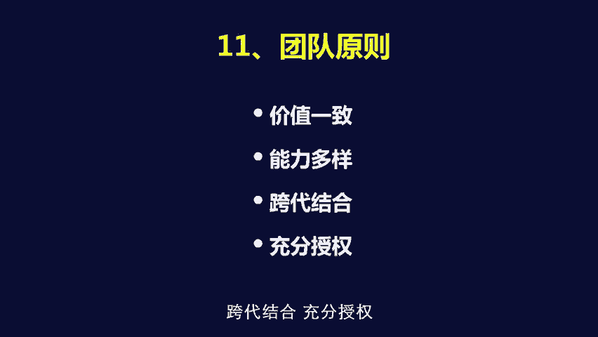

这个其实也非常的重要，就说我在新东方把握的一个最重要的一个特点，是，就是所有的核心团队，必须跟我对，新东方想要成为一个什么样的新东方的想法，必须高度一致，就说新东方曾经有不一致的情。

这个时候就是我说的就是06年上市到14年，那后来我对团队进行了就是重新整理，重新整理以后，凡是不想一致的都离开了新东方，那么现在新东方依然是价值一致的，当时徐小平王强跟我在一起的情关，天天打打闹闹吵吵。

因为我们都是北大出来的，那就属于打打闹闹，才不会把新东方伤害掉，但是呢第二个要能力多样，你看我跟徐小平，王强他们在一起的时候，我们能力非常趋于一致，我们都是文科生，我们都是理想主义者，甚至是浪漫主义者。

我们都不知道管理怎么回事，我们对于理工科完全是处于鄙视状态，你知道，所以新东方到最后的结果，就变成了一个完全没有头绪的，但是呢充满了激情的，完了呢自生自灭的这样的一个地方，基本上。

所以后来我意识到这个问题以后，新东方的新的一代的管理者，就出现了一些理工科的人在里面，理工我在里面，因为后来我发现不同的思维，不同的能力取向非常非常的重要，那么紧接着跨代结合。

就是对于我们这样的人来说非常重要了，就说对于年轻的创业者来说，在你的团队中间有一两个40岁左右的人，其实非常重要，因为他们能够帮你，他们像这个船里面的压舱石一样，因为他们的稳重，因为他们都不冒进。

能帮你稳定这个团队的核心，让你这个船往前航行的时候不至于过于颠簸，但是像我们这样的年龄，这个船已经太稳定了，所以倒过来就要大量吸收年轻人员，像新东方的高层管理干部，中间八五后的已经占到了一半啊。

九零后的已经又进入了新东方，高级管理干部的这个成员，那就意味着什么，就是新东方队伍必须年轻化。

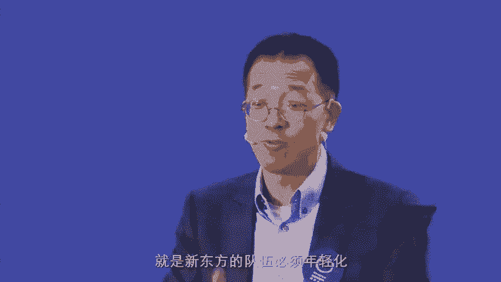

必须年轻化，原来新东方找校长的时候，基本上是以口才演讲激情为主，大部分都是文科生，现在新东方的校长和公司的这个总经理，有一半以上都是理工科背景出身啊，这样的大家可以互补，当理工科背景的人在讲的。

他们条分缕析的管理方式的时候，文科的背景的人就能认真学习。

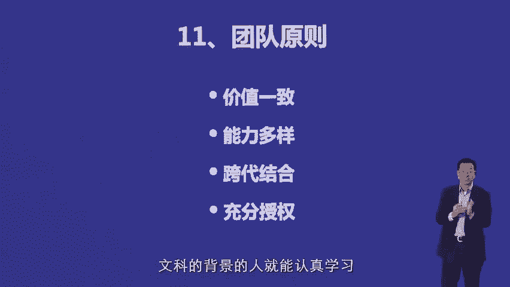

而当文科的背景的人上去，就是把自己的这个魅力和自己管理上的，这个人文情怀的一面展现出来的时候，理工科的管理者也非常迅速的就学到了，所以这样的话互相你看就是跨代结合能力多样，所带来的这这个这个重要性。

那当然对于团队原则的话，就是最后一点非常重要，充分授权，就是当你发现你把把这个一个部门。

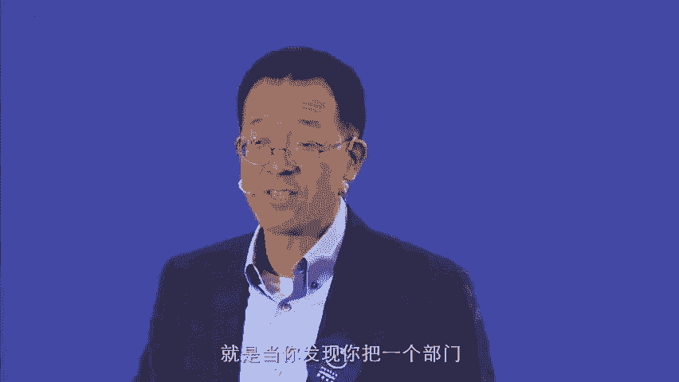

交给这个人以后，你给他，你给他要讲清楚的是，你想要这个部门达到什么状态，你对这个部门的考核机是怎样的，完了最后剩下来的就是规定，达到了是什么个状态，不达到什么状态。

剩下来的一切你把他应该给他的资源配到位，给他的金钱配到位以后，财富配到位以后，不能监管他的这个这个具体的这个，这个这个这个这个这个这个这个每一件事情，否则的话就是处处受制扯。

那么到最后的结果是他根本就放放不开手脚干，那最后的结果要不叫他离开啊，要不就是这件事情干不成，一定是那回避原则呢，这件事情我也是就是几个要素，第一个呢所谓杜绝私事，第一是公私分明。

但是第二个原则是就是严禁你跟公司的任何人。

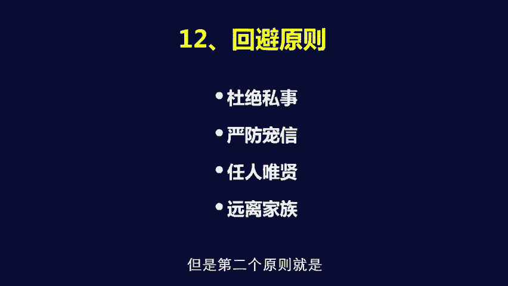

尤其是男女之间发生，任何就说让别人怀疑的关系，这件事情其实也是蛮重要的，A代发散以后，会对公司的文化起到破坏性的作用是吧，尽管你是可能是数一不二的人在公司，但是一旦发现这样的事情就不太好弄。

所以给大家的建议是，即使你要产生感情，最好是在你的公司外面产生感情，这是第一，第二，严防宠幸是什么概念呢，就说你千万不要你作为公司的一个头。

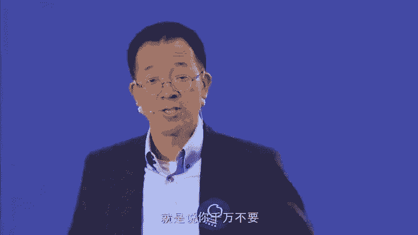

你千万不能说让大家感觉到。

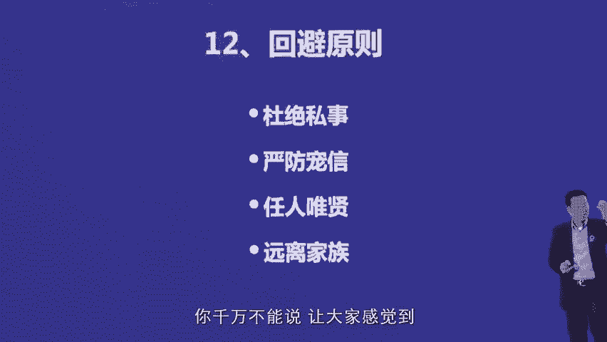

就这两三个人跟你关系是最好的，其他的人都是边缘人物，这个事情很难防范，因为我也有这样的情况，就说公司的那几那几个人我比较喜欢，有的时候是能看出来的啊，但是呢如果说你做的过分了。

让他感觉到就这两三个人的话，你是听的其他的人不管多能干，都是放在这两三个之外的。

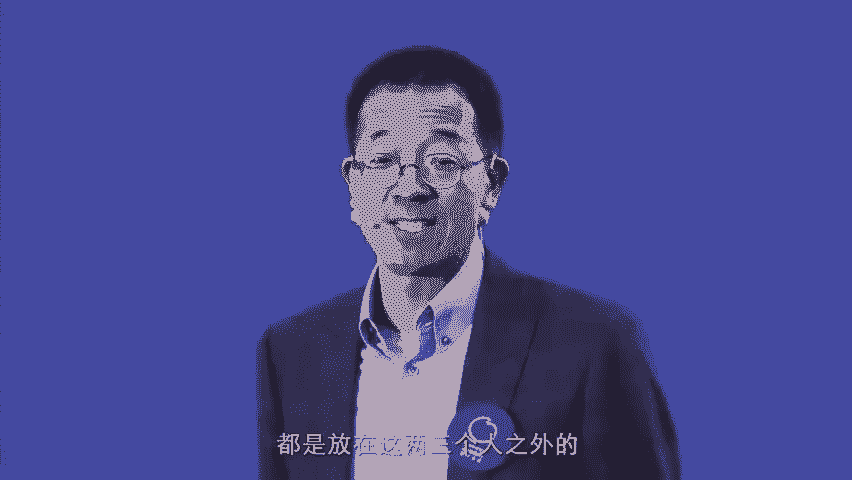

这件事情就会变得非常的麻烦，那么任人唯贤是跟任人唯亲。

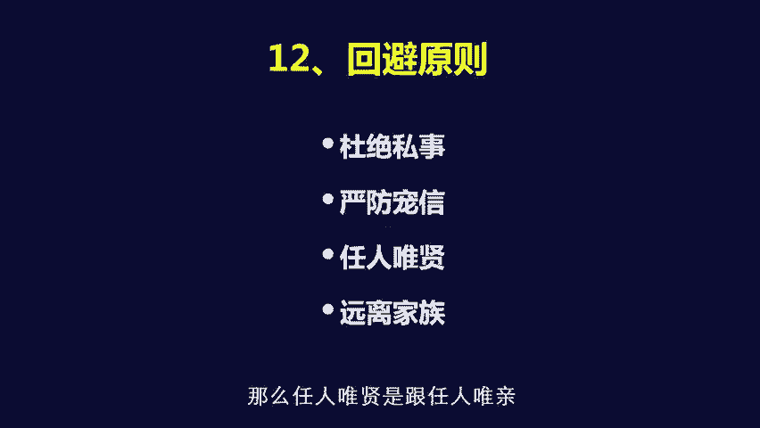

就是这个相反的一件事情，所谓任人唯贤就说哪怕这个人你对他有意见，但是当你发现这件事情就只有他能够干成，或者说是呃他他进入你这个团队，才能变成这个团队的一个有生力量的时候，你一定要用它，原因非常简单。

当你用了一个，在大家感觉到跟你不那么亲近的人，还敢他委以重任的时候，整个团队对你的信任度会迅速上升的，那第四个呢叫做远离家族，这个在新东方是有故事的，就是原来因为在那帮老太太之后。

就是就变成我的家族成员帮我干了，当时我的老婆，我的老妈，我的姐夫，还有我老婆的姐夫，都在新东方，新东方的绝对发展的有生力量，每天都是24小时在帮着干新东方，但是王强徐小平他们回来以后发现了一件事情。

这件事情就说当他们想要管的时候，他们根本就不敢管我的家族成员，因为管完以后发现不管用，那么他们这些人因为在西方社会过来的啊，所以他们最后就不讲情面是吧，最后说老于这样就说。

要不你就让你的家族成员撤退离开新东方，要不就是我们离开新东方是吧，只有这两个选择，那大家都知道，就这两个选择对我来说都是很难的，我选择家族成员，他们离开新东方，那么最后新东方就变成了一个家族企业是吧。

一个小小的家族企业，如果选择他们，我的家庭成员一定会跟我不买账，这个家里的人跟你干了45年，把公司干大了，你让他们全部撤出去，谁都不愿意啊，所以这样我遇到了一个非常艰难的事情，但是呢后来我深刻的知道。

如果我要想把新东方做大，做成一个有文化价值的机构的话，我必须把有文化价值的人留下来，那最后就是必须需要平方将他们留下来，所以我用了半年的时间，把家族成员全部清理出去，新东方有一个家族企业的。

这个这个机构变成了一个叫做同学企业，其实是另外一种家族企业是吧，紧接着到了新东方上市的时候，我又发现了，如果说我们这帮老同学，大学的依然在新东方占据这个岗位的话，后面所有的年轻人没有上升通道。

理由非常简单，两个两个方面出问题，第一这些老朋友在新东方，我说什么，他们是可以不听的，而且他们觉得不听很正常，太正常了，但在企业中间，如果只要有一个人，你说了话不管用，就会很麻烦，说话算数。

就是行为果断的地方，第二如果我说的话，他们不听，那么意味着什么，新东方下面再往下走的，所有的管理干部向他们汇报的时候，他们也可以不听，到最后的结果就变成了另外一种家族状态，朋友家族。

所以呢在新东方上市的瞬间，我就意识到这个机制必须打破是吧，最后我们商量的结果是，就说既然已经上市了，既然大家都已经拿到钱了，那么我们如其多挤在新东方来一起，最后弄到最后管理上没有秩序是吧。

这个最后管理上没有效率。

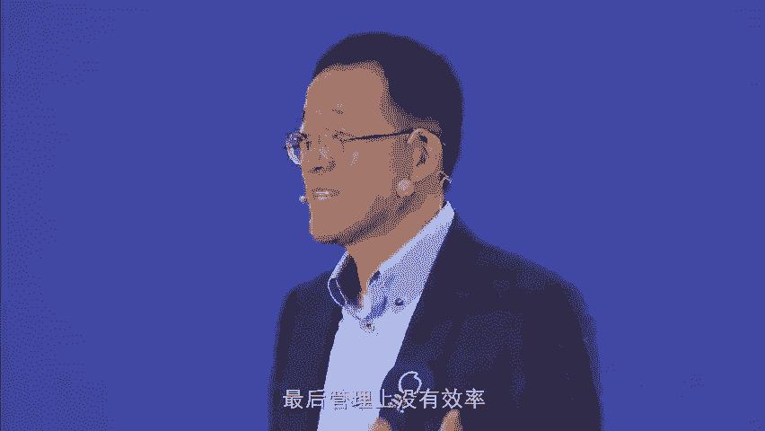

那我们不如分开，那分开的最后的结果很简单，只有俞敏洪诺留在新东方是吧。

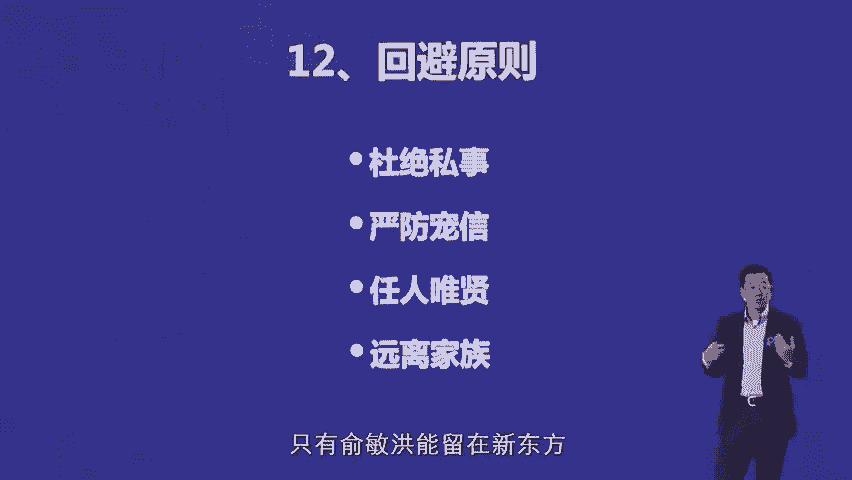

那么最后的结果是徐小平，王强他们从管理层退出，从董事会退出，董事会退出也有一个要素，这个要素是上市公司，董事会要求独立董事占董事会的多数，那当时我们一帮同老同学在一起啊，内部董事就有11个。

如果要再加上独立董事的话，就必须变成23个，你想一个公司董事会变成23个，那是什么东西是吧，而且上市公司的董事每人的年回报，你必须给他发的股票是不少的是吧，等于新东方增加了一大笔的负担。

那还有另外一个原因，就是因为如果单人懂事的人，是不能随便卖股票的，当时刚好王强，徐小平他们刚好上了市以后想买股票，我说这样，如果你们想随便卖股票，完了我们董事会这么庞大也不行。

所以到最后的结果我们就是干脆就说董事会，新东方只留两个人，一个是我，一个是新东方的CFO，这是法定两个人必须留在里面的，剩下来再找外面三个独立董事，形成一个五人董事会，到现在为止，现在还是五人董事会。

那么这样的话呢，你们就变成新东方的顾问，可以随时买卖股票，其实王强徐小平他们出去以后，因为没有组织归属感啊，不知道每天干什么了，很难过了一段时间，但是最后呢由于没事干。

所以呢就会创造更加有意思的事情来干，所以他们后来就成立了真格基金，真格基金现在中国很著名的天使投资基金。

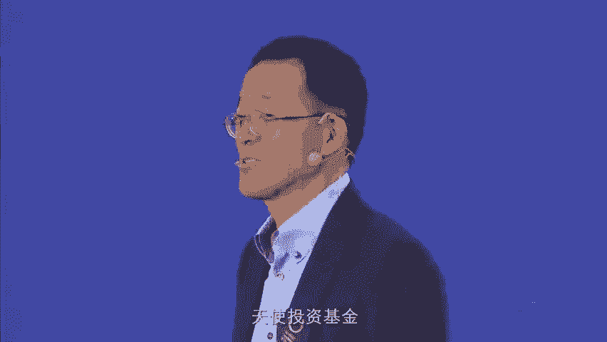

所以大家发现其实很难做的事情，但是最后你必须做不做的话，最后就出问题，所谓骑行原则什么呢，就是刚才我已经讲过了，就说我们必须要统一思想。

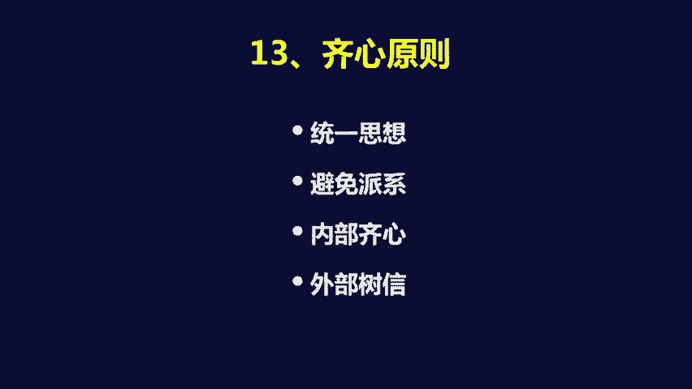

这样外部才能树立威望，其实非常重要，最怕到什么呢，新东方曾经有过一段时间很有意思，在开总裁办管的，他表面上都同意，比如说表面上都同意，以教学质量为核心来发展新东方，但是呢散会以后。

下面的这个副总跑下去说，我们要继续开教学点，必须要继续开教学点，另外不是说我们要继续搞营销，大家有没有发现，就说表面上的意志和实际行动的不一致，会带来什么，带来底下的人的非常迷惑的状态。

我到了学校层面以后说喂，我要求的是搞这个这个这个这个这个这个，教学质量为主的这样的建设，你们怎么还在这说，在教学质量没有达到标准的情况下，怎么还在开教学点呢，那底下的人就说我们也没有办法。

某某副总要求我们开教学点，他是主管我们的，我们不能不开，大家明白这个意思了吗。

到最后的结果就是变成了，而且在外部人看来，这个新东方步伐完全是混乱的，就会出大问题，实是所谓的商道原则，这个呃讲起来比较复杂的一件事情，我就呃过去了。

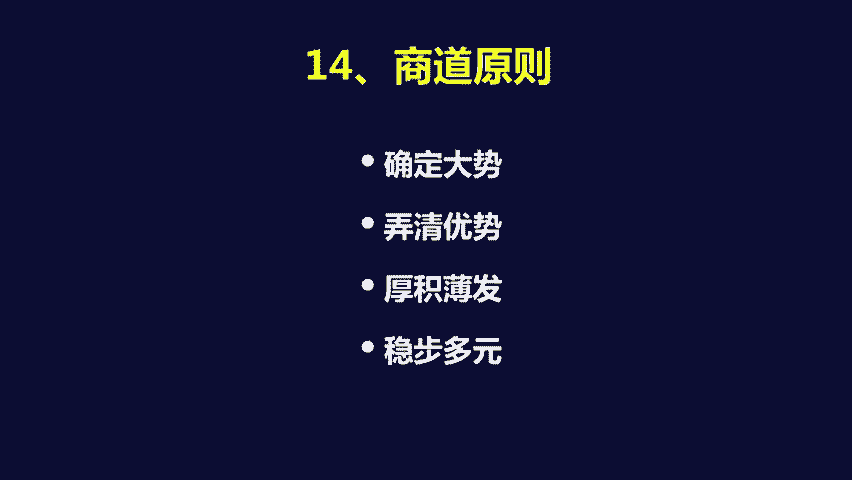

所谓商道原则就是我刚才所说的，就说如果我们要做一件事情，你要明白你所处的大事，对不对，就说你你进入这个赛道以后，这个赛道本身未来的发展前景好不好，完了同时你要想进入赛道，你的优势在什么地方，有没有卡住。

最关键的点，比如说在过去的3年中间，大家都知道教育领域的产业化的大势，这件事情是不可避免的，要进入教育领域这件事情你没错，但是进入教育领域中间，你的优势到底有没有。

比如说大量的纯粹搞技术的人进入了教育领域，大量的公司又倒闭了，其最关键的东西是缺了一个什么东西啊，缺了一个就说你对教育的理解，就说你必须如果你要用高科技来引领教育的话，有一个前提条件。

就是说你既要懂高科技，能对教育产生什么样的影响。

同时还要知道教育本身的规律到底是什么。

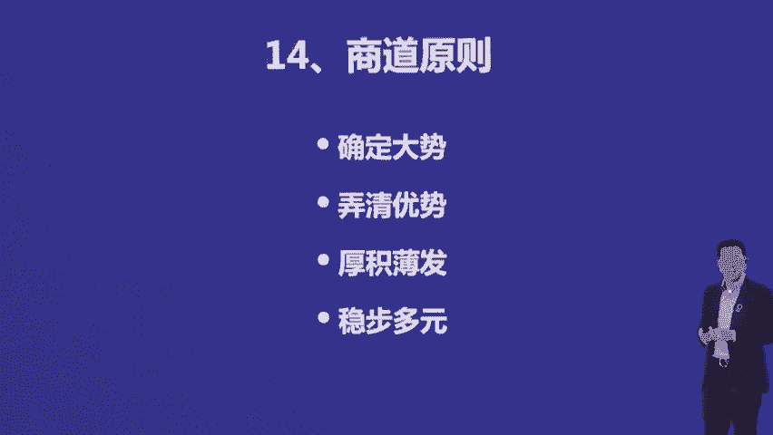

如果这件事情你不能弄清楚的话，那么就算你有高科技的优势，最后做出来的产品，可能也不是符合客户需求的产品，所以到最后实际上所谓的厚积薄发，比如说新东方之所以能够做到今天能够多元化，新东方多元化非常厉害。

新东方的幼儿幼儿幼儿园教育集团，其实现在也做的比较大，大家可能还不知道新东方的这个国际教育，就是啊这个K12集团也做得很大，那新东方后面的图书出版其实也做得很大。

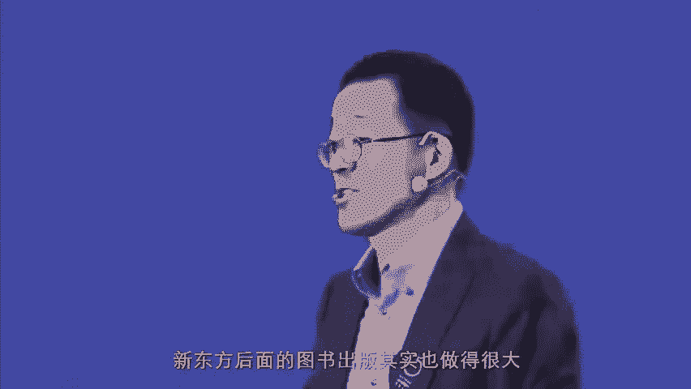

就是为什么能够做这些东西呢，非常简单，就是因为我们深刻的知道。

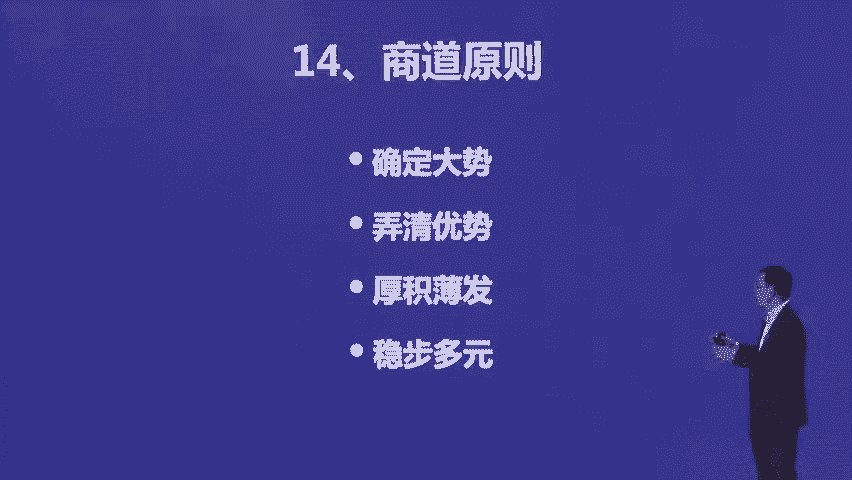

新东方的优势是在英语和出国，所以我们的一切都是围绕运运和出口，往边上蔓延的这样的这个一个过程，那么这样的话，就是实际上是一个稳步多元的过程，就是我们每产生的一个多元的产品，其实跟原来是有关联的。

比如四新东方的出版，现在已经出版到了教辅啊，人文著作完了呢，文化用品啊，再加上这个英语英语图书，在新东方刚开始做的时候只做出国图书，因为这是新东方的强项，出国读书做完再做英语图书。

英语图书做完以后再做教辅图书，教辅图书做完以后再做少儿图书，少儿图书做完以后再做人文图书，所有这些东西都做完以后，新东方再用这个公司去做文化产品，所以如果我们现在把新东方的出版系统，拆出来的话。

完全是一家上市公司，只不过因为它跟新东方的核心业务，配合的太紧了，而且新东方现在的股市的倍数也不低，在美国50倍的倍数，所以我们认为现在没有必要猜出来而已。

所以它实际上是一个多元化体系，但之所以能够做这些东西，它是厚积薄发所带来的结果啊。