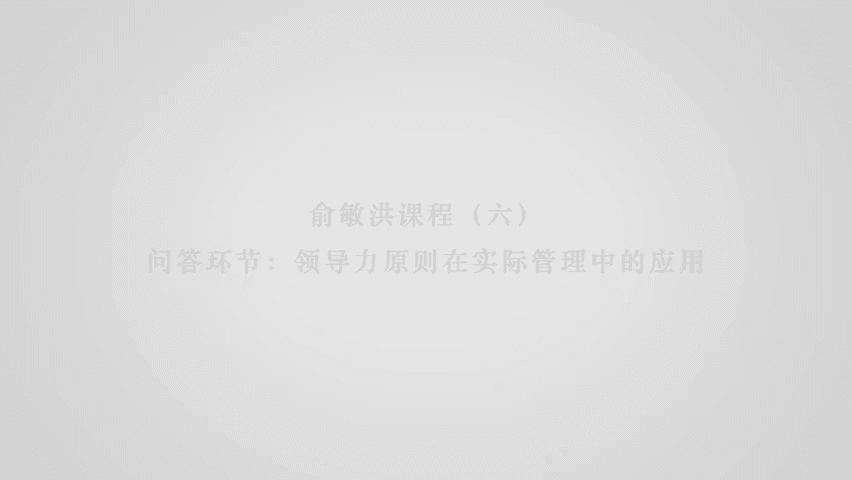
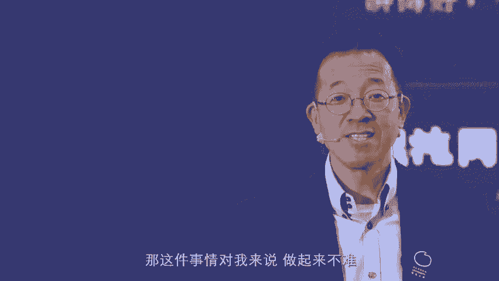
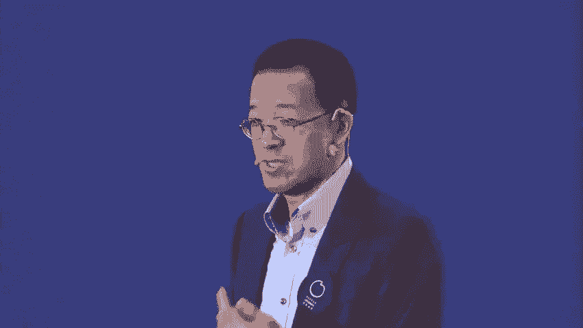
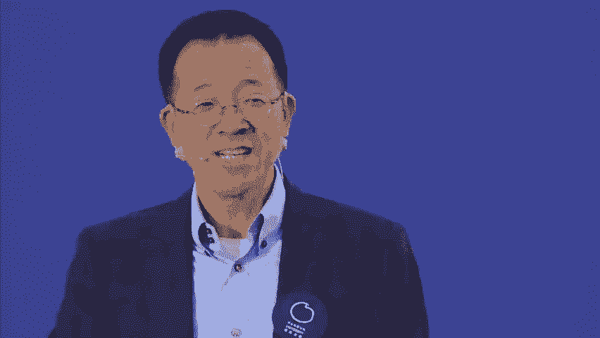
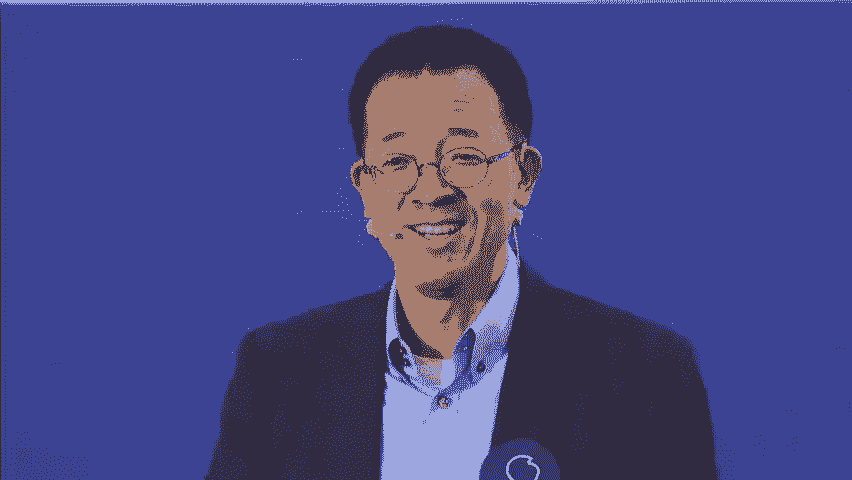
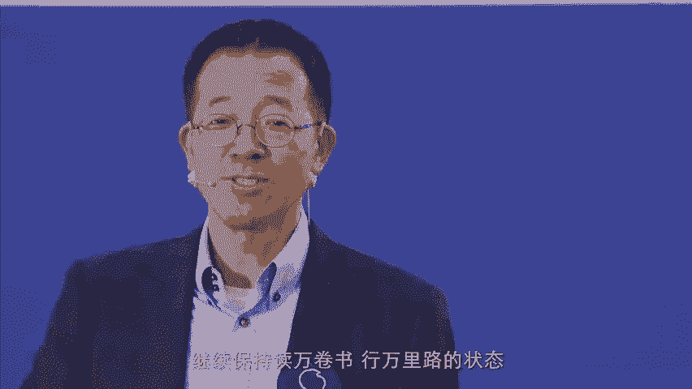

# 领导力原则--俞敏洪 - P5：05 - 清晖Amy - BV1BJ4m1u7YW

先感谢一下您的分享，呃作为一个年轻的创业者，我们公司平均年龄25岁，我有一个呃自己的个人困扰，就是呃刚才您提到了，在一些重大决策的这个部分，比如说呃在业务扩张的时候。

您什么时候会去判断托福变成了呃呃稳定的觉，呃地位了，可以去做GRE了啊，比如说图图书，我什么时候可以开开下一块业务了，这一块的这种决策，这个判断还是比较简单的，因为呃明确的第一个是就说你在市场上。

就说这个这个这个占有占有率已经有分量了，这件事情呃，当时托福，新东方已经在市场上占到了80%的份额，实际上啊因为当时不管是广州什么深圳，上海的学生已经全部到北京来学习了，而当时我的判断是。

上海广州深圳他们是有本地的托福培训机构的，那他们那就意味着新东方的品牌，占有率也非常高了，所以在这个时候就说啊，你在转向GIE，就说这边已经有稳定的成熟的托福老师在教学，那么这边你在开GIE的话。

那么托福的学生可以比较现成的，转到你的GIE的项目上来，这件事情就变成了一个水到渠成的事情，因为我们团队一般都会面临一个，就是我新的机会，就是在我们业务线上的这新的机会啊，您会考虑团队的这个呃成熟度吗。

哦那必必是肯定要考虑的了，因为你团队不成熟的话，你抓新的机会两边都抓不住啊，肯定是啊，您一定会让您的新的团队，就是呃就是主力团队去攻新的地方吗，呃大部分情况下是这样，就说其实新东方到后来在工新的呃。

呃叫做领域的时候，其实它就是一个资源调动，比人还要更加重要的这个问题了，就当然人用人也非常重要了，于老师您好，我是一位啊独立的英文教师，然后您刚才讲到说，新东方从之前这个以教师。

明星教师为核心的这种大班制，已经转化成转型成这种就是标准化的课程，然后普通老师小班制，那我想问一下，就是您对现在这种互联网，或者说网红名师经济制有什么样的看法，比如说我们熟悉的爱丽老师。

因为他的盈利模式已经不仅仅是付费课，还有很多的，比如说有社群，然后有出版，还有广告代言，对我我在想，就是因为现在年轻人，他们会崇拜各种各样的明星，像我们对，就是呃我知道你的问题。

就说实际上我们现在新东方，已经在做另外一件事情，就是说我们叫做千万名师，所谓千万名师，就说这个老师的年收入能达到1000万的，这样的这个状态，那理由非常简单，就说因为所谓的名师概念。

实际上就是要像名嘴概念是一样的，叫网红概念一样的，是不可能每个人做直播的或者做录播的，就变成网红的啊，也不可能每个老师都是就是明星老师啊，真正的明星老师数量是有限的，就像在中国百家讲坛那么多人去讲了。

讲成明星的就是易中天，于丹，什么这个这几个人是吧，钱文忠这几个人，然后他们就是把自己变成了千万级的这个，明星老师，那么随着现在互联网的发展，就是传播的无限性，所以呢这些优秀老师的。

他们的课程是可以无限制传播的，无边界传播的，所以我们要做的是为这些优秀老师打造，无限制传播的平台，所以新东方现在正在做这个事情，而且做的已经差不多了，就说所以啊就是实际上就又变成了。

就说把我最初创业的时候的明师化的制度啊，变成网络化的这个民事化，那这件事情对我来说做起来不难。

因为原来我跟名师有非常好的打交道的，这个经验啊，其实在明师化方面就是跟我刚才提到的，得到其实做的是非常不错的一件事，就逻辑思维在这方面做的是非常不错的，这个说于老师好，之前看过您对CEO的三个时态啊。

也就是过去现在和将来需要不同能力做的界定，那么对于您今天所讲的领导与原则来说，现在时态的CEO最需要践行的三条原则是哪，三条，现在是他的CL线下的三条原则呃，我我觉得应该是嗯应该怎么说呢。

就是第一条我觉得是啊，就是坚持的应该是怎么样和这个时代的需需求，以及未来的需求结合，就说洞察原则，应该销售洞察原则，那第二个原则呢啊我觉得是判断原则，也就是说在你洞察到了未来时代需要的时候。

判断你的判断就是用什么样的人，用什么样的是用什么样的结构，用什么的方式跟COC体结合，如何来把这件事情做成，我觉得非常重要，那么第三个如果让我说的话，就是啊资本原则，就说现在的创业者跟我们当初不一样。

可以循序渐进去做，现在你一定要有能力，利用资本的力量帮助你走的非常非常的快，原因是非常简单，你想到的事情别人一定也想到了，你在做的行为，另一点也在做了，如果你没有资本的力量进行推动的话。

那么你就很很容易就是被别人所超越是吧，当然在资本原则背后就涉及到了，就说这是合作原则，因为现在呃包包不管是滴滴和这个快递的合作，还是其他的这个各种合作，都表明了，就是说啊现在这个世界中间就是一件事情。

如果说你只想自己小打小闹把它做好的话，当然你可以做，比如说你在马路变成开咖啡店是可以的，但是如果你想把它做成一个大业务的话，那么时时考虑跟别人的结合，或者业务上的这个这个重组。

这件事情也就变得非常的重要，我觉得这是啊是这几个原则。

其实就是现在我在做的这个原则，是人生的终极理想和梦想是什么，呃我的终极梦想理想其实呃比较简单，就是第一个呢就是我把自己现在定位成了，就是后面的半辈子，就是啊永远为年轻人提供最有价值的服务。

那么到底用什么方式来提供，我们可以改变是吧，比如说新东方的教学也是在为年轻人服务啊，今天这个讲课也算是，那么还有这个比如说我做了创投，每年大概跟我相关的基金，大概能投到接近200家公司是吧，也算是服务。

当然还有可能有更好的其他的方式，我只在探索，就是所以我在有一次演讲的时候，我还说过一句话，就说如果最后我死了，如果到我的墓碑前面有一个人来看我的话，我希望这个人是年轻人，而不是当时徐小平在场。

我说而不是徐小平，后来徐小平还跟我特别生气，我说我说你想想看，如果我死了。

你还没死，叫做老而不死谓之贼，你知道吗。

这个这个这个这个这个这个这个第二个呢，就是我觉得我是要为中国教育的这个改变，做点事情，就我刚才说的孩子的全面成长，教育体系，家庭教育体系，科技与教育的结合，中国教育的均衡，在这几个方面。

我会用自己的全部力量来做事情，所以大概我还不会后半辈子，最确定的大概就这两件事情，那么剩下来个人呢就是很明显，继续保持读万卷书。

行万里路的状态，我现在给自己的一个规定是，每年至少有相对有深度的，走全世界4~5个地方啊，这是我自己给自己的定位。

