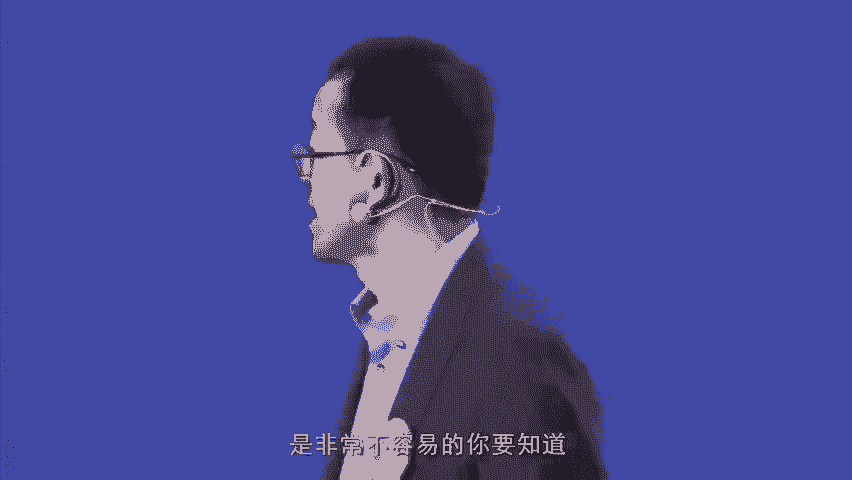

# 领导力原则--俞敏洪 - P6：06 - 清晖Amy - BV1BJ4m1u7YW

那痛点原则是什么概念呢，就是一定要洞察我们的需求，洞察洞察老百姓的需求，到底这个需求到底在不在，洞察了需求以后，你还要真正的解剖痛点啊，这件事情我想用个例子来说明。

前一阶段有无数的就是c to c的平台做教育。

就说一边连着所有的老师，一边连着所有的家长，就说所谓的就说上门服务，这个老师自动跟家长对接，最后上门服务这件事情呢是想要解决一个痛点，这个痛点就是老百姓孩子辅导的这个问题，也解决了老师一个痛点。

这个痛点是老师，因为经过培训机构的话，这个家长的钱等于说一半只能到老师的手，从另外一边就被培训机构拿走了，如果通过平台直接对接的话，那么这个老师这个本身就能多拿钱，但是呢我有一个理论，这个理论就是说。

当你解决一个老百姓的痛点的时候，你一定不能创造出别的痛点来，这件事情，就说所谓的家教平台到今天为止，几乎没有一家做成的，当然现在改变模式了，有的家教平台还在发展，之所以一直没有做成的一个重要的原因。

就是因为他在解决痛点的时候，创造了非常多的其他的痛点，比如说第一个痛点是什么呢，是老师教学水平谁来评估的痛点，家长没有办法去弄，就他对接的老师可能表面上打的分数很高，实际上这个老师的水平是很低的。

第二老师上门服务，这个老师可靠不可靠，孩子交到老师手里，老是到家门口安全不安全的问题，这个没有解决啊，第三就是老师本身又产生了新的痛点，尽管我每小时多拿了五十一百块钱。

但是我上这一家门服务和到另外一家门服务，中间一个小时的交通费谁来出，又是一个痛点，所以当你一个商业模式在解决一个痛点的同时，创造无数的其他痛点的时候，这个商业模式是不成立的是吧，所以有人就问我说。

共享单车会不会成，我说一定能成为什么呢，因为它解决了人们最后一公里到3km的，无比大的痛点的问题，那有没有创造别的痛点呢，创造了为什么车乱放是吧，这个痛点，但是川乱方这个痛点是不是在客户身上。

不是在客户身上，是在政府管理身上，所以这个痛点是移交到另外一方去，它不是客户的痛点，所以我刚才说的，当你当你就是解决一个痛点的时候，你又创造了别的痛点，或者创造了别的麻烦的时候。

这个麻烦只要不是给客户另外增加的麻烦，这件事情就能做成，所以非常重要，就说这个这个解剖痛点就变成了这个一个，就说你把事情做成的关键的这个要素，不拘形式啊，直达观念什么概念呢。

就是我们现在往往是就是有的时候，一谈就谈到了，就说我们要用高科技的手段来解决问题，其实不是这样的，大家都应该听说过这样一个故事，在美国应该是跟伊拉克打仗的时候呢，美国的坦克的指挥车。

是由两根天线竖在坦克车的顶上的，后来伊拉克的军队发现了这件事情以后，就专门对着指挥车打，因为所有的坦克群中间只有这一辆指挥车，是竖了两个天线的，所有的专家就开始研究怎么解决这个问题，研究不出来。

所以要跟一般的坦克车数两个天线，这件事情实际上要是一件很麻烦的事情，但是后来一个士兵用非常轻松的方式，解决了这个问题，说其实绑两根假天线就行了，所以后来就在每个坦克车上绑上两个假天线，所以呢这样的话。

敌敌敌军就根本就搞不清楚，到底哪个坦克车是指挥车，就这么一个简单的问题，就说所有的专家想用高科技的手段来解决，坦克车指挥车的隐蔽问题，没有找到答案的时候，其实一个小小的士兵，两根假的天线就解决了问题。

我只想说，就说我们当我们遇到一个问题的时候，我们往往有的时候会想无比高大上的东西，比如说现在教育领域中间所有的人都在专注于。

就说对于学生的教学，用怎样的高科技的手段来解决问题，Which she is really good，没有问题，非常好，也要去做，但是呢当我们发现。

就说如果说我用一个简单的方法，能解决更多的痛点的时候，这件事情其实可能至少在目前是最好的方法，举个简单，你刚才讲到的一对一，我一上来我就认为当新东方有人提议说，于老师面对现代科技发展。

我们干脆把新东方所有的地面学校都关掉完了，让所有老师全部上网，这样的话，我们就变成了全国最大的这个网络公司，教育网络公司，我说这件事我认为是这样的，就说家长到把孩子送到新东方来学习啊。

尽管他们路把孩子送过来，路上有一点麻烦，但是呢实际上我认为，家长把孩子送到线上教学点来学习，他买了他的一个安心孩子在新东方学习，保证老师质量，保证教学环境，还是保证家长有业余的时间，自己不用管孩子。

自己可以做自己的事情去，我说就冲着这件事情。

我认为一对一的教学不会被消灭，反而还会增加，当时很多新东网都反对，我说当我们能用意见，就说最简单的方式来解决问题的时候，我们尽管要去尝试更新的方式，但是你不能放弃，至少在目前看来还有优势的方式。

最后我发现我这个判断是非常对的，从我下定决心，必须加强新东方的地面教育，同时以高科技手段为辅助，以后新东方的生源，现在每年地面学生是以30%的速度增加，是什么概念，每年增加100万学生的总量。

家长依然非常愿意把孩子直接送到新东方，教学点来，而我要做的就是在教学得，对学生的关爱做得更加好而已，就很简单，所以我们把教学内改造成了学生，不光在这儿学习，还可以在这儿自习，还可以在这儿休闲。

就变成了一个学生的活动中心，相当于是所以大家会发现，就说有的时候其实不需要想的那么复杂，解决痛点，不要去思考到底是不是高大上，要思考的是哪个解决方法更加有效，那么专注原则叫做垂直深挖。

集中兵力，甩开对手形成壁垒，那这是一个什么概念呢，非常简单，我举一个例子大家就明白了。

我觉得现在很多人一上来就要做平台啊，现在凡是就是创业公司做平台的，拿到我这我全部给我否认掉，因为我认为现在任何人想要再做平台，除非你手里拥有20亿人民币左右的资金，否则的话你就先别做，很简单。

你必须从垂直领域走向平台，为什么，因为垂直领域是少投入而多产出的领域，举个简单例，新东方的发展什么，我刚开始只做，我发现我这个商业思路是非常正确的，刚开始的时候，新东方很多人告诉我说，于老师。

我们上来就要把所有项目都做齐，当时在中国的项目四大项目，第一托福，第2GRE考试，第3GMAT考试，第四英语学习，尤其是成人英语学习，这四大会都是很大的市场，新东方的这个当时的这个我周围的几个朋友说。

四大项目全部重新做，我说我坚决不做，我只做托福考试，而且我必须做到，托福考试变成了在中国排在第一位，我才做其他项目，所以新东方花了十力期做托福考试，做了两年，结果全中国想要学托福的学生全拉到新东方。

这个时候我开了GRE考试，GRE考试做到全中国的学生来到新东方，我开始看GMAT考试，GMAT考试全中国学生来到新东方，这个时候我到了美国，把王强徐小平请回来，王强做英语成人的英语培训。

需要拼做出国咨询和移民业务，大家有没有发现这个路径是什么，路径是因为把托福学生作为基础，转化为GRE学生，GR与学生又作为基础转化为杰迈特的学生，变成基础，转化为这个徐小平的出国咨询业务。

和这个移民业务，他是一条线垂直下来的，所以在任何一个点上，我都是集中优势兵力把新东方这条线打透了的，打透了，这样的话在这条线上，新东方在很长一段时间之内，甚至到今天都是甩开对手的。

而且它形成了一个强大的壁垒，就是别人根本就进不来，但是呢当我有了这样的这个基础以后，我进入别的领域是比较比较比较容易进的，因为你的品牌要素在那制高点，在那以后你进入别的品牌比较容易啊。

进入别的领域比较容易，当时学而思已经做的非常的好了，也上市了，完了当我提出来，新东方必须进入到全学科的时候，当然一个是为了上市公司增加增加增加收入，第二个是就说我觉得新东方是有这个资格进的。

当时新东方有很多人反对，说于老师我们就做英语培训，就做这个这个这个出国考试，依然还有很大的市场，我说不行，为什么，因为如果倒过来像好未来，他们如果做了英语培训，而我们不做数学培训的话。

最后很多做培数学培训的顺路在同一个教学点，他就把英语学了，而我们学了英语的学生，想要学数学，他们还必须跑到好未来去，最后的结果是我们的生源倒流到他们那边去，他们的生源可能会不流到我们这边来，最后的结果。

我们的结果就会变成一个小众的，专注的垂直业务，只做英语和出国考试，而这个东西对我未来的大的教育布局，绝对是不行的，所以现在我反过头来投入，全力以赴的投入了这个学科教育，刚开始连门都没有。

新东方第一个学期教招数学学生，你像新东方全国加起来，当时已经有100万学生了，把100位学生转化成数学的学生，新东方只转化了1000人，全国啊，那是不可能做起来的，但是我想告诉大家。

现在新东方现在的这个数学的光数学一个项目，新东方年收入是30亿人民币，所以你会发现就说那为什么能做到这个呢，就是因为通过垂直深挖集中壁垒，你甩开对手以后，你有了很好的基础。

你再去布局的时候就会布局的很好，那现在新东方已经形成了一个重大的教育平台，其重要的原因我觉得还是从我锤子开始的，所以在座各位创业者，如果你没有雄厚的资金协力的时候，一定要从一个点去突破，把它打通。

打好形成壁垒以后，你再去增加别的事情，我觉得成功的可能性就会更大，那么掌控原则呢就是我只给大家送一句话。

这句话就是千万不要去做。

你认为掌控不住的事情，以及最后你认为会出问题的事情，比如说提供其中，是因为当你有投资了，向你投了钱以后，你突然就变得充满雄心壮志，开发了很多很多的这样的这个大的系统，甚至办公室人员就马上增加好几倍。

最后突然发现后续融资跟不上资金链断裂，这是1/130的创业公司倒闭的重要的原因，就说所以呢在这个这个布局掌控上它，它的速度和节奏，人才掌控上我我我有一句话，当你发现用那些顶级人才的时候。

你有点把控不住的时候，你宁可用中级人才，这些也非常重要，你想是你的公司活着好，还是被你的顶级人才被把你给翻掉，好是鬼都能想清楚是吧，只有当你能够用顶级人才的时候，你才用，比如说新东方的前四。

前4年我用的都是中国本地的老师，其实当时我没有想到，要没有没有没想到要把徐小平，王强他们叫回来，但是我觉得根本就不是实际，如果我一开创新东方就把他们叫回来，因为他们可能不回来，第二他们回来了。

可能会把我翻下去，所以后来我觉得我能够掌控这些老同学，回来跟我一起创业，他们才回来，即使这样的话，回来还跟我翻天覆地，翻了整整10年，你要知道是不容易的，你要知道还有一个是舆论掌控。

就是舆论掌控，就意味着就说你在对外宣传的时候，你不能倒过来，让舆论最后把你给弄死，大家都知道，现在实际上中国的很多公司是让舆论给弄死的，第二个原则，变革原则呢大家都知道，就是呃组织变革，模式变革。

思维变革和科技变革四大项，那我只稍微给大家提一下新东方的组织变革，新东方是一个缓慢的组织变革，新东方是从家族制，变成了就是老朋友的合伙人制，在变成了教育集团，在变成了上市公司的结构啊。

现在变成了上市公司控股结构，实际上是，所以呢，它是不断的在随着新东方的发展的变化的，如果说我坚持只做家族企业，那么到今天新东方绝对不可能有今天是吧，如果我最后坚持了合伙人企业。

那么到今天新东方也是不可能存在的，就是各种不一样，那模式变革呢就非常简单，比如说新东方最初的时候是以大班，魅力老师为教学的特征，我觉得新东方最最重大的变革之一，就是把它改成了什么，以标准化教学。

以及普通老师小班教学为核心的模式，这个模式如果不变过来的话，新东方今天已经死路一条了，为什么，因为你的大班教学模式是不可持续的，尤其当你的客户群体改变以后，大班教学模式是不能做的，为什么。

因为新东方原来的客户群体全是大学生，像你们这样的成人，所以大班教学模式没有问题，但是变成了中小学生以后，你是大班教学，中小学生是不会听你大班教学的。

到最后的结果是教学效果出不来，而家长关注的是教学效果，那到最后你不得不变成小班教学模式，那现在呢，新东方变成了线上线下的结合教学模式啊，所有这些改变都是随着客户的需求和。

对客户的需求的内在的逻辑的分析而改变的，那思维变革是当然是一个非常重要的呃话题了，这个要讲起来就说对我来说，要讲这个话题本身就很艰难，因为我作为一个文科生，要变成有系统思维，要变得有标准化思维。

要变得有控制点的思维，对我来说本身就是个问题，作为一个文科生，要把高科技变成新东方的这个核心要素之一，又是一个严重问题，但是你是不得不去做的，反正好，那最后呢就是科技变革，就是毫无疑问。

就是说任何一个科技的新的发明创造，都必须马上在你的脑袋中间思考，能不能应用到你的企业发展中间去，而且呢一定要有某种独立的模式来进行实验，而不是说捆绑到原有的利益集团中间去，这个新东方有很多体会。

所以新东方现在的很多子公司，是独立于新东方的总公司运作的，原因非常简单，因为一旦放到总公司中间，跟总公司的原来的利益集团就会有冲突，一旦有冲突，最后一定会把原来原来的利益集团，一定会把他给摁死。

那么底线原则呢啊我讲一个故事就行了。

所谓的底线原则是什么呢，就说你做事情最后不能到最后。

因为你的底线不行，最后呢这个这个这个这个这个这个这个啊，最后让你永世不得翻身，那大家都知道新东方出了一件事情，就是哎12年的时候，浑水公司攻击新东方，说新东方做假账，说新东方这个数据造假。

最后我就呵呵一笑，为什么呢，因为新东方肯定不会做这样的事情，因为在新东方上市以前，我对新东方财务人员的要求就是不做假账，没有假数据，就是你们的底线，如果我未来有一天要求你们做假账，做假数据。

你们当天就可以把媒体全部招过来开会，所以浑水公司对新方的攻击是没有任何道理的，当然他把新东方的股价从24块钱，拉到了九块钱，但是给了我一个非常好的机会，给全体管理层连发3年股票，给我造成了一个好的机会。

所以浑水公司的攻击不光没有破新东方，而且反而提高了新东方的声誉，经过美国ACEC拍的独立调查团，当然这个调查费新东方出了1500万美金，最后证明了新东方从数据管理。

到这个这个这个这个这个这个上市公司的合规，在中国公司中间做的是数一数二的是吧，也直记当时就说马云什么柳传志，什么这个这个这个他们一起跟我吃饭，说这个老于你到底有没有造假，我说没有，剩下来的这些事情。

就是他们在同一天进了几亿美元买新房的股票，他们在新东方每人同时也赚了几亿美元，把新东方股票一天之内，从九块钱拉到了14块钱，大家明白吧，就说你有底线，让人信任这件事情非常重要。

所以坚持底线，坚持在底，底线上得有共识，我把新东方什么东西不能做的，底线是全部告诉新东方的，比如说我个人的一个底线，绝不求任何政府领导，做任何一件可能是违法乱纪的事情是吧，而我本人跟政府关系的态度是。

我绝不做任何一次贿赂政府领导的事情，以及自己本身想要向政府要点什么好处，自己做违法乱纪的事情，所以你会发现这种底线坚持完了以后，坚持完这种原则以后，你就不用担心有什么大的问题。

就说所以能坚持底线特别的重要，不要不要存侥幸心理。