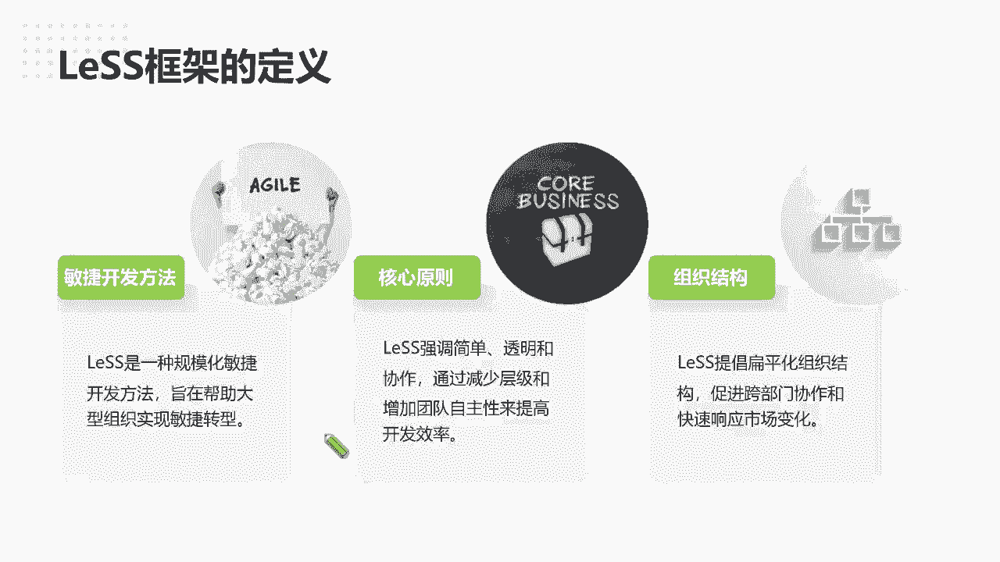
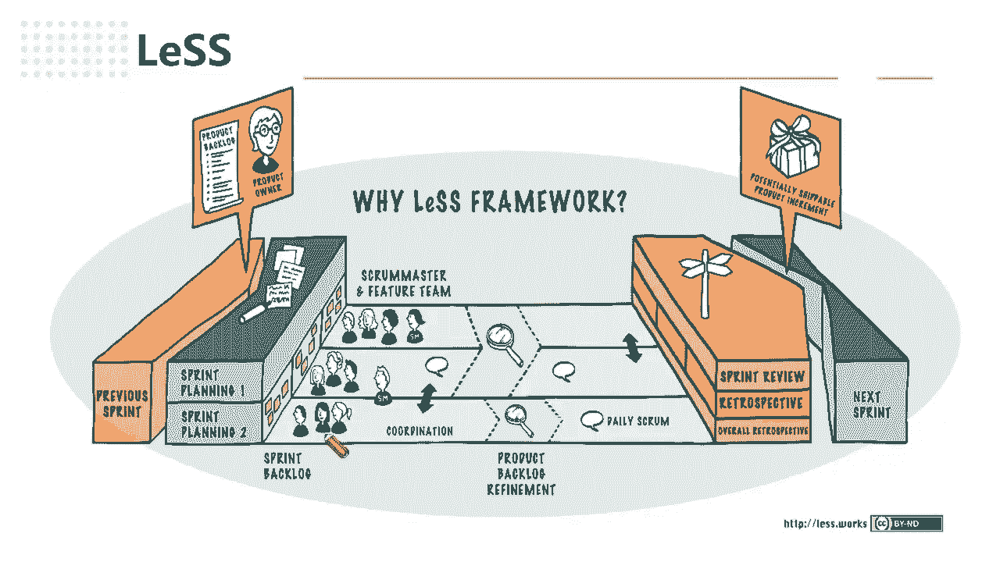
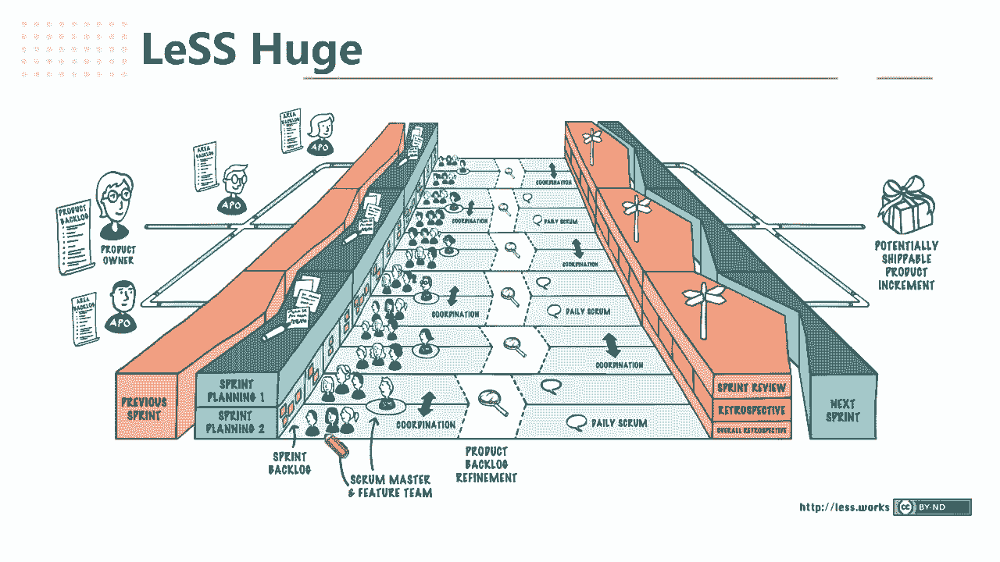

# 高效团队构建实战：7步迈向敏捷巅峰 - P2：2.Less框架的定义 - 清晖Amy - BV1zi421Y7Hh

那类似其实相对于还是比较好定的，刘老师，今天哦我看一下，我因为这个我怕这个我先关下视频啊，因为这个摄像头可能有点挡这个讲义了，然后类似框架的整体的定义是这样的，其实基本上它就是一种规模化的。

敏捷开发方法啊，它也是一种比较常见的，或帮助企业大规模转型的那类似这个创始人，而我有幸跟类似的就企业类似的，非常资深的培训师老师也认识啊，这类似也是如诺基亚，两个比较资深的敏捷培训师。

这种这样创造出来的，所以在诺基亚是最早实施，当时应该是有1000多人啊，实施按类似框架实施规模化敏捷转型啊，所以我觉得就是他是一个比较落地实践的，它并不是一个非常遥远的或者非常偏的。

因为它本身是从企业里走出来的规模化框架，而并不是闷着头在家里写出来的，所以跟其他的一些规模化框架相比，我觉得它是一种本身它的创始人跟发明人，就是从企业里真正走，他不是咨询公司的一个背背景啊。

还是企业真正落地出来的，所以本身而它的核心原则是非常简单，你会发现类似，为什么我觉得这个框架就是适合让大，今天给大家稍微聊聊去理解一下，因为它真的是非常的简单简化。

我们我们也知道我们的祖宗有句话叫大道至简，就包括我我我记得我提到，如果说你小的团队要尝试敏捷，那最好的方式就是跑SQU，那SQUM是我所见到以及用了这么多，也就是全球所认可程度最高的一种呃。

小规模的小就小团队的敏捷框架啊，包括ACB的考试，也考了很多SCM1些对应的知识啊，一些体系一些点啊，所以核心原则很简单，类似也很简单，强调简单透明协作诶，这个是不是听上听上去很类似，其实我们会发现。

确实跟SQUM的很多原则性比较相似，但而且他还提到了我们尽可能的减少层级啊，就是减少我们的管理成绩，我们不需要管理，不像啊，像cf很多框架，他又加了很多一些发布火车啊，加了一些发布主管，加了很多个角色。

加了很多成绩，就回到我们真正就是一个企业转型的一个目的，来看一下我们是到底是发现一个问题，我们加个角色，加个流程能解决，还是发现一个问题，我们先用底层的框架想一想，为什么会出现这样的当前的问题。

而不是我直接哎就是头痛医痛，脚痛医脚唉，你这里少了，我就加个角色，那里少了，我加个流程啊，所以我觉得类似的原则本身是我所看好的原因，说他尽可能减少成绩，减少流程，他的角色只有对像，只有后面会讲。

只有对PO的扩展，像那个就是SCM框架是一模一样的，哎，SUPERMASTER的团队PO只是PO这个层面做那个大，就是好啊，哈哈格尔那个类似的时候就是抄剧情，类似的时候它会有一个唉APO的出现。

就领域级PO的出现，就其他的框架跟swam其实大家都很好理解，所以如果是你同学们学了pp或者学了CP的啊，对你这基本的知识有理解的话，我觉得是你比较好上手的，同时，他也再次提交了团队的自主性。

来提高开发的效率，所以说你假设我刚刚跟大家举个例子，假设啊我们的这个价值，你这个团队的价值是管理层来定，你的价值是什么，就是管理层，那我既然你不知道这个开发，我不可能天天守着开发写代码。

所以我只能看你的开发写了多少行代码，我来评估你的价值，因为你写的腾讯写的产品，因为你可能这个开发它只是一个产品中某一块，一个模块某一个单单一的或者前端或者后端，或者接口，某一个某一个模块的开发。

它的一个产出，是不可能变成一个产品价值去理解的，所以在如果我们针对于个人去考核的时候，就会发现，那我只能考核他每天做多少钱的事情，他做事有没有毛病，就是做事没有bug对吧。

那这样的方式就会产生我刚才说的问题，那大家就会按照这个指标去做，那团队你觉得有自主性吗，这显然不会有的，如果说以代表行定为开发团队的指标，那所有的东西指标那就会变成什么，变成了我们是我们所有的开发。

就想我每天一我一个模块要写更多的代码，要写更多内容，更改写更多的东西，他就拼命的增加代码行数，他并不会为了我写这个东西能怎么快速的交付，而是说我更尽可能的把代码行数去拉，拉拉多一点对吧。

所以这样子开发效你可想而知，反而容易出问题，而且效率越来越低啊，所以一除非是团队自己觉得哎，我们探讨了我们的指标，我们考核我们团队指标有可能是什么样子的，那大家才会有一些真正的一些变化啊。

我也碰到有团队就自己定过对应的指标，那我们可能以我们拆分的需求的一些对应，任务的公式数，那首先这个你任务的公式作为工作量的话，那这个任务的公式一定不是一个人拼出来的，所以我们也知道敏捷中。

我们所有对任务的评估强调是什么，我们一定不是分派，所以大家要理解敏捷并不是让大家不能去分派，而是我们要理解为什么就是让大家领取任务，比分派更好，因为一旦分派就会存在人为因素。

就会存在着这个工作量是不均衡的，不对等的啊，就是谁熟悉谁谁做什么，但一旦是自主的，我们来评估工作量以后，我们主动领取任务，那是大家认可的工作量，所以这个工作量就是可以团队成为一个。

可以自主去衡量的一个绩效优点啊，所以这是举了一个例子，给大家提到那个成绩跟自主性，这个就会，所以你不管是十个人团队还是100个人团队，这个适用性是通用的，越大的团队越自主自信越高的时候。

那你可想而知什么，那你的战斗力是完全不一样的，所以跟大家举个很简单，就是你知道我们的解放军，跟我们当初打国民党的时候对吧，就知道为什么我们能打赢，那我们小米加步枪装备这么差，但问题是我们亲民啊。

我们是居民一家，我们所有就是全民皆兵啊，所有的老百姓都为我们觉来做事，他觉得是在教他们的，所以能打败老蒋的美式装备旅啊，所以这就是自组织，如果团队真的有驱动力自组织的话，那跟一个正常的一个开发团队。

的战斗力是完全不一样的啊，那同志组织结构上也提倡类似，提高扁平化组织啊，所以呃促进了跨部门协作和快速响应变化，是因为扁平化组织如果刚刚有销售的同事啊，我看你同学是销售的，其实可想而知，为什么觉得销售。

因为你知道任正非有很明的话，就是要什么，前线听见炮火的声音是吧，铁三角，所以销售真正给市场的这种反馈，如果说能到研发人到团队成绩，因为目前来看，其实我们的研发人员跟销售市场隔得很远的。

而且我们的销售其实一般的情况下大概率很多，销售他不会围着真正的市场的跑，而是围着什么，可能像我们因为我们做野放的，可能会更为的客户的想法跑，就看客户的最新那个动向，但其实我其实还是提倡想一下啊。

就是还是要看一下市场层面，那这个你的产品的价值，跟横向的一些价值去对比啊，就是到底你这个你的产品跟别的产品，竞争力在哪里，而不是天天呼着客户去看啊，销售如果说能给我们的研发团队呃。

就是更短的一个价值流反馈的话，那可想而知，那我们的团队所那少少走的弯路肯定也是更是，而是更能更少的，那产出的产品的价值肯定是更高的，所以这也是类似人所提倡的，所以类似包括提倡的PO。

是更希望就是接近客户，接近市场的人来承担PO啊，承担我们的product owner啊，所以这个也是呃扁平化所带来一个好处，就尽可能我觉得扁平化的目的是，缩短我们产品交付的价值流，让我提出发现需求。

人到产出需求的人，他们的价值理解能尽量减少误差，因为大家也玩过那种击鼓传花，或者就是那种什么，你画我猜猜那种游戏就知道啊，看起来很搞笑，那其实就很真实的，每一个信息的传递，那就有信息的损失。

那就可能传递的越多，而做出来货不对板，所以你发现组织中流程越长，节点越长，分工越细的时候，反而信息的怎么样，损失越大，反而你最终产出的东西反攻的程度越高，所以可以发现在现在的一个行业单位。

我们其实可以考虑下，我们设定了很多岗位，很多角色，它的意义的目的是什么，如果假设去掉了那个岗位，去掉那个角色，那会有什么呢，不一样发生，老师并不是说要你们企业裁人啊，我只是想一想，你设一些角色。

我是希望更多人向敏捷，我们提倡的是怎么样，而全站工程师我们讲的是跨职能团队，所以我们只在团队中，每个人都可以承担需求，产品研发设计测试的任务，到时候你会发现他这个人本身团，这个团队本身来言。

他们就是信息的交接跟拆分，就没有什么信息差损失，因为大家理解是一致的，而不是说需求的按需求的理解设计的，按设计的开办，按开办理解，假设一个人能做到跨职人的话，他是通的，因为我们讲的就是专讲的。

专业方面的，讲的理解都是意识啊。

成绩都是一样的啊，所以这个也是一个好处啊，啊那我们回到这个类似的整体的框架啊，这是我们的基本类似，这个类似这个适合大概是啊，100应该是适合100人以内的团队，适合就是四到啊八个啊啊。

一般超过八个以后就会用巨型的类似框架，所以八个以下的团队我觉得都OK的，都用可以用这个狂龙架，那这个狂怎么扩展呢，这也很好理解啊，就是我们的一个呃，还是如果大家学了SCM，大家知道啊。

那swam就很那我们就一个就3355嘛，一个product product的blog对吧，我们就一个产品代办清单，大家是同共享一份产品代办清单，但是有这么多团队。

所以每个团队他有各自不同的spring啊，不然啊，所以他有各同的迭代的代办清单，那最终交付的时候，我们其实还是按照我们的多团队，整体按照一个整体的产品级的迭代去交付啊，所以就是孩子很简单。

就是说我们每个安全进去调整，我们的米spring blogo清单，然后我们每个团队分开去做交付，所以并没有说按组件唉，你做这一块，我做另外一块可能更多的是按业务去划分啊，他做这块业务的。

尽可能是这个团队要做一个完整的产品能力的，交付的啊，就是拆分模式很简单哦，你可能说这四个团队是有一个master的，最多可以带1~4个团队啊，最多可以带四个，因为master后面讲他的精力还是有限。

那其实对PO来说，PO这个东西就不需要去扩展，就是一个PO也可以啊，一个PO就可以了啊，所以框架模式很简单，那团队做各自的迭代，然后来做集中的评审，集中的回顾啊，回顾会还要来集中来做啊。

这个是可能是要去一起来看的，那剧情的类似的结构其实也很简单。

就像我们前面也提到了，就一旦我这一块的可能需求领域啊，比如说举个例子啊，林老师做运营商的，我这块可能做的是以往啊移动电话相关的那块，做固网的，假如说以往的可能做的比较大了，我单独形成一个领域了。

哎那我这一块就变成一个AP，我就领域级的，所以你看PO还是一个啊，这个大概解释讲一下，APO是在PO的下面沉积的，所以我只需要把领域级的APO划分出来。

那大家还是共享一个整体的产品级的spring board呃，spring blind啊，所以还但是每个呃各自迭代的啊，spring ban还是各自spring啊，ring backlo还是各自去做。

那有产品级的A个APO，APO之间会在共享他们的知识，所以每个APO这样子，你会发现团队只需要专注他做那一块的产，AAPO划分范围一块的，所以只有产品级的，他们会做产品级的整体的回顾。

以及PO会指导各个APO做呃，产品能力的一个整合，所以这种模式相对于来说怎么样，我完全不需要改变任何，当下的SQUM的流程模式，我只需要在产品去迭代扩展的时候，我就调整，当然大家也可以想一下。

这个东西一定会越来越大吗，就我大家讲，组织去转型的目的，并不是说我们现在有100个人团队了，而我所以领导说了，我要把这100人全部做敏捷，所以要组织转型，其实不是这个意思，一定先找到一个试点。

你一个合适的好落地生根的一个团队，先试点开始做A让大家觉得做敏捷跑scam跑，这个敏捷是对我们来说有价值合适的，然后再去不断的扩展，但其实做着做着你会发现，因为整个我们讲的丝袜模式。

它是跟着产品层产品去走的，假设这个产品慢慢的萎缩了，可能这块领区域不需要那么大，那么的团队自然也会调整啊，所以团队这个整个SCM品跑的模式，一定是跟着产品的，它自身的一个眼镜迭代走的，不可能越做越大的。

所以你现在设计的无限增大的一个模式，所以这个框架我最好的方式是，可以结合你们的实际情况快速的调整，而不会影响现有的团队自身的结构，因为我们大家知道，swam中强调了很大一个就是focus，就是专注。

就是团队是只专注于当前迭代的，它并不需要考到组织流程怎么做，有没有不需要考虑什么新来了，什么一些新的一些角色领导来指导我干，叫我干活啊，要按照调整流程，其实都不需要。

他一直只需要专注于他当下的事情就做好了，所以类似的这个设计方式，我觉得是比较好去去士河车，就是把现在我们已经在尝试跑，swam的团队去落地，假设你一个X光M没有跑的情况下，那你就可以开始前设计。

你对于产品的定义理解是什么啊，产品这个定义对于类似的设计很重要，所以这个又会涉及到系统思考的层面，所以本身这个课是比较烧脑的，因为老师当时上那次课的时候，我觉得真的烧脑，烧了三天。

因为三天一直在做这系统思考啊，系统思考，如果大家看过第五项修炼，那么说啊，如果大家知道，其实系统思考是个非常很强大的工具能力啊，思考能力啊，这个东西是我非常提倡每个人都要去学的。

就是从你不要凡事不要看局部的，要从系统层面去考思考这个逻辑合理性，整体这样子你才能找到解决问题的思路啊，而不像盲人摸象样的好。

