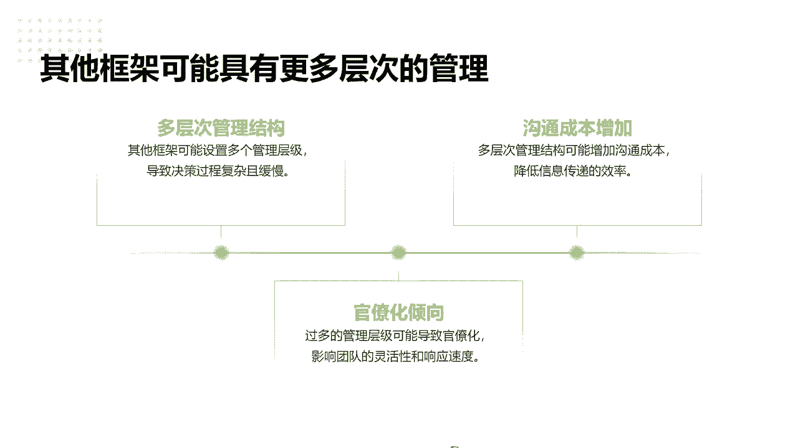
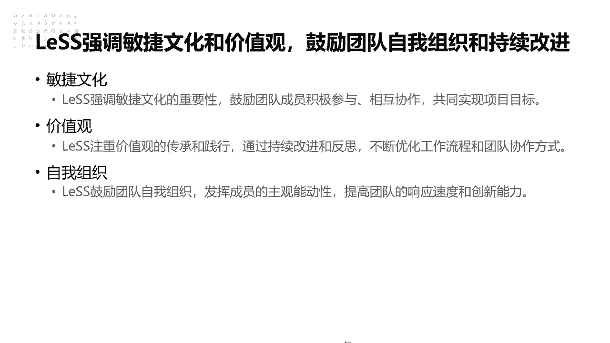
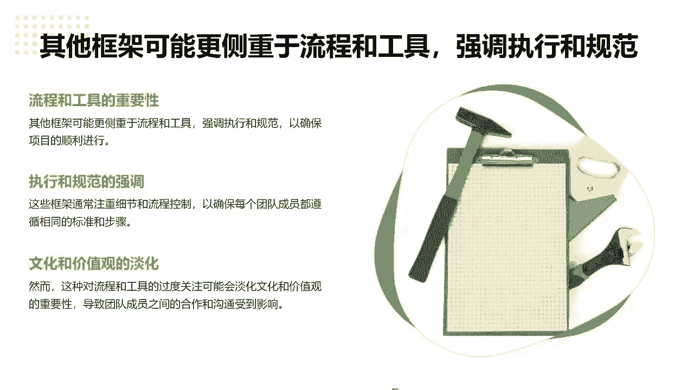

# 高效团队构建实战：7步迈向敏捷巅峰 - P5：5.LeSS对比其他规模化框架 - 清晖Amy - BV1zi421Y7Hh

好，这个再跟大家讲一下跟其他框架的一些对比啊，大家讲一下其他框架的对比。

啊然后类似的一些强调一些简化，它会保证swam的剪辑性，所以我建议大家为什么可以了解一下，因为只要你们学了ACP的啊，我带的学员学了ACP的基，基本上你懂SQUM了，基本上跑类似没有很大的一个门槛。

因为至少从单团队你先可以跑起来，再找到你适合扩展这种方式啊，所以他没有加太多的流程，所以让我们要更加高简化流程，他强调这是流程，他没有加额外的流程，没有什么发布火车，没有火车头啊，这种定义概念啊。

因为有的一些框架哎领导很喜欢是吧，哎每个人都有对应的岗位职责，还有更多的分工了，领导可以说哎更多的预算了，所以可想而知，业内推推某某某S的推的多的是哪些，咨询公司推的多，为什么，因为好给领导去洗脑对吧。

老廖老师可能说的直一点，并不是要去，我觉得真正如果你真正帮助企业团队，能真正转型的，我觉得尊重每一个真正的敏捷框架，敏捷模型，但是我发现很多大家都是说的比较好听，真正落去做的时候。

只是让领导觉得我们跑了这个某某S框架了，所以就觉得很敏捷，很规范了，那结果呢我看到很多案例没有结果，大家只说我在做哈哈，所以这也很现实的流程，我就没必要加，同时也不需要保证怎么样呃，要更多的角色。

更多的成绩，尽可能保证直挂M的核心的概念，所以啊在就是说我们只加了什么，加了加了APO，所以只加了一个区域级的PO，只需要需求，我觉得一个人搞不定的时候，我才会加加个APO，把产品负责人的角色拎出来。

同时它减少复杂度啊，不需要就是文档位一直提倡，就是我们发现很多团队都是为了写文档而写，文的，客户为什么要文档，因为客户觉得怎么样，我花了这么多钱了，我一个项目给了几百万了，最终你给我的时候。

我你没点东西给我，我觉得我交代不过去是吧，我也给我的呃，客户给我的，给我领导，或者给我的上其他部门去交代，所以要腰力推文档的要求，那你发现提了很多文档，有人看，有人看吗，没有人看。

真的我觉得客观来说都是为了写而写，所以我们源自还是产品，第一就跟客户能达成共识，以查快速每个迭代产品交付，去替代一些冗余的不必要的文档啊。

使团队可以啊更聚焦于做产品的交付啊，好同时其他框架刚刚提了，很显然就会角色增加，加了像协调员啊啊加了质量质量保证员啊，仪式比较繁琐啊，可能增加了更多的一些会议的模式啊，发布会议啊啊哈是吧。

然后工建更加的复杂，更加的流程增加了负担啊，那类似采用了单个SQUM的概念，共享的BACKLOGO，所以类似没那么复杂，就是一份共享产品backlog，所以单个团队一个保持协同，那多个团队也是共享的。

就所有人可以可见，因为类似有个呃就是产品级的一个梳理会，就是所有的PO团队成员都可以看，各个团队的产品的梳理，以前大家会觉得这个产品跟我没关系，但是在类似的发展过程中，是不是这样的。

有可能这个团队做着做着诶，两个团队就合并了，因为为什么，因为有的产品做单了以后，有可能这个产品诶发现它们合在一起做，可能比划划到单一的产品做可能更好，因为他们可能变化程度没那么高了。

所以有可能两个产品域的一个团队，就合并成一个啊，所以这也有可能，所以大家都可以做对应的产品的任务啊。

这也是自组织的一个前提，自主团队自组织，自管理的前提是一定让团队首先对于这个信息，对于这个安团队自身的安全感有更好的感知，就是说我能够接触一些不一样的东西，能够学一些不一样的产品的点。

而不是每天都做一样的事情啊，好其他框架就不用说了，多层结构啊，可能有额外的一些协调机制啊，效率灵活性啊啊这些点，而且大家其实可以合想也看的比较常见啊。

比较多，所以类似骨质骨质呃尽量的就叫做feature啊，啊特勤团队啊，讲特勤团队啊，应该作为就按照一般的，而且会不提倡更多的管理层级，所以很多有些同学问刘老师，哎呦，我们这个敏捷做了这么久。

感觉好像没有什么项目，偏猫也没讲什么项目管理，也没讲什么项目总监，那我们发展是什么人，刘老师个人我跟很多同学建议，就是说你假如你真的把敏捷做好了，我我我是这么理解，你老老实这么走出来的，我很负责的说。

我就是从带单团队，要带多团队再组织转型，那你就其实你的发展路是更宽的，你要想从项目的角度来，项目是一定要怎么样哼临呃，项目是一定有怎么样临时性的啊，两个大特性啊，临时性临时性就说一定有解散的那一天。

任何项目都有解散的那一天，没有什么永永远不散的宴席啊，但是产品而跟像这种东西是不一样的，其实你整个生命周期更长，所以说从个人发展来说，如果说你是做你的教练，做PO像政这样简化的岗位去发展。

你会发现你在任何的岗位，任何的行业，甚至任何的部门，你其实都可以去胜任去做，而不是说你只是某一个项目的，你做完这个项目以后，你只清楚这个项目，你到别的项目中，你要换一种玩法。

因为项目项目之间的玩法肯定也有差异性啊，啊就像我们讲PNP考的考了点之后，大家会发现你只要跟大家分享一个点，就是你只要给那种标准答案的答案，你一把这个叉掉，因为在而PMI的理念里。

项目管理实践也没有标准答案啊，所以他跟你讲的是思路思维，一旦你看这个答案是教你怎么做的时候，那肯定是个错误答案，就这是最简单的排除法啊，因为每个项目都有特殊的一个独的独特性，都有不一样的点啊。

没有标准答案也是一样的，你的项目一定可以收尾，但收尾的不一定是你哈哈我们的超同学说了，这个点特别好。

所以但是产品不一样，所以可想而知啊，我觉得其实这也是个大的一个趋势吧，还是希望大家可以啊学更多的一些敏捷理念，来帮助自己提前做一个转型前的一个储备啊，啊所以其他框架有更多的一些管理架构啊。

沟都你就是说白了就交接棒一样的，我不记得是看的哪一个做沟通成本，有人分析过，就是两个人沟通，三个人，四个人沟通，不仅沟通渠道增加，那沟通的成本其实也是几何级的增加的，所以我们一直在强调减少沟通。

减少成绩啊就减少，就是如果是大家唉这个点我是一个任务，是一个人可以完全评估的，而并不是说一个人天天一个人做，就自己的事，就说他可以把一些原需要唉需求理解设计，为什么要讲团队整体去分析，像这样敏捷团队中。

我们就没提需求分析师，这个岗位以前是肯定有的是吧，那就是团队开发测试为一起，参与需求分析的过程，感觉大家这么多人一起来做这个成本增加，但其实你会发现这件事只要一旦开始做以后，越做会越快，效率会越高。

因为以前一个人他只有单个业务模块的知识，他现在有多个业务模块支持以后，它就可以更加的全面的去设计，去开发考虑问题了啊，这也是一个很好的一个点啊，所以尽可能不要增加多的管理结构，那官僚坏是一样的啊。

一旦所以敏捷团队中没有什么小组啊，不要说什么小组长，一旦有什么小组长，因为设了角色，他就有责任要责任的同时，那他觉得这个事情一定是哎，这个这个这是他负责，这是我负责，这是他负责。

虽然很多组织讲的是我们讲的是协同啊，共同啊，怎么怎么样，其实一旦责任划分以后，那大家就是很清楚一个尺度了，聪敏捷团队我们就是把大家做一个池塘，一锅端，我们这个池塘承包以后。

对这个产品结构负责，每个人都要对结果负责啊，这是很重要的一个点，好类似，相对简单，我这也不用说了，因为实施难度非常非常低，如果你现在是一在一个团队跑SQU，我觉得跑类似，我并不是让大家推荐。

一定要上很详细类似的课，我觉得你稍微了解类似的点，你可以尝试回去实践啊，就是说四个团队啊啊，有本书的回头可以推荐给大家，可以看一下，可以学一下，就是四个团队在网上搜一去，就可以开始扩展了啊。

就是看团队和团队之间怎么协，但是其实我觉得类似转型中，这我今天没讲，其实讲PO这个角色，一个好PO是非常非常关键的，包括我讲ACP的课程中，我觉得最重要的转就是这个团队敏不敏捷。

不在这个光master的关联，在PO就像讲门将，一个好门将抵半支队，我就个好PO可以抵半个团队以上啊，哪怕没有时光，master的差一点都无所谓，但是只要PO足够的，那PO并不是他一个人做很多事情。

而是对PO整体的各方面的要求非常多，责任心，他的能力，因为PO要去拆分故事，去带着团队去评估这个折弯心，他怎么做这个产品的闭环非常重要，而且它是连接了客户跟团队的关键的桥梁。

那教练其实就是帮PO这个人拧好这个螺丝，让他别掉链子哈哈，所以叫斯光master，对于PO的一个支支支支撑跟支持也很重要，所以其实难度不高啊，这个非常简易，简易化易做，而且复杂程度也是比较适中啊。

适合小型到中型规模，那是个同学说了，那大型大规模的组织难道就不适合类似吗，没有，其实也不这个意思，说白了就是你一定转型，就像我说就像一个敏捷转型，那个点从来没有什么，就是一下子啊。

全部把可以这个组织团队翻过来的，一定是像什么啊啊春风吹不尽，野草吹又生，就是逐步的一点点滴滴的啊，星星之火可以燎原，一步一步的可以把团队燃起来，就你看到诶他这个团队每天不加班，绩效拿的好是吧。

大家做事也很开心，团队氛围也很好，那我也想学一学，所以一定是这种驱动力，大家逐步的互相的领导，互相的团队，觉得这个东西是对他们有价值有意义的事，这个敏捷才能逐步地推广下去，而不是靠首席什么CEO。

我们今年全员敏捷，我给你们下了KPI，这十个团队全部敏捷，我跟你说，定这种东西的百分之百做不下去，所以大型的可以，但是一定是先把这个小型的火给点燃啊，点起来你才有可能去做啊。

啊同时类似框架有比较强的一个适应性啊，可以根据组织快速的调整啊。

所以这也不多说了啊，所以其他框架一般适合一些大企业啊，像squarm scar是包括一些嗯，包括一些其他的一些框架啊，包括一些一些而且学习的曲线也比较长啊，这个其实我也不说了嘛，加了框架。

像cf这种媒体啊，其他都有，但是它的复杂程度，所以像safe的认证，我记到认证的时候东就是琳琅满目的，各种什么认证，什么都有，不像我们学累死累死，就一个认证哈，我觉得很多时候感觉就是为了刷证而挣啊。

所以这个也是也不是吐槽这个点了，而且他每个镇也不便宜啊，所以很多东西设得非常的复杂，但其实我觉得核心点其实一定，知识是在实践中用出来才是你的，不是考一个字，你就会敏捷了，一定是你真的去用了啊。

跟大家还是分享说一下好，类似强调敏捷文化的一个价值观啊，鼓励团队更多的自我组织跟持续改进，所以这也很强的价值观，还有人觉得这个文化很虚啊，老师刚刚举的例子也说了很多多，像你的机组织这的绩效管理方式。

像你组织中的一些啊，一些领导人那些领导力这些风格，我们讲现在一般都是讲的啊，不讲强管理啊，因为你现在再碰到强管理的我，你说你现在我们我们现在这些公司的零零后，可以分分钟教你这些老八零后的领导做人啊。

可以分分钟教你做人，所以你你如果你还是用传统的强压式的管理方，式去带团队，我我我可以给大家见面，这老师也是八零后，哎，有的同学真的死，我你死的很快的跟你说，那别人那有这些小伙子，哈哈哈哈啊，那可以就分。

就是马上可以离职，跟那不用说二话的，所以大家还想一下，就是说还是要发挥每个人价值，我相信啊，没有什么难管难带的团队，我觉得只有不努力的管理者，不努力的领领导啊，因为有句话很经典，就是有人跟随。

有人觉得跟着你这个领导跟着做，他们觉得是做这个事，一是有价值或者有意义，而且你会发现并不是钱给多了，给足够了，因为从钱的就是工资或者待遇发现来看的话啊，那是永远是给不够的，因为没有上限对吧。

所以团队成员愿意跟着你，就一定还有其他的方式，像我带的一些团队，包括我曾经历的团队，我发现大家氛围很好，虽然我可能在的公司岗位行业工资，我觉得我刘老师我觉得真的很低了，我就客观的说，我要到北上广。

那起码可以翻四三倍到四倍都可以，但是我觉得就是大家还是有比，较好的文化氛围吧，而团队之间也比较好理解，相互也比较信任啊，就是大家真的是兄弟姐妹一样的啊，可以在在在一起，所以大家有这样的文化氛围的前提下。

我觉得做敏捷，做任何事都可以去做，这才是一个文化真正落地的一个关键点，而不是靠吹一些口号啊，那价值观也是一样的，我觉得价值观的传承这种方式很重要，就是让大家去理解做敏捷。

而不是为了那么高大上的帮助老板做敏捷转型，让我们企业看到很多高大上，我觉得我跟我的很多团队成员就讲敏捷，就是为了自己，为了你自己不在这个社会上被那么快的被淘汰，所以你要用敏捷的思路去不断迭代。

你个人的价值，你的价值不是领导说了算，也不是别人说了算，而是你通过实践不断定义出来的，啊啊刘老师，我今我今年最大，我今天很多分享说了，经常我自己的一句我不讲不讲，叫京剧吧，就讲我自己讲了一句。

我觉得个人算了一个非常啊，可以分享给大家的一个感悟，就是我希望就是首先啊我们不去任意去定义，任何一个，不去定义别人的价值，我们也不让自己的价值被别人定义啊，啊就是这句话就是这个意思。

就是不要去轻易定义他人的价值，就不要去，因为你一旦定义它的价值了以后，你对他就会有一个偏见啊，这个人好，这个人能力不行，这个人怎么样，你也不要让别人定你的价值，也不要被被别人去轻易的PV啊。

所以这个东西是一定要有自己，有一个很强的一个对自己，自我价值的认可和理解的啊，所以这也是分享给大家对于价值观啊，那这个组织就不用说了啊，这个对于整体的一个主观能动性是要求很高的。

那其他工具对于流程啊可能更加之强执行对吧，规范性啊，更加的细节，你像某些某些那个框架方法啊，我我我也挺佩服他的，那他这个框架像某S框架的，它迭代到五五点几了，五点几的版本了吧，5。0啊。

五点几就是它本身框架，就是现在市面上最流行什么概念，我就把这个概念加进来，所以你发现现在这款类似的框，那个shift框架会发现，不管什么the opposa b什么东西都融进来了，最新讲的框架我都融。

我都给你迭代，你看我这里啥都有吧，但其实你会发现越是啥都有，什么都有的，能落地吗，能去实践，能改变吗，感觉是什么都有，但其实什么都解决不了问题，就是还是我觉得老祖宗讲的话特别好，大道至简。

真正核心的能改变的东西一定是能简，一定是简化的，一句话就能记住的啊，所以今天我特别想分享给大家，如果类似的框架是其他人不记住，你记住老师那句话啊，啊类似人莫少即是多，那少比多多好也可以啊，少即是多。

做任何事情，你要学会做减法，不要做加法，加法是分散你的注意力的，做减法是提升你的注意力，专注于更加高价值的优先级更高的事情啊，我觉得这这个是可以，今今天我觉得更可以让大家带回去的啊，就这一句话啊。

那规范性文化价值观就不用提了。

是一样的啊，所以我们是要根据组织规模，选择合适的框架来做的啊，这个东西我就不细说了啊，组织文化，因为今天可能前面讲故事有讲的有点多啊，后面的内容还有点比较多，所以这个我觉得也不是重点，大家快速讲一下。

就是说你如果说讲你的组织，你本身就是很规范化的，像传统的呃，像啊不说运营商的，还还是说传统的银行业的，那没关系，你大组织你可以有自己的模式，你有流程，那我先在小团队先做试点，然后通过试点以后。

我们再来找到一种，契合到我当前组织的这种模式，我再逐步去做，那最好的还有一种方法，有有些公司就会借助外界的一些评级的模式，因为我知道信通院又DF的评级，而且这也是种思路，那我就借助第三方的评级认定诶。

这个团队做了，因为评级他是评的项目啊，要借助这个评级，不是评的那个组织，就这个项目已经达到Deft的成熟度啊，三级了是吧，在持续交付领域，那那那你们能不能向他学一学，那别人去搞的话。

唉别人觉得这个做的有动力了也可以，那这个成本虽然说比较高，但是也能启动做啊，现在很多，我发现评级过激最多的就是银行业的啊，哎银行业确实也有钱，只能这么客观这么说，但是还是可以推动组织性的变革嘛。

就什么事情没有什么一蹴而就的，一定是先撬动底层的这个这个砖啊啊，就是这个固有的一些思维啊，和组织文化也是这样的，那项目需求也是一个点。

但是我是还是个人建议，其实类似的方式是可以让大家比较好，小成本的同时呢，你们也不需要太多的一个呃，一个准备就可以开始启动去做啊，所以考虑到框架的复杂度，适应性，实施难度啊。

所以还是我觉得推荐给大家可以尝试一下啊。

用意思啊，好再看时光。