# 高效团队构建实战：7步迈向敏捷巅峰 - P6：6.Scrum Master的角色特点 - 清晖Amy - BV1zi421Y7Hh

中的一些落地啊，这些角色，这个我可能会稍微重点会跟大家分享讲一下，因为就我的同学，有的同学我知道也是学了CP的，一般你们可能就是未来职业发展成SQUMASTER的，对吧，你的项目管你的项目管理专家啊。

最近前几天我还在面试啊，哈哈哎面试了一些，因为我发现在一些小城市，像广西可能稍微比较偏远的一点省市，而很多人不知道敏捷教练是什么，也不知道时光八次是什么，根本就不知道了。

所以后来我只能把这个岗位写成了一个敏，项目助理，我都很无奈啊，后来我把这个岗位本来是造时光敏捷教练的，后面改了个项目助理啊，管一堆的简历都投来了啊，这也是无奈之举，哈哈为什么讲的是助理呢。

我没敢选项目经理，因为写的项目经理哎呦，这个大的这个思维模式或者有一些差异点，可能不好理解啊，你会发现我的助理跟大连，我就跟那些面试人同事也朋友就说了，我说助理其实说白了他是没有职权的。

就你的教练就是你没有权利去要求项目怎么做，你更多的是给项目以支持的工作，学会调整，那说白了第一件事，让你要你的教练先给他一个下马威，就是你没有权利，这但是这第二点好处，正因为你没有权利。

所以你可以大胆的去讲去反馈，你要学会去向上管理，想找老板去授权去做一些事情是吧，所以这个就对你个人的要求了，我觉得也挺也挺，所以但还是一样的，跟传统的啊SQUM一样的类似中啊，负责团队间的一些协同是吧。

推动美金融实践，就是说白了要推动单团队，你说一个mask master可以拐呃，1~4个团队啊，可以带同带一到，所以带完这个以后带其他那个都可以带啊，啊可以帮不同团队去实现去拓展。

同时主要是解决团队啊中出现了一些障碍，一些问题，但是一定SQUMASTER来解决是吗，一会再讲。

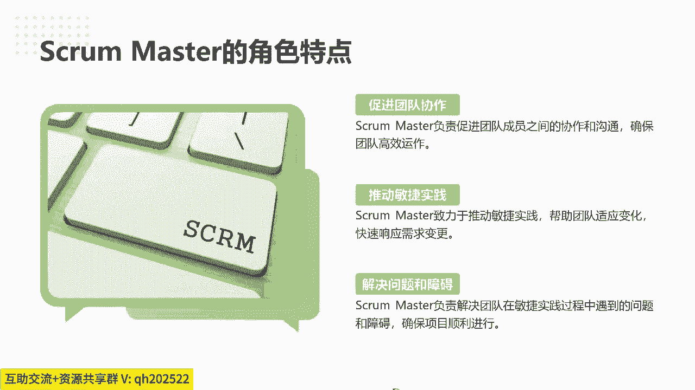

不一定啊，包括促进团队协作，解决冲突提供指导啊，特别是团队发现冲突的时候，就是真的有些非常紧急的冲突了，丝瓜8S的介入的，我们经常讲教练不下场，教练不下场观众，我很多一些考试的学生们，ACP的学员都讲。

就是你的教练是干嘛，就是说这种事情不需要你做啊，我说了不需要做事，不需要你去写代码，帮团队写代码啊，但是团队比如说足球厂商说哎，这个团队打起来了是吧，你有裁判介入，那你的教练能做得看吗。

你肯定要去拉他喊一喊对吧，你要解决冲突了，冲突一旦发生就是影响什么，影响你的项目的就是迭代，你要中断你想的项目交付的时候，你就要及时介入了啊，教练还是要上场介入的。

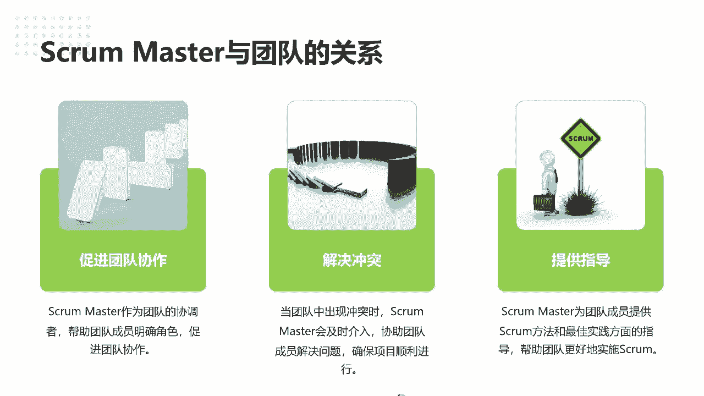

保证项目顺利进行啊，啊同时他也是协调沟通的桥梁，同时最主要就是刚刚提到了，他定是个变革的一个推动者，它一定是要推动整个组织转型去做变革的啊，啊包括再分享一些不必要的注意事项，包括时光master。

其实这个时光master不管在类似中，跟你跑试光谱中是一样的，就是不要代替团队做决策，再次跟就大家分享一下，就是因为并不是说啊是因为sschool master的不懂，因为我记得有些女生问刘老师。

刘老师啊，我觉得我不懂技术，人不适合做SPA master的，我说没关系，可以的，但不是说你什么，因为你不懂技术，所以你不能帮团队做角色，不是这个意思啊，而是说一旦帮团队做决策以后。

哎团队会觉得这个事就应该你来决策的，遇到问题就应该找你，因为你开了先河了啊，所以这个东西因为团队要他的对他的结果负责，就是还要团队自主决策，包括做一些引导会，但是so master什么。

你可以帮助团队有引导师，我跟我在课上跟大家分享过怎么做引导是吧，有几个方法啊，讲时间回路A这件事情，当下你有没有办法的时候，如果再过一年，你有什么好的方法，那从时间维度去跨越。

而假如这些资源你现在没有资源，你什么资源都有了以后，你能怎么做，用团队先从想象力想一下，先不要先抛问题，抛困难，因为大家已经发现遇到困难问题的时候，大家都是说我没有资源，我没有时间，没有什么。

你会发现就是聊不下去了，但是SUPERMASTER的作用就是你可以让团队先想想，这些资源去掉以后，你现在能怎么做，我们再逐步看诶，假如我不能一步从一做到二，那我有没有可能先把这个一的风险降低点。

我有哪些事情可以做的对吧，就是让团队多思考这SQUMASTER，就像我有时候开玩笑就说就像团队的，怎么样像团队的镜子一样啊，你要帮团队造出他们的困难点出来，要照射出来，就经常呃我开玩笑讲。

我的太太对我来说就像呃未针对啊，唐太宗药，唐唐太宗药呢就是就像那个照镜子一样的，我任何的问题缺点，我太太都及时的帮我反馈纠正，沃里奇还还是蛮感谢的哈哈，所以也不处理冲突啊，不处理冲突也不要介入冲突。

并不是说不能处理，我说的是只要没到产品，就项目不能交付的程度的时候，就不要因为人跟人是团队，就比如说团队资源啊，团队成员有矛盾的时候，让你团队自行解决诶，刘刘老师可能问刘老师，那他们有矛盾。

你天天跟他吵架不拉吗，这个东西看场合看情况的，就尽可能的你比如说个别团队成员，两个人之间有冲突的时候，就把他们拉开，他们当下来解决啊，就不要影响团队整体了啊，但是出现一些共性的流程的冲突问题的时候。

那就团队一起来探讨啊，同时不承担团队的责任啊，这个也是提到了团队要为结果，自己为结果负责，所以要团队自主决策，提供决策的支持，培养团队决策能力，这些时光master是可以去做的啊。

就如何培养团队能快速决策能力，因为这个一讲就太划算太多了，因为决策的方式，包括啊团队教练的一些培养的方式也很多啊。

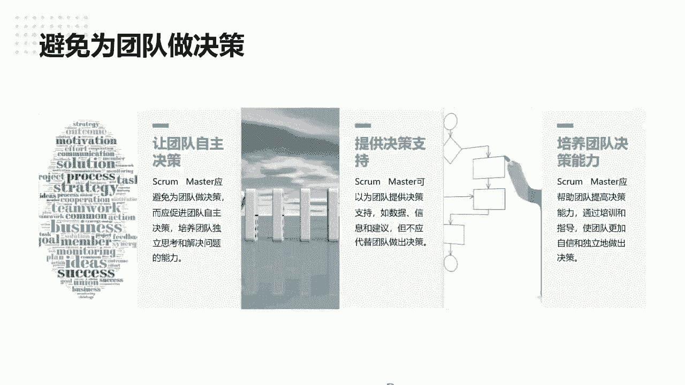

这个都就不在今天的课程去讲了啊，好谨慎的给出建议，不要过度指导团队啊，也提到了。

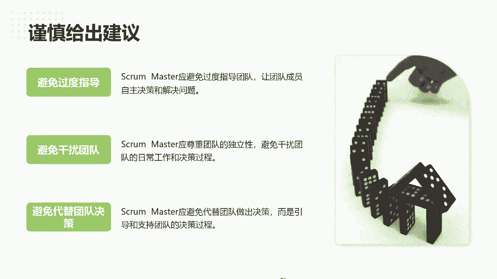

不要干扰团队哎，这其实啊这个也是要谨慎的清除障碍啊，也不要干扰团队的工作，不要直接解决问题啊，反复也提到了，不要提团队做决策啊，好这里再分享时光，第一个工具叫提问啊，就是如果说你在都带团队的过程中。

提问是最重要的，所以学会提过好问题，因为老师最近在用AI的时候会发现哇塞，因为其实关键就是考验你的提问题能力哈，并不是说考验你的解决问题，就是考验你如何提出一个好问题。

关系到AI能帮你生成什么样的样本数据对吧，所以这个是最关键的技能，推动项目解解决跟进展的啊，所以对于SQUMASTER来讲，我记得讲项目，项目管理啊，项目经理啊，项目经理讲我们讲90%的精力在干嘛。

就在沟通，那其实对SQUMASTER的90%的精力，就是在聆听跟提问题啊，可能所以这个东西就是一个差异点了，他通过提问的方式，让团队自主的找去找到解决问题的方向啊，所以提问的技巧这是需要去锻炼的。

同时什么时候提出合适的问题，因为今天老师不是一个正式的课程啊，真的是个分享，所以讲的比较粗一点，这个需要大家考虑的就是，不要在不恰当的时机去提一些问题啊，和时间提问，那教育这个就是指导团队怎么去。

怎么样去熟悉工具，了解工具的方式进行培训啊，所以培训这个是对于团队的技能的培训，SQUMASTER的对于团队的技能培训很重要，那引导也提到了，是因为大家也知道有专门业界有很多引导师啊，有很多引导的工具。

包括我刚提到了，之前呃，有一个呃，就是说有个5Y阿拉什风电公司用来提问，问问题的包括还有一些啊，还有其他的一些引导的一些工具还挺多的，所以这个老师不细讲了吧啊，就因为今天的课程比较特殊点。

所以你可以了解学习也合适的引导工具。

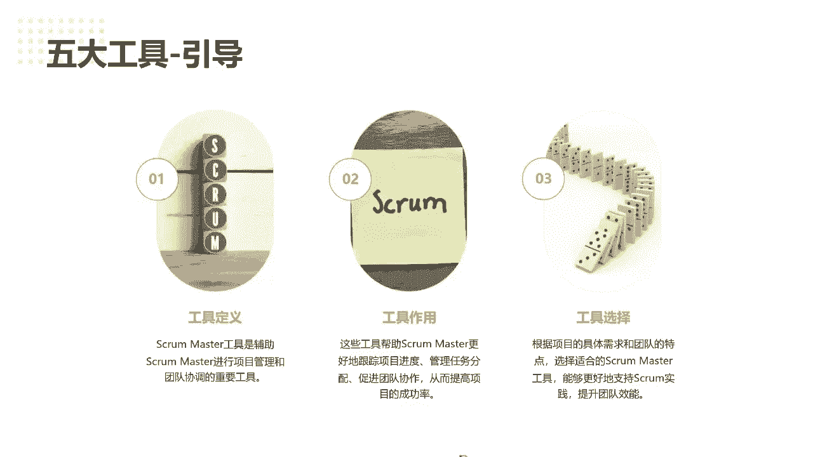

帮助团队来赋能，比如是作业引导的工作坊的方式啊，让团队学会怎么去找问题啊，那无为而治也是一样的，尽可能不要东西，让流程啊，工具太复杂化啊，不要让团队过度依赖啊，就是让团队结合实际情况，用工具。

不要过度依赖，同时让款工具成为团队工作的一部分，而非主导，就像我说很多做我们做敏捷，做项目管理的工DPS工具链一样的，就工具链一定不是让团队依赖的，而是让团队结合着实际可以灵活快速调整。

就团队在上面都可以直接留痕，通过流回以后，我再反馈到哪些可以帮助团队提升改进的，而不是做一个大而全的工具啊，我觉得这个也是在做敏捷过程中，一个比较重要的一个点，就无为而治啊。

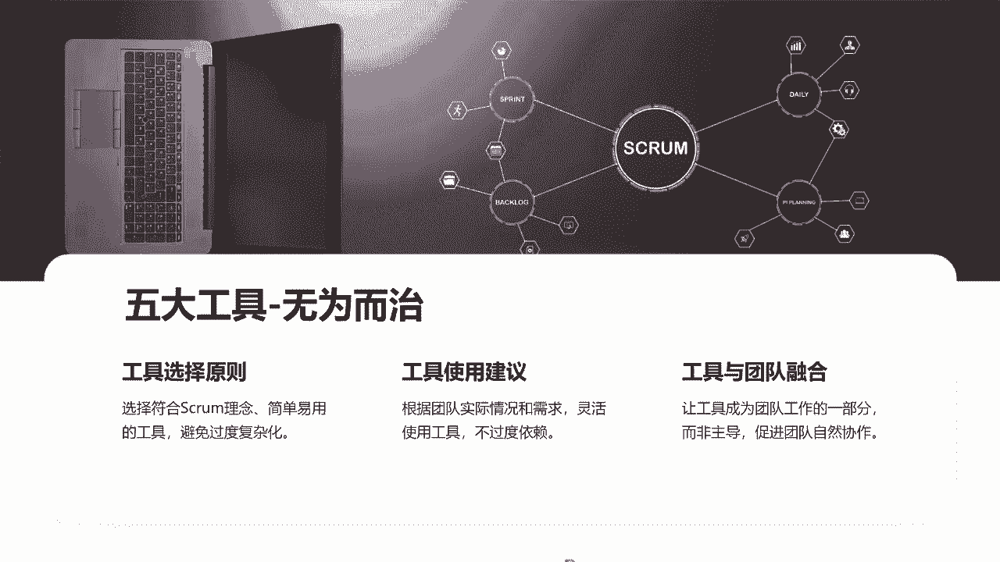

啊中断就刚刚提到了过于紧急的任务，那导致的时候需要及时中断，找到中断原因，然后及时的处理中断安排任务，比如说个别人员有一些冲突，他不能进行任务的时候啊，避免项目进度不要影响，而且要中断预防那合理的分配。

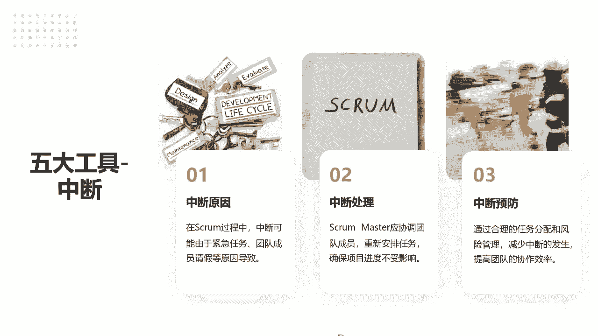

而预防风险来保证中断一些任务的概率啊，所以这里提到了，还是要避免确认我们的角色的定位啊，尊重团队决策。

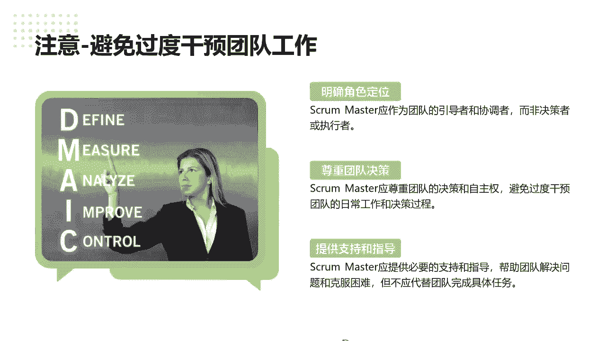

提供支持和引导啊，同时我们的SQUMASTER要尽可能的保证，我们能更积极的倾听啊，所以呢啊过度的比较避免过多的干预，持续改进和优化呃，这里跟大家可以分享squa master，其实它是一个非常重要。

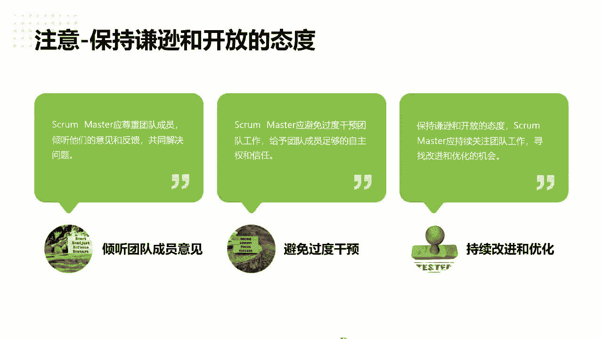

我们讲类似讲SQUA，讲敏捷中就是两个圆，往后会讲一个以圆的一个反馈环的，关键的圆反馈环啊，所以次过八次的，对于这个反馈的重要性非常大的啊。

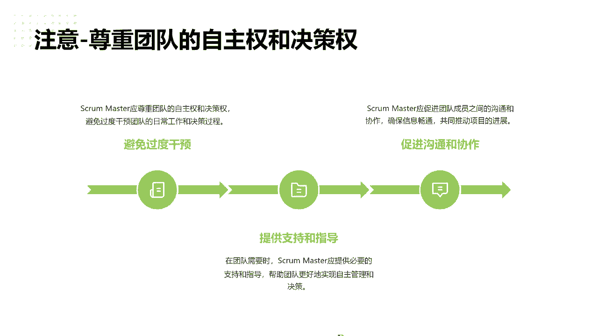

啊这里其实也是一些啊。

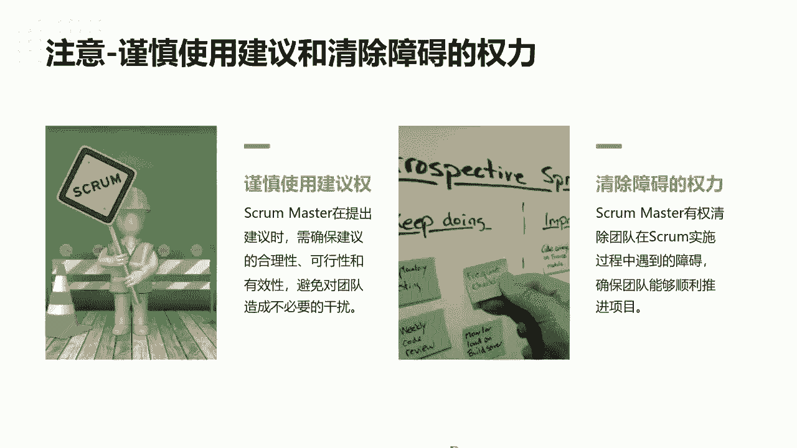

如何清除障碍的一些点啊，这里我就跟大家不重点讲了好吧，然后这里就最后终会分享这个sa master的，关于和分享，一定要有组织级的系统思考，我是建议如果你们做学敏捷教练的。

或者学准备做squa master的，就一定要学会怎么从系统思考的角度去理解啊，啊，不知道大家有没有听听，特修斯之船那个案例是吧，整个一个哲学加铁，就是说如果这个时候船啊，如果像他有块木板坏了是吧。

就换一块木板啊，一旦这个把所这个船的所有的木板换掉以后，哎这个船还是原来的那艘船吗，啊就引发大大家一个思考啊，其实从系统思考的角度，就是就是这个世界的任何事情的逻辑，就可能就分为这三个要素。

一个就是哎这个系统的要素，或者我们讲的要素是什么，就事情比如说哎他这个水呃，我们老师身边有个水杯是吧，那这个水杯它这个要素本身是什么，然后它跟外部的连接是什么构成的啊，这个水杯有杯坝。

我可以拿到杯坝来喝水是吧，那它具备什么样的功能啊，就是是任何一个系统，就是最最简单的要素功能和连接啊，这个系统思考书到这里提到，所以一旦理解这个东西以后，你会你就分析，可以看一下。

发现这个问题有哪些要素，它跟别的要素之间有哪些连接，这要素本身代表的功能是什么啊，从这种方式能考虑这个全局啊，我们讲上帝视角，就真正能找到一个界，推动这个产品或者推动这件事情，解决一个真正的一个原因啊。

所以要关注团队的成长啊，就是正真正我觉得就是在敏捷转型中，最重要的作用，就是说除了大家去把产品把事情做好，就是团队能力的成长也是非常重要的，这个也是团队要关注的好吧，创造比较好的环境啊。

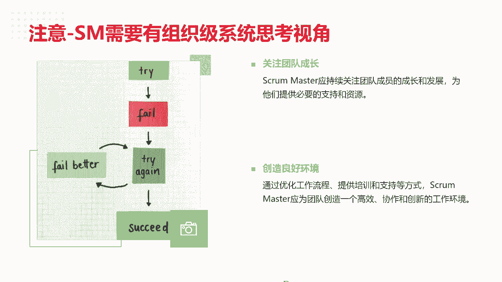