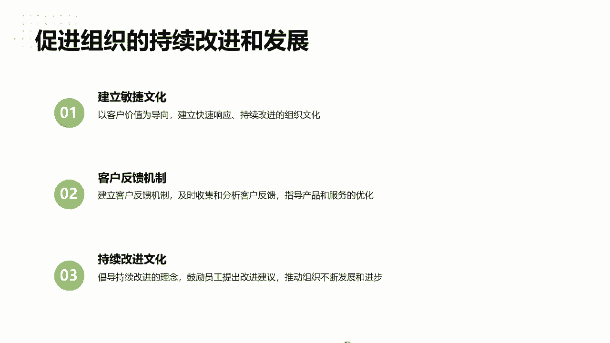

# 高效团队构建实战：7步迈向敏捷巅峰 - P7：7.快速启动的关键要素 - 清晖Amy - BV1zi421Y7Hh

是的好，后面给大家分享讲一下快速启动一些策略。

所以基本上啊就是这三个步骤啊，明确转型目标啊，比如说组织转型，所以最重要的向上对齐，我之前和大家分享过KROK啊，其实我觉得这比KPI最大的一个好处，就是说KR是给了团队去向上对齐的一些方式。

就是他把传统的KPIKPI大家都知道啊，领导说我们这个部门要把完完成1000万，我下面三个部门，每个部门怎么完成三百三十三三十三万，就是均摊是吧，这就是往下列KPI，把领导的KB级就派下来，那OK啊。

他的目的就是说更多的是诶，我们先看一下我们团队具备什么能力，领导的目标是什么，我们怎么通过我们做哪些事情，能向这个目标靠齐，我们来分解我们的一些代办的事项啊，我们的KR是什么啊。

我们确定我们的O在跟对齐，但这个一定不是把它拆分下来的，会有些业务关系，但是一定是团队自己来去去评估，去看，那领导一起来去对齐，这个我就觉得是很重要的目标，就千万不是要像我刚刚举的例子一样子。

哎今天我们领导要做的转型，这个社团是个团队，必须要做米捷转型，那这个做下去可就肯定是完蛋的，做不下去的啊，好第二个小范围的试点，所以这个我刚才说那个画了个红线，很重要的点，就说先看你类似适不适用是吧。

找四个团队先跑一下，看那关键就是找的谁是PO，我刚刚说了，为什么要销售，就越接近客户的人是越适合做PO的，同时这个PO有责任心，他不能说只忽悠啊，还是要落地的，所以这个人员的要求责任心要求很高。

同时快速反馈调整啊，所以这里提到了两个原反馈回路，大家知道有两个会议，我说的意思说的很多的啊，就一个是我们讲产品级的回顾，就是我们的迭代评审会是吧，针对于做了这个产品，我们要做功能演示。

还有一个会议是很多团队不会开，就是我们的啊迭代回顾会，因为回顾会大家觉得哎就是团队，你只针对流程做改进好，那聊一聊去聊些废话，其实这个就是对于团队的最重要的一个会。

所以敏捷中两个原反馈回路也是squall master的，我说所有时光master，如果说你带团队不跑回顾会的话，那这个SQUAM是白跑的，我客观的说真的如果回不会，如果不做这个东西白跑。

因为团队没有改进，没有改变，就是在就在不停的去走原路啊，所以这个也是跟大家分享一个点啊，快速启动的步骤，确定目标以后组建团队啊，定个计划就快速迭代，所以我一般带团队做转型，基本上一个星期就可以启动了啊。

就是培训导入，然后确定你们手上还有多少事情哦，手上有这么多事情，我就列一个遗留看板，然后剩下剩下的新作的故事就拆分出来，就启动去做就可以了，然后在一个迭代消化，把遗留的消化完成。

下个迭代就是全新的所谓的学故事，所以不像之前大家觉得做敏捷迭代哦，我要找一个团队，从0~1很大的困难，什么样都做，然后这个团队手上没有活了，我才能给你看，然后很多领导就会说，有些人管理人就说哦。

他上面很忙，这个月要冲进度，没有办法做敏捷，就我跟大家有个误区，说做敏捷不是让大家就是从头开始，或者完全怎么样推翻重做，只不说就开发还在写代码，只不过说原先的写开码，他只要你把它分配给别人做。

你现在可能经过一个迭代以后，他学会自己拆分任务出来，自己去交付，去做评估是吧，要团队拆分出来，大家一起去做，这还是写代码还是做交付，只是说沟通协调的方式不一样了，其实对于团队的影响很小啊。

对团队就是原有工作的影响，那同时要快速的风险识别啊，这个还是要识别风险需要哪些资源啊，你类似没提到管理层，但是管理层肯定项目经理，项目总监，项目pm肯定，还有就是更多的是转换成一个资源的提供者。

提提供者给我们的团队去提供支持啊。

如何做风险应对监控调整啊，嗯那持续改进这个是很重要。

但是这个我觉得可能今天的时间点哦，可能不能讲的太多，就大家讲一下思路，其实基本上就是先定一个标准，我们这是做转型的阶段性的标准是吧，比如说培养几个团队达到什么速度，需求交付周期要缩量多少是吧。

然后持续的看我们的过程，一些通最好的通过工具平台的方式持续检视啊。

要及时调整优化，那包括一些识别到问题以后，我怎么去评估问题，分析原因，调整策略，这也是一个比较常见的方式啊，然后然后我们的团队如何去培养，合适的敏捷思维啊，敏捷思维这种方式其实有很多。

一些小游敏捷小游戏的方式，感兴趣的同学可以自己去搜一下，我觉得是还是我们现在讲的游戏化管理，游戏化思维啊，我之前听那本书讲游戏化的，其实你会发现游戏画这个东西，并游戏不是个坏事啊。

我不是要说要带着团队做游戏，大家可以想一想，你们在玩游戏的时候，你们是玩那种最最最难的挑战，难度最大的游戏吗，肯定不是吧，一上去被boss11巴掌就灭了是吧，是玩那种最简单的吗，那也不是嘛。

肯定是玩有挑战性的，所以你带着游戏思维给团队去定目标的时候，就是让大家找到那种可以怎么样，你不要太轻松就搞定的，也不要搞不定的，找那种需要踮踮脚才能搞定的那些产品，对应的迭代的目标，Spring go。

这个才适合团队去挑战，然后他就坐着诶着里有需要踮踮脚挑战一下，同时也不会特别累，其实这是游戏化的思维的方式哈，好类似的工具，同时可以优化流程，不断的去调整改变啊，提升改进的文化，所以一定要做回顾会议。

让团队自己的分享，我们这次做类似的转型，敏捷以后，我们有哪些改变，我个人有哪些改变，团队有哪些改变，跟大家来说一说，多探讨一下，为什么我们讲回顾会不提倡领导参加，因为很多大家觉得领导对于这个。

因为可能风管理风格有关系吧，啊可能领导一来了，大家就变得静养或者听领导的训话了啊，所以现在其实未来的企业来看我，我现在所理解，那传统的领导其实很难这样搞下去了，假设你不能真正理解这个团队的话。

你一定会被我们未来的零零后好好的教育的，哈哈在刘老师身边有同事经历过的啊。

好最后一个点啊，最后还有十来分钟的时间跟大家分享，就是今天最终如何打造以客户为价值的中心，那个组织啊。

类似框架下也是最后一个一个章节了，跟大家重点分享讲一下，首先就是我们的feature team，就是我们的团，就是跨城人团队怎么做，所有同学问老师诶，老师是不是要开发学测试，测试学开发或者叫需求的。

要去转行做测试，做开发，不是的，只是说我希望这个团队构成，我们讲的跨省人是这个团队要具备之前做需求，做测试，做开发，这些人都有啊，不同职能背景共同组成，然后他们随着这个团队要做个完整的交付。

千万不要这个团队只是前端开发团队，我要等着测试团队交接报，我发现现在很多一些企业中，就是这个部门强，最大的诉求就是说，因为测试跟开发是两条完全不同的业务线，而不是就职能线。

所以导致这个部门强就是感觉是深不可逾越，因为领导的领导完全也不一样，所以这个点也没办法，我也理解是吧，因为上述的领导，所以你就很难说把测试团队融入到开发团队去，做敏捷啊，这是客观情况呢。

实际上实际上我们来看，我们是希望通过打造这种跨城的团队，像美国特种兵团队一样的，我们足不能来接更多的需求跟产品的任务，我们来熟悉更多的产品，提升我们对产品的理解啊。

因为业我觉得原来可能我们有很大一个原因，就说我们不可能按照什么业务，按照可能某一块划分，唉这这几个人就只做只了解这一块业务的事，因为领导说他属他就做这块事，所以他也不清楚别的业务。

但我发现产品越做越大以后，产品是一个庞大的一个系统，一个组一个系统，你要从系统思考的思路去理解，而不是谈产品的单个功能，所以你就是任何一块模块的问题，都都有很大的一个风险去影响啊，所以这一定要考虑全面。

所以团队对于产品的整体的全貌理解越深，那你产品的质量才会越高啊，这是一个很典型的问题，所以一定是从最小开始，我们就先从小团队嘛，我们逐步每制造这个团队，可以覆盖所有的产品模块。

我再看我们的职能怎么去划分对吧，好团队协作也是一样的，需要共同一起来定计划，做分工合作，确保实现，所以所谓的迭代计划会，我们大家是一定要一起参与，包括我们的类似中的啊，我们这就是产品级的大的数理会。

那产品的核心人员也要配合别的POAPO，一起去参与啊，那非得TM一定是客户价值，因为我们的需求是来自于我们的特性，来自于我们交付的功能，所以一定是以功能就是给客户能用。

能看到客户体验体验体体验的一个反馈来看。

所以负责整个产品的组件，产品负责人N1定要负责，对最终的交付负责是吧，那跨部门的协作，我们讲产品负责人经常讲的是那个啊，其实他管钱的啊，产品本人是管钱的，能决定项目预算的。

这个跟我们传统的产品经理是不一样的，所以不要理解是产品经理啊，他是能够管资源，管钱的啊，同时是跨部门协作的啊，是跨部门协作的，能协调不同的一些开发团队并行的执行，包括客户价值所导向。

所以我们强调客户价值就是产品，一定是深度理解，而不是某一个需求负责人，他能真正理解客户的想要什么啊。

能不断地优化产品，给团队提供方向，因为我知道很多一些我们的产品经理PO啊，是我们的需求负责人需求转过来的，那传统的需求人员就是说啊客户提供东西，我就拆分细化的写啊，其实真正做出来什么样子。

他没有那么Q那么关注，我，只是一个把客户的东西啊，去拆分成一个需求分析文档的一个过程而已，其实这个是还是有一个比较大的一个区别啊，所以一定要聚焦整体产品的客户价值，就不要以单一的产品。

要以客户的需求为整体为构中心，去构建我们的产品开发团队，那通过客户的反馈来驱动产品的迭代，所以产品一定目标一定不是一成不变的，就客户，比如说客户今年哎，我觉得也不往往传统的一些开发领域做。

我要做安全域的是吧，那这就是客户安全域的做了一个规划，那我们就往安全的提前去做一个储备。

一个计划啊，所以包括跨部门的协同也是一样的啊，所以频繁的跟客户的互动反馈很重要，所以跟客户的定期的满意度调查啊，反弹啊，我经常会要求我们同事要什么，要叫go see，就听见一线客户的声音。

真正能用到我们的工人，人给我们工人买单的一些反馈啊，实时的响应客户的需求，最好用系统it系统化的工具去拿啊，一些反馈一些结果啊，包括如何去持续改进产品跟服务也是一样的。

然后通过产品演示的方式，可以让客户怎么样，逐步的看到我们的一些反馈的结果是类似，也提到了有单产品，单功能域的一个产品的迭代演示，还有我们产品级的会议要求多个APO一起来。

我们做团队及整个产品级的整体的演示啊，这个也是对于团队一个非常学习，提升能力的过程，功能是定期增加的，所以你看的类似的模式呀，跟SQUM其实并没有，他只是说把你的团队上面我们按照产品。

因为一个啤酒管不了这么多产品，然后我们再做一个切分，做个拆分，就团队就是保证一个十个把十个人，那个SCM团队做交付就可以了，那之前我也带过一些开发团队，就是说那确实人为什么要拆人。

就不是因为SQUM只适合3~55，3~7个人去猜，而是我们发现20个人就超过十个以上，就是团队，你在开战例会也好，开迭代评审，开开迭代回顾，就是沟通成本太高了，所以没办法才要拆。

而并不是大家理解SQUARM框架只适合，是因为我们承担不了这种沟通成本而已，因为大家比如开个战略会，20几个人，我带过23个人开过战略会啊，后面我是怎么开的，就是说让大家提前一天更新好你的进度看板。

第二天有问题的，留下快速同步啊就行了，没问题的，就就滚回去了，就该该该回去，该干嘛干嘛，后来没办法，就是还我们还是把它拆分开来，因为我觉得这样的战略优惠方式，还是会损失大家互相信息同步学习的机会啊。

包括像类似种比较提倡以客户为中心的话。

我们就一定要支付交付价值啊。

客户反馈团队开户是协同，同时要能接受一些变化啊，组织其实也这个也是说的比较直接点的，就是真的管理层也好，就要真正考虑我们的这个组织存在的价值，企业存在的价值，团队存在的价值是什么啊。

到底不是为了啊做得很忙而去扩，而是说让我们的效能做产出的东西，以更精更少的时间，那加更高的效率，产出一些对于客户真正能少返工的一些产品，这个我觉得才是团队一个价值，目前来看的一个方向啊。

所以持续改进就是快速迭代，这也是一种啊，好团队自组织这里啊接纳变化，团队自组织也是团队有自我决策的能力，所以这个是很重要，如果你要以客户为中心的话，就是一定是这个团队我们有同学收了。

我们可能现在呃疫情之后，有团队是在呃虚拟，虚拟就是大概可能分散在不同的地方，那大家你想的是以集中的话，已集中在哪里，最好是集中在团队，人最多的还是集中在客户那里啊，所以跟大家分享一个点。

就是一定要怎么样在客户那里去做集中，就最接近客户的地方，而不是离客户远远的哈哈，所以团队自组织很好，那首先他有一些决策权，所以我一般建议一些团队啊，会给团队一些自身的一些KPI的决定权。

其实有很多领导会讲，我给的KPI去，他会不会摸鱼，会不会怎么样，其实人就是这样子，我跟大家说一个，因为老师也学了心理学啊，我也是心理学学了一个心理学硕士的，所以心理心理学上来看，一旦人就是天生的。

你跟他安排伙安排事情的时候，他会觉得这是你派给他的，他做不好是理所当然的，因为你不理解，因为他可以准备好借口啊，这个事情这点没考虑到是吧，你拍给我的时候，你没想到，所以搞不定了，但一旦这个事情怎么样。

是我团队人员成员自己决定的，我唉我领导只问他，就领导换个思维考虑，从你教他怎么做，变成诶你觉得应该怎么做，能达到我们这个目标，只要他自己讲出来的东西，他一定是拼了命去完成的，这种心理学上有这样的技巧啊。

所以团队自组织了，大家不要担心团队再去摸鱼，每个人还是有羞耻心的，会对自己的承诺会努力的去实现啊，这是团队自主之就，大家不用担心效率，效率一定会可肯定会前期肯定会提升的啊，但这个决策你会发现。

就是尽可能的要提升决策的效率，这个很重要，就是不要你一言，我一眼的，大家太发散的，就关键时候哎SUPERMASTERPO要站出来拍一下啊，让团队尽快的决策啊，好跨责任协助，这也是很重要的。

就是你要先具备多技能以后，我们才能更好地去评估别人的工作能做什么，我才能更好地提升我的能力啊，同时在每个回顾上，团队其实我没有发现，现在很多一些报告我们讲领导要自我批评是吧，这其实不是说一定要自我批评。

而是说告诉我自己一个方向，我经过这个迭代以后，我下个迭代有哪些可以成长学习的，更好的来优化我们的流程，优化我们的方式啊，这个就是我们说的很重要的两个原反馈环，一个产品级的，一个团队级的反馈环。

所以回顾会我们的自我的一些优化。

这就是在团队级的反馈环中很重要的一个点啊，所以同时对于如何打造客户中心价值的时候，我们要学会定义产品的愿景，而设定优惠级调整优化跟投入啊，这个时间关系我就跟大家不细讲，因为怎么说呢。

这个可能更多的是在管理层，我觉得这个思路还是比较好理解的，我们讲项目管理一样的要做啊，我们商业策啊是要做商业策划是吧。

要分析要分析战略分解啊也是一样的，同时跟客户要紧密的合作啊，建立公众渠道有效沟通，所以因为我们发现PO就是一个关键的，承载客户跟团队一个重要的一个渠道。

所以好PO非常的重要啊，那同时指导开团队开发符合客户期望的产品，所以这里提的是PO成绩，你要学会理解啊，如何去制定产品的战略，如何去跨部门的协作啊，啊这个东西要共同去推进演进的，那同时优先级怎么定。

我跟大家分享一个说的，就是大家分享优先级，很多人定性婚姻几啊，就是呃谁催的几或哪个客户，他的级别比较高，比如说大领导来了，那可能这就是一些，但其实真正的产品层面，工作层面其实还是要理解。

就这个产品的核心的意义，它的核心的价值点在什么，然后再去定优先级啊，就是根据产品客户的价值来定优先级的紧迫性，来调整这个product balload的优先级顺序啊。

然后这样子我们可以保证我们的怎么样啊，把资源用在刀刃上啊，刀刃的关键时候把资源分配给优先级，高价值高优级的工作任务，确保资源的合理利用啊，因为一旦原来的像分配制的啊，分配制的方式你会发现总会有人怎么样。

因为你可能说这一个迭代唉，这个这个人任务多，那下跌任务人少了，总会有人不均衡的，所以只要是领取的方式，那大家谁手上这个资源怎么就分，就是谁手上没有任务了，主动去领取新的高价值。

高拥挤的，而且一定只能从高往低去领啊，这个很重要啊，那同时要关注，能为客户带来最大价值的任务功能，要识别一些核心的需求，而不断的去优化任务功能，持续的评估跟调整啊。

这个是关注客户的最大价值点，确保资源的合理利用啊，这个也是刚才也提到了，如何去明确目标，合理分配啊。

同时更好的最终的去满足足需求哈，好时间关系吧，我觉得后面一些点，其实都是一些比较通用性的一些点，我觉得其实今天的课程，主要是还是想着跟大家啊理解类，为什么要做类似啊，类似难不难做，就是只要做类似以后。

其实对于大家的质量也好，对需求也好，其实都有改进，因为就我们讲的全面质量管理，如果你学了单那块质量，实话，就是不再是以一个一个角色来定质量子指标，就像类似那本书里提到了。

如果我们一旦发现我们设了PPKV，我知道很多团队有PPKV，而过程像c mi也会提到组织要PPKV，一旦设了PPQV的话，大家会发现，那就PPQV对流程过程负责人都是这样的，有新的角色了。

他就觉得他应该对你负责，那我们到了PPQ改进留真团队要负责吗，团队要理解吗，不一定，所以你会发现在类似中，我们尽可能让团队去负责，他自我的组织流程改进啊。

而这是产生民间文化一个很重要的一个情况。