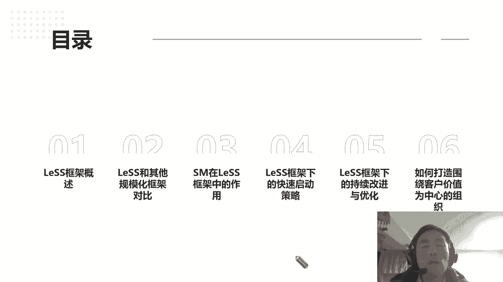
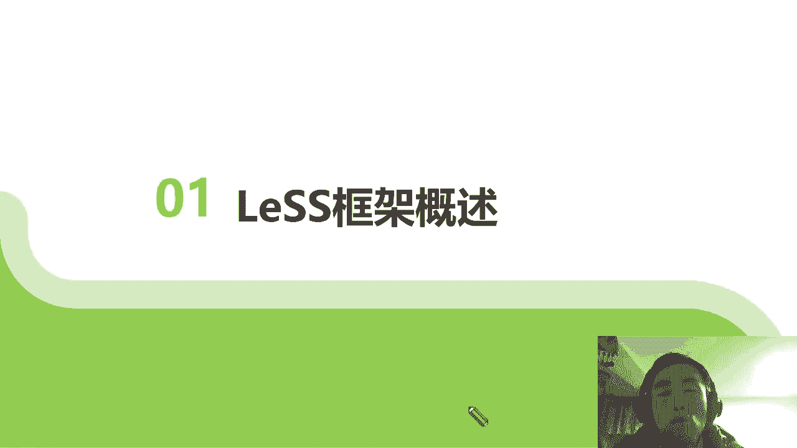

# 高效团队构建实战：7步迈向敏捷巅峰 - P1：1.敏捷有标准答案吗 - 清晖Amy - BV1zi421Y7Hh

正式的课我就开始了啊，因为啰啰嗦嗦也讲了56分钟了，所以我很想看一个问题啊，这个图片呃我就不说是哪个企业发出来的，是我在今天正式上课之前的，应该是15分钟啊，有一个群内一个伙伴发出来的。

大家也可以猜一下是哪个企业发出来的，这是他们的一个类似于一个研发，这个整体的一个报告数据，大家有没有发现亮点在哪里啊，因为我看到那个群里有有一些老师啊，也是那些可能业界可能比较真的老师。

就第一就第一个就抛出来问问的是什么，大家有没有看得到的，老师老师是湖南人啊，湖南长沙，坐标，有没有同学可以看得到的，你们觉得哪个数据对你们来说是特别的打眼，不一样的。

对应的老师的在今天这个片子的一个问题，我就想问一下大家，价值有答案吗，就是每个人的价值或者这个产品的价值，或者我们企业的价值是有答案的嘛，嗯我看到有很多同学讲研发占比啊，研发占比74%的研发啊。

为什么我们要招这么多研发人员，那这个我觉得倒不好意思说呢，我觉得呃包括今天有个数据呃，呃一个统计啊，好能说中科院的研发投入1000多而已啊，后来华为的研发，将近就是比就是将近比华为的研发。

不知道多了多多少个亿啊，但是大家很多人可能在奇怪，为什么中科院的跟华为的真正创新的产出，差距了那么大啊，其实你会发现，其实我觉得国家对研发，我包括我们每个企业对研发的投入，其实这个是很这个很好理解的。

因为在软件行业，而且我这个发的其实是互联网的巨头公司的哈，我不知道是哪个企业了，其实大家猜也猜得到他发出来的时候，包括我跟那老师说了一句话，我第一天想到了哇，新增了29。4亿的代码，2。九二十九。

400000000行的代码，那这个它背后产生的价值是什么，就我第一个问题想问自己的，其实我不知道跟大家有没有分享一个点啊，有没有同学在做研发，或者说你们公司有在管理研发的，我就举个例子啊。

我不知道有没有可能是同学，同学是呃，不是i it业的，可能不是i it业的，对代码没有这么敏感，那这i it业的研发，我们很多人一般是怎么衡量研发的产出，就是看他每天有没有提交代码对吧。

如果你这个研发的人一天都没有提交一行代码，你肯定没干活，没工作，我干嘛还给你工资，所以很多代码行这就变成了一个研发了，一个绩效考核，一个关键的指标，那大家可以想想，再一下。

假设代码行变成了研发的关键考核指标，那我不知道有没有做研发的同事，就可以知道，你要把本身一行代码可以解决，逻辑变成十行去处理的复杂度很难吗，我觉得肯定不会难哈，这个答案是肯定的，包括现在有用GPT去。

或甚至去写一些智能化的代码，你可以无限的把它发生扩展，你可能写了100行代码，也也只当了别人一行代码，一个功能或者一个能力，甚至它可能的效率更低，其实关键就是说这一行代码，这一二十九一。4。

一行代码到底背后解决了多少个问题，那这7000个研发项目，那个数据我就不用说了，因为这个公司是我之前很有意思，我是在做类似的培训的时候，认识了这个公司，在非常牛逼的。

因为他们是他们公司特色的做游戏啊哈哈，所以他们做游戏，我就好奇诶，你们是不是所所有的游戏，像他是天美工作室的啊，哎呦说说说漏嘴了啊，所以是不是像什么某某王者样的都这么火，他说不是的。

他们公司可能就100个游戏，才能孵化出一个个两个的爆款，其他99个都是失败的，其实我在想提个问题的时候，那98那99个失败的项目，那么多行的代码，那么多研发的产出，它的价值是什么，因为失败。

代表着这个游戏压根就可能不会上市啊，在内部阶段就over了，所以我在想这29。4亿行代码，当然我还是尊重每个研发的过程的产出，我觉得他们确实付出了劳动，付出劳动，但我认为他们得到的也就是。

他们付出劳动所对应的价值，是不是这29。4亿行代码所代表的，因为这个数字看的很恐怖啊，所以可想而知就是一个问题，在问我们自己的时候，这到底我们在定这种指标以及代码行业，评估一个研发效能的时候。

有没有没考虑到这些代码背后的价值是什么，这些价值对于企业的价值是什么，甚至对我们个人成长价是什么，我跟大家可以说一下，假如一个代码好像你老师管过很多年的质量，管理就是质量。

我跟很多同学在上课的时候有分享说过，假设我们设一个我们的所谓的我，因为我原来管的就是测试质量团队的时候，那大家知道质量团队最好衡量的指标，你找到了开发了多少bug，就像大家来找茬那个游戏一样的。

你找了开发了多少个，查出来了，代表你的研发，代表你的测试质量的产出，那结果是什么，那结果就是变成了大家哎努力拼命的找茬，所以我带的测试一些同事，一些人员有可能一个研发，它可能就是一个bug。

他可以把这一个bug拆成五个六个bug，因为我们是以bug数来衡量它的，一个工作价值产出，那好那这就变成了一个典型的问题，那后面就变成了研发跟测试就非常的对立，因为对应测试的bug数又是考核研发的质量。

就我们测试觉得找出的bug数越好，代表我们的质量啊，效果越好，但对于研发来说，他被找出来的bug数越多，那它的开发质量越低，他越被考核扣绩效的，这关系到每个人KPI的，那你说这个不打架才怪，对不对啊。

所以我们会发现，一旦定义了一种指标，种结果的同时，我们一定要想想，这个指标的目的的价价值是什么，它背后到底体现了真正的一些什么意义，所以再回到这个问题，价值有答案吗，啊我为什么呃。

发了埃隆马斯克他这个话了，因为我我并不是什么特粉啊，我也没有，因为我买的车子都是买的比亚迪，我也没买特斯拉，但是埃隆马斯克有句话是让我特别特别觉得，还是比较有有共鸣的，他说了他他不尊重任何的伟人。

但是但是他尊重一切对社会有贡献的人，有时候再想想哪边，今天早上我每天早上跑步，而经过一个呃就是垃圾站的一个环卫工人，他在清扫着大马路，清扫垃圾啊，我我突然觉得其实它所产生的价值，我甚至我觉得。

可能远远高于我们所谓的一些核心的，一些it人才，每天所做了些无用功的价值，因为他至少为一个城市创造了美好了啊，当然其实我并不是这么说啊，我说并不是说我们的技术人员不如，一个环卫工人，我只是说他所做的事。

对于社会反映呈现的价值来说，所以价值有答案吗，你发现不同行业，不同角色，不同角度其实都有不一样的答案，但是我觉得埃隆马斯克这句话说的很好，就是对于社会对于我们这个社会整体，包括企业的价值观也是一样的。

企业是有真正它存在的意义，是对于这个社会是有价值的，而不是只是为了卷材啊，可能老师讲的稍微啊大一点或者宏观点，但其实大家可以反问一下自己，就说我在这个公司这个企业的价值是什么，其实包括老师。

因为老师已经过了十这个坎了，那很多一些身边的伙伴或者很担心，哇塞要被公司裁了怎么办，今天我也知道很多我们i it行业的，同一些我认识的一些同呃一些朋友啊，可能就失业了，工作不好找，被裁员被怎么样。

但其实你会发现为什么被裁，其实我我刘老师客观来说，我是从来不担心被裁，并不是说我觉得我自己多牛会怎么样，我从来不觉得，而是觉得我可以在任何地方都发挥我的价值，因为我觉得一个人的价值一定是不依赖，你。

是在华为，你是在中兴，你是你是在阿里，是在腾讯，你在这个公司的价值，公司给你发多少钱，是的价值，而是你在任何公司任何岗位，你所具备的能力给给这个企业，或给客户能解决什么的问题。

所以这个才是我们个人的真正的价值，所以我并不担心，我真的如果说在这个公司可能失业了呃，会没饭吃怎么样，因为我觉得我在努力实践行，自己的一个个人价值，我觉得我也能为社会企业能创造一些价值啊。

所以回到今天的一个分享过了啊，所以价值有答案吗，如果价值没有答案的话，那我们做敏捷的目的是什么样的人是吧，哦我看到还有同同学在发糟烧人广告了哦，欢迎欢迎啊，我觉得今天来上我的课的一些学生。

我觉得可能是来同学，我觉得可能都是特别优秀的，因为知道刘老师一般不走寻常路，我一般不喜欢跟大家讲太多的理念概念，包括我也不是什么大厂出来的，因为我认为任何我觉得不管是华为也好，或者是中兴啊，啊阿里啊。

腾讯也好，大厂他们的创始人有他们企业的一个价值，以及他们的一个规范，但不代表你离开这个企业以后，你能把这个东西能复制出来啊，所以我一直跟大家强调的是，任何一个企业的一些问题，大家一定谨慎的带着一种角呃。

一种一种一种什么视角去看，不要想着就是把照搬一个别的企业过来，你就能解决所有的问题啊，这个老师还是谨慎的提示一下，也是老师踩了这么多年的坑啊，所以这样子是没有绝对答案的啊，那回到那回到下一个点来说。

我们一起来看一下啊，又一个问题问到了啊，这个题就是敏捷有没有标准答案，我本来想找一张标准答案图的时候，哎突然收到，还有网上有张知乎，这个很有意思，人生没有标准答案啊，这个我觉得不用说了。

我每次我记得我每次上ACP的课的时候，我最后一张片子，我就是跟我所有的学生告诉大家，我去我我觉得瀑布跟敏捷最大的区别是什么，瀑布就是说你的人生就像计划，好用的计划驱动是吧，你喜你幼儿园读什么幼儿园啊。

又没深圳那么做父母的，一个一个在线的同学伙伴，有没有想过就这样的，你是不是个孩子也这样做，那安排孩子读什么幼儿园啊，是什么是什么，有什么师资啊，是不是有双语啊，是不是伙食好啊。

孩子读完幼又上什么样的小学，这个小学的呃，同学素质怎么样，老师素质怎么样，离家近不近，那孩子在上什么的，初中，上什么的中学，在上什么高中，是不是，我感觉刘老师小时候就就我就觉得像这样子。

一步一步被安排出来，因为刘老师是部队大院长大的，甚至我的父亲就是就很早就规划好了，你一定要去读军校，毕业就到部队里，老老实实拿个铁饭碗混日啊，当然了，现在我我出来了，我并没有留在部队里，虽然读了军校啊。

所以可想而知，我觉得就是说传统的瀑布呢，其实大家都是按照计划，如果计划也偏离了，哎，比如说我要我的孩子马上要考这个，像我们湖南比较卷啊，湖南知道有名的像师大啊，我们讲四大有四小。

四大就是有四个比较出名的高中，那基本上全国都排得上号的啊，那如果说你对标老，你的孩子也想师上师大中的一个哎，比如老师是师大附中毕业的上师大附中，那你上师大附中的时候，你看你孩子分差有多少。

你根据这个分差调整计划给你补什么班，然后你会根据这个班监督还得学习，你是不是觉得你自己就像一个标准的一个项目，管理师一样的，在严格的计划你孩子的一个这个项目的交付，当然我们回到如果孩子他不是个项目。

是个产品啊，因为项目是一个什么啊，从说白了就是项目要解散的，就是上肯定可能上了，老有很多同学说，哎我的孩子就是个项目，我把他抚养到读了大学我就不管了，他就可以自己找了，其实很不现实对吧。

因为你很多家长做不到，那假设你把孩子做一个产品，产品和项目的区别是产项目本身是孵化产品，那产品是无限可能的，因为产品一开始是不可能被精确完整的定义的，而且产品定被市场所检验的，假设我们今天以产品的思维。

来看这个孩子的成长的话，那你会发现怎么样，孩子是没有标准答案的，对我觉得所以说孩子我觉得就是转转货过来，我就讲到今天这个片子，就说对于敏捷跟瀑布的区别啊，那瀑布你是有了答案以后，按照答案去调整做计划。

那敏捷是什么，敏捷我们先找最小的一个MVP，唉假设我的孩子读了幼儿园，读了小学了诶，他像我一样，像我的孩子读幼儿园，小小学的时候对足球特别感兴趣啊，然后我觉得哇这足球搞不好，未来中国下一个梅西啊。

我感觉孩子特别棒，比我当时牛多了，然后我就花了很多精力去培养孩子练足球啊，去踢球，但现在我突然发现这4年级以后学习压力大了，孩子不喜欢踢球，他觉得踢球是种负担，还有逼着去踢。

所以刘老师作为一个不合格的项目经理，我有点精神有点崩溃了，因为孩子不按照我的计划走了啊，所以现在我经历了这一个寒假的挣扎，我转换了一个思维，哎呀我干脆做产品思维，我就跟我孩子好好的聊了，下探了一下。

就说他想成为一个什么样的人，还是说他可能就想做做手工啊，他喜欢做一些什么小手工啊，小东西，他不因为他确实我觉得踢球还有天赋，客观的说，因为我觉得一个有能力的人不去做这个事，太可惜了。

就像你你摆了一盆好菜，你摆了一盆非常美味的佳肴，你把它倒掉一样的，我就觉得这种感觉，那现在我也接受了，因为我觉得孩子他对自己有价值的认可，因为他已经十岁了，4年级了。

那他觉得它的价值可能有些改变不一样的点，那我也逐步调整自己接受了，所以敏捷的模式下，就是孩子在不同阶段找到自己的价值方向，我们家长是更好地支持他，而不是约束他啊。

你刘你很多同学也知道刘老师课喜欢讲教育啊，因为讲教育确实也是我贴贴身的一个痛点哈，因为我家里两个娃，为什么我觉得可以讲讲组织转型，因为两个娃再加我一个基本三个，你可以做一个敏捷小敏捷团队了，哈哈是的。

我家孩子说普普通通挺好的，其实有的时候我也反过来想一想，哎呀你也没考上什么清华北大，你也没拿到什么麻省理工学院，你也没上哈佛，你凭什么要求孩子一定要学习，八戒就到底这个要求哪里来的。

其实还是我们自己的心魔，对吧啊，所以说并不是只是说让孩子放任不管，其实我觉得关键是说，我们要定期的像敏捷要迭代一样的检视，孩子想发展成为什么样的方向，我们给他支持资源，给他足够的发展啊。

我觉得这样应该是最好的一个方式，所以敏捷回到这个问题来，人生没有标准答案，那敏捷有标准答案吗，哈嗯所以我觉得问题答案，因为老师既然提到反问句，那答案是肯定的，我觉得认为老师民间没有标准答案。

所以我不管说有的同学学了safe的啊，包括老师讲类似的啊，嗯包括还有同学可能讲的其他规模化的，我觉得真的没有百分之百的标准答案，只有你这个企业或者当下哪些敏捷框架，可以找到你解决答案的思路。

我觉得这是学敏捷一个最大的意义啊，我这里还是跟大家强调一下，敏捷没有标准答案，所以没有标准答案，又回到这个问题过来了，我们为什么要去设计，去做这个规模化转型，我今天其实你也换了一下。

本来是想的就是讲类似，但是后面发现很多同学不理解什么是类似，搞不清楚啊，所以跟大家讲一讲，类似是我觉得更多的，它是一种规模化组织设计的一种框架，它并不是一个非常就是可能很多人说。

别人很多同学是想的太理想，很虚的，其实但我觉得还是很我觉得落地肯定是没问题，但是落地你说怎么让企业组织去调整，类似这个事没有个标准答案，你就说你告诉管理层该怎么怎么做啊，组织该怎么设计。

怎么怎么怎么没有，他是告诉你找组织设计的思路啊，又回过来，今天我正因为我觉得是规模化，敏捷敏捷都没有标准答案，所以我今天更希望跟同学们探讨的是，我们为什么要采取这样的思维方式，去重新理解这个规模化。

跟组织转敏捷转型或者组织就是归你组织设计，规模化组织设计的一个一个意义所在啊。

所以我们先看一下。

