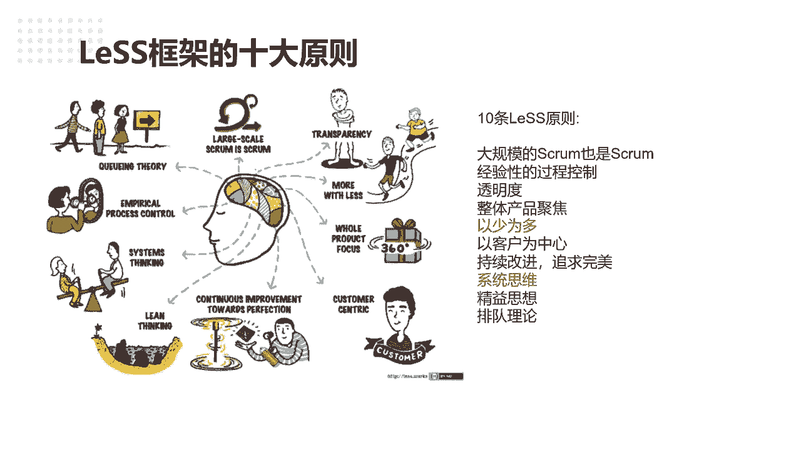

# 高效团队构建实战：7步迈向敏捷巅峰 - P3：3.Less框架的十大原则 - 清晖Amy - BV1zi421Y7Hh

想因为今天也不是讲类似的课，只跟那大家分享一下这个框架啊，让大家找到一些。

你们回去可以带回去做组织转移，甚至你回家带娃。

或者你工作中啊，你是做管理者的，不管你是什么岗位的，只要你是管理者，你只要你跟多人个人有联系的，可以帮助你找到一些思路啊，所以类似框架啊，它其实都十大原则，这个稍微给大家分享探讨看一下啊。

就是一个是大规模的SQUA，也是SQUA，所以类似的核心的点他都有SQUM的因素，并没有重新编一个框架出来，我觉得这个点是非常尊重啊，就是SQUM本身那个框架一个一个核心点的。

就是它还是跑的SQUM的核心的一些内容，东西啊，这个就是不需要你别别把什么PO，把square master改成什么项目经理改成什么东西。

不需要你去改调整啊，还是squad的方式去跑，那经验型的过程控制，这个怎么理解，就是我们想到做事情，就是我们我我因为我之前带了一个客户。

很喜欢讲一个什么叫最佳实践，就是最佳时间，我只要在这个团队找到最佳时间了，我也可以不断的复制，这并不是一套并这并不是一，我说并这并不是一种完全错误的方式啊，因为我觉得这项实验一般在工业革命的时候。

是比较适合用的，是什么用，就是我假设在这个流水线上，我实践了这样一种生产作业方式，那我可以把这个最佳时间复制到其他的工厂，流水线去管理，因为大家本身就是个工具人，我只要按照流程，大家按部就班。

一个螺丝，一个螺丝拧好就可以了，我觉得这种注销实际上可以扩展，但是如果在软件开发，甚至在我们这些创新型的行业里，我觉得是没有所谓的最佳实践，就像我刚才说的，并不是你在华为做得好，并不是你在阿里。

不仅在腾讯做得好。

你就一定能复制到你在当下企业做得好，所以还是那个原就说你一定是结合你踩的坑儿，找到解决思路的办法，然后再不断的优化调整，这个叫经验型的过程控制，就是依据我们当下的经验以及不断的去整合。

去控制调整我们的过程啊。

经验型指导，所以这个是更加提倡的，所以经验哪里来，一定是你在现场中我们叫金奖够C啊。

从现场带来的就一定要你下去。

看看你当前的组织工作是流程什么模式的，当下是怎么样的。

找到他们当下的问题，我们再来去优化调整啊，就这类似的提倡的原则。

所以类似它就没有给你个标准化呃，12345678，你要怎么去做做怎么去做啊。

其实更多的对于组织来说，他是提倡结合组织的情况来调整，那透明度这个就不用说了，那透明度是非常重要的。

我认为是说一个嗯一个团队，你看他敏不敏捷。

最简单的方式你就看他敢不敢透明，敢不敢试，骡子是马拉出来遛遛。

敢不敢把你当下做的事情放在看板上晒一晒啊，所以很多团队就是做着做着可能就是觉得哎呀，以前你看老板每天叫我们开战例会对吧。

展会上怎么过的，就是说今天我做了什么啊。

我明天要做什么，就大家把事情过一过，后面做着做着就变成一种诶任务汇报会。

特别我听到很多一些团队我很就是我很反感，就是说近来我报告老哎刘老师，我今天完成了10%，刘老师我明天完成了20%，所以你会发现这个事情大家觉得有透明度吗，你会发现一个事情。

如果说按照我们的产品交付duo d标准来说，他99%的事情，你觉得他能算完成成功吗，还是没有底是吧，就像传统的项目一样的，我传统项目做了90%，就传统的项目做90%，什么90%。

可能说就是在上线前的测试验证了，那你敢说这个产品你一定能用吗，一定不会失败吗，没有人敢保证是吧，那马斯克新建试了那么多次了，那为什么，因为马斯克第一性原理我也很赞赏，就做这个事。

它到底需要哪些材料构成什么，为什么他的新建要用不锈钢去做啊，有人说的节约成本怎么怎么样的啊，其实你会发现啊，就踏到最后一次的时候，你看新建失败那么多次，甚至他们失败鼓掌，没有人知道一定能成功。

哪怕做得那么严密仔细的计算了，所以不到最后没有人知道，就是做传统的项目，没有人知道成功的，但敏捷什么意思，敏捷是90%的项目，是说你90%的东西我都已经上线了，我只有10%的功能点还没有上线。

那这个产品能不能用，因为产品已经在用了啊，所以这个就是一个点，我说透明性，所以敏捷中会提倡我们只有零跟一的概念，做还是做完还是没做，而没有做做那个百分之百分之多少进度。

因为我觉得这样进度是个伪进度，所以为什么任务我们提倡我们看板上的任务，一个任务不超过16个小时啊，并不是说不能写个48小时。

而是尽可能让我们的透明度，让团队开战会的目的就是要每天提倡透明度，而不是向领导汇报，是希望我们团队有个透明度的一个氛围，让大家知道彼此的工作诶，他的任务明天要完成的时候，我可以协助做他后续的工作了。

这是敏捷中非常重要的一个透明度，一个程度啊，那同时对于整体的产品聚焦，也是一个很重要的原则，就是我们要理解我们的产品是什么，这刘老师本身也是做工具链产品的啊。

我的我的团队带着团队也是做工具链的，那你会发现诶，我们这个工具人到底是个研发项目，管理的工具链，还是这个持续集成的攻略，还是一个度量的功能，还是个测试工具链，你发现就是每个环节。

你可能看到的角度都不一样，但是假设我我我就我经常问我的一些同事大姐，你想想我们的真正的用户。

客户的画像是什么，客户画像是我们的真正的研发在用的人员吗，真正是我们这些呃测试工程师，研发工程师吗。

而用户可以理解，那你讲客户是谁，客户是我们为我们产品买单的人。

它决定我们产品最终的价值更值得。

所以客户的视角是什么，客户是希望啊，这个当然肯定是希望。

这个工具能能给他的团队的带来带来价值，那还有一个希望一个点，就是说也能节约节约它的一个管理成本是吧，你不需要他天天去守着团队去看他的情况了，我能更加好的向管理层级的呈现，那这个就是从整体产品层面。

一个视角去看一些问题一点，而不是局限于我只做一个测试的工具，我只是做一个开发的工具，我只做一个需求的工具啊。

所以整体产品聚焦是类似比较提倡的好，以少为多，这里我特意画了啊，就是这个我觉得是类似最最最核心的点。

一会我单独跟大家讲一下为什么啊，单独讲一下为什么，那以客户为公中心也是一样的。

其实也是核心的点，我讲了，就所有的东西产出评估都是以客户为中心。

所以做销售的同时，我觉得其实都有很大的一个潜能跟潜力，去做做PO啊，因为你们是最离客户最近的人啊。

这个是很清楚能知道的，那持续改进这些完美，我这个就不啰嗦了，因为这个呃持续改进就是大家知道戴明环吧，嗯代名环PDC的代名环，那代命环本身就是带着持续改进计划，驱动结果检查啊，这ACX型改进是吧。

所以本身就是个持续改进过程中，以任何我觉得事情一定没有一个终点敏捷，也没有一个终点，团队也没有一个终点一定能持续改进，追求完美啊，那系统思维，系统思考这个层面刚才也提到讲了，所以我们做任何事情的分析。

一定从全系统的角度看讲，而今在丰田公司，有个很有个非常经典的叫额外的一个问法，就是连续问五个。

为什么才能找这个事情的原因，而且举个例子就说诶他们供电公司看到诶。

这一批的产这个什么产品的啊，就是相对质量就是次品比较高，质量不是很好，那很多人就会想，那肯定是研发的问题，开发的问题是吧，然后会发现再问下为什么会这些词量不好，而发电开发是他们做产品研发的时候。

用了比较便宜，就便宜那些原材料啊，就是像摆像摆了，就比如说一些原原材料可能质量没那么好，那为什么用便宜的原材料的质量在问的时候哦，哦原来是这是财务的预算要求预算有限，那为什么这个预算是这么有限呢。

就是要卡这种财务指标，那原来今年公司给财务部下达了就是节约成本，卡KBI就是财务部门的KPI，所以导致了这个东西的质量可能就会越来越差，所以这就就是深层次的问题啊，深层的问题啊。

我刚才跟与同学的分享看发了一下啊，啊所以就是啊团队不肯透明的时候。

其实刚才我看到有同学在说了，其实还有很重要的点，就是说很重要。

那我就问一下，那你团队为什么不肯透明啊。

哈哈其实就是啊我们的那我们的超同学啊，我们可以看一下。

你可以想一下团队为什么不肯投币，是不是我觉得很现实的过程，就是因为老员工太多了，老员工觉得我现在做一天和尚撞一天赚很好，我的事情如果透明化以后，其实我一天可以干完的事，我跟领导报了十天干完啊。

这个是很现实的事啊，就是这个东西我也理解，因为还有很简单。

我原来提过老员工的工资不加，对吧啊，新进来的新老工资倒挂，很多企业就这样的哎，新招招一个比老员工再高，那老工想我该买多干活，我干嘛要把我的事情透明化，我就不交出去，怎么滴，有本事把我开了，还要赔款对吧。

所以回到企业本身的文化的管理层，做敏捷的目的是什么，是吧嗯，你做敏捷的目的真正意义是什么，你是以更大的要压榨团队，去产出更多的剩余价值，还是要团队能转变思维，为公司的价值去着想，我觉得这个关键点。

因为很多人团队一些领导来趁着民间的干练哦，哟小步快跑多好，记得啊。

刘老师课，我从来不会说敏捷，SSCM都是小步快跑，这是我跟大家反复强调的。

这是因为你讲多了，就是给自己老板洗脑一个误区，因为小步快跑就是表示你原来是散步啊，原来你走着走过去要10分钟的。

你小步快跑5分钟走过去了，你同样一个人怎么可能呢对吧。

所以一定要想清楚这个千万不要乱说话啊，所以确实跟公司的文化有很大的一个关系，其实我个人还是建议大家就是说透明透，这个程度一定是组不来，就是跟我们的超同学。

我跟你分享一下，就是您可以先找一下痛点，为什么让团队去疗效。

你为什么不愿意透明啊，摸鱼就是如果真的摸鱼的话，我觉得呃我个人建议啊是真的，就是说长痛不如短痛，快刀斩乱麻，如果这个团队整体大家都在摸鱼，都在做事，那何不干脆点就是吸引点新鲜血液进来，那从头开始。

那总比这样样子，因为呃做久了真的会影响整体的氛围，你要想想一个新员工刚进来闷着头哦，好好开心做事，发现你老员工都得PO丢更多的活给他，那到最后那大家新员工都变成老员工一样，大家都在摸鱼了哦。

原来摸鱼就是文化，当然没有人敢说，因为越大的企业就百分之百，我说200%一定有人摸鱼，那我身边的一些我也看到啊，哦新浪跟我这些同事也吐槽啊，某某部门的一些人，还有我觉得真的是浪费公司资源。

就是为了做而做，体现自己的价值求存在感，因为我觉得认真正一件事的价值，不在你说出来的，而是在你交付的产品对应的客户，交易的一些一线的一些同事，别人给的反馈啊，所以这个才是一个真正价值点，好吧。

就一部门推行敏捷，我觉得还有一个观念就是很重要的，就是领导他到底有没有这个狠心，因为我大概可以分享一下，为什么外企人好推敏捷，而有很多说外企文化比较open开放，其实不是的，哎也没有，那么你没外形没有。

那么我们开发核心点还是外企的企业的，它的氛围。

他的主人开放是对他的怎么样，它的开放是对于整个工程文化层面。

就说我知道哦，因为我之前听到有普华，通永道的一些一些个朋友说了，那他们些大的现象，普华永道这么大的一个外企咨询公司里面，如果说你说对于下属有一句谩骂，或者说有些不合理的讲话，被公司hr n知道的。

你可能立马就滚蛋走人，其实就是提倡你要尊重每一个人的产能付出，所以外企的文化就决定了，所以外企推的时候。

大家自然觉得每个人都是平等的，我们没有阶级头衔。

那为什么我们的国企，为什么我们的传统行业难推，就是我们的岗位层级。

烟筒是职能体系太多了，这也是我去说来说去，敏捷，其实并不是说做不了，转型不了，而是这个利益链就部门部门，领导和领导的利益啊，这个利益强太深太重了，所以导致没人敢推动这个利益强，因为你可能推了以后。

那可能自己搞不好，这个部门就被干掉了对吧，我也说的很现实，刘老师也过来人，那大家都会明哲保身，没有人愿意在企业里做革命，那时从改革的时候就留一留一口棺材，给自己准备100口棺材。

那其实我们发现企业里真正你说敏捷转型敏捷。

你说真的有本书叫敏捷革命，为什么我推荐大家去听。

因为这本书我觉得敏捷革命就是很现实的革命，一定是就是革了一部分人命。

革那些摸鱼人的命，那没办法的，就看企业里有没有这个动力去革这些命，但其实你会发现，一旦你自己不革命。

你迟早会被别人革命，也是为什么我今天回到头跟大家伙分享说的，因为刘老师也经历过懵懵懂懂啊摸鱼的阶段啊。

在以前的公司哎。

大力觉得公司就给我这么点工资，那我认为我的产出就要对得起这个工资行了啊。

其实我可以做更多的事情，但我干嘛，真的我原来一个前公司啊，我就不说哪个那个大国企了。

不是国企嘛，就是类似于国企样的，他就是把员工，你今天是不是九点钟下班回家作为KPI，如果你提前回家了，那你这个月的绩效就考核被打啊，我们一般ABC嘛就打C直接扣钱，那别人会觉得我本身能力很强的。

我白天啊八个小时可以干完事情的，结果别人能力很差的，要浪费公司更多的资源，要花12个小时才能做完事情，结果他的绩效比我好，你们觉得合理吗，是不是这个很现实的问题啊。

嗯所以说你后面发现企业都是以加班来评估，这个团队的产出的时候，哎我觉得这个你儿子应该也快到头了，哈哈好吧，刘老师，我不知道是不是说的可能有点，因为我说的比较直啊，因为我的我可能也是一个。

我觉得应该我希望跟大家做敏捷，更更多的是能回到一个真实的常用，李老师想这么去布道，传到敏捷，我真的是发自内心的一个想法。

就是我真的觉得很可怜，当下的我们的IT的，很多一些开发测试一线的同事。

就是很多这种文化被大家洗脑压榨了，马云说，99607，我们大家都是以我们能加班，能熬夜为荣的时候，我发现我们啊，身体在不断的消耗自己的生命值的同时，离家人越来越远，没有时间回归家庭，没有时间陪家人。

甚至很多同学在一些大企业，什么累死啊，加班猝死啊，都已经，你今天是不稀奇了，现在最近都不报道了哈哈，因为因为可能有很多事情已经不稀奇了。

因为确实可能在很多IT行业公司强度很大，因为特别像一些你要我也知道一些。

你说我们讲讲的不好听，叫卷嘛，那很多一些部门一些领导卷的方式，什么就是压榨部门团队加班，而我加班比你多的，你别在我的上级领导来看似哎我我更努力对吧，虽然我的产出价值你看不到，但你看到我更努力唉。

所以这样的方式，你们说企业怎么可能会有一个好的，还会会让你敏捷转型吗，我一敏捷转型发现哦，原来你做的事情，你天天喊加班，做的事情原来就是别人，你一个星期做的事情，别人一天就搞定了，那你不是要别人的命吗。

对吗，我怎么可能透明，怎么可能敏捷好吧。

那这个事情老师可能发散说的有点多了，其实还是想我也觉得非常很痛。

但是我觉得有的事要去做，所以老师也是愿意反反复复跟大家讲一些真的。

一些敏捷，就是希望大家更多的去实践去做。

做是对你来说有好处的，因为是你在做，你就会有改变，你的人流有提升，你就不用担心这个企业里，真正的企业活不下去的时候。

你还能找到合适的地方，因为我在个业界里，我觉得有实践经验的，你的教练是非常非常缺乏的。

我我经常有时对很多人，一些所谓的一些咨询公司。

出来的一些大规模米鞋专家，我听他讲这个，我就知道哇塞。

我就问了一句，你，你做一个，你有没有做过一个单一的一个SQUM的，全流程跑通，连一个单一的一个单团的时光都没跑过，你好意思说你会组织型民捷转型哈，并不是并不是学了一个知识了，你跟领导人忽悠吹几句了。

你就是个敏捷型哎敏捷型专家啊，我就更加客观的说。

所有你觉得能做组织性转型的人，一定是从单团队一级级往上能做出来的。

就像打仗一样的，一定是战壕里去摸爬出来的，因为主机转型，我们回到开始讲那些没有标准答案啊，没有标准答案，不管你是在华为，你是在阿里，你是在腾讯做过的，没有标准答案啊，好经验思想就不用多说了哦。

这个大家应该也明白，也理解，那经济思想其实这个说的范围比较广，哈哈呃回头我觉得这个是非常好的一个点，我们讲的是如何去更好的减少浪费，怎么画我们的价值流图啊，我觉得这些都可以带到我们的整个敏捷的一个。

规模化框架去去做的，那排队理论我觉得很好的提倡，就是讲看板这个方法啊，看板方法我觉得是在在类似个框架中，非常非常好，一个适用的方式，就是用我们传统的用看板去代替了，我们传统的PMP讲的计划流程啊。

我们可以大家可以老师给大家分享一个点，甚至我们从原有的，大家我不知道有没有大家做每日的日程计划，就是说我每天几点钟做什么事情是吧，三点钟啊，比如说老师早上起来6。7点钟跑步啊。

三点钟呃呃呃就是六点钟跑完步以后，就八点钟上班上班，然后基本上收邮件，第二是干什么，你会把每天安排，就是按计划时间点就推进去做啊，这是可能大家传统的方式，包括很多人在团队工作也是这么列的啊。

就是今天啊这个月做什么事，这个周做什么事，今天做什么事啊，回到人身上，就是每个人写日报周报月报对吧，但其实老师的建议，你从看板或者从排队思想来想一下。

其实我们发现每个人能做同时做几件事吗，真正你问自己的时候，不可能老师刘老师做的早上极限，我有发现最大的困难就是说我早晨是边跑步。

边听书边思考，我觉得我已经把我的身体已经用了极限了。

所以我每天早上跑一个小时的步，我锻炼了身体，我会听一个小时的书，但你还是发现你跑步听书的时候，你很容易走神，因为你没有办法。

你把听到那一刻的一个当下的东西马上记下来，所以你会思维很飘散。

其实效果也不好，比你单独看书差很多，所以没有人能一心多用，大家就是每个人就是个单点，所以你当下只能做一件事。

那就是回到一个核心点啊，就是当下对你来说最重要的事是什么，我觉得这个是很关键的，给大家一个问题，就是可能帮助大家工作生活中的。

其实对于我们讲的敏捷的理念。

讲看板的理念，讲排队的这些思想，进的思想就是你学会排优先级。

你能知道这件事情对你个人而言，对你公司，对你团队而言，当下最重要的是什么，你把这个优先级理解清楚以后，那你一定就不会犯错，并不是按部就班的每天做，而且你每天会有一些新的改变提升，因为这个优价值。

优先级是随着你的个人能力成长，你会不断改变的啊。

啊，所以这个我可能倒是有机会，跟大家再去分享讨论。

我觉得就是从原有的，因为看板那里简单，你代办事项是哪一些，哪项事情优先级最高。

这老师现在看来，我觉得我其这个月我可能身体健康最重要是吧，那这是对我个人来说优惠期最高的，那我就每天起来跑步健身。

而这件事对我的问题是肯定最高的，是起床第一件事就是穿跑鞋出门。

反正我也发现，因为跑了步以后，一天的工作状态就很好。

而且可以提升我工作的效能，所以这个也是可以分享大运动之后，确实可以提升自己的工作效能啊，所以这个就是说对你一旦想清楚，当前最重要的事的时候，你就不需要计划，我今天这个周要跑几天步啊，这周要干什么。

干什么事，不需要想，你直接需要当下最重要的对你来说是什么，你就能判断下件事哪件事要优先去做啊。

因为很多时候大家做了很多事情。

发现没有做到重要的事情，大家也知道个紧急重要的象限。

一旦你因为很多重要的事情都不紧急啊，很大的客观的说这也是很现实的。

