# 高效团队构建实战：7步迈向敏捷巅峰 - P4：4.Less框架与传统敏捷的区别 - 清晖Amy - BV1zi421Y7Hh

所以我们都做了很多紧急的事，没做重要的事啊，好类似框架的核心原则，我刚刚也提到了啊，这里就不拓展再去说了，我这里在唯一多讲点就类似燃墨啊，累死在末，所以老师稍微总结了一下什么叫少比啊，多以以少代多啊。

或者说以少比过更好，就是你看我们在讲类似相比语言中，是以更少的优先级的原则，规则去替代更多的流程，而假设你像如果说规模化的话，我们一般觉得哎加了人了，那我肯定要加管理人员，加了管理人员了。

管理人员跟管理人员协调，是不是要加新的流程规范，因为一旦跨部门了以后，我们要制定新的组织流程规范是吧，但我们发现类似中，我们没有改变现有的任何的管理方面的，一些成绩调整，我只改变了是产品。

因为才一个人的精力有限，我把我的产品负责的一个领域往上提升的时候，团队我只需要专注于精，就专注于当下这一块产品领域的，交付产品的事情，那就可以了，所以我就用最很小，简单的优先级原则来替代更多的流程。

而且我有更少依赖的拆分的规则，替代更多的角色，像传统的我们的一些项目管理，或者讲我们的传统的一些分的开发过程，那我们就需求啊，测试啊，开发呀，还有架构啊，会分的很细对吧，术业有专攻，分的很细。

那就是每个人分则一块，每个角色分分工，做好自己的事，那其实我们会发现在类似中，我们更多提到的是跨省人团队，刚刚提到了，就是我们用更少的依赖，就是我们每个人都能拆分任务，什么是更少的依赖。

我不需要等着需求去拆分，不需要等着开发拆分，我每个人都能参与，虽然大力觉得现在是理想化的，但我换句话回到头来说，从从老师做软件开发啊，我其实我1010104年开始接触软件，做开发行业，我从运维到测试。

你能看我的开发质量都做过，因为我理解，其实每一个岗位没有大家想的门槛那么难，那么高，因为我我我我理解大部分人所在的，就需要非常顶尖的技术，创新的大很多，一些同事，开发人员其实基本上都是在大大的组织架构。

比较固定的框架，依葫芦画瓢对吧，为什么说现在很多开发的东西都可以用AI替代，所以你没有需要他们的门槛的时候，你发现学习门槛没有那么高，你都可以逐步去承担，只要是个人，我觉得都能学会，都能承担。

所以为未来AI替代的就是正是这种，只在个人的这个领域啊，就顾得不出来的，我觉得未来AI的介入能力，你可以一个人可以承担需求，开发测试，交付所有的功能任务都可以做的，所以一旦这个人具备这种能力以后。

你会发现这还需要去分那么多角色，不不不需要分那么角色，那我就在团队中怎么样啊，我就不需要，我只要需要把任务拆分出来，大家去执行就好了，流程非常清晰简单，我不需要等待谁拍任务，而作为这就更少的依赖的拆分。

替代更多的角色啊，所以类似还是再次提倡，我们只有PO是管master跟团队啊，没有说多余的角色出来，那同时还有就是说我们可能用更，这里没写老师啊，就是用更少的描述的标准定义，去替代更加广泛的产品定义。

这是什么意思呢，我们类我们一般讲swam中，我们讲类讲敏捷中，最大的也讲了概率DOD的标准是吧，就做一个产品，做这事情的标准是什么，而不是把产品列得非常细，更加的细化哦，包括我们的验收标准也是一样的啊。

我一般用故事的验收标准来替代，非常详尽的故事的文档，这也是一个思路方法，就是让大家对于交付了最终的产物的样子，是什么样子，标准是什么，他要怎么做，而替代去想象他应该是个什么东西啊。

那还有就是说我觉得最重要的一点，我这里没写，就是用更少的小团队的浪费，去替代更庞大的组织结构，就是说我们发现组织转型中最最怕的是什么，就是个船太大了，你不好掉头，你转型的成本太太大了。

像刘老师经常不是说我们的敏捷是快速，快速试错是吗，哦这个错误成本我是银行业的，我是金融业的，我背不起这个错误，其实真的是背不起嘛，其实可以想一想，真正的是我们是浪费的太多了，所以我们用小团队诶。

我们把这个团队拆分小以后，更小的团队的，更小产品域的一些浪费去替代更大家庞大组织，没办法转型，这样子我们用最小的成本来实现组织化的转型，这也是一种类似提倡的思路啊，好其他这个点我就不说了。

因为前面也说的比较细了啊，能跟大家来讲一下，而类似框架跟传统框架的区别啊，所以类似啊强调了一些专家角色。

而传统的更加啊注重团队的一个平等性啊。

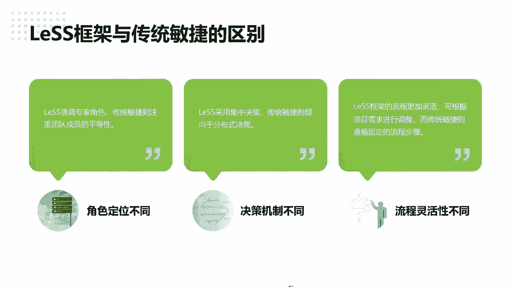

会强调一些啊领域现了些专家是吧，类似采用集中的角色啊。

那嗯传统敏捷的就流程式的啊，分布什么是分布式的，我去跟同学上课时举个例子啊。

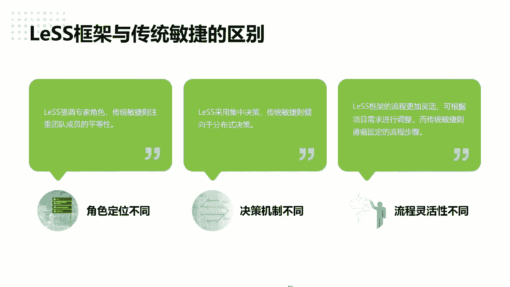

原来我有一个银行那个客户啊，他们之前做需求的时候。

哇塞一个开发需要过来要六七十天，好一看为什么开发团队说我效能很高了。

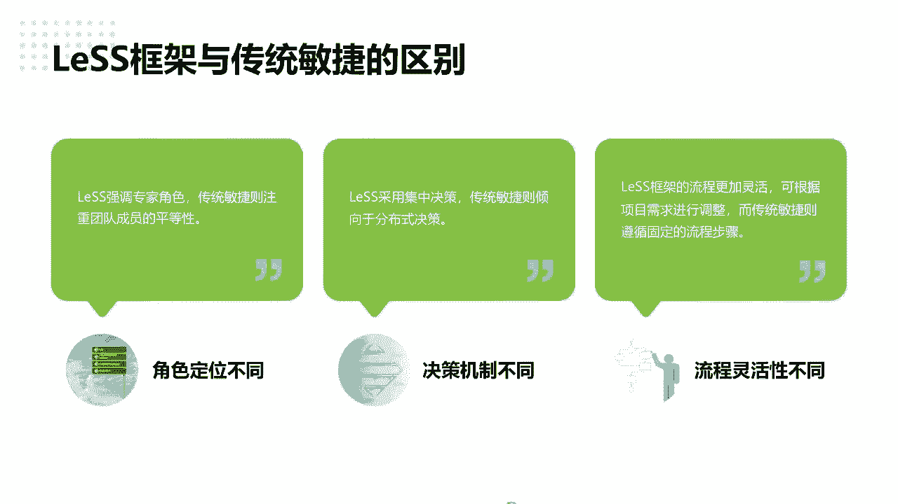

我一个就是两周15天就开发完了。

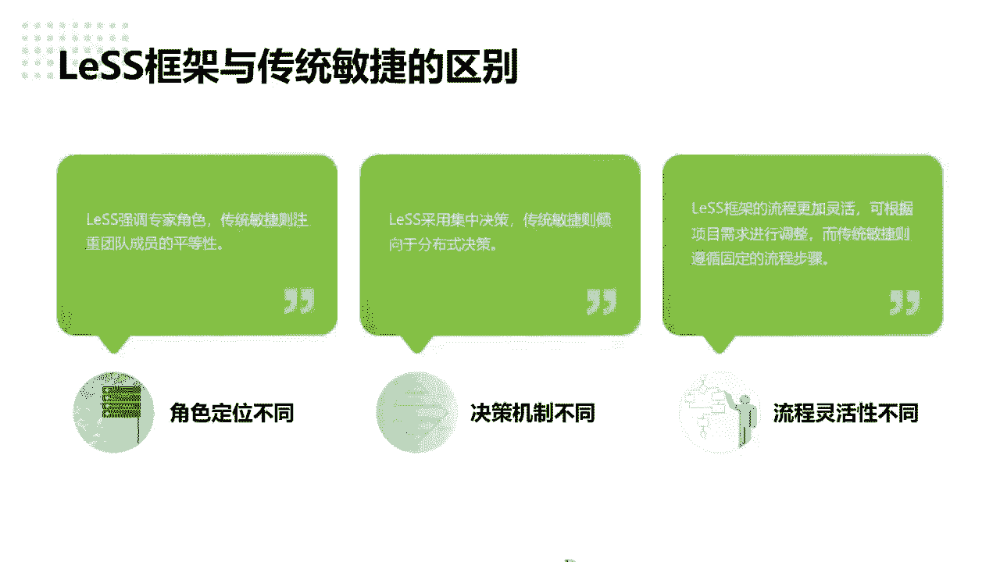

怎么会60天需求流，需求节点就有333十多个。

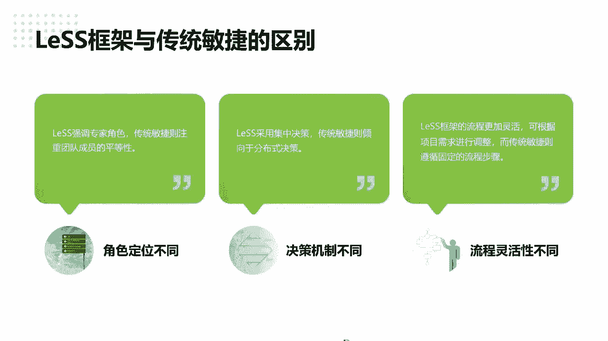

将近40个啊，30多个需求节点审批节点，所以流程想了可想而知。

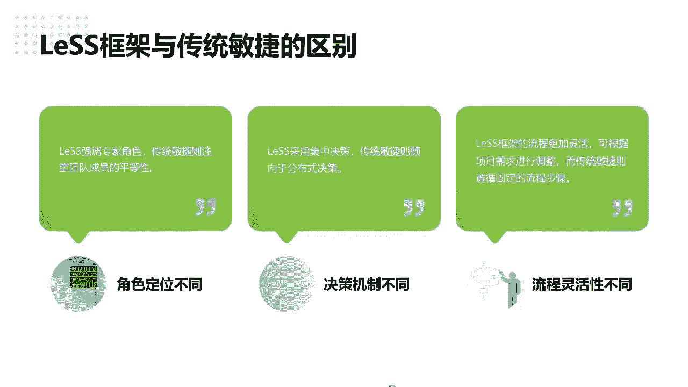

你到底想想为什么在银行业，为什么要他做一个需要这么多的生命节点。

那那课上同学也探讨，分享了很简单的原则是什么。

有没有同学想到就是就避免一个人去背锅。

就是分责，只要你审批了，那你就有责，一旦那个需求出问题，大家一起背锅。

所以很简单，这种模式利益就决定了这个流程就有这么长啊。

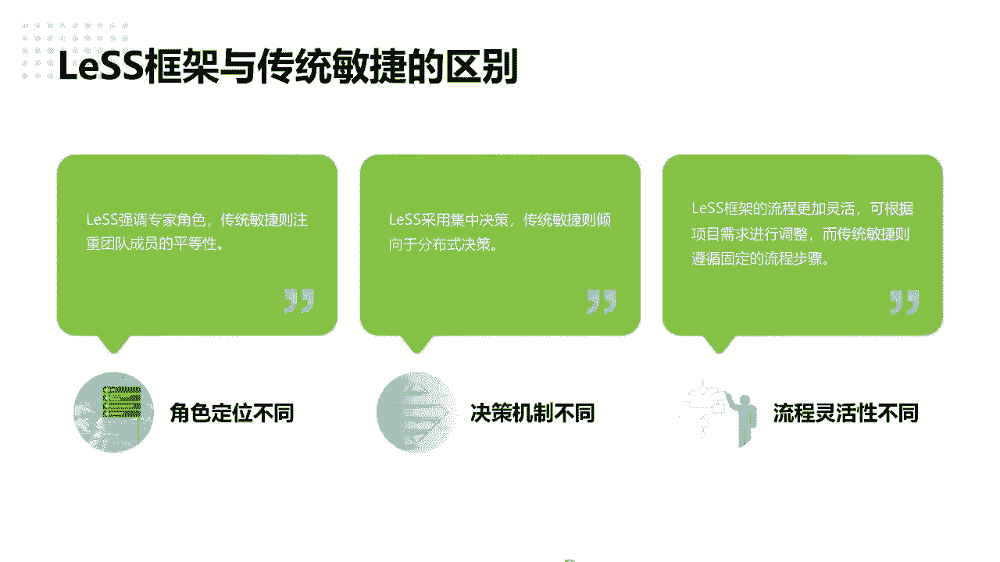

所以分布式是吧，那类似采用的集中式团队对结果负责多。

所以那时候你可能没有提倡，再强调项目经理队对于项目交付负责。

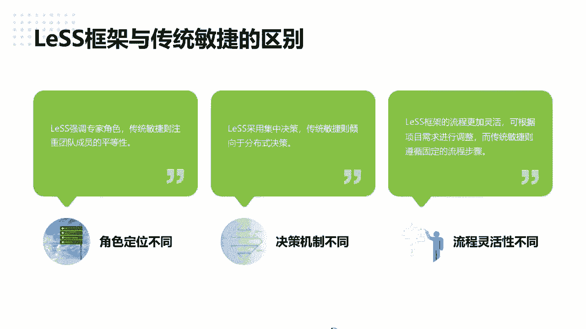

我们更加讲的是产品啊，其实我们讲的敏捷框架并不是适用于单项目。

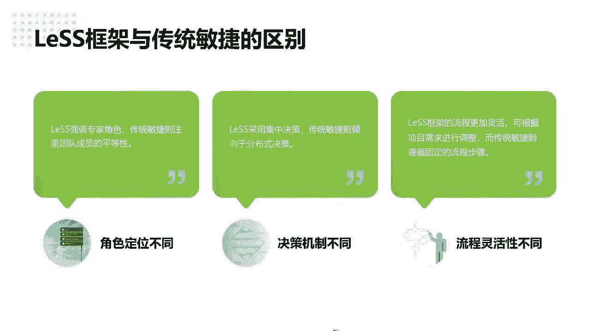

而更多的适用于产品的研发的团队，的一个整体的转型，所以所有团队对于产品交付的结果决策负责啊。

所以这是必要的决策机制。

那流程上也是一样的啊，类似的流程是更加灵活化的。

因为它是可以怎么样根据需求快速的调整啊，所以敏我们讲敏捷敏捷宣言有句话就是，什么样响应变化高于遵循计划。

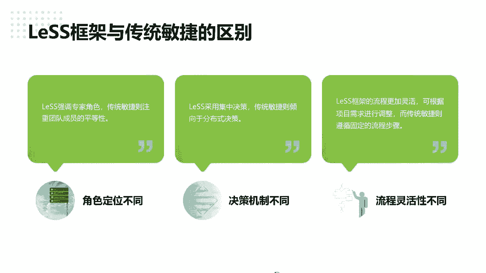

所以还是跟大家强调了，既就并不是需求想变就变。

而是说迭代跟迭代之间，我们可以用需求的优先级，把高优。

把一些就是客户觉得不需要做的，需要替换出来，替筛出来。

调整序列优先级，来快速的响应市场的变化啊。

是这个意思啊，并不是天天改需求，哈哈哈啊，传统的就不用说了。

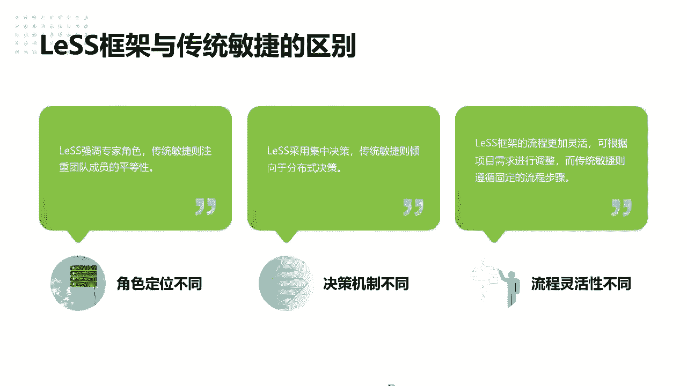